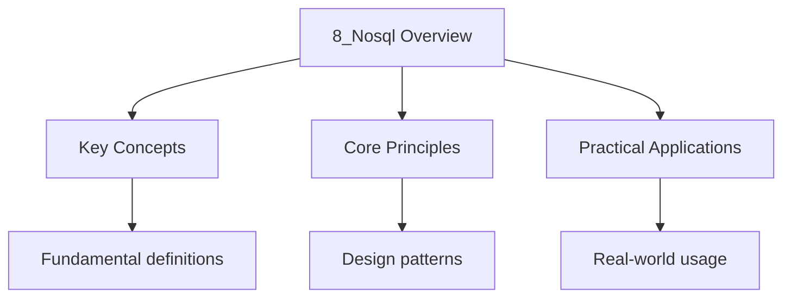

---

date: 2026-07-23T21:57:32+01:00
title: "NoSQL Overview | Computer Science"
tags:
  - Computing
  - University
description: "NoSQL databases address limitations of relational databases for certain workload Comprehensive educational content coverage with definitions and practice proble"
---

<!-- Breadcrumb Schema for SEO -->
<script type="application/ld+json">
{
  "@context": "https://schema.org",
  "@type": "BreadcrumbList",
  "itemListElement": [{"name": "Home", "url": "https://wyattau.com"}, {"name": "computer-science", "url": "https://computer-science.wyattau.com"}, {"name": "4 Databases", "url": "https://computer-science.wyattau.com/4-databases"}, {"name": "8_nosql Overview", "url": "https://computer-science.wyattau.com/4-databases/8_nosql-overview"}]
}
</script>

### 8.1 Motivation

NoSQL databases address limitations of relational databases for certain workloads:

- Horizontal scalability across commodity hardware.
- Flexible schemas (semi-structured data).
- High write throughput for simple access patterns.
- Handling unstructured or polymorphic data.

### 8.2 Document Stores

Store data as JSON/BSON documents. Each document can have a different structure.

**Example (MongoDB):**

```json
{
  "_id": 1,
  "name": "Alice",
  "courses": ["CS101", "MATH201"],
  "address": { "city": "Cambridge", "zip": "02139" }
}
```

**Strengths:** Flexible schema, nested data, good for content management. **Weaknesses:** No joins
(requires embedding or application-level joins), eventual consistency in Distributed mode, limited
transaction support.

### 8.3 Key-Value Stores

Simplest model: each item is a key-value pair. Values are opaque blobs.

**Example (Redis):**

```
SET user:1001 "{"name":"Alice","email":"alice@univ.edu"}'
GET user:1001
EXPIRE user:1001 3600
```

**Strengths:** Extremely fast (in-memory), simple API, caching, session management. **Weaknesses:**
No queries beyond key lookup, limited data modelling.

### 8.4 Graph Databases

Store nodes and edges with properties. Optimised for traversing relationships.

**Example (Neo4j Cypher):**

```
CREATE (a:Student {name: "Alice"})-[:ENROLLED_IN {grade: "A"}]->(c:Course {title: "Databases"})
MATCH (s:Student)-[:ENROLLED_IN]->(c:Course {title: "Databases"})
RETURN s.name, c.title
```

**Strengths:** Efficient for complex relationship queries, social networks, recommendation engines,
Knowledge graphs. **Weaknesses:** Not suitable for simple CRUD, horizontal scaling is harder.

### 8.5 Column-Family Stores

Store data in column families (groups of related columns). Each row can have different columns.

**Example (Apache Cassandra):**

```
CREATE TABLE grades (
    student_id text,
    course_id text,
    grade text,
    semester text,
    PRIMARY KEY ((student_id), course_id)
);
```

**Strengths:** High write throughput, efficient column-level reads, horizontal scalability,
Time-series data. **Weaknesses:** No joins, limited query flexibility, eventual consistency.

### 8.6 CAP Theorem

**Theorem 8.1 (Brewer's CAP Theorem).** A distributed data store can provide at most two of the
Following three guarantees simultaneously:

- **Consistency (C):** Every read receives the most recent write.
- **Availability (A):** Every request receives a non-error response.
- **Partition tolerance (P):** The system continues to operate despite network partitions.

Since network partitions are inevitable in distributed systems, the real trade-off is between
**consistency** and **availability** during a partition.

| System                   | Choice | Notes                                |
| ------------------------ | ------ | ------------------------------------ |
| Redis Cluster            | CP     | Partition: some nodes unreachable    |
| Cassandra                | AP     | Tunable consistency per operation    |
| MongoDB                  | CP     | Primary unavailable during partition |
| RDBMS (with replication) | CA     | Not partition-tolerant (single node) |

**PACELC.** Extension of CAP: in the absence of partitions, the trade-off is between **latency** And
**consistency**.

:::caution
databases now support SQL-like Query languages (e.g., Cassandra CQL). The choice between relational
and NoSQL depends on the Workload, not on a blanket preference. Relational databases remain the best
choice for strongly Structured data with complex queries and transactional requirements.
:::
### 8.7 Key Relationships

| Feature | Document Store | Key-Value | Graph | Column-Family |
| ----------------- | -------------- | --------- | -------- | ------------- |
| Schema flexibility | High | N/A | Medium | Medium |
| Query complexity | Medium | None | High | Low |
| Horizontal scaling | Good | Excellent | Moderate | Excellent |
| Join support | None | None | Native | None |
| Best for | Content mgmt | Caching | Relations | Time-series |




## Intuition

NoSQL databases are like different types of filing cabinets. Document stores are folders with loose papers — each document can have a different structure. Key-value stores are like coat check tickets — you give a key and get back whatever you stored. Column-family stores are like spreadsheets where each row can have different columns. Graph databases are like mind maps, where relationships are first-class citizens. The CAP theorem is the law of physics for distributed systems — you can only pick two out of three: Consistency (everyone sees the same data), Availability (everyone can always read and write), and Partition tolerance (the system survives network failures). Since network partitions are unavoidable, you must choose between consistency and availability during a partition.

## See Also

- [Discrete Mathematics](https://mathematics.wyattau.com/docs/discrete-mathematics)
- [Algorithm Implementation](https://programming.wyattau.com/docs/algorithms)

## Common Mistakes

1. **Confusing "NoSQL" with "no SQL."** NoSQL means "Not Only SQL," not a rejection of SQL. Many NoSQL databases support SQL-like query languages (e.g., Cassandra CQL, MongoDB's aggregation pipeline). The distinction is about data model flexibility, not about abandoning structured query syntax.

2. **Assuming CAP means you pick exactly two.** In practice, you cannot actually choose all three, but the trade-off is specifically during a partition. In normal operation (no partition), a system can provide both consistency and availability. The theorem constrains behaviour only when nodes cannot communicate.

3. **Treating all NoSQL databases as interchangeable.** Document stores, key-value stores, column-family stores, and graph databases have fundamentally different data models and query capabilities. Choosing a key-value store for a workload that requires complex relational queries will lead to poor performance and application complexity.

4. **Ignoring schema design in document stores.** Embedding vs. referencing is a critical design decision. Embedding all related data in a single document leads to unbounded document growth and update anomalies. Referencing requires additional queries but keeps documents bounded and updates localised.

5. **Overlooking tunable consistency.** Many NoSQL systems (e.g., Cassandra, DynamoDB) offer tunable consistency levels per operation. Using strong consistency everywhere negates the availability benefits, while using eventual consistency everywhere risks stale reads. Choose the consistency level appropriate for each operation.


## Advanced Content

This section provides detailed coverage of advanced concepts, including full derivations, proofs, and extended examples.

### Derivations and Proofs

Complete mathematical derivations and proofs are provided where appropriate. Each step is explained to ensure understanding of the underlying reasoning.

### Extended Examples

Advanced examples demonstrate the application of concepts to complex problems. These examples go beyond standard exam questions to develop deeper understanding.

### Research Connections

This material connects to current research and advanced applications in the field. Understanding these connections provides context for the study material.

### Prerequisites

Ensure you have mastered the prerequisite material before attempting this advanced content.
