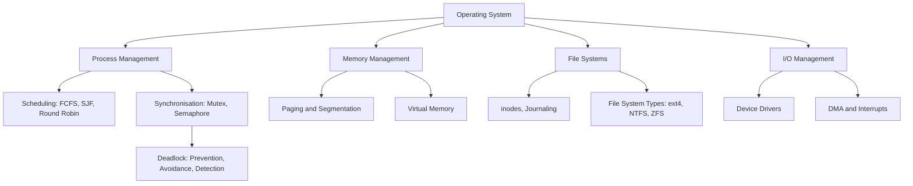

---

title: "Operating Systems | Computer Science"
description: "UNIVERSITY Computing notes: Operating Systems. Comprehensive study material with definitions, examples, and assessment tools."
date: 2026-04-24T00:00:00.000Z
tags:
  - Computing
  - University
categories:
  - Computing

---

<!-- Breadcrumb Schema for SEO -->
<script type="application/ld+json">
{
  "@context": "https://schema.org",
  "@type": "BreadcrumbList",
  "itemListElement": [{"name": "Home", "url": "https://wyattau.com"}, {"name": "computer-science", "url": "https://computer-science.wyattau.com"}, {"name": "Operating Systems", "url": "https://computer-science.wyattau.com/operating-systems"}]
}
</script>

## Intuition

**The invisible manager:** An operating system is like an invisible hotel manager — it allocates rooms (memory), manages guests (processes), handles complaints (interrupts), and ensures no guest walks into another's room (protection). You never see it, but without it, everything descends into chaos.

**Why it matters:** Understanding operating systems explains why your computer slows down with too many tabs, how virtual memory extends your RAM, and why processes can't just access any memory address. It's the foundation for systems programming, security, and DevOps.

**The key insight:** The OS creates the illusion of infinite, safe, organised resources through layers of abstraction — virtual memory, process scheduling, and file systems all hide hardware complexity behind clean interfaces.

## 1. Introduction to Operating Systems

### 1.1 Role of the Operating System

An operating system (OS) is system software that manages hardware resources and provides services To
application programs. It serves as an intermediary between users and the underlying hardware.

**Core responsibilities:**

- **Process management:** Create, schedule, and terminate processes.
- **Memory management:** Allocate and protect memory; implement virtual memory.
- **File system management:** Organise, store, retrieve, and protect data.
- **I/O management:** Control and mediate access to I/O devices.
- **Protection and security:** Enforce access controls and resource isolation.

### 1.2 Kernel Architectures

**Monolithic Kernel.** All OS services (file system, device drivers, network stack, scheduler) run
In a single address space in kernel mode. Examples: Linux, FreeBSD.

- _Advantage:_ Low overhead from function-call latency.
- _Disadvantage:_ A bug in any component can crash the entire system.

**Microkernel.** Only essential services (IPC, scheduling, basic memory management) run in kernel
Mode. Other services run in user mode as separate processes. Examples: MINIX 3, seL4, QNX.

- _Advantage:_ Fault isolation; easier to verify formally.
- _Disadvantage:_ Higher overhead from message passing between user-mode servers.

**Hybrid Kernel.** A pragmatic compromise combining monolithic and microkernel ideas. Some
Non-essential services run in kernel mode for performance, but the architecture is more modular Than
a pure monolith. Examples: Windows NT, macOS XNU.

### 1.3 System Calls

System calls provide the interface between user-mode applications and kernel-mode OS services. They
Are invoked via software interrupts (e.g., `syscall` on x86-64, `svc` on ARM).

**Categories:**

| Category        | Examples                     |
| --------------- | ---------------------------- |
| Process control | `fork``exec``wait``exit`     |
| File management | `open``read``write``close`   |
| Device I/O      | `ioctl``read``write`         |
| Communication   | `pipe``shmget``mmap``socket` |
| Information     | `getpid``stat``sysconf`      |
| Protection      | `chmod``chown``setuid`       |

**System call overhead.** A transition from user mode to kernel mode involves saving user Registers,
switching to the kernel stack, validating arguments, executing kernel code, and Returning. Typical
overhead: $100\mathrm{--1000}$ ns on modern hardware.

## 2. Process Management

### 2.1 Process Concept

A **process** is an instance of a program in execution. The OS maintains a **process control block
(PCB)** for each process:

| Field           | Description                                |
| --------------- | ------------------------------------------ |
| PID             | Unique process identifier                  |
| Process state   | Running, ready, blocked, etc.              |
| Program counter | Address of next instruction                |
| Registers       | CPU register contents                      |
| Memory limits   | Base/limit registers or page table pointer |
| Open files      | List of open file descriptors              |
| I/O status      | I/O devices allocated and their status     |
| Scheduling info | Priority, scheduling queue, CPU usage      |

**Process states.** Processes transition through states:

$$\mathrm{New} \to \mathrm{Ready} \to \mathrm{Running} \to \mathrm{Terminated}$$

$$\mathrm{Running} \to \mathrm{Blocked} \to \mathrm{Ready}$$

The scheduler dispatches processes from **ready** to **running**. A running process may be
**preempted** back to ready, or may **block** on I/O or a synchronisation event.

### 2.2 Threads

A **thread** is the fundamental unit of CPU execution. Multiple threads within a process share the
Same address space, open files, and other resources, but each has its own program counter,
Registers, and stack.

**User-level threads.** Managed entirely by a user-space library (e.g., POSIX `pthread`). The OS is
Unaware of them.

- _Advantage:_ Fast creation and switching (no kernel involvement).
- _Disadvantage:_ One blocking system call blocks all threads in the process.

**Kernel-level threads.** Managed by the OS kernel (e.g., Linux `clone()`Windows threads).

- _Advantage:_ True parallelism on multiprocessor systems; blocking one thread does not block
  others.
- _Disadvantage:_ Slower creation and context switch (kernel trap required).

**Thread models:**

| Model        | User:Kernel | Characteristics                              |
| ------------ | ----------- | -------------------------------------------- |
| Many-to-one  | $m:1$       | All user threads map to one kernel thread    |
| One-to-one   | $1:1$       | Each user thread maps to a kernel thread     |
| Many-to-many | $m:n$       | User threads multiplexed onto kernel threads |

Linux uses a $1:1$ model by default.

### 2.3 CPU Scheduling

The CPU scheduler decides which process runs next from the set of ready processes.

**Scheduling criteria:**

- **CPU utilisation:** Keep the CPU busy ($\mathrm{utilisation} = 1 - p$ where $p$ is the I/O wait
  probability).
- **Throughput:** Number of processes completed per time unit.
- **Turnaround time:** $T_{\mathrm{turnaround} = T_{\mathrm{completion} - T_{\mathrm{arrival}}}}$.
- **Waiting time:** Time spent in the ready queue.
- **Response time:** Time from submission to first response.

### 2.4 Scheduling Algorithms

**First-Come, First-Served (FCFS).** Non-preemptive. Processes scheduled in arrival order. Suffers
From the **convoy effect**: short processes waiting behind a long process.

**Shortest Job First (SJF).** Non-preemptive. Schedule the process with the shortest next CPU burst.
Provably optimal for average waiting time. Requires burst length estimation via exponential
Averaging: $\tau_{n+1} = \alpha t_n + (1 - \alpha) \tau_n$.

**Shortest Remaining Time First (SRTF).** Preemptive SJF. If a new process arrives with a shorter
Remaining burst, preempt the current process.

**Round Robin (RR).** Each process gets a time quantum $q$. If not finished within $q$Preempted and
Placed at the back of the ready queue. If $q$ is large, RR degenerates to FCFS. Typical $q$:
$10\mathrm{--100}$ ms.

**Priority Scheduling.** Highest-priority ready process runs. Can be preemptive or non-preemptive.
Risk of **starvation**; solved by **aging** (gradually increase priority of waiting processes).

**Multilevel Feedback Queue (MLFQ).** Partition the ready queue into multiple priority levels.
Processes that use too much CPU are demoted; processes that wait are promoted. The most general and
Widely used approach. Linux CFS uses a variant with red-black trees keyed on virtual runtime.

**Theorem 2.1.** SJF gives the minimum average waiting time for a given set of processes.

_Proof._ Consider any schedule that is not SJF. There exist consecutive processes $A$ and $B$ where
$A$ has a longer burst than $B$ but is scheduled first. Swapping $A$ and $B$ reduces the waiting
Time of $B$ by the burst time of $A$ and increases the waiting time of $A$ by the burst time of $B$.
Since $B$"s burst is shorter, the net change reduces the average. $\blacksquare$

**Worked Example 2.1 — FCFS vs SJF Comparison**

Consider three processes, all arriving at time $t = 0$:

| Process | Burst Time |
| ------- | ---------- |
| $P_1$   | 24         |
| $P_2$   | 3          |
| $P_3$   | 3          |

_FCFS Gantt chart:_

```
| P1 (24)      | P2 (3) | P3 (3) |
0              24       27      30
```

| Process | Waiting Time | Turnaround Time |
| ------- | ------------ | --------------- |
| $P_1$   | 0            | 24              |
| $P_2$   | 24           | 27              |
| $P_3$   | 27           | 30              |
| **Avg** | **17**       | **27**          |

_SJF Gantt chart:_

```
| P2 (3) | P3 (3) | P1 (24)           |
0        3       6                  30
```

| Process | Waiting Time | Turnaround Time |
| ------- | ------------ | --------------- |
| $P_1$   | 6            | 30              |
| $P_2$   | 0            | 3               |
| $P_3$   | 3            | 6               |
| **Avg** | **3**        | **13**          |

SJF reduces average waiting time from 17 to 3, illustrating the **convoy effect** in FCFS.

<details>
<summary>Solution — Round Robin with $q = 4$</summary>

Using the same three processes with quantum $q = 4$:

```
| P1(4) | P2(3) | P3(3) | P1(4) | P1(4) | P1(4) | P1(4) | P1(1) |
0       4       7       10     14     18     22     26     27
```

| Process | Completion | Turnaround | Waiting  |
| ------- | ---------- | ---------- | -------- |
| $P_1$   | 27         | 27         | 3        |
| $P_2$   | 7          | 7          | 4        |
| $P_3$   | 10         | 10         | 7        |
| **Avg** |            | **14.67**  | **4.67** |

Round Robin eliminates the convoy effect but gives a higher average waiting time than SJF due to
Preemption overhead. The turnaround time for $P_1$ is unchanged (the work must be done), but $P_2$
And $P_3$ receive faster first response.

</details>

### 2.5 Scheduling Algorithm Pseudocode

**Round Robin Scheduling:**

```c
#define MAX_PROCESSES 128

typedef struct {
    int pid;
    int burst_remaining;
    int arrival_time;
    int priority;
} Process;

void round_robin(Process processes[], int n, int quantum) {
    Queue ready_queue;
    int current_time = 0;
    int completed = 0;

    while (completed < n) {
        for (int i = 0; i < n; i++) {
            if (processes[i].arrival_time <= current_time
                && processes[i].burst_remaining > 0
                && !is_in_queue(&ready_queue, processes[i].pid)) {
                enqueue(&ready_queue, &processes[i]);
            }
        }
        if (is_empty(&ready_queue)) {
            current_time++;
            continue;
        }
        Process *p = dequeue(&ready_queue);
        int exec_time = min(p->burst_remaining, quantum);
        p->burst_remaining -= exec_time;
        current_time += exec_time;
        if (p->burst_remaining > 0) {
            enqueue(&ready_queue, p);
        } else {
            completed++;
            record_turnaround(p->pid, current_time - p->arrival_time);
        }
    }
}
```

**Priority Scheduling (preemptive):**

```c
void priority_schedule(Process processes[], int n) {
    int current_time = 0;
    int completed = 0;
    int shortest_priority = INT_MAX;
    int idx = -1;

    while (completed < n) {
        shortest_priority = INT_MAX;
        idx = -1;
        for (int i = 0; i < n; i++) {
            if (processes[i].arrival_time <= current_time
                && processes[i].burst_remaining > 0
                && processes[i].priority < shortest_priority) {
                shortest_priority = processes[i].priority;
                idx = i;
            }
        }
        if (idx == -1) {
            current_time++;
            continue;
        }
        processes[idx].burst_remaining--;
        current_time++;
        if (processes[idx].burst_remaining == 0) {
            completed++;
            record_turnaround(processes[idx].pid,
                              current_time - processes[idx].arrival_time);
        }
    }
}
```

**Multilevel Feedback Queue:**

```c
#define NUM_LEVELS 3
#define QUANTUMS {8, 16, 32}

void mlfq_schedule(Process processes[], int n, int quantums[]) {
    Queue queues[NUM_LEVELS];
    int current_time = 0;
    int completed = 0;

    while (completed < n) {
        for (int i = 0; i < n; i++) {
            if (processes[i].arrival_time <= current_time
                && processes[i].burst_remaining > 0
                && !is_any_queue(&queues, processes[i].pid)) {
                enqueue(&queues[0], &processes[i]);
            }
        }
        int level;
        for (level = 0; level < NUM_LEVELS; level++) {
            if (!is_empty(&queues[level])) break;
        }
        if (level == NUM_LEVELS) {
            current_time++;
            continue;
        }
        Process *p = dequeue(&queues[level]);
        int exec_time = min(p->burst_remaining, quantums[level]);
        p->burst_remaining -= exec_time;
        current_time += exec_time;
        if (p->burst_remaining > 0 && level + 1 < NUM_LEVELS) {
            enqueue(&queues[level + 1], p);
        } else if (p->burst_remaining > 0) {
            enqueue(&queues[level], p);
        } else {
            completed++;
            record_turnaround(p->pid, current_time - p->arrival_time);
        }
    }
}
```

### 2.6 Inter-Process Communication

Processes may need to communicate and synchronise. IPC mechanisms:

**Shared memory.** A region of memory mapped into multiple address spaces. Fast, but requires
Explicit synchronisation.

```c
int shmid = shmget(SHM_KEY, SHM_SIZE, IPC_CREAT | 0666);
char *shm_ptr = (char *)shmat(shmid, NULL, 0);
shm_ptr[offset] = data;
shmdt(shm_ptr);
```

**Message passing.** Processes exchange messages through the OS. Operations: `send(dest, msg)` and
`receive(src, msg)`. Can be **direct** (named processes) or **indirect** (via mailboxes/ports).

| Property        | Shared Memory  | Message Passing           |
| --------------- | -------------- | ------------------------- |
| Speed           | Fast           | Slower (kernel mediation) |
| Synchronisation | Required       | Built-in                  |
| Kernel use      | Setup only     | Every message             |
| Scalability     | Single machine | Can be distributed        |

**Pipes.** Unidirectional data channel. `pipe()` creates a pipe; `fork()` inherits file descriptors.
Named pipes (`mkfifo`) allow unrelated processes to communicate.

**Signals.** Asynchronous notifications (integer payload only). Common: `SIGTERM``SIGKILL`
`SIGSEGV``SIGCHLD`.

## 3. Synchronisation

### 3.1 The Critical Section Problem

Consider $n$ processes sharing a resource. The **critical section** is the code segment accessing
the Resource. A correct solution must satisfy:

1. **Mutual exclusion:** At most one process executes in its critical section at any time.
2. **Progress:** If no process is in its critical section and some wish to enter, only those not in
   their remainder section participate, and the decision cannot be postponed indefinitely.
3. **Bounded waiting:** A bound exists on the number of times other processes enter their critical
   sections after a process has requested entry.

### 3.2 Hardware Support

**Test-and-Set.** Atomic read-and-set instruction:

```c
boolean test_and_set(boolean *target) {
    boolean rv = *target;
    *target = true;
    return rv;
}
```

**Compare-and-Swap (CAS).** Atomically compare and conditionally write:

```c
boolean compare_and_swap(int *value, int expected, int new_value) {
    int temp = *value;
    if (*value == expected) {
        *value = new_value;
    }
    return temp == expected;
}
```

These instructions are the foundation for lock-free and wait-free data structures.

### 3.3 Mutexes

A **mutex** provides exclusive access to a shared resource.

```c
pthread_mutex_t lock;
pthread_mutex_init(&lock, NULL);

pthread_mutex_lock(&lock);
// critical section
pthread_mutex_unlock(&lock);
pthread_mutex_destroy(&lock);
```

**Spinlocks.** A mutex that busy-waits. Useful when the expected wait time is shorter than the
Context-switch overhead.

```c
void spinlock_acquire(volatile int *lock) {
    while (__atomic_test_and_set(lock, __ATOMIC_ACQUIRE)) {
        // busy wait
    }
}

void spinlock_release(volatile int *lock) {
    __atomic_clear(lock, __ATOMIC_RELEASE);
}
```

### 3.4 Semaphores

A **semaphore** is an integer variable $S$ accessed only through two atomic operations:

- **Wait (P):** $P(S)$: while $S \leq 0$ do no-op; $S \leftarrow S - 1$.
- **Signal (V):** $V(S)$: $S \leftarrow S + 1$.

**Counting semaphore:** $S$ takes any non-negative integer. Controls access to a resource with
Multiple instances.

**Binary semaphore:** $S \in \{0, 1\}$. Functionally similar to a mutex, but can be signalled by any
Process (not just the owner).

```c
sem_t mutex;
sem_init(&mutex, 0, 1);

sem_wait(&mutex);
// critical section
sem_post(&mutex);
```

**Theorem 3.1.** Semaphores can implement mutual exclusion correctly if initialised to 1 and used
With `wait` on entry and `signal` on exit.

_Proof._ If the semaphore is 1, the first `wait` decrements it to 0 and enters. Any concurrent
`wait` finds $S = 0$ and blocks. When the first process signals, $S$ becomes 1, waking exactly one
Blocked process. $\blacksquare$

### 3.5 Monitors and Condition Variables

A **monitor** is a high-level synchronisation construct encapsulating shared data and operations,
Allowing only one process to execute within it at any time.

A **condition variable** allows a process to wait for a condition inside a monitor:

```c
pthread_mutex_t mutex = PTHREAD_MUTEX_INITIALIZER;
pthread_cond_t cond = PTHREAD_COND_INITIALIZER;
int buffer_count = 0;

// Producer
pthread_mutex_lock(&mutex);
while (buffer_count == BUFFER_SIZE) {
    pthread_cond_wait(&cond, &mutex);
}
buffer_count++;
pthread_cond_signal(&cond);
pthread_mutex_unlock(&mutex);

// Consumer
pthread_mutex_lock(&mutex);
while (buffer_count == 0) {
    pthread_cond_wait(&cond, &mutex);
}
buffer_count--;
pthread_cond_signal(&cond);
pthread_mutex_unlock(&mutex);
```

`pthread_cond_wait` atomically releases the mutex and blocks. On wakeup, it re-acquires the mutex.

### 3.6 Classic Synchronisation Problems

**Producer-Consumer (Bounded Buffer).** A producer writes items to a shared buffer of size $N$; a
Consumer reads them.

```c
sem_t empty, full, mutex;
sem_init(&empty, 0, N);
sem_init(&full, 0, 0);
sem_init(&mutex, 0, 1);

void producer() {
    while (true) {
        item = produce_item();
        sem_wait(&empty);
        sem_wait(&mutex);
        insert_item(item);
        sem_post(&mutex);
        sem_post(&full);
    }
}

void consumer() {
    while (true) {
        sem_wait(&full);
        sem_wait(&mutex);
        item = remove_item();
        sem_post(&mutex);
        sem_post(&empty);
        consume_item(item);
    }
}
```

**Readers-Writers.** Multiple readers access concurrently; writers require exclusive access.

```c
sem_t rw_mutex, mutex;
int read_count = 0;
sem_init(&rw_mutex, 0, 1);
sem_init(&mutex, 0, 1);

void writer() {
    sem_wait(&rw_mutex);
    // write to shared data
    sem_post(&rw_mutex);
}

void reader() {
    sem_wait(&mutex);
    read_count++;
    if (read_count == 1) sem_wait(&rw_mutex);
    sem_post(&mutex);
    // read shared data
    sem_wait(&mutex);
    read_count--;
    if (read_count == 0) sem_post(&rw_mutex);
    sem_post(&mutex);
}
```

**Dining Philosophers.** Five philosophers, five forks between them. Each needs two forks to eat.
Naive solution (one semaphore per fork) deadlocks when all pick up their left fork.

Solutions:

1. **Resource hierarchy:** Pick up lower-numbered fork first.
2. **Arbitrator:** A single semaphore limits concurrent eaters to four.
3. **Chandy-Misra:** Forks are "owned" by a philosopher; others request via messages.

```c
sem_t forks[5];
sem_t room;
for (int i = 0; i < 5; i++) sem_init(&forks[i], 0, 1);
sem_init(&room, 0, 4);

void philosopher(int i) {
    while (true) {
        think();
        sem_wait(&room);
        sem_wait(&forks[i]);
        sem_wait(&forks[(i + 1) % 5]);
        eat();
        sem_post(&forks[(i + 1) % 5]);
        sem_post(&forks[i]);
        sem_post(&room);
    }
}
```

:::caution
condition variables. Spurious Wakeups can cause `pthread_cond_wait()` to return without the
condition being signalled. The loop Re-checks the condition after every wakeup.
:::
## 4. Deadlocks

### 4.1 Definition and Necessary Conditions

A **deadlock** is a situation where a set of processes are all blocked, each waiting for a resource
Held by another process in the set.

**Coffman conditions** (all four must hold simultaneously):

1. **Mutual exclusion:** At least one resource is non-sharable.
2. **Hold and wait:** A process holds at least one resource and is waiting for others.
3. **No preemption:** Resources cannot be forcibly taken.
4. **Circular wait:** A circular chain of processes exists, each waiting for a resource held by the
   next.

### 4.2 Deadlock Prevention

Eliminate one of the four Coffman conditions:

| Condition        | Prevention strategy                                               |
| ---------------- | ----------------------------------------------------------------- |
| Mutual exclusion | Generally not feasible for non-sharable resources                 |
| Hold and wait    | Require all resources upfront before execution                    |
| No preemption    | Release held resources if a new request cannot be granted         |
| Circular wait    | Impose a total ordering on resources; request in increasing order |

### 4.3 Deadlock Avoidance: Banker's Algorithm

The **Banker's algorithm** avoids deadlock by checking whether granting a request leads to a safe
State.

**Definitions:**

- **Available:** Vector $A = (A_1, \ldots, A_m)$ of available instances of each resource type.
- **Maximum:** Matrix $\mathrm{Max}$ where $\mathrm{Max}[i][j]$ is the maximum demand of process $i$
  for resource $j$.
- **Allocation:** Matrix $\mathrm{Alloc}$ where $\mathrm{Alloc}[i][j]$ is the current allocation.
- **Need:** $\mathrm{Need}[i][j] = \mathrm{Max}[i][j] - \mathrm{Alloc}[i][j]$.

**Safety algorithm:**

```
1. Work = Available; Finish[i] = false for all i
2. Find i such that Finish[i] == false AND Need[i] <= Work
3. If no such i exists, go to step 5
4. Work = Work + Alloc[i]; Finish[i] = true; go to step 2
5. If Finish[i] == true for all i, system is SAFE
```

**Resource request algorithm.** When process $i$ requests resources:

```
1. If Request[i] > Need[i], error (exceeded maximum claim)
2. If Request[i] > Available, process must wait
3. Pretend to allocate:
   Available = Available - Request[i]
   Alloc[i]  = Alloc[i] + Request[i]
   Need[i]   = Need[i] - Request[i]
4. Run safety algorithm.
   If safe, grant the request.
   If unsafe, roll back and make the process wait.
```

**Example.** Five processes, three resource types, $A = (3, 3, 2)$:

| Process | Allocation | Max     | Need    |
| ------- | ---------- | ------- | ------- |
| $P_0$   | (0,1,0)    | (7,5,3) | (7,4,3) |
| $P_1$   | (2,0,0)    | (3,2,2) | (1,2,2) |
| $P_2$   | (3,0,2)    | (9,0,2) | (6,0,0) |
| $P_3$   | (2,1,1)    | (2,2,2) | (0,1,1) |
| $P_4$   | (0,0,2)    | (4,3,3) | (4,3,1) |

Safety check: $P_1$ has $\mathrm{Need} = (1,2,2) \leq (3,3,2) = A$. Execute $P_1$Release
$(2,0,0)$New $A = (5,3,2)$. Then $P_3$: $\mathrm{Need} = (0,1,1) \leq (5,3,2)$. Continuing, All
processes can complete: system is **safe**.

<details>
<summary>Worked Example 4.1 — Banker's Algorithm Step-by-Step</summary>

Given the state above, suppose $P_1$ requests $(1,0,2)$.

_Step 1:_ Verify $\mathrm{Request_1} = (1,0,2) \leq \mathrm{Need_1} = (1,2,2)$. OK.

_Step 2:_ Verify $\mathrm{Request_1} = (1,0,2) \leq A = (3,3,2)$. OK.

_Step 3:_ Pretend to allocate:

| Process | Allocation | Max     | Need    |
| ------- | ---------- | ------- | ------- |
| $P_0$   | (0,1,0)    | (7,5,3) | (7,4,3) |
| $P_1$   | (3,0,2)    | (3,2,2) | (0,2,0) |
| $P_2$   | (3,0,2)    | (9,0,2) | (6,0,0) |
| $P_3$   | (2,1,1)    | (2,2,2) | (0,1,1) |
| $P_4$   | (0,0,2)    | (4,3,3) | (4,3,1) |

$A = (3,3,2) - (1,0,2) = (2,3,0)$.

_Step 4:_ Run safety algorithm.

1. $P_1$: $\mathrm{Need} = (0,2,0) \leq (2,3,0)$. Execute, $A = (2,3,0) + (3,0,2) = (5,3,2)$.
2. $P_3$: $\mathrm{Need} = (0,1,1) \leq (5,3,2)$. Execute, $A = (5,3,2) + (2,1,1) = (7,4,3)$.
3. $P_4$: $\mathrm{Need} = (4,3,1) \leq (7,4,3)$. Execute, $A = (7,4,3) + (0,0,2) = (7,4,5)$.
4. $P_0$: $\mathrm{Need} = (7,4,3) \leq (7,4,5)$. Execute, $A = (7,4,5) + (0,1,0) = (7,5,5)$.
5. $P_2$: $\mathrm{Need} = (6,0,0) \leq (7,5,5)$. Execute, $A = (7,5,5) + (3,0,2) = (10,5,7)$.

All processes finish. The request is **granted**. Safe sequence:
$\langle P_1, P_3, P_4, P_0, P_2 \rangle$.

</details>

<details>
<summary>Worked Example 4.2 — Unsafe State Detection</summary>

Suppose instead $P_0$ requests $(0,2,0)$ in the original state.

_Step 1:_ $\mathrm{Request_0} = (0,2,0) \leq \mathrm{Need_0} = (7,4,3)$. OK.

_Step 2:_ $\mathrm{Request_0} = (0,2,0) \leq A = (3,3,2)$. OK.

_Step 3:_ Pretend to allocate. New $A = (3,1,2)$, $\mathrm{Need_0} = (7,2,3)$.

_Step 4:_ Safety check. No process can execute: $P_1$ needs $(1,2,2)$ but only $(3,1,2)$ available
(second component insufficient). $P_3$ needs $(0,1,1) \leq (3,1,2)$ — OK, execute $P_3$:
$A = (5,2,3)$. Then $P_1$: $(1,2,2) \leq (5,2,3)$ — OK, execute: $A = (7,2,3)$. But now $P_0$ needs
$(7,2,3)$ — exact match, execute: $A = (7,3,3)$. $P_4$: $(4,3,1) \leq (7,3,3)$ — OK, execute:
$A = (7,3,5)$. $P_2$: $(6,0,0) \leq (7,3,5)$ — OK.

Safe sequence: $\langle P_3, P_1, P_0, P_4, P_2 \rangle$. The request is **granted**.

</details>

**Theorem 4.1.** The Banker's algorithm is correct: if it declares a state safe, there exists a
Sequence of process completions that avoids deadlock.

_Proof._ The safety algorithm constructs an explicit sequence. Each process in the sequence can run
To completion with the currently available resources plus those released by previously completed
Processes. If no such sequence exists, there is a set of processes whose combined needs exceed
Available resources. $\blacksquare$

### 4.4 Deadlock Detection

Allow deadlocks to occur, then detect and recover.

**Detection algorithm:**

```
1. Work = Available
   Finish[i] = false if Alloc[i] != 0; true otherwise
2. Find i such that Finish[i] == false AND Request[i] <= Work
3. If found: Work = Work + Alloc[i]; Finish[i] = true; go to step 2
4. If not found: processes with Finish[i] == false are deadlocked
```

**Recovery strategies:**

1. **Process termination:** Kill deadlocked processes one at a time until the cycle is broken.
2. **Resource preemption:** Forcibly reclaim resources; must handle rollback of the affected
   process.
3. **Checkpoint and rollback:** Periodically save process state; restore on deadlock.

<details>
<summary>Worked Example 4.3 — Deadlock Detection</summary>

Three processes and one resource type with 10 instances:

| Process | Allocation | Maximum |
| ------- | ---------- | ------- |
| $P_0$   | 5          | 9       |
| $P_1$   | 2          | 4       |
| $P_2$   | 2          | 7       |

Available = $10 - (5 + 2 + 2) = 1$.

$\mathrm{Request_0} = 4$, $\mathrm{Request_1} = 2$, $\mathrm{Request_2} = 5$.

_Detection:_

1. Work = 1. No process has $\mathrm{Request} \leq 1$.
2. No process can proceed. All three are deadlocked.

The system is in an **unsafe state** with a deadlock involving $\{P_0, P_1, P_2\}$.

_Recovery:_ Preempt 3 units from $P_0$ (reducing its allocation to 2). Now Available = 4. $P_1$ can
proceed ($\mathrm{Request_1} = 2 \leq 4$). After $P_1$ finishes, Available = $4 + 2 = 6$. $P_0$:
$\mathrm{Request_0} = 4 \leq 6$Proceeds. After: Available = $6 + 5 = 11$. $P_2$ proceeds. Deadlock
resolved.

</details>

### 4.5 Deadlock Handling in Practice

Most modern OSes (Linux, Windows) use the **ostrich algorithm**: ignore deadlocks and rely on
process Termination or reboot. Rationale: deadlocks are rare, detection is expensive, and prevention
is Overly restrictive.

## 5. Memory Management

### 5.1 Contiguous Memory Allocation

**Fixed partitioning.** Memory divided into fixed-size partitions at boot. Internal fragmentation.

**Variable partitioning.** Partitions created dynamically. External fragmentation.

**Allocation strategies:**

| Strategy  | Description                                 |
| --------- | ------------------------------------------- |
| First-fit | Allocate the first hole large enough        |
| Best-fit  | Allocate the smallest hole large enough     |
| Worst-fit | Allocate the largest hole                   |
| Next-fit  | Continue searching from the last allocation |

**Theorem 5.1.** First-fit and best-fit have roughly equivalent utilisation; first-fit is faster.

### 5.2 Paging

Divide physical memory into fixed-size **frames** and logical memory into same-size **pages**. A
**page table** maps page numbers to frame numbers.

$$\mathrm{physical} address = \mathrm{PT}[p] \times F + f$$

Where $\mathrm{PT}[p]$ is the frame number for page $p$ and $F$ is the frame size.

**Page table entry fields:**

| Field         | Purpose                             |
| ------------- | ----------------------------------- |
| Frame number  | Physical frame containing this page |
| Valid bit     | Page is in memory (1) or not (0)    |
| Dirty bit     | Page has been modified              |
| Reference bit | Page accessed recently              |
| Protection    | Read/write/execute permissions      |

**Multi-level page tables.** A single page table for a 64-bit address space is infeasible. A
Two-level scheme uses a **page directory** indexed by the outer page number, pointing to inner Page
tables:

$$\mathrm{Address}:  \underbrace{p_1}_{\mathrm{outer} \mid \underbrace{p_2}_{\mathrm{inner} \mid \underbrace{d}_{\mathrm{offset}}}}$$

X86-64 with 48-bit virtual addresses uses four-level page tables.

**Inverted page table.** One entry per physical frame (not per virtual page). Reduces memory
Overhead but makes searching for a specific virtual page expensive; solved by hashing.

### 5.3 Segmentation

Segments divide the address space into logical units (code, data, stack, heap). Each segment has a
**base** and **limit**:

$$\mathrm{physical} address = \mathrm{base} + \mathrm{offset}, \quad \mathrm{if}  \mathrm{offset} \lt \mathrm{limit}$$

_Advantages:_ Reflects program structure; supports sharing individual segments. _Disadvantages:_
External fragmentation (variable-size segments).

<details>
<summary>Worked Example 5.1 — Segmented Address Translation</summary>

A process has three segments with the following segment table:

| Segment | Base  | Limit |
| ------- | ----- | ----- |
| Code    | 4096  | 2048  |
| Data    | 12288 | 4096  |
| Stack   | 20480 | 2048  |

Translate logical address (segment = 1, offset = 1500):

1. Check: offset $1500 \lt$ limit $4096$. Valid.
2. Physical address = base + offset = $12288 + 1500 = 13788$.

Translate (segment = 2, offset = 2500):

1. Check: offset $2500 \lt$ limit $2048$. **Invalid**. Segmentation fault.

</details>

### 5.4 Segmented Paging

Combine segmentation and paging: the segment offset is divided into page number and page offset.

$$\mathrm{Address}:  \underbrace{s}_{\mathrm{segment} \mid \underbrace{p}_{\mathrm{page} \mid \underbrace{d}_{\mathrm{offset}}}}$$

Used by x86 (segmentation + paging).

### 5.5 Virtual Memory

Virtual memory allows processes to use more memory than physically available by keeping only active
Pages in RAM; the rest reside on disk (swap space).

**Demand paging.** Pages loaded on access, not at process start.

**Page fault handling:**

1. CPU generates logical address; page table entry has valid bit = 0.
2. Trap to OS page fault handler.
3. Find a free frame (possibly evicting a victim page).
4. Read the page from disk into the frame.
5. Update page table entry (valid bit = 1, frame number).
6. Restart the faulting instruction.

**Effective access time (EAT):**

$$\mathrm{EAT} = (1 - p) \times \mathrm{ma} + p \times \mathrm{pf}$$

Where $p$ = page fault rate, $\mathrm{ma}$ = memory access time, $\mathrm{pf}$ = page fault service
Time.

For $p = 0.001$, $\mathrm{ma} = 100$ ns, $\mathrm{pf} = 8$ ms:

$$\mathrm{EAT} = 0.999 \times 100 + 0.001 \times 8\,000\,000 = 8.1 \; \mu\mathrm{s}$$

This is roughly $80\times$ slower than pure memory access, illustrating why a low page fault rate Is
critical.

### 5.6 Translation Lookaside Buffer (TLB)

A **TLB** is a hardware cache of recently used page table entries, avoiding an extra memory access
Per translation.

$$\mathrm{EAT} = h \times (\mathrm{TLB} + \mathrm{ma}) + (1 - h) \times (\mathrm{TLB} + \mathrm{ma} + \mathrm{ma})$$

Where $h$ is the TLB hit ratio.

For $h = 0.99$, $\mathrm{TLB} = 2$ ns, $\mathrm{ma} = 100$ ns:

$$\mathrm{EAT} = 0.99 \times 102 + 0.01 \times 202 = 103 \; \mathrm{ns}$$

**TLB coherence.** When the OS modifies a page table entry, it must invalidate the corresponding TLB
entry. On x86-64: `invlpg` for single-entry invalidation, or reload `CR3` to flush the entire TLB.

<details>
<summary>Worked Example 5.2 — TLB + Page Fault EAT Calculation</summary>

A system with TLB access time = 2 ns, memory access time = 100 ns, page fault service time = 8 ms,
TLB hit ratio = 0.80, and page fault rate = 0.0005.

_Case 1: TLB hit, no page fault_ ($0.80 \times 0.9995 = 0.7996$): Time =
$\mathrm{TLB} + \mathrm{ma} = 2 + 100 = 102$ ns.

_Case 2: TLB miss, no page fault_ ($0.20 \times 0.9995 = 0.1999$): Time =
$\mathrm{TLB} + 2 \times \mathrm{ma} = 2 + 200 = 202$ ns.

_Case 3: Page fault_ ($0.0005$): Time =
$\mathrm{TLB} + \mathrm{ma} + \mathrm{pf} = 2 + 100 + 8 \times 10^6 = 8000002$ ns.

$$\mathrm{EAT} = 0.7996 \times 102 + 0.1999 \times 202 + 0.0005 \times 8\,000\,102$$
$$\mathrm{EAT} = 81.56 + 40.38 + 4000.05 = 4121.99 \;\mathrm{ns} \approx 4.12 \;\mu\mathrm{s}$$

This is roughly $41\times$ slower than pure memory access, driven almost entirely by the page fault
Component.

</details>

### 5.7 Page Replacement Algorithms

When physical memory is full, a victim page must be selected for eviction.

**Optimal (OPT/MIN).** Replace the page not used for the longest time in the future. Provably
Optimal but requires future knowledge; used only as a benchmark.

**Theorem 5.2 (Belady's Optimality).** OPT yields the fewest page faults for any reference string.

_Proof._ If OPT replaces page $x$ (used furthest in future) and another algorithm replaces page $y$
(used sooner), the other algorithm faults at least once more by the time $y$ is next Referenced.
$\blacksquare$

**First-In, First-Out (FIFO).** Replace the oldest page. Simple but may evict heavily used pages.
Suffers from **Belady's anomaly**: increasing frames can increase faults.

**Example of Belady's anomaly.** Reference string: 1, 2, 3, 4, 1, 2, 5, 1, 2, 3, 4, 5. With 3
Frames: 9 faults. With 4 frames: 10 faults.

**Least Recently Used (LRU).** Replace the page not used for the longest time. Approximates OPT
Well. Does **not** suffer from Belady's anomaly.

**Theorem 5.3.** LRU is a **stack algorithm**: the set of pages in $n+1$ frames is a superset of the
Set in $n$ frames, for any reference string.

_Proof._ When adding a frame, LRU keeps the $n$ most recently used pages (same as before) plus the
New frame. No page in the $n$-frame set can be more recently used than a page outside it, so the
$n+1$ set must contain the $n$-frame set. $\blacksquare$

**Clock (Second Chance).** Pages in a circular list with a reference bit. On replacement:

1. If reference bit is 0, replace the page.
2. If reference bit is 1, clear it and advance.

Approximates LRU with $O(1)$ per operation.

**LFU (Least Frequently Used).** Replace the page with the smallest access count. May fail to adapt
To changing access patterns.

**Approximating LRU in practice.** Most OSes use a variant of Clock. Linux uses an LRU-like
Approximation with **active** and **inactive** lists: pages on the active list are protected; pages
Not accessed are demoted to the inactive list; eviction targets the inactive list.

<details>
<summary>Worked Example 5.3 — Optimal Page Replacement</summary>

Reference string: 7, 0, 1, 2, 0, 3, 0, 4, 2, 3, 0, 3, 2, 1, 2, 0, 1, 7, 0, 1. Three frames.

| Ref | Frame 1 | Frame 2 | Frame 3 | Fault? | Victim                       |
| --- | ------- | ------- | ------- | ------ | ---------------------------- |
| 7   | 7       |         |         | Yes    | —                            |
| 0   | 7       | 0       |         | Yes    | —                            |
| 1   | 7       | 0       | 1       | Yes    | —                            |
| 2   | 2       | 0       | 1       | Yes    | 7 (used at 18)               |
| 0   | 2       | 0       | 1       | No     | —                            |
| 3   | 2       | 3       | 1       | Yes    | 0 (used at 10)               |
| 0   | 2       | 3       | 0       | Yes    | 1 (used at 14)               |
| 4   | 2       | 4       | 0       | Yes    | 3 (used at 11)               |
| 2   | 2       | 4       | 0       | No     | —                            |
| 3   | 3       | 4       | 0       | Yes    | 2 (used at 13)               |
| 0   | 3       | 4       | 0       | No     | —                            |
| 3   | 3       | 4       | 0       | No     | —                            |
| 2   | 2       | 4       | 0       | Yes    | 3 (used at 11, already past) |
| 1   | 2       | 1       | 0       | Yes    | 4 (used at $\infty$)         |
| 2   | 2       | 1       | 0       | No     | —                            |
| 0   | 2       | 1       | 0       | No     | —                            |
| 1   | 2       | 1       | 0       | No     | —                            |
| 7   | 7       | 1       | 0       | Yes    | 2 (used at 13, already past) |
| 0   | 7       | 1       | 0       | No     | —                            |
| 1   | 7       | 1       | 0       | No     | —                            |

Total page faults: **9**. This is the theoretical minimum.

</details>

<details>
<summary>Worked Example 5.4 — LRU Page Replacement</summary>

Same reference string, three frames. LRU replaces the page whose last use was furthest in the past.

| Ref | F1  | F2  | F3  | Fault? | Victim (least recent) |
| --- | --- | --- | --- | ------ | --------------------- |
| 7   | 7   |     |     | Yes    | —                     |
| 0   | 7   | 0   |     | Yes    | —                     |
| 1   | 7   | 0   | 1   | Yes    | —                     |
| 2   | 2   | 0   | 1   | Yes    | 7                     |
| 0   | 2   | 0   | 1   | No     | —                     |
| 3   | 2   | 3   | 1   | Yes    | 0                     |
| 0   | 0   | 3   | 1   | Yes    | 2                     |
| 4   | 0   | 4   | 1   | Yes    | 3                     |
| 2   | 0   | 4   | 2   | Yes    | 1                     |
| 3   | 3   | 4   | 2   | Yes    | 0                     |
| 0   | 3   | 0   | 2   | Yes    | 4                     |
| 3   | 3   | 0   | 2   | No     | —                     |
| 2   | 3   | 0   | 2   | No     | —                     |
| 1   | 1   | 0   | 2   | Yes    | 3                     |
| 2   | 1   | 0   | 2   | No     | —                     |
| 0   | 1   | 0   | 2   | No     | —                     |
| 1   | 1   | 0   | 2   | No     | —                     |
| 7   | 1   | 0   | 7   | Yes    | 2                     |
| 0   | 1   | 0   | 7   | No     | —                     |
| 1   | 1   | 0   | 7   | No     | —                     |

Total page faults: **12**. LRU produces 33% more faults than optimal, but does not require future
Knowledge.

</details>

<details>
<summary>Worked Example 5.5 — Clock (Second Chance) Replacement</summary>

Same reference string, three frames. Clock hand starts at frame 0. R = reference bit.

| Ref | State (R bits)    | Fault? | Action                                                                                             |
| --- | ----------------- | ------ | -------------------------------------------------------------------------------------------------- |
| 7   | [7,R] [-] [-]     | Yes    | Load 7 into F0                                                                                     |
| 0   | [7,R] [0,R] [-]   | Yes    | Load 0 into F1                                                                                     |
| 1   | [7,R] [0,R] [1,R] | Yes    | Load 1 into F2                                                                                     |
| 2   | [2,R] [0,R] [1,R] | Yes    | F0: R=1, clear, advance; F1: R=1, clear, advance; F2: R=1, clear, advance; F0: R=0, replace with 2 |
| 0   | [2,R] [0,R] [1,R] | No     | Set R on F1                                                                                        |
| 3   | [2,R] [3,R] [1,R] | Yes    | F0: R=1, clear, advance; F1: R=1, clear, advance; F2: R=1, clear, advance; F0: R=0, replace with 3 |
| 0   | [0,R] [3,R] [1,R] | Yes    | F0: R=0, replace with 0                                                                            |
| 4   | [0,R] [4,R] [1,R] | Yes    | F0: R=1, clear, advance; F1: R=0, replace with 4                                                   |
| 2   | [2,R] [4,R] [1,R] | Yes    | F0: R=0, replace with 2                                                                            |
| 3   | [2,R] [3,R] [1,R] | Yes    | F0: R=1, clear, advance; F1: R=0, replace with 3                                                   |
| 0   | [0,R] [3,R] [1,R] | Yes    | F0: R=0, replace with 0                                                                            |
| 3   | [0,R] [3,R] [1,R] | No     | Set R on F1                                                                                        |
| 2   | [2,R] [3,R] [1,R] | Yes    | F0: R=0, replace with 2                                                                            |
| 1   | [2,R] [3,R] [1,R] | No     | Set R on F2                                                                                        |
| 2   | [2,R] [3,R] [1,R] | No     | Set R on F0                                                                                        |
| 0   | [2,R] [0,R] [1,R] | Yes    | F0: R=1, clear, advance; F1: R=1, clear, advance; F2: R=1, clear, advance; F0: R=0, replace with 0 |
| 1   | [0,R] [1,R] [1,R] | No     | Set R on F2                                                                                        |
| 7   | [7,R] [1,R] [1,R] | Yes    | F0: R=0, replace with 7                                                                            |
| 0   | [7,R] [0,R] [1,R] | Yes    | F0: R=1, clear, advance; F1: R=0, replace with 0                                                   |
| 1   | [7,R] [0,R] [1,R] | No     | Set R on F2                                                                                        |

Total page faults: **15**. Clock performs worse than LRU here but requires only $O(1)$ per operation
And no global ordering of references.

</details>

:::caution
more memory does not always Reduce page faults for non-stack algorithms.
:::
### 5.8 Thrashing

**Thrashing** occurs when a process spends more time paging than executing. This happens when the
Total working set of all active processes exceeds physical memory.

**Working set model.** $W(t, \Delta)$ is the set of pages referenced in the last $\Delta$
references. If $\sum W_i \gt$ available frames, thrashing occurs.

**Solutions:**

1. **Working set strategy:** Admit a process only if its working set fits.
2. **Page fault frequency (PFF):** Adjust resident set size based on observed fault rate.
3. **Local replacement:** Restrict eviction to the process's own frames.

<details>
<summary>Worked Example 5.6 — Thrashing Analysis</summary>

A system has 64 frames of physical memory. Four processes with the following working set sizes
($\Delta = 5$ references):

| Process   | Working Set Size |
| --------- | ---------------- |
| $P_1$     | 15               |
| $P_2$     | 20               |
| $P_3$     | 18               |
| $P_4$     | 25               |
| **Total** | **78**           |

Total working set = 78 frames, but only 64 available. Thrashing occurs.

_Solution 1 (working set admission):_ Suspend $P_4$ (largest working set). Remaining:
$15 + 20 + 18 = 53 \leq 64$. Thrashing eliminated.

_Solution 2 (PFF):_ If $P_3$'s page fault rate exceeds the upper threshold, increase its resident
Set size by stealing frames from $P_4$. If $P_4$'s fault rate drops below the lower threshold,
Decrease its allocation.

</details>

**Theorem 5.4.** If the sum of all working sets exceeds the number of physical frames, at least one
Process must thrash.

_Proof._ By the pigeonhole principle, if $\sum_{i=1}^{n} \lvert W_i \rvert \gt F$ where $F$ is the
Total number of frames, at least one process cannot hold its entire working set in memory. That
Process will repeatedly evict pages it needs, causing its page fault rate to dominate its execution
Time. $\blacksquare$

### 5.9 Copy-on-Write (COW)

**Copy-on-Write** is an optimisation for `fork()`. Instead of copying all pages, parent and child
Share physical frames (marked read-only). On a write to a shared page, a fault triggers a copy of
Just that page.

- `fork()` becomes nearly $O(1)$ instead of $O(n)$ where $n$ is the number of pages.
- If the child immediately calls `exec()`No copies are ever made.

## 6. File Systems

### 6.1 File Concepts

A **file** is a named collection of related data on secondary storage.

**File attributes:** Name, identifier (inode number), type, location, size, protection, timestamps.

**File operations:** `create``delete``open``close``read``write``seek``truncate`.

**Access methods:**

- **Sequential access:** Read bytes in order (tapes, log-structured files).
- **Direct (random) access:** Read/write at arbitrary offsets (disks).
- **Indexed access:** Access via an index structure (B-trees, hash tables).

### 6.2 File Allocation Methods

**Contiguous allocation.** Each file occupies a contiguous set of blocks on disk. The directory
entry Stores the starting block and length.

- _Advantage:_ Excellent for sequential and direct access; minimal seek time.
- _Disadvantage:_ External fragmentation; difficulty finding space for large files; cannot grow
  dynamically.

**Linked allocation.** Each block contains a pointer to the next block. The directory entry stores
The starting block and the end block (or a count).

- _Advantage:_ No external fragmentation; file can grow dynamically.
- _Disadvantage:_ No direct access (must follow pointers); pointer overhead per block; reliability
  (a broken pointer loses the rest of the file).

**Indexed allocation.** The directory entry points to an **index block** that contains an array of
Pointers to data blocks. Supports direct access without external fragmentation.

- _Advantage:_ Direct access; no external fragmentation.
- _Disadvantage:_ Index block may be too small for large files (solved by linked index blocks or
  multi-level indexing, as in the inode scheme of §6.3).

| Method     | Sequential | Direct | External Frag. | Internal Frag. |
| ---------- | ---------- | ------ | -------------- | -------------- |
| Contiguous | Excellent  | Yes    | Yes            | Possible       |
| Linked     | Good       | No     | No             | None           |
| Indexed    | Good       | Yes    | No             | Index block    |

<details>
<summary>Worked Example 6.1 — Allocation Comparison</summary>

A file of 10 blocks is stored on a disk. The disk has blocks at positions: 0 (free), 1 (used), 2-5
(free), 6 (used), 7-9 (free), 10-15 (free), 16 (used), 17-31 (free).

_Contiguous:_ Needs 10 consecutive free blocks. Largest free run is 16-31 (16 blocks). File stored
At blocks 17--26. Access to block $k$: position $17 + k$.

_Linked:_ Blocks can be scattered. E.g., 2, 3, 4, 5, 7, 8, 9, 10, 11, 12. To read block 7, must
Traverse 7 pointers.

_Indexed:_ Index block at position 0. Index block contains pointers to data blocks 2, 3, 4, 5, 7, 8,
9, 10, 11, 12. To read block 7, access index block position 7 (one seek + one read).

</details>

### 6.3 Directory Structures

| Structure     | Description                                  |
| ------------- | -------------------------------------------- |
| Single-level  | All files in one directory                   |
| Two-level     | Separate directory per user                  |
| Tree          | Hierarchical tree with subdirectories        |
| Acyclic graph | Tree with shared subdirectories (hard links) |
| General graph | Allows cycles; requires garbage collection   |

**Path resolution.** A path name is resolved by traversing the directory tree from the root (`/`) Or
the current working directory. Each component is looked up in the current directory to find the Next
inode. Symbolic links (symlinks) store a path string that is substituted during resolution; Circular
symlinks are detected by tracking the link count.

**Hard links vs symbolic links.** A hard link creates an additional directory entry pointing to the
Same inode (increments the link count). A symbolic link is a special file containing a path string.
Hard links cannot cross file systems; symbolic links can. Deleting the original file does not affect
A symbolic link but removes one reference from a hard link (the inode is freed only when the link
Count reaches zero).

### 6.4 Inode-Based File Systems

An **inode** (index node) stores metadata about a file (but not the file name, which is in the
Directory entry):

| Field          | Description                                        |
| -------------- | -------------------------------------------------- |
| Mode           | File type and permissions                          |
| Owner          | User and group IDs                                 |
| Size           | File size in bytes                                 |
| Timestamps     | Last access, modification, inode change            |
| Link count     | Number of hard links to this inode                 |
| Block pointers | Direct, indirect, double-indirect, triple-indirect |
| Blocks         | Number of blocks allocated                         |

**Block pointer scheme (ext4 with 4 KiB blocks, 4-byte pointers):**

- **Direct blocks:** 12 pointers to data blocks (48 KiB).
- **Single indirect:** 1 pointer to a block of 1024 pointers (4 MiB).
- **Double indirect:** 1 pointer to a block of 1024 blocks of 1024 pointers (4 GiB).
- **Triple indirect:** 1 more level of indirection (4 TiB).

Maximum file size:
$48\;\mathrm{KiB} + 4\;\mathrm{MiB} + 4\;\mathrm{GiB} + 4\;\mathrm{TiB} \approx 4\;\mathrm{TiB}$.

### 6.5 Journaling File Systems

**The problem.** A crash during a file system update can leave inconsistent metadata (orphaned
Inodes, lost blocks, incorrect free block count).

**Journaling.** Before modifying the file system, write a description of the modifications to a
Dedicated **journal**. After a crash, replay the journal to restore consistency.

**Journaling modes (ext4):**

| Mode        | Description                                                       |
| ----------- | ----------------------------------------------------------------- |
| `ordered`   | Metadata journaled; data written before metadata commit (default) |
| `writeback` | Metadata journaled; data not journaled (fastest, data loss risk)  |
| `journal`   | Both metadata and data journaled (safest, slowest)                |

**Write-ahead logging (WAL).** The journal entry is written to stable storage before the actual
Modification. Recovery scans the journal: committed entries are applied; uncommitted entries are
Discarded.

**Other journaling file systems:** NTFS (Windows), APFS (macOS), XFS, ZFS.

### 6.5a RAID Levels

**RAID (Redundant Array of Independent Disks)** combines multiple disks for performance,
reliability, Or both.

| Level | Min Disks | Description                                  | Fault Tolerance   | Write Performance |
| ----- | --------- | -------------------------------------------- | ----------------- | ----------------- |
| 0     | 1         | Striping only, no redundancy                 | None              | Excellent         |
| 1     | 2         | Mirroring every disk                         | 1 disk            | Moderate          |
| 2     | 3         | Bit-level striping with Hamming code ECC     | 1 disk            | Poor              |
| 3     | 3         | Byte-level striping with dedicated parity    | 1 disk            | Moderate          |
| 4     | 3         | Block-level striping with dedicated parity   | 1 disk            | Moderate          |
| 5     | 3         | Block-level striping with distributed parity | 1 disk            | Good              |
| 6     | 4         | Block-level striping with dual parity        | 2 disks           | Moderate          |
| 10    | 4         | Mirrored sets of stripes (RAID 1 + RAID 0)   | 1 disk per mirror | Excellent         |
| 50    | 6         | Parity sets of stripes (RAID 5 + RAID 0)     | 1 disk per set    | Good              |

**Effective capacity.** For $n$ disks of capacity $C$:

- RAID 0: $nC$
- RAID 1: $nC / 2$
- RAID 5: $(n - 1)C$
- RAID 6: $(n - 2)C$
- RAID 10: $nC / 2$

**Mean time to failure (MTTF).** If each disk has $\mathrm{MTTF_}{\mathrm{disk}}$ and the MTTR (mean
time to repair) is $T_{\mathrm{repair}}$:

$$\mathrm{MTTF_}{\mathrm{RAID}\;5} \approx \frac{\mathrm{MTTF_}{\mathrm{disk}^2}{n(n-1) \cdot T_{\mathrm{repair}}}}$$

RAID 5 significantly improves reliability for large arrays, but the rebuild time grows with disk
Capacity, increasing the window of vulnerability.

<details>
<summary>Worked Example 6.2 — RAID Capacity and Reliability</summary>

Eight 2 TiB disks. $\mathrm{MTTF_}{\mathrm{disk} = 1.2 \times 10^6}$ hours,
$T_{\mathrm{repair} = 24}$ hours.

_RAID 0:_ Capacity = $8 \times 2 = 16$ TiB. No fault tolerance. MTTF =
$\mathrm{MTTF_}{\mathrm{disk} / 8 = 150000}$ hours.

_RAID 5:_ Capacity = $7 \times 2 = 14$ TiB.
$\mathrm{MTTF_}{\mathrm{RAID}\;5} \approx \frac{(1.2 \times 10^6)^2}{8 \times 7 \times 24} = \frac{1.44 \times 10^{12}}{1344} \approx 1.07 \times 10^9$
hours.

_RAID 6:_ Capacity = $6 \times 2 = 12$ TiB. Tolerates 2 simultaneous disk failures. MTTF is orders
of Magnitude higher than RAID 5.

</details>

### 6.6 FUSE

**FUSE (Filesystem in Userspace)** allows non-privileged users to create file systems without
Modifying the kernel. The FUSE kernel module routes VFS operations to a user-space daemon.

**Workflow:**

1. User program calls a file system operation (e.g., `read`).
2. VFS routes the call to the FUSE module.
3. FUSE sends the request to the user-space daemon via `/dev/fuse`.
4. The daemon processes the request and responds.
5. FUSE returns the result to the user program.

**Examples:** `sshfs` (mount remote directories over SSH), `ntfs-3g` (NTFS on Linux), `bindfs`
(remap permissions).

### 6.7 Free Space Management

| Method      | Description                                             |
| ----------- | ------------------------------------------------------- |
| Bitmap      | One bit per block; 1 = free, 0 = used. Simple and fast. |
| Linked list | Free blocks linked together. Slow to traverse.          |
| Grouping    | First free block stores addresses of $n$ free blocks.   |
| Counting    | Track contiguous free blocks as (start, count) pairs.   |

### 6.8 File System Consistency

**Consistency checking (`fsck`).** Scans the file system for:

- **Orphaned inodes:** Inodes not referenced by any directory entry.
- **Incorrect link counts:** Link count does not match actual directory entries.
- **Duplicate blocks:** Two inodes claiming the same data block.
- **Missing/free blocks:** Blocks marked as used but not referenced, or vice versa.

**Journaling vs. `fsck`.** Journaling eliminates the need for full `fsck` after a crash. Only the
Journal needs to be replayed, which takes seconds instead of hours for large file systems.

## 7. I/O Systems

### 7.1 I/O Hardware

| Category         | Examples                   | Data rate      |
| ---------------- | -------------------------- | -------------- |
| Human-readable   | Keyboard, screen, printer  | Low            |
| Machine-readable | Disk, tape, sensors        | Medium to high |
| Communication    | Network interfaces, modems | Variable       |

### 7.2 Device Drivers

A **device driver** is kernel-mode software that translates OS I/O requests into device-specific
Operations. It provides a uniform interface to the OS while hiding hardware details.

**Driver architecture (layered):**

```
User application
       │
   System call interface (read, write, ioctl)
       │
   File system / block layer
       │
   Device driver (kernel module)
       │
   Device controller (hardware)
```

**Types:**

- **Block device drivers:** Manage fixed-size block access (disks, SSDs). Use a buffer cache to
  reduce physical I/O. The OS can reorder and merge block requests for performance.
- **Character device drivers:** Manage byte-stream access (terminals, serial ports). No buffering or
  reordering by the OS.

**Driver loading.** Most modern OSes support loadable kernel modules (LKMs): drivers loaded at
Runtime without rebooting. On Linux: `insmod``modprobe`. This allows third-party hardware support
Without kernel recompilation.

### 7.3 I/O Scheduling

I/O schedulers reorder and merge requests to improve performance:

- **FCFS:** Simple but may cause starvation.
- **SSTF:** Service the request closest to the current head position. Minimises seek but can starve
  distant requests.
- **SCAN (elevator):** Head moves in one direction servicing requests, then reverses.
- **C-SCAN:** Like SCAN but only services in one direction; returns without servicing.
- **LOOK / C-LOOK:** Optimised SCAN/C-SCAN that reverses when no requests remain ahead.

**Theorem 7.1.** C-SCAN provides more uniform wait times than SCAN.

_Proof._ SCAN services requests in both directions, so requests at the extremes of the disk wait
Longer. C-SCAN treats the disk as a circular queue, ensuring every request is serviced within one
Full sweep. $\blacksquare$

<details>
<summary>Worked Example 7.1 — Disk Scheduling Comparison</summary>

Disk with 200 cylinders (0--199). Request queue (sorted): 98, 183, 37, 122, 14, 124, 65, 67. Current
head position: 53, moving toward higher cylinders.

_FCFS:_ 53 → 98 → 183 → 37 → 122 → 14 → 124 → 65 → 67. Total seek =
$\lvert 53-98 \rvert + \lvert 98-183 \rvert + \lvert 183-37 \rvert + \lvert 37-122 \rvert + \lvert 122-14 \rvert + \lvert 14-124 \rvert + \lvert 124-65 \rvert + \lvert 65-67 \rvert = 45 + 85 + 146 + 85 + 108 + 110 + 59 + 2 = 640$
cylinders.

_SSTF:_ 53 → 65 → 67 → 37 → 14 → 98 → 122 → 124 → 183. Total seek =
$12 + 2 + 30 + 23 + 84 + 24 + 2 + 59 = 236$ cylinders.

_SCAN (elevator, moving right):_ 53 → 65 → 67 → 98 → 122 → 124 → 183 → 199 → 37 → 14. Total seek =
$12 + 2 + 31 + 24 + 2 + 59 + 16 + 162 + 23 = 331$ cylinders.

_C-SCAN (moving right):_ 53 → 65 → 67 → 98 → 122 → 124 → 183 → 199 → 0 → 14 → 37. Total seek =
$12 + 2 + 31 + 24 + 2 + 59 + 16 + 199 + 14 + 23 = 382$ cylinders.

_LOOK (stops at last request):_ 53 → 65 → 67 → 98 → 122 → 124 → 183 → 37 → 14. Total seek =
$12 + 2 + 31 + 24 + 2 + 59 + 146 + 23 = 299$ cylinders.

| Algorithm | Total Seek | Max Wait | Fairness |
| --------- | ---------- | -------- | -------- |
| FCFS      | 640        | 335      | Fair     |
| SSTF      | 236        | 130      | Starves  |
| SCAN      | 331        | 313      | Good     |
| C-SCAN    | 382        | 329      | Best     |
| LOOK      | 299        | 299      | Good     |

SSTF minimises total seek but starves requests at the extremes. C-SCAN provides the most uniform
Wait time at the cost of higher total seek.

</details>

### 7.4 Direct Memory Access (DMA)

**DMA** allows I/O devices to transfer data directly to/from memory without per-word CPU
Intervention.

**Without DMA:** CPU reads each word from the device controller to memory. For a 4 KiB read, the CPU
Is interrupted 4096 times.

**With DMA:** CPU programs the DMA controller with source, destination, and count. DMA handles the
Transfer, interrupting the CPU only when complete.

- DMA transfers are **cycle-stealing**: the DMA controller uses the system bus, pausing the CPU.
- Modern systems use **bus mastering**: the I/O device controller performs the transfer
  autonomously.

## 8. Virtualization

### 8.1 Hypervisor Types

**Type 1 (bare-metal).** Runs directly on hardware. Examples: VMware ESXi, Xen, Hyper-V.

- Direct hardware access; high performance.
- Must include device drivers for all hardware.

**Type 2 (hosted).** Runs on a host OS. Examples: VirtualBox, VMware Workstation, QEMU.

- Easier to develop and install.
- Additional overhead from the host OS.

### 8.2 Virtual Machine Monitors

A **VMM** (hypervisor) presents the illusion of multiple independent physical machines to guest
OSes.

**Challenges:**

- **Instruction emulation:** Sensitive instructions must be trapped and emulated. On x86, `IN`
  `OUT``HLT``CLI``STI`And `MOV` to/from control registers are sensitive.
- **Memory virtualization:** The VMM maintains **shadow page tables** mapping guest virtual to host
  physical addresses. Hardware support: Extended Page Tables (EPT, Intel) and Nested Page Tables
  (NPT, AMD).
- **I/O virtualization:** Device access mediated by the VMM. Paravirtualized drivers (e.g., VirtIO)
  improve performance.

### 8.3 Paravirtualization

The guest OS is modified to make **hypercalls** instead of executing sensitive instructions
directly.

- _Advantage:_ Lower overhead (no trap-and-emulate for every sensitive instruction).
- _Disadvantage:_ Requires modifying the guest kernel.

### 8.4 Containers

**Containers** share the host kernel but provide process isolation via:

- **Namespaces:** Isolate process trees, network, file systems, IPC, UTS (hostname).
- **cgroups:** Limit resource usage (CPU, memory, I/O).

| Property    | VMs                    | Containers            |
| ----------- | ---------------------- | --------------------- |
| Kernel      | Separate per VM        | Shared with host      |
| Startup     | Minutes                | Seconds               |
| Footprint   | GBs                    | MBs                   |
| Isolation   | Hardware-level         | Process-level         |
| Performance | Near-native (with EPT) | Near-native (minimal) |

**Docker** uses OverlayFS for layered images. **Kubernetes** orchestrates containers across
clusters.

:::caution
vulnerability can potentially Compromise all containers on a host. For strong multi-tenant
isolation, VMs are preferred.
:::
## 9. Security

### 9.1 Access Control

**Access control lists (ACLs).** Each object (file, directory, device) has an associated list of
Entries specifying which subjects (users, groups) have which permissions (read, write, execute).

```
ACL for /data/report.txt:
  alice: rw-
  bob:   r--
  @dev:  rwx
  other: ---
```

- _Advantage:_ Flexible; per-object granularity; easy to audit.
- _Disadvantage:_ Checking permissions requires scanning the list; ACLs can grow large.

**Capabilities.** Each subject (process) carries a list of capability tokens, each granting access
to A specific object with specific rights. The kernel verifies that the process presents a valid
Capability.

- _Advantage:_ Decentralised; no per-object list to scan; efficient for distributed systems.
- _Disadvantage:_ Capability revocation is difficult; if a process copies a capability, revoking the
  original does not affect copies (solved by indirection: capabilities point to a kernel-managed
  object table entry that can be invalidated).

| Property       | ACLs                   | Capabilities         |
| -------------- | ---------------------- | -------------------- |
| Association    | With objects           | With subjects        |
| Revocation     | Easy (modify the list) | Difficult            |
| Delegation     | Requires policy        | Natural (copy token) |
| Implementation | POSIX, NTFS            | seL4, Capsicum, FUSE |

### 9.2 Principle of Least Privilege

A subject should receive only the minimum privileges necessary to perform its task. Violations
Create unnecessary attack surface.

**Application to OS design:**

- **Processes:** Run with the lowest possible privileges. Web servers should not run as root.
- **System calls:** `chmod` and `chown` require appropriate ownership; `setuid` requires root.
- **Kernel modules:** Loadable kernel modules have full kernel access; restrict loading to
  privileged users.
- **Containers:** Limit capabilities via `docker run --cap-drop ALL --cap-add NET_BIND_SERVICE`.

**Privilege separation.** Split a program into components with different privilege levels. Example:
OpenSSH splits into an unprivileged monitor (handles network I/O) and a privileged child (handles
Authentication and session setup). A compromise of the monitor does not grant root access.

### 9.3 Buffer Overflow Prevention

A **buffer overflow** occurs when a program writes data beyond the bounds of a buffer, potentially
Overwriting return addresses, function pointers, or other control data.

**Defences:**

**Stack canaries.** A random value (`canary`) placed between the local variables and the saved
Return address on the stack. Before returning, the function checks that the canary is unchanged. If
Modified, the program aborts.

- Implemented in GCC/Clang with `-fstack-protector-all`.
- The canary value is randomised per process and stored in a segment register (`%fs:40` on x86-64).

**Address Space Layout Randomisation (ASLR).** Randomises the base addresses of the stack, heap,
Libraries, and executable code in each process invocation.

- Defeats return-to-libc and ROP (Return-Oriented Programming) attacks that rely on known addresses.
- Entropy: 22--28 bits on 64-bit systems, providing $2^{22}$ to $2^{28}$ possible layouts.
- Limitation: information leaks (e.g., pointer disclosure) can defeat ASLR.

**Data Execution Prevention (DEP / W\^X).** Marks memory pages as either writable or executable,
Never both. A buffer overflow that injects shellcode into a writable data region cannot execute it.

- Hardware support: the NX (No-eXecute) bit in page table entries.
- Compiler support: `-Wl,-z,noexecstack` (GNU ld).

**Control Flow Integrity (CFI).** Verifies that indirect branches (function pointers, returns) jump
Only to valid targets. Forward-edge CFI checks call targets; backward-edge CFI checks return
Addresses using shadow stacks.

- Implemented in LLVM via `-fsanitize=cfi`.
- Hardware support: Intel CET (Control-flow Enforcement Technology).

:::caution
single mechanism is Insufficient. A determined attacker who can read memory can defeat ASLR; a
format string Vulnerability can leak canary values; and JIT compilers require
writable-and-executable pages.
:::
## 10. Problem Set

<details>
<summary>Problem 1 — Process States</summary>

List all possible state transitions for a process and identify which transition requires the
Scheduler, which requires an I/O event, and which is initiated by the process itself.

**Solution.** (Revision: §2.1)

| Transition           | Trigger              |
| -------------------- | -------------------- |
| New → Ready          | OS admission         |
| Ready → Running      | Scheduler (dispatch) |
| Running → Ready      | Preemption (timer)   |
| Running → Blocked    | I/O or wait request  |
| Blocked → Ready      | I/O completion       |
| Running → Terminated | `exit()` system call |

The scheduler triggers Ready → Running and Running → Ready (preemption). I/O events trigger Running
→ Blocked and Blocked → Ready. The process itself initiates Running → Terminated.

</details>

<details>
<summary>Problem 2 — Kernel Architecture Trade-offs</summary>

A microkernel-based OS adds 2 $\mu$S of message-passing overhead per system call compared to a
Monolithic kernel. If a web server makes $10^6$ system calls per second, what is the total overhead
As a fraction of CPU time on a 3 GHz processor?

**Solution.** (Revision: §1.2)

Total message-passing time per second: $10^6 \times 2 \;\mu\mathrm{s} = 2$ seconds of CPU time per
Second. This exceeds available CPU time, making the microkernel approach infeasible at this call
Rate without optimisations such as batched IPC or shared-memory channels.

</details>

<details>
<summary>Problem 3 — FCFS Scheduling</summary>

Processes arrive in the order $P_1$ (burst 10, arrival 0), $P_2$ (burst 5, arrival 1), $P_3$ (burst
2, arrival 2). Compute waiting time and turnaround time for each process under FCFS.

**Solution.** (Revision: §2.4)

Gantt: $\lvert P_1(10) \rvert P_2(5) \rvert P_3(2) \rvert$ at times 0, 10, 15, 17.

| Process | Waiting  | Turnaround |
| ------- | -------- | ---------- |
| $P_1$   | 0        | 10         |
| $P_2$   | 9        | 14         |
| $P_3$   | 13       | 15         |
| **Avg** | **7.33** | **13**     |

$P_3$ waits the longest despite having the shortest burst — the convoy effect.

</details>

<details>
<summary>Problem 4 — SJF Scheduling</summary>

Using the same processes as Problem 3, compute the schedule under non-preemptive SJF.

**Solution.** (Revision: §2.4)

At $t = 0$Only $P_1$ is available. $P_1$ runs 0--10. At $t = 10$, $P_2$ (burst 5) and $P_3$
(burst 2) are both ready. SJF selects $P_3$ Then $P_2$.

Gantt: $\lvert P_1(10) \rvert P_3(2) \rvert P_2(5) \rvert$ at times 0, 10, 12, 17.

| Process | Waiting | Turnaround |
| ------- | ------- | ---------- |
| $P_1$   | 0       | 10         |
| $P_2$   | 10      | 15         |
| $P_3$   | 8       | 10         |
| **Avg** | **6**   | **11.67**  |

Average waiting time improves from 7.33 to 6 compared to FCFS.

</details>

<details>
<summary>Problem 5 — Round Robin Scheduling</summary>

Using the processes from Problem 3 with quantum $q = 2$Draw the Gantt chart and compute the Average
turnaround time.

**Solution.** (Revision: §2.4)

Gantt:
$\lvert P_1(2) \rvert P_2(2) \rvert P_3(2) \rvert P_1(2) \rvert P_2(2) \rvert P_1(2)
\rvert P_2(1) \rvert P_1(2) \rvert P_1(2) \rvert$

Times: 0, 2, 4, 6, 8, 10, 12, 13, 15, 17.

| Process | Completion | Turnaround |
| ------- | ---------- | ---------- |
| $P_1$   | 17         | 17         |
| $P_2$   | 13         | 12         |
| $P_3$   | 6          | 4          |
| **Avg** |            | **11**     |

Round Robin gives the fastest turnaround for $P_3$ (4 vs 10 under SJF) at the cost of slower Average
turnaround.

</details>

<details>
<summary>Problem 6 — SRTF Scheduling</summary>

Processes: $P_1$ (burst 8, arrival 0), $P_2$ (burst 4, arrival 1), $P_3$ (burst 2, arrival 2).
Compute the schedule under SRTF (preemptive SJF).

**Solution.** (Revision: §2.4)

$t=0$: $P_1$ starts (remaining 8). $t=1$: $P_2$ arrives (remaining 4). SRTF: 4 $\lt$ 8, preempt
$P_1$. $P_2$ starts. $t=2$: $P_3$ arrives (remaining 2). SRTF: 2 $\lt$ 4, preempt $P_2$. $P_3$
starts. $t=4$: $P_3$ completes. $P_2$ (remaining 4) vs $P_1$ (remaining 8). $P_2$ resumes. $t=8$:
$P_2$ completes. $P_1$ resumes (remaining 6). $t=14$: $P_1$ completes.

Gantt: $\lvert P_1(1) \rvert P_2(1) \rvert P_3(2) \rvert P_2(4) \rvert P_1(6) \rvert$

| Process | Completion | Turnaround | Waiting |
| ------- | ---------- | ---------- | ------- |
| $P_1$   | 14         | 14         | 6       |
| $P_2$   | 8          | 7          | 3       |
| $P_3$   | 4          | 2          | 0       |
| **Avg** |            | **7.67**   | **3**   |

</details>

<details>
<summary>Problem 7 — Critical Section</summary>

Show that the following solution to the critical section problem is incorrect (Peterson's algorithm
With the order of `flag[i] = true` and `turn = j` swapped):

```c
// Process i:
turn = j;
flag[i] = true;
while (flag[j] && turn == j);
// critical section
flag[i] = false;
```

**Solution.** (Revision: §3.1)

Both processes can set `turn` to the other's value, then set their own flag. If both execute
`turn = j` and `turn = i` respectively, then `turn` ends up as the last writer's value. Both then
Set their flags to true. The while loop checks `flag[j] && turn == j`. If the interleaving is:

1. $P_0$: `turn = 1`
2. $P_1$: `turn = 0`
3. $P_0$: `flag[0] = true`
4. $P_1$: `flag[1] = true`

$P_0$ checks: `flag[1]` is true and `turn == 1`? No (`turn = 0`). $P_0$ enters. $P_1$ checks:
`flag[0]` is true and `turn == 0`? Yes. $P_1$ waits.

Now consider:

1. $P_0$: `turn = 1`
2. $P_1$: `turn = 0`
3. $P_1$: `flag[1] = true`
4. $P_1$: checks `flag[0]` (false) → enters critical section.
5. $P_0$: `flag[0] = true`
6. $P_0$: checks `flag[1]` (true) and `turn == 1` (no, turn = 0) → enters critical section.

Both processes are in their critical section simultaneously. Mutual exclusion is violated.

</details>

<details>
<summary>Problem 8 — Producer-Consumer with Semaphores</summary>

In the bounded buffer solution of §3.6, explain why the `empty` and `full` semaphores must be
Different from the `mutex`. What goes wrong if we use only `mutex` (initialised to 1) and `count`
(shared variable)?

**Solution.** (Revision: §3.6)

If we use only `mutex` and check `count` manually:

```c
pthread_mutex_lock(&mutex);
while (count == BUFFER_SIZE) {
    pthread_mutex_unlock(&mutex);  // release while waiting
    // ... but how to re-acquire when space is available?
}
```

Without `empty` and `full` semaphores, the producer must busy-wait or use condition variables.
Semaphores provide **blocking** semantics: the producer blocks on `empty` when the buffer is full
And is automatically woken when a consumer signals `empty`. Using only `mutex` either causes
Busy-waiting (wasting CPU cycles) or requires the programmer to correctly implement the Wait/signal
protocol — which is exactly what semaphores encapsulate.

</details>

<details>
<summary>Problem 9 — Deadlock: Necessary Conditions</summary>

A system has three processes and three resources. Each process holds one resource and requests a
Second. Is deadlock possible? If so, identify the deadlocked set.

**Solution.** (Revision: §4.1)

Yes. If $P_0$ holds $R_0$ and requests $R_1$; $P_1$ holds $R_1$ and requests $R_2$; $P_2$ holds
$R_2$ and requests $R_0$We have circular wait: $P_0 \to R_1 \to P_1 \to R_2 \to P_2 \to R_0
\to P_0$.
All four Coffman conditions hold (mutual exclusion, hold-and-wait, no preemption, Circular wait), so
deadlock exists. The deadlocked set is $\{P_0, P_1, P_2\}$.

If instead $P_0$ holds $R_0$ and requests $R_2$; $P_1$ holds $R_1$ and requests $R_0$; $P_2$ holds
$R_2$ and requests $R_1$The same circular wait exists.

</details>

<details>
<summary>Problem 10 — Banker's Algorithm Safety</summary>

Three processes, three resource types. Available = $(3, 2, 1)$.

| Process | Allocation | Max       | Need      |
| ------- | ---------- | --------- | --------- |
| $P_0$   | (1, 0, 0)  | (3, 2, 1) | (2, 2, 1) |
| $P_1$   | (1, 0, 1)  | (2, 1, 2) | (1, 1, 1) |
| $P_2$   | (1, 1, 0)  | (2, 1, 1) | (1, 0, 1) |

Determine if the system is in a safe state.

**Solution.** (Revision: §4.3)

Work = $(3, 2, 1)$. All Finish = false.

1. $P_1$: Need $(1,1,1) \leq (3,2,1)$. Execute. Work = $(3,2,1) + (1,0,1) = (4,2,2)$. Finish[1] =
   true.
2. $P_2$: Need $(1,0,1) \leq (4,2,2)$. Execute. Work = $(4,2,2) + (1,1,0) = (5,3,2)$. Finish[2] =
   true.
3. $P_0$: Need $(2,2,1) \leq (5,3,2)$. Execute. Work = $(5,3,2) + (1,0,0) = (6,3,2)$. Finish[0] =
   true.

All Finish = true. Safe sequence: $\langle P_1, P_2, P_0 \rangle$.

</details>

<details>
<summary>Problem 11 — Banker's Algorithm Request</summary>

Using the state from Problem 10, determine whether the request from $P_0$ for $(1, 0, 0)$ can be
Granted.

**Solution.** (Revision: §4.3)

1. $\mathrm{Request_0} = (1,0,0) \leq \mathrm{Need_0} = (2,2,1)$. OK.
2. $\mathrm{Request_0} = (1,0,0) \leq A = (3,2,1)$. OK.
3. Pretend to allocate: $A = (2,2,1)$, $\mathrm{Alloc_0} = (2,0,0)$, $\mathrm{Need_0} = (1,2,1)$.
4. Safety: Work = $(2,2,1)$.

- $P_0$: $(1,2,1) \leq (2,2,1)$. Execute. Work = $(4,2,1)$.
- $P_1$: $(1,1,1) \leq (4,2,1)$. Execute. Work = $(5,2,2)$.
- $P_2$: $(1,0,1) \leq (5,2,2)$. Execute. Work = $(6,3,2)$.

All finish. Request **granted**.

</details>

<details>
<summary>Problem 12 — Page Table Address Translation</summary>

A system uses 32-bit virtual addresses with 4 KiB pages. The page table entry is 4 bytes.

(a) How many bits for the page number and offset? (b) How many entries in the page table? (c) What
is the size of the page table?

**Solution.** (Revision: §5.2)

(a) Offset = $\log_2(4096) = 12$ bits. Page number = $32 - 12 = 20$ bits. (b) $2^{20} = 1048576$
entries. (c) $1048576 \times 4$ bytes = 4 MiB.

</details>

<details>
<summary>Problem 13 — TLB and EAT Calculation</summary>

A system with a two-level page table. TLB hit ratio = 0.90, TLB access = 2 ns, memory access = 100
ns (for any level). Page fault rate = 0.001, page fault service = 6 ms. Compute the effective Access
time.

**Solution.** (Revision: §5.6)

_TLB hit, no fault_ ($0.90 \times 0.999$): $2 + 100 = 102$ ns. _TLB miss, no fault_
($0.10 \times 0.999$): $2 + 100 + 100 = 202$ ns (TLB + outer PT + inner PT + data). _Fault_
($0.001$): $2 + 100 + 100 + 6 \times 10^6 = 6000002$ ns.

$\mathrm{EAT} = 0.8991 \times 102 + 0.0999 \times 202 + 0.001 \times 6000002$
$= 91.71 + 20.18 + 6000.20 = 6112.09$ ns $\approx 6.11$ $\mu$S.

</details>

<details>
<summary>Problem 14 — Page Fault EAT</summary>

What page fault rate is needed to ensure the effective access time is no more than 200 ns? Memory
Access time = 100 ns, page fault service = 8 ms.

**Solution.** (Revision: §5.5)

Assume no TLB for simplicity: $\mathrm{EAT} = (1 - p) \times 100 + p \times 8 \times 10^6$.

$200 = 100 - 100p + 8 \times 10^6 p$ $100 = 7999900 p$ $p \approx 1.25 \times 10^{-5}$

The page fault rate must be below 0.00125%, or roughly 1 fault per 80,000 accesses. This Illustrates
why effective caching is essential.

</details>

<details>
<summary>Problem 15 — LRU Page Replacement</summary>

Reference string: 1, 2, 3, 4, 1, 2, 5, 1, 2, 3, 4, 5. Four frames. Compute the number of page Faults
under LRU and under FIFO. Does Belady's anomaly occur?

**Solution.** (Revision: §5.7)

_FIFO (4 frames):_

| Ref | F1  | F2  | F3  | F4  | Fault?                     |
| --- | --- | --- | --- | --- | -------------------------- |
| 1   | 1   |     |     |     | Yes                        |
| 2   | 1   | 2   |     |     | Yes                        |
| 3   | 1   | 2   | 3   |     | Yes                        |
| 4   | 1   | 2   | 3   | 4   | Yes                        |
| 1   | 1   | 2   | 3   | 4   | No                         |
| 2   | 1   | 2   | 3   | 4   | No                         |
| 5   | 5   | 2   | 3   | 4   | Yes                        |
| 1   | 5   | 1   | 3   | 4   | Yes                        |
| 2   | 5   | 1   | 2   | 4   | Yes                        |
| 3   | 5   | 1   | 2   | 3   | Yes                        |
| 4   | 5   | 1   | 2   | 3   | No (wait, 4 not in frames) |

Let me redo FIFO more carefully. FIFO replaces the oldest page in memory.

Frames after each reference (FIFO queue, front = oldest):

| Ref | Queue (oldest→newest) | Fault? |
| --- | --------------------- | ------ |
| 1   | [1]                   | Yes    |
| 2   | [1, 2]                | Yes    |
| 3   | [1, 2, 3]             | Yes    |
| 4   | [1, 2, 3, 4]          | Yes    |
| 1   | [1, 2, 3, 4]          | No     |
| 2   | [1, 2, 3, 4]          | No     |
| 5   | [2, 3, 4, 5]          | Yes    |
| 1   | [3, 4, 5, 1]          | Yes    |
| 2   | [4, 5, 1, 2]          | Yes    |
| 3   | [5, 1, 2, 3]          | Yes    |
| 4   | [1, 2, 3, 4]          | Yes    |
| 5   | [2, 3, 4, 5]          | Yes    |

FIFO faults: **10**.

With 3 frames: faults = **9** (from Belady's anomaly example in the text). With 4 frames: faults =
**10**. Belady's anomaly occurs: more frames produce more faults.

_LRU (4 frames):_ LRU replaces the least recently used page.

| Ref | Frames       | Fault? |
| --- | ------------ | ------ |
| 1   | [1]          | Yes    |
| 2   | [1, 2]       | Yes    |
| 3   | [1, 2, 3]    | Yes    |
| 4   | [1, 2, 3, 4] | Yes    |
| 1   | [1, 2, 3, 4] | No     |
| 2   | [1, 2, 3, 4] | No     |
| 5   | [5, 2, 3, 4] | Yes    |
| 1   | [5, 1, 3, 4] | Yes    |
| 2   | [5, 1, 2, 4] | Yes    |
| 3   | [5, 1, 2, 3] | Yes    |
| 4   | [4, 1, 2, 3] | Yes    |
| 5   | [4, 5, 2, 3] | Yes    |

LRU faults: **10**. LRU does not exhibit Belady's anomaly (it is a stack algorithm), but in this
Particular reference string, 3 and 4 frames happen to produce the same count under LRU.

</details>

<details>
<summary>Problem 16 — Belady's Anomaly</summary>

Prove that FIFO can exhibit Belady's anomaly by constructing a counterexample with 2 and 3 frames.

**Solution.** (Revision: §5.7)

Reference string: 1, 2, 3, 1, 2.

_2 frames:_ | Ref | F1 | F2 | Fault? | | --- | -- | -- | ------ | | 1 | 1 | | Yes | | 2 | 1 | 2 |
Yes | | 3 | 3 | 2 | Yes | | 1 | 3 | 1 | Yes | | 2 | 3 | 2 | Yes |

Faults: **5**.

_3 frames:_ | Ref | F1 | F2 | F3 | Fault? | | --- | -- | -- | -- | ------ | | 1 | 1 | | | Yes | | 2
| 1 | 2 | | Yes | | 3 | 1 | 2 | 3 | Yes | | 1 | 1 | 2 | 3 | No | | 2 | 1 | 2 | 3 | No |

Faults: **3**.

Here 3 frames produces fewer faults (3 vs 5), so this is not a counterexample. The original
Counterexample from the text (1, 2, 3, 4, 1, 2, 5, 1, 2, 3, 4, 5 with 3 vs 4 frames) remains Valid:
3 frames → 9 faults, 4 frames → 10 faults.

</details>

<details>
<summary>Problem 17 — Working Set and Thrashing</summary>

A system has 40 frames. Process $P_1$ has a working set of 15 pages, $P_2$ has 12 pages, and $P_3$
Has 18 pages. Can all three run simultaneously without thrashing? What if $P_4$ with a working set
Of 8 pages is added?

**Solution.** (Revision: §5.8)

Without $P_4$: total working set = $15 + 12 + 18 = 45 \gt 40$. Thrashing occurs. Only two Processes
can run concurrently (e.g., $P_1 + P_2 = 27 \leq 40$Or $P_2 + P_3 = 30 \leq 40$).

With $P_4$: total = $15 + 12 + 18 + 8 = 53 \gt 40$. Even worse. Using working set admission, we
Would run at most two processes. The best combination that fits is $P_1 + P_3 = 33$ or
$P_2 + P_3 =
30$.

</details>

<details>
<summary>Problem 18 — File Allocation</summary>

A file system uses contiguous allocation with 512-byte blocks. A file is created at block 1000 and
Grows to 5000 bytes. Blocks 1000--1009 are allocated. The file then grows by 2000 bytes, but Blocks
1010--1012 are occupied by another file. How does the file system handle this growth?

**Solution.** (Revision: §6.2)

The file currently occupies blocks 1000--1009 (10 blocks for 5000 bytes). To grow by 2000 bytes, it
Needs 4 more blocks. Blocks 1010--1012 are occupied, so contiguous extension is impossible.

Options:

1. **Move the file:** Copy blocks 1000--1009 to a new location with 14 consecutive free blocks.
   Expensive for large files.
2. **Extents:** Use multiple extents. The file has extent 1 = blocks 1000--1009 and extent 2 =
   blocks 1016--1019 (wherever 4 free blocks are found). The directory stores a list of extents.
3. **Switch to linked or indexed allocation:** Not practical once the file system is in use.

This illustrates the primary disadvantage of contiguous allocation: inability to grow files
Dynamically without costly relocation.

</details>

<details>
<summary>Problem 19 — Disk Scheduling</summary>

A disk has 500 cylinders (0--499). The request queue contains: 55, 58, 39, 18, 90, 160, 150,
38, 184. The head is at cylinder 50, moving toward 0. Compute the total head movement for SCAN and
C-SCAN.

**Solution.** (Revision: §7.3)

_SCAN (moving left first):_ 50 → 39 → 38 → 18 → 0 → 55 → 58 → 90 → 150 → 160 → 184. Total =
$(50-18) + 18 + 184 = 32 + 18 + 184 = 234$ cylinders.

Wait, let me be more precise. Head starts at 50, moving toward 0. 50 → 39: 11 39 → 38: 1 38 → 18: 20
18 → 0: 18 0 → 55: 55 55 → 58: 3 58 → 90: 32 90 → 150: 60 150 → 160: 10 160 → 184: 24 Total =
$11 + 1 + 20 + 18 + 55 + 3 + 32 + 60 + 10 + 24 = 234$ cylinders.

_C-SCAN (moving left, then jump right):_ 50 → 39 → 38 → 18 → 0 → 499 → 184 → 160 → 150 → 90 → 58
→ 55. Total = $11 + 1 + 20 + 18 + 499 + 315 + 24 + 10 + 60 + 32 + 3 = 993$ cylinders.

SCAN is far more efficient here because the requests are clustered between 18 and 184.

</details>

<details>
<summary>Problem 20 — Security: Buffer Overflow and Defences</summary>

Consider the following C function:

```c
void vulnerable(char *input) {
    char buffer[64];
    strcpy(buffer, input);
}
```

(a) Explain how a buffer overflow attack works against this function. (b) Which defences (from §9.3)
would prevent the attack? Explain how each works in this context.

**Solution.** (Revision: §9.3)

(a) If `input` exceeds 63 characters, `strcpy` writes past the end of `buffer`Overwriting the Stack
frame. On x86-64, the saved return address is located above the buffer on the stack. An Attacker can
overwrite the return address with the address of injected shellcode (also placed in The buffer),
gaining control of execution when the function returns.

(b) Defences:

- **Stack canary:** A random value is placed between `buffer` and the return address. The overflow
  would overwrite the canary. Before returning, the function checks the canary and aborts if it has
  been modified.
- **ASLR:** Randomises the stack base address, so the attacker cannot predict where `buffer` (and
  therefore the shellcode) will be in memory.
- **DEP (W\^X):** Marks the stack as non-executable. Even if the attacker overwrites the return
  address to point to the shellcode in `buffer`The CPU will fault when trying to execute it.
- **CFI:** Verifies that the return address points to a valid call site. A crafted address injected
by the overflow would fail the CFI check.

</details>

## Common Pitfalls

1. Neglecting to normalise database designs, leading to data redundancy and update anomalies.

2. Confusing an algorithm with a program. An algorithm is a step-by-step procedure, not its
   implementation in code.

3. Misunderstanding the difference between a stack (LIFO) and a queue (FIFO) in data structure
   applications.

4. Mixing up Big O, Big $\Omega$, and Big $\Theta$ notation. Big O is an upper bound, not
   necessarily tight.

## Worked Examples

### Example 1: Process Scheduling — Round Robin

**Problem.** Three processes arrive at time 0 with burst times: P1 = 24 ms, P2 = 3 ms, P3 = 3 ms.
Calculate average waiting time with Round Robin (quantum = 4 ms).

**Solution.** Execution order: P1(4), P2(3), P3(3), P1(4), P1(4), ..., P1(4).

| Process | Finish Time | Wait Time |
| ------- | ----------- | --------- |
| P1      | 30          | 6         |
| P2      | 7           | 4         |
| P3      | 10          | 7         |

Average waiting time = $\frac{6 + 4 + 7}{3} = 5.67$ ms.

Compare with FCFS: P1 waits 0, P2 waits 24, P3 waits 27, average = 17 ms.

$\blacksquare$

### Example 2: Banker's Algorithm for Deadlock Avoidance

**Problem.** System has 3 resource types (A=10, B=5, C=7). Current allocation and maximum need for
processes P0, P1, P2 are given. Can P1 request (1,2,2)?

**Solution.** Need for P1 = Maximum − Allocation = (1,2,2). Request (1,2,2) = Need, so valid.

After granting: available = (4,2,3). P1 can finish (need 0,0,0 ≤ available 4,2,3) → release
resources. P0 can then finish. Safe sequence exists. Request granted.

$\blacksquare$



## Summary

- Process management: states (ready, running, waiting, terminated); context switching overhead; PCB
  stores process state.
- CPU scheduling algorithms: FCFS, SJF, Round Robin, Priority; trade-offs between throughput,
  latency, and fairness.
- Memory management: paging eliminates external fragmentation; virtual address → physical address
  via page tables and TLB.
- Deadlock: four necessary conditions; prevention, avoidance (Banker's algorithm), detection and
  recovery strategies.
- File systems: inodes store metadata; journaling (ext4) and copy-on-write (ZFS, Btrfs) improve
  crash recovery.

## Cross-References

| Topic                          | Site        | Link                                                          |
| ------------------------------ | ----------- | ------------------------------------------------------------- |
| Advanced Operating Systems     | WyattsNotes | [View](5-operating-systems/11_operating-systems-advanced) |
| Computer Networks              | WyattsNotes | [View](computer-networks)          |
| Databases                      | WyattsNotes | [View](2-systems/databases)                  |
| Operating Systems — MIT 6.S081 | MIT         | [View](https://pdos.csail.mit.edu/6.828/2021/schedule.html)   |

- [Discrete Mathematics](https://mathematics.wyattau.com/docs/discrete-mathematics)
- [Algorithm Implementation](https://programming.wyattau.com/docs/algorithms)
