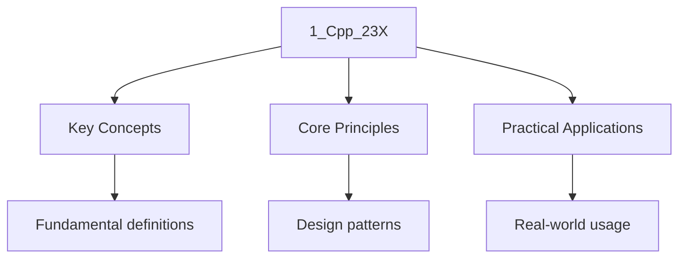

---

title: "C++23 - Wyatt's Notes"
description: "C++ Programming C++23 notes covering key definitions, core concepts, worked examples, and practice questions for detailed exam preparation and revision."
date: 2025-12-12T03:12:33.331Z
tags:
  - cpp
categories:
  - cpp
---

import { Tabs, TabItem } from "@astrojs/starlight/components";

The inclusion model (`#include`) has defined C++ physical architecture for decades. It relies on
Textual substitution, resulting in fragile builds, macro leakage, and redundant parsing of the same
Header millions of times across a project, precompile headers is a workaround but not a solution.

The **Module System** aims replaces this with a import model. A module is compiled once into a
Binary representation (Binary Module Interface - BMI). Consumers import this semantic representation
Directly, bypassing the preprocessor. Keep in mind that moduels are only partially implemented in
Most compilers.

This module details the physical structure of a modular C++ project, focusing on the hierarchy of
Units: **Primary Interfaces**, **Partitions**, and **Implementation Units**.

## 1. The Primary Module Interface Unit (PMIU)

Every module must have exactly one **Primary Module Interface Unit**. This is the root of the
Module. It defines the exported API that consumers see when they run `import ModuleName;`.

### Syntax and Structure

A PMIU is characterized by the `export module [Name];` declaration at the start of the file.

```cpp
// File: src/engine.cppm
export module Engine; // Declaration of the module name

// Optional: Import other modules
import std;

// Exported Symbol: Visible to importers
export namespace Engine {
    class Context \{
    public:
        void initialize();
    \};

    export int version = 1;
\}

// Non-Exported Symbol: Visible only within this module's units
// (Internal Linkage logic applies differently in modules, termed "Module Linkage")
void internal_helper() \{\}
```

### File Extensions

The C++ standard does not mandate file extensions, but tooling conventions have emerged:

- **Clang/LLVM:** `.cppm` (Recommended)
- **MSVC:** `.ixx`
- **GCC:** `.cpp` (Requires specific flags to distinguish from sources)

## 2. Module Implementation Units (MIU)

Implementation Units contain the code that fulfills the promises made in the Interface. They allow
For the separation of definition and implementation, similar to the `.h` vs `.cpp` split, but with
Stronger isolation.

An MIU allows you to modify the implementation details of a function _without_ changing the
Interface BMI. This prevents downstream recompilation avalanches.

### Syntax

An MIU starts with `module [Name];`. Note the lack of the `export` keyword.

```cpp
// File: src/engine_impl.cpp
module Engine; // Declares this file belongs to the 'Engine' module

// Implicitly imports the Primary Interface of 'Engine'.
// We can see 'Context' definition without importing anything.

namespace Engine \{
    void Context::initialize() \{
        // Implementation logic
    \}
\}
```

- **Constraint:** Implementation Units cannot export anything. Their sole purpose is to define
  entities declared in the interface or to implement internal logic.

## 3. Module Partitions

For large modules, putting the entire API surface into a single `.cppm` file is unmanageable.
**Partitions** allow you to split the module definition across multiple files while presenting a
Unified view to the consumer.

Partitions are internal organizational details. A consumer cannot import a partition directly (e.g.,
`import Engine:Graphics` is illegal outside the module).

### 3.1 Interface Partitions (`:Name`)

An interface partition contributes to the public API of the module. It must be re-exported by the
Primary Interface.

**File:** `src/engine_graphics.cppm`

```cpp
export module Engine:Graphics; // Colon denotes partition

export namespace Engine {
    struct Renderer \{
        void draw();
    \};
\}
```

**File:** `src/engine_physics.cppm`

```cpp
export module Engine:Physics;

export namespace Engine {
    struct Collider \{
        bool check();
    \};
\}
```

**File:** `src/engine.cppm` (Primary Interface)

```cpp
export module Engine;

// Re-export partitions to compose the single 'Engine' module
export import :Graphics;
export import :Physics;

// Now a user importing 'Engine' gets both Renderer and Collider.
```

### 3.2 Implementation Partitions

Sometimes internal implementation logic is too large for one file but needs to be shared among
Different units of the module. Implementation partitions are _not_ exported and are _not_ reachable
By consumers.

**File:** `src/engine_internals.cppm`

```cpp
module Engine:Internals; // Note: No 'export' keyword before 'module'

namespace Engine::Detail \{
    // Shared internal logic
    void low_level_alloc() \{ ... \}
\}
```

**File:** `src/engine.cpp` (Implementation Unit)

```cpp
module Engine;
import :Internals; // Import the internal partition

void use_allocator() \{
    Engine::Detail::low_level_alloc();
\}
```

## 4. The Global Module Fragment (GMF)

The C++ ecosystem relies heavily on legacy headers (`<unistd.h>``<windows.h>`). Modules provide a
Mechanism called the **Global Module Fragment** to safely include these headers without
Contaminating the module's symbol table or exporting macros unintentionally.

The GMF must appear before the module declaration.

```cpp
module; // Start of Global Module Fragment

// Headers included here behave as if included in a standard TU.
// Their macros and declarations are visible to the module code below.
#include <sys/socket.h>
#include <openssl/ssl.h>

export module Network; // End of GMF, Start of Module

import std;

export namespace Network {
    // We can use types from sys/socket.h here
    void connect(sockaddr_in* addr) \{
        // ...
    \}
\}
```

**Architecture Rule:** Never `#include` a header inside the module body (after `export module`).
Always place includes in the GMF or `import` them if they are modularized headers.

## 5. Architectural Summary: The Module DAG

When designing a module system, visualize the dependencies as a Directed Acyclic Graph (DAG).

| Component                    | Syntax                  | Role                             | Visibility           |
| :--------------------------- | :---------------------- | :------------------------------- | :------------------- |
| **Primary Interface**        | `export module A;`      | The Root. Defines public API.    | Visible to World     |
| **Interface Partition**      | `export module A:Part;` | API Fragment. Composes the Root. | Visible to Module A  |
| **Implementation Unit**      | `module A;`             | Compilable logic. PIMPL.         | Internal to Module A |
| **Implementation Partition** | `module A:Part;`        | Shared internal logic.           | Internal to Module A |

### Reachability vs. Visibility

- **Visibility:** Can name lookup find the symbol? (Controlled by `export`).
- **Reachability:** Is the semantic property of the symbol available? (Controlled by `import`).

In C++23 modules, a type can be _reachable_ but not _visible_. For example, if a function returns a
`struct` that is not exported, the caller can use the struct (store it via `auto`), but cannot name
The type explicitly.

## Build System Implications

Modules fundamentally change the build dependency graph.

1. **Scanning:** The build system (CMake/Ninja) must scan source files _before_ compilation to
   discover module names and dependencies. Implicit file-to-target mapping is no longer sufficient.
2. **Ordering:** If `B.cppm` imports `A.cppm``A` must be compiled (to generate the BMI) before `B`
   can be compiled. This serialization eliminates parallel compilation of dependent interfaces,
   though Implementation Units can still compile in parallel.

## 6. Header Units

Header units are an intermediate step between the legacy `#include` model and full modules. A header
Unit is a precompiled representation of a single standard or user header, imported via
`import <header>;` rather than `#include <header>`.

### Standard Header Units

The C++ standard library headers can be imported as header units. This is the most practical entry
Point for adopting modules in existing codebases [N4950 §16.5].

```cpp
import <vector>;    // Instead of #include <vector>
import <string>;    // Instead of #include <string>
import <print>;     // Instead of #include <print>

int main() \{
    std::vector<std::string> v = \{"hello", "world"\};
    for (const auto& s : v) \{
        std::println("\{\}", s);
    \}
\}
```

### User Header Units

User-defined headers can also be imported as header units, provided they are self-contained (include
All their own dependencies).

```cpp
// File: src/utils.h
#pragma once
#include <string>
#include <cstdint>

namespace Utils \{
    std::string to_hex(uint32_t value);
\}
```

```cpp
// File: src/main.cpp
import "src/utils.h";  // Header unit import

int main() \{
    auto s = Utils::to_hex(0xDEADBEEF);
\}
```

### Header Unit vs. Module

A header unit is **not** a module. It is a precompiled header with import semantics. Key
Differences:

| Property          | Module (`export module A;`)        | Header Unit (`import <header>;`)      |
| :---------------- | :--------------------------------- | :------------------------------------ |
| **Macro export**  | Macros are not exported            | Macros from the header ARE visible    |
| **Encapsulation** | Strong isolation of internal names | No isolation; all names are visible   |
| **Transitivity**  | Controlled via `export import`     | All includes are transitively visible |
| **BMI semantics** | Full semantic interface            | Precompiled textual interface         |

The critical takeaway: header units still leak macros and have no encapsulation boundary. They are a
Performance optimization (avoid re-parsing), not an architectural improvement. Full modules should
Be the end goal.

## 7. Module Linkage

C++23 introduces **module linkage**, a third form of linkage distinct from internal and external
Linkage [N4950 §6.6]. An entity with module linkage is visible to all translation units within the
Same module but invisible outside it.

### Linkage Comparison

```cpp
export module Example;

// 1. Internal Linkage: Visible only in this TU (same as non-module C++)
namespace \{
    int local_counter = 0;  // internal linkage
\}

// 2. Module Linkage: Visible to all TUs of 'Example' module
int module_counter = 0;     // module linkage (not exported, not anonymous)

// 3. External Linkage (via export): Visible to importers
export int global_counter = 0;
```

### Implications for Implementation Partitions

Module linkage is what enables implementation partitions to share internal state:

```cpp
// File: engine_state.cppm (Implementation Partition)
module Engine:State;

namespace Engine::Detail \{
    int frame_count = 0;  // module linkage: shared across Engine's TUs
\}
```

```cpp
// File: engine_render.cpp (Implementation Unit)
module Engine;
import :State;

void Engine::render() \{
    Engine::Detail::frame_count++;  // Accessible because same module
\}
```

### The `export` Keyword Granularity

The `export` keyword can be applied at multiple levels:

```cpp
export module Engine;

// 1. Export a namespace — exports ALL members
export namespace Config {
    int timeout = 30;
    int retries = 3;
\}

// 2. Export individual declarations
export void initialize();

// 3. Export block (C++23 refinement)
export {
    void shutdown();
    int get_status();
\}
```

The export block syntax (`export { ... }`) is particularly useful for selectively exporting a subset
Of declarations from a larger header, avoiding the need to prefix each declaration individually.

## 8. Macros and Modules

Macros are the fundamental impedance mismatch between the inclusion model and the module model.
Macros are a preprocessor concept — they operate on tokens before the compiler sees any C++ grammar.
Modules are a compiler concept — they operate on the parsed AST.

### What Does NOT Cross Module Boundaries

```cpp
// Module A
export module A;
#define DEBUG_FLAG 1
export void foo();  // foo is exported, but DEBUG_FLAG is NOT
```

```cpp
// Consumer
import A;
// DEBUG_FLAG is NOT defined here
// foo() IS visible
```

### Workarounds

1. **`constexpr` variables instead of macros** (preferred):

```cpp
export module Config;
export constexpr int DEBUG_FLAG = 1;  // Type-safe, exported, works with modules
```

1. **Global Module Fragment** (for legacy macros that cannot be converted):

```cpp
module;
#define WIN32_LEAN_AND_MEAN
#include <windows.h>
export module WinWrapper;
```

1. **Predefined macros** (compiler-defined macros like `__FILE__``__LINE__``NDEBUG`) are always
   available regardless of modules. These are not affected by the module boundary because they are
   injected by the compiler, not the preprocessor in the traditional sense.

## 9. BMI Format and Performance Characteristics

The Binary Module Interface (BMI) is a compiler-internal format. It is **not standardized** — each
Compiler implements its own BMI format:

- **Clang:** Uses a precompiled module (`.pcm`) format, stored in the module cache.
- **GCC:** Uses a C++ module format (`.gcm`) that is written to the module cache directory.
- **MSVC:** Uses an IFC (Interface File, `.ifc`) format.

### BMI as a Serialization of the AST

The BMI encodes enough of the module's abstract syntax tree for a consumer to perform type checking,
Name lookup, and overload resolution without re-parsing the module's source. This includes:

- All exported declarations and their types
- Template definitions (bodies are needed for instantiation)
- Inline function bodies
- `constexpr` function bodies (needed for compile-time evaluation)

### Performance Impact

In large projects, the module system provides significant compilation time improvements:

1. **Single parse:** A module is parsed once, not once per includer. A header included by 1000 TUs
   is parsed 1000 times under the inclusion model; a module is parsed exactly once.
2. **No macro expansion on import:** The preprocessor is not invoked when importing a module,
   eliminating the single most expensive phase of C++ compilation in legacy codebases.
3. **BMI serialization cost:** The tradeoff is that generating the BMI for a module interface is
   more expensive than compiling a single header (because the BMI must contain complete type
   information). For modules with large API surfaces, this cost can be significant.

### BMI Cache Invalidation

The build system must track dependencies carefully. A BMI is invalidated when:

- The module interface source file changes.
- Any file included in the Global Module Fragment changes.
- Any imported module's BMI changes (transitive dependency).

This cascading invalidation is why module build graphs must be acyclic and why the build system
Requires a dedicated scanning phase.

## 10. CMake Integration for Modules

CMake 3.28+ has first-class support for C++20 modules via the `target_sources` command with the
`FILE_SET` keyword and the `CXX_MODULES` file set type.

```cmake
cmake_minimum_required(VERSION 3.28)
project(ModuleDemo LANGUAGES CXX)

add_library(Engine)

## Declare module sources as a file set
target_sources(Engine
    PUBLIC
        FILE_SET cxx_modules TYPE CXX_MODULES
        BASE_DIRS $\{CMAKE_CURRENT_SOURCE_DIR\}/src
        FILES
            src/engine.cppm          # Primary Interface
            src/engine_graphics.cppm  # Interface Partition
            src/engine_physics.cppm   # Interface Partition
)

## Implementation units are regular sources
target_sources(Engine PRIVATE
    src/engine_impl.cpp
    src/engine_internals.cppm  # Implementation Partition
)

target_compile_features(Engine PUBLIC cxx_std_23)
```

### Compiler Flags for Modules

Each compiler requires specific flags to enable module support:

<Tabs>
 <TabItem label="Clang (16+)">

```bash
clang++ -std=c++23 -fmodules -fmodule-map-file=module.modulemap
```

 </TabItem>
 <TabItem label="GCC (12+)">

```bash
g++ -std=c++23 -fmodules-ts
```

 </TabItem>
 <TabItem label="MSVC (VS 2022 17.4+)">

```bash
cl /std:c++23 /EHsc /interface
```

 </TabItem>
</Tabs>

### Dependency Scanning (CMake 3.28+)

CMake performs a **dependency scan** before compilation to discover `import` statements and build
The correct dependency DAG. This is handled internally by CMake when module file sets are declared,
But requires the CMake generator to support the `FILE_SET` mechanism (Ninja and Makefile generators
Do; Visual Studio generators have partial support).




## Intuition

**Modern modules:** C++20 modules are like sealed packages — they export interfaces without exposing implementation details, reducing compile times and name collisions.

**Why it matters:** Modules solve the header file problem — faster compilation, better encapsulation, and no more include guards.

**The key insight:** Modules are the future of C++ — they enable faster builds and better code organization.

## Common Pitfalls

### 1. Forgetting the `export` Keyword on Partition Re-exports

The most common module error. If a partition is not re-exported from the Primary Interface,
Consumers cannot see its symbols — and the error message from the compiler is cryptic.

```cpp
// BUG: Missing 'export' on import
export module Engine;
import :Graphics;  // WRONG — Graphics symbols are NOT exported to consumers

// FIX:
export module Engine;
export import :Graphics;  // CORRECT — Graphics symbols are now part of Engine's API
```

### 2. `#include` Inside Module Purview

Placing a `#include` after the `export module` declaration is ill-formed (the compiler will issue a
Hard error or, worse, silently produce incorrect BMI). All legacy includes must go in the Global
Module Fragment.

```cpp
export module Bad;
#include <vector>  // ERROR: #include not allowed after module declaration
```

### 3. Assuming Macros Are Exported

Macros never cross module boundaries. If a third-party library relies on macro configuration (e.g.,
`#define NDEBUG` before including `<cassert>`), this must be handled through the Global Module
Fragment or preprocessor definitions on the command line.

### 4. Cyclic Module Dependencies

The module DAG must be acyclic. If module `A` imports module `B` and module `B` imports module `A`
The build system cannot determine a compilation order. This is a hard error at both the build system
Level and (often) the compiler level.

### 5. Incomplete Compiler Support

As of 2025, module support across the three major compilers is still inconsistent. GCC's
Implementation trails Clang and MSVC. BMI formats are not interoperable between compilers. Do not
Distribute BMIs — only distribute source and let each consumer build their own BMIs.

### 6. Partition Naming Collisions

Partition names must be unique within a module. Using the same partition name in two different files
Within the same module is ill-formed, even if one is an interface partition and the other is an
Implementation partition.

## Worked Examples

**Example 1: Applying key concepts**

When working with c++23, follow a structured approach:

1. Identify the key concepts and definitions relevant to the question
2. Apply the appropriate methods, equations, or frameworks
3. Support your answer with evidence, examples, or calculations
4. Evaluate your answer critically, considering limitations and alternative perspectives

## Cross-References

- **[Preprocessing and AST](../1_translation/1_preprocessing_ast_object):** Traditional compilation model that modules are designed to replace.
- **[Templates and Metaprogramming](../../templates_and_metaprogramming/):** Template instantiation that benefits from module-style compilation.
- **[Standard Library](../../standard_library/):** Standard library components that can be imported via modules.
