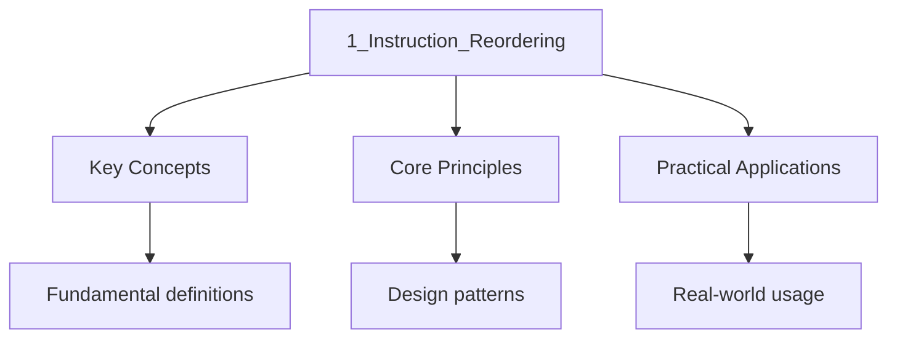

---

title: Instruction Reordering and Happens-Before
description: "This section covers the as-if rule and compiler reordering, CPU-level store buffers and load Buffers, the happens-before and synchronizes-with"
date: 2026-04-03T00:00:00.000Z
tags:
  - Cpp
categories:
  - Cpp

---

<!-- Breadcrumb Schema for SEO -->
<script type="application/ld+json">
{
  "@context": "https://schema.org",
  "@type": "BreadcrumbList",
  "itemListElement": [{"name": "Home", "url": "https://wyattau.com"}, {"name": "cpp", "url": "https://cpp.wyattau.com"}, {"name": "Concurrency", "url": "https://cpp.wyattau.com/concurrency"}, {"name": "2_memory_model_and_atomics", "url": "https://cpp.wyattau.com/concurrency/2_memory_model_and_atomics"}, {"name": "1_instruction_reordering", "url": "https://cpp.wyattau.com/concurrency/2_memory_model_and_atomics/1_instruction_reordering"}]
}
</script>




## Instruction Reordering and Happens-Before

This section covers the as-if rule and compiler reordering, CPU-level store buffers and load
Buffers, the happens-before and synchronizes-with relationships, sequential consistency vs relaxed
Consistency, and a demonstration of reordering effects across architectures.

## The As-If Rule and Compiler Reordering

The **as-if rule** [N4950 §6.9.2.1] allows the compiler to reorder any operations whose reordering
Does not change the observable behavior of a single-threaded program. In a multi-threaded context,
This means:

> "The implementation is free to reorder operations unless an ordering constraint is imposed by the
> memory model."

Concretely, the compiler may reorder:

1. **Independent loads**: Two loads from different addresses may be reordered freely.
2. **Store-buffering**: A store followed by a load to a different address may be reordered so the
   load executes first.
3. **Common subexpression elimination**: A load may be hoisted out of a loop, potentially reading
   stale data.

The as-if rule is the root cause of most multi-threading bugs. The compiler does not know about
Other threads and is free to optimize as if the current thread were the only one running.

### Formal Definition of the As-If Rule

**Definition [N4950 §6.9.2.1]:** Conforming implementations are required to emulate (only) the
Observable behavior of the abstract machine. The as-if rule states that any transformation that
Preserves the observable behavior of a single-threaded execution is legal.

**Corollary for multi-threading:** Any reordering that does not affect single-threaded behavior but
Does affect multi-threaded behavior is legal. The compiler has no obligation to consider other
Threads.

### Common Compiler Reordering Transformations

**Register promotion:** A value loaded from memory may be cached in a register across multiple
Reads:

```cpp
// Source code
int flag = 0;
while (flag == 0) { /* spin */ }

// Compiler may transform to:
int reg = flag;
if (reg == 0) {
    while (true) { /* infinite loop — flag is never re-read */ }
}
```

This is a legal single-threaded optimization. If `flag` is not `volatile` or `std::atomic`The
Compiler assumes no other agent modifies it.

**Speculative hoisting:** Loads may be hoisted above branches:

```cpp
if (condition) {
    use(x);  // x loaded here
}
// Compiler may move the load above the branch:
auto tmp = x;  // speculative load
if (condition) {
    use(tmp);
}
```

**Store coalescing:** Multiple stores to the same location may be merged:

```cpp
data[0] = 1;
data[0] = 2;
data[0] = 3;
// Compiler may emit only: store data[0] = 3
```

## CPU-Level Reordering

Even if the compiler emits instructions in program order, the CPU may reorder them at runtime.
Different architectures have different memory models:

### Store Buffers

Modern CPUs use store buffers to avoid stalling on write misses. When a core executes a store, the
Data is written to the store buffer (fast, local) rather than directly to the cache (slow, may
Require coherence traffic). The store buffer is drained to the cache asynchronously.

This means a subsequent load from a different address may execute **before** the previous store
Drains to the cache. This is called **store-to-load reordering** (also known as Store Buffering or
The "Store Buffer" phenomenon).

```
Core 0:                  Core 1:
  store x = 1              store y = 1
  load r1 = y  (sees 0)    load r2 = x  (sees 0)
```

Both loads can see 0 simultaneously. This is legal on x86 (which has Total Store Order but allows
Store-to-load reordering) and is expected on ARM and POWER (which allow even more reorderings).

### Load Buffers and Speculative Execution

CPUs speculatively execute loads before prior branch conditions are resolved. On weakly ordered
Architectures (ARM, POWER), loads may be reordered with respect to other loads and stores:

```
Core 0:                  Core 1:
  load r1 = x              load r2 = y
  store y = 1              store x = 1
```

On ARM, it is possible for both loads to see 0 (Load-Load reordering and Load-Store reordering).

### Store Forwarding

A CPU can forward a store value directly from the store buffer to a subsequent load to the same
Address, bypassing the cache. This is called **store forwarding**. While this is an optimization
Rather than a reordering, it means a thread can always see its own stores immediately, even if other
Threads cannot.

### Interleaving Diagram: Store Buffering Litmus Test

The following diagram shows the temporal relationship between stores and loads across two cores:

```
Time →

Core 0:
  ┌──────────┐          ┌──────────┐
  │ store x=1│          │ load  r1 │
  │ (buffer) │          │  from y  │
  └────┬─────┘          └────┬─────┘
       │                     │
       ▼                     │
  ┌──────────┐              │
  │ draining │              │
  │ to cache │              │
  └──────────┘              │
                            │

Core 1:
          ┌──────────┐     ┌──────────┐
          │ store y=1│     │ load  r2 │
          │ (buffer) │     │  from x  │
          └────┬─────┘     └────┬─────┘
               │                │
               ▼                │
          ┌──────────┐         │
          │ draining │         │
          │ to cache │         │
          └──────────┘         │
```

Both loads execute before the other core"s store drains from its store buffer, so both `r1 = 0` and
`r2 = 0` is a valid outcome.

## Data Dependency and Control Dependency Ordering

A **data dependency** exists when the address or value of one memory access depends on the value
Read by a prior memory access:

$$\mathrm{data dependency:  a[i] \to b[a[i]]$$

A **control dependency** exists when whether a memory access executes depends on the value read by a
Prior access:

$$\mathrm{control dependency:  \mathrm{if  (x) \{ y = 1; \}$$

:::caution
Dependencies provide ordering, but on ARM and POWER, the processor may speculatively execute the
Dependent load before the controlling branch is resolved. Always use explicit memory ordering
(acquire/release) rather than relying on control dependencies.
:::
### Data Dependencies as Ordering

On most architectures, a true data dependency (RAW — Read After Write) prevents reordering because
The consumer instruction cannot execute until the producer has produced the value. This is a
Hardware dependency, not a memory ordering guarantee:

```cpp
// Data dependency prevents reordering of the load of b[i]
int idx = a[0];  // load a[0]
int val = b[idx]; // load b[a[0]] — cannot execute until idx is known
```

However, **address dependencies** (where only the _address_ depends on a prior load, not the value)
Are weaker. On ARM and POWER, address dependencies provide ordering, but on some architectures even
This is not guaranteed. Always use explicit atomics for correctness.

## Sequenced-Before Relationship

The **sequenced-before** relation [N4950 §6.9.4.1] is the intra-thread ordering. If evaluation A is
Sequenced-before evaluation B, then A's side effects are visible to B. Within a single thread, the
Sequenced-before relation is determined by the abstract machine's evaluation order:

- In a single expression, the order is determined by operator precedence and sequencing rules.
- Between statements, the order is top-to-bottom.
- Function arguments are **unsequenced** with respect to each other (prior to C++17). In C++17, the
  operands of `=` are indeterminately sequenced.

$$A \xrightarrow{\mathrm{seq} B \implies B \mathrm{ observes  A \mathrm{'s side effects within the same thread$$

## Happens-Before Relationship

The **happens-before** relation [N4950 §6.9.4.1] is a strict partial order ($\prec$) on evaluations
Within a single execution. If evaluation $A$ happens-before evaluation $B$ Then $B$ observes all Side
effects of $A$.

The happens-before relation is the **transitive closure** of:

1. **Sequenced-before** ($\xrightarrow{\mathrm{seq}$): Within a single thread, operations are
   ordered by the abstract machine.
2. **Synchronizes-with**: A release operation on an atomic object $M$ in thread $A$
   **synchronizes-with** an acquire operation on $M$ in thread $B$ if $B$ reads a value written (or
   released) by $A$.
3. **Sequenced-before is transitive**: If $A \xrightarrow{\mathrm{seq} B$ and
   $B \xrightarrow{\mathrm{seq} C$ Then $A \xrightarrow{\mathrm{seq} C$.

$$A \prec B \iff \exists\, C_1, C_2, \ldots, C_n : A \xrightarrow{\mathrm{seq} C_1 \xrightarrow{\mathrm{sw} C_2 \xrightarrow{\mathrm{seq} \ldots \xrightarrow{\mathrm{sw} C_n \xrightarrow{\mathrm{seq} B$$

**Formal definition:** $A$ happens-before $B$ ($A \prec B$) if and only if there exists a chain of
Sequenced-before and synchronizes-with edges connecting $A$ to $B$. The relation is irreflexive (no
Element happens-before itself), asymmetric, and transitive.

If $A \prec B$ and both $A$ and $B$ access the same memory location, and at least one is a write,
Then $B$ observes the side effects of $A$ (there is no data race).

### Proof: Happens-Before Prevents Data Races

**Claim:** If two evaluations $A$ and $B$ access the same memory location $M$ And at least one is a
Write, and $A \prec B$ Then there is no data race [N4950 §6.9.4.1].

**Proof:**

1. By definition of happens-before, there exists a chain of sequenced-before and synchronizes-with
   edges from $A$ to $B$.
2. Sequenced-before guarantees that within a single thread, the second evaluation observes all side
   effects of the first.
3. Synchronizes-with guarantees that an acquire operation in thread 2 observes all side effects
   sequenced-before the matching release operation in thread 1.
4. By transitivity, $B$ observes all side effects of $A$.
5. Therefore, $A$ and $B$ are ordered, and no data race exists.

$\square$

## Synchronizes-With Relationship

A release store to an atomic variable in thread 1 **synchronizes-with** an acquire load of that same
Variable in thread 2 if the load reads the value stored (or a value written later by a release
Operation) [N4950 §31.7.5]:

$$\mathrm{store_{\mathrm{release}(x, v) \xrightarrow{\mathrm{sw} \mathrm{load_{\mathrm{acquire}(x, v)$$

The synchronizes-with relationship creates a **happens-before** edge between the release store and
The acquire load, and by transitivity, all operations sequenced-before the release store
Happen-before all operations sequenced-after the acquire load.

## Sequential Consistency vs Relaxed Consistency

**Sequential consistency** (SC) [N4950 §31.7.5] is the strongest memory ordering. Under SC, the
Result of any execution is as if all operations of all threads were executed in some total order
Consistent with the program order of each individual thread.

**Relaxed consistency** allows more reorderings and is weaker than SC. Under relaxed ordering, there
Is no inter-thread ordering guarantee unless explicitly established by acquire/release or seq_cst
Operations.

| Property                           | Sequentially Consistent | Relaxed |
| ---------------------------------- | ----------------------- | ------- |
| Single total order                 | Yes                     | No      |
| Compiler reordering across atomics | Prevented               | Allowed |
| Hardware reordering across atomics | Prevented (fences used) | Allowed |
| Performance cost                   | Highest                 | Lowest  |

### Formal Definition of Sequential Consistency

A set of operations is sequentially consistent if there exists a total order $T$ over all operations
Such that [N4950 §31.7.5]:

1. $T$ is consistent with the program order of each thread (if $op_1$ is sequenced-before $op_2$ in
   the same thread, then $op_1$ appears before $op_2$ in $T$).
2. $T$ respects the read-after-write coherence: every read of location $x$ returns the value of the
   last write to $x$ in $T$.

The C++ memory model guarantees that all `memory_order_seq_cst` operations participate in a single
Total order $S$Called the **modification order**, which is consistent with all happens-before
Relationships.

## Concrete Example: Reordering Bug

:::caution
purposes only. Do not Write code like this in production.
:::
```cpp
#include <iostream>
#include <thread>
#include <atomic>

int data = 0;
bool ready = false;

void producer() {
    data = 42;
    ready = true;
}

void consumer() {
    while (!ready) {
        // spin
    }
    std::cout << "data = " << data << "\n";
}

int main() {
    std::thread t1(producer);
    std::thread t2(consumer);
    t1.join();
    t2.join();
    return 0;
}

```
