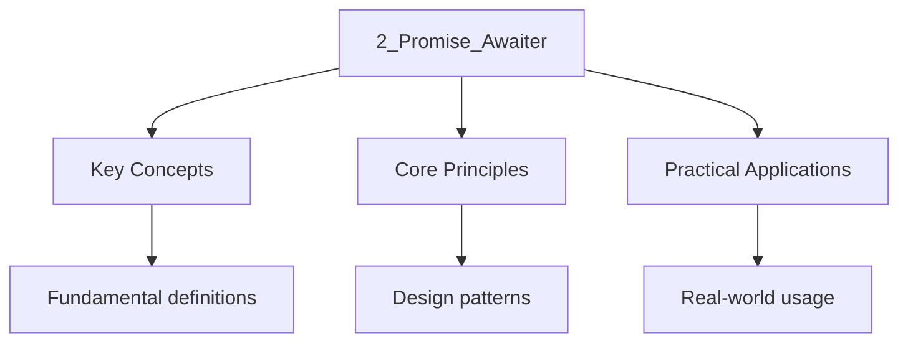

---

title: Coroutine Handle, Promise Type, and Awaiter
description: "Study notes for Coroutine Handle, Promise Type, and Awaiter with worked examples, practice problems, and key concepts for exam preparation."
date: 2026-04-03T00:00:00.000Z
tags:
  - Cpp
categories:
  - Cpp

---

<!-- Breadcrumb Schema for SEO -->
<script type="application/ld+json">
{
  "@context": "https://schema.org",
  "@type": "BreadcrumbList",
  "itemListElement": [{"name": "Home", "url": "https://wyattau.com"}, {"name": "cpp", "url": "https://cpp.wyattau.com"}, {"name": "Concurrency", "url": "https://cpp.wyattau.com/concurrency"}, {"name": "3_coroutines_and_async_io", "url": "https://cpp.wyattau.com/concurrency/3_coroutines_and_async_io"}, {"name": "2_promise_awaiter", "url": "https://cpp.wyattau.com/concurrency/3_coroutines_and_async_io/2_promise_awaiter"}]
}
</script>




## The Coroutine Handle, Promise Type, and Awaiter

This section covers the three interacting components of the C++ coroutine machinery, `co_await`
Expression semantics, the promise type vs awaiter distinction, `get_return_object()`
`await_transform` for custom suspension behavior, and `yield_value`/`return_value` for value
Communication.

## The Coroutine Machinery Overview

The C++ coroutine mechanism consists of three interacting components [N4950 §9.5.4]:

1. **Coroutine handle** (`std::coroutine_handle<P>`): a non-owning reference to the coroutine frame
   [N4950 §21.4.4].
2. **Promise type**: the communication channel between the coroutine author and the caller. Defined
   by the `promise_type` nested type inside the return type [N4950 §9.5.4.3].
3. **Awaiter type**: the type that controls what happens at each `co_await` suspension point.
   Discovered via the awaitable interface [N4950 §9.5.4.3].

The relationship between these three is:

$$
\mathrm{Caller \xrightarrow{\mathrm{invoke} \mathrm{Coroutine \xleftrightarrow{\mathrm{promise\_type} \mathrm{Caller \xleftrightarrow{\mathrm{awaiter} \mathrm{co\_await
$$

## `co_await` Expression Semantics [N4950 §9.5.4.3]

The expression `co_await expr` is transformed by the compiler into a sequence of calls on an
**awaiter** object. The awaiter is obtained by the following lookup chain [N4950 §9.5.4.3]:

1. If `expr` has an `operator co_await` member or non-member overload, the result of
   `expr.operator co_await()` (or `operator co_await(expr)`) is the awaiter.
2. Otherwise, if the promise type has `await_transform`Then `promise.await_transform(expr)` is
   called, and the result is the awaiter.
3. Otherwise, `expr` itself is the awaiter.

### Proof of `co_await` Transformation Steps

**Claim:** The compiler transforms `co_await expr` into a well-defined sequence of awaiter method
Calls [N4950 §9.5.4.3].

**Proof:**

1. The compiler first resolves the awaiter through the lookup chain defined above (operator
   `co_await``await_transform`Or identity).
2. Let the resolved awaiter be `a`. The compiler generates code equivalent to:

   ```cpp
   auto&& a = <awaiter-expression>;
   if (!a.await_ready()) {
       using handle_t = std::coroutine_handle<PromiseType>;
       if constexpr (requires { { a.await_suspend(handle) } -> std::same_as<void>; }) {
           a.await_suspend(handle);
           // control returns to caller/resumer
       } else if constexpr (requires { { a.await_suspend(handle) } -> std::convertible_to<bool>; }) {
           if (!a.await_suspend(handle)) {
               // immediate resumption — goto resume_point
           } else {
               // control returns to caller/resumer
           }
       } else {
           // a.await_suspend returns a coroutine_handle
           auto h = a.await_suspend(handle);
           h.resume();  // symmetric transfer
           // control never reaches here
       }
   }
   // resume_point:
   a.await_resume();
   ```

3. The `await_ready()` check short-circuits suspension for already-completed awaitables (e.g.,
   immediately available values).
4. The `await_suspend()` call is the suspension mechanism. It determines whether the coroutine
   actually suspends and what happens upon resumption.
5. The `await_resume()` call produces the value visible to the `co_await` expression.

$\square$

Once the awaiter is obtained, the compiler generates code equivalent to:

```cpp
auto&& awaiter = <awaiter-expression>;
if (!awaiter.await_ready()) {
    using handle_t = std::coroutine_handle<P>;
    awaiter.await_suspend(coroutine_handle);
    // <coroutine suspended; control returns to caller/resumer>
}
// <resumption point>
awaiter.await_resume();
```

The three methods that an awaiter must provide [N4950 §9.5.4.3]:

| Method                  | Return type                          | Purpose                                                  |
| :---------------------- | :----------------------------------- | :------------------------------------------------------- |
| `await_ready()`         | `bool`                               | If `true`Skip suspension and proceed directly            |
| `await_suspend(handle)` | `void``bool`Or `coroutine_handle<Z>` | Called when coroutine suspends; controls resumption      |
| `await_resume()`        | any type                             | Produces the result of `co_await expr`; called on resume |

The return type of `await_suspend` is critical [N4950 §9.5.4.3]:

- **`void`**: the coroutine is suspended; control returns to the caller.
- **`bool`**: if `true`The coroutine is suspended; if `false`It resumes immediately.
- **`coroutine_handle<Z>`**: the coroutine is suspended, and the returned handle is resumed
  (symmetric transfer).

### Detailed `await_suspend` Return Type Semantics

| Return Type           | Coroutine State After | What Happens                                                                                                          |
| :-------------------- | :-------------------- | :-------------------------------------------------------------------------------------------------------------------- |
| `void`                | Suspended             | Control returns to the caller/resumer. The coroutine is suspended until something explicitly calls `resume()`.        |
| `bool` (true)         | Suspended             | Same as `void`. Used when the decision to suspend is conditional.                                                     |
| `bool` (false)        | Running               | The coroutine continues immediately from the resume point. No suspension occurs.                                      |
| `coroutine_handle<Z>` | Suspended             | The returned handle is resumed immediately. Used for symmetric transfer (tail-call optimization of coroutine chains). |

## Promise Type vs Awaiter Type

The **promise type** is the bidirectional communication channel between the coroutine and its
Caller. The **awaiter type** is the mechanism that controls individual suspension points.

| Aspect      | Promise Type                                         | Awaiter Type                                          |
| :---------- | :--------------------------------------------------- | :---------------------------------------------------- |
| Lifetime    | Lives for the entire duration of the coroutine frame | Temporary — lives only for the duration of `co_await` |
| Purpose     | Manages coroutine state, return values, exceptions   | Controls individual suspend/resume behavior           |
| Required by | Every coroutine (via `promise_type` alias)           | Every `co_await` expression                           |
| Key methods | `get_return_object``initial_suspend``final_suspend`  | `await_ready``await_suspend``await_resume`            |

## `promise_type::get_return_object()`

The `get_return_object()` method [N4950 §9.5.4.3] is called **before** the coroutine body begins
Execution. It produces the value that is returned to the caller. , this is a wrapper type That holds
a `std::coroutine_handle` and provides a convenient API:

```cpp
#include <coroutine>
#include <iostream>
#include <string>

struct Result {
    struct promise_type {
        std::string value_{};

        promise_type() = default;
        promise_type(const promise_type&) = delete;
        promise_type& operator=(const promise_type&) = delete;
        ~promise_type() = default;

        std::suspend_never initial_suspend() noexcept { return {}; }
        std::suspend_always final_suspend() noexcept { return {}; }
        void unhandled_exception() {}

        Result get_return_object() {
            return Result{std::coroutine_handle<promise_type>::from_promise(*this)};
        }

        void return_value(std::string s) {
            value_ = std::move(s);
        }
    };

    std::coroutine_handle<promise_type> handle;

    std::string& value() { return handle.promise().value_; }

    explicit Result(std::coroutine_handle<promise_type> h) : handle(h) {}
    ~Result() { if (handle) handle.destroy(); }
    Result(const Result&) = delete;
    Result& operator=(const Result&) = delete;
};

Result compute_value() {
    std::cout << "computing...\n";
    co_return "hello from coroutine";
}

int main() {
    Result r = compute_value();
    // The coroutine ran eagerly (initial_suspend returns suspend_never)
    // and is now at final suspend (suspend_always)
    std::cout << "result: " << r.value() << "\n";
    // ~Result calls handle.destroy()
}
```

## `await_transform` for Custom Suspension Behavior

If the promise type defines `await_transform`Every `co_await expr` first passes through it [N4950
§9.5.4.3]. This allows the promise to intercept and transform any awaitable into a custom awaiter,
Enabling library-level control over suspension semantics:

```cpp
#include <coroutine>
#include <iostream>

struct TransformingPromise {
    TransformingPromise() = default;
    TransformingPromise(const TransformingPromise&) = delete;
    TransformingPromise& operator=(const TransformingPromise&) = delete;
    ~TransformingPromise() = default;

    std::suspend_never initial_suspend() noexcept { return {}; }
    std::suspend_never final_suspend() noexcept { return {}; }
    void return_void() {}
    void unhandled_exception() {}

    auto get_return_object() {
        return std::coroutine_handle<TransformingPromise>::from_promise(*this);
    }

    // Transform any integer into a logging awaiter
    auto await_transform(int value) {
        struct IntAwaiter {
            int value;
            bool await_ready() const noexcept {
                std::cout << "await_ready(" << value << ")\n";
                return value == 0;
            }
            void await_suspend(std::coroutine_handle<>) const noexcept {
                std::cout << "await_suspend(" << value << ")\n";
            }
            int await_resume() const noexcept {
                std::cout << "await_resume(" << value << ")\n";
                return value * 2;
            }
        };
        return IntAwaiter{value};
    }
};

struct Transforming {
    using promise_type = TransformingPromise;
    std::coroutine_handle<TransformingPromise> handle;
};

Transforming transformed() {
    int a = co_await 5;
    int b = co_await 0;
    int c = co_await 3;
    std::cout << "a=" << a << " b=" << b << " c=" << c << "\n";
}

int main() {
    auto coro = transformed();
    coro.handle.destroy();
}
```

Output:

```
await_ready(5)
await_suspend(5)
await_resume(5)
await_ready(0)
await_resume(0)
await_ready(3)
await_suspend(3)
await_resume(3)
a=10 b=0 c=6
```

### `await_transform` and Generic Fallback

When the promise defines `await_transform`**every** `co_await` expression must match one of its
Overloads. If no overload matches, the code is ill-formed. This means you cannot `co_await`
`std::suspend_always` or any other type not handled by `await_transform` unless you provide a
Generic fallback:

```cpp
template<typename T>
auto await_transform(T&& awaitable) {
    return std::forward<T>(awaitable);
}
```

This generic fallback forwards the awaitable unchanged, allowing the default awaiter resolution to
Proceed for types not explicitly handled.

## `yield_value` and `return_value`

The promise type communicates values back to the caller through two distinct channels [N4950
§9.5.4.3]:

- **`co_yield expr`** is syntactic sugar for `co_await promise.yield_value(expr)`. It suspends the
  coroutine and makes `expr` available to the caller.
- **`co_return expr`** calls `promise.return_value(expr)` (or `promise.return_void()` if no value)
  and transitions the coroutine to the final suspend point.

A promise type must define **either** `return_value` or `return_void`But not both. If the Coroutine
uses `co_return;` (no value), `return_void` must be present.

```cpp
#include <coroutine>
#include <iostream>
#include <string>
#include <variant>

struct Channel {
    struct promise_type {
        std::variant<std::monostate, std::string, int> value_{};

        promise_type() = default;
        promise_type(const promise_type&) = delete;
        promise_type& operator=(const promise_type&) = delete;
        ~promise_type() = default;

        std::suspend_always initial_suspend() noexcept { return {}; }
        std::suspend_always final_suspend() noexcept { return {}; }
        void return_void() {}
        void unhandled_exception() {}

        auto get_return_object() {
            return Channel{std::coroutine_handle<promise_type>::from_promise(*this)};
        }

        auto yield_value(std::string s) {
            value_ = std::move(s);
            return std::suspend_always{};
        }

        auto yield_value(int i) {
            value_ = i;
            return std::suspend_always{};
        }
    };

    std::coroutine_handle<promise_type> handle;

    explicit Channel(std::coroutine_handle<promise_type> h) : handle(h) {}
    ~Channel() { if (handle) handle.destroy(); }
    Channel(const Channel&) = delete;
    Channel& operator=(const Channel&) = delete;

    auto& value() { return handle.promise().value_; }

    bool next() {
        if (!handle.done()) {
            handle.resume();
            return !handle.done();
        }
        return false;
    }
};

Channel multi_type_channel() {
    co_yield std::string("hello");
    co_yield 42;
    co_yield std::string("world");
    co_yield 99;
}

int main() {
    Channel ch = multi_type_channel();
    while (ch.next()) {
        auto& v = ch.value();
        if (std::holds_alternative<std::string>(v))
            std::cout << "string: " << std::get<std::string>(v) << "\n";
        else if (std::holds_alternative<int>(v))
            std::cout << "int: " << std::get<int>(v) << "\n";
    }
}
```

## Coroutine Frame Lifetime and the `final_suspend` Decision

The coroutine frame is heap-allocated (unless the compiler can prove it doesn"t escape) and its
Lifetime is managed by `std::coroutine_handle` [N4950 §9.5.4]. When a coroutine reaches the final
Suspend point, the behavior of `final_suspend` determines whether the frame is automatically
Destroyed or must be destroyed manually:

- **`std::suspend_always`**: The coroutine suspends at the final point. The caller (or resumer)
  **must** call `handle.destroy()` to free the frame. This is required for any coroutine whose
  return type needs to observe the coroutine's result after completion (e.g., a `Task` that carries
  a value).

- **`std::suspend_never`**: The coroutine's frame is destroyed immediately upon reaching the final
  suspend point. The handle becomes invalid. This is used for fire-and-forget coroutines.

```cpp
#include <coroutine>
#include <iostream>
#include <utility>

struct ScopedTask {
    struct promise_type {
        std::suspend_always initial_suspend() noexcept { return {}; }
        std::suspend_never final_suspend() noexcept { return {}; }
        ScopedTask get_return_object() {
            return ScopedTask{std::coroutine_handle<promise_type>::from_promise(*this)};
        }
        void return_void() {}
        void unhandled_exception() {}
    };

    std::coroutine_handle<promise_type> handle;

    explicit ScopedTask(std::coroutine_handle<promise_type> h) : handle(h) {}
    ~ScopedTask() {
        if (handle) handle.destroy();
    }
    ScopedTask(const ScopedTask&) = delete;
    ScopedTask& operator=(const ScopedTask&) = delete;
};

ScopedTask fire_and_forget() {
    std::cout << "running...\n";
    co_await std::suspend_always{};
    std::cout << "resumed\n";
}

int main() {
    ScopedTask t = fire_and_forget();
    t.handle.resume();
    // After resume: coroutine reaches final_suspend which is suspend_never,
    // so the frame is destroyed automatically.
    // handle is now invalid — do NOT call handle.destroy() again.
    // ~ScopedTask checks handle, but the handle is already done.
}
```
