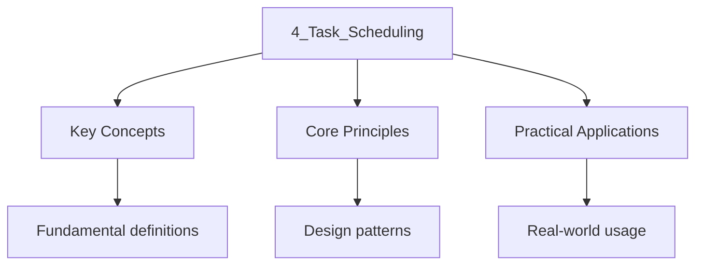

---

title: "Task Scheduling and Executors | C++"
description: "This section covers the task concept, coroutine-based pipeline processing, async/await patterns Across languages, structured concurrency with /A complete"
date: 2026-04-03T00:00:00.000Z
tags:
  - Cpp
categories:
  - Cpp

---

<!-- Breadcrumb Schema for SEO -->
<script type="application/ld+json">
{
  "@context": "https://schema.org",
  "@type": "BreadcrumbList",
  "itemListElement": [{"name": "Home", "url": "https://wyattau.com"}, {"name": "cpp", "url": "https://cpp.wyattau.com"}, {"name": "Concurrency", "url": "https://cpp.wyattau.com/concurrency"}, {"name": "3_coroutines_and_async_io", "url": "https://cpp.wyattau.com/concurrency/3_coroutines_and_async_io"}, {"name": "4_task_scheduling", "url": "https://cpp.wyattau.com/concurrency/3_coroutines_and_async_io/4_task_scheduling"}]
}
</script>




## Task Scheduling and Executors

This section covers the task concept, coroutine-based pipeline processing, async/await patterns
Across languages, structured concurrency with `when_all`/`when_any`A complete Task class wrapping A
coroutine, and a thread pool executor for scheduling coroutines across threads.

## Task Concept

A **task** is a coroutine that produces a result asynchronously. Unlike a generator (which produces
Many values), a task produces exactly one result upon completion. The task coroutine is Lazy — it
does not begin executing until someone calls `resume()` or an executor schedules it.

The minimal interface for a task is:

- **Awaitable**: the task can be `co_await`Ed, suspending the awaiting coroutine until the task
  completes.
- **Result access**: once the task completes, its result is available.
- **Exception propagation**: if the task throws, the exception is rethrown at the `co_await` point.

## Cooperative Scheduling with Coroutines

### Proof: Cooperative Scheduling Avoids Data Races

**Claim:** A cooperative scheduler that runs only one coroutine per thread at any given time, and
Only switches between coroutines at explicit suspension points (`co_await`), cannot introduce data
Races on non-atomic variables.

**Proof:**

1. A data race requires two conflicting accesses from different threads that are not ordered by
   happens-before [N4950 §6.9.4.1].
2. In a cooperative scheduler, each thread runs at most one coroutine at a time. There is no
   preemption — a coroutine runs until it explicitly suspends.
3. Within a single coroutine, all accesses are sequenced (the coroutine is a single thread of
   execution).
4. Two coroutines running on different threads access shared data only through explicit
   synchronization (mutexes, atomics) because the scheduler provides no implicit sharing mechanism.
5. If shared data is accessed without synchronization, the accesses are from different threads and
   are not ordered by happens-before — this is a data race. But this is a _programmer error_, not a
   scheduler error.
6. The scheduler itself does not introduce concurrency between coroutines on the same thread, so it
   does not introduce data races.

$\square$

The key insight is that cooperative scheduling on a single thread is equivalent to single-threaded
Execution with voluntary context switches. Data races require _parallel_ access from multiple
Threads, which cooperative scheduling does not create.

### Comparison with Thread-Based Concurrency

| Property            | Thread-Based                | Cooperative Coroutines        |
| :------------------ | :-------------------------- | :---------------------------- |
| Context switch cost | ~1-10 $\mu$S (kernel)       | ~10-100 ns (user-space)       |
| Stack size per task | ~1-8 MB                     | ~100-1000 bytes (frame)       |
| Data race risk      | High (preemptive)           | Low (cooperative)             |
| Deadlock risk       | Possible                    | Possible (less likely)        |
| Memory usage        | High (stack per thread)     | Low (frame per coroutine)     |
| Debugging           | Harder (timing-dependent)   | Easier (deterministic order)  |
| CPU-bound work      | Good (parallel)             | Poor (single thread)          |
| I/O-bound work      | Good (blocked thread freed) | Excellent (zero-cost suspend) |

## Coroutine-Based Pipeline Processing

Coroutines enable natural expression of data pipelines where each stage can suspend and resume
Independently:

$$
\mathrm{source \xrightarrow{\mathrm{co\_await} \mathrm{transform_1 \xrightarrow{\mathrm{co\_await} \mathrm{transform_2 \xrightarrow{\mathrm{co\_await} \mathrm{sink
$$

Each stage is a coroutine that reads from the previous stage and writes to the next, with suspension
Occurring whenever data is not yet available.

### Pipeline Implementation

```cpp
#include <coroutine>
#include <iostream>
#include <vector>
#include <queue>
#include <mutex>
#include <condition_variable>
#include <optional>

template<typename T>
class Channel {
public:
    void push(T value) {
        {
            std::lock_guard<std::mutex> lock(mtx_);
            queue_.push(std::move(value));
        }
        cv_.notify_one();
    }

    std::optional<T> try_pop() {
        std::lock_guard<std::mutex> lock(mtx_);
        if (queue_.empty()) return std::nullopt;
        T val = std::move(queue_.front());
        queue_.pop();
        return val;
    }

    T pop() {
        std::unique_lock<std::mutex> lock(mtx_);
        cv_.wait(lock, [this] { return !queue_.empty() || closed_; });
        if (queue_.empty()) throw std::runtime_error{"channel closed"};
        T val = std::move(queue_.front());
        queue_.pop();
        return val;
    }

    void close() {
        {
            std::lock_guard<std::mutex> lock(mtx_);
            closed_ = true;
        }
        cv_.notify_all();
    }

    bool is_closed() const {
        std::lock_guard<std::mutex> lock(mtx_);
        return closed_ && queue_.empty();
    }

private:
    mutable std::mutex mtx_;
    std::condition_variable cv_;
    std::queue<T> queue_;
    bool closed_ = false;
};

template<typename T>
class Generator {
public:
    struct promise_type {
        Channel<T>* output_{};

        std::suspend_never initial_suspend() noexcept { return {}; }
        std::suspend_always final_suspend() noexcept { return {}; }
        void return_void() {}
        void unhandled_exception() { std::terminate(); }

        Generator get_return_object() {
            return Generator{std::coroutine_handle<promise_type>::from_promise(*this)};
        }

        auto yield_value(T value) {
            if (output_) output_->push(std::move(value));
            return std::suspend_always{};
        }
    };

    std::coroutine_handle<promise_type> handle;

    Generator(std::coroutine_handle<promise_type> h) : handle(h) {}
    ~Generator() { if (handle) handle.destroy(); }
    Generator(const Generator&) = delete;
    Generator& operator=(const Generator&) = delete;

    void set_output(Channel<T>& ch) { handle.promise().output_ = &ch; }

    void run() {
        while (!handle.done()) {
            handle.resume();
        }
    }
};

void pipeline_demo() {
    Channel<int> ch1;
    Channel<int> ch2;

    Generator<int> source([&ch1]() -> Generator<int> {
        for (int i = 1; i <= 5; ++i) {
            co_yield i;
        }
    }());

    source.set_output(ch1);

    Generator<int> transform([&ch1, &ch2]() -> Generator<int> {
        while (true) {
            auto val = ch1.try_pop();
            if (!val) break;
            co_yield val.value() * 10;
        }
    }());

    transform.set_output(ch2);

    std::thread t1([&] { source.run(); });
    std::thread t2([&] { transform.run(); });

    while (!ch2.is_closed()) {
        auto val = ch2.try_pop();
        if (val) std::cout << "  result: " << val.value() << "\n";
    }

    t1.join();
    t2.join();
}

int main() {
    pipeline_demo();
    return 0;
}
```

## Async/Await Patterns Across Languages

| Language   | Keyword(s)                      | Execution model                  | Cancellation            | Error handling        |
| :--------- | :------------------------------ | :------------------------------- | :---------------------- | :-------------------- |
| C++20      | `co_await``co_return``co_yield` | Stackless, manual scheduling     | `std::stop_token`       | Exception propagation |
| JavaScript | `async``await`                  | Event loop (single-threaded)     | `AbortController`       | `try/catch`           |
| Python     | `async def``await`              | Event loop (`asyncio`)           | `asyncio.Task.cancel()` | `try/except`          |
| Rust       | `.await`                        | Async runtime (tokio, async-std) | `CancellationToken`     | `?` operator          |
| C#         | `async``await`                  | ThreadPool / IOCP                | `CancellationToken`     | `try/catch`           |

C++ is unique in providing **no built-in executor or event loop**. The coroutine machinery is
Deliberately low-level — the standard provides only the suspension/resumption primitives, and
Scheduling is entirely the programmer"s or library's responsibility.

## Structured Concurrency: `when_all` / `when_any`

**Structured concurrency** is the principle that every concurrent operation should have a
Well-defined lifetime — all child tasks must complete (or be cancelled) before the parent scope
Exits. C++ does not yet have a standard `when_all` or `when_any` primitive, but these are common
Library patterns.

- **`when_all(tasks...)`**: returns when **all** tasks have completed. The result is a tuple of
  results.
- **`when_any(tasks...)`**: returns when **any** task completes, cancelling the rest. The result
  identifies which task finished first.

The complexity of `when_all` for $n$ tasks is $\mathcal{O}(n)$ in terms of coroutine handles that
Must be tracked and resumed.

### `when_all` Implementation

```cpp
#include <coroutine>
#include <iostream>
#include <vector>
#include <atomic>
#include <exception>

struct WhenAllTask {
    struct promise_type {
        std::exception_ptr exception_{};

        std::suspend_always initial_suspend() noexcept { return {}; }
        std::suspend_always final_suspend() noexcept { return {}; }
        void return_void() {}
        void unhandled_exception() { exception_ = std::current_exception(); }

        WhenAllTask get_return_object() {
            return WhenAllTask{std::coroutine_handle<promise_type>::from_promise(*this)};
        }
    };

    std::coroutine_handle<promise_type> handle;

    WhenAllTask(std::coroutine_handle<promise_type> h) : handle(h) {}
    WhenAllTask(WhenAllTask&& o) noexcept : handle(std::exchange(o.handle, nullptr)) {}
    ~WhenAllTask() { if (handle) handle.destroy(); }
    WhenAllTask(const WhenAllTask&) = delete;
    WhenAllTask& operator=(const WhenAllTask&) = delete;
};

struct WhenAll {
    struct promise_type {
        std::atomic<int> remaining_{0};
        std::coroutine_handle<> continuation_{};
        std::exception_ptr exception_{};

        std::suspend_always initial_suspend() noexcept { return {}; }

        struct FinalAwaiter {
            bool await_ready() const noexcept { return false; }
            std::coroutine_handle<> await_suspend(
                std::coroutine_handle<promise_type> h) noexcept {
                if (--h.promise().remaining_ == 0) {
                    return h.promise().continuation_;
                }
                return std::noop_coroutine();
            }
            void await_resume() const noexcept {}
        };

        std::suspend_always final_suspend() noexcept { return {}; }
        void return_void() {}
        void unhandled_exception() { exception_ = std::current_exception(); }

        WhenAll get_return_object() {
            return WhenAll{std::coroutine_handle<promise_type>::from_promise(*this)};
        }
    };

    std::coroutine_handle<promise_type> handle;
    std::coroutine_handle<> continuation_{};

    WhenAll(std::coroutine_handle<promise_type> h) : handle(h) {}
    ~WhenAll() { if (handle) handle.destroy(); }
    WhenAll(const WhenAll&) = delete;
    WhenAll& operator=(const WhenAll&) = delete;
};
```

## Complete Example: Task Class Wrapping a Coroutine

```cpp
#include <coroutine>
#include <iostream>
#include <utility>
#include <exception>
#include <functional>

struct Task {
    struct promise_type {
        std::exception_ptr exception_{};
        bool ready_{false};

        promise_type() = default;
        promise_type(const promise_type&) = delete;
        promise_type& operator=(const promise_type&) = delete;
        ~promise_type() = default;

        std::suspend_always initial_suspend() noexcept { return {}; }
        std::suspend_always final_suspend() noexcept { return {}; }

        Task get_return_object() {
            return Task{std::coroutine_handle<promise_type>::from_promise(*this)};
        }

        void return_void() { ready_ = true; }

        void unhandled_exception() {
            exception_ = std::current_exception();
            ready_ = true;
        }

        struct FinalAwaiter {
            bool await_ready() const noexcept { return false; }
            void await_suspend(std::coroutine_handle<promise_type> h) const noexcept {
                if (h.promise().continuation_)
                    h.promise().continuation_.resume();
            }
            void await_resume() const noexcept {}
        };

        std::coroutine_handle<> continuation_{};
    };

    struct TaskAwaiter {
        std::coroutine_handle<promise_type> handle_;

        bool await_ready() const noexcept {
            return handle_.done();
        }

        std::coroutine_handle<> await_suspend(
            std::coroutine_handle<> caller) const noexcept {
            handle_.promise().continuation_ = caller;
            return handle_;
        }

        void await_resume() const {
            if (handle_.promise().exception_)
                std::rethrow_exception(handle_.promise().exception_);
        }
    };

    std::coroutine_handle<promise_type> handle;

    explicit Task(std::coroutine_handle<promise_type> h) : handle(h) {}

    Task(Task&& other) noexcept
        : handle(std::exchange(other.handle, nullptr)) {}
    Task(const Task&) = delete;
    Task& operator=(Task&& other) noexcept {
        if (this != &other) {
            if (handle) handle.destroy();
            handle = std::exchange(other.handle, nullptr);
        }
        return *this;
    }
    Task& operator=(const Task&) = delete;

    ~Task() { if (handle) handle.destroy(); }

    void start() {
        if (handle && !handle.done())
            handle.resume();
    }

    bool done() const { return !handle || handle.done(); }

    auto operator co_await() && {
        return TaskAwaiter{handle};
    }

    auto operator co_await() & {
        return TaskAwaiter{handle};
    }
};

Task async_add(int a, int b) {
    co_await std::suspend_always{};
    std::cout << "  async_add(" << a << ", " << b << ") resuming\n";
    co_return;
}

Task chained_computation() {
    std::cout << "  starting chained_computation\n";
    co_await std::suspend_always{};
    std::cout << "  chained_computation step 1 done\n";
    co_await std::suspend_always{};
    std::cout << "  chained_computation step 2 done\n";
    co_return;
}

Task runner() {
    std::cout << "runner: launching tasks\n";
    auto t1 = async_add(1, 2);
    auto t2 = async_add(3, 4);
    auto t3 = chained_computation();

    t1.start();
    t2.start();
    t3.start();

    co_await std::move(t1);
    co_await std::move(t2);
    co_await std::move(t3);

    std::cout << "runner: all tasks done\n";
    co_return;
}

int main() {
    std::cout << "main: starting runner\n";
    auto r = runner();
    while (!r.done()) {
        std::cout << "main: pumping event loop\n";
        r.handle.resume();
    }
    std::cout << "main: done\n";
}
```

## Complete Example: Simple Thread Pool Executor

```cpp
#include <coroutine>
#include <iostream>
#include <thread>
#include <vector>
#include <queue>
#include <mutex>
#include <condition_variable>
#include <functional>
#include <atomic>
#include <memory>

class ThreadPool {
public:
    explicit ThreadPool(std::size_t num_threads = std::thread::hardware_concurrency())
        : stop_(false) {
        for (std::size_t i = 0; i < num_threads; ++i) {
            workers_.emplace_back([this] { worker_loop(); });
        }
    }

    ~ThreadPool() {
        {
            std::lock_guard<std::mutex> lock(mutex_);
            stop_ = true;
        }
        cv_.notify_all();
        for (auto& t : workers_) {
            if (t.joinable()) t.join();
        }
    }

    void schedule(std::function<void()> task) {
        {
            std::lock_guard<std::mutex> lock(mutex_);
            queue_.push(std::move(task));
        }
        cv_.notify_one();
    }

    static ThreadPool& instance() {
        static ThreadPool pool;
        return pool;
    }

private:
    void worker_loop() {
        while (true) {
            std::function<void()> task;
            {
                std::unique_lock<std::mutex> lock(mutex_);
                cv_.wait(lock, [this] { return stop_ || !queue_.empty(); });
                if (stop_ && queue_.empty()) return;
                task = std::move(queue_.front());
                queue_.pop();
            }
            task();
        }
    }

    std::vector<std::thread> workers_;
    std::queue<std::function<void()>> queue_;
    std::mutex mutex_;
    std::condition_variable cv_;
    bool stop_;
};

struct ThreadPoolTask {
    struct promise_type {
        std::exception_ptr exception_{};

        promise_type() = default;
        promise_type(const promise_type&) = delete;
        promise_type& operator=(const promise_type&) = delete;
        ~promise_type() = default;

        std::suspend_never initial_suspend() noexcept { return {}; }
        struct FinalAwaiter {
            bool await_ready() const noexcept { return false; }
            void await_suspend(std::coroutine_handle<promise_type> h) const noexcept {
                if (h.promise().continuation_)
                    h.promise().continuation_.resume();
            }
            void await_resume() const noexcept {}
        };
        std::suspend_always final_suspend() noexcept { return {}; }

        ThreadPoolTask get_return_object() {
            return ThreadPoolTask{
                std::coroutine_handle<promise_type>::from_promise(*this)};
        }

        void return_void() {}
        void unhandled_exception() {
            exception_ = std::current_exception();
        }

        std::coroutine_handle<> continuation_{};
    };

    struct ThreadPoolAwaiter {
        std::coroutine_handle<promise_type> handle_;

        bool await_ready() const noexcept { return handle_.done(); }

        void await_suspend(std::coroutine_handle<> caller) const {
            handle_.promise().continuation_ = caller;
            ThreadPool::instance().schedule([h = handle_] { h.resume(); });
        }

        void await_resume() const {
            if (handle_.promise().exception_)
                std::rethrow_exception(handle_.promise().exception_);
        }
    };

    std::coroutine_handle<promise_type> handle;

    explicit ThreadPoolTask(std::coroutine_handle<promise_type> h) : handle(h) {}
    ThreadPoolTask(ThreadPoolTask&& other) noexcept
        : handle(std::exchange(other.handle, nullptr)) {}
    ThreadPoolTask(const ThreadPoolTask&) = delete;
    ThreadPoolTask& operator=(ThreadPoolTask&&) = delete;
    ThreadPoolTask& operator=(const ThreadPoolTask&) = delete;

    ~ThreadPoolTask() { if (handle) handle.destroy(); }

    auto operator co_await() {
        return ThreadPoolAwaiter{handle};
    }
};

ThreadPoolTask compute_on_thread(int id, int iterations) {
    std::cout << "  task " << id << " starting on thread "
              << std::this_thread::get_id() << "\n";
    for (int i = 0; i < iterations; ++i) {
        co_await std::suspend_always{};
    }
    std::cout << "  task " << id << " finished on thread "
              << std::this_thread::get_id() << "\n";
}

ThreadPoolTask run_all() {
    std::cout << "run_all on thread " << std::this_thread::get_id() << "\n";
    auto t1 = compute_on_thread(1, 3);
    auto t2 = compute_on_thread(2, 2);
    auto t3 = compute_on_thread(3, 4);

    co_await std::move(t1);
    co_await std::move(t2);
    co_await std::move(t3);

    std::cout << "run_all: all tasks completed\n";
}

int main() {
    std::cout << "main on thread " << std::this_thread::get_id() << "\n";

    auto task = run_all();

    while (!task.handle.done()) {
        std::this_thread::sleep_for(std::chrono::milliseconds(10));
    }

    std::cout << "main: done\n";
}
```
