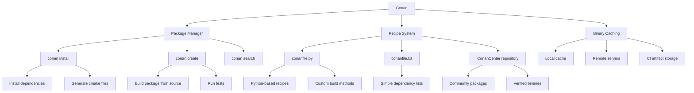

---

title: "Conan | C++ - Wyatt's Notes"
description: "The Conan package manager for C++ covering dependency resolution, build profiles, multi-configuration setups, and remote repositories."
date: 2025-12-11T05:01:52.356Z
tags:
  - cpp
categories:
  - cpp
---
import Citations from '@components/Citations.astro'


<!-- Breadcrumb Schema for SEO -->
<script type="application/ld+json">
{
  "@context": "https://schema.org",
  "@type": "BreadcrumbList",
  "itemListElement": [{"name": "Home", "url": "https://wyattau.com"}, {"name": "cpp", "url": "https://cpp.wyattau.com"}, {"name": "Enviroment_and_toolchain", "url": "https://cpp.wyattau.com/enviroment_and_toolchain"}, {"name": "3_dependency_management", "url": "https://cpp.wyattau.com/enviroment_and_toolchain/3_dependency_management"}, {"name": "4_conan", "url": "https://cpp.wyattau.com/enviroment_and_toolchain/3_dependency_management/4_conan"}]
}
</script>

**Conan** is a decentralized, open-source package manager designed specifically for C++'s complex
Binary compatibility requirements. Unlike vcpkg, which defaults to a source-based model, Conan
Operates on a **Binary-First** model.

Compiling dependencies like Qt, Boost, or LLVM from source for every CI run or developer machine is
Inefficient. Conan resolves this by caching pre-compiled binaries for specific configurations
(Operating System, Compiler, Architecture, Build Type). If a matching binary exists on the remote
Server, Conan downloads it; otherwise, it builds from source and caches the result.

## The Binary Compatibility Graph

The core architectural innovation of Conan is the **Package ID**.

When a project requests a dependency (e.g., `fmt/10.1.0`), Conan computes a SHA-1 hash (the Package
ID) based on the input configuration:

1. **Settings:** Global project configuration (OS, Arch, Compiler Version, C++ Standard).
2. **Options:** Package-specific configuration (Shared/Static, `fPIC``with_ssl`).
3. **Requirements:** Version of transitive dependencies.

### Resolution Logic

1. **Compute Hash:** The client calculates the Package ID required for the current environment.
2. **Query Remote:** The client asks the remote registry (ConanCenter or Artifactory) if a binary
   artifact with that ID exists.
3. **Retrieval:**

- **Hit:** Download the binary (headers and libs).
- **Miss:** Download the recipe (`conanfile.py`), build from source locally, and (optionally) upload
  the new binary to the remote.

### Package ID Calculation: Formal Treatment

The Package ID is a SHA-1 hash computed over the concatenation of:

$$
\mathrm{PackageID = \mathrm{SHA1(\mathrm{settings \| \mathrm{options \| \mathrm{requires)
$$

Where `settings` is a sorted dictionary of `os``arch``compiler``compiler.version`
`compiler.libcxx``build_type`Etc. The `options` dictionary is package-specific. The `requires` List
captures transitive dependency versions.

**Theorem:** Two machines with identical profiles and identical dependency version constraints will
Compute the same Package ID.

**Proof:** SHA-1 is a deterministic function: identical inputs always produce identical outputs. The
Profile defines the `settings` dictionary. The `conanfile.txt` (or `conanfile.py`) defines the
`options` and `requires`. If both are identical on two machines, the SHA-1 input is identical, and
Therefore the output is identical. $\blacksquare$

**Corollary:** If two machines have the same Package ID for a dependency, they can share the same
Pre-compiled binary. This is the foundation of Conan's binary caching.

## Profile Configuration

A **Conan Profile** is a text file that defines the "Settings" used to calculate the Package ID. It
Represents the target platform's state.

Conan 2.0 mandates a separation between two contexts to support cross-compilation:

1. **Build Profile:** The machine running the build (e.g., x86_64 Linux CI Agent).
2. **Host Profile:** The machine that will run the artifacts (e.g., ARM64 Embedded Device).

### Anatomy of a Profile

Profiles are stored in `~/.conan2/profiles/`. A standard profile named `linux-clang-release` might
Look like this:

```ini
[settings]
os=Linux
arch=x86_64
compiler=clang
compiler.version=16
compiler.libcxx=libstdc++11
compiler.cppstd=23
build_type=Release

[options]
## Force all dependencies to be static by default
*:shared=False
## Specific override
openssl/*:shared=True

[tool_requires]
# Inject build tools into the environment
cmake/3.27.0
ninja/1.11.1
```

### Profile Composition

Profiles supports inheritance using the `include()` directive, allowing architectural layering.

**base_linux:**

```ini
[settings]
os=Linux
compiler=gcc
compiler.version=13
compiler.libcxx=libstdc++11
```

**debug_x64:**

```ini
include(base_linux)
[settings]
arch=x86_64
build_type=Debug
```

### Cross-Compilation Profiles

For cross-compilation, Conan requires separate build and host profiles:

```ini
# profile/build-linux (the machine running the compiler)
[settings]
os=Linux
arch=x86_64
compiler=gcc
compiler.version=13
compiler.libcxx=libstdc++11
build_type=Release
```

```ini
# profile/host-arm64 (the target device)
[settings]
os=Linux
arch=armv8
compiler=gcc
compiler.version=13
compiler.libcxx=libstdc++11
build_type=Release
compiler.cppstd=20
```

```bash
conan install . --build=missing \
    -pr:b=profile/build-linux \
    -pr:h=profile/host-arm64
```

## Dependency Specification

Dependencies are declared in a `conanfile.txt` (declarative) or `conanfile.py` (imperative) at the
Project root.

### The Declarative Approach (`conanfile.txt`)

For consumption-only workflows, `conanfile.txt` is sufficient.

```ini
[requires]
fmt/10.1.1
nlohmann_json/3.11.2
spdlog/1.12.0

[generators]
# Generates CMake toolchain files and target definitions
CMakeDeps
CMakeToolchain

[options]
spdlog/*:header_only=True
```

### The Imperative Approach (`conanfile.py`)

For complex logic (e.g., conditional dependencies based on OS), use Python.

```python
from conan import ConanFile

class SystemRecipe(ConanFile):
    settings = "os", "compiler", "build_type", "arch"
    generators = "CMakeDeps", "CMakeToolchain"

    def requirements(self):
        self.requires("fmt/10.1.1")
        if self.settings.os == "Windows":
            self.requires("pthreads4w/3.0.0")

    def layout(self):
        # Standardizes build folder structures (cmake_layout)
        from conan.tools.cmake import cmake_layout
        cmake_layout(self)
```

## CMake Integration

Conan 2.0 integration relies on generating a **CMake Toolchain File** that injects the dependency
Paths into the build system. This process decouples the package manager from the build system.

### Workflow

1. **Install Dependencies:** Run Conan to resolve the graph and generate toolchains.

   ```bash
   conan install . --output-folder=build --build=missing -pr:h=linux-clang-release -pr:b=default
   ```

- `-pr:h`: Host profile (Target).
- `-pr:b`: Build profile (Build Agent).
- `--build=missing`: Build from source if binary is not found.

1. **Configure CMake:** Pass the generated toolchain to CMake.

   ```bash
   cmake -S . -B build -DCMAKE_TOOLCHAIN_FILE=build/conan_toolchain.cmake -DCMAKE_BUILD_TYPE=Release
   ```

2. **Build:**

   ```bash
   cmake --build build
   ```

### CMakeLists.txt Configuration

Inside `CMakeLists.txt`Treat Conan packages as standard targets. The `CMakeDeps` generator creates
Config files for `find_package`.

```cmake
cmake_minimum_required(VERSION 3.25)
project(App LANGUAGES CXX)

find_package(fmt REQUIRED)
find_package(nlohmann_json REQUIRED)

add_executable(App main.cpp)
target_link_libraries(App PRIVATE fmt::fmt nlohmann_json::nlohmann_json)
```

## Remote Architecture and Artifactory

In a professional environment, reliance on the public `ConanCenter` is often restricted due to
Security or availability concerns. Organizations deploy **JFrog Artifactory** or **Sonatype Nexus**
As private Conan remotes.

### Remote Configuration

```bash
# Add a private remote
conan remote add internal-artifacts https://artifactory.company.com/artifactory/api/conan/conan-local

# Authenticate
conan user -p <password> -r internal-artifacts <username>
```

### The CI/CD Pipeline Flow

1. **Build Job:**

- Checkout Source.
- `conan create .` (Builds the package locally).
- `conan upload <package> -r internal-artifacts`.

1. **Consumer Job:**

- `conan install . -r internal-artifacts`.
- Conan detects the pre-built binary in Artifactory matching the CI profile.
- Downloads binary (seconds) instead of compiling (minutes).

---

<!-- Breadcrumb Schema for SEO -->
<script type="application/ld+json">
{
  "@context": "https://schema.org",
  "@type": "BreadcrumbList",
  "itemListElement": [{"name": "Home", "url": "https://wyattau.com"}, {"name": "cpp", "url": "https://cpp.wyattau.com"}, {"name": "Enviroment_and_toolchain", "url": "https://cpp.wyattau.com/enviroment_and_toolchain"}, {"name": "3_dependency_management", "url": "https://cpp.wyattau.com/enviroment_and_toolchain/3_dependency_management"}, {"name": "4_conan", "url": "https://cpp.wyattau.com/enviroment_and_toolchain/3_dependency_management/4_conan"}]
}
</script>

## Creating Packages (`conan create`)

The `conan create` command is the primary mechanism for building and publishing Conan packages. It
Executes a five-stage pipeline defined in your `conanfile.py`:

### The Five Stages of `conan create`

| Stage     | Method in `conanfile.py` | Purpose                                                  |
| :-------- | :----------------------- | :------------------------------------------------------- |
| `layout`  | `layout()`               | Configure source/build/package folder structure          |
| `source`  | `source()`               | Download/extract source code from remote                 |
| `build`   | `build()`                | Compile the library (invoke CMake, Make, etc.)           |
| `package` | `package()`              | Copy build artifacts (headers, libs) into package folder |
| `test`    | `test()`                 | Run consumer tests against the built package             |

### Complete Recipe Example

The following is a production-ready `conanfile.py` for a library named `mylib` that depends on
`fmt`:

```python
from conan import ConanFile
from conan.tools.cmake import CMake, CMakeToolchain, cmake_layout
from conan.tools.files import copy, rmdir
import os

class MyLibConan(ConanFile):
    name = "mylib"
    version = "1.0.0"
    license = "MIT"
    author = "Team"
    description = "A high-performance data processing library"
    topics = ("cpp", "data", "processing")
    settings = "os", "compiler", "build_type", "arch"
    exports_sources = "src/*", "CMakeLists.txt", "include/*"
    generators = "CMakeDeps", "CMakeToolchain"

    def requirements(self):
        self.requires("fmt/10.1.1", transitive_headers=True)

    def layout(self):
        cmake_layout(self)

    def build(self):
        cmake = CMake(self)
        cmake.configure()
        cmake.build()

    def package(self):
        cmake = CMake(self)
        cmake.install()

    def package_info(self):
        self.cpp_info.libs = ["mylib"]
        self.cpp_info.bindirs = ["lib"]
        self.cpp_info.includedirs = ["include"]

        # Platform-specific system libraries
        if self.settings.os == "Linux":
            self.cpp_info.system_libs = ["pthread", "dl"]
        elif self.settings.os == "Windows":
            self.cpp_info.system_libs = ["ws2_32"]

        # Compile definitions to propagate to consumers
        if self.settings.build_type == "Debug":
            self.cpp_info.defines = ["MYLIB_DEBUG"]
```

### Package ID Calculation

When `conan create` runs, it computes a SHA-1 hash from the combined settings, options, and
Transitive dependency versions. Two machines with identical profiles will compute the same Package
ID and can share binaries.

```bash
# Inspect the computed package ID
conan inspect . -a package_id

# View the dependency graph with package IDs
conan graph info . --format=dot
```

### `package_info()` -- The Contract with Consumers

The `package_info()` method is critical: it defines what consumers see when they
`find_package(mylib)`. It specifies:

- **`self.cpp_info.libs`**: Library files to link (without prefix/suffix).
- **`self.cpp_info.system_libs`**: System libraries (e.g., `pthread``dl``ws2_32`).
- **`self.cpp_info.defines`**: Preprocessor definitions consumers should inherit.
- **`self.cpp_info.cxxflags`**: Compiler flags to propagate.
- **`self.cpp_info.bindirs` / `includedirs`**: Search paths for binaries and headers.

```python
def package_info(self):
    self.cpp_info.libs = ["mylib"]
    if self.settings.os == "Linux":
        self.cpp_info.system_libs = ["pthread", "dl"]
    elif self.settings.os == "Windows":
        self.cpp_info.system_libs = ["ws2_32"]
    if self.settings.build_type == "Debug":
        self.cpp_info.defines.append("MYLIB_DEBUG")
```

---

<!-- Breadcrumb Schema for SEO -->
<script type="application/ld+json">
{
  "@context": "https://schema.org",
  "@type": "BreadcrumbList",
  "itemListElement": [{"name": "Home", "url": "https://wyattau.com"}, {"name": "cpp", "url": "https://cpp.wyattau.com"}, {"name": "Enviroment_and_toolchain", "url": "https://cpp.wyattau.com/enviroment_and_toolchain"}, {"name": "3_dependency_management", "url": "https://cpp.wyattau.com/enviroment_and_toolchain/3_dependency_management"}, {"name": "4_conan", "url": "https://cpp.wyattau.com/enviroment_and_toolchain/3_dependency_management/4_conan"}]
}
</script>

## CMake Toolchain Integration Details

### What `CMakeToolchain` Generates

The `CMakeToolchain` generator creates a `conan_toolchain.cmake` file that sets CMake variables
Before the project's `CMakeLists.txt` is processed. This file configures:

| CMake Variable                            | Purpose                                       |
| :---------------------------------------- | :-------------------------------------------- |
| `CMAKE_C_COMPILER` / `CMAKE_CXX_COMPILER` | Compiler executable path (from build profile) |
| `CMAKE_BUILD_TYPE`                        | Build type (Debug, Release, RelWithDebInfo)   |
| `CMAKE_POSITION_INDEPENDENT_CODE`         | Set to ON when building shared libraries      |
| `BUILD_SHARED_LIBS`                       | Controlled by the `*:shared` option           |
| `CMAKE_PREFIX_PATH`                       | Paths to dependency package folders           |

### What `CMakeDeps` Generates

`CMakeDeps` creates `FindXXX.cmake` or `XXXConfig.cmake` files in the build directory, enabling
`find_package()`:

```
build/
  Generators/
    fmt/
      fmtConfig.cmake          <- find_package(fmt) uses this
      fmtTargets.cmake         <- defines fmt::fmt target
    nlohmann_json/
      nlohmann_jsonConfig.cmake
```

### Two-Phase Workflow (CMake Presets Integration)

Conan 2.x integrates with CMake presets to eliminate manual toolchain passing:

```bash
# Step 1: Install dependencies and generate CMakePresets.json
conan install . --output-folder=build --build=missing

# Step 2: CMake automatically picks up the preset
cmake --preset conan-release
cmake --build --preset conan-release
```

This is the recommended workflow for Conan 2.x. The `conan install` command generates a
`CMakePresets.json` in the build folder that configures the toolchain and build directories.

---

<!-- Breadcrumb Schema for SEO -->
<script type="application/ld+json">
{
  "@context": "https://schema.org",
  "@type": "BreadcrumbList",
  "itemListElement": [{"name": "Home", "url": "https://wyattau.com"}, {"name": "cpp", "url": "https://cpp.wyattau.com"}, {"name": "Enviroment_and_toolchain", "url": "https://cpp.wyattau.com/enviroment_and_toolchain"}, {"name": "3_dependency_management", "url": "https://cpp.wyattau.com/enviroment_and_toolchain/3_dependency_management"}, {"name": "4_conan", "url": "https://cpp.wyattau.com/enviroment_and_toolchain/3_dependency_management/4_conan"}]
}
</script>

## Version Ranges and Conflict Resolution

### Version Ranges

Conan supports semantic version ranges in dependency specifications:

```ini
[requires]
fmt/[>=10.0 <11.0]    # Accept any 10.x version
boost/[>=1.82.0]      # Accept 1.82.0 and above
```

Version ranges resolve to the **latest matching version** on the remote. This is useful for getting
Patch updates without manually bumping versions.

### Conflict Resolution

When two dependencies require different versions of the same package, Conan raises a conflict error:

```
ERROR: Conflict in mylib/1.0.0:
    Requirement fmt/10.0.0 conflicts with fmt/9.1.0 required by other_lib/2.0.0
```

Resolution strategies:

1. **Narrow the version range** to force compatibility:

   ```ini
   [requires]
   fmt/10.1.1    # Pin exact version
   ```

2. **Use `conan lock`** to lock the entire dependency graph:

   ```bash
   conan lock create . --lockfile=conan.lock
   conan install . --lockfile=conan.lock --lockfile-out=conan.lock
   ```

The lock file records exact versions and package IDs for every transitive dependency, ensuring
reproducible builds across machines and time.

1. **Override** a specific dependency version:

   ```bash
   conan install . --build=missing -o 'other_lib/*:fmt_version=10.1.1'
   ```

---

<!-- Breadcrumb Schema for SEO -->
<script type="application/ld+json">
{
  "@context": "https://schema.org",
  "@type": "BreadcrumbList",
  "itemListElement": [{"name": "Home", "url": "https://wyattau.com"}, {"name": "cpp", "url": "https://cpp.wyattau.com"}, {"name": "Enviroment_and_toolchain", "url": "https://cpp.wyattau.com/enviroment_and_toolchain"}, {"name": "3_dependency_management", "url": "https://cpp.wyattau.com/enviroment_and_toolchain/3_dependency_management"}, {"name": "4_conan", "url": "https://cpp.wyattau.com/enviroment_and_toolchain/3_dependency_management/4_conan"}]
}
</script>

## `build_requires` vs `requires`

Conan 2.x distinguishes between two types of dependencies:

### `requires` (Runtime Dependencies)

These are libraries that your project links against at runtime. They contribute to the Package ID
Hash and their binaries are needed by consumers.

```python
def requirements(self):
    self.requires("fmt/10.1.1")
    self.requires("openssl/3.1.0")
```

### `tool_requires` (Build-Time Dependencies)

These are tools needed during the build process but not at runtime. They do not affect the Package
ID and are not propagated to consumers. In Conan 2.x, `build_requires` is replaced by
`tool_requires` in the `[tool_requires]` section of profiles or in the recipe.

```python
from conan.tools.cmake import CMakeDeps, CMakeToolchain

class MyLibConan(ConanFile):
    tool_requires = "cmake/3.28.1"
    # or equivalently:
    # def tool_requires(self):
    #     self.tool_requires("cmake/3.28.1")
```

| Aspect                       | `requires`            | `tool_requires`       |
| :--------------------------- | :-------------------- | :-------------------- |
| **Affects Package ID**       | Yes                   | No                    |
| **Propagated to consumers**  | Yes (transitive)      | No                    |
| **Examples**                 | `fmt``openssl``boost` | `cmake``ninja``meson` |
| **Binary needed at runtime** | Yes                   | No                    |
| **Build-time only**          | No                    | Yes                   |

---

<!-- Breadcrumb Schema for SEO -->
<script type="application/ld+json">
{
  "@context": "https://schema.org",
  "@type": "BreadcrumbList",
  "itemListElement": [{"name": "Home", "url": "https://wyattau.com"}, {"name": "cpp", "url": "https://cpp.wyattau.com"}, {"name": "Enviroment_and_toolchain", "url": "https://cpp.wyattau.com/enviroment_and_toolchain"}, {"name": "3_dependency_management", "url": "https://cpp.wyattau.com/enviroment_and_toolchain/3_dependency_management"}, {"name": "4_conan", "url": "https://cpp.wyattau.com/enviroment_and_toolchain/3_dependency_management/4_conan"}]
}
</script>

## Binary Cache and Local Cache

### The Conan 2.x Cache Structure

Conan 2.x stores all data in `~/.conan2/`:

```
~/.conan2/
  cache/                    # Local binary package storage
    pkg/                    # Organized by recipe reference
      <hash>/
        <package_id_hash>/  # Package artifacts
  profiles/                 # Profile files
  remotes.json              # Remote registry configuration
```

Each package is identified by its **reference** (`fmt/10.1.1`) and **package ID** (a SHA-1 hash of
Settings/options). The cache deduplicates packages across projects: if two projects depend on
`fmt/10.1.1` with the same compiler settings, they share the same cached binary.

### Cache Management Commands

```bash
# List all cached packages
conan list "*"

# Search for a specific package
conan search "fmt/*" -r conancenter

# Remove a specific package from cache
conan remove "fmt/10.0.0*"

# Remove all cached binaries (force rebuild from source)
conan remove "*" -p -b

# Inspect package contents
conan cache path fmt/10.1.1:<package_id_hash>
```

---

<!-- Breadcrumb Schema for SEO -->
<script type="application/ld+json">
{
  "@context": "https://schema.org",
  "@type": "BreadcrumbList",
  "itemListElement": [{"name": "Home", "url": "https://wyattau.com"}, {"name": "cpp", "url": "https://cpp.wyattau.com"}, {"name": "Enviroment_and_toolchain", "url": "https://cpp.wyattau.com/enviroment_and_toolchain"}, {"name": "3_dependency_management", "url": "https://cpp.wyattau.com/enviroment_and_toolchain/3_dependency_management"}, {"name": "4_conan", "url": "https://cpp.wyattau.com/enviroment_and_toolchain/3_dependency_management/4_conan"}]
}
</script>

## Conan 1 vs Conan 2: Migration Guide

Conan 2.x introduced breaking changes designed to simplify the API and improve performance. The
Following table highlights the key differences.

| Feature                | Conan 1.x                            | Conan 2.x                                  |
| :--------------------- | :----------------------------------- | :----------------------------------------- |
| **Configuration file** | `conan.conf` in `~/.conan`           | No global config (profile-based)           |
| **Recipe imports**     | `from conans import ConanFile`       | `from conan import ConanFile`              |
| **CMake integration**  | `self.settings.compiler.libcxx`      | `compiler.libcxx` in profile               |
| **Build method**       | `def build(self)` with `CMake(self)` | Same, but `CMake` from `conan.tools.cmake` |
| **Package info**       | `self.cpp_info`                      | Same (compatible)                          |
| **Generators**         | `cmake``cmake_find_package`          | `CMakeDeps``CMakeToolchain`                |
| **Install command**    | `conan install . -s ...`             | `conan install . -pr:...`                  |
| **Remote commands**    | `conan remote add`                   | Same (compatible)                          |
| **Lock files**         | `conan lock create`                  | Same (compatible)                          |
| **Cache location**     | `~/.conan/data/`                     | `~/.conan2/cache/`                         |
| **Python API**         | Many deprecated functions            | Cleaned-up, fewer functions                |
| **`build_requires`**   | `self.build_requires("cmake/...")`   | `self.tool_requires("cmake/...")`          |

### Key Migration Steps

1. Change `from conans import ConanFile` to `from conan import ConanFile`.
2. Replace `cmake` generator with `CMakeDeps` and `CMakeToolchain`.
3. Move `compiler.libcxx` from the recipe to the profile.
4. Replace `self.build_requires` with `self.tool_requires`.
5. Clear the Conan 1.x cache: `rm -rf ~/.conan`.

---

<!-- Breadcrumb Schema for SEO -->
<script type="application/ld+json">
{
  "@context": "https://schema.org",
  "@type": "BreadcrumbList",
  "itemListElement": [{"name": "Home", "url": "https://wyattau.com"}, {"name": "cpp", "url": "https://cpp.wyattau.com"}, {"name": "Enviroment_and_toolchain", "url": "https://cpp.wyattau.com/enviroment_and_toolchain"}, {"name": "3_dependency_management", "url": "https://cpp.wyattau.com/enviroment_and_toolchain/3_dependency_management"}, {"name": "4_conan", "url": "https://cpp.wyattau.com/enviroment_and_toolchain/3_dependency_management/4_conan"}]
}
</script>

## Conan vs vcpkg: Architectural Trade-offs

| Aspect             | Conan                                              | vcpkg                                           |
| :----------------- | :------------------------------------------------- | :---------------------------------------------- |
| **Binary model**   | Binary-first: downloads pre-built binaries         | Source-first: compiles from source by default   |
| **Package format** | Python-based `conanfile.py` (flexible)             | `vcpkg.json` + `portfile.cmake` (CMake-centric) |
| **C++ Standard**   | Separate build/host profiles for cross-compilation | Triplets (simpler but less flexible)            |
| **Registry**       | Any remote (JFrog, S3, local filesystem)           | Built-in GitHub catalog                         |
| **Binary caching** | Built-in, per-configuration SHA-1 based            | Binary caching via NuGet feeds or Azure         |
| **Versioning**     | Semantic version ranges                            | Versions in port manifest                       |
| **Ecosystem**      | Widely used in embedded, gaming, enterprise        | Microsoft-backed, strong on Windows             |

Conan's binary-first approach makes it significantly faster for CI pipelines where the same
Dependency is built repeatedly. Vcpkg's source-first approach guarantees reproducibility (you always
Build from source on your exact toolchain) but at the cost of build time.

---

<!-- Breadcrumb Schema for SEO -->
<script type="application/ld+json">
{
  "@context": "https://schema.org",
  "@type": "BreadcrumbList",
  "itemListElement": [{"name": "Home", "url": "https://wyattau.com"}, {"name": "cpp", "url": "https://cpp.wyattau.com"}, {"name": "Enviroment_and_toolchain", "url": "https://cpp.wyattau.com/enviroment_and_toolchain"}, {"name": "3_dependency_management", "url": "https://cpp.wyattau.com/enviroment_and_toolchain/3_dependency_management"}, {"name": "4_conan", "url": "https://cpp.wyattau.com/enviroment_and_toolchain/3_dependency_management/4_conan"}]
}
</script>

## Intuition

**Cross-platform packages:** Conan is like a universal package manager — it provides pre-built binaries for many platforms and compilers.

**Why it matters:** Conan simplifies dependency management in complex projects, especially when targeting multiple platforms.

**The key insight:** Conan's binary caching avoids rebuilding dependencies from source — this dramatically speeds up builds.

## Common Pitfalls

- **Not using `conan lock` for CI.** Without a lock file, CI builds can silently pick up new
  dependency versions that pass on one configuration but break on another. Always generate a lock
  file and commit it to version control.
- **Mixing build and host profiles in native builds.** On native (non-cross-compiled) builds, both
  the build and host profiles should match. If they differ, Conan may download a binary built for
  the wrong platform, causing cryptic runtime crashes.
- **Forgetting `--build=missing`.** If a binary does not exist on the remote and you do not specify
  `--build=missing`Conan fails with a "binary not found" error. Use `--build=missing` for local
  development and `--build=never` for CI (where all binaries should come from the remote).
- **Not pinning the CMake version in `tool_requires`.** Different CMake versions generate different
  project files. If your CI uses CMake 3.28 but your local machine uses CMake 3.25, the generated
  build files may differ. Pin CMake in your profile: `cmake/3.28.1` in `[tool_requires]`.
- **Using `conanfile.txt` for complex projects.** The declarative format does not support
  conditional dependencies, custom build steps, or `test()` methods. Once your project needs
  OS-specific dependencies or custom packaging logic, migrate to `conanfile.py`.
- **Ignoring ABI compatibility.** Conan's Package ID does not capture ABI changes caused by compiler
  flags like `-D_GLIBCXX_USE_CXX11_ABI`. If two TUs are compiled with different ABI settings,
  linking them causes crashes. Ensure your profile captures all ABI-affecting settings.
- **Stale Conan 1.x cache.** If you have both Conan 1.x and 2.x installed, the `conan` command may
  invoke the wrong version. Verify with `conan --version` and use `conan2` as an alias if necessary.
  The caches are separate (`~/.conan` vs `~/.conan2`).

## Conan Recipe: Packaging a Header-Only Library

Header-only libraries have a simplified Conan recipe because there is no build step and no binary
Artifact to package:

```python
from conan import ConanFile
from conan.tools.files import copy
import os

class HeaderOnlyLibConan(ConanFile):
    name = "header_only_lib"
    version = "2.0.0"
    license = "BSL-1.0"
    description = "A header-only signal/slot library"
    settings = "os", "compiler", "build_type", "arch"
    exports_sources = "include/*"

    def package_id(self):
        # Header-only: all configurations produce the same package
        self.info.clear()

    def package(self):
        copy(self, "*.hpp", dst="include", src=os.path.join(self.source_folder, "include"))
        copy(self, "*.h", dst="include", src=os.path.join(self.source_folder, "include"))

    def package_info(self):
        self.cpp_info.bindirs = []
        self.cpp_info.libdirs = []
```

The key technique is `self.info.clear()` in `package_id()`Which tells Conan that all compiler
Settings produce the same package (since there is no binary). This means only one package is ever
Cached, regardless of the consumer's profile.

## Conan Recipe: Packaging a Library with Options

For libraries with configurable features (e.g., enable/disable SSL, choose threading model):

```python
from conan import ConanFile
from conan.tools.cmake import CMake, CMakeToolchain, cmake_layout
from conan.tools.files import copy
import os

class FeatureLibConan(ConanFile):
    name = "feature_lib"
    version = "3.1.0"
    license = "MIT"
    settings = "os", "compiler", "build_type", "arch"

    options = {
        "shared": [True, False],
        "fPIC": [True, False],
        "with_ssl": [True, False],
        "threading": ["none", "std", "boost"],
    }

    default_options = {
        "shared": False,
        "fPIC": True,
        "with_ssl": False,
        "threading": "std",
    }

    exports_sources = "src/*", "CMakeLists.txt", "include/*"

    def config_options(self):
        if self.settings.os == "Windows":
            self.options.rm_safe("fPIC")

    def configure(self):
        if self.options.shared:
            self.options.rm_safe("fPIC")

    def requirements(self):
        if self.options.with_ssl:
            self.requires("openssl/3.1.0")

    def layout(self):
        cmake_layout(self)

    def generate(self):
        tc = CMakeToolchain(self)
        tc.variables["WITH_SSL"] = self.options.with_ssl
        tc.variables["THREADING"] = self.options.threading
        tc.generate()

    def build(self):
        cmake = CMake(self)
        cmake.configure()
        cmake.build()

    def package(self):
        cmake = CMake(self)
        cmake.install()

    def package_info(self):
        self.cpp_info.libs = ["feature_lib"]
        if self.options.with_ssl:
            self.cpp_info.defines.append("FEATURE_LIB_SSL")
```

The `options` dictionary defines package-specific configuration that affects the Package ID. Each
Unique combination of option values produces a different binary, preventing ABI mismatches.

## Conan Center and Private Repositories

### ConanCenter

ConanCenter is the public repository of Conan packages maintained by the community. It contains
Thousands of popular C++ libraries with tested recipes.

```bash
# Search for a package
conan search "fmt/*" -r conancenter

# Get package information
conan inspect fmt/10.1.1 -r conancenter
```

### Private Repository Setup

Organizations deploy JFrog Artifactory as their private Conan remote:

```bash
# Configure Artifactory remote
conan remote add company https://artifactory.company.com/artifactory/api/conan/company-libs

# Authenticate
conan remote login company -p <token> <username>

# Upload a package
conan upload mylib/1.0.0 -r company

# Download and use
conan install . -r company --build=missing
```

<Citations sources={[
  {title="Effective Modern C++", author="Meyers", year="2014", type="book"},
  {title="C++ Software Design", author="Dresler", year="2025", type="book"},
]} />

## See Also

- [Dependency Resolution](1_dependency_architectures_models) -- Package manager taxonomy
- [vcpkg](3_vcpkg) -- Source-first alternative
- [CPM.cmake](2_cpm) -- Lightweight source-based alternative
- [Binary Caching](6_binary_caching) -- Conan's binary caching architecture



## Summary

This topic covers the essential concepts and techniques related to conan, including key principles
and practical applications.

**Key concepts include:**

- core concepts and definitions
- key principles and frameworks
- practical applications
- common techniques and methods
- evaluation and critical analysis

A thorough understanding of these concepts, combined with regular practice and review, is essential
for mastery of this topic.

## Worked Examples

Worked examples demonstrating the application of key concepts are covered in the detailed sub-pages
linked above.
