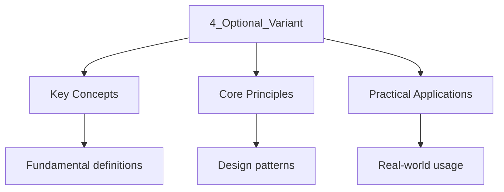

---

title: Algebraic Error Handling — std::optional and std::variant
description: "and are stack-allocated, type-safe alternatives to exceptions for Representing values that may be absent or that may hold one of several alternative types."
date: 2026-04-03T00:00:00.000Z
tags:
  - Cpp
categories:
  - Cpp

---

<!-- Breadcrumb Schema for SEO -->
<script type="application/ld+json">
{
  "@context": "https://schema.org",
  "@type": "BreadcrumbList",
  "itemListElement": [{"name": "Home", "url": "https://wyattau.com"}, {"name": "cpp", "url": "https://cpp.wyattau.com"}, {"name": "Function_architecture", "url": "https://cpp.wyattau.com/function_architecture"}, {"name": "2_error_handling", "url": "https://cpp.wyattau.com/function_architecture/2_error_handling"}, {"name": "4_optional_variant", "url": "https://cpp.wyattau.com/function_architecture/2_error_handling/4_optional_variant"}]
}
</script>

## Algebraic Error Handling

`std::optional` and `std::variant` are stack-allocated, type-safe alternatives to exceptions for
Representing values that may be absent or that may hold one of several alternative types.

## 4.1 `std::optional<T>`

`std::optional<T>` models a value that may or may not be present [N4950 §20.6]. It is allocated on
The stack, stores at most one `T`And requires no heap allocation.

```cpp
#include <iostream>
#include <optional>
#include <string>
#include <fstream>
#include <sstream>

std::optional<std::string> read_first_line(const std::string& path) {
    std::ifstream file{path};
    if (!file.is_open()) {
        return std::nullopt;
    }
    std::string line;
    if (std::getline(file, line)) {
        return line;
    }
    return std::nullopt;
}

int main() {
    auto result = read_first_line("/nonexistent/file.txt");

    if (result.has_value()) {
        std::cout << "First line: " << result.value() << "\n";
    } else {
        std::cout << "File could not be read or is empty\n";
    }

    auto val = result.value_or("(no line)");
    std::cout << "With default: " << val << "\n";

    result.transform([](const std::string& s) {
        return s.size();
    }).and_then([](std::size_t len) -> std::optional<std::size_t> {
        if (len > 0) return len;
        return std::nullopt;
    });

    return 0;
}
```

## 4.2 `std::variant<T, U, V>`

`std::variant` is a type-safe, stack-allocated union that holds exactly one of its alternative types
At any time [N4950 §20.7].

```cpp
#include <iostream>
#include <variant>
#include <string>
#include <stdexcept>

struct ParseError {
    std::string message;
    std::size_t position;
};

struct ValueError {
    std::string expected;
    std::string found;
};

using ParseResult = std::variant<int, ParseError, ValueError>;

ParseResult parse_int(const std::string& s) {
    if (s.empty()) {
        return ParseError{"empty input", 0};
    }
    std::size_t pos = 0;
    try {
        std::size_t processed = 0;
        int val = std::stoi(s, &processed);
        if (processed != s.size()) {
            return ParseError{"trailing characters", processed};
        }
        return val;
    } catch (const std::invalid_argument&) {
        return ValueError{"integer", s};
    } catch (const std::out_of_range&) {
        return ValueError{"in-range integer", s};
    }
}

int main() {
    auto results = {
        parse_int("42"),
        parse_int("3.14"),
        parse_int(""),
        parse_int("99999999999999999999"),
    };

    for (const auto& r : results) {
        std::visit([](const auto& v) {
            using T = std::decay_t<decltype(v)>;
            if constexpr (std::is_same_v<T, int>) {
                std::cout << "  Parsed: " << v << "\n";
            } else if constexpr (std::is_same_v<T, ParseError>) {
                std::cout << "  ParseError at " << v.position << ": " << v.message << "\n";
            } else if constexpr (std::is_same_v<T, ValueError>) {
                std::cout << "  ValueError: expected " << v.expected
                          << ", got \"" << v.found << "\"\n";
            }
        }, r);
    }
    return 0;
}
// Output:
//   Parsed: 42
//   ParseError at 3: trailing characters
//   ParseError at 0: empty input
//   ValueError: expected in-range integer, got "99999999999999999999"
```

## 4.3 `std::visit` and `std::get`

```cpp
#include <iostream>
#include <variant>
#include <string>

using Value = std::variant<int, double, std::string>;

struct Printer {
    void operator()(int v) const { std::cout << "int: " << v << "\n"; }
    void operator()(double v) const { std::cout << "double: " << v << "\n"; }
    void operator()(const std::string& v) const { std::cout << "string: " << v << "\n"; }
};

int main() {
    Value v = std::string{"hello"};

    std::visit(Printer{}, v);
    v = 42;
    std::visit(Printer{}, v);

    try {
        std::get<double>(v);
    } catch (const std::bad_variant_access& e) {
        std::cout << "bad_variant_access: " << e.what() << "\n";
    }

    if (auto* p = std::get_if<std::string>(&v)) {
        std::cout << "string value: " << *p << "\n";
    } else {
        std::cout << "not a string\n";
    }

    if (auto* p = std::get_if<int>(&v)) {
        std::cout << "int value: " << *p << "\n";
    }

    return 0;
}
// Output:
//   string: hello
//   int: 42
//   bad_variant_access: std::bad_variant_access
//   not a string
//   int value: 42
```

## 4.4 Comparison with Exceptions

| Aspect                | Exceptions           | `std::optional`              | `std::variant`                     |
| --------------------- | -------------------- | ---------------------------- | ---------------------------------- |
| Overhead (no error)   | ~0 (table-based)     | 0                            | 0                                  |
| Overhead (error path) | ~$\mu s$             | ~ns                          | ~ns                                |
| Error type            | Any type             | `std::nullopt` only          | User-defined alternatives          |
| Composability         | Implicit (unwinding) | Explicit (check `has_value`) | Explicit (`std::visit`/`std::get`) |
| Catches missed errors | No (terminate)       | Yes (forgot to check)        | Yes (forgot to check)              |

## See Also

- [The noexcept Specifier](3_noexcept)
- [Monadic Error Handling — std::expected](5_expected)

## 4.5 `std::optional` API Deep Dive

### Core Operations

```cpp
#include <optional>
#include <iostream>
#include <string>
#include <cassert>

struct Config {
    std::string name;
    int timeout;
};

std::optional<Config> load_config(const std::string& path) {
    if (path.empty()) return std::nullopt;
    return Config{"default", 30};
}

int main() {
    auto cfg = load_config("/etc/app/config.toml");

    // has_value() / operator bool
    if (cfg.has_value()) {
        std::cout << "name: " << cfg->name << "\n";
    }
    if (cfg) {
        std::cout << "timeout: " << cfg->timeout << "\n";
    }

    // value() — throws std::bad_optional_access if empty
    try {
        auto empty = std::optional<int>{};
        (void)empty.value();  // throws
    } catch (const std::bad_optional_access& e) {
        std::cout << "bad_optional_access: " << e.what() << "\n";
    }

    // value_or() — returns default if empty
    auto cfg2 = load_config("");
    std::cout << "name: " << cfg2.value_or(Config{"fallback", 10}).name << "\n";

    // emplace() — destroys existing value, constructs new one in place
    std::optional<std::string> label{"hello"};
    label.emplace("world");
    assert(label.value() == "world");

    // reset() — destroys the value, makes optional empty
    label.reset();
    assert(!label.has_value());

    // transform() (C++23) — maps the value if present
    std::optional<int> len = cfg.transform([](const Config& c) {
        return static_cast<int>(c.name.size());
    });
    if (len) std::cout << "name length: " << *len << "\n";

    // and_then() (C++23) — monadic bind
    auto timeout = cfg.and_then([](const Config& c) -> std::optional<int> {
        if (c.timeout > 0) return c.timeout;
        return std::nullopt;
    });
    if (timeout) std::cout << "timeout: " << *timeout << "\n";

    // or_else() (C++23) — fallback chain
    auto result = load_config("")
        .or_else([] { return load_config("~/.app/config"); })
        .or_else([] { return load_config("/etc/default"); });
    if (result) std::cout << "loaded: " << result->name << "\n";
    else std::cout << "no config found\n";
}
```

### `std::optional` Monadic Operations (C++23)

C++23 added monadic operations that allow chaining optional operations without explicit null checks:

| Operation   | Signature                            | Behavior                                                                          |
| :---------- | :----------------------------------- | :-------------------------------------------------------------------------------- |
| `transform` | `optional<U> transform(F&& f) const` | If engaged, returns `f(value)` wrapped in optional; otherwise `nullopt`           |
| `and_then`  | `optional<U> and_then(F&& f) const`  | If engaged, calls `f(value)` which must return `optional<U>`; otherwise `nullopt` |
| `or_else`   | `optional<T> or_else(F&& f) const`   | If empty, calls `f()` which must return `optional<T>`; otherwise returns `*this`  |

```cpp
#include <optional>
#include <string>
#include <charconv>
#include <string_view>

// Monadic parsing chain
std::optional<int> parse_int(std::string_view sv) {
    int val = 0;
    auto [ptr, ec] = std::from_chars(sv.begin(), sv.end(), val);
    if (ec != std::errc{} || ptr != sv.end()) return std::nullopt;
    return val;
}

std::optional<double> parse_double(std::string_view sv) {
    double val = 0.0;
    auto [ptr, ec] = std::from_chars(sv.begin(), sv.end(), val);
    if (ec != std::errc{} || ptr != sv.end()) return std::nullopt;
    return val;
}

// Chain: parse string -> parse as int -> validate range -> compute
std::optional<int> safe_divide(std::string_view numerator_str,
                                std::string_view denominator_str) {
    return parse_int(numerator_str).and_then([&](int num) {
        return parse_int(denominator_str).and_then([num](int den) -> std::optional<int> {
            if (den == 0) return std::nullopt;
            return num / den;
        });
    });
}

int main() {
    if (auto result = safe_divide("42", "6")) {
        std::cout << "42 / 6 = " << *result << "\n";
    }

    if (auto result = safe_divide("42", "0")) {
        std::cout << "should not print\n";
    } else {
        std::cout << "division by zero\n";
    }

    if (auto result = safe_divide("abc", "6")) {
        std::cout << "should not print\n";
    } else {
        std::cout << "parse error\n";
    }
}
```

## 4.6 `std::variant` as Tagged Union

`std::variant` is the C++ replacement for C-style tagged unions. It provides type-safe access to the
Active alternative and automatic destruction of the previous alternative on assignment.

### `std::get` vs `std::get_if`

```cpp
#include <variant>
#include <iostream>
#include <string>

using Value = std::variant<int, double, std::string>;

int main() {
    Value v = std::string{"hello"};

    // std::get<T> — throws std::bad_variant_access if wrong type
    try {
        auto s = std::get<std::string>(v);  // OK
        std::cout << "std::get: " << s << "\n";
        auto n = std::get<int>(v);  // throws — v holds string, not int
    } catch (const std::bad_variant_access& e) {
        std::cout << "bad_variant_access\n";
    }

    // std::get_if<T> — returns pointer, nullptr if wrong type
    if (auto* p = std::get_if<double>(&v)) {
        std::cout << "double: " << *p << "\n";
    } else {
        std::cout << "not a double\n";
    }

    if (auto* p = std::get_if<std::string>(&v)) {
        std::cout << "string: " << *p << "\n";
    }

    // std::holds_alternative<T> — type check without accessing
    std::cout << "holds int? " << std::holds_alternative<int>(v) << "\n";
    std::cout << "holds string? " << std::holds_alternative<std::string>(v) << "\n";

    // index() — returns the index of the active alternative
    std::cout << "index: " << v.index() << "\n";  // 2 (string is index 2)
}
```

### `std::visit` with Overloaded Patterns

```cpp
#include <variant>
#include <iostream>
#include <string>

struct PrintVisitor {
    void operator()(int v) const { std::cout << "int: " << v << "\n"; }
    void operator()(double v) const { std::cout << "double: " << v << "\n"; }
    void operator()(const std::string& v) const { std::cout << "string: " << v << "\n"; }
};

// Helper: create an overloaded visitor from multiple lambdas
template<class... Ts>
struct overloaded : Ts... { using Ts::operator()...; };

template<class... Ts>
overloaded(Ts...) -> overloaded<Ts...>;

using Value = std::variant<int, double, std::string>;

int main() {
    Value v1 = 42;
    Value v2 = 3.14;
    Value v3 = std::string{"hello"};

    // With a struct
    std::visit(PrintVisitor{}, v1);
    std::visit(PrintVisitor{}, v2);
    std::visit(PrintVisitor{}, v3);

    // With overloaded lambdas
    std::visit(overloaded{
        [](int v) { std::cout << "INT: " << v << "\n"; },
        [](double v) { std::cout << "DBL: " << v << "\n"; },
        [](const std::string& v) { std::cout << "STR: " << v << "\n"; },
    }, v1);
}
```

## 4.7 Common Patterns

### Pattern: Error Reporting with `std::variant`

```cpp
#include <variant>
#include <string>
#include <iostream>
#include <expected>

struct Error {
    int code;
    std::string message;
};

template<typename T>
using Result = std::variant<T, Error>;

Result<int> parse_hex(std::string_view sv) {
    if (sv.empty()) return Error{1, "empty input"};
    if (sv.size() > 16) return Error{2, "too long"};

    int value = 0;
    for (char c : sv) {
        value &lt;&lt;= 4;
        if (c &gt;= "0' && c &lt;= '9') value |= (c - '0');
        else if (c &gt;= 'a' && c &lt;= 'f') value |= (c - 'a' + 10);
        else if (c &gt;= 'A' && c &lt;= 'F') value |= (c - 'A' + 10);
        else return Error{3, "invalid hex digit"};
    }
    return value;
}

int main() {
    auto results = {parse_hex("FF"), parse_hex(""), parse_hex("xyz")};

    for (const auto& r : results) {
        std::visit([](const auto& v) {
            using T = std::decay_t<decltype(v)>;
            if constexpr (std::is_same_v<T, int>) {
                std::cout << "  OK: " << v << " (0x" << std::hex << v << std::dec << ")\n";
            } else {
                std::cout << "  Error [" << v.code << "]: " << v.message << "\n";
            }
        }, r);
    }
}
```

### Pattern: State Machine with `std::variant`

```cpp
#include <variant>
#include <iostream>
#include <string>

struct Idle {};
struct Loading { std::string resource; int progress; };
struct Active { int session_id; };
struct Error { std::string message; };

using State = std::variant<Idle, Loading, Active, Error>;

class StateMachine {
    State state_;

public:
    void start_load(const std::string& resource) {
        state_ = Loading{resource, 0};
    }

    void update_progress(int pct) {
        std::visit(overloaded{
            [](Idle&) { std::cout << "  ignore: not loading\n"; },
            [&](Loading& l) { l.progress = pct; },
            [](Active&) { std::cout << "  ignore: already active\n"; },
            [](Error&) { std::cout << "  ignore: in error state\n"; },
        }, state_);
    }

    void finish_load() {
        std::visit(overloaded{
            [](Idle&) { std::cout << "  error: not loading\n"; },
            [&](Loading& l) {
                std::cout << "  loaded " << l.resource << "\n";
                state_ = Active{42};
            },
            [](Active&) { std::cout << "  ignore: already active\n"; },
            [](Error&) { std::cout << "  ignore: in error state\n"; },
        }, state_);
    }

    void show_state() const {
        std::visit([](const auto& s) {
            using T = std::decay_t<decltype(s)>;
            if constexpr (std::is_same_v<T, Idle>) {
                std::cout << "  State: Idle\n";
            } else if constexpr (std::is_same_v<T, Loading>) {
                std::cout << "  State: Loading " << s.resource
                          << " (" << s.progress << "%)\n";
            } else if constexpr (std::is_same_v<T, Active>) {
                std::cout << "  State: Active (session " << s.session_id << ")\n";
            } else if constexpr (std::is_same_v<T, Error>) {
                std::cout << "  State: Error: " << s.message << "\n";
            }
        }, state_);
    }
};

int main() {
    StateMachine sm;
    sm.show_state();
    sm.start_load("data.json");
    sm.update_progress(50);
    sm.show_state();
    sm.finish_load();
    sm.show_state();
}
```

### Pattern: Lazy Initialization with `std::optional`

```cpp
#include <optional>
#include <iostream>
#include <mutex>
#include <string>

class ExpensiveResource {
    std::string data_;
public:
    ExpensiveResource() : data_("loaded") {
        std::cout << "  [ExpensiveResource] loaded\n";
    }
    const std::string& data() const { return data_; }
};

class ResourceManager {
    mutable std::mutex mtx_;
    mutable std::optional<ExpensiveResource> resource_;

public:
    const ExpensiveResource& get() const {
        std::lock_guard lock(mtx_);
        if (!resource_) {
            resource_.emplace();
        }
        return *resource_;
    }

    void invalidate() {
        std::lock_guard lock(mtx_);
        resource_.reset();
        std::cout << "  [ResourceManager] resource invalidated\n";
    }
};

int main() {
    ResourceManager mgr;

    std::cout << "First access:\n";
    const auto& r1 = mgr.get();  // triggers loading
    std::cout << "  data: " << r1.data() << "\n";

    std::cout << "Second access:\n";
    const auto& r2 = mgr.get();  // returns cached resource
    std::cout << "  data: " << r2.data() << "\n";

    std::cout << "Invalidate:\n";
    mgr.invalidate();

    std::cout << "Third access:\n";
    const auto& r3 = mgr.get();  // triggers loading again
    std::cout << "  data: " << r3.data() << "\n";
}
```

## Intuition

**Alternative return values:** std::optional is like a box that might be empty — it represents a value that might not exist. std::variant is like a tagged union — it holds exactly one of several types.

**Why it matters:** These types make error handling explicit and type-safe, avoiding null pointer errors and union-related undefined behavior.

**The key insight:** std::optional eliminates the need for sentinel values — instead of returning -1 for "not found," return an empty optional.

## Common Pitfalls

- **Using `*opt` without checking.** Dereferencing an empty `std::optional` is undefined behavior.
  Always use `has_value()``value_or()`Or `std::get_if`.
- **Storing references in `std::optional`.** `std::optional<T&>` is valid since C++23 but has
  different semantics from `std::optional<T>`. Before C++23, use
  `std::optional<std::reference_wrapper<T>>`.
- **`std::visit` with non-exhaustive visitor.** If the visitor does not handle all alternatives, the
  program will not compile. This is a feature, not a bug.
- **Exception safety of `std::variant`.** If the constructor of the new alternative throws during
  assignment, the variant is left in a valid but unspecified state. The previous value is destroyed.
- **Forgetting `std::monostate` for default-constructible variants.** If none of the alternatives is
  default-constructible, use `std::variant<std::monostate, T, U>` to make the variant itself
  default-constructible.




## Summary

This topic covers the mathematical techniques and concepts related to algebraic error handling —
std::optional and std::variant, including key theorems, methods, and problem-solving approaches.

**Key concepts include:**

- quadratic equations and the discriminant
- simultaneous equations
- polynomial division and the factor theorem
- partial fractions
- binomial expansion

Regular practice with a variety of question types is essential to build fluency and confidence in
applying these mathematical techniques.

## Worked Examples

Worked examples demonstrating the application of key concepts are covered in the detailed sub-pages
linked above.
