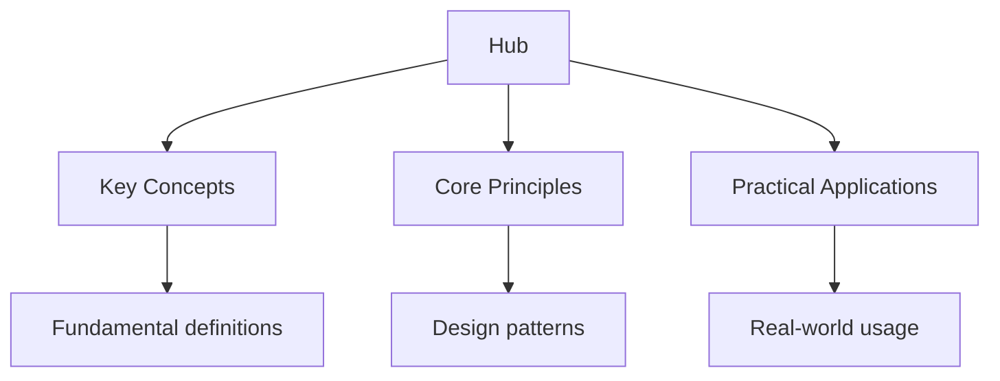

## Why This Guide Exists

C++ is one of the most powerful and complex programming languages in existence. It gives you direct control over memory, performance, and hardware — but that power comes with a steep learning curve. This hub page maps every resource on this site and provides a learning path so you can build competence systematically.

These notes cover modern C++ (C++20/23) — the version of the language used in production today. Every concept includes worked code examples, common pitfalls, and the best practices that experienced developers rely on. The goal is not just to write code that compiles, but to write code that is correct, maintainable, and performant.

## Table of Contents

- [Type System](#type-system)
- [Resource Management](#resource-management)
- [Object-Oriented Programming](#object-oriented-programming)
- [Templates and Metaprogramming](#templates-and-metaprogramming)
- [Standard Library](#standard-library)
- [Concurrency](#concurrency)
- [Function Architecture](#function-architecture)
- [Compilation Model](#compilation-model)
- [Environment and Toolchain](#environment-and-toolchain)
- [Learning Path](#learning-path)
- [Cross-Site Resources](#cross-site-resources)
- [FAQ](#faq)

---

## Type System

C++ has one of the most expressive type systems in any programming language. Understanding types — their layout, lifetime, and semantics — is the foundation for everything else in C++. Every bug in C++ ultimately traces back to a misunderstanding of how types behave.

### Topic Notes

- [Type System Overview](types) — type categories, cv-qualifiers, and type deduction
- [Data Layout](types/1_data_layout) — size, alignment, padding, and memory representation
- [Pointers, References, and Views](types/2_pointers_references_views) — raw pointers, smart pointers, references, and std::string_view
- [Initialization and Lifetime](types/3_initialization_and_lifetime) — construction, destruction, lifetime rules, and undefined behaviour

### Practice and Review

- [Flashcards: Type System](types/flashcards-type-system)
- [Practice Questions: Types and Resources](types/practice-types-resources)

### Key Concepts

**Value categories** determine how expressions are evaluated. C++ distinguishes between lvalues (named objects you can take the address of), rvalues (temporary objects), and prvalues (pure rvalues). Understanding move semantics — which transfer resources from one object to another without copying — is essential for writing efficient C++ code.

**Smart pointers** replace raw pointers for most use cases. `std::unique_ptr` provides exclusive ownership with zero overhead. `std::shared_ptr` provides shared ownership with reference counting. Raw pointers should only be used for non-owning observation.

**References** are aliases for existing objects. They cannot be null, cannot be reseated, and must be initialized. Use references when you want to communicate "this parameter is required and will not be null."

---

## Resource Management

C++ uses RAII (Resource Acquisition Is Initialization) as its primary resource management idiom. Resources — memory, file handles, network connections, locks — are acquired in constructors and released in destructors. This makes resource management automatic and exception-safe.

### Topic Notes

- [Resource Management Overview](resource_management) — RAII principles and ownership semantics
- [Ownership and RAII](resource_management/1_ownership_and_raii) — ownership transfer, move semantics, and lifetime guarantees
- [Value Categories and Move Semantics](resource_management/2_value_categories_and_move) — lvalues, rvalues, move constructors, and move assignment

### Key Concepts

**Move semantics** allow you to transfer resources from one object to another without copying. When you move a `std::vector`, the new vector takes ownership of the underlying array, and the old vector becomes empty. This is a constant-time operation regardless of the vector's size.

**Rule of Five**: if your class manages a resource, you should define (or delete) the destructor, copy constructor, copy assignment operator, move constructor, and move assignment operator. Violating this rule leads to subtle bugs with resource management.

**RAII** is the single most important idiom in C++. If you acquire a resource in a constructor and release it in the destructor, the compiler guarantees cleanup — even when exceptions are thrown. This eliminates entire categories of memory leaks, file handle leaks, and lock leaks.

---

## Object-Oriented Programming

C++ supports object-oriented programming through classes, inheritance, and polymorphism. Unlike languages with garbage collection, C++ requires you to understand object lifetime, virtual dispatch, and the cost of abstraction.

### Topic Notes

- [Object-Oriented Programming Overview](object_oriented) — classes, inheritance, and polymorphism
- [Class Design](object_oriented/1_class_design) — constructors, destructors, copy/move semantics, and rule of zero/five
- [Runtime Polymorphism](object_oriented/2_runtime_polymorphism) — virtual functions, vtables, and dynamic dispatch

### Practice and Review

- [Flashcards: OOP](object_oriented/flashcards-oop)

### Key Concepts

**Virtual functions** enable runtime polymorphism. When you call a virtual function through a base class pointer or reference, the program determines which implementation to call at runtime using the vtable. This has a small performance cost — one pointer indirection — but enables powerful design patterns like the strategy pattern and the template method pattern.

**Inheritance** models "is-a" relationships. A `Dog` is an `Animal`. Prefer composition over inheritance unless the relationship is genuinely taxonomic. Inheritance creates tight coupling and makes refactoring harder.

**The Rule of Zero** states that if your class does not manage resources directly, you should not define any of the special member functions. Let the compiler generate them. This eliminates bugs from incorrect copy/move implementations.

---

## Templates and Metaprogramming

Templates are C++'s mechanism for generic programming and compile-time computation. They allow you to write code that works with any type and to perform calculations at compile time, eliminating runtime overhead.

### Topic Notes

- [Templates Overview](templates_and_metaprogramming) — generic programming and compile-time computation
- [Generic Programming](templates_and_metaprogramming/1_generic_programming) — function templates, class templates, and template argument deduction
- [Concepts and Constraints](templates_and_metaprogramming/2_concepts_and_constraints) — C++20 concepts, requires clauses, and constrained templates
- [Compile-Time Computation](templates_and_metaprogramming/3_compile_time_computation) — constexpr, consteval, and template metaprogramming

### Practice and Review

- [Flashcards: Templates](templates_and_metaprogramming/flashcards-templates)

### Key Concepts

**Concepts** (C++20) allow you to constrain template parameters with readable requirements. Instead of writing `template<typename T>` and getting cryptic error messages when `T` does not support certain operations, you write `template<std::sortable T>` and the compiler gives clear errors when the constraint is violated.

**SFINAE** (Substitution Failure Is Not An Error) is the older mechanism for conditional template instantiation. If a template substitution produces an invalid expression, the compiler silently removes that overload from consideration rather than producing an error. Concepts replace SFINAE for most use cases.

**constexpr** functions can be evaluated at compile time when their arguments are known at compile time. This allows you to move computation from runtime to compile time with zero runtime cost.

---

## Standard Library

The C++ Standard Library provides containers, algorithms, iterators, and utilities that form the foundation of idiomatic C++. Mastering the standard library is more important than mastering language features — it is what makes you productive in C++.

### Topic Notes

- [Containers and Allocators](standard_library/1_containers_and_allocators) — vector, map, set, unordered_map, and memory management
- [Algorithms and Ranges](standard_library/2_algorithms_and_ranges) — sorting, searching, transformations, and C++20 ranges
- [Input, Output, and Formatting](standard_library/3_input_output_formatting) — streams, formatted output, and file I/O
- [System Utilities](standard_library/4_system_utilities) — smart pointers, filesystem, and threading primitives

### Key Concepts

**`std::vector`** is the default container. It provides contiguous memory, amortised O(1) append, and cache-friendly access. Use it unless you have a specific reason to use something else.

**`std::unordered_map`** provides O(1) average-case lookup by key. Use it when you do not need ordered iteration. For small maps (fewer than ~20 elements), a linear scan of `std::vector<std::pair<K,V>>` can be faster due to cache locality.

**Ranges** (C++20) provide a composable, lazy pipeline for processing sequences of elements. Instead of writing loops, you chain range adaptors like `filter`, `transform`, and `take`. This makes code more expressive and often more efficient.

---

## Concurrency

C++ supports multithreading through the standard library. Concurrency allows you to perform multiple operations simultaneously, but it introduces complexity around data races, deadlocks, and memory ordering.

### Topic Notes

- [Threading and Synchronization](concurrency/1_threading_and_synchronization) — std::thread, mutexes, condition variables, and locks
- [Memory Model and Atomics](concurrency/2_memory_model_and_atomics) — memory ordering, atomic operations, and the happens-before relationship
- [Coroutines and Async I/O](concurrency/3_coroutines_and_async_io) — C++20 coroutines, async/await patterns, and cooperative multitasking

### Key Concepts

**Data races** occur when two threads access the same memory location concurrently, at least one access is a write, and there is no synchronisation. Data races are undefined behaviour — anything can happen, including silently corrupted data. Use mutexes or atomics to prevent them.

**`std::mutex`** provides mutual exclusion. Lock it before accessing shared data and unlock it after. `std::lock_guard` and `std::unique_lock` RAII wrappers ensure the mutex is always released, even when exceptions are thrown.

**Memory ordering** determines the order in which operations performed by different threads become visible to each other. `std::memory_order_seq_cst` provides the strongest guarantees but may be slower than weaker orderings like `std::memory_order_relaxed`. In practice, prefer `std::atomic` with default ordering unless you have a measured performance reason to use weaker orderings.

---

## Function Architecture

Functions are the building blocks of C++ programs. Understanding function design — parameters, return types, overloading, and lambdas — is essential for writing clear, maintainable code.

### Topic Notes

- [Function Architecture Overview](function_architecture) — function design principles and patterns
- [Parameter passing](function_architecture) — by value, by reference, by const reference, and by rvalue reference
- [Lambda expressions](function_architecture) — anonymous functions, captures, and generic lambdas

### Key Concepts

**Pass by const reference** is the default for large objects. It avoids copying while preventing modification. Pass by value for small, cheap-to-copy types (int, double, pointers). Pass by non-const reference when the function needs to modify the argument.

**Lambdas** are anonymous functions that can capture variables from their surrounding scope. They are used extensively with standard library algorithms, callbacks, and closures. Generic lambdas (with `auto` parameters) allow you to write templates without the template syntax.

---

## Compilation Model

C++ uses a compilation model based on translation units, headers, and object files. Understanding this model is essential for build system design, template instantiation, and debugging linker errors.

### Topic Notes

- [Compilation Model Overview](compilation_model) — translation units, linkage, and the build process
- [Header files and inclusion](compilation_model) — include guards, forward declarations, and the preprocessor
- [Linkage](compilation_model) — internal and external linkage, anonymous namespaces, and ODR

---

## Environment and Toolchain

A productive C++ development environment requires knowledge of compilers, build systems, debuggers, and profiling tools. The toolchain is as important as the language itself.

### Topic Notes

- [Environment and Toolchain Overview](enviroment_and_toolchain) — compilers, build systems, and development tools
- [Compiler selection](enviroment_and_toolchain) — GCC, Clang, MSVC, and their differences
- [Build systems](enviroment_and_toolchain) — CMake, Make, and modern build configuration

---

## Learning Path

C++ is vast. Do not try to learn everything at once. Follow this progression:

### Stage 1: Foundations (Weeks 1–4)

- Master the type system — understand value categories, references, and smart pointers
- Learn RAII — acquire and release resources in constructors and destructors
- Write simple programs using the standard library (vector, string, map)

### Stage 2: Object-Oriented Design (Weeks 5–8)

- Understand class design — constructors, destructors, copy/move semantics
- Learn virtual functions and runtime polymorphism
- Study the Rule of Zero and when to use inheritance versus composition

### Stage 3: Templates and Generic Programming (Weeks 9–12)

- Write function and class templates
- Learn concepts (C++20) for constraining templates
- Explore the standard library algorithms and ranges

### Stage 4: Advanced Topics (Weeks 13–16)

- Study concurrency — threads, mutexes, atomics, and memory ordering
- Learn coroutines and async I/O
- Understand the compilation model and build system

---

## Cross-Site Resources

Wyatt's Notes is a network of interconnected programming and study sites:

- **[Python Programming Guide](https://python.wyattau.com/hub)** — if you are comparing C++ with a higher-level language
- **[Computer Science Study Guide](https://computer-science.wyattau.com/hub)** — algorithms, data structures, and theory that apply to C++
- **[Database Design Guide](https://databases.wyattau.com/hub)** — if your C++ applications interact with databases
- **[Networking Guide](https://networking.wyattau.com/hub)** — if you are building networked C++ applications
- **[University Mathematics](https://mathematics.wyattau.com/hub)** — the mathematical foundations underlying algorithms and data structures

---

## Frequently Asked Questions

### How long does it take to learn C++?

C++ is one of the hardest programming languages to master. Basic competence — writing programs that compile and run correctly — takes 2–3 months. Professional competence — writing maintainable, efficient, idiomatic C++ — takes years. The learning path above gives you a structured progression, but mastery requires building real projects.

### Should I learn C or C++ first?

If your goal is systems programming, embedded systems, or understanding how computers work at a low level, start with C. If your goal is software engineering, game development, or building applications, start with C++ directly. C++ includes everything C offers, plus higher-level abstractions.

### What is the difference between C++ and C?

C++ is a superset of C with additional features: classes, templates, the standard library, RAII, exceptions, and modern features like concepts, ranges, and coroutines. C++ provides more tools for managing complexity, but at the cost of a steeper learning curve.

### How important is understanding the standard library?

Very. The standard library provides the containers, algorithms, and utilities that make C++ productive. Learning `std::vector`, `std::map`, `std::string`, and the algorithms library is more valuable than learning obscure language features.

### What is RAII and why does it matter?

RAII (Resource Acquisition Is Initialization) is the C++ idiom where resources are acquired in constructors and released in destructors. It guarantees that resources are cleaned up automatically, even when exceptions are thrown. It is the foundation of exception-safe C++ code.

### Should I use raw pointers or smart pointers?

Use smart pointers (`std::unique_ptr`, `std::shared_ptr`) for owning pointers. Use raw pointers only for non-owning observation — when you need to refer to an object without managing its lifetime. This convention makes ownership semantics explicit and prevents most memory management bugs.

---

*Last updated: 24 July 2026*

*Written by Wyatt. For questions or feedback, visit [wyattau.com](https://wyattau.com).*
