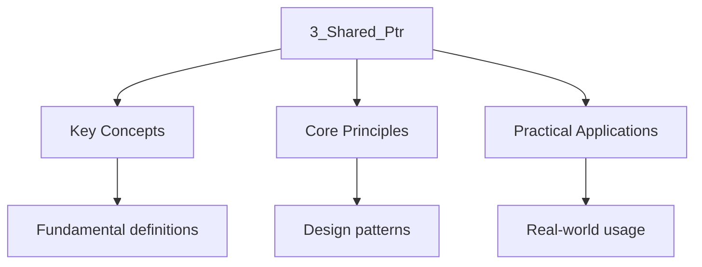

---

title: Shared Ownership (std::shared_ptr) and Control Block
description: "enables multiple owners to share a single heap-allocated object via a Reference-counted control block. While powerful, it carries significant overhead —"
date: 2026-04-03T00:00:00.000Z
tags:
  - Cpp
categories:
  - Cpp

---

<!-- Breadcrumb Schema for SEO -->
<script type="application/ld+json">
{
  "@context": "https://schema.org",
  "@type": "BreadcrumbList",
  "itemListElement": [{"name": "Home", "url": "https://wyattau.com"}, {"name": "cpp", "url": "https://cpp.wyattau.com"}, {"name": "Resource_management", "url": "https://cpp.wyattau.com/resource_management"}, {"name": "1_ownership_and_raii", "url": "https://cpp.wyattau.com/resource_management/1_ownership_and_raii"}, {"name": "3_shared_ptr", "url": "https://cpp.wyattau.com/resource_management/1_ownership_and_raii/3_shared_ptr"}]
}
</script>

## Shared Ownership (std::shared_ptr) and Control Block

`std::shared_ptr` enables multiple owners to share a single heap-allocated object via a
Reference-counted control block. While powerful, it carries significant overhead — atomic reference
Counting, a separate heap allocation, and the risk of reference cycles — and should only be used
When shared ownership is genuinely required.

## 3.1 Definition

`std::shared_ptr<T>` is a smart pointer that allows multiple owners to share a single heap-allocated
Object. The object is destroyed when the last `shared_ptr` pointing to it is destroyed or reset
[N4950 S20.11.3].

## 3.2 Control Block Layout

Every group of `shared_ptr` instances that refer to the same object share a **control block**
Allocated on the heap:

```
Control Block (separate allocation from the object):
┌─────────────────────────────────────┐
│ strong_count  (std::atomic<size_t>) │  Number of shared_ptr owners
│ weak_count    (std::atomic<size_t>) │  Number of weak_ptr observers + 1 if strong > 0
│ deleter       (function pointer)    │  Called when strong_count reaches 0
│ allocator     (function pointer)    │  Called to deallocate the control block itself
└─────────────────────────────────────┘

std::shared_ptr<T> object layout:
┌──────────────────┐
│ T* ptr_          │  (pointer to the managed object)
│ ControlBlock* cb_│  (pointer to the control block)
└──────────────────┘
sizeof(std::shared_ptr<T>) == 16 (two pointers on x86_64)
```

The control block is allocated separately from the managed object, unless `std::make_shared` is
used.

### When the Control Block Is Created

A control block is created at the following points:

1. `std::make_shared&lt;T&gt;(args...)`. Single allocation for object + control block
2. `std::shared_ptr&lt;T&gt;(new T(args...))`. Separate allocations for object and control block
3. `std::allocate_shared&lt;T&gt;(alloc, args...)`. Uses custom allocator for both
4. Constructing from a `std::weak_ptr` via `weak_ptr::lock()`. Reuses existing control block

:::caution
Construction creates a new control block, leading to multiple destructions (double-free):

````cpp
int* raw = new int(42);
std::shared_ptr<int> p1(raw);
std::shared_ptr<int> p2(raw);  // BUG: second control block, double-free!
```
:::
### Reference Count State Machine

The control block implements a two-counter state machine. Let $s$ denote `strong_count` and $w$
Denote `weak_count`. The following state transitions are defined [N4950 S20.11.3.5]:

```
State (s, w) where s >= 0, w >= 0, w >= 1 when s > 0
               ┌──────────────────────────────────────────┐
               │                                          │
               v                                          │
  ┌─────────────────┐   s becomes 0    ┌──────────────────┐
  │ s > 0, w >= 1   │ ───────────────→ │ s = 0, w >= 1    │
  │ Object ALIVE    │  run deleter,    │ Object DESTROYED │
  │ Control block   │  destroy object  │ Control block    │
  │ allocated       │                  │ still allocated  │
  └─────────────────┘                  └────────┬─────────┘
         │        ^                            │
   s++   │        │ s-- (s > 0)        w--     │
   (copy)│        │ (destroy)         (weak    │
         │        │                    reset)  │
         │        │                            v
         │        │                    ┌──────────────────┐
         │        └──────────────────  │ s = 0, w = 0     │
         │            w++ (new         │ Control block    │
         │            weak_ptr)        │ FREED            │
         └────────────────────────────└──────────────────┘
```

**Invariant:** When $s \gt 0$, $w \ge 1$. The control block itself holds a "self-reference" weak
Count so it cannot deallocate while the object is alive. Formally:

- **Object lifetime:** The managed object exists if and only if $s \gt 0$.
- **Deleter invocation:** When $s$ transitions from 1 to 0, the deleter is invoked.
- **Control block deallocation:** When both $s = 0$ and $w = 0$The control block memory is freed
 via the stored allocator (or `operator delete` by default).

This two-phase destruction is critical: the object dies first (when strong owners vanish), but the
Control block survives until all weak observers have been cleaned up. This is what allows
`weak_ptr::expired()` and `weak_ptr::lock()` to function correctly even after the object is gone.

### Control Block Memory Alignment

On typical 64-bit implementations, the control block layout with padding looks like:

```
Offset  Size  Field
------  ----  -----
0x00    8     strong_count  (std::atomic<size_t>)
0x08    8     weak_count    (std::atomic<size_t>)
0x10    8     deleter       (type-erased function pointer / vtable)
0x18    8     allocator     (type-erased function pointer / vtable)
              ──────────────────────
              32 bytes minimum (without make_shared co-allocation)
```

The `std::atomic&lt;size_t&gt;` members require 8-byte alignment on x86_64. The two atomic fields
Together occupy a single 16-byte cache line, which is beneficial: concurrent increments and
Decrements of `strong_count` and `weak_count` contend on the same cache line rather than two
Separate ones.

When `std::make_shared` is used, the object is placed immediately after the control block:

```
make_shared<Sensor>(1) layout:
Offset  Size  Field
------  ----  -----
0x00    8     strong_count
0x08    8     weak_count
0x10    8     deleter (type-erased)
0x18    8     allocator (type-erased)
0x20    ?     Sensor object (placement new into trailing storage)
              ──────────────────────
              Total: 32 + sizeof(Sensor) (rounded up for alignment)
```

## 3.3 `std::make_shared` vs Direct Construction

```cpp
#include <memory>
#include <iostream>

struct Sensor {
    int id;
    Sensor(int i) : id(i) {
        std::cout << "Sensor(" << id << ") constructed\n";
    }
    ~Sensor() {
        std::cout << "Sensor(" << id << ") destroyed\n";
    }
};

void make_shared_demo() {
    // Single allocation: object + control block in one block
    auto p1 = std::make_shared<Sensor>(1);

    // Two allocations: object via new, control block separately
    std::shared_ptr<Sensor> p2(new Sensor(2));
}

void reference_counting_demo() {
    auto a = std::make_shared<Sensor>(3);
    std::cout << "use_count: " << a.use_count() << "\n";  // 1

    {
        auto b = a;  // Copy: increments strong_count
        std::cout << "use_count: " << a.use_count() << "\n";  // 2
    }
    // b destroyed, strong_count decremented

    std::cout << "use_count: " << a.use_count() << "\n";  // 1
}
// a destroyed, strong_count reaches 0, Sensor destroyed
````

Output:

```
Sensor(1) constructed
Sensor(2) constructed
Sensor(3) constructed
use_count: 1
use_count: 2
use_count: 1
Sensor(2) destroyed
Sensor(3) destroyed
Sensor(1) destroyed
```

### Memory Layout Comparison

```
make_shared (single allocation):
┌──────────┬─────────────────────────────────────┐
│ Sensor   │ Control Block (strong, weak, deleter)│
│ (object) │                                     │
└──────────┴─────────────────────────────────────┘
  One allocation, one free

shared_ptr(new Sensor) (two allocations):
┌──────────┐     ┌─────────────────────────────────────┐
│ Sensor   │     │ Control Block (strong, weak, deleter)│
│ (object) │     │                                     │
└──────────┘     └─────────────────────────────────────┘
  allocation 1         allocation 2
  Two allocations, two frees
```

:::note
Syscalls). However, the control block and object share the same memory block, so the memory for the
Control block cannot be freed until **all** `weak_ptr` references are also gone. For very large
Objects with long-lived `weak_ptr` observers, this can delay deallocation.
:::
### Quantitative Allocation Overhead

Consider a managed object of size $N$ bytes on x86_64:

| Strategy            | Heap Allocations | Total Bytes Allocated   | `malloc`/`free` Calls | `weak_ptr` Delay                      |
| :------------------ | :--------------- | :---------------------- | :-------------------- | :------------------------------------ |
| `make_shared`       | 1                | $32 + N$ (rounded up)   | 1 alloc, 1 free       | Yes: full block held                  |
| `shared_ptr(new T)` | 2                | $16 + 8 + N$ (separate) | 2 allocs, 2 frees     | No: control block freed independently |
| `allocate_shared`   | 1                | Implementation-defined  | 1 alloc, 1 free       | Yes: full block held                  |

The "weak_ptr delay" column is the critical tradeoff. With `make_shared`The object memory and the
32-byte control block are in a single allocation. Even after `strong_count` reaches 0 and the object
Is destroyed, the allocator cannot return the memory to the OS until `weak_count` also reaches 0.
For a 1 MiB object with a single long-lived `weak_ptr`This means 1 MiB + 32 bytes of memory is Held
hostage.

With `shared_ptr(new T)`The object memory (8-byte header + N bytes) is returned to the allocator
Immediately when `strong_count` reaches 0. The 32-byte control block remains, but it is tiny
Compared to the object.

**Rule of thumb:** Use `make_shared` by default for small-to-medium objects. Use `new` + custom
Deleter for very large objects that may be observed by long-lived `weak_ptr` instances.

## 3.4 Thread Safety Model

`shared_ptr` provides a subtle and often misunderstood thread safety guarantee:

| Operation                                             | Thread-Safe?                                       |
| :---------------------------------------------------- | :------------------------------------------------- |
| Copying a `shared_ptr` (incrementing `strong_count`)  | Yes — atomic                                       |
| Destroying/resetting a `shared_ptr`                   | Yes — atomic                                       |
| Accessing the **pointed-to object** via `*p` or `p->` | **No** — you must provide your own synchronization |

The control block"s reference counts are modified using `std::atomic` operations [N4950 S20.11.3.6].
This means you can safely copy `shared_ptr` instances between threads. But the **object itself** is
Not protected — concurrent writes to `*p` without external synchronization is a data race and
Undefined behavior.

```cpp
#include <memory>
#include <thread>
#include <mutex>
#include <iostream>

struct Counter {
    int value = 0;
    std::mutex mtx;
};

void thread_safe_shared_ptr() {
    auto c = std::make_shared<Counter>();

    auto increment = [&c] {
        // This is safe: copying shared_ptr is atomic
        auto local = c;

        // This is safe: we lock the mutex before accessing the object
        std::lock_guard lock(local->mtx);
        local->value++;
    };

    std::thread t1(increment);
    std::thread t2(increment);
    t1.join();
    t2.join();

    std::cout << "value: " << c->value << "\n";  // 2
}
```

### Atomic Reference Counting Overhead

Every `shared_ptr` copy increments `strong_count` with an atomic fetch-add, and every destruction
Decrements with an atomic fetch-sub. On x86_64, these compile to `lock xadd` instructions, which:

1. **Acquire exclusive cache line ownership**. Causes cache line bouncing on multi-core systems
2. **Act as full memory barriers**. Prevent reordering of loads/stores across the atomic operation
3. **Cost ~20-50 cycles** each on modern x86. Compared to ~1 cycle for a non-atomic increment

In practice, passing `shared_ptr` by value through multiple function calls can create measurable
Overhead in hot paths. Prefer passing by `const std::shared_ptr&lt;T&gt;&amp;` if you only need to
Observe the object, or pass a raw `T*` if ownership is not needed.

### Proof: Atomic Reference Count, Non-Atomic Pointee Access

**Claim:** `std::shared_ptr` provides atomic reference count manipulation but does not synchronize
Access to the managed object.

**Argument from the standard [N4950 S20.11.3.5]:**

1. The standard specifies that "multiple threads of execution can invoke non-const member functions
   on different instances of `shared_ptr`" without external synchronization. This guarantees that
   the control block operations (copy constructor, destructor, `reset`) are internally synchronized.

2. The standard does **not** specify any synchronization for access through `operator*` or
   `operator->`. These are defined as simple dereference operations with no atomic or locking
   semantics.

3. Therefore, the thread safety guarantee covers only the _ownership bookkeeping_ (the control
   block), not the _resource access_ (the pointed-to object).

**Formal restatement:** If thread A holds a `shared_ptr&lt;T&gt;` and thread B holds a copy of the
Same `shared_ptr&lt;T&gt;`Then:

- Concurrent `shared_ptr` copies/destructions are well-defined (atomic control block access).
- Concurrent `p-&gt;method()` calls are a data race unless `T::method()` is internally synchronized
  [N4950 S6.9.2.2].

**Intuition:** The control block is an internal implementation detail of `shared_ptr`And the
Implementer has full control over its synchronization. The pointed-to object is user-defined —
`shared_ptr` has no knowledge of its internals and cannot synthesize correct synchronization for
Arbitrary types.

### Memory Ordering Guarantees [N4950 S20.11.3.5]

The atomic operations on the reference counts use `memory_order_seq_cst` by default [N4950
S20.11.3.5]. This is the strongest memory ordering and provides a total order on all
Sequentially-consistent operations. The implications:

- When `strong_count` transitions from 1 to 0, the deleter invocation is **happens-before** ordered
  with respect to all prior increments. This means the thread that destroys the last `shared_ptr` is
  guaranteed to see all mutations made through any `shared_ptr` to the same object.
- When `weak_ptr::lock()` succeeds (returns a non-empty `shared_ptr`), the returned `shared_ptr` is
  ordered such that the caller can safely access the object on the same thread without a subsequent
  memory barrier.

:::note
For increment and `memory_order_acq_rel` for decrement instead of `seq_cst`Which is valid because
The standard only requires that the control block operations do not race with each other. The
Stronger `seq_cst` default is a conservative choice that implementations may relax.
:::
## 3.5 Custom Deleters

`shared_ptr` supports custom deleters, allowing it to manage resources beyond simple `new`/`delete`:

```cpp
#include <memory>
#include <iostream>
#include <cstdio>

struct FileCloser {
    void operator()(FILE* f) const {
        if (f) {
            std::fclose(f);
            std::cout << "file closed\n";
        }
    }
};

void custom_deleter_demo() {
    // Custom deleter for C FILE*
    std::shared_ptr<FILE> file(std::fopen("/dev/null", "r"), FileCloser{});

    // Custom deleter with lambda
    std::shared_ptr<int> buffer(
        static_cast<int*>(std::malloc(100 * sizeof(int))),
        [](int* p) {
            std::free(p);
            std::cout << "buffer freed\n";
        }
    );

    // Custom deleter for array
    std::shared_ptr<char[]> str(new char[100], std::default_delete<char[]>());
}
```

The custom deleter is stored in the control block and does **not** affect `sizeof(shared_ptr)` Which
remains 16 bytes (two pointers). The deleter is type-erased, so different `shared_ptr` Instances
with different deleters can still point to the same object.

## 3.6 Circular Reference Problem

The most dangerous pitfall of `shared_ptr` is **reference cycles**. When two objects hold
`shared_ptr` to each other, neither will ever be destroyed:

```cpp
#include <memory>
#include <iostream>

struct Person {
    std::string name;
    std::shared_ptr<Person> friend_;

    explicit Person(std::string n) : name(std::move(n)) {
        std::cout << name << " created\n";
    }
    ~Person() {
        std::cout << name << " destroyed\n";
    }
};

void circular_ref_leak() {
    auto alice = std::make_shared<Person>("Alice");
    auto bob = std::make_shared<Person>("Bob");

    alice->friend_ = bob;  // Bob's strong_count = 2
    bob->friend_ = alice;  // Alice's strong_count = 2

    // When alice and bob go out of scope:
    // Alice's strong_count: 2 → 1 (NOT zero, not destroyed)
    // Bob's strong_count: 2 → 1 (NOT zero, not destroyed)
    // MEMORY LEAK: neither is destroyed
}
```

Output:

```
Alice created
Bob created
```

Neither destructor runs. The fix is to break the cycle using `weak_ptr` (see
[Weak Pointers and Cyclic Reference Breaking](4_weak_ptr.md)).

## 3.7 Copy-on-Write Pattern

`shared_ptr` can implement a copy-on-write (COW) pattern where the object is shared read-only until
A modification is needed:

```cpp
#include <memory>
#include <iostream>
#include <string>
#include <vector>

class CowString {
    std::shared_ptr<std::vector<char>> data_;

    void detach() {
        if (!data_.unique()) {
            data_ = std::make_shared<std::vector<char>>(*data_);
            std::cout << "  (COW: detached copy)\n";
        }
    }

public:
    CowString(std::string s) {
        data_ = std::make_shared<std::vector<char>>(s.begin(), s.end());
    }

    // Copy is cheap — just shares the pointer
    CowString(const CowString& other) = default;

    char operator[](std::size_t i) const { return (*data_)[i]; }

    void set(std::size_t i, char c) {
        detach();  // Only copy if shared
        (*data_)[i] = c;
    }

    std::size_t ref_count() const { return data_.use_count(); }
    std::string str() const {
        return std::string(data_->begin(), data_->end());
    }
};

int main() {
    CowString a("hello");
    std::cout << "a ref_count: " << a.ref_count() << "\n";  // 1

    CowString b = a;  // Cheap copy, shares data
    std::cout << "b ref_count: " << b.ref_count() << "\n";  // 2

    // Reading does not detach
    std::cout << "a[0]: " << a[0] << "\n";  // h

    // Writing detaches because data is shared
    b.set(0, 'H');
    std::cout << "after write, a ref_count: " << a.ref_count() << "\n";  // 1
    std::cout << "a: " << a.str() << "\n";  // hello
    std::cout << "b: " << b.str() << "\n";  // Hello
}
```

:::caution
If another thread might modify the object concurrently. COW is safe only in single-threaded contexts
Or with external synchronization. `std::string` implementations have moved away from COW for this
Reason.
:::
## 3.8 `sizeof(shared_ptr)` Across Implementations

| Implementation                | `sizeof(shared_ptr&lt;T&gt;)` | Notes              |
| ----------------------------- | ----------------------------- | ------------------ |
| libstdc++ (GCC)               | 16 bytes                      | Two raw pointers   |
| libc++ (Clang)                | 16 bytes                      | Two raw pointers   |
| MSVC STL                      | 16 bytes                      | Two raw pointers   |
| `sizeof(unique_ptr&lt;T&gt;)` | 8 bytes                       | Single raw pointer |

`shared_ptr` is always twice the size of `unique_ptr` due to the extra control block pointer. This
Matters in memory-constrained applications or when storing many pointers in containers.

## 3.9 Performance Warning

`shared_ptr` has significant overhead compared to `unique_ptr`:

1. **Size:** 16 bytes (two pointers) vs 8 bytes.
2. **Allocation:** Always allocates a control block on the heap.
3. **Reference counting:** Every copy and destruction involves an atomic increment/decrement. These
   are **sequentially consistent** by default and act as memory barriers, inhibiting compiler and
   CPU reordering.
4. **Cache pressure:** The control block is a separate allocation, causing an additional cache miss
   on every `shared_ptr` copy or destruction.

:::caution
Reach for `shared_ptr` when you genuinely need shared ownership. Premature use of `shared_ptr` is a
Common source of performance bugs in C++ codebases.
:::
## 3.10 `enable_shared_from_this`: Internal Mechanics

`std::enable_shared_from_this&lt;T&gt;` solves the problem of safely obtaining a `shared_ptr` to
`this` from within a member function. The naive approach of `shared_ptr&lt;T&gt;(this)` creates a
Second control block, leading to double-free.

### How It Works

When a `shared_ptr` is constructed via `make_shared` or from a raw pointer, the implementation
Checks whether `T` derives from `std::enable_shared_from_this&lt;T&gt;` [N4950 S20.11.3.6]. If so,
It stores the resulting `shared_ptr`'s control block pointer into the `enable_shared_from_this`
Base's internal weak_ptr:

```cpp
#include <memory>
#include <iostream>

// Simplified std::enable_shared_from_this implementation
template<typename T>
class enable_shared_from_this {
    mutable std::weak_ptr<T> weak_this_;

    friend class std::shared_ptr<T>;

    // Called by the shared_ptr constructor after creating the control block
    void _internal_accept_owner(const std::shared_ptr<T>& owner) const {
        weak_this_ = owner;
    }

public:
    std::shared_ptr<T> shared_from_this() {
        return weak_this_.lock();
    }

    std::shared_ptr<const T> shared_from_this() const {
        return weak_this_.lock();
    }
};
```

The key invariant: `_internal_accept_owner` is called **exactly once**, during the construction of
The **first** `shared_ptr` that takes ownership of the object. Subsequent `shared_from_this()` calls
Return `shared_ptr` instances that share the same control block.

```cpp
#include <memory>
#include <iostream>
#include <string>

struct NetworkConnection : std::enable_shared_from_this<NetworkConnection> {
    std::string name;

    explicit NetworkConnection(std::string n) : name(std::move(n)) {
        std::cout << name << " constructed\n";
    }

    ~NetworkConnection() {
        std::cout << name << " destroyed\n";
    }

    // Safe: returns shared_ptr sharing the existing control block
    std::shared_ptr<NetworkConnection> get_self() {
        return shared_from_this();
    }

    void register_callback() {
        auto self = shared_from_this();
        // self keeps this object alive for the callback's lifetime
        std::cout << "  registered callback for " << self->name
                  << " (use_count=" << self.use_count() << ")\n";
    }
};

int main() {
    auto conn = std::make_shared<NetworkConnection>("tcp-42");
    std::cout << "initial use_count: " << conn.use_count() << "\n";  // 1

    auto self_ref = conn->get_self();
    std::cout << "after get_self: " << self_ref.use_count() << "\n";  // 2

    conn->register_callback();
    std::cout << "after register: " << conn.use_count() << "\n";  // back to 2
}
```

:::caution
Stack-allocated object or one owned by `unique_ptr`) is undefined behavior. The internal
`weak_this_` is uninitialized, and `lock()` on an empty `weak_ptr` returns a null `shared_ptr` Which
when dereferenced causes undefined behavior. Some implementations throw `std::bad_weak_ptr` in Debug
mode to catch this error early.
:::
## 3.11 Aliasing Constructor: Formal Semantics

The aliasing constructor creates a `shared_ptr` that shares **ownership** with one `shared_ptr` but
**points to** a different object [N4950 S20.11.3.2]:

```cpp
template<class Y>
shared_ptr(const shared_ptr<Y>& r, element_type* ptr) noexcept;
```

This constructor produces a `shared_ptr&lt;T&gt;` whose:

- **Control block** is shared with `r` (increments `strong_count` of `r`'s control block).
- **Stored pointer** is `ptr` (which must be reachable from `r.get()` or must outlive the control
  block).

```cpp
#include <memory>
#include <iostream>
#include <string>

struct Packet {
    std::string header;
    std::vector<char> payload;

    Packet(std::string h, std::vector<char> p)
        : header(std::move(h)), payload(std::move(p)) {}
};

void aliasing_example() {
    auto packet = std::make_shared<Packet>("HTTP/1.1 200 OK", {'d', 'a', 't', 'a'});

    // alias_ptr owns the Packet (via packet's control block)
    // but points to the payload vector
    std::shared_ptr<std::vector<char>> alias_ptr(packet, &packet->payload);

    std::cout << "packet use_count: " << packet.use_count() << "\n";    // 2
    std::cout << "alias use_count:  " << alias_ptr.use_count() << "\n";  // 2
    std::cout << "payload size:     " << alias_ptr->size() << "\n";      // 4

    // The Packet is destroyed when BOTH packet and alias_ptr are gone
    packet.reset();
    std::cout << "after packet.reset, alias use_count: " << alias_ptr.use_count() << "\n";  // 1
    std::cout << "payload still accessible: " << alias_ptr->size() << "\n";  // 4 (Packet alive)
}
```

**Critical safety invariant:** `ptr` must point to a subobject of the owned object or to an object
Whose lifetime is bounded by the control block. If `ptr` points to a stack variable or a
Separately-allocated object, the resulting `shared_ptr` will eventually invoke its deleter on the
Wrong object or dereference a dangling pointer.

**Use cases for the aliasing constructor:**

1. Returning pointers to members while expressing shared ownership of the container.
2. Interoperability with C APIs that expect `T*` but where lifetime must be tracked.
3. Pointing into the middle of an array managed by a `shared_ptr`.

## 3.12 Comparison: `shared_ptr` vs `unique_ptr`

| Property                     | `unique_ptr&lt;T, D&gt;`                        | `shared_ptr&lt;T&gt;`                         |
| :--------------------------- | :---------------------------------------------- | :-------------------------------------------- |
| Ownership                    | Exclusive (single owner)                        | Shared (multiple owners)                      |
| Copyable                     | No (move-only)                                  | Yes                                           |
| Size (x86_64)                | 8 bytes (stateless deleter) or 8 + `sizeof(D)`  | Always 16 bytes                               |
| Overhead                     | Zero (EBO for stateless D)                      | Control block allocation + atomic refcount    |
| Thread-safe refcount         | N/A (single owner)                              | Yes (atomic)                                  |
| Deleter in type              | Yes (`D` is a template parameter)               | No (type-erased in control block)             |
| Cyclic reference safe        | Yes (no cycles possible)                        | No (requires `weak_ptr`)                      |
| `make_*` factory             | `make_unique` (C++14)                           | `make_shared``allocate_shared`                |
| Custom deleter compile check | Yes (type mismatch is compile error)            | No (type-erased, runtime mismatch)            |
| Array support                | `unique_ptr&lt;T[]&gt;` with correct `delete[]` | Requires explicit `default_delete&lt;T[]&gt;` |

**Decision rule:** Use `unique_ptr` as the default. Promote to `shared_ptr` only when the ownership
Graph genuinely requires multiple owners with non-deterministic lifetime order. The performance and
Safety costs of `shared_ptr` are substantial enough that every use should be justified.

```cpp
#include <memory>
#include <iostream>

struct Resource {
    int id;
    explicit Resource(int i) : id(i) {
        std::cout << "Resource(" << id << ") acquired\n";
    }
    ~Resource() {
        std::cout << "Resource(" << id << ") released\n";
    }
};

int main() {
    // unique_ptr: zero overhead, exclusive ownership
    auto uptr = std::make_unique<Resource>(1);
    // auto uptr2 = uptr;           // ERROR: copy deleted
    auto uptr2 = std::move(uptr);   // OK: ownership transferred

    // shared_ptr: reference counted, copyable
    auto sptr = std::make_shared<Resource>(2);
    auto sptr2 = sptr;              // OK: reference count incremented
    std::cout << "use_count: " << sptr.use_count() << "\n";  // 2
}
```

## Common Pitfalls

1. **Reference cycles.** Two `shared_ptr` objects pointing to each other will never be destroyed.
   Use `weak_ptr` for back-references.

2. **Constructing from raw pointer multiple times.** Creates multiple control blocks, causing
   double-free. Always use `make_shared` or `make_unique`.

3. **Passing `shared_ptr` by value unnecessarily.** Each copy triggers an atomic increment. Pass by
   `const&amp;` or pass a raw pointer if ownership transfer is not needed.

4. **Thread safety misunderstanding.** The control block is thread-safe, but the pointed-to object
   is NOT. Use `std::mutex` or `std::atomic` to protect the object itself.

5. **`make_shared` delays memory release.** With `make_shared`The object and control block share one
   allocation. The memory cannot be freed until all `weak_ptr` references are gone.

6. **Using `shared_ptr` for ownership that is actually exclusive.** If only one owner exists at any
   time, `unique_ptr` is the correct choice. `shared_ptr` adds unnecessary overhead (atomic ops,
   control block allocation, 2x pointer size).

7. **Calling `shared_from_this()` before the object is managed by `shared_ptr`.** The internal
   `weak_this_` pointer is uninitialized, leading to undefined behavior. Always ensure the object
   was created via `make_shared` or `shared_ptr(new T(...))` before calling `shared_from_this()`.

8. **Aliasing constructor with unrelated pointers.** The aliasing constructor does not extend the
   lifetime of the aliased-to object beyond the control block's lifetime. If the stored pointer
   points to an object with independent lifetime, the `shared_ptr` may dangle after the owned object
   is destroyed.

9. **Using `weak_ptr::lock()` result without checking.** `lock()` can return an empty `shared_ptr`.
   Always check the return value before dereferencing.

## See Also

- [Unique Ownership (std::unique_ptr) and EBO](2_unique_ptr.md)
- [Weak Pointers and Cyclic Reference Breaking](4_weak_ptr.md)
- [Common Pitfalls](5_custom_deleters.md)
- [RAII Patterns](1_raii_patterns.md) :::




## Summary

This topic covers the essential concepts and techniques related to shared ownership
(std::shared_ptr) and control block, including key principles and practical applications.

**Key concepts include:**

- core concepts and definitions
- key principles and frameworks
- practical applications
- common techniques and methods
- evaluation and critical analysis

A thorough understanding of these concepts, combined with regular practice and review, is essential
for mastery of this topic.

## Worked Examples

Worked examples demonstrating the application of key concepts are covered in the detailed sub-pages
linked above.
