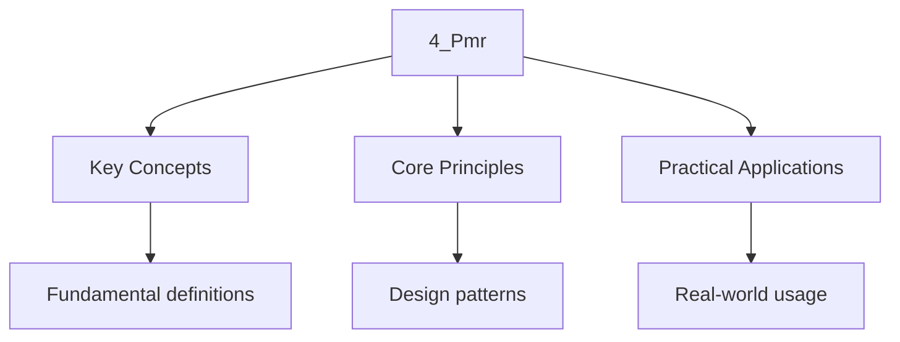

---

title: Polymorphic Memory Resources (PMR)
description: "C++17 introduced (PMR) in Enabling Containers to use different allocation strategies without changing their type. PMR decouples the Allocation strategy from"
date: 2026-04-03T00:00:00.000Z
tags:
  - Cpp
categories:
  - Cpp

---

<!-- Breadcrumb Schema for SEO -->
<script type="application/ld+json">
{
  "@context": "https://schema.org",
  "@type": "BreadcrumbList",
  "itemListElement": [{"name": "Home", "url": "https://wyattau.com"}, {"name": "cpp", "url": "https://cpp.wyattau.com"}, {"name": "Standard_library", "url": "https://cpp.wyattau.com/standard_library"}, {"name": "1_containers_and_allocators", "url": "https://cpp.wyattau.com/standard_library/1_containers_and_allocators"}, {"name": "4_pmr", "url": "https://cpp.wyattau.com/standard_library/1_containers_and_allocators/4_pmr"}]
}
</script>

## Polymorphic Memory Resources (PMR) and Monotonic Buffers

C++17 introduced **polymorphic memory resources** (PMR) in `&lt;memory_resource>`Enabling Containers
to use different allocation strategies without changing their type. PMR decouples the Allocation
strategy from the container, supporting patterns like arena allocation, pool allocation, And
dependency injection of memory resources. This section covers the `memory_resource` abstraction,
`monotonic_buffer_resource``unsynchronized_pool_resource`And practical integration patterns.

### `std::pmr::memory_resource`: The Polymorphic Allocator Interface

C++17 introduced **polymorphic memory resources** (PMR) in `&lt;memory_resource>` [N4950 §23.10].
PMR decouples container allocation strategy from the container type itself, enabling containers to
Use different allocation strategies without changing the container"s type.

The central abstraction is `std::pmr::memory_resource` [N4950 §23.10.2], an abstract base class with
Three virtual functions:

```cpp
class memory_resource {
public:
    virtual ~memory_resource() = default;

    void* allocate(std::size_t bytes, std::size_t alignment = alignof(std::max_align_t));
    void deallocate(void* p, std::size_t bytes, std::size_t alignment = alignof(std::max_align_t));

    bool is_equal(const memory_resource& other) const noexcept;

private:
    virtual void* do_allocate(std::size_t bytes, std::size_t alignment) = 0;
    virtual void do_deallocate(void* p, std::size_t bytes, std::size_t alignment) = 0;
    virtual bool do_is_equal(const memory_resource& other) const noexcept = 0;
};
```

The public `allocate` / `deallocate` functions check alignment and size constraints before
Delegating to the private virtual functions [N4950 §23.10.2.2].

`std::pmr::polymorphic_allocator&lt;T>` [N4950 §23.10.8] is a concrete allocator class that wraps a
`memory_resource*`. Standard containers parameterized on the allocator can use
`polymorphic_allocator` to gain polymorphic allocation:

```cpp
#include <memory_resource>
#include <vector>
#include <iostream>
#include <cassert>

int main() {
    // Default-constructed polymorphic_allocator uses new_delete_resource()
    // [N4950 §23.10.8.1]
    std::pmr::polymorphic_allocator<int> alloc;

    // Vector using polymorphic allocator [N4950 §22.3.11.1]
    std::vector<int, std::pmr::polymorphic_allocator<int>> v(alloc);
    v.push_back(1);
    v.push_back(2);
    v.push_back(3);

    std::cout << "PMR vector: ";
    for (int x : v) std::cout << x << " ";
    std::cout << "\n";

    // The resource() method returns the underlying memory_resource
    std::cout << "Resource: " << v.get_allocator().resource() << "\n";
}
```

### `std::pmr::monotonic_buffer_resource`: Arena Allocation

`std::pmr::monotonic_buffer_resource` [N4950 §23.10.5] implements **arena allocation**: memory is
Allocated from an initial buffer, and when that buffer is exhausted, a new buffer is obtained from
An upstream resource. Critically, **individual deallocations are no-ops** --- all memory is released
When the resource itself is destroyed.

This makes `monotonic_buffer_resource` ideal for scenarios with many short-lived allocations:

$$
\mathrm{allocate(n) = O(1) \quad \mathrm{deallocate(n) = O(1) \mathrm{ (no-op)
$$

$$
\mathrm{destroy() = O(1) \mathrm{ (releases all buffers at once)
$$

```cpp
#include <memory_resource>
#include <vector>
#include <string>
#include <iostream>
#include <array>

int main() {
    // Stack buffer for initial allocations [N4950 §23.10.5]
    std::array<std::byte, 4096> buffer;

    // monotonic_buffer_resource: arena allocator [N4950 §23.10.5]
    // First uses 'buffer', then falls back to new_delete_resource()
    std::pmr::monotonic_buffer_resource pool{
        buffer.data(), buffer.size(),
        std::pmr::new_delete_resource()
    };

    // All containers using 'pool' allocate from the arena
    std::pmr::vector<std::pmr::string> strings(&pool);

    strings.emplace_back("Hello");
    strings.emplace_back("Polymorphic");
    strings.emplace_back("Memory");
    strings.emplace_back("Resources");

    std::cout << "Strings:\n";
    for (const auto& s : strings) {
        std::cout << "  \"" << s << "\"\n";
    }

    // No individual deallocations needed
    // All memory is released when 'pool' is destroyed
    std::cout << "pool upstream: " << pool.upstream_resource() << "\n";

    // Explicit release (rarely needed; happens on destruction)
    pool.release();
    std::cout << "Pool released.\n";
}
```

:::tip
Any scenario where many objects are created and destroyed together. Since individual `deallocate`
Calls are no-ops, allocation is extremely fast.
:::
### `std::pmr::unsynchronized_pool_resource`

`std::pmr::unsynchronized_pool_resource` [N4950 §23.10.4] is a general-purpose pool allocator that
Manages a set of pools, one for each commonly-used allocation size. It provides:

- **Fast allocation**: faster than `new` for small objects
- **Thread-unsafe**: must not be used from multiple threads simultaneously (use
  `synchronized_pool_resource` for thread safety)
- **Proper deallocation**: unlike `monotonic_buffer_resource`Individual deallocations work correctly

```cpp
#include <memory_resource>
#include <vector>
#include <iostream>
#include <vector>

int main() {
    // unsynchronized_pool_resource: pool allocator [N4950 §23.10.4]
    // Manages pools for different size classes
    std::pmr::unsynchronized_pool_resource pool;

    std::pmr::vector<int> v1(&pool);
    std::pmr::vector<double> v2(&pool);
    std::pmr::vector<std::pmr::string> v3(&pool);

    for (int i = 0; i < 100; ++i) v1.push_back(i);
    for (int i = 0; i < 50; ++i) v2.push_back(i * 1.5);
    for (int i = 0; i < 20; ++i) v3.emplace_back("item_" + std::to_string(i));

    // Individual deallocations work correctly
    v1.clear();  // Frees memory back to pool
    v2.clear();  // Frees memory back to pool

    std::cout << "v1 empty: " << v1.empty() << "\n";
    std::cout << "v3 size: " << v3.size() << "\n";
    std::cout << "Pool still managing v3's memory.\n";

    // All pool memory released on pool destruction
}
```

### PMR Resource Hierarchy

The PMR library provides a hierarchy of resources [N4950 §23.10]:

```
memory_resource (abstract base) [N4950 §23.10.2]
├── new_delete_resource() [N4950 §23.10.3] — uses global operator new/delete
├── null_memory_resource() [N4950 §23.10.3] — throws on allocate
├── monotonic_buffer_resource [N4950 §23.10.5] — arena, no individual dealloc
├── unsynchronized_pool_resource [N4950 §23.10.4] — pool, single-threaded
└── synchronized_pool_resource [N4950 §23.10.4] — pool, thread-safe
```

Each resource can have an **upstream resource** that it falls back to when its own resources are
Exhausted [N4950 §23.10.2]. The default upstream is `new_delete_resource()`.

### Complete Example: Arena Allocation with PMR

```cpp
#include <memory_resource>
#include <vector>
#include <string>
#include <iostream>
#include <array>
#include <chrono>
#include <fstream>

struct Employee {
    int id;
    std::pmr::string name;
    double salary;

    Employee(int i, std::pmr::string n, double s, std::pmr::memory_resource* mr)
        : id(i), name(std::move(n), mr), salary(s) {}
};

int main() {
    constexpr std::size_t ARENA_SIZE = 64 * 1024;  // 64 KB arena
    std::array<std::byte, ARENA_SIZE> buffer;

    // Create arena with stack buffer, falling back to new/delete
    std::pmr::monotonic_buffer_resource arena{
        buffer.data(), buffer.size(),
        std::pmr::new_delete_resource()
    };

    // All allocations below come from the arena
    std::pmr::vector<Employee> employees(&arena);

    // Emplace constructs Employee in-place; the string member also uses arena
    employees.emplace_back(1, "Alice Johnson", 95000.0, &arena);
    employees.emplace_back(2, "Bob Smith", 88000.0, &arena);
    employees.emplace_back(3, "Charlie Brown", 72000.0, &arena);
    employees.emplace_back(4, "Diana Prince", 105000.0, &arena);
    employees.emplace_back(5, "Eve Williams", 91000.0, &arena);

    // Report
    std::pmr::string report(&arena);
    report += "Employee Report\n";
    report += "===============\n";

    double total_salary = 0.0;
    for (const auto& emp : employees) {
        report += "  [" + std::pmr::to_string(emp.id) + "] " + emp.name
                + " — $" + std::pmr::to_string(emp.salary) + "\n";
        total_salary += emp.salary;
    }

    report += "\nTotal payroll: $" + std::pmr::to_string(total_salary) + "\n";
    report += "Average salary: $" + std::pmr::to_string(total_salary / employees.size()) + "\n";

    std::cout << report;

    // Memory accounting [N4950 §23.10.5]
    std::cout << "\n--- Memory Accounting ---\n";
    // monotonic_buffer_resource does not expose bytes allocated
    // (it only knows about its buffer blocks)
    // For detailed tracking, use a custom memory_resource wrapper

    // Arena cleanup: O(1) — just destroy the resource
    std::cout << "Arena cleanup is O(1) — no per-object destruction overhead.\n";
    arena.release();
}
```

:::caution
Create container A, then container B, and A still holds references to memory allocated from B's
Objects, those references may dangle if B is destroyed and its memory is recycled. Arena allocation
Is safest when all allocations share the same lifetime scope.
:::
### Integration Pattern: Dependency Injection of Memory Resources

A powerful PMR pattern is **dependency injection**: functions and classes accept a
`memory_resource*` parameter, allowing callers to control the allocation strategy:

```cpp
#include <memory_resource>
#include <vector>
#include <string>
#include <iostream>
#include <array>

class Parser {
public:
    explicit Parser(std::pmr::memory_resource* mr = std::pmr::get_default_resource())
        : tokens_(mr), ast_nodes_(mr) {}

    void parse(const std::string& input) {
        // Tokenize and parse, allocating all tokens and AST nodes from the injected resource
        for (char c : input) {
            if (c != ' ' && c != '\n') {
                tokens_.push_back(c);
            }
        }
    }

    const std::pmr::vector<char>& tokens() const { return tokens_; }
    std::size_t token_count() const { return tokens_.size(); }

private:
    std::pmr::vector<char> tokens_;
    std::pmr::vector<int> ast_nodes_;
};

int main() {
    // Scenario 1: Default allocation (uses global new/delete)
    {
        Parser parser;  // uses get_default_resource()
        parser.parse("hello world");
        std::cout << "Default: " << parser.token_count() << " tokens\n";
    }

    // Scenario 2: Arena allocation (fast, bulk cleanup)
    {
        std::array<std::byte, 1024> buffer;
        std::pmr::monotonic_buffer_resource arena{buffer.data(), buffer.size()};
        Parser parser(&arena);  // inject arena
        parser.parse("arena allocation demo");
        std::cout << "Arena: " << parser.token_count() << " tokens\n";
        // All memory released when arena goes out of scope
    }

    // Scenario 3: Pool allocation (reusable)
    {
        std::pmr::unsynchronized_pool_resource pool;
        Parser parser(&pool);  // inject pool
        parser.parse("pool allocation demo");
        std::cout << "Pool: " << parser.token_count() << " tokens\n";
        // Pool memory reused across allocations
    }
}
```

This pattern allows the same `Parser` class to be used in different performance contexts without
Modification, by injecting a different memory resource.

### Custom Memory Resources: Tracking Allocations

The `memory_resource` interface makes it straightforward to write custom resources for debugging,
Accounting, or enforcing allocation policies. The following implements a tracking allocator that
Logs every allocation and detects leaks:

```cpp
#include <memory_resource>
#include <iostream>
#include <cstdlib>
#include <cstddef>
#include <string>

class TrackingResource : public std::pmr::memory_resource {
    std::pmr::memory_resource* upstream_;
    std::size_t total_allocated_{0};
    std::size_t total_deallocated_{0};
    std::size_t allocation_count_{0};
    std::size_t active_count_{0};
    std::string name_;

    void* do_allocate(std::size_t bytes, std::size_t alignment) override {
        void* ptr = upstream_->allocate(bytes, alignment);
        total_allocated_ += bytes;
        ++allocation_count_;
        ++active_count_;
        std::cout << "[" << name_ << "] allocate " << bytes
                  << " bytes (align=" << alignment << ") -> " << ptr
                  << " (active=" << active_count_ << ")\n";
        return ptr;
    }

    void do_deallocate(void* p, std::size_t bytes, std::size_t alignment) override {
        upstream_->deallocate(p, bytes, alignment);
        total_deallocated_ += bytes;
        --active_count_;
        std::cout << "[" << name_ << "] deallocate " << bytes
                  << " bytes (align=" << alignment << ") -> " << p
                  << " (active=" << active_count_ << ")\n";
    }

    bool do_is_equal(const std::pmr::memory_resource& other) const noexcept override {
        return this == &other;
    }

public:
    explicit TrackingResource(
        const std::string& name,
        std::pmr::memory_resource* upstream = std::pmr::new_delete_resource()
    ) : upstream_(upstream), name_(name) {}

    ~TrackingResource() override {
        std::cout << "[" << name_ << "] Summary:\n"
                  << "  allocations: " << allocation_count_ << "\n"
                  << "  leaked active: " << active_count_ << "\n"
                  << "  total allocated: " << total_allocated_ << " bytes\n"
                  << "  total deallocated: " << total_deallocated_ << " bytes\n";
        if (active_count_ != 0) {
            std::cout << "  *** WARNING: " << active_count_
                      << " allocation(s) not freed! ***\n";
        }
    }

    std::size_t active_count() const { return active_count_; }
};

int main() {
    TrackingResource tracker("my-tracker");

    std::pmr::vector<int> v(&tracker);
    v.push_back(1);
    v.push_back(2);
    v.push_back(3);
    v.reserve(100);

    std::cout << "vector size=" << v.size() << " capacity=" << v.capacity() << "\n";
    v.clear();

    // Intentional leak for demonstration:
    // auto* leaked = tracker.allocate(64, alignof(std::max_align_t));
    // (void)leaked;

    std::cout << "tracker active: " << tracker.active_count() << "\n";
}
```

This pattern is invaluable during development: wrap any resource with `TrackingResource` to get
Allocation/deallocation logs and leak detection without modifying the code that uses the containers.

### `std::pmr::synchronized_pool_resource`: Thread-Safe Pool Allocation

For multi-threaded contexts, `std::pmr::synchronized_pool_resource` [N4950 §23.10.4] provides the
Same pool-based allocation as `unsynchronized_pool_resource` but with internal synchronization ( a
mutex per pool). The trade-off is thread safety at the cost of higher per-allocation Overhead:

```cpp
#include <memory_resource>
#include <vector>
#include <iostream>
#include <thread>
#include <mutex>

std::mutex cout_mutex;

void worker(int id, std::pmr::memory_resource* mr) {
    std::pmr::vector<int> local_data(mr);
    for (int i = 0; i < 1000; ++i) {
        local_data.push_back(i * id);
    }
    std::lock_guard<std::mutex> lock(cout_mutex);
    std::cout << "Thread " << id << ": " << local_data.size() << " elements\n";
}

int main() {
    std::pmr::synchronized_pool_resource pool;

    std::vector<std::thread> threads;
    for (int i = 0; i < 4; ++i) {
        threads.emplace_back(worker, i, &pool);
    }

    for (auto& t : threads) {
        t.join();
    }

    std::cout << "All threads completed. Pool cleanup on destruction.\n";
}
```

:::note
Multi-threaded code comes from reduced contention: each thread allocates from its own Thread-local
pool chunk, and the global heap lock is only contended when a new chunk is needed. For
Single-threaded code, `unsynchronized_pool_resource` is strictly faster.
:::
### Common Pitfalls

**1. `monotonic_buffer_resource` and dangling references:** Since individual `deallocate` calls are
No-ops, destroying a container that allocated from a monotonic buffer does not free memory. If
Another object still holds a reference or pointer to memory from that destroyed container, the
Reference dangles. All objects using a `monotonic_buffer_resource` should share the same lifetime
Scope as the resource itself.

**2. Buffer sizing for `monotonic_buffer_resource`:** If the initial buffer is too small, the
Resource falls back to the upstream allocator ( `new_delete_resource`), negating the Performance
benefit. Profile actual allocation patterns and size the buffer accordingly. A common Technique is
to measure peak allocation during a trial run and use that plus a safety margin.

**3. `polymorphic_allocator` is not a drop-in replacement for `std::allocator`:** PMR containers
Have a different type (`std::vector&lt;T, std::pmr::polymorphic_allocator&lt;T>>`) from standard
Containers (`std::vector&lt;T>`). They are not interchangeable in APIs that expect a specific
Allocator type. Design APIs to accept `memory_resource*` and construct PMR containers internally.

**4. `null_memory_resource()` throws on every allocate:** This resource is useful for testing that
Code does not perform unexpected allocations, but will terminate with `std::bad_alloc` on any
Allocation attempt. Use it in unit tests to verify stack-only or no-heap-allocation code paths.

## See Also

- [Sequence Containers](./1_sequence_containers.md)
- [Associative and Unordered Containers](./2_associative_containers.md)
- [Iterator Categories, Traversal, Invalidation](./3_iterators.md)

## Common Pitfalls

1. Forgetting that $O(n \log n)$ average-case for quicksort becomes $O(n^2)$ worst-case on already
   sorted input.

2. Neglecting to normalise database designs, leading to data redundancy and update anomalies.

3. Mixing up Big O, Big $\Omega$, and Big $\Theta$ notation. Big O is an upper bound, not
   necessarily tight.

4. Confusing authentication (who you are) with authorisation (what you can do) in security contexts.




## Summary

The key principles covered in this topic are linked in the sub-pages above. Focus on understanding
the definitions, applying the formulas or frameworks, and evaluating strengths and limitations of
each approach.

## Intuition

Polymorphic memory resources are like choosing between buying furniture (global allocator), renting (pool allocator), or borrowing from a friend (arena allocator). The key insight is that the allocator is invisible to the code using the container: you can swap the allocator without changing any of the data structure code, the way you can move furniture between rooms without changing how you use the rooms. Arena allocators are especially useful when you allocate many small objects that all die together, like parsing a JSON document where the entire parse tree can be freed at once.

## Worked Examples

Worked examples demonstrating the application of key concepts are covered in the detailed sub-pages
linked above.
