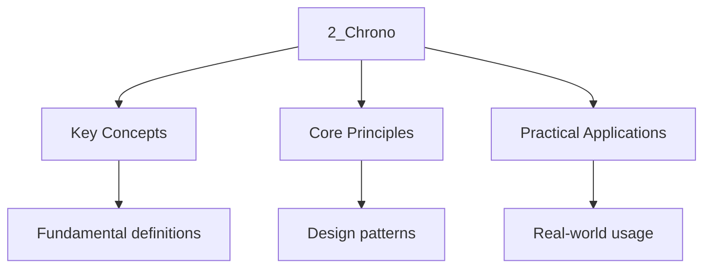

---

title: "Chrono Library | C++ - Wyatt's Notes"
description: "(C++11) provides types and functions for representing and manipulating time values. The library uses the type system to prevent accidental mixing of time"
date: 2026-04-03T00:00:00.000Z
tags:
  - Cpp
categories:
  - Cpp

---

<!-- Breadcrumb Schema for SEO -->
<script type="application/ld+json">
{
  "@context": "https://schema.org",
  "@type": "BreadcrumbList",
  "itemListElement": [{"name": "Home", "url": "https://wyattau.com"}, {"name": "cpp", "url": "https://cpp.wyattau.com"}, {"name": "Standard_library", "url": "https://cpp.wyattau.com/standard_library"}, {"name": "4_system_utilities", "url": "https://cpp.wyattau.com/standard_library/4_system_utilities"}, {"name": "2_chrono", "url": "https://cpp.wyattau.com/standard_library/4_system_utilities/2_chrono"}]
}
</script>

## Intuition

The chrono library uses C++'s type system to prevent accidental mixing of time units. Different duration types like milliseconds and seconds are distinct types, so the compiler catches unit mismatches at compile time. Clocks provide sources of time, with `steady_clock` being monotonic for measuring elapsed time and `system_clock` being the wall clock. Time points represent specific moments relative to a clock's epoch, and durations represent spans of time. C++20 extended this with calendar types and timezone support for real-world date handling.

## The Chrono Library

`std::chrono` (C++11) provides types and functions for representing and manipulating time values.
The library uses the type system to prevent accidental mixing of time units. C++20 extended it with
Calendar types (`year``month``day``year_month_day`) and timezone support (`zoned_time`). This
Section covers clocks, durations, elapsed time measurement, calendar operations, and time point
Formatting.

### Overview

`std::chrono` (C++11) provides types and functions for representing and manipulating time values
[N4950 §29.5]. The library is organized around three core abstractions:

1. **Clocks:** Sources of time (e.g., wall clock, monotonic clock).
2. **Time points:** A specific moment in time relative to a clock"s epoch.
3. **Durations:** A span of time (e.g., 500 milliseconds).

The library uses the type system to prevent accidental mixing of units. `std::chrono::milliseconds`
And `std::chrono::seconds` are **different types** — adding them together requires an explicit
Conversion.

```
┌──────────────┐  now()   ┌──────────────────┐  -        ┌──────────────┐
│   Clock      │─────────>│   time_point<C>  │──────────>│  duration    │
│  (source)    │          │  (moment in time)│           │  (time span) │
└──────────────┘          └──────────────────┘           └──────────────┘
```

### Clocks

The standard defines three clocks [N4950 §29.5.7]:

| Clock                                | Properties                                                                       | Use Case                              |
| :----------------------------------- | :------------------------------------------------------------------------------- | :------------------------------------ |
| `std::chrono::system_clock`          | Wall clock time; may jump (NTP, DST); epoch is Unix epoch (1970-01-01T00:00:00Z) | Calendar time, timestamps, file times |
| `std::chrono::steady_clock`          | Monotonic; never goes backwards; minimum guaranteed tick period is 1 nanosecond  | Measuring elapsed time, timeouts      |
| `std::chrono::high_resolution_clock` | Alias for the clock with the shortest tick period (often `steady_clock`)         | Benchmarking                          |

:::caution
Synchronization, manual correction). **Never use `system_clock` for measuring elapsed time** — it
Can produce negative durations. Use `steady_clock` for all elapsed-time measurements.
:::
### Durations

A `std::chrono::duration&lt;Rep, Period>` represents a time span where `Rep` is the arithmetic type
( `int64_t`) and `Period` is a `std::ratio` compile-time fraction [N4950 §29.5.3].

The standard provides convenient duration typedefs [N4950 §29.5.3.1]:

| Type                          | Period                        |
| :---------------------------- | :---------------------------- |
| `std::chrono::nanoseconds`    | `std::nano` (1/1,000,000,000) |
| `std::chrono::microseconds`   | `std::micro` (1/1,000,000)    |
| `std::chrono::milliseconds`   | `std::milli` (1/1,000)        |
| `std::chrono::seconds`        | `std::ratio&lt;1>` (1)        |
| `std::chrono::minutes`        | `std::ratio&lt;60>`           |
| `std::chrono::hours`          | `std::ratio&lt;3600>`         |
| `std::chrono::days` (C++20)   | `std::ratio&lt;86400>`        |
| `std::chrono::weeks` (C++20)  | `std::ratio&lt;604800>`       |
| `std::chrono::years` (C++20)  | `std::ratio&lt;31556952>`     |
| `std::chrono::months` (C++20) | `std::ratio&lt;2629746>`      |

Duration arithmetic is type-safe and uses `std::common_type` to determine the result type:

```cpp
#include <chrono>
#include <iostream>

void duration_arithmetic() {
    using namespace std::chrono;

    auto total = 2h + 35min + 42s + 500ms;
    // total is of type std::chrono::milliseconds (common type)

    auto total_secs = duration_cast<seconds>(total);
    std::cout << "Total: " << total_secs.count() << " seconds\n";
    // Total: 9342 seconds

    auto floating = duration<double, std::milli>(total);
    std::cout << "Total: " << floating.count() << " ms\n";
    // Total: 9342500 ms

    // Comparison
    auto deadline = 10s;
    auto elapsed = 7s + 500ms;
    if (elapsed < deadline) {
        auto remaining = deadline - elapsed;
        std::cout << "Remaining: " << duration_cast<milliseconds>(remaining).count() << " ms\n";
        // Remaining: 2500 ms
    }
}
```

:::note
`std::chrono::floor&lt;D>()``std::chrono::ceil&lt;D>()`Or `std::chrono::round&lt;D>()` (C++17) For
rounding conversions. These are declared in `<chrono>` [N4950 §29.5.4].
:::
### Measuring Elapsed Time

```cpp
#include <chrono>
#include <iostream>
#include <numeric>
#include <vector>

void elapsed_time_demo() {
    using namespace std::chrono;

    // ── Wall-clock elapsed time ─────────────────────────────────
    auto start = steady_clock::now();

    // Simulate work
    std::vector<double> v(10'000'000);
    std::iota(v.begin(), v.end(), 0.0);
    double sum = std::accumulate(v.begin(), v.end(), 0.0);

    auto end = steady_clock::now();
    auto elapsed_ns = duration_cast<nanoseconds>(end - start);
    auto elapsed_ms = duration<double, std::milli>(end - start);

    std::cout << "Sum: " << sum << "\n";
    std::cout << "Elapsed: " << elapsed_ns.count() << " ns\n";
    std::cout << "Elapsed: " << elapsed_ms.count() << " ms\n";
}

// ── Reusable timer class ─────────────────────────────────────────
#include <chrono>
#include <string>

class Timer {
    std::chrono::steady_clock::time_point start_;
    std::string label_;

public:
    explicit Timer(std::string label = "")
        : start_(std::chrono::steady_clock::now())
        , label_(std::move(label)) {}

    ~Timer() {
        auto elapsed = std::chrono::steady_clock::now() - start_;
        auto ms = std::chrono::duration<double, std::chrono::milli>(elapsed);
        std::cout << "[" << (label_.empty() ? "timer" : label_) << "] "
                  << ms.count() << " ms\n";
    }

    Timer(const Timer&) = delete;
    Timer& operator=(const Timer&) = delete;
};

void timer_class_demo() {
    Timer t("vector init");
    std::vector<int> v(1'000'000);
    for (auto& x : v) x = 42;
    // Destructor prints: [vector init] X.XXX ms
}
```

:::tip
Correctly even when the scope is exited via an exception. This pattern is used in many C++
Benchmarking and logging frameworks.
:::
### Calendar and Timezone Support (C++20)

C++20 added calendar types and timezone support to `<chrono>` [N4950 §29.8]:

| Type                              | Purpose                                                     |
| :-------------------------------- | :---------------------------------------------------------- |
| `std::chrono::year`               | Year (e.g., `2026y`)                                        |
| `std::chrono::month`              | Month (1..12, e.g., `March`)                                |
| `std::chrono::day`                | Day of month (1..31, e.g., `31d`)                           |
| `std::chrono::year_month_day`     | Full calendar date                                          |
| `std::chrono::year_month_weekday` | Date specified by weekday (e.g., "second Tuesday of March") |
| `std::chrono::hh_mm_ss`           | Time of day (hours, minutes, seconds, subseconds)           |
| `std::chrono::weekday`            | Day of week (Monday..Sunday, `Mon``Tue`...)                 |
| `std::chrono::tzdb`               | Timezone database                                           |
| `std::chrono::zoned_time`         | A time point in a specific timezone                         |

```cpp
#include <chrono>
#include <iostream>

namespace chrono = std::chrono;

void calendar_demo() {
    // Literal suffixes for calendar types (in namespace std::chrono::literals)
    using namespace chrono::literals;

    chrono::year_month_day date{2026y, chrono::March, 31d};
    std::cout << "Date: " << static_cast<int>(date.year()) << "-"
              << static_cast<unsigned>(date.month()) << "-"
              << static_cast<unsigned>(date.day()) << "\n";

    chrono::weekday wd = chrono::weekday(date);
    std::cout << "Day of week: " << wd << "\n";
    // Day of week: Tue

    // Last day of month
    chrono::year_month_day last_day = chrono::year_month_day{
        date.year() / date.month() / chrono::last
    };
    std::cout << "Last day of month: " << static_cast<unsigned>(last_day.day()) << "\n";
    // Last day of month: 31

    // Second Tuesday of March 2026
    chrono::year_month_weekday ymw{
        2026y, chrono::March, chrono::Tuesday[2]
    };
    std::cout << "2nd Tuesday of March 2026: " << ymw << "\n";

    // Arithmetic
    auto tomorrow = chrono::sys_days(date) + chrono::days{1};
    auto tomorrow_ymd = chrono::year_month_day{tomorrow};
    std::cout << "Tomorrow: " << tomorrow_ymd << "\n";
}

void timezone_demo() {
    using namespace std::chrono;

    auto now = system_clock::now();

    // Convert to local time
    try {
        const auto* tz = locate_zone("America/New_York");
        zoned_time zt{tz, now};
        std::cout << "New York: " << zt << "\n";
    } catch (const std::runtime_error& e) {
        std::cerr << "Timezone not available: " << e.what() << "\n";
    }

    // UTC
    zoned_time utc{"UTC", now};
    std::cout << "UTC:      " << utc << "\n";
}
```

### Formatting Time Points with Calendar

C++20 extended `std::format` to support chrono types [N4950 §29.8.7]:

```cpp
#include <chrono>
#include <format>
#include <iostream>

namespace chrono = std::chrono;

void format_time_demo() {
    using namespace chrono;

    auto now = system_clock::now();

    // Format specifiers follow strftime conventions
    std::cout << std::format("ISO 8601:  {%Y-%m-%dT%H:%M:%SZ}\n", now);
    std::cout << std::format("US date:   {%m/%d/%Y}\n", now);
    std::cout << std::format("Full:      {%A, %B %d, %Y %I:%M:%S %p}\n", now);

    // With timezone
    auto zt = zoned_time{"America/Los_Angeles", now};
    std::cout << std::format("LA time:   {%Y-%m-%d %H:%M:%S %Z}\n", zt);
}
```

:::note
`/usr/share/zoneinfo/` on Linux). On systems without a system timezone database, the C++ runtime may
Provide a minimal built-in database. Call `std::chrono::reload_tzdb()` to reload the database after
A system update.
:::
## See Also

- [Filesystem Library](./1_filesystem.md)
- [Random Number Generation](./3_random_numbers.md)
- [Regular Expressions](./4_regular_expressions.md)

### Clock Precision and `is_steady`

The `is_steady` static member of each clock indicates whether the clock is monotonic [N4950
§29.5.7]:

```cpp
#include <chrono>
#include <iostream>

void clock_properties() {
    std::cout << "system_clock is_steady: "
              << std::chrono::system_clock::is_steady << "\n";
    // system_clock is_steady: 0 (false)

    std::cout << "steady_clock is_steady: "
              << std::chrono::steady_clock::is_steady << "\n";
    // steady_clock is_steady: 1 (true)

    std::cout << "high_resolution_clock is_steady: "
              << std::chrono::high_resolution_clock::is_steady << "\n";
    // Depends on implementation (often true, since it aliases steady_clock)
}
```

`steady_clock` is implemented using `clock_gettime(CLOCK_MONOTONIC)` on POSIX or
`QueryPerformanceCounter` on Windows. The minimum tick period is 1 nanosecond by standard guarantee,
But the actual resolution depends on the hardware timer:

- **x86-64 Linux:** `CLOCK_MONOTONIC_RAW` with ~1 ns resolution (TSC).
- **x86-64 Windows:** `QueryPerformanceCounter` with ~100 ns resolution (HPET or TSC).
- **ARM Linux:** May use the generic timer with ~10–1000 ns resolution depending on the SoC.

### `std::ratio` and Duration Representation

`std::ratio<N, D>` is a compile-time rational number [N4950 §20.4.2]. The numerator and denominator
Are reduced to lowest terms at compile time. This is the basis for all duration period calculations:

```cpp
#include <chrono>
#include <cstdint>
#include <iostream>
#include <type_traits>

void ratio_details() {
    using namespace std::chrono;

    // std::nano = std::ratio<1, 1000000000>
    static_assert(nanoseconds::period::num == 1);
    static_assert(nanoseconds::period::den == 1000000000);

    // std::milli = std::ratio<1, 1000>
    static_assert(milliseconds::period::num == 1);
    static_assert(milliseconds::period::den == 1000);

    // The common_type of seconds and milliseconds is milliseconds
    using Common = std::common_type_t<seconds, milliseconds>;
    static_assert(std::is_same_v<Common, milliseconds>);

    // The common_type of seconds and nanoseconds is nanoseconds
    using Common2 = std::common_type_t<seconds, nanoseconds>;
    static_assert(std::is_same_v<Common2, nanoseconds>);

    // Custom duration: 1/60 of a second (frame time at 60 Hz)
    using frames = duration<int64_t, std::ratio<1, 60>>;
    frames f = 30_frames;
    auto f_secs = duration_cast<seconds>(f);
    std::cout << "30 frames = " << f_secs.count() << " seconds\n";
    // 30 frames = 0 seconds (truncated from 0.5)

    auto f_secs_ceil = ceil<seconds>(f);
    std::cout << "30 frames (ceil) = " << f_secs_ceil.count() << " seconds\n";
    // 30 frames (ceil) = 1 second
}
```

:::caution
Preserved. But `std::common_type_t<seconds, milliseconds>` is `milliseconds` because milliseconds
Has a finer period. The common type always has the **shortest** (finest) period among the inputs
[N4950 §29.5.3].
:::
### Duration Literals and User-Defined Literals

C++14 introduced `operator""` literals for `std::chrono` durations [N4950 §29.5.3.2]:

```cpp
#include <chrono>
#include <iostream>

using namespace std::chrono_literals;

void duration_literals() {
    auto d1 = 5ns;
    auto d2 = 100us;
    auto d3 = 42ms;
    auto d4 = 5s;
    auto d5 = 2min;
    auto d6 = 3h;

    // These are constexpr — usable at compile time
    constexpr auto timeout = 500ms;

    // C++20 literals
    auto d7 = 7d;
    auto d8 = 2w;

    // Arithmetic
    auto total = d4 + d5 + d6;
    std::cout << "Total: " << duration_cast<seconds>(total).count() << "s\n";
    // Total: 7562s (2h + 5min + 2s)

    // Multiplication and division
    auto doubled = 3h * 2;       // 6h
    auto per_item = 60s / 4;     // 15s
    auto count = 90s / 15s;      // 6 (scalar)
}
```

### Time Points

A `std::chrono::time_point<Clock, Duration>` represents a point in time relative to a clock's epoch
[N4950 §29.5.5]. The epoch of `system_clock` is the Unix epoch (1970-01-01T00:00:00 UTC).

```cpp
#include <chrono>
#include <iostream>

void time_point_basics() {
    using namespace std::chrono;

    auto now = system_clock::now();
    auto epoch = system_clock::time_point{};

    auto since_epoch = now - epoch;
    std::cout << "Seconds since epoch: "
              << duration_cast<seconds>(since_epoch).count() << "\n";

    // time_point arithmetic
    auto future = now + 24h;
    auto past = now - 12h;

    auto diff = future - past;
    std::cout << "Diff: " << duration_cast<hours>(diff).count() << " hours\n";
    // Diff: 36 hours

    // Comparison
    std::cout << "future > now: " << (future > now ? "yes" : "no") << "\n";
    std::cout << "past < now: " << (past < now ? "yes" : "no") << "\n";
}
```

### Converting `system_clock` to `time_t`

`system_clock` is the only clock that can be converted to and from `std::time_t` [N4950 §29.5.7.2]:

```cpp
#include <chrono>
#include <ctime>
#include <iostream>

void time_t_conversion() {
    using namespace std::chrono;

    auto now = system_clock::now();
    std::time_t tt = system_clock::to_time_t(now);

    std::cout << "ctime: " << std::ctime(&tt);

    // Round-trip
    auto recovered = system_clock::from_time_t(tt);
    auto drift = duration_cast<nanoseconds>(now - recovered);
    std::cout << "Round-trip drift: " << drift.count() << " ns\n";
    // In standard practice 0 or 1 second (truncation to seconds)
}
```

:::caution
`time_point` loses sub-second precision. On systems where `time_t` is 32-bit, dates beyond
2038-01-19 cannot be represented (the Year 2038 problem). Modern 64-bit systems use a 64-bit
`time_t`.
:::
### C++20 Calendar: `year_month_day` Arithmetic

C++20's calendar types support natural date arithmetic that handles month rollover, leap years, and
Day-of-week calculations correctly [N4950 §29.8]:

```cpp
#include <chrono>
#include <iostream>

namespace chrono = std::chrono;
using namespace chrono::literals;

void calendar_arithmetic() {
    // Adding months handles rollover
    chrono::year_month_day date{2026y, chrono::January, 31d};
    auto next_month = date + chrono::months{1};
    // February 31 does not exist — the standard clamps to the last day of February
    std::cout << "Jan 31 + 1 month = " << static_cast<unsigned>(next_month.month())
              << "/" << static_cast<unsigned>(next_month.day()) << "\n";
    // Jan 31 + 1 month = 2/28 (or 2/29 in a leap year)

    // Leap year detection
    chrono::year y{2024};
    std::cout << "2024 is leap: " << y.is_leap() << "\n";   // true
    std::cout << "2023 is leap: " << chrono::year{2023}.is_leap() << "\n"; // false

    // Day of week
    chrono::year_month_day known{2026y, chrono::April, 1d};
    chrono::weekday wd = chrono::weekday(known);
    std::cout << "2026-04-01 is a " << wd << "\n";
    // 2026-04-01 is a Wed

    // Difference between two dates
    chrono::year_month_day d1{2026y, chrono::January, 1d};
    chrono::year_month_day d2{2026y, chrono::April, 4d};
    auto diff = chrono::sys_days(d2) - chrono::sys_days(d1);
    std::cout << "Days between: " << diff.count() << "\n";
    // Days between: 93
}
```

:::caution
Rule: if the resulting day is out of range (e.g., January 31 + 1 month = February 31), the day is
Clamped to the last valid day of the resulting month. This behavior is defined in [N4950 §29.8.6].
:::
### C++20 Time-of-Day: `hh_mm_ss`

The `hh_mm_ss` class [N4950 §29.8.3] represents a time of day extracted from a duration:

```cpp
#include <chrono>
#include <iostream>

void time_of_day_demo() {
    using namespace std::chrono;

    // A duration representing time since midnight
    auto time_since_midnight = 15h + 27min + 45s + 123ms;

    hh_mm_ss time{time_since_midnight};
    std::cout << "Hours:       " << time.hours().count() << "\n";
    std::cout << "Minutes:     " << time.minutes().count() << "\n";
    std::cout << "Seconds:     " << time.seconds().count() << "\n";
    std::cout << "Subseconds:  " << time.subseconds().count() << "\n";
    std::cout << "Is negative: " << time.is_negative() << "\n";
    // Hours: 15, Minutes: 27, Seconds: 45, Subseconds: 123000000
}
```

### Wait with `std::this_thread::sleep_for` and `sleep_until`

```cpp
#include <chrono>
#include <iostream>
#include <thread>

void sleep_demo() {
    using namespace std::chrono;

    // Sleep for a duration
    auto start = steady_clock::now();
    std::this_thread::sleep_for(250ms);
    auto elapsed = steady_clock::now() - start;
    std::cout << "Slept for "
              << duration_cast<milliseconds>(elapsed).count() << " ms\n";
    // In standard practice 250-260ms (OS scheduling jitter)

    // Sleep until an absolute time
    auto deadline = steady_clock::now() + 100ms;
    std::this_thread::sleep_until(deadline);
}
```

:::caution
Duration is a lower bound, not a guarantee. For high-precision timing (sub-millisecond), use
Busy-waiting with `std::chrono::steady_clock` or OS-specific spin loops.
:::
### Common Pitfalls

1. **Using `system_clock` for measuring elapsed time:** `system_clock` can jump backwards (NTP
   correction, DST transition, manual adjustment). Always use `steady_clock` for benchmarking and
   timeouts.

2. **Mixing `duration_cast` with `round`/`floor`/`ceil`:** `duration_cast` truncates towards zero.
   For a duration of `-1500ms``duration_cast<seconds>(-1500ms)` yields `-1s`Not `-2s`. Use
   `floor<seconds>(-1500ms)` for `-2s`.

3. **Integer overflow in duration arithmetic:** Durations use the `Rep` type for storage. If `Rep`
   is `int32_t` and you compute `1000000s * 1000`The result overflows. Use `int64_t` durations (the
   default for standard typedefs) or check bounds.

4. **Timezone database not available:** On some minimal Linux containers or embedded systems, the
   IANA timezone database may not be installed. `locate_zone()` will throw `std::runtime_error`.
   Always wrap timezone operations in try-catch.

5. **`high_resolution_clock` may be `system_clock`:** The standard allows `high_resolution_clock` to
   alias either `system_clock` or `steady_clock`. If it aliases `system_clock`It is not monotonic
   and is unsuitable for measuring elapsed time. Check `is_steady` at runtime.

6. **Ignoring `clock_cast` for inter-clock conversions:** C++20 provides `std::chrono::clock_cast`
   to convert time points between clocks. Converting manually (e.g., subtracting epochs) is
   error-prone and may not account for clock skew.

## Common Pitfalls

1. Memorising content without understanding the underlying principles. This leads to poor
   application in unfamiliar contexts.

2. Not practising with past papers or exercises under timed conditions.

3. Ignoring feedback from marked work and failing to address recurring weaknesses.

4. Focusing only on content knowledge without developing exam technique and question-answering
   skills.




## Summary

The key principles covered in this topic are linked in the sub-pages above. Focus on understanding
the definitions, applying the formulas or frameworks, and evaluating strengths and limitations of
each approach.

## Worked Examples

Worked examples demonstrating the application of key concepts are covered in the detailed sub-pages
linked above.
