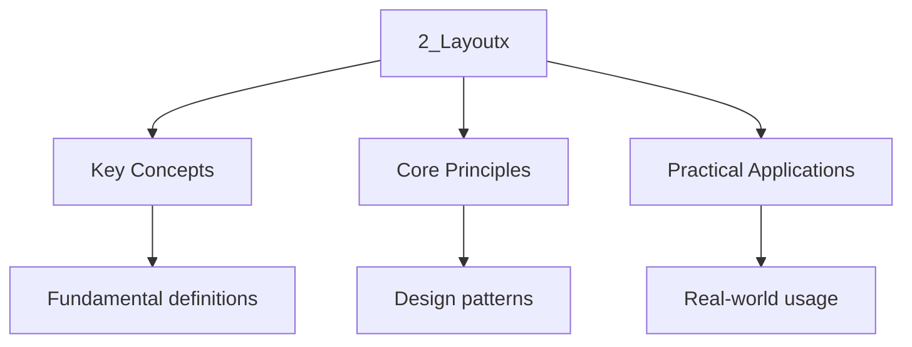

---

title: "Alignment and Layout | C++ - Wyatt's Notes"
description: "In C++, is rarely equal to the sum of the sizes of its members. The compiler inserts Invisible bytes known as between members to satisfy ."
date: 2025-12-12T05:45:45.940Z
tags:
  - cpp
categories:
  - cpp
---

import { Tabs, TabItem } from "@astrojs/starlight/components";

:::note
<strong>Historical Context</strong>
Memory alignment is a consequence of how hardware accesses memory. In the 1970s-80s, processors like the Motorola 68000 required aligned access and raised hardware exceptions (bus errors) for misaligned reads. Modern x86 processors handle misaligned access transparently (with a performance penalty), but ARM processors — which power every smartphone — still raise SIGBUS for misaligned access on some configurations. The C language was designed in 1972 when alignment was a hardware constraint, so C's struct layout rules encode alignment directly. C++ inherited these rules. Understanding alignment is critical for systems programming because: (1) padding wastes memory, (2) false sharing on cache lines degrades multi-threaded performance, and (3) network protocols require specific alignment for zero-copy I/O.
:::
In C++, `sizeof(T)` is rarely equal to the sum of the sizes of its members. The compiler inserts
Invisible bytes known as **Padding** between members to satisfy **Alignment Requirements**.

Understanding alignment is critical for systems programming for three reasons:

1. **Memory Footprint:** Poorly ordered structures can waste memory on padding.
2. **Hardware Faults:** Architectures like ARM, SPARC, and specialized DSPs raises hardware
   exceptions (SIGBUS) upon misaligned memory access.
3. **Concurrency Performance:** Unintentional sharing of cache lines (False Sharing) can degrade
   multi-threaded performance.

## 1. Natural Alignment

CPUs access memory in words ( 4 or 8 bytes). Accessing a 4-byte integer located at address `0x1001`
requires the CPU to perform two memory fetches (fetching `0x1000` and `0x1004`) and Bit-shift the
results. To prevent this inefficiency, types have a **Natural Alignment**.

### The Rules of Alignment

1. **Fundamental Types:** A type of size $N$ requires an address divisible by $N$.

- `char` (1 byte): Alignment 1 (Any address).
- `int32_t` (4 bytes): Alignment 4 (Address ending in 0, 4, 8, C).
- `double` (8 bytes): Alignment 8.

1. **Structures:** The alignment of a `struct` is equal to the alignment of its strictest member.
2. **Arrays:** An array `T[N]` has the same alignment as `T`.

### Inspection Tools

C++11 provides operators to query these properties at compile time.

```cpp
#include <iostream>

struct Example \{
    char a;
    double b;
    int c;
\};

int main() \{
    std::cout << "Size: " << sizeof(Example) << "\n";
    std::cout << "Alignment: " << alignof(Example) << "\n";
\}
```

## 2. Structure Padding and Layout

To enforce alignment, the compiler injects padding bytes.

### Case Study: The Unoptimized Layout

Consider the following structure on a 64-bit system (LP64 model).

```cpp
struct BadLayout \{
    char a;      // 1 byte
                 // [ 7 bytes Padding ] -> To align 'b' to 8-byte boundary
    double b;    // 8 bytes
    int c;       // 4 bytes
    char d;      // 1 byte
                 // [ 3 bytes Padding ] -> To align structure size to 8
\};
```

- **Calculated Size:** $1 + 7 + 8 + 4 + 1 + 3 = 24$ bytes.
- **Actual Payload:** $1 + 8 + 4 + 1 = 14$ bytes.
- **Wasted Space:** 10 bytes (41%).

### The Tail Padding Rule

The total size of a structure must be a multiple of its alignment. This ensures that if the struct
Is used in an array, the second element properly aligns.

- `alignof(BadLayout)` is 8 (due to `double b`).
- Therefore, `sizeof(BadLayout)` must be a multiple of 8.

### Layout Optimization

To minimize size, members should be ordered by alignment requirement ( size), from largest To
smallest.

```cpp
struct GoodLayout \{
    double b;    // 8 bytes (Offset 0)
    int c;       // 4 bytes (Offset 8)
    char a;      // 1 byte  (Offset 12)
    char d;      // 1 byte  (Offset 13)
                 // [ 2 bytes Padding ] -> To align size to 8
\};
```

- **New Size:** $8 + 4 + 1 + 1 + 2 = 16$ bytes.
- **Savings:** 8 bytes per instance.

<div className="godbolt-container">
 <iframe
 width="100%"
 height="800"
 src="https://godbolt.org/e?hideEditorToolbars=true#z:OYLghAFBqd5QCxAYwPYBMCmBRdBLAF1QCcAaPECAMzwBtMA7AQwFtMQByARg9KtQYEAysib0QXACx8BBAKoBnTAAUAHpwAMvAFYTStJg1DIApACYAQuYukl9ZATwDKjdAGFUtAK4sGIAMykrgAyeAyYAHI%2BAEaYxBIAbKQADqgKhE4MHt6%2BASlpGQKh4VEssfFcSXaYDplCBEzEBNk%2BfoHVtQL1jQTFkTFxibYNTS257SO9Yf1lg5UAlLaoXsTI7Bzm/mHI3lgA1Cb%2Bbk4KBMSYrIfYJhoAgpvbu5gHR8in6FhUVzf3d6fEXgcewsTHQwSYAE9lgQDgB2Kx3PZIvbIBCNPZMQ4WZHIgD0uL2XD20QhBEwPxx6GW0XoxKxOPxewAHMTSZgFBTkWEYaZ/NicUjGZJWWSOYjkaj0eh6QLGUSSWSfiZYQARLFKv5nQEwgDiqAw4KhXhhyoRt0p1Np0RlgoJLIV7M5SO5KJtDIJwodYvNErRxAxbtthJF5PFSMl/ulfIFezlIaVqvVdx%2BLpYTDCEHmcLNOPeIBQ0JebkObgOZjMAFlMCwSBC9obC6gqMDQQ3jSATABWNwMcxmJM%2BpF5gvGoslstmIR4ABe7AnY6Oe3Ss6bEBBYMh0KzJfHfZDHO7vfLA9zBHQ%2BbQo53i77AHkqFQlAQFB3D32T8jh5eTUdd%2BX74%2BmAwk2GIgPO16lk2gFEFQa6tpuxqkBi26/ouYAbIe6EfkOZ4XoWEETgBT57CB0RgXuBFQU%2Bq7rm2BBIdEKHFmhGE9lhfJOkuuEjj%2BzGlneD7ESByDkeWC6QYJQE0fBRr0SiTHjlhmEbBxYZceePHiYRknAc257gahEnQdJG6yUh6AKSxXZsSpZqcV%2B%2BGGRO1kMFWNbEHWdEkc2eoGghBCvj276qYO6l4VeTl9lOs6iWYWnLpgq6%2BaZW5aXuXoucFOaftx35pf%2BOkvplx4haeGl5QRAnQd5xKxVpVFSbByV0QxlmlkpNnYWFmmVQV1XCXVlE6Ul%2BopYh8laR1DDsdlOHlY5fHaf1zZMINTkNTBEDNf5SFMG1exTTN9m5Qtf5mERQE1fpFHrcNTWjS1ewWZNrHTbZGqhecBArAwewaAOypqncHCLLQnCdrwfgcFopCoJwxaWNYS7LKszybDwpABdDIOLAA1iAnZmAAdEyGiwrCTJMlwZgJAAnFItNJGDHCSLwLAgJITJE52FM07TsJk7TZiSMLpBQzDcMcLwL4aJjmgg6QcCwEgmCqDUxokOQlCNMACjKIYmC0EICCoAA7lDGNoCwyR0EwjgCPr4RGyb5vy6QVs2/Q8TAFwhPu6g1t0HEESsOsvAe0HxC3saxtm%2BLvCqzUtzELrnAJ2ryD1PgUO8PwggiGI7BSDIgiKCo6jY6QuhcPohjGNY1j6Hg0QvpAiyoMk9sMC%2BHAALTvIcKqmIjlhmP4vCoAAbnExB4FgreZqQAKCHgbAACr6rQC%2BLAoKNrHo7xhI7hux673C8KbxBMMknA8KD4OQ27kvYBnGv%2BqoTIJL3CTCsAyDIISTsRM4oQARlYSwSFcCEBIGWfwXB5i8CxloeY98WZswJlwImIsuCwn8BoMwQsyY81hGLJ%2BadbAgFlkgnGpB8ZcA0LLZm49SGV0log%2BWKDSDT2IOkZwkggA%3D%3D"
 title="Compiler Explorer"
 sandbox="allow-scripts allow-same-origin"
 loading="lazy"
 ></iframe>
</div>

### `[[no_unique_address]]` (C++20)

Empty classes in C++ normally take up 1 byte (to ensure unique addresses). When used as members,
This forces padding. The C++20 attribute `[[no_unique_address]]` allows the compiler to overlap the
Empty class with the padding of other members.

```cpp
struct Empty \{\}; // Size 1

struct Optimized \{
    int i;
    [[no_unique_address]] Empty e; // Size 0 effectively
\};
// sizeof(Optimized) == 4
```

## 3. Manual Alignment Control (`alignas`)

Sometimes, natural alignment is insufficient. This occurs in two scenarios:

1. **SIMD:** SSE/AVX registers require 16, 32, or 64-byte alignment.
2. **Cache Optimization:** Preventing data form straddling cache lines.

The `alignas` specifier forces strict alignment.

```cpp
// Force 32-byte alignment for AVX2 instructions
struct alignas(32) Vector4 \{
    float x, y, z, w;
\};
```

**Restriction:** `alignas` can only _increase_ alignment (make it stricter). It cannot decrease it
(make it packed).

### Over-Alignment and `new`

Prior to C++17, `new Vector4` might crash because the standard heap allocator (`malloc`) only
Guarantees alignment up to `max_align_t` ( 8 or 16 bytes).

C++17 introduced **Aligned New**:

- The compiler automatically generates calls to `operator new(size_t, std::align_val_t)` when
  allocating over-aligned types.
- The runtime maps this to aligned allocation APIs (e.g., `_aligned_malloc` on Windows,
  `posix_memalign` on Linux).

## 4. Hardware Architecture: Cache Lines and False Sharing

Modern CPUs interact with memory in **Cache Lines** ( 64 bytes). The CPU cannot load a Single byte;
it loads the entire 64-byte line containing that byte.

### False Sharing

This architecture creates a concurrency hazard. If two independent variables reside on the same
Cache line, and two threads modify them independently, the cores will fight over ownership of the
Cache line. This "Ping-Pong" effect stalls the cores.

**Scenario:**

```cpp
struct SharedState \{
    std::atomic<int> core1_counter; // Thread A writes this
    std::atomic<int> core2_counter; // Thread B writes this
\};
```

Because these two integers likely sit next to each other, they share a cache line.

### Destructive Interference Size (C++17)

To prevent this, we must force the variables onto separate cache lines using
`std::hardware_destructive_interference_size`.

```cpp
#include <new>
#include <atomic>

struct SharedState \{
    alignas(std::hardware_destructive_interference_size) std::atomic<int> core1_counter;
    alignas(std::hardware_destructive_interference_size) std::atomic<int> core2_counter;
\};
```

This ensures the struct adds enough padding between members so that they never occupy the same L1
Cache line, regardless of the target CPU architecture.

## 5. Structure Packing (Breaking Alignment)

In network programming or binary file parsing, formats often ignore alignment rules to save
Bandwidth. They are "Packed."

Standard C++ does not provide a mechanism to pack structures, as it generates code that may crash on
Non-x86 architectures. However, compiler extensions are universally supported.

<Tabs>
 <TabItem label="GCC / Clang">

```cpp
struct __attribute__((packed)) NetworkHeader \{
    uint8_t version; // Offset 0
    uint32_t id;     // Offset 1 (Misaligned!)
\};
```

 </TabItem>
 <TabItem label="MSVC">

```cpp
#pragma pack(push, 1)
struct NetworkHeader \{
    uint8_t version;
    uint32_t id;
\};
#pragma pack(pop)
```

 </TabItem>
</Tabs>

### The Cost of Packing

Accessing `id` in the example above generates different assembly instructions.

- **Aligned:** A single `MOV` instruction.
- **Packed (x86):** A `MOV` instruction (hardware handles the split load, but with a latency
  penalty).
- **Packed (ARMv7/RISC-V):** Multiple single-byte loads followed by shifts and ORs, or a hardware
  trap handled by the kernel (extremely slow).

**Best Practice:** Do not pass packed structures around your application. Deserialize them
Immediately into aligned native structures at the I/O boundary.

## 6. Bit-Fields

Bit-fields allow packing multiple small integers into a single storage unit. The compiler handles
The shift and mask operations transparently. However, the layout of bit-fields is
**implementation-defined** [N4950 §11.4.9]:

```cpp
#include <iostream>

struct Flags \{
    unsigned int readable   : 1;
    unsigned int writable   : 1;
    unsigned int executable : 1;
    unsigned int reserved   : 29;
\};

int main() \{
    std::cout << "sizeof(Flags): " << sizeof(Flags) << "\n";  // in standard practice 4
    std::cout << "alignof(Flags): " << alignof(Flags) << "\n";  // in standard practice 4

    Flags f\{\};
    f.readable = 1;
    f.writable = 1;
    std::cout << "flags value: " << *(unsigned int*)&f << "\n";  // 3 (binary: 11)
\}
```

### Bit-Field Allocation Rules

The C++ standard specifies only that bit-fields are allocated from left to right or right to left
(implementation-defined) within an addressable storage unit. The following are implementation-
Defined:

- Whether bit-fields are allocated from the high-order or low-order bit.
- Whether a bit-field that does not fit in the remaining space is packed into the next unit or
  padding is inserted.
- The alignment of the storage unit.

```cpp
#include <iostream>

struct Example \{
    unsigned int a : 10;  // 10 bits
    unsigned int b : 10;  // 10 bits — may or may not straddle the 16-bit boundary
    unsigned int c : 10;  // 10 bits
    unsigned int d : 3;   // 3 bits
\};

int main() \{
    std::cout << "sizeof(Example): " << sizeof(Example) << "\n";
    // On most implementations: 4 bytes (all fit in one unsigned int)
    // But this is NOT guaranteed by the standard
\}
```

### Bit-Fields and Portability

Bit-field layout is **not portable across compilers or architectures**. Never use bit-fields for
Wire formats or file formats. Use explicit shift and mask operations instead:

```cpp
#include <cstdint>
#include <iostream>

// PORTABLE: explicit bit manipulation
struct PortableFlags \{
    std::uint32_t raw = 0;

    bool readable()   const \{ return (raw &amp; 0x1u) != 0; \}
    bool writable()   const \{ return (raw &amp; 0x2u) != 0; \}
    bool executable() const \{ return (raw &amp; 0x4u) != 0; \}

    void set_readable(bool v)   \{ raw = (raw &amp; ~0x1u) | (v ? 0x1u : 0u); \}
    void set_writable(bool v)   \{ raw = (raw &amp; ~0x2u) | (v ? 0x2u : 0u); \}
    void set_executable(bool v) \{ raw = (raw &amp; ~0x4u) | (v ? 0x4u : 0u); \}
\};

int main() \{
    PortableFlags f;
    f.set_readable(true);
    f.set_executable(true);
    std::cout << "raw: " << f.raw << "\n";  // 5
\}
```

## 7. Unions and Layout

A `union` overlays all members at the same memory address. The size of a union is the maximum of its
Members' sizes, rounded up to the alignment of the strictest member [N4950 §11.5]:

```cpp
#include <iostream>
#include <cstdint>

union FloatBits \{
    float f;
    std::uint32_t u;
    std::uint8_t bytes[4];
\};

int main() \{
    std::cout << "sizeof(FloatBits): " << sizeof(FloatBits) << "\n";   // 4
    std::cout << "alignof(FloatBits): " << alignof(FloatBits) << "\n"; // 4

    FloatBits fb;
    fb.f = 1.0f;
    std::cout << "float: " << fb.f << "\n";
    std::cout << "uint32: 0x" << std::hex << fb.u << std::dec << "\n";  // IEEE 754: 0x3f800000
\}
```

:::caution
<strong>Reading from a union member other than the one most recently written to is **undefined</strong>

Behavior** in C++ (unlike C, where it is implementation-defined). Use `std::memcpy` for type
Punning, which is well-defined by the standard.
:::
### Type Punning with `std::memcpy`

```cpp
#include <iostream>
#include <cstdint>
#include <cstring>

float uint32_to_float(std::uint32_t bits) \{
    float result;
    std::memcpy(&amp;result, &amp;bits, sizeof(result));
    return result;
\}

std::uint32_t float_to_uint32(float f) \{
    std::uint32_t result;
    std::memcpy(&amp;result, &amp;f, sizeof(result));
    return result;
\}

int main() \{
    std::cout << std::hex << float_to_uint32(1.0f) << "\n";  // 3f800000
    std::cout << uint32_to_float(0x3f800000) << "\n";          // 1
\}
```

## 8. Nested Structures and Alignment

When a struct contains another struct as a member, the inner struct's alignment requirement is
Propagated to the outer struct. The inner struct is treated as a single unit with its own alignment:

```cpp
#include <iostream>

struct Inner \{
    double d;    // 8 bytes, alignment 8
    int i;       // 4 bytes, alignment 4
    char c;      // 1 byte
               // 3 bytes padding -> sizeof(Inner) = 16, alignof(Inner) = 8
\};

struct Outer \{
    char a;      // 1 byte
               // 7 bytes padding -> align Inner to 8
    Inner inner; // 16 bytes
    char b;      // 1 byte
               // 7 bytes padding -> sizeof(Outer) = 32, alignof(Outer) = 8
\};

int main() \{
    std::cout << "sizeof(Inner): " << sizeof(Inner) << "\n";   // 16
    std::cout << "alignof(Inner): " << alignof(Inner) << "\n"; // 8
    std::cout << "sizeof(Outer): " << sizeof(Outer) << "\n";   // 32
    std::cout << "alignof(Outer): " << alignof(Outer) << "\n"; // 8
\}
```

### Array of Structs and Memory Layout

When arrays of structs are used in performance-critical code (e.g., game engines, simulations), the
Struct layout directly affects cache utilization. A common optimization is to split hot and cold
Fields into separate arrays (Struct of Arrays vs Array of Structs):

```cpp
#include <iostream>
#include <vector>
#include <cstddef>

// Array of Structs (AoS) — good for per-object access
struct ParticleAoS \{
    float x, y, z;       // position (hot in physics update)
    float vx, vy, vz;    // velocity (hot in physics update)
    float mass;          // hot in physics update
    float color[4];      // cold: only used for rendering
    std::uint32_t id;    // cold: only used for identification
\};

// Struct of Arrays (SoA) — good for batch processing
struct ParticlesSoA \{
    std::vector<float> x, y, z;
    std::vector<float> vx, vy, vz;
    std::vector<float> mass;
    // color and id stored separately, loaded only when rendering
\};

int main() \{
    std::cout << "sizeof(ParticleAoS): " << sizeof(ParticleAoS) << "\n";
    // In standard practice: 4*3 + 4*3 + 4 + 4*4 + 4 = 40 bytes
    // With alignment padding, likely 40 or 44 bytes

    // When iterating over 1000 particles for physics:
    // AoS: loads 40 bytes per particle, but only uses 28 bytes (position + velocity + mass)
    // SoA: loads only the fields needed, packed tightly in separate arrays
    std::cout << "AoS: " << sizeof(ParticleAoS) << " bytes per particle\n";
\}
```

## Intuition

**Memory organization:** Data layout is like organizing a filing cabinet — how you arrange data affects cache performance and memory usage.

**Why it matters:** Good data layout improves cache performance, which can make the difference between fast and slow code.

**The key insight:** Aligning data to cache line boundaries can prevent false sharing in multithreaded code.

## Common Pitfalls

### 1. Assuming Layout Across Compilers

Structure layout is implementation-defined. A struct compiled with GCC on Linux may have different
Padding than the same struct compiled with MSVC on Windows. Never serialize raw struct memory to
Disk or over the network. Always use explicit serialization:

```cpp
#include <cstdint>
#include <vector>
#include <cstring>

struct NetworkMessage \{
    std::uint32_t type;
    std::uint64_t timestamp;
    std::uint16_t length;
\};

// PORTABLE serialization
std::vector&lt;std::uint8_t&gt; serialize(const NetworkMessage&amp; msg) \{
    std::vector&lt;std::uint8_t&gt; buf(sizeof(msg));
    std::memcpy(buf.data(), &amp;msg, sizeof(msg));
    // For cross-platform, serialize each field individually with known byte order
    return buf;
\}
```

### 2. `[[no_unique_address]]` and EBO Limits

`[[no_unique_address]]` relies on Empty Base Optimization (EBO). It only saves space when the empty
Member can overlap with padding bytes. If the struct has no padding, no space is saved:

```cpp
#include <iostream>

struct Empty \{\};

struct NoSavings \{
    Empty e;  // 1 byte — no padding to overlap with
    // sizeof(NoSavings) == 1
\};

struct WithPadding \{
    int i;                     // 4 bytes
    [[no_unique_address]] Empty e;  // overlaps with padding after i
    // sizeof(WithPadding) == 4
\};

int main() \{
    std::cout << "sizeof(Empty): " << sizeof(Empty) << "\n";           // 1
    std::cout << "sizeof(NoSavings): " << sizeof(NoSavings) << "\n";   // 1
    std::cout << "sizeof(WithPadding): " << sizeof(WithPadding) << "\n"; // 4
\}
```

### 3. Alignment and `reinterpret_cast`

Casting a `char*` to an `int*` at an arbitrary address is undefined behavior if the address is not
Properly aligned for `int`. This is a common mistake when parsing binary data:

```cpp
#include <cstdint>
#include <cstring>
#include <iostream>

// WRONG: buffer may not be aligned for uint32_t
void parse_wrong(const char* buffer) \{
    // auto value = *reinterpret_cast&lt;const std::uint32_t*&gt;(buffer);  // UB if misaligned
\}

// CORRECT: use memcpy (compiler optimizes to a single load on x86)
void parse_correct(const char* buffer) \{
    std::uint32_t value;
    std::memcpy(&amp;value, buffer, sizeof(value));
    std::cout << "value: " << value << "\n";
\}
```

### 4. `std::hardware_destructive_interference_size` is Non-Constant

`std::hardware_destructive_interference_size` is 64 on x86 but may differ on other Architectures
(e.g., 128 on some ARM implementations). It is a `const` value determined at runtime On some
implementations, not a compile-time constant. This means it cannot be used as a template Argument or
in `constexpr` contexts on all implementations:

```cpp
#include <iostream>
#include <new>

int main() \{
    // This is in standard practice 64, but not guaranteed at compile time
    std::cout << "destructive_interference_size: "
              << std::hardware_destructive_interference_size << "\n";
    std::cout << "constructive_interference_size: "
              << std::hardware_constructive_interference_size << "\n";
\}
```




## Summary

This topic covers the essential concepts and techniques related to alignment and layout, including
key principles and practical applications.

**Key concepts include:**

- core concepts and definitions
- key principles and frameworks
- practical applications
- common techniques and methods
- evaluation and critical analysis

A thorough understanding of these concepts, combined with regular practice and review, is essential
for mastery of this topic.

## Worked Examples

Worked examples demonstrating the application of key concepts are covered in the detailed sub-pages
linked above.

:::tip
<strong>Research Connections</strong>
Memory layout directly impacts modern systems performance. Cache-line alignment is critical for lock-free concurrent data structures (used in high-frequency trading, databases, and OS kernels). The "false sharing" problem — where independent data structures share a cache line — is a major source of performance degradation in multi-threaded programs. Current research includes: cache-oblivious algorithms (van Emde Boas layout), NVM-aware data structures (Intel Optane), and hardware-software co-design for emerging memory technologies. GPU programming (CUDA, OpenCL) adds another layer of alignment complexity where memory coalescing depends on warp-level access patterns.
:::

## See Also

- [1_data_layout](./)
- [Fundamental Types](./1_fundamental_types)
- [Bit Manipulation](./3_bit_manipulation)
