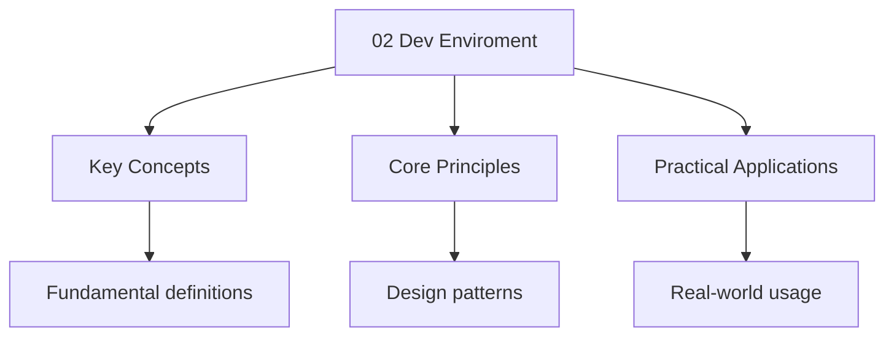

---

title: "Development Enviroment | Dart - Wyatt's Notes"
description: "Virtual devices can be created by opening the command-palette and selecting And selecting . However, the performance is not Accurate and convenience is"
date: 2025-07-13T19:11:38.762Z
tags:
  - dart
categories:
  - dart

---

<!-- Breadcrumb Schema for SEO -->
<script type="application/ld+json">
{
  "@context": "https://schema.org",
  "@type": "BreadcrumbList",
  "itemListElement": [{"name": "Home", "url": "https://wyattau.com"}, {"name": "dart", "url": "https://dart.wyattau.com"}, {"name": "02 Setup", "url": "https://dart.wyattau.com/02-setup"}, {"name": "02 Dev Enviroment", "url": "https://dart.wyattau.com/02-setup/02-dev-enviroment"}]
}
</script>




## Virtual Devices

Virtual devices can be created by opening the command-palette and selecting
`Flutter: Select Device`And selecting `create android emulator`. However, the performance is not
Accurate and convenience is limited, therefore I recommend using a
[physical device](#physical-devices).

## Physical Devices

Android devices can be use for running builds by enabling `USB debugging` from
`Android developer settings`This is done by:

1. Open settings and navigate to About Phone
2. Tab on the build number 7 times until a confirmation message appear
3. Then enter Developer Options and enable `USB debugging`
4. Plug the phone into the computer with USB connection

Now when selecting VSCode/command-palette/`Flutter: Select Device`The identifier of the phone will
Appear.


## IDE Setup

### VS Code

1. Install the Dart extension (dart-code.dart-code)
2. Install the Flutter extension (flutter.flutter-vs-code)
3. Open a Dart file -- the extension auto-detects the SDK

### IntelliJ / Android Studio

1. Install the Dart plugin from the marketplace
2. Configure the Dart SDK path in Settings > Languages & Frameworks > Dart

### Command Line

Use `dart analyze` for static analysis and `dart format` for code formatting:

```bash
dart analyze          # static analysis
dart format .         # format all files
dart run              # run the main entry point
dart test             # run tests
```

## Project Structure

A typical Dart project:

```
my_project/
  bin/              # Entry point scripts
    main.dart
  lib/              # Library code (imported by other packages)
    my_project.dart
  test/             # Unit and integration tests
    my_project_test.dart
  pubspec.yaml      # Package metadata and dependencies
  analysis_options.yaml  # Linter and analyzer settings
```

## Common Pitfalls

1. **Wrong SDK path**: Ensure `dart --version` works in your terminal before
   configuring your IDE.
2. **Missing pub get**: Always run `dart pub get` after changing `pubspec.yaml`.
3. **Conflicting SDK versions**: Use `dart --version` to verify you're on the
   expected Dart version across all tools.

## Worked Examples

### Example 1: Creating a new project

```bash
dart create my_app
cd my_app
dart run
```

### Example 2: Running tests

```bash
dart test                    # run all tests
dart test test/my_test.dart  # run a specific test
dart test --reporter expanded  # verbose output
```

## Summary

Setting up a Dart development environment requires the Dart SDK, an IDE with
Dart support, and understanding the standard project structure. Use `dart pub
get` to manage dependencies and `dart analyze` to catch issues early.

## Cross-References

- [Introduction to Dart](../01-intro) - Language overview
- [Entry Point](../03-basics/01-entrypoint) - The main() function
- [Variables and Types](../03-basics/02-variables) - Type system
