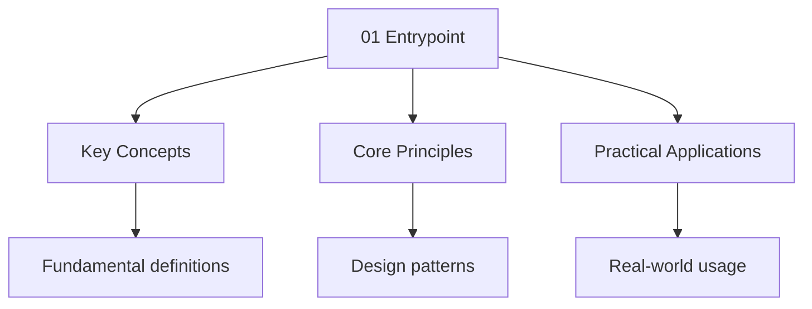

---

title: "Entry Point | Dart - Wyatt's Notes"
description: "When the project creates an executable, the entry point of the project is locate Comprehensive educational content coverage with definitions and practice proble"
date: 2025-07-12T15:49:11.104Z
tags:
  - Dart
categories:
  - Dart

---
import Citations from '@components/Citations.astro'


<!-- Breadcrumb Schema for SEO -->
<script type="application/ld+json">
{
  "@context": "https://schema.org",
  "@type": "BreadcrumbList",
  "itemListElement": [{"name": "Home", "url": "https://wyattau.com"}, {"name": "dart", "url": "https://dart.wyattau.com"}, {"name": "03 Basics", "url": "https://dart.wyattau.com/03-basics"}, {"name": "01 Entrypoint", "url": "https://dart.wyattau.com/03-basics/01-entrypoint"}]
}
</script>




## Program Entry

When the project creates an executable, the entry point of the project is located in `main()`Where
The default is given as:

```dart
void main(){
  runApp(const MyApp());
}
```

This can be find in `lib/main.dart` along with other source code.

## Overview

Every Dart application starts at the `main()` function. This is the entry point
that the Dart VM or AOT compiler invokes when the program runs.

## Key Concepts

### The main Function

The `main()` function is required in every Dart application. It can be
synchronous or asynchronous:

```dart
void main() {
  print('Hello, Dart!');
}

// Or async:
Future<void> main() async {
  final data = await fetchData();
  print(data);
}
```

### Command-Line Arguments

Access command-line arguments via the top-level `List<String> args` constant
from `dart:core`:

```dart
void main(List<String> arguments) {
  if (arguments.isNotEmpty) {
    print('First argument: ${arguments[0]}');
  }
}
```

### Library-Level Code

Code outside functions runs before `main()` but is generally discouraged for
application logic. It is useful for static initialisation:

```dart
final config = loadConfig(); // runs before main()

void main() {
  print(config);
}
```

## Common Pitfalls

1. **Missing main()**: The Dart compiler will reject any file without a `main()`
   function as an entry point.
2. **Forgetting async**: If `main()` calls async functions without `await`, the
   program may exit before futures complete.
3. **Top-level side effects**: Code outside `main()` runs unpredictably relative
   to imports and can cause order-dependent bugs.

## Worked Examples

### Example 1: Async main with error handling

```dart
Future<void> main() async {
  try {
    final result = await riskyOperation();
    print('Success: $result');
  } catch (e) {
    print('Error: $e');
    exit(1);
  }
}
```

### Example 2: Command-line tool

```dart
void main(List<String> args) {
  if (args.length < 2) {
    print('Usage: dart tool.dart <input> <output>');
    exit(2);
  }
  final input = args[0];
  final output = args[1];
  processFile(input, output);
}
```

## Summary

The `main()` function is the mandatory entry point for all Dart applications.
It supports synchronous and asynchronous execution, command-line arguments via
the `args` parameter, and should contain the primary application logic.

<Citations sources={[
  {title="Dart in Action", author="I Hate Computers", year="2023", type="book"},
  {title="Effective Dart", author="Dart Team", year="2024", type="web", url="https://dart.dev/effective-dart"},
]} />

## Cross-References

- [Introduction to Dart](../01-intro) - Language overview
- [Functions](03-functions) - Function syntax and closures
- [Variables and Types](02-variables) - Type system deep dive
