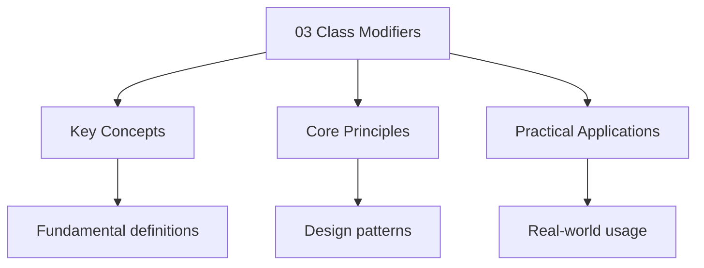

---

title: "Class Modifiers | Dart - Wyatt's Notes"
description: "Dart 3 introduces class modifiers — keywords that restrict how a class can be used by other Libraries. Before Dart 3, any class could be extended,"
date: 2026-04-05T00:00:00.000Z
tags:
  - Dart
categories:
  - Dart

---

<!-- Breadcrumb Schema for SEO -->
<script type="application/ld+json">
{
  "@context": "https://schema.org",
  "@type": "BreadcrumbList",
  "itemListElement": [{"name": "Home", "url": "https://wyattau.com"}, {"name": "dart", "url": "https://dart.wyattau.com"}, {"name": "07 Dart3 Features", "url": "https://dart.wyattau.com/07-dart3-features"}, {"name": "03 Class Modifiers", "url": "https://dart.wyattau.com/07-dart3-features/03-class-modifiers"}]
}
</script>

## Overview of Class Modifiers

Dart 3 introduces class modifiers — keywords that restrict how a class can be used by other
Libraries. Before Dart 3, any class could be extended, implemented, or mixed in by any library. This
Was a design choice inherited from Smalltalk: maximum flexibility, minimum restriction.

The problem: maximum flexibility is maximum liability. Library authors could not prevent misuse of
Their APIs. A class designed for inheritance could be `implement`-ed (losing all behavior). A class
Designed as a pure interface could be `extend`-ed (coupling to implementation details). A class
Designed as a leaf could be subclassed (breaking invariants).

Class modifiers solve this by giving library authors explicit control over the inheritance contract.
They are compile-time constraints — the compiler enforces them, not runtime checks.

### The Modifier Matrix

| Modifier      | Can be extended (outside lib) | Can be implemented (outside lib) | Can be used as mixin (outside lib) | Can be constructed     |
| ------------- | ----------------------------- | -------------------------------- | ---------------------------------- | ---------------------- |
| (none)        | Yes                           | Yes                              | Yes                                | If not abstract        |
| `sealed`      | No (same lib only)            | No (same lib only)               | No (same lib only)                 | No (implicit abstract) |
| `base`        | Yes (only via `extends`)      | No                               | No                                 | If not abstract        |
| `interface`   | No                            | Yes (only via `implements`)      | No                                 | If not abstract        |
| `final`       | No                            | No                               | No                                 | If not abstract        |
| `mixin class` | Via `extends` only            | Yes                              | Yes (with restrictions)            | If not abstract        |

### Why They Exist

Consider a real-world scenario. You write a library with a class `Listenable` that users should
Implement, not extend:

```dart
// Your library
class Listenable {
  void addListener(VoidCallback listener) { /* ... */ }
  void removeListener(VoidCallback listener) { /* ... */ }
}
```

Before Dart 3, a user could do this:

```dart
// User"s library
class MyListenable extends Listenable {
  @override
  void addListener(VoidCallback listener) {
    // Breaks your invariant — skips registration
  }
}
```

With `interface`You prevent this:

```dart
interface class Listenable {
  void addListener(VoidCallback listener);
  void removeListener(VoidCallback listener);
}

// User's library
class MyListenable extends Listenable {} // COMPILE ERROR
class MyListenable implements Listenable {
  // Must provide ALL methods — no inherited behavior to break
  @override
  void addListener(VoidCallback listener) { /* ... */ }
  @override
  void removeListener(VoidCallback listener) { /* ... */ }
}
```

## `sealed`

Restricts all subtyping (extend, implement, mixin) to the same library. This is covered in detail in
[sealed-classes.md](02-sealed-classes.md).

### Brief Recap

```dart
// Only files in this library (and its part files) can subtype Node
sealed class Node {}

class Element extends Node { /* ... */ }
class Text extends Node { /* ... */ }

// Another library:
// class Comment extends Node {} // COMPILE ERROR
```

**Use case**: Closed type hierarchies where you need compile-time exhaustiveness. Sum types, ASTs,
State machines.

**Key constraint**: All direct subtypes must be in the same library. The compiler uses this to
Enumerate subtypes for exhaustive switch.

## `base`

Prevents a class from being `implement`-ed outside the library. External code must use `extends` —
They cannot duck-type the interface.

### Syntax and Semantics

```dart
// Your library
base class Shape {
  void draw() { /* base implementation */ }
  int get area;
}

// User's library — same package, different library
import 'shapes.dart';

// OK — extends, inherits behavior
class Circle extends Shape {
  @override
  int get area => pi * radius * radius;
}

// COMPILE ERROR — cannot implement a base class
class Square implements Shape {
  @override
  void draw() { /* user's implementation */ }
  @override
  int get area => side * side;
}
```

### Why `base` Exists

The `base` modifier solves the **fragile base class problem**. When a class is designed for
Inheritance, its methods may rely on internal invariants. If a user `implement`S the class
(providing their own implementations of all methods), those invariants can be violated.

Consider:

```dart
// Your library — designed for extension
base class Resource {
  bool _isInitialized = false;

  void initialize() {
    _doSetup();
    _isInitialized = true;
  }

  void use() {
    if (!_isInitialized) throw StateError('Not initialized');
    _doWork();
  }

  void _doSetup() { /* ... */ }
  void _doWork() { /* ... */ }
}

// User's library
// Without 'base', user could do this:
class MyResource implements Resource {
  @override
  void initialize() { /* user skips your setup */ }
  @override
  void use() { /* no initialization check — invariant broken */ }
}

// With 'base', user MUST extend — they get your invariant checks
class MyResource extends Resource {
  // They override specific behavior but your invariant enforcement remains
  @override
  void _doWork() { /* custom work */ }
}
```

### `base` and the Inheritance Chain

When a `base` class is extended, the subclass is also implicitly `base`-restricted for further
Subtyping:

```dart
base class Animal {
  void speak() => print('...');
}

// Dog is effectively base — cannot be implemented externally
class Dog extends Animal {
  @override
  void speak() => print('Woof');
}

// External library:
// class MyPet implements Dog {} // COMPILE ERROR
// class MyPet extends Dog {} // OK
```

This propagation ensures that the base class's invariants are preserved through the entire
Inheritance chain. You cannot break out of the `extends`-only contract by subclassing.

### `base mixin`

Mixins can also be `base`:

```dart
base mixin Validatable {
  bool validate();
}

// External code can only use this via 'with' on a class that extends a base class
// They cannot 'implements' it (which would bypass the mixin's super calls)
```

## `interface`

Prevents a class from being `extend`-ed outside the library. External code must use `implements` —
They get the interface contract but no implementation.

### Syntax and Semantics

```dart
// Your library
interface class Serializable {
  Map&lt;String, dynamic&gt; toJson();
  static Serializable fromJson(Map&lt;String, dynamic&gt; json) =>
    throw UnsupportedError('Subclass must implement');
}

// User's library
// COMPILE ERROR — cannot extend an interface class
class User extends Serializable {}

// OK — implements, provides own behavior
class User implements Serializable {
  final String name;
  User(this.name);

  @override
  Map&lt;String, dynamic&gt; toJson() => {'name': name};
}
```

### Why `interface` Exists

Some classes are designed as contracts — they define what methods a type must have, but provide no
Implementation worth inheriting. Forcing users to `implement` ensures they provide their own
Complete implementation, avoiding accidental coupling to implementation details.

```dart
// Pure contract — no behavior to inherit
interface class Hashable {
  int get hashCode;
}

// If this were a regular class, users could extend it and accidentally
// depend on implementation details that might change between versions.
// With 'interface', they must provide their own hashCode.
```

### `interface` with Default Implementations

An `interface class` can have concrete methods. External code cannot access them via `extends`But
They are available to subtypes within the same library:

```dart
interface class Loggable {
  void log(String message) => print('[${DateTime.now()}] $message');
  void error(String message) {
    log('ERROR: $message');
  }
}

// Same library — can extend (inherits log/error)
class Service extends Loggable {
  void doWork() => log('Working...');
}

// External library — must implement (provides own log/error)
class ExternalService implements Loggable {
  @override
  void log(String message) => logger.info(message);
  @override
  void error(String message) => logger.error(message);
}
```

### `interface mixin`

```dart
interface mixin Disposable {
  void dispose();
}

// External code must 'implements', not 'with' (no inherited behavior)
```

## `final`

Prevents **all** subtyping outside the library. No `extends`No `implements`No `with`. The class Is a
leaf — it cannot be a supertype of anything defined outside its library.

### Syntax and Semantics

```dart
// Your library
final class ImmutableConfig {
  final String host;
  final int port;
  const ImmutableConfig(this.host, this.port);
}

// User's library — all of these are COMPILE ERRORS:
// class MyConfig extends ImmutableConfig {}
// class MyConfig implements ImmutableConfig {}
// class MyThing with ImmutableConfig {}

// The only way to use ImmutableConfig is to instantiate it or reference it
final config = ImmutableConfig('localhost', 8080);
```

### Why `final` Exists

`final` classes are the Dart equivalent of Java's `final class` or Kotlin's `final class`. They
Enforce **API boundaries** — the class's implementation is complete and should not be modified or
Extended.

Common use cases:

1. **Value objects**: Classes that represent data with identity semantics (like `Uri``Duration`).
2. **Configuration objects**: Classes whose entire purpose is to hold configuration.
3. **Internal implementation details**: Classes that are public but should not be subclassed.

```dart
// Value object — should never be extended
final class UserId {
  final String value;
  const UserId(this.value);

  @override
  bool operator ==(Object other) =>
    identical(this, other) || other is UserId && value == other.value;

  @override
  int get hashCode => value.hashCode;
}
```

### `final` Propagation

Unlike `base``final` does **not** propagate. A class that extends a `final` class (within the same
Library) is not itself `final`:

```dart
final class Base {
  // ...
}

// Same library — extending a final class is allowed
class Derived extends Base {
  // Derived is NOT final — external code can extend Derived
}

// External library:
class ExternalDerived extends Derived {} // OK
```

This is a deliberate design choice. The `final` restriction applies to the class itself, not to its
Subtypes. If you want the entire hierarchy to be `final`You must mark each class.

### `final mixin class`

```dart
final mixin class Singleton {
  static final Singleton _instance = Singleton._internal();
  Singleton._internal();
  factory Singleton() => _instance;
}

// External code cannot extend, implement, or mix in Singleton
```

## `mixin class`

A `mixin class` is a class that can be used both as a class (extended) and as a mixin (applied with
`with`). This unifies two previously separate concepts.

### Syntax and Semantics

```dart
mixin class Hoverable {
  bool _isHovered = false;

  void onEnter() => _isHovered = true;
  void onLeave() => _isHovered = false;
  bool get isHovered => _isHovered;
}

// Used as a class (extends)
class Button extends Hoverable {
  void click() {
    if (isHovered) print('Clicked while hovered');
  }
}

// Used as a mixin (with)
class Link extends Object with Hoverable {
  final String url;
  Link(this.url);
}
```

### Restrictions on `mixin class`

A `mixin class` cannot have a generative constructor that takes parameters (because mixins cannot
Have parameterized constructors):

```dart
// OK — no constructor or parameterless constructor
mixin class A {
  A();
}

// COMPILE ERROR — mixins cannot have parameterized constructors
mixin class B {
  final int value;
  B(this.value); // ERROR when used as 'with'
}

// But B CAN be extended (classes can have constructors)
class C extends B {
  C(int value) : super(value);
}

// D cannot use B as a mixin because B has a parameterized constructor
// class D extends Object with B {} // COMPILE ERROR
```

This restriction applies **only when the mixin class is used as a mixin**. When used via `extends`
The constructor is available normally.

### `mixin class` vs `mixin`

| Property              | `mixin`              | `mixin class`                                            |
| --------------------- | -------------------- | -------------------------------------------------------- |
| Can be extended       | No (must use `with`) | Yes                                                      |
| Can be used as mixin  | Yes                  | Yes                                                      |
| Can have constructors | No                   | Yes (but parameterized constructors prevent mixin usage) |
| Can be instantiated   | No                   | Yes                                                      |
| Can be abstract       | Yes                  | Yes                                                      |

**When to use `mixin class`**: When you have behavior that can be used both standalone (as a class)
And composed (as a mixin). For example, a `Serializable` class that can be used directly or mixed
Into other classes.

**When to use plain `mixin`**: When the behavior is purely additive and should never be instantiated
On its own. For example, a `Logging` mixin that adds logging methods to classes.

### `base mixin class`

```dart
base mixin class Observable {
  final List&lt;VoidCallback&gt; _listeners = [];

  void addListener(VoidCallback listener) => _listeners.add(listener);
  void removeListener(VoidCallback listener) => _listeners.remove(listener);
  void notifyListeners() => _listeners.forEach((cb) => cb());
}

// External code can extend or use as mixin, but cannot implement
class Button extends Observable {}
class Slider extends Object with Observable {}
// class Checkbox implements Observable {} // COMPILE ERROR
```

## Combinations

Class modifiers can be combined to express precise contracts. Not all combinations are valid.

### Valid Combinations

| Combination         | Meaning                                                                                                   |
| ------------------- | --------------------------------------------------------------------------------------------------------- |
| `sealed interface`  | Cannot be extended or implemented outside. Same-library only, exhaustive switch.                          |
| `base mixin`        | Can only be used via `with` or `extends`Not `implements`. External code must be in the inheritance chain. |
| `base mixin class`  | Can be extended or used as mixin, not implemented. External code inherits behavior.                       |
| `interface mixin`   | Can only be implemented, not extended or used as mixin. Pure contract.                                    |
| `final mixin class` | Cannot be extended, implemented, or used as mixin outside the library. Complete leaf.                     |

### The Compatibility Matrix

| First \ Second | `sealed` | `base` | `interface` | `final` | `mixin` |
| -------------- | -------- | ------ | ----------- | ------- | ------- |
| `sealed`       | N/A      | Yes    | Yes         | Yes     | Yes     |
| `base`         | Yes      | N/A    | No          | No      | Yes     |
| `interface`    | Yes      | No     | N/A         | No      | Yes     |
| `final`        | Yes      | No     | No          | N/A     | Yes     |
| `mixin`        | Yes      | Yes    | Yes         | Yes     | N/A     |

`sealed` can combine with `base``interface``final`And `mixin` (e.g., `sealed interface`
`sealed mixin class`). These combinations restrict subtypes to the same library while also applying
The additional modifier's semantics.

### `sealed interface`

```dart
sealed interface class Node {
  // Can be extended or implemented within the same library only
  // External code cannot use Node at all (except as a type reference)
}
```

This is the most restrictive combination. Within the defining library, it behaves like a regular
Class. Outside, it is completely sealed — no subtyping, no instantiation, only type references.

### `base mixin`

```dart
base mixin Persistable {
  void save(String path);
  void load(String path);
}

// External: must extend (not implement)
class Database extends Object with Persistable {
  @override
  void save(String path) { /* ... */ }
  @override
  void load(String path) { /* ... */ }
}
```

### `final mixin class`

```dart
final mixin class AtomicCounter {
  int _count = 0;
  int get count => _count;
  void increment() => _count++;
}

// External code cannot do ANYTHING with this except instantiate it
final counter = AtomicCounter();
counter.increment();
```

### `interface mixin`

```dart
interface mixin Comparable&lt;T&gt; {
  int compareTo(T other);
}

// External: must implement (no inherited behavior, no extension)
class Version implements Comparable&lt;Version&gt; {
  @override
  int compareTo(Version other) => /* ... */;
}
```

## Comparison Table

Here is the complete reference table for all class modifiers:

| Modifier            | Extends (outside)    | Implements (outside)    | Mixin (outside)   | Instantiate   | Abstract OK    | Key Use Case                         |
| ------------------- | -------------------- | ----------------------- | ----------------- | ------------- | -------------- | ------------------------------------ |
| (none)              | Yes                  | Yes                     | Yes               | Yes           | Yes            | Default — no restrictions            |
| `sealed`            | Same lib             | Same lib                | Same lib          | No (implicit) | Yes (implicit) | Closed hierarchies, exhaustiveness   |
| `base`              | Yes (`extends` only) | No                      | No                | Yes           | Yes            | Classes designed for inheritance     |
| `interface`         | No                   | Yes (`implements` only) | No                | Yes           | Yes            | Pure contracts, no shared behavior   |
| `final`             | No                   | No                      | No                | Yes           | Yes            | Leaf classes, immutable API          |
| `mixin`             | N/A                  | Yes                     | Yes               | No            | Yes            | Additive behavior, no standalone use |
| `mixin class`       | Yes                  | Yes                     | Yes               | Yes           | Yes            | Dual-use: class or mixin             |
| `base mixin`        | Yes (`extends` only) | No                      | Yes (`with` only) | No            | Yes            | Mixin with inheritance enforcement   |
| `interface mixin`   | No                   | Yes (`implements` only) | No                | No            | Yes            | Pure mixin contract                  |
| `final mixin class` | No                   | No                      | No                | Yes           | Yes            | Complete leaf, no subtyping          |

### Reading the Table

- **Extends (outside)**: Can code in another library write `class X extends Y`?
- **Implements (outside)**: Can code in another library write `class X implements Y`?
- **Mixin (outside)**: Can code in another library write `class X extends Object with Y`?
- **Instantiate**: Can the class be instantiated (not abstract)?
- **Abstract OK**: Can the modifier be applied to an abstract class?

## Migration from Unrestricted Classes

### When to Add Modifiers

You should add class modifiers when:

1. **Publishing a package**: Modifiers are part of your public API contract. Add them before the
   first stable release.
2. **Refactoring an existing package**: Adding modifiers is a **breaking change** for downstream
   code. Any external code that relied on the unrestricted behavior will break.
3. **Internal code**: Add modifiers aggressively. They document intent and catch bugs at compile
   time.

### The `base` Migration Path

`base` is the safest modifier to add to existing code. Most classes that are designed for
Inheritance should be `base`:

```dart
// Before: unrestricted
abstract class Widget {
  Widget build(BuildContext context);
}

// After: base — prevents implements, requires extends
base class Widget {
  Widget build(BuildContext context);
}
```

**Breaking change analysis**:

```dart
// User's code that breaks:
class MyWidget implements Widget {
  @override
  Widget build(BuildContext context) => Container();
}

// User must change to:
class MyWidget extends Widget {
  @override
  Widget build(BuildContext context) => Container();
}
```

### The `interface` Migration Path

```dart
// Before: unrestricted
abstract class Comparator&lt;T&gt; {
  int compare(T a, T b);
}

// After: interface — prevents extends, requires implements
interface class Comparator&lt;T&gt; {
  int compare(T a, T b);
}
```

**Breaking change analysis**:

```dart
// User's code that breaks:
class MyComparator extends Comparator&lt;int&gt; {
  @override
  int compare(int a, int b) => a - b;
}

// User must change to:
class MyComparator implements Comparator&lt;int&gt; {
  @override
  int compare(int a, int b) => a - b;
}
```

### The `final` Migration Path

`final` is the most restrictive. Only add it to classes that are not designed for subtyping:

```dart
// Before: unrestricted
class Configuration {
  final String host;
  final int port;
  Configuration(this.host, this.port);
}

// After: final — prevents all subtyping
final class Configuration {
  final String host;
  final int port;
  Configuration(this.host, this.port);
}
```

**Breaking change analysis**: Any external code that extends, implements, or mixes in
`Configuration` will break. This is a major version change.

### Migration Priority

For library authors, the recommended migration order:

1. **Start with `base`**: Most classes designed for inheritance should be `base`. This is the least
   disruptive change — users who `implement` must switch to `extends`But the behavioral change is
   minimal.

2. **Add `interface` to contracts**: Classes that are pure interfaces (no implementation worth
   inheriting) should be `interface`.

3. **Add `final` to leaves**: Classes that are not designed for any subtyping should be `final`.

4. **Add `sealed` to closed hierarchies**: If you have a fixed set of subtypes that should never be
   extended, convert to `sealed`.

### Modifier Inference

The Dart analyzer can suggest modifiers. Run `dart analyze` on your package and look for hints about
Missing modifiers. The analyzer uses heuristics:

- If a class has no public constructors and is abstract, suggest `sealed`.
- If a class is designed for inheritance (has `@protected` members), suggest `base`.
- If a class has only abstract members, suggest `interface`.

These are suggestions, not mandates. Use your judgment.

## Common Pitfalls

### 1. Mixing Up `base` and `interface`

```dart
// WRONG — using base for a pure contract
base class HashCode {
  int get hashCode;
}
// External code must extend, but there is nothing to inherit

// RIGHT — use interface for pure contracts
interface class HashCode {
  int get hashCode;
}
```

**Rule**: If a class has no implementation worth inheriting, use `interface`. If it has
Implementation that must be preserved through inheritance, use `base`.

### 2. Adding Modifiers to Existing Public APIs Without Bumping Major Version

This is a breaking change. If you add `base` to a class in version 1.2.0, and a downstream package
Was `implement`-ing it, their code breaks. Follow semver — this requires a major version bump.

### 3. `final` Does Not Propagate

```dart
final class Parent {}

class Child extends Parent {
  // Same library — OK
}

// External library:
class GrandChild extends Child {} // OK — Child is not final
```

If you want the entire hierarchy to be `final`Mark each class:

```dart
final class Parent {}
final class Child extends Parent {}
```

### 4. `sealed` Classes Cannot Be `base``interface`Or `final`

```dart
// COMPILE ERROR — sealed is already maximally restrictive
sealed base class Node {}
sealed interface class Node {}
sealed final class Node {}
```

`sealed` already prevents all external subtyping. Adding another modifier is redundant and the
Compiler rejects it.

### 5. `mixin class` Constructor Restrictions

```dart
mixin class WithState {
  final int value;
  WithState(this.value); // Parameterized constructor
}

// This works:
class Child extends WithState {
  Child(int value) : super(value);
}

// This DOES NOT work:
class Other extends Object with WithState {} // ERROR
// WithState has a parameterized constructor — cannot be used as mixin
```

The restriction is per-use: if the `mixin class` is used as a mixin, it cannot have a parameterized
Constructor. If used via `extends`The constructor is available.

### 6. Abstract Classes with Modifiers

```dart
// Abstract classes can have modifiers
abstract base class Service {
  void start();
  void stop();
}

// External code must extend (not implement)
class MyService extends Service {
  @override
  void start() { /* ... */ }
  @override
  void stop() { /* ... */ }
}

// External code CANNOT do this:
class MyService implements Service {} // COMPILE ERROR
```

The modifier applies to the abstract class itself. `abstract base` means "abstract AND base" — you
Cannot instantiate it directly, and external code must extend it.

### 7. Constructors in `interface` Classes

```dart
interface class Builder {
  Builder();
  void build();
}

// External code implementing Builder must provide its own constructor
class MyBuilder implements Builder {
  MyBuilder(); // Required — does not inherit Builder()
  @override
  void build() { /* ... */ }
}
```

`implements` does not inherit constructors. The implementing class must declare its own
Constructors. This is not specific to `interface` — it has always been true for `implements`. But
With `interface`It is the only option.

### 8. Modifiers and `part` Files

Modifiers apply at the library level. Subtypes in `part` files of the same library are not
Restricted:

```dart
// main.dart
sealed class Node {}
part 'subtypes.dart';

// subtypes.dart
part of 'main.dart';
class Element extends Node {} // OK — same library
class Text extends Node {} // OK — same library
```

All `part` files belong to the same library, so sealed/base/interface/final restrictions do not
Apply between them.

### 9. `base` and Method Overriding

`base` does not prevent method overriding. It only prevents `implements`. External code that
`extends` a `base` class can still override methods:

```dart
base class Animal {
  void speak() => print('...');
}

// External library — OK
class Dog extends Animal {
  @override
  void speak() => print('Woof');
}
```

If you want to prevent method overriding, use `@nonVirtual` annotation (from `package:meta`) or make
The method non-virtual by design.

### 10. Combining with `abstract`

`abstract` can be combined with any modifier:

```dart
abstract sealed class Node {} // Redundant — sealed is already abstract
abstract base class Service {} // Abstract AND base
abstract interface class Handler {} // Abstract AND interface
abstract final class Config {} // Abstract AND final — cannot be instantiated or subclassed externally
```

The only redundant combination is `abstract sealed` — `sealed` already implies `abstract`.

### 11. Enums and Modifiers

Enums are implicitly `sealed`. You cannot apply other modifiers to an enum:

```dart
// Enums are already sealed
enum Status { active, inactive }

// This is redundant and not allowed:
// sealed enum Status { active, inactive } // May be allowed but is redundant
// base enum Status { active, inactive } // Not valid
```

Dart 3 enums have the same exhaustiveness guarantees as sealed classes, without needing explicit
Modifiers.

### 12. Extending a `final` Class Within the Same Library

```dart
final class ApiClient {
  // ...
}

// Same library — extending final is ALLOWED
class TestApiClient extends ApiClient {
  // For testing purposes within the same library
}
```

`final` only restricts external code. Within the same library, you can extend `final` classes. This
Is useful for test doubles and internal implementation variants.




## Summary

This topic covers the core concepts of class modifiers, including underlying theory, practical
implementation, and key applications.

**Key concepts include:**

- core concepts and terminology
- algorithms and computational thinking
- practical implementation
- security and ethical considerations
- applications in the real world

Understanding these concepts thoroughly is essential for both examinations and practical
programming, and requires both theoretical knowledge and hands-on practice.

## Intuition

Class modifiers are like traffic signs on a highway -- they tell other drivers (external libraries) whether they can enter your lane (extend), merge into your lane (implement), or drive alongside you (mixin). The 'base' modifier says 'you must follow my lead' -- only extends is allowed, preserving your invariants. The 'interface' modifier says 'you must build your own car' -- only implements is allowed, forcing callers to provide their own implementation. The 'final' modifier says 'this lane is closed' -- no one can follow you. These modifiers are the library author's way of communicating the inheritance contract before a single line of code is written.

## Worked Examples

Worked examples demonstrating the application of key concepts are covered in the detailed sub-pages
linked above.

## Cross-References

- [Object-Oriented Programming](../04-object-oriented/01-classes-and-inheritance) -- Class modifiers like final, sealed, and abstract control inheritance and instantiation.
- [Sealed Classes](./02-sealed-classes) -- The sealed modifier restricts which classes can extend a class, enabling exhaustive pattern matching.
- [Error Handling](../08-error-handling) -- Abstract classes define error hierarchies that concrete error types implement.
