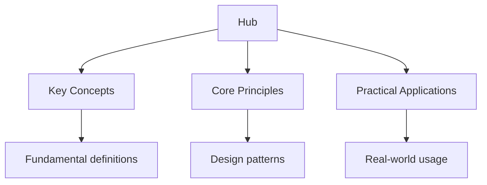

## Why This Guide Exists

Driving in Europe requires understanding a system that differs significantly from both the UK and US approaches. While each EU member state administers its own driving test and issues its own licence, the European Union has harmonised many aspects of driving law through directives and regulations. Road sign conventions follow the Vienna Convention on Road Signs and Signals, creating a recognisable system across most of Europe.

The EU driving licence is standardised across all member states, meaning a licence issued in France is valid in Germany, Spain, Italy, and every other EU country. However, the path to obtaining that licence varies by country: some require formal driving school attendance, others allow private instruction, and the theory test format ranges from multiple-choice to computer-based adaptive testing.

This hub page maps every resource on this site, organised by the key knowledge areas tested across EU countries, with guidance on navigating the differences between national systems.

## Table of Contents

- [EU Driving Regulations](#eu-driving-regulations)
- [European Road Signs](#european-road-signs)
- [Rules of the Road Across Europe](#rules-of-the-road-across-europe)
- [Country-Specific Test Systems](#country-specific-test-systems)
- [International Driving Permits](#international-driving-permits)
- [Cross-Border Driving](#cross-border-driving)
- [Recommended Study Plan](#recommended-study-plan)
- [Cross-Site Resources](#cross-site-resources)
- [FAQ](#faq)

---

## EU Driving Regulations

The European Union has established common standards for driving licences through Directive 2006/126/EC. This directive defines licence categories (from AM for mopeds to C for heavy vehicles), minimum ages, medical fitness requirements, and the principle of mutual recognition across member states.

### Topic Notes

- [EU Driving Law Overview](eu-regulations) -- the legal framework governing driving across Europe
- [Licence Categories](eu-regulations/categories) -- AM, A1, A2, A, B, BE, C1, C, D1, D, and their restrictions
- [Minimum Age Requirements](../../../../computer-science/src/content/docs/3-theory/automata-and-formal-languages) -- minimum ages for each licence category across EU states
- [Medical Fitness](eu-regulations/medical) -- eyesight standards, fitness to drive, and medical declarations
- [Licence Points Systems](eu-regulations/points) -- how different EU countries manage penalty points
- [Mutual Recognition](eu-regulations/recognition) -- how an EU licence works across borders

### Practice and Review

- [Flashcards: EU Regulations](flashcards-eu-regulations)
- [Practice Questions: EU Regulations](practice-eu-regulations)

### Key Test Focus

Understand the licence category system: Category B allows you to drive cars and light vehicles up to 3,500 kg. Know the minimum ages (typically 18 for Category B across the EU, though some countries allow 17). Understand that an EU licence is valid in all member states, but you must obey the local traffic laws of the country you are driving in.

---

## European Road Signs

European road signs follow the Vienna Convention system, creating a broadly recognisable system across the continent. However, there are regional variations, and the test in each country includes signs specific to that nation's roads.

### Topic Notes

- [European Road Signs Overview](road-signs) -- the Vienna Convention system and its adoption
- [Warning Signs](road-signs/warning) -- triangular signs with red borders alerting to hazards
- [Prohibitory Signs](road-signs/prohibitory) -- circular signs with red borders indicating restrictions
- [Mandatory Signs](road-signs/mandatory) -- blue circular signs giving positive instructions
- [Information and Direction Signs](../../../../physics/src/content/docs/2-thermal-physics/20_thermodynamics-of-information-processing) -- rectangular signs for guidance and services
- [Country-Specific Signs](road-signs/country-specific) -- signs unique to individual EU nations
- [Motorway Signs](road-signs/motorway) -- the blue or green motorway sign system and on-ramp markings

### Practice and Review

- [Flashcards: European Road Signs](flashcards-european-road-signs)
- [Practice Questions: European Road Signs](practice-european-road-signs)

### Key Test Focus

The core European sign system is consistent: red-bordered triangles warn, red-bordered circles prohibit, blue circles command, and rectangles inform. The speed limit sign (a number in a red circle) is universal. However, some countries use additional signs: Germany's Autobahn signs, France's toll motorway indicators, and Italy's ZTL (limited traffic zone) signs. Know the signs that apply to the country where you are taking your test.

---

## Rules of the Road Across Europe

While the EU harmonises many regulations, the rules of the road vary between countries. Speed limits, right-of-way conventions, and mandatory equipment requirements differ, and the test in each country covers the local rules.

### Topic Notes

- [Speed Limits by Country](rules/speed-limits) -- urban, rural, and motorway limits across all EU states
- [Right of Way](rules/right-of-way) -- priority rules, roundabouts, and unmarked junctions
- [Drunk Driving Limits](../../../../alevel/src/content/docs/chemistry/diagnostics/diag-halogenoalkanes-alcohols) -- BAC limits across Europe (0.0% in some countries, 0.5% in most)
- [Mandatory Equipment](rules/equipment) -- warning triangles, high-visibility vests, first-aid kits, and breathalysers
- [Winter Tyres and Chains](rules/winter) -- when winter tyres are required and snow chain regulations
- [Headlight Rules](rules/headlights) -- daytime running lights, dipped beam requirements, and country variations
- [Toll Systems](rules/tolls) -- vignettes, electronic tolls, and pay-per-use systems across Europe

### Practice and Review

- [Flashcards: European Traffic Rules](flashcards-european-rules)
- [Practice Questions: European Traffic Rules](practice-european-rules)

### Key Test Focus

Speed limits are the most commonly tested topic. Know the standard EU limits: 50 km/h in urban areas, 90 or 100 km/h on rural roads, and 120 or 130 km/h on motorways (these vary by country). Understand that Germany has no general speed limit on unrestricted Autobahn sections, though recommended speeds apply. Know the alcohol limits: 0.0% in the Czech Republic, Hungary, and Romania; 0.2% in some countries; 0.5% in most of Western Europe; and 0.8% only in the UK (pre-Brexit) and Malta.

---

## Country-Specific Test Systems

Each EU member state has its own driving test system. The theory test format, number of questions, pass mark, and practical test requirements vary significantly between countries.

### Topic Notes

- [Germany](../../../../alevel/src/content/docs/history/3-weimar-and-nazi-germany/1_weimar-nazi-germany) -- the driving school (Fahrschule) system, theory test, and practical exam
- [France](country-systems/france) -- the CODE de la Route theory test and the French practical test
- [Spain](country-systems/spain) -- the permiso de conducir test system and the DGT examination
- [Italy](../../../../ib/src/content/docs/history/fascism-italy) -- the patente di guida theory test and practical exam
- [Netherlands](country-systems/netherlands) -- the CBR theory and practical test system
- [Poland](country-systems/poland) -- the Wojewodzki Osrodek Ruchu Drogowego test
- [Ireland](https://leaving-cert.wyattau.com) -- for Irish driving test information (see the Leaving Cert site)

### Practice and Review

- [Country-Specific Flashcards](flashcards-country-specific)
- [Country-Specific Practice Tests](practice-tests-country)

### Key Test Focus

Germany requires formal driving school attendance before you can take the test. France requires a first-aid certificate. Spain requires a psychophysical aptitude test. Each country has its own minimum number of practical driving lessons. Understanding the specific requirements of your target country is essential before you begin preparing.

---

## International Driving Permits

An International Driving Permit (IDP) is a document that translates your driving licence into several languages. It is not a licence itself but accompanies your national licence when driving abroad.

### Topic Notes

- [IDP Overview](idp) -- what an IDP is, when you need one, and how to obtain one
- [IDP by Country](idp/by-country) -- which countries require an IDP and which accept foreign licences directly
- [IDP Categories](idp/categories) -- which IDP category covers which vehicle types
- [Obtaining an IDP](idp/obtaining) -- how to get an IDP from your national automobile association

### Practice and Review

- [Flashcards: International Driving](flashcards-international-driving)
- [Practice Questions: International Driving](practice-international-driving)

### Key Test Focus

An IDP is required in some non-EU countries even if your licence is in English. Within the EU, a standard EU driving licence is sufficient in all member states. If you hold a non-EU licence and plan to drive in Europe, check whether an IDP is required for your specific situation.

---

## Cross-Border Driving

Driving across EU borders requires awareness of different rules, toll systems, and emergency procedures. This section covers the practical knowledge you need for driving in multiple European countries.

### Topic Notes

- [Cross-Border Basics](cross-border) -- what changes when you cross an EU border
- [Emergency Numbers](cross-border/emergency) -- 112 (EU-wide) and country-specific emergency numbers
- [European Accident Statement](cross-border/accident) -- the standardised form for reporting accidents abroad
- [Insurance Green Card](cross-border/insurance) -- when you need a Green Card and how to obtain one
- [Breakdown Cover](cross-border/breakdown) -- European breakdown assistance and the European Emergency Number
- [Driving in Left-Hand Traffic](cross-border/left-hand) -- adapting to driving on the left in the UK, Ireland, Malta, and Cyprus

### Practice and Review

- [Flashcards: Cross-Border Driving](flashcards-cross-border)
- [Practice Questions: Cross-Border Driving](practice-cross-border)

### Key Test Focus

The European emergency number 112 works in all EU countries. Understand the European Accident Statement form: it standardises the information exchanged after a minor accident. Know that your EU driving licence and vehicle registration documents must be carried at all times. If you break down on a motorway, use the emergency telephones (every 2 km on most EU motorways) or call 112.

---

## Recommended Study Plan

Preparing for an EU driving test requires understanding both the general European system and the specific requirements of your target country.

### Weeks 1 to 2: Foundation

- Read the overview of EU driving regulations and licence categories
- Study the Vienna Convention road sign system
- Research the specific test requirements in your target country
- Begin flashcard practice: 15 minutes daily

### Weeks 3 to 4: Content Mastery

- Work through the rules of the road for your target country
- Study country-specific road signs and traffic regulations
- Complete practice tests tailored to your country's test format
- Review mandatory equipment requirements and toll systems

### Weeks 5 to 6: Practice and Refinement

- Complete at least 3 full practice tests under timed conditions
- Review every wrong answer and understand the correct rule
- Focus on speed limits, alcohol limits, and right-of-way rules
- Study cross-border driving requirements if you plan to drive in multiple countries

### Daily Routine

| Time | Activity |
| ------ | ---------- |
| Morning | Flashcards: 15 minutes of signs and regulations |
| Afternoon | Topic study: read one section of your country's driving rules |
| Evening | Practice: one practice test or 20 practice questions |
| Weekend | Full practice test plus review of wrong answers |

---

## Cross-Site Resources

Wyatt's Notes is a network of interconnected study sites. The EU driving content connects to related material:

- **[UK Driving Theory Test Guide](https://driving-uk.wyattau.com/hub)** -- the UK system (pre-Brexit harmonisation with EU rules)
- **[US DMV Test Guide](https://driving-us.wyattau.com/hub)** -- for comparison with the American driving test system
- **[Main Site: Wyatt's Notes](https://wyattsnotes.wyattau.com)** -- explore all 46 study sites in the network

---

## Frequently Asked Questions

### How should I start using this site?

Research the specific requirements of the country where you plan to take your test. Then take a diagnostic practice test to establish your baseline. Work through the topic notes for your weakest areas, followed by practice questions and flashcards.

### Do I need to take my test in the country where I live?

Generally, yes. Most EU countries require you to take the driving test in the country where you are resident. However, some countries have reciprocal agreements. Check with the licensing authority in your country of residence.

### Is an EU driving licence valid in all member states?

Yes. An EU driving licence issued by any member state is valid in all other member states. You must obey the local traffic laws of the country you are driving in, but your licence is recognised everywhere.

### What is the minimum age for driving in the EU?

The minimum age for a Category B (car) licence is 18 in most EU countries. Some countries allow driving at 17 with supervisory arrangements. The minimum age for Category A (motorcycle) varies from 16 to 24 depending on the subcategory and country.

### Do I need a special licence for driving in winter conditions?

No, but some countries require winter tyres during certain months (typically November to March). Austria, Germany, Finland, and Sweden have specific winter tyre regulations. Check the requirements for each country you plan to drive in.

### What documents do I need to drive in another EU country?

You need your valid EU driving licence, vehicle registration document, and proof of insurance (the Green Card is recommended even if not strictly required). Carry these documents at all times when driving abroad.

### How do I convert a non-EU licence to an EU licence?

The process varies by country. Generally, you must be a resident of the country, pass a medical examination, and may need to pass a theory test and/or practical test. Some countries have exchange agreements with non-EU nations that allow direct conversion without retesting. Check with the licensing authority in your country of residence.

---

*Last updated: 24 July 2026*

*Written by Wyatt. For questions or feedback, visit [wyattau.com](https://wyattau.com).*
