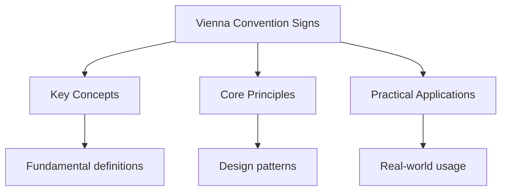

## Overview

The Vienna Convention on Road Signs and Signals (1968) establishes a standardised
system of road signs used across Europe and many other countries. Understanding
these signs is essential for driving in any signatory country. The system uses
consistent shapes, colours, and symbols.

## Regulatory Signs

Red circular signs indicate mandatory rules that must be obeyed.

- **Speed Limit**: Red circle with black number (maximum speed in km/h)
- **No Entry**: Red circle with white horizontal bar
- **No Overtaking**: Red circle with two car silhouettes
- **Minimum Speed**: Blue circle with white number (minimum speed in km/h)
- **Direction Mandatory**: Blue circle with white arrow (must go this way)

## Warning Signs

Triangular signs with red borders warn of hazards ahead.

- **Curve Ahead**: Triangle with curved arrow
- **Road Narrowing**: Triangle with narrowing road symbol
- **Traffic Signals**: Triangle with traffic light symbol
- **Pedestrian Crossing**: Triangle with walking figure
- **Road Works**: Triangle with person digging
- **Slippery Road**: Triangle with car and wavy skid marks
- **Falling Rocks**: Triangle with rocks falling from cliff
- **Wind**: Triangle with windsock symbol

## Information Signs

Rectangular signs provide information about routes and services.

- **Motorway**: Blue background with white text (motorway number)
- **Primary Route**: Green background with white text
- **Non-Primary Route**: White background with black text
- **Tourist Information**: Brown background with white text
- **Service Area**: Blue rectangle with service symbols (fuel, food, rest)

## Country-Specific Variations

While the Vienna Convention standardises signs, individual countries may have
additional signs or slight variations:

- **Germany**: Autobahn signs, strict priority rules
- **France**: Priority road signs (diamond shape), autoroute signs
- **Spain**: Mountain road warnings, toll road indicators
- **Italy**: Autostrada signs, limited traffic zone (ZTL) signs
- **Netherlands**: Fietspad (cycle path) signs, priority bicycle lanes

## Common Pitfalls

1. **Assuming signs are the same everywhere**: While Vienna Convention signs
   are standardised, individual countries may have additional local signs.
   Research country-specific signs before driving abroad.

2. **Ignoring speed limit units**: Vienna Convention speed limits are in km/h,
   not mph. A red circle with "50" means 50 km/h (approximately 31 mph).

3. **Misunderstanding priority signs**: Diamond-shaped priority road signs
   (used in France, Germany, etc.) indicate you have priority at intersections.

## Summary

Vienna Convention road signs use a consistent system: red circles for
regulatory signs (must obey), triangles for warnings (be prepared), and
rectangles for information. The convention standardises signs across Europe,
but individual countries may have additional local signs. Speed limits are
in km/h. Understanding this system is essential for driving in any
signatory country.

## Worked Examples

### Example 1: Sign Abroad

You are driving in Germany and see a red circle with "120" in black text.

**Identification**: This is a maximum speed limit sign. The red circle
indicates a regulatory sign. The number 120 means 120 km/h maximum.

**Conversion**: 120 km/h = approximately 75 mph.

**Action**: Reduce speed to 120 km/h or below.

### Example 2: Priority Road

You approach an intersection with a yellow diamond sign (priority road sign).

**Identification**: The yellow diamond indicates you have priority at the
intersection. Vehicles on other roads must yield to you.

**Action**: Proceed with caution, but you have the right of way.

## Cross-References

- [Driving Laws](../driving-laws/eu-driving-laws.md) - EU driving regulations
- [Theory Test](../theory-test/practice-eu-theory.md) - Practice questions
