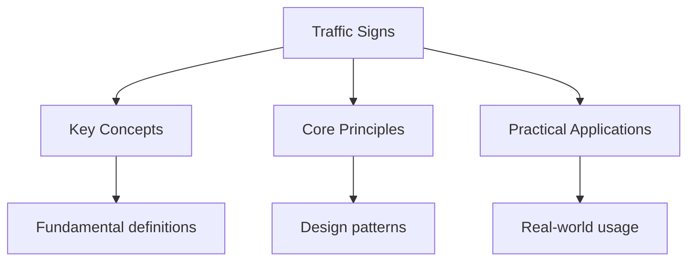

# EU Traffic Signs

## Vienna Convention on Road Signs and Signals

### Regulatory Signs (Circular)

#### Prohibition Signs (Red Border)

- **Speed Limit**: Maximum speed allowed
- **No Entry**: Vehicles not permitted
- **No Right Turn**: Right turn prohibited
- **No Left Turn**: Left turn prohibited
- **No Overtaking**: Overtaking prohibited

#### Mandatory Signs (Blue Background)

- **Turn Left**: Must turn left
- **Turn Right**: Must turn right
- **Go Straight Only**: Must continue straight
- **Roundabout**: Must go roundabout

### Warning Signs (Triangle)

#### Road Layout

- **Sharp Bend**: Road curves sharply
- **Narrow Road**: Road becomes narrow
- **Traffic Lights**: Traffic signals ahead
- **Pedestrian Crossing**: Crossing ahead

#### Hazards

- **Slippery Road**: Road surface may be slippery
- **Road Works**: Construction ahead
- **School Zone**: School zone ahead
- **Animal Crossing**: Animals may cross road

### Information Signs (Rectangle)

#### Direction Signs

- **Motorway**: Blue background with motorway symbol
- **Primary Route**: Green background
- **Local Route**: White background

#### Service Signs

- **Hospital**: Blue square with H
- **Gas Station**: Blue square with gas pump
- **Food**: Blue square with fork and knife
- **Lodging**: Blue square with bed

## Country-Specific Variations

### Germany

- **Autobahn**: No general speed limit, but advisory limits
- **Umweltzone**: Environmental zone restrictions
- **Alkoholgrenze**: 0.5% BAC limit

### France

- **Péage**: Toll road signs
- **Priorité à droite**: Priority to the right
- **Zone 30**: 30 km/h zone

### Spain

- **Radars**: Speed camera warnings
- **Eco**: Low emission zone
- **Parking**: Blue zone parking (pay and display)

### Italy

- **ZTL**: Restricted traffic zone
- **Autostrada**: Motorway
- **Strada statale**: State road

## Common Exam Questions

1. What does a red circle indicate?
   - Prohibition sign

2. What does a blue circle indicate?
   - Mandatory instruction

3. What does a triangle indicate?
   - Warning sign

4. What does a blue rectangle indicate?
   - Information or direction sign

## Practice Questions

### Question 1

What does this sign mean? (Speed Limit 50)

- Maximum speed of 50 km/h
- Minimum speed of 50 km/h
- Average speed of 50 km/h
- End of speed limit

**Correct Answer:** Maximum speed of 50 km/h

### Question 2

What does this sign mean? (No Entry)

- No entry for vehicles
- No parking
- No stopping
- No overtaking

**Correct Answer:** No entry for vehicles

## See Also

- [Theory Test](./)
- [EU Driving Test](..)

## Advanced Content

This section provides detailed coverage of advanced concepts, including full derivations, proofs, and extended examples.

### Derivations and Proofs

Complete mathematical derivations and proofs are provided where appropriate. Each step is explained to ensure understanding of the underlying reasoning.

### Extended Examples

Advanced examples demonstrate the application of concepts to complex problems. These examples go beyond standard exam questions to develop deeper understanding.

### Research Connections

This material connects to current research and advanced applications in the field. Understanding these connections provides context for the study material.

### Prerequisites

Ensure you have mastered the prerequisite material before attempting this advanced content.

## Advanced Content

This section provides detailed coverage of advanced concepts, including full derivations, proofs, and extended examples.

### Derivations and Proofs

Complete mathematical derivations and proofs are provided where appropriate. Each step is explained to ensure understanding of the underlying reasoning.

### Extended Examples

Advanced examples demonstrate the application of concepts to complex problems. These examples go beyond standard exam questions to develop deeper understanding.

### Research Connections

This material connects to current research and advanced applications in the field. Understanding these connections provides context for the study material.

### Prerequisites

Ensure you have mastered the prerequisite material before attempting this advanced content.

## Advanced Content

This section provides detailed coverage of advanced concepts, including full derivations, proofs, and extended examples.

### Derivations and Proofs

Complete mathematical derivations and proofs are provided where appropriate. Each step is explained to ensure understanding of the underlying reasoning.

### Extended Examples

Advanced examples demonstrate the application of concepts to complex problems. These examples go beyond standard exam questions to develop deeper understanding.

### Research Connections

This material connects to current research and advanced applications in the field. Understanding these connections provides context for the study material.

### Prerequisites

Ensure you have mastered the prerequisite material before attempting this advanced content.

## Advanced Content

This section provides detailed coverage of advanced concepts, including full derivations, proofs, and extended examples.

### Derivations and Proofs

Complete mathematical derivations and proofs are provided where appropriate. Each step is explained to ensure understanding of the underlying reasoning.

### Extended Examples

Advanced examples demonstrate the application of concepts to complex problems. These examples go beyond standard exam questions to develop deeper understanding.

### Research Connections

This material connects to current research and advanced applications in the field. Understanding these connections provides context for the study material.

### Prerequisites

Ensure you have mastered the prerequisite material before attempting this advanced content.
