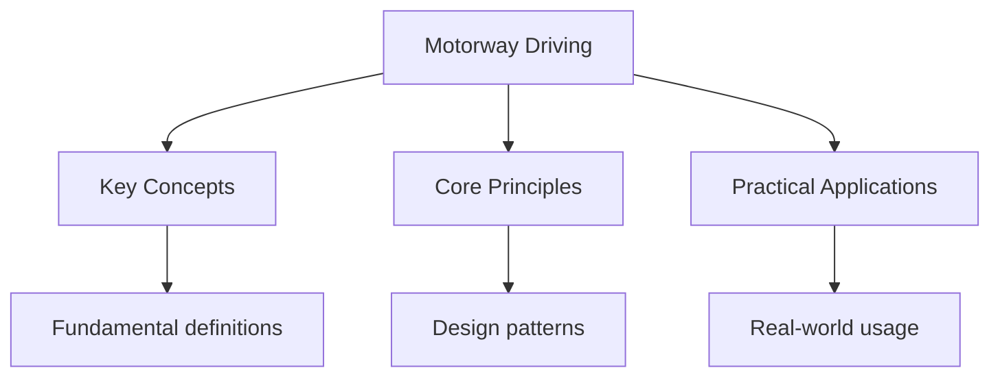

## Overview

Motorway driving in the UK requires specific knowledge and skills. The
Motorway Rules section of the Highway Code covers joining, exiting, lane
discipline, and emergency procedures. Motorways are high-speed roads with
strict rules designed to keep traffic flowing safely.

## Joining the Motorway

### Acceleration Lane

1. Signal your intention to join at least 100 metres before the slip road
2. Match the speed of traffic on the motorway using the acceleration lane
3. Check mirrors and blind spots
4. Merge when there is a safe gap in traffic
5. Do not stop on the acceleration lane

### Key Rules

- Give way to traffic already on the motorway
- Use the acceleration lane to build speed
- Merge smoothly into the left lane
- Do not cross the solid white line at the start of the acceleration lane

## Lane Discipline

### Lane Usage

- **Left lane**: Normal driving lane; use for normal driving
- **Middle lane**: Overtaking lane; return to left after passing
- **Right lane**: Overtaking lane for faster traffic; do not camp

### Lane Changes

- Check mirrors and blind spots
- Signal at least 2 seconds before changing lanes
- Change lanes smoothly and gradually
- Do not cross the hard shoulder line

## Exiting the Motorway

### Exit Procedure

1. Plan ahead and get into the left lane well before your exit
2. Signal left at least 200 metres before the exit
3. Reduce speed gradually on the slip road
4. Do not slow down on the motorway before the exit
5. Follow the exit sign and speed advisory

## Smart Motorways

Smart motorways use technology to manage traffic flow.

### Features

- Variable speed limits displayed on overhead gantries
- Hard shoulder running as an extra lane during peak times
- Emergency refuge areas (ERAs) at regular intervals
- Traffic monitoring cameras

### Rules

- Obey the speed limits shown on gantries
- Do not drive in the hard shoulder unless directed
- Use ERAs for emergencies only
- Stay alert for changing speed limits

## Emergency Situations

### Breakdown on Motorway

1. Pull onto the hard shoulder (left side)
2. Stop as far left as possible
3. Turn on hazard lights
4. Exit from the left door (away from traffic)
5. Walk to the emergency refuge area if safe
6. Call for roadside assistance
7. Do not attempt repairs on the hard shoulder

### Accident

1. Pull onto the hard shoulder if possible
2. Turn on hazard lights
3. Call 999 immediately
4. Do not attempt to cross the carriageway
5. Stay in the vehicle with seatbelt on
6. If you must exit, get behind the barrier

## Common Pitfalls

1. **Camping in the right lane**: The right lane is for overtaking only.
   Staying in the right lane blocks faster traffic and is dangerous.

2. **Not using the acceleration lane**: Stopping on the acceleration lane
   is extremely dangerous. Use the full lane to match motorway speed.

3. **Ignoring variable speed limits**: Smart motorway speed limits are
   legally enforceable. Disobeying them can result in fines and points.

## Summary

UK motorway driving requires specific skills: using the acceleration lane
to match speed, maintaining proper lane discipline (left lane for normal
driving, middle/right for overtaking), and understanding smart motorway
rules. In emergencies, pull onto the hard shoulder, exit from the left door,
and call for assistance. Variable speed limits on smart motorways are
legally enforceable.

## Worked Examples

### Example 1: Motorway Entry

You approach a motorway on-ramp. Traffic is moving at 70 mph.

**Step 1**: Signal your intent to join.
**Step 2**: Use the acceleration lane to reach 70 mph.
**Step 3**: Check mirrors and blind spots for a gap.
**Step 4**: Merge into the left lane when there is a safe gap.

**Common mistake**: Entering the motorway too slowly. This is dangerous for
both you and traffic behind.

### Example 2: Smart Motorway Speed

You are on a smart motorway. The gantry shows 50 mph but traffic is moving
at 70 mph.

**Rule**: You must obey the displayed speed limit. The 50 mph limit is
legally enforceable.

**Action**: Reduce to 50 mph. The speed cameras will enforce the limit.

## Cross-References

- [Road Signs](../highway-code/road-signs) - Motorway signs
- [Rules of the Road](../highway-code/rules-of-the-road) - General rules
- [Theory Test](../../../../../computer-science/src/content/docs/3-theory/practice-theory) - Practice questions

## Advanced Content

This section provides detailed coverage of advanced concepts, including full derivations, proofs, and extended examples.

### Derivations and Proofs

Complete mathematical derivations and proofs are provided where appropriate. Each step is explained to ensure understanding of the underlying reasoning.

### Extended Examples

Advanced examples demonstrate the application of concepts to complex problems. These examples go beyond standard exam questions to develop deeper understanding.

### Research Connections

This material connects to current research and advanced applications in the field. Understanding these connections provides context for the study material.

### Prerequisites

Ensure you have mastered the prerequisite material before attempting this advanced content.

## Advanced Content

This section provides detailed coverage of advanced concepts, including full derivations, proofs, and extended examples.

### Derivations and Proofs

Complete mathematical derivations and proofs are provided where appropriate. Each step is explained to ensure understanding of the underlying reasoning.

### Extended Examples

Advanced examples demonstrate the application of concepts to complex problems. These examples go beyond standard exam questions to develop deeper understanding.

### Research Connections

This material connects to current research and advanced applications in the field. Understanding these connections provides context for the study material.

### Prerequisites

Ensure you have mastered the prerequisite material before attempting this advanced content.
