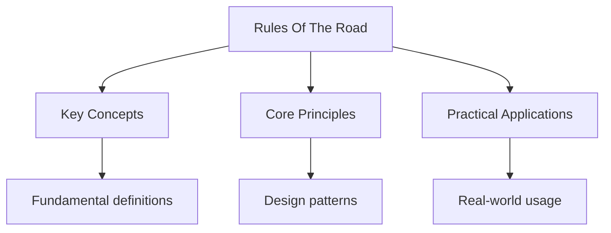

## Overview

The Highway Code sets out the rules of the road in the UK. These rules are
not just guidelines -- many are legally enforceable. The code covers
everything from speed limits and junctions to pedestrian crossings and
motorway driving.

## Speed Limits

The UK has standard speed limits that apply unless otherwise indicated by
signs.

### Built-Up Areas

- **30 mph**: Default limit in built-up areas (street lighting present)
- **20 mph**: School zones and residential areas with signs
- **40 mph**: Some rural roads with signs

### National Speed Limit

- **60 mph**: Single carriageway roads (one lane each direction)
- **70 mph**: Dual carriageway and motorways

### Variable Limits

- **Smart motorways**: Speed limits displayed on overhead gantries
- **Road works**: Reduced limits (typically 50 mph or 40 mph)
- **School zones**: 20 mph during school hours

## Junctions

### Roundabouts

UK roundabouts follow a strict priority system:

1. Give way to traffic already on the roundabout (from your right)
2. Signal your exit as you leave
3. Use the correct lane for your exit:
   - Left lane: 1st exit (left) or straight ahead
   - Right lane: 3rd exit or right turn

### T-Junctions

- Give way to traffic on the major road
- Look right, then left, then right again
- Pull out only when there is a safe gap

### Crossroads

- Give way to traffic on the major road
- Be aware of vehicles turning right across your path
- Check all directions before proceeding

## Pedestrian Crossings

### Zebra Crossing

- Black and white striped crossing
- Give way to pedestrians already on the crossing
- No traffic lights -- rely on pedestrian judgment

### Pelican Crossing

- Traffic light controlled crossing
- Wait for the green man before crossing
- Drivers must stop on red

### Puffin Crossing

- Sensors detect pedestrians waiting
- Green man appears on the near-side signal (not across the road)
- Drivers: lights change based on pedestrian presence

### Pedestrian Refuge Islands

- Islands in the middle of the road
- Cross one direction of traffic at a time
- Look right, cross to island, look left, cross remainder

## Lane Discipline

- Drive on the left side of the road
- Overtake on the right (driver's side)
- Return to the left after overtaking
- Use the correct lane for your destination

## Common Pitfalls

1. **Forgetting to drive on the left**: Visitors from right-hand-drive
   countries must remember to drive on the left. This is the most common
   cause of accidents for foreign drivers.

2. **Misunderstanding roundabout signals**: Signal left when exiting the
   roundabout, not when entering. Many drivers forget to signal their exit.

3. **Ignoring lane discipline on motorways**: The left lane is the normal
   driving lane. Use middle and right lanes for overtaking only.

## Summary

The UK Highway Code covers speed limits (30 mph built-up, 60 mph single
carriageway, 70 mph dual/motorway), junction priority (give way to traffic
from the right at roundabouts), pedestrian crossings (zebra, pelican, puffin),
and lane discipline (drive on the left, overtake on the right). Many rules
are legally enforceable, not just guidelines. The theory test assesses
knowledge of these rules.

## Worked Examples

### Example 1: Roundabout Navigation

You approach a roundabout and need to take the 3rd exit (right turn).

**Step 1**: Get in the right-hand lane as you approach.
**Step 2**: Give way to traffic already on the roundabout (from your right).
**Step 3**: Enter the roundabout when safe, staying in the right lane.
**Step 4**: As you pass the 2nd exit, signal right to indicate you are
taking the next exit.
**Step 5**: Signal left as you exit to warn traffic behind.

### Example 2: Pelican Crossing

You approach a pelican crossing and the red light is showing.

**Action**: Stop behind the line. Wait for the green signal. Do not proceed
until the green man appears and the road is clear of pedestrians.

## Cross-References

- [Road Signs](./road-signs) - Sign identification
- [Theory Test](../theory-test/practice-theory) - Practice questions
- [Safe Driving](../safe-driving/safe-driving-tips) - Driving techniques

## Advanced Content

This section provides detailed coverage of advanced concepts, including full derivations, proofs, and extended examples.

### Derivations and Proofs

Complete mathematical derivations and proofs are provided where appropriate. Each step is explained to ensure understanding of the underlying reasoning.

### Extended Examples

Advanced examples demonstrate the application of concepts to complex problems. These examples go beyond standard exam questions to develop deeper understanding.

### Research Connections

This material connects to current research and advanced applications in the field. Understanding these connections provides context for the study material.

### Prerequisites

Ensure you have mastered the prerequisite material before attempting this advanced content.

## Advanced Content

This section provides detailed coverage of advanced concepts, including full derivations, proofs, and extended examples.

### Derivations and Proofs

Complete mathematical derivations and proofs are provided where appropriate. Each step is explained to ensure understanding of the underlying reasoning.

### Extended Examples

Advanced examples demonstrate the application of concepts to complex problems. These examples go beyond standard exam questions to develop deeper understanding.

### Research Connections

This material connects to current research and advanced applications in the field. Understanding these connections provides context for the study material.

### Prerequisites

Ensure you have mastered the prerequisite material before attempting this advanced content.

## Advanced Content

This section provides detailed coverage of advanced concepts, including full derivations, proofs, and extended examples.

### Derivations and Proofs

Complete mathematical derivations and proofs are provided where appropriate. Each step is explained to ensure understanding of the underlying reasoning.

### Extended Examples

Advanced examples demonstrate the application of concepts to complex problems. These examples go beyond standard exam questions to develop deeper understanding.

### Research Connections

This material connects to current research and advanced applications in the field. Understanding these connections provides context for the study material.

### Prerequisites

Ensure you have mastered the prerequisite material before attempting this advanced content.
