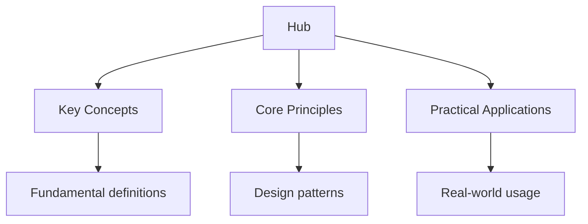

## Why This Guide Exists

The UK driving theory test is a legal requirement before you can take your practical driving test. Administered by the Driver and Vehicle Standards Agency (DVSA), it consists of two parts: a multiple-choice section covering the Highway Code and road rules, and a hazard perception test where you identify developing hazards in video clips. You must pass both parts in the same sitting to receive a theory test pass certificate.

The multiple-choice section presents 50 questions in 57 minutes, with a pass mark of 43 out of 50. The hazard perception section shows 14 video clips (one containing two hazards), and you must score at least 44 out of 75. The test is not merely about memorising rules — it requires you to understand the reasoning behind traffic laws, recognise road signs instantly, and develop the observational skills that keep you safe on real roads.

This hub page maps every resource on this site, organised by test section, with study plans and exam strategies to help you pass first time.

## Table of Contents

- [The Highway Code](#the-highway-code)
- [Road Signs](#road-signs)
- [Rules of the Road](#rules-of-the-road)
- [Vehicle Safety and Maintenance](#vehicle-safety-and-maintenance)
- [Hazard Perception](#hazard-perception)
- [Test-Taking Strategies](#test-taking-strategies)
- [Recommended Study Plan](#recommended-study-plan)
- [Cross-Site Resources](#cross-site-resources)
- [FAQ](#faq)

---

## The Highway Code

The Highway Code is the foundation of the UK theory test. It sets out the rules, procedures, and signs that all road users must follow. The current edition contains 318 rules, but the theory test draws primarily from sections covering alerts, controls, road markings, and the general rules that apply to all drivers.

### Topic Notes

- [Highway Code Overview](highway-code) — structure, editions, and what the test covers
- [Rules for All Drivers](highway-code/all-drivers) — rules 1–154 covering general driving conduct
- [Alertness and Attitude](highway-code/alertness) — awareness, concentration, and road rage prevention
- [Safety Margins](highway-code/safety-margins) — stopping distances, following distances, and space management
- [Control](../../../../programming/src/content/docs/object_oriented/1_class_design/2_access_control) — steering, braking, accelerating, and gear use

### Practice and Review

- [Flashcards: Highway Code](flashcards-highway-code)
- [Practice Questions: Highway Code](practice-highway-code)
- [Mock Theory Tests](mock-tests) — full 50-question simulations under timed conditions

### Key Test Focus

The theory test does not ask obscure Highway Code questions — it targets the rules that keep you alive on the road. Expect questions on stopping distances (which increase with speed and poor road surfaces), the meaning of specific road markings, and your legal obligations as a driver. Understand the reasoning behind each rule, not just the rule itself.

---

## Road Signs

The UK uses a comprehensive system of road signs governed by the Traffic Signs Regulations and General Directions. The theory test requires you to recognise signs instantly — there is no time to deliberate during the test, and on real roads hesitation costs lives.

### Topic Notes

- [Road Signs Overview](road-signs) — categories, classification, and legal status
- [Warning Signs](road-signs/warning) — triangular signs alerting you to hazards ahead
- [Regulatory Signs](road-signs/regulatory) — circular signs giving orders (speed limits, no entry, etc.)
- [Information Signs](../../../../physics/src/content/docs/2-thermal-physics/20_thermodynamics-of-information-processing) — rectangular signs providing directions and guidance
- [Road Markings](road-signs/markings) — centre lines, hatched areas, bus lanes, and cycle lanes
- [Temporary Signs](../../../../alevel/src/content/docs/geography/2-human-geography/3_contemporary-urban-environments) — roadworks, diversions, and contraflow systems

### Practice and Review

- [Flashcards: Road Signs](flashcards-road-signs)
- [Practice Questions: Road Signs](practice-road-signs)

### Key Test Focus

Know the colour coding: red circles give orders, blue circles give positive instructions, triangles warn, and rectangles inform. Understand the difference between a mandatory speed limit sign and an advisory one. Be able to identify less common signs — the test occasionally includes signs for equestrian crossings, tramways, and low-flying aircraft that you may not see every day.

---

## Rules of the Road

Beyond the Highway Code, the theory test covers specific traffic regulations including speed limits, right of way, overtaking rules, and the legal requirements for different road situations.

### Topic Notes

- [Speed Limits](rules/speed-limits) — urban, rural, and motorway limits for different vehicle types
- [Overtaking](rules/overtaking) — when you may and may not overtake, including on dual carriageways
- [Right of Way](rules/right-of-way) — roundabouts, junctions, pedestrian crossings, and emergency vehicles
- [Parking Rules](rules/parking) — legal and illegal parking, controlled zones, and penalty charges
- [Motorway Rules](rules/motorways) — lane discipline, hard shoulder use, and smart motorway regulations
- [Rural Roads](rules/rural-roads) — single-track roads, passing places, and farm vehicles

### Practice and Review

- [Flashcards: Rules of the Road](flashcards-rules)
- [Practice Questions: Rules of the Road](practice-rules)

### Key Test Focus

Speed limit questions are common — know the limits for cars, vans, and motorcycles on every road type. Understand the hierarchy of road users: pedestrians first, then cyclists, then motorcyclists, then cars. Know when you must give way at unmarked junctions and how to handle emergency vehicle approach safely.

---

## Vehicle Safety and Maintenance

The theory test includes questions about vehicle safety, the MOT, insurance requirements, and basic maintenance checks every driver should perform.

### Topic Notes

- [Vehicle Checks](vehicle-safety/checks) — daily checks: tyres, lights, mirrors, and fluid levels
- [MOT and Insurance](../../../../alevel/src/content/docs/computer-science/fundamentals/06-legal-ethical-moral) — legal requirements, certificate validity, and penalty for non-compliance
- [Tyres and Tread](vehicle-safety/tyres) — legal tread depth, pressure, and condition
- [Lights and Signals](vehicle-safety/lights) — using lights correctly in different conditions
- [Emergency Procedures](vehicle-safety/emergency) — breakdowns, accidents, and what to carry in the car

### Practice and Review

- [Flashcards: Vehicle Safety](flashcards-vehicle-safety)
- [Practice Questions: Vehicle Safety](practice-vehicle-safety)

### Key Test Focus

Know the legal minimum tyre tread depth (1.6mm across the central three-quarters). Understand when you must use headlights (dipped beam at night, front and rear lights in poor visibility). Know what to do if you break down on a motorway: pull onto the hard shoulder, exit from the left door, and stand behind the barrier.

---

## Hazard Perception

The hazard perception test is the second part of the theory exam. It shows you 14 video clips filmed from a driver's perspective, and you must click the mouse as soon as you see a developing hazard — something that would cause you to change speed, direction, or stop.

### Topic Notes

- [Hazard Perception Overview](theory-test/hazard-perception) — test format, scoring, and the developing hazard concept
- [Scoring System](hazard-perception/scoring) — up to 5 points per hazard, the earlier you click, the higher the score
- [Common Hazards](../../../../mathematics/src/content/docs/1-abstract-algebra/17_common-pitfalls) — pedestrians, cyclists, junctions, parked cars, and roadworks
- [Practice Clips](../../../../admissions/src/content/docs/practice-admissions) — sample video clips with timed responses

### Practice and Review

- [Hazard Perception Practice](hazard-perception/mock) — simulated clips to build your observational speed
- [Flashcards: Hazard Types](theory-test/hazard-perception)

### Key Test Focus

A developing hazard is anything that would cause you to change your driving — a ball rolling into the road, a car pulling out of a junction, a pedestrian stepping off the kerb. A potential hazard (something that might become a hazard) is not what you click for. Click once per developing hazard; clicking repeatedly does not increase your score and may reduce it. The earlier you identify the hazard, the more points you earn — the first second of a developing hazard scores the maximum.

---

## Test-Taking Strategies

Passing the theory test requires both knowledge and exam technique. Here are the strategies that maximise your score.

### Multiple-Choice Technique

Read each question carefully before looking at the answers. The test includes distractor answers that are almost right but contain one incorrect detail. For example, a question about minimum tyre tread depth might offer 1.0mm, 1.6mm, 2.0mm, and 3.0mm — if you rush, you might pick 1.0mm or 2.0mm instead of the correct 1.6mm.

Use the flagging feature to mark questions you are unsure about. You have 57 minutes for 50 questions, which gives you just over one minute per question. This is enough time to work carefully, so do not rush. Answer every question — there is no penalty for guessing.

### Hazard Perception Technique

Watch each clip with full concentration from the very beginning. The developing hazard can start at any point in the clip. As soon as you see something that would cause you to change your driving, click immediately. Do not wait to be certain — the scoring rewards early identification.

One clip contains two developing hazards. If you identify the first hazard and click, continue watching carefully for the second. Many test-takers miss the second hazard because they relax after the first click.

### Common Mistakes to Avoid

Do not leave any question blank on the multiple-choice section — guess if you must. On the hazard perception test, do not click continuously throughout the clip; the system penalises pattern clicking. Do not click only at the very end of a clip when the hazard is fully developed — the earlier you identify it, the more points you earn.

---

## Recommended Study Plan

Preparing for the theory test is a focused, short-term commitment. Most candidates can prepare adequately in 2–4 weeks with consistent study.

### Week 1: Foundation

- Read through the Highway Code cover to cover — focus on rules 1–154
- Study all road sign categories — learn the colour coding and shape meanings
- Take a diagnostic mock test to establish your baseline score
- Begin flashcard practice — 15 minutes daily

### Week 2: Content Mastery

- Work through rules of the road in detail — speed limits, overtaking, right of way
- Study vehicle safety and maintenance sections
- Complete flashcards for road signs — aim for instant recognition
- Take your first hazard perception practice session

### Week 3: Practice and Refinement

- Complete at least 3 full mock theory tests under timed conditions
- Review every wrong answer — understand why the correct answer is right
- Practice hazard perception clips daily — aim for 10–15 clips per session
- Focus on your weakest areas identified by mock test scores

### Week 4: Final Preparation

- Take one final mock test — aim for consistent scores above 45/50
- Do a final review of road signs you find difficult
- Practice hazard perception until you are scoring consistently above 60/75
- Rest before test day — tiredness affects reaction time and concentration

### Daily Routine

| Time | Activity |
| ------ | ---------- |
| Morning | Flashcards — 15 minutes of signs and rules |
| Afternoon | Topic study — read one section of the Highway Code |
| Evening | Practice — one mock test or 15 hazard perception clips |
| Weekend | Full mock test + review + hazard perception practice |

---

## Cross-Site Resources

Wyatt's Notes is a network of interconnected study sites. The UK driving content connects to related material:

- **[EU Driving Test Guide](https://driving-eu.wyattau.com/hub)** — if you plan to drive in Europe or are comparing test systems
- **[US DMV Test Guide](https://driving-us.wyattau.com/hub)** — for comparison with the American driving test system
- **[Main Site — Wyatt's Notes](https://wyattsnotes.wyattau.com)** — explore all 46 study sites in the network

---

## Frequently Asked Questions

### How should I start using this site?

Take a diagnostic mock test first. This shows you exactly where you stand and which sections need the most work. Then work through the Highway Code topic notes for your weakest areas, followed by practice questions and flashcards.

### How many mock tests should I take?

Aim for at least 5 full mock tests before your real exam. Take them under timed conditions — 57 minutes for 50 questions. Each test is a learning opportunity. Review every wrong answer and note which topics recur.

### Is the theory test harder than people think?

The pass rate is around 49% for first-time test-takers, which means more than half of candidates fail. The test is not impossibly difficult, but it does require genuine study. The hazard perception section catches out candidates who do not practise enough — watching video clips is very different from reading the Highway Code.

### How long is a theory test pass valid?

A theory test pass certificate is valid for 2 years from the date you passed. If you do not pass your practical test within 2 years, you must retake the theory test.

### Can I take the theory test in another language?

The multiple-choice section is available in 19 languages with a headphone option. The hazard perception test is available in English and Welsh. Check the DVSA website for the full list of available languages.

### What is the pass mark for the theory test?

You need 43 out of 50 on the multiple-choice section (86%) and 44 out of 75 on the hazard perception section (59%). You must pass both parts in the same sitting to pass the overall theory test.

### How much does the theory test cost?

The theory test costs £23 as of 2026. You can book online through the GOV.UK website or by phone. Booking in advance is recommended as test centre availability can be limited, especially during summer months.

### What happens if I fail the theory test?

You can retake the theory test after a waiting period of 3 working days. There is no limit on the number of times you can retake it, but you must pay the test fee each time. Use the time between attempts to focus on the areas where you scored lowest.

---

*Last updated: 24 July 2026*

*Written by Wyatt. For questions or feedback, visit [wyattau.com](https://wyattau.com).*
