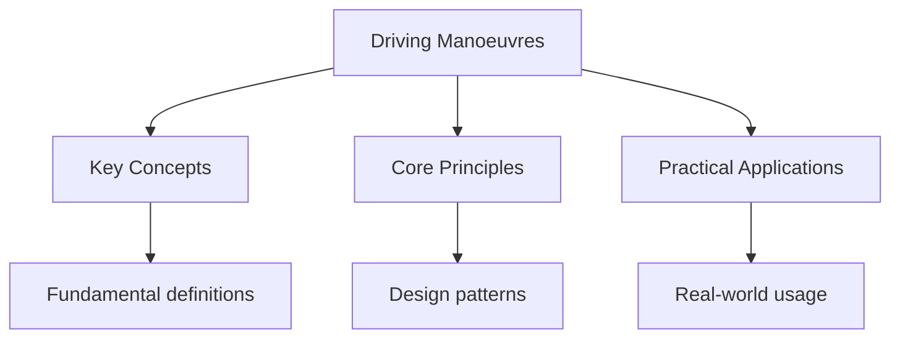

# Driving Manoeuvres

## Overview

The practical driving test includes several manoeuvres you must demonstrate. You'll be asked to perform 1-2 of these.

## Manoeuvres

### 1. Parallel Parking

**What you'll be asked to do:**

- Pull up alongside a parked car
- Reverse into a space behind it
- Finish within 2 car lengths and 30cm of the kerb

**Steps:**

1. Signal right and pull up alongside the parked car (about 1 metre away)
2. Check all mirrors and blind spots
3. Select reverse gear
4. Steer full lock right when the back of your car is level with the back of the parked car
5. Straighten the wheels when parallel to the kerb
6. Stop when you're about 2 car lengths behind the parked car

**Common Mistakes:**

- Not checking mirrors and blind spots
- Getting too close to the parked car
- Not finishing parallel to the kerb

### 2. Bay Parking (Reverse)

**What you'll be asked to do:**

- Drive into a parking bay
- Reverse into a space
- Finish within the lines

**Steps:**

1. Drive past the bay you want to use
2. Position yourself about 1 metre from the parked cars
3. Check all mirrors and blind spots
4. Select reverse gear
5. Steer into the bay, adjusting as needed
6. Straighten up and stop within the lines

**Common Mistakes:**

- Crossing the lines
- Not checking mirrors
- Getting too close to other cars

### 3. Bay Parking (Forward)

**What you'll be asked to do:**

- Drive forward into a parking bay
- Finish within the lines

**Steps:**

1. Approach the bay slowly
2. Position yourself about 1 metre from the parked cars
3. Turn into the bay when your mirror is level with the near side of the bay
4. Straighten up and stop within the lines

### 4. Pull Up on the Right

**What you'll be asked to do:**

- Pull up on the right side of the road
- Reverse back 2 car lengths
- Rejoin traffic safely

**Steps:**

1. Check mirrors and signal right
2. Pull up alongside parked cars on the right
3. Check all mirrors and blind spots
4. Reverse back 2 car lengths
5. Check all mirrors and blind spots
6. Signal left and move off when safe

### 5. Emergency Stop

**What you'll be asked to do:**

- Stop the car as quickly and safely as possible
- When instructed by the examiner

**Steps:**

1. Drive at about 20 mph
2. Examiner will say "STOP!" and raise their hand
3. Brake firmly and steer straight
4. Apply the handbrake when stopped
5. Select neutral
6. When ready, check all mirrors and blind spots before moving off

**Common Mistakes:**

- Not braking firmly enough
- Steering while braking
- Not checking before moving off again

## General Tips

1. **Practice each manoeuvre** until you're confident
2. **Take your time** - Speed doesn't matter, accuracy does
3. **Check mirrors constantly** - Show the examiner you're aware
4. **Don't panic** - If something goes wrong, correct it calmly
5. **Ask for clarification** - If you're not sure what to do, ask

## See Also

- [Practical Test](./)
- [UK Driving Test](..)
