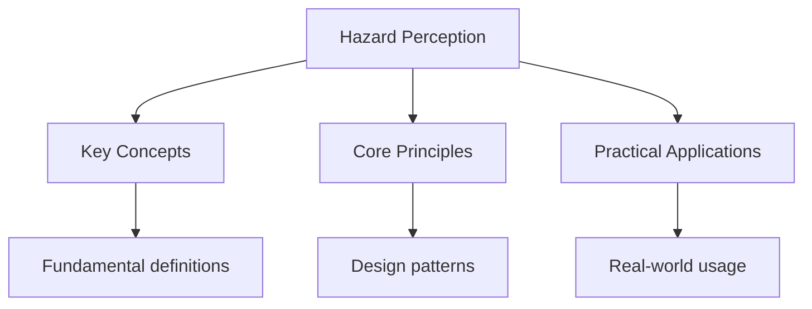

# Hazard Perception Test

## Overview

The hazard perception test shows 14 video clips of everyday driving scenes. You need to score 44 out of 75 (59%) to pass.

## How It Works

### Scoring System

- **5 points**: Spotting a developing hazard early
- **4 points**: Spotting a developing hazard slightly later
- **3 points**: Spotting a developing hazard at a moderate time
- **2 points**: Spotting a developing hazard late
- **1 point**: Spotting a developing hazard very late
- **0 points**: Not spotting the hazard

### What is a Developing Hazard?

A developing hazard is something that:

1. Requires you to change speed or direction
2. Is getting closer to you
3. You need to take action to avoid

## Common Hazards

### Road Users

- **Pedestrians**: Crossing road, stepping off pavement
- **Cyclists**: Riding in road, indicating to turn
- **Motorcyclists**: Filtering, overtaking
- **Other vehicles**: Pulling out, braking, turning

### Road Conditions

- **Traffic lights**: Changing to red
- **Road works**: Lane closures, narrow lanes
- **Weather**: Rain, fog, ice
- **Road surface**: Potholes, debris

### Animals

- **Dogs**: Running into road
- **Horses**: Being led or ridden
- **Wild animals**: Crossing road

## Practice Clips

### Clip 1: Pedestrian Crossing

**Scenario**: You're driving on a residential street. A pedestrian is waiting at a crossing.
**Developing Hazard**: The pedestrian steps onto the crossing as you approach.
**Action**: Reduce speed and be prepared to stop.
**Score**: 5 points (early detection)

### Clip 2: Cyclist Ahead

**Scenario**: You're following a cyclist on a country road.
**Developing Hazard**: The cyclist indicates right and moves to the center of the lane.
**Action**: Slow down and wait for a safe opportunity to pass.
**Score**: 4 points (good detection)

### Clip 3: Traffic Lights

**Scenario**: You're approaching traffic lights that are green.
**Developing Hazard**: The lights change to amber, then red as you approach.
**Action**: Stop safely before the crossing.
**Score**: 3 points (moderate detection)

## Tips for Success

1. **Click when you see a potential hazard** - Don't wait for it to develop
2. **Click multiple times** - If the hazard develops over time
3. **Watch the whole clip** - Hazards can appear at any time
4. **Practice with official DVSA clips** - They show the expected timing
5. **Stay focused** - Some clips have no hazards (scoring clips)

## See Also

- [Theory Test](./)
- [Multiple Choice Questions](./multiple-choice)
- [Road Rules](./road-rules)

## Advanced Content

This section provides detailed coverage of advanced concepts, including full derivations, proofs, and extended examples.

### Derivations and Proofs

Complete mathematical derivations and proofs are provided where appropriate. Each step is explained to ensure understanding of the underlying reasoning.

### Extended Examples

Advanced examples demonstrate the application of concepts to complex problems. These examples go beyond standard exam questions to develop deeper understanding.

### Research Connections

This material connects to current research and advanced applications in the field. Understanding these connections provides context for the study material.

### Prerequisites

Ensure you have mastered the prerequisite material before attempting this advanced content.

## Advanced Content

This section provides detailed coverage of advanced concepts, including full derivations, proofs, and extended examples.

### Derivations and Proofs

Complete mathematical derivations and proofs are provided where appropriate. Each step is explained to ensure understanding of the underlying reasoning.

### Extended Examples

Advanced examples demonstrate the application of concepts to complex problems. These examples go beyond standard exam questions to develop deeper understanding.

### Research Connections

This material connects to current research and advanced applications in the field. Understanding these connections provides context for the study material.

### Prerequisites

Ensure you have mastered the prerequisite material before attempting this advanced content.

## Advanced Content

This section provides detailed coverage of advanced concepts, including full derivations, proofs, and extended examples.

### Derivations and Proofs

Complete mathematical derivations and proofs are provided where appropriate. Each step is explained to ensure understanding of the underlying reasoning.

### Extended Examples

Advanced examples demonstrate the application of concepts to complex problems. These examples go beyond standard exam questions to develop deeper understanding.

### Research Connections

This material connects to current research and advanced applications in the field. Understanding these connections provides context for the study material.

### Prerequisites

Ensure you have mastered the prerequisite material before attempting this advanced content.

## Advanced Content

This section provides detailed coverage of advanced concepts, including full derivations, proofs, and extended examples.

### Derivations and Proofs

Complete mathematical derivations and proofs are provided where appropriate. Each step is explained to ensure understanding of the underlying reasoning.

### Extended Examples

Advanced examples demonstrate the application of concepts to complex problems. These examples go beyond standard exam questions to develop deeper understanding.

### Research Connections

This material connects to current research and advanced applications in the field. Understanding these connections provides context for the study material.

### Prerequisites

Ensure you have mastered the prerequisite material before attempting this advanced content.

## Advanced Content

This section provides detailed coverage of advanced concepts, including full derivations, proofs, and extended examples.

### Derivations and Proofs

Complete mathematical derivations and proofs are provided where appropriate. Each step is explained to ensure understanding of the underlying reasoning.

### Extended Examples

Advanced examples demonstrate the application of concepts to complex problems. These examples go beyond standard exam questions to develop deeper understanding.

### Research Connections

This material connects to current research and advanced applications in the field. Understanding these connections provides context for the study material.

### Prerequisites

Ensure you have mastered the prerequisite material before attempting this advanced content.

## Advanced Content

This section provides detailed coverage of advanced concepts, including full derivations, proofs, and extended examples.

### Derivations and Proofs

Complete mathematical derivations and proofs are provided where appropriate. Each step is explained to ensure understanding of the underlying reasoning.

### Extended Examples

Advanced examples demonstrate the application of concepts to complex problems. These examples go beyond standard exam questions to develop deeper understanding.

### Research Connections

This material connects to current research and advanced applications in the field. Understanding these connections provides context for the study material.

### Prerequisites

Ensure you have mastered the prerequisite material before attempting this advanced content.
