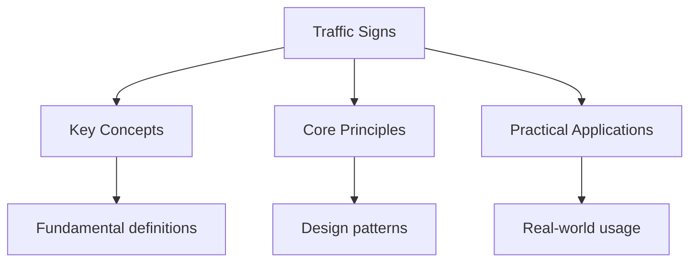

# Traffic Signs

## Regulatory Signs

### Speed Limit Signs

- **Speed Limit**: Maximum speed allowed
- **Minimum Speed**: Minimum speed required
- **End of Restriction**: End of speed limit zone

### Prohibition Signs

- **No Entry**: Vehicles not permitted
- **No Right Turn**: Right turn prohibited
- **No Left Turn**: Left turn prohibited
- **No U-Turn**: U-turn prohibited
- **No Overtaking**: Overtaking prohibited

### Mandatory Signs

- **Turn Left**: Must turn left
- **Turn Right**: Must turn right
- **Go Straight Only**: Must continue straight

## Warning Signs

### Road Layout

- **Sharp Bend**: Road curves sharply
- **Narrow Road**: Road becomes narrow
- **Dual Carriageway Ends**: Dual carriageway ends
- **Level Crossing**: Railway crossing ahead

### Hazards

- **Slippery Road**: Road surface may be slippery
- **Road Works**: Construction ahead
- **Traffic Lights**: Traffic signals ahead
- **Pedestrian Crossing**: Crossing ahead

## Information Signs

### Direction Signs

- **Motorway Signs**: Blue background
- **Primary Route**: Green background
- **Local Route**: White background

### Tourist Signs

- **Tourist Attraction**: Brown background
- **Hospital**: Blue H sign
- **Parking**: Blue P sign

## Common Exam Questions

1. What does a red circle with a white background indicate?
   - Regulatory sign (prohibition or restriction)

2. What does a blue circle indicate?
   - Mandatory instruction

3. What does a triangle indicate?
   - Warning sign

4. What does a blue rectangle indicate?
   - Information or direction

## Practice Questions

### Question 1

What does this sign mean? (Speed Limit 30)

- Maximum speed of 30 mph
- Minimum speed of 30 mph
- Average speed of 30 mph
- End of speed limit

**Correct Answer:** Maximum speed of 30 mph

### Question 2

What does this sign mean? (No Entry)

- No entry for vehicles
- No parking
- No stopping
- No overtaking

**Correct Answer:** No entry for vehicles

## See Also

- [Theory Test](./)
- [Hazard Perception](./hazard-perception)
- [Multiple Choice Questions](./multiple-choice)

## Advanced Content

This section provides detailed coverage of advanced concepts, including full derivations, proofs, and extended examples.

### Derivations and Proofs

Complete mathematical derivations and proofs are provided where appropriate. Each step is explained to ensure understanding of the underlying reasoning.

### Extended Examples

Advanced examples demonstrate the application of concepts to complex problems. These examples go beyond standard exam questions to develop deeper understanding.

### Research Connections

This material connects to current research and advanced applications in the field. Understanding these connections provides context for the study material.

### Prerequisites

Ensure you have mastered the prerequisite material before attempting this advanced content.

## Advanced Content

This section provides detailed coverage of advanced concepts, including full derivations, proofs, and extended examples.

### Derivations and Proofs

Complete mathematical derivations and proofs are provided where appropriate. Each step is explained to ensure understanding of the underlying reasoning.

### Extended Examples

Advanced examples demonstrate the application of concepts to complex problems. These examples go beyond standard exam questions to develop deeper understanding.

### Research Connections

This material connects to current research and advanced applications in the field. Understanding these connections provides context for the study material.

### Prerequisites

Ensure you have mastered the prerequisite material before attempting this advanced content.

## Advanced Content

This section provides detailed coverage of advanced concepts, including full derivations, proofs, and extended examples.

### Derivations and Proofs

Complete mathematical derivations and proofs are provided where appropriate. Each step is explained to ensure understanding of the underlying reasoning.

### Extended Examples

Advanced examples demonstrate the application of concepts to complex problems. These examples go beyond standard exam questions to develop deeper understanding.

### Research Connections

This material connects to current research and advanced applications in the field. Understanding these connections provides context for the study material.

### Prerequisites

Ensure you have mastered the prerequisite material before attempting this advanced content.

## Advanced Content

This section provides detailed coverage of advanced concepts, including full derivations, proofs, and extended examples.

### Derivations and Proofs

Complete mathematical derivations and proofs are provided where appropriate. Each step is explained to ensure understanding of the underlying reasoning.

### Extended Examples

Advanced examples demonstrate the application of concepts to complex problems. These examples go beyond standard exam questions to develop deeper understanding.

### Research Connections

This material connects to current research and advanced applications in the field. Understanding these connections provides context for the study material.

### Prerequisites

Ensure you have mastered the prerequisite material before attempting this advanced content.

## Advanced Content

This section provides detailed coverage of advanced concepts, including full derivations, proofs, and extended examples.

### Derivations and Proofs

Complete mathematical derivations and proofs are provided where appropriate. Each step is explained to ensure understanding of the underlying reasoning.

### Extended Examples

Advanced examples demonstrate the application of concepts to complex problems. These examples go beyond standard exam questions to develop deeper understanding.

### Research Connections

This material connects to current research and advanced applications in the field. Understanding these connections provides context for the study material.

### Prerequisites

Ensure you have mastered the prerequisite material before attempting this advanced content.
