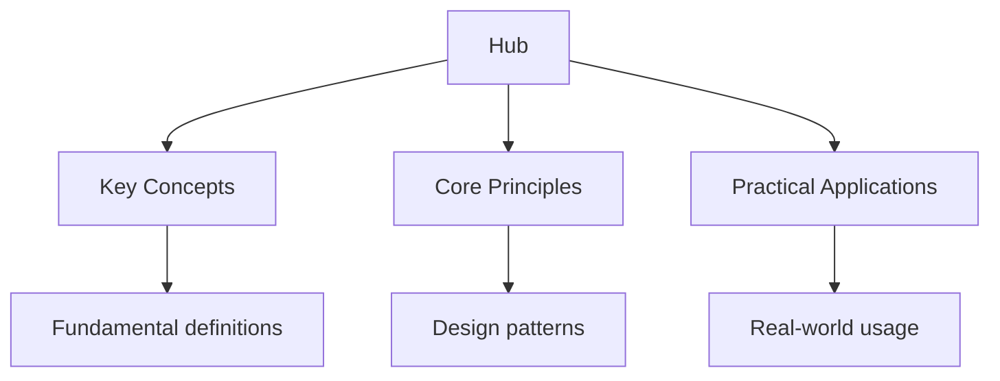

## Why This Guide Exists

The US driving test is administered at the state level, which means requirements, question formats, and pass marks vary depending on where you live. However, the core content is remarkably consistent: every state tests your knowledge of road signs, traffic laws, safe driving practices, and the rules of the road. The written knowledge test (often called the permit test) is the first hurdle, followed by a behind-the-wheel driving test that assesses your practical skills.

The written test typically presents 20 to 50 multiple-choice questions (depending on the state), with a pass mark of 80% or higher. The questions are drawn from your state's driver handbook, the official document published by your state's Department of Motor Vehicles (DMV) or equivalent agency. Despite state-by-state variation, the fundamental principles of safe driving are universal.

This hub page maps every resource on this site, organised by test section, with state-specific guidance and study plans to help you pass your knowledge test on the first attempt.

## Table of Contents

- [Written Knowledge Test](#written-knowledge-test)
- [Road Signs](#road-signs)
- [Traffic Laws and Rules of the Road](#traffic-laws-and-rules-of-the-road)
- [Safe Driving Techniques](#safe-driving-techniques)
- [State-Specific Requirements](#state-specific-requirements)
- [Behind-the-Wheel Test](#behind-the-wheel-test)
- [Recommended Study Plan](#recommended-study-plan)
- [Cross-Site Resources](#cross-site-resources)
- [FAQ](#faq)

---

## Written Knowledge Test

The written knowledge test is the first step toward getting your driver's licence. Every state requires you to pass this test before you can receive your learner's permit. The test is based on your state's official driver handbook, and questions cover road signs, traffic laws, and safe driving practices.

### Topic Notes

- [Written Test Overview](written-test) -- test format, question types, and scoring for all 50 states
- [Study Strategies](written-test/study-strategies) -- how to use the driver handbook effectively
- [Practice Test Formats](../../../../programming/src/content/docs/compilation_model/1_translation/4_binary_formats) -- multiple-choice, true/false, and combination formats
- [Common Test Topics](written-test/common-topics) -- the concepts that appear on every state's test

### Practice and Review

- [Flashcards: Written Test](flashcards-written-test)
- [Practice Questions: Written Test](practice-written-test)
- [State-Specific Practice Tests](practice-tests-state) -- tests tailored to your state's handbook
- [Diagnostic Quizzes](written-test/diagnostics) -- identify your weak areas

### Key Test Focus

The written test is not about trick questions. It tests whether you understand the fundamental rules that keep you safe. Focus on right-of-way rules, speed limits, parking regulations, and the meaning of every road sign you might encounter. Reading your state's driver handbook cover to cover is the single most effective preparation strategy.

---

## Road Signs

The US uses a system of road signs governed by the Manual on Uniform Traffic Control Devices (MUTCD). The written test requires you to recognise signs by shape, colour, and symbol, and to understand what action each sign requires of you.

### Topic Notes

- [Road Signs Overview](road-signs) -- categories, MUTCD standards, and legal significance
- [Warning Signs](road-signs/warning) -- diamond-shaped signs alerting you to hazards ahead
- [Regulatory Signs](road-signs/regulatory) -- signs that impose legal requirements (speed limits, stop, yield)
- [Guide and Information Signs](../../../../ib/src/content/docs/biology/diagnostics/diagnostic-guide) -- directional signs, distance markers, and services
- [Construction and Work Zone Signs](road-signs/construction) -- orange signs for roadwork areas
- [Pavement Markings](road-signs/markings) -- lines, arrows, crosswalks, and their meanings

### Practice and Review

- [Flashcards: Road Signs](flashcards-road-signs)
- [Practice Questions: Road Signs](practice-road-signs)

### Key Test Focus

Know the colour coding: red for stop and prohibition, yellow for warning, orange for construction, green for guidance, blue for services, and brown for recreation. Understand the difference between a stop sign and a yield sign. Pavement markings are frequently tested: know the difference between solid and dashed lines, yellow and white lines, and what arrows in turn lanes mean.

---

## Traffic Laws and Rules of the Road

Traffic laws vary by state but share common principles. The written test covers speed limits, right-of-way rules, DUI laws, seatbelt requirements, and the legal obligations of drivers, pedestrians, and cyclists.

### Topic Notes

- [Speed Limits](traffic-laws/speed-limits) -- residential, school zone, highway, and construction zone limits
- [Right of Way](traffic-laws/right-of-way) -- intersections, roundabouts, pedestrians, and emergency vehicles
- [DUI and Impaired Driving](traffic-laws/dui) -- blood alcohol limits, implied consent, and penalties
- [Seatbelt and Child Restraint Laws](traffic-laws/seatbelts) -- mandatory use, age requirements, and penalties
- [Parking Laws](traffic-laws/parking) -- legal and illegal parking, handicapped spaces, and fire hydrants
- [Sharing the Road](../../../../truenas/src/content/docs/02-sharing-and-permissions/sharing-and-permissions) -- cyclists, pedestrians, school buses, and large trucks

### Practice and Review

- [Flashcards: Traffic Laws](flashcards-traffic-laws)
- [Practice Questions: Traffic Laws](practice-traffic-laws)

### Key Test Focus

Right-of-way questions are among the most common on the written test. Understand who goes first at four-way stops (the first to arrive proceeds first; if simultaneous, yield to the right), how to handle uncontrolled intersections, and when you must stop for pedestrians in crosswalks. DUI questions test knowledge of the legal blood alcohol concentration limit (0.08% for drivers 21 and over in all states) and the consequences of refusing a breathalyser test.

---

## Safe Driving Techniques

Beyond memorising rules, the written test assesses your understanding of safe driving practices: how to maintain control of your vehicle, manage your space on the road, and respond to changing conditions.

### Topic Notes

- [Defensive Driving](safe-driving/defensive) -- the Smith System, space cushion, and scanning techniques
- [Following Distance](safe-driving/following-distance) -- the 3-second rule and when to increase it
- [Night Driving](safe-driving/night) -- headlight use, glare management, and reduced visibility
- [Adverse Weather](safe-driving/weather) -- rain, snow, fog, and ice driving techniques
- [Highway Driving](safe-driving/highway) -- merging, lane changes, and exit strategies
- [Emergency Situations](safe-driving/emergency) -- brake failure, tyre blowouts, and skid recovery

### Practice and Review

- [Flashcards: Safe Driving](flashcards-safe-driving)
- [Practice Questions: Safe Driving](practice-safe-driving)

### Key Test Focus

Defensive driving concepts appear on every state's test. Understand the space cushion concept: maintain at least 3 seconds of following distance behind the car ahead, and increase this in bad weather or at higher speeds. Know what to do in emergency situations: for a tyre blowout, grip the steering wheel firmly and gradually decelerate; for a skid, steer into the direction of the skid and ease off the accelerator.

---

## State-Specific Requirements

Each state has its own driver handbook, licence classes, graduated licensing programmes, and specific rules. This section helps you understand what applies in your state.

### Topic Notes

- [Graduated Licensing](state-specific/graduated) -- learner's permit, provisional licence, and full licence stages
- [Licence Classes](../../../../java/src/content/docs/03-object-oriented/01-classes) -- Class C, Class D, motorcycle endorsements, and CDL
- [Age Requirements](state-specific/age) -- minimum ages for permits, provisional licences, and full licences
- [Vision Requirements](state-specific/vision) -- minimum visual acuity and correction standards
- [State Handbooks](state-specific/handbooks) -- links to official driver handbooks for all 50 states

### Practice and Review

- [State-Specific Flashcards](flashcards-state-specific)
- [State-Specific Practice Tests](practice-tests-state)

### Key Test Focus

Graduated licensing programmes restrict new drivers: night driving curfews, passenger limitations, and zero tolerance for alcohol. Know the specific restrictions that apply to your licence stage. Many states have different rules for school bus drivers, taxi drivers, and commercial vehicle operators.

---

## Behind-the-Wheel Test

The practical driving test assesses your ability to safely operate a vehicle in real traffic conditions. While this site focuses on the written test, understanding what the practical test covers helps you study the right material.

### Topic Notes

- [Behind-the-Wheel Overview](behind-the-wheel) -- what examiners look for and common failure points
- [Pre-Trip Inspection](behind-the-wheel/pre-trip) -- the vehicle safety check you must perform before driving
- [Manoeuvres](../../../../driving-uk/src/content/docs/practical-test/driving-manoeuvres) -- parallel parking, three-point turns, and lane changes
- [Road Test Routes](behind-the-wheel/routes) -- typical test routes and what to expect
- [Common Failures](behind-the-wheel/failures) -- the mistakes that cause most test failures

### Practice and Review

- [Flashcards: Behind-the-Wheel](flashcards-behind-the-wheel)

### Key Test Focus

The most common reasons for failing the practical test are: failing to check mirrors before changing lanes, rolling through stop signs, improper lane positioning, and lack of awareness of pedestrians. Practice these skills until they become automatic. The pre-trip inspection (checking lights, tyres, mirrors, and seatbelt) is a mandatory part of most practical tests.

---

## Recommended Study Plan

Preparing for the US driving test is a focused process. Most candidates can prepare adequately in 1 to 3 weeks with consistent study.

### Week 1: Foundation

- Read your state's driver handbook cover to cover
- Take a diagnostic practice test to establish your baseline score
- Begin flashcard practice: 15 minutes daily
- Study road signs until you can identify them instantly

### Week 2: Content Mastery

- Work through traffic laws and rules of the road in detail
- Study safe driving techniques and defensive driving concepts
- Complete state-specific practice tests
- Review your weakest areas identified by diagnostic scores

### Week 3: Practice and Refinement

- Complete at least 3 full practice tests under timed conditions
- Review every wrong answer and understand why the correct answer is right
- Focus on right-of-way rules and speed limit questions
- Do a final review of road signs you find difficult

### Daily Routine

| Time | Activity |
| ------ | ---------- |
| Morning | Flashcards: 15 minutes of signs and rules |
| Afternoon | Topic study: read one section of the driver handbook |
| Evening | Practice: one practice test or 20 practice questions |
| Weekend | Full practice test plus review of wrong answers |

---

## Cross-Site Resources

Wyatt's Notes is a network of interconnected study sites. The US driving content connects to related material:

- **[UK Driving Theory Test Guide](https://driving-uk.wyattau.com/hub)** -- for comparison with the British driving test system
- **[EU Driving Test Guide](https://driving-eu.wyattau.com/hub)** -- if you plan to drive in Europe
- **[Main Site: Wyatt's Notes](https://wyattsnotes.wyattau.com)** -- explore all 46 study sites in the network

---

## Frequently Asked Questions

### How should I start using this site?

Take a diagnostic practice test first. This shows you exactly where you stand and which sections need the most work. Then work through the topic notes for your weakest areas, followed by practice questions and flashcards.

### How many practice tests should I take?

Aim for at least 5 full practice tests before your real exam. Take them under realistic conditions. Each test is a learning opportunity: the review after the test is more valuable than the test itself.

### Is the written test harder than people think?

The pass rate varies by state, but most states report a first-time pass rate between 50% and 70%. The test is not impossibly difficult, but it does require genuine study. Reading the driver handbook and taking practice tests is the most effective preparation.

### What is the minimum age to get a learner's permit?

This varies by state. Most states allow learners to begin at age 15 or 16. Some states allow earlier permits with driver education completion. Check your state's specific requirements.

### Can I take the written test in another language?

Many states offer the written test in multiple languages, including Spanish, Chinese, Korean, and Vietnamese. Some states provide audio versions. Check with your local DMV for available languages.

### What is the pass mark for the written test?

Most states require 80% or higher (for example, 16 out of 20 questions correct). Some states require a higher pass rate. The exact requirement depends on your state.

### How much does the written test cost?

The fee varies by state, typically ranging from $10 to $40. Some states charge additional fees for the learner's permit or licence. Check your state's DMV website for current pricing.

### What happens if I fail the written test?

You can retake the test after a waiting period, typically 1 to 7 days depending on the state. There is no limit on the number of retakes, but you must pay the test fee each time. Use the time between attempts to focus on the areas where you scored lowest.

---

*Last updated: 24 July 2026*

*Written by Wyatt. For questions or feedback, visit [wyattau.com](https://wyattau.com).*
