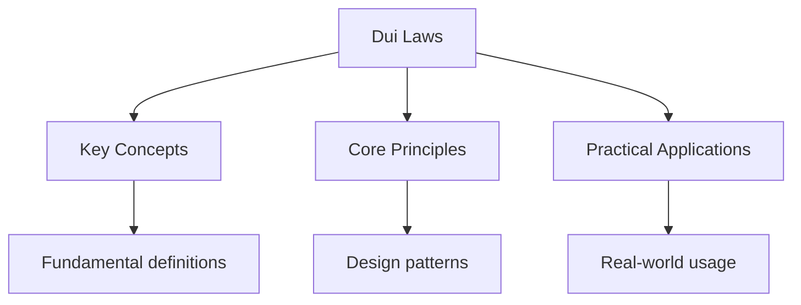

## Overview

Driving Under the Influence (DUI) and Driving While Intoxicated (DWI) are
serious criminal offences in all US states. The legal blood alcohol
concentration (BAC) limit for drivers aged 21 and over is 0.08% in all
states. Lower limits apply to commercial drivers (0.04%) and drivers under
21 (varies by state, typically 0.00-0.02%).

## Blood Alcohol Concentration

### BAC Levels and Effects

| BAC Level | Effects |
|-----------|---------|
| 0.02% | Loss of coordination, difficulty steering |
| 0.05% | Reduced coordination, reduced ability to track moving objects, difficulty steering |
| 0.08% | Legal limit for driving; poor muscle coordination, impaired judgment |
| 0.10% | Clear deterioration of reaction time and control |
| 0.15% | Far less muscle control, major loss of balance |
| 0.20% | Confusion, blackout, complete loss of motor function |
| 0.30%+ | Onset of unconsciousness, death possible |

### Factors Affecting BAC

- Weight: Heavier people have lower BAC for the same amount of alcohol
- Gender: Women generally have higher BAC than men of the same weight
- Food: Eating before drinking slows alcohol absorption
- Medications: Some medications amplify alcohol's effects
- Time: The body processes about one standard drink per hour

## Implied Consent Laws

All states have implied consent laws, meaning that by driving on public
roads, you consent to a chemical test (breath, blood, or urine) if
lawfully arrested for DUI.

### Refusal Consequences

- Automatic license suspension (varies by state: 90 days to 3 years)
- Evidence of refusal can be used against you in court
- Refusal does not prevent prosecution for DUI

## Penalties

### First Offence

- Fines: $500-$10,000 (varies by state)
- License suspension: 90 days to 1 year
- Possible jail time: up to 6 months
- Possible community service
- Possible ignition interlock device

### Second Offence

- Higher fines: $1,000-$10,000
- Longer license suspension: 1-5 years
- Mandatory jail time: 30 days to 6 months
- Mandatory ignition interlock device
- Possible vehicle forfeiture

### Third and Subsequent Offences

- Felony charges in most states
- Significant prison time
- Permanent license revocation possible
- Vehicle forfeiture

## Zero Tolerance Laws

Drivers under 21 are subject to zero tolerance laws, meaning any detectable
BAC (typically 0.00-0.02%) results in automatic license suspension.

## Common Pitfalls

1. **Thinking you are safe to drive after "sleeping it off"**: Alcohol
   continues to be absorbed for 1-3 hours after drinking. Sleeping for a
   few hours may not reduce your BAC enough to drive safely.

2. **Assuming coffee or food sobers you up**: Nothing sobers you up except
   time. Coffee, food, and cold air do not reduce your BAC.

3. **Driving the day after heavy drinking**: A BAC of 0.08% at midnight may
   still be above the legal limit at 8 AM. Plan for a designated driver
   or alternative transportation.

## Summary

DUI/DWI laws prohibit driving with a BAC of 0.08% or higher (0.04% for
commercial drivers, 0.00-0.02% for drivers under 21). Implied consent laws
mean you consent to chemical testing when arrested. Penalties escalate
dramatically with each offence: first offence may include fines, license
suspension, and possible jail time; subsequent offences can result in felony
charges, prison, and permanent license revocation. Nothing sobers you up
except time -- approximately one standard drink per hour.

## Worked Examples

### Example 1: BAC Calculation

A 160-pound male drinks 3 beers in 2 hours.

**Analysis**: Each beer contains about 14 grams of alcohol. For a 160-pound
male, BAC rises approximately 0.015% per drink. After 3 beers: 0.045%.
After 2 hours of processing (about 0.015%/hour): 0.045% - 0.03% = 0.015%.

**Result**: Below the 0.08% limit, but still impaired. The "0.02% for
drivers under 21" rule would apply if the driver is under 21.

### Example 2: Refusal Scenario

You are arrested for DUI and asked to take a breath test. You refuse.

**Consequence**: Your license is automatically suspended for 90 days (first
refusal). The refusal can be used as evidence in court. You can still be
prosecuted for DUI based on field sobriety tests and officer observation.

## Cross-References

- [Traffic Rules](./traffic-rules.md) - General traffic laws
- [Right-of-Way](./right-of-way.md) - Intersection rules
- [Safe Driving](../safe-driving/defensive-driving.md) - Defensive driving

## Advanced Content

This section provides detailed coverage of advanced concepts, including full derivations, proofs, and extended examples.

### Derivations and Proofs

Complete mathematical derivations and proofs are provided where appropriate. Each step is explained to ensure understanding of the underlying reasoning.

### Extended Examples

Advanced examples demonstrate the application of concepts to complex problems. These examples go beyond standard exam questions to develop deeper understanding.

### Research Connections

This material connects to current research and advanced applications in the field. Understanding these connections provides context for the study material.

### Prerequisites

Ensure you have mastered the prerequisite material before attempting this advanced content.

## Advanced Content

This section provides detailed coverage of advanced concepts, including full derivations, proofs, and extended examples.

### Derivations and Proofs

Complete mathematical derivations and proofs are provided where appropriate. Each step is explained to ensure understanding of the underlying reasoning.

### Extended Examples

Advanced examples demonstrate the application of concepts to complex problems. These examples go beyond standard exam questions to develop deeper understanding.

### Research Connections

This material connects to current research and advanced applications in the field. Understanding these connections provides context for the study material.

### Prerequisites

Ensure you have mastered the prerequisite material before attempting this advanced content.

## Advanced Content

This section provides detailed coverage of advanced concepts, including full derivations, proofs, and extended examples.

### Derivations and Proofs

Complete mathematical derivations and proofs are provided where appropriate. Each step is explained to ensure understanding of the underlying reasoning.

### Extended Examples

Advanced examples demonstrate the application of concepts to complex problems. These examples go beyond standard exam questions to develop deeper understanding.

### Research Connections

This material connects to current research and advanced applications in the field. Understanding these connections provides context for the study material.

### Prerequisites

Ensure you have mastered the prerequisite material before attempting this advanced content.
