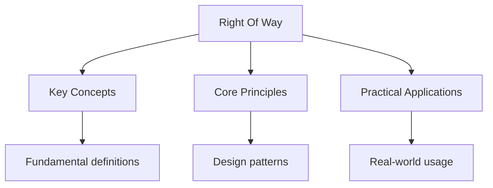

## Overview

Right-of-way rules determine who goes first at intersections, crosswalks, and
other traffic conflict points. Understanding these rules is critical for
preventing accidents and passing the driving test. The rules vary by situation
but follow consistent principles.

## Four-Way Stops

At a four-way stop, the first vehicle to arrive has the right of way. If two
vehicles arrive simultaneously, the vehicle on the right goes first. If two
vehicles arrive at the same time from opposite directions and one is turning
left, the vehicle going straight has the right of way.

### Key Rules

1. Come to a complete stop at the stop line or before entering the intersection
2. Look in all directions for other vehicles, pedestrians, and cyclists
3. Proceed only when it is your turn
4. Yield to pedestrians in crosswalks at all times

## Roundabouts

Roundabouts are circular intersections where traffic flows counter-clockwise.
Drivers entering the roundabout must yield to traffic already in the circle.

### Entering a Roundabout

1. Slow down as you approach
2. Yield to vehicles already in the roundabout
3. Enter when there is a safe gap in traffic
4. Stay in your lane until your exit
5. Signal your exit as you leave

## Pedestrian Crossings

Pedestrians have the right of way in marked crosswalks and at intersections
with traffic signals. Drivers must stop for pedestrians who have started
crossing, even if the signal changes.

### School Zones

- Reduced speed limits during posted hours
- Crossing guards have authority to stop traffic
- Double fines for violations in school zones
- Watch for children crossing at any time

## Emergency Vehicles

When you hear a siren or see flashing lights, you must yield the right of
way to emergency vehicles.

### What to Do

1. Pull over to the right edge of the road
2. Stop and remain stopped until the emergency vehicle passes
3. Do not block intersections
4. Do not follow an emergency vehicle closer than 500 feet

## Common Pitfalls

1. **Assuming you have right of way**: Right of way is given, not taken.
   Even if you have the right of way, you must yield if a collision is
   imminent. Defensive driving means being prepared to stop regardless.

2. **Confusing four-way stop rules**: Many drivers think "first to arrive,
   first to go" is the only rule. Simultaneous arrival requires the
   vehicle on the right to go first, and turning vehicles yield to those
   going straight.

3. **Forgetting to yield at roundabouts**: Entering traffic must yield to
   traffic already in the roundabout. This is the opposite of a four-way
   stop where the first arrival goes first.

## Summary

Right-of-way rules are based on the principle of predictability and safety.
At four-way stops, first to arrive goes first (or vehicle on the right for
simultaneous arrivals). At roundabouts, entering traffic yields. Pedestrians
always have the right of way in crosswalks. Emergency vehicles always have
priority. When in doubt, yield -- it is better to be cautious than to cause
an accident.

## Worked Examples

### Example 1: Four-Way Stop Scenario

You arrive at a four-way stop at the same time as a vehicle to your left.

**Rule**: The vehicle on the right goes first. The vehicle to your left must
yield to you.

**Action**: Check that the other vehicle is stopping, then proceed through
the intersection when it is safe.

### Example 2: Roundabout Entry

You approach a roundabout and see two vehicles already in the circle.

**Rule**: Yield to traffic already in the roundabout. Wait for a safe gap.

**Action**: Stop at the yield line, wait for both vehicles to pass, then enter
when clear.

## Cross-References

- [Traffic Rules](./traffic-rules.md) - General traffic laws
- [Signs](../signs/regulatory-signs.md) - Stop and yield signs
- [Safe Driving Tips](../safe-driving/safe-driving.md) - Defensive driving
