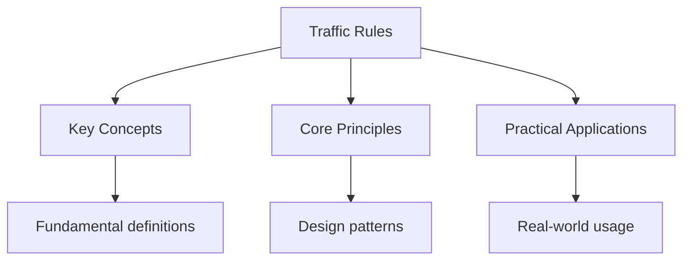

## Overview

Traffic rules are the laws that govern how vehicles operate on public roads.
They ensure safety, efficiency, and predictability for all road users.
Violating traffic rules can result in fines, points on your license, and
in serious cases, license suspension or revocation.

## Speed Laws

### Absolute Speed Limits

Most posted speed limits are absolute -- exceeding them by any amount is a
violation regardless of conditions.

- **Residential areas**: Typically 25 MPH
- **School zones**: Typically 15-25 MPH during posted hours
- **Highways**: Vary by state, typically 55-75 MPH
- **Construction zones**: Reduced limits with doubled fines

### Basic Speed Law

Even if you are driving below the posted limit, you can be cited if your
speed is not "reasonable and prudent" for conditions such as:

- Heavy rain, fog, or snow
- Dense traffic
- Road construction
- Limited visibility

## Lane Usage

### Lane Discipline

- Drive in the rightmost lane except when passing
- Left lane is for passing only (on multi-lane highways)
- Center lane is for left turns only (marked with yellow lines)
- Right lane is for entering and exiting highways

### Changing Lanes

1. Signal your intention at least 100 feet before changing lanes
2. Check mirrors and blind spots
3. Change lanes smoothly without disrupting traffic
4. Never cross a solid white line to change lanes

## Turning Rules

### Right Turns on Red

- Come to a complete stop before the stop line
- Yield to pedestrians and cross traffic
- Turn right only when safe
- Prohibited if a sign says "No Turn on Red"

### Left Turns

- Yield to oncoming traffic
- Turn into the nearest lane of the road you are entering
- Do not turn if a sign prohibits it
- Use the left turn lane when available

## Parking Rules

### Where You Can Park

- Parallel to the curb, within 12 inches of the curb
- In the direction of traffic flow
- At least 15 feet from fire hydrants
- At least 30 feet from crosswalks at intersections

### Where You Cannot Park

- In front of driveways
- On sidewalks
- In handicapped spaces without a permit
- Within 15 feet of a fire hydrant
- In construction zones
- On bridges or overpasses

## Common Pitfalls

1. **Assuming right-on-red is always legal**: Many intersections prohibit
   right turns on red. Always check for signs and signals before turning.

2. **Parking too close to hydrants**: The 15-foot rule is strictly enforced.
   Your vehicle may be towed if parked within 15 feet of a hydrant.

3. **Not signalling lane changes**: Failing to signal is a common citation.
   Signal at least 100 feet before changing lanes or turning.

## Summary

Traffic rules form the legal framework for safe road use. Key areas include
speed laws (absolute limits and basic speed law), lane usage (keep right
except to pass), turning rules (right-on-red with restrictions, yielding
for left turns), and parking regulations (12-inch curb rule, 15-foot hydrant
rule). Violating these rules can result in fines, points, and license
consequences.

## Worked Examples

### Example 1: Speed Limit in Rain

You are on a highway posted at 65 MPH. Heavy rain reduces visibility to
300 feet.

**Analysis**: Under the basic speed law, you must drive at a speed that is
reasonable for conditions. 65 MPH may be too fast for 300-foot visibility.
Reducing to 45-50 MPH is prudent.

**Legal implication**: You could be cited for violating the basic speed law
even though you are below the posted limit.

### Example 2: Parallel Parking

You need to park on a street with a fire hydrant.

**Rule**: You must park at least 15 feet from the fire hydrant.

**Action**: Measure the distance from the hydrant to your vehicle. If you
cannot park at least 15 feet away, find another spot. Your vehicle may be
towed if parked too close.

## Cross-References

- [Right-of-Way](./right-of-way.md) - Who goes first
- [Signs](../signs/regulatory-signs.md) - Traffic signs
- [Safe Driving](../safe-driving/safe-driving.md) - Defensive driving

## Advanced Content

This section provides detailed coverage of advanced concepts, including full derivations, proofs, and extended examples.

### Derivations and Proofs

Complete mathematical derivations and proofs are provided where appropriate. Each step is explained to ensure understanding of the underlying reasoning.

### Extended Examples

Advanced examples demonstrate the application of concepts to complex problems. These examples go beyond standard exam questions to develop deeper understanding.

### Research Connections

This material connects to current research and advanced applications in the field. Understanding these connections provides context for the study material.

### Prerequisites

Ensure you have mastered the prerequisite material before attempting this advanced content.

## Advanced Content

This section provides detailed coverage of advanced concepts, including full derivations, proofs, and extended examples.

### Derivations and Proofs

Complete mathematical derivations and proofs are provided where appropriate. Each step is explained to ensure understanding of the underlying reasoning.

### Extended Examples

Advanced examples demonstrate the application of concepts to complex problems. These examples go beyond standard exam questions to develop deeper understanding.

### Research Connections

This material connects to current research and advanced applications in the field. Understanding these connections provides context for the study material.

### Prerequisites

Ensure you have mastered the prerequisite material before attempting this advanced content.

## Advanced Content

This section provides detailed coverage of advanced concepts, including full derivations, proofs, and extended examples.

### Derivations and Proofs

Complete mathematical derivations and proofs are provided where appropriate. Each step is explained to ensure understanding of the underlying reasoning.

### Extended Examples

Advanced examples demonstrate the application of concepts to complex problems. These examples go beyond standard exam questions to develop deeper understanding.

### Research Connections

This material connects to current research and advanced applications in the field. Understanding these connections provides context for the study material.

### Prerequisites

Ensure you have mastered the prerequisite material before attempting this advanced content.
