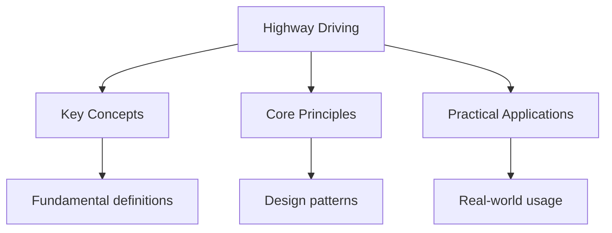

## Overview

Highway driving involves higher speeds, more complex lane dynamics, and
different rules than city driving. Understanding highway-specific rules
and techniques is essential for safe travel on interstates and freeways.

## Entering the Highway

### Acceleration Lane

1. Signal your intent to merge at least 100 feet before the acceleration lane
2. Match the speed of traffic in the lane you are entering
3. Check mirrors and blind spots
4. Merge when there is a safe gap
5. Do not stop on the acceleration lane unless traffic is completely stopped

### Merging Tips

- Use the entire acceleration lane to build speed
- Look for a gap in traffic, not at the vehicle directly beside you
- Signal early and merge smoothly
- Do not slow down or stop on the acceleration lane

## Exiting the Highway

### Exit Ramp

1. Signal at least 100 feet before the exit
2. Move to the right lane well before the exit
3. Reduce speed gradually on the exit ramp
4. Do not slow down on the highway before the exit

### Common Exit Mistakes

- Waiting until the last second to change lanes
- Slowing down on the highway before the exit
- Stopping on the exit ramp
- Crossing the gore area (painted triangular area)

## Lane Changes on the Highway

### Basic Rules

- Check mirrors before changing lanes
- Signal at least 100 feet before changing lanes
- Check blind spots
- Change lanes smoothly and gradually
- Do not cross solid white lines

### Multi-Lane Highways

- Right lane: Travel lane and entering/exiting
- Middle lanes: Travel and passing
- Left lane: Passing only (in most states)
- HOV lanes: Reserved for vehicles with multiple occupants

## Highway Etiquette

### Do Not

- Tailgate (follow too closely)
- Camp in the left lane
- Cut off other drivers
- Make sudden lane changes without signalling
- Slow down to look at accidents or incidents

### Do

- Maintain a 3-second following distance
- Use the left lane only for passing
- Signal all lane changes and exits
- Keep to the right except to pass
- Watch for merging traffic

## Emergency Situations

### Vehicle Breakdown

1. Pull over to the right shoulder (not the left lane)
2. Turn on hazard lights
3. Stay inside the vehicle with seatbelt on
4. Call for roadside assistance
5. Do not try to cross traffic to reach a phone

### Accident

1. Pull over to the right shoulder if possible
2. Turn on hazard lights
3. Check for injuries
4. Call 911
5. Exchange information with other drivers
6. Do not admit fault

## Common Pitfalls

1. **Camping in the left lane**: The left lane is for passing only. Staying
   in the left lane blocks faster traffic and is illegal in many states.

2. **Not using the acceleration lane**: Stopping on the acceleration lane
   is extremely dangerous. Use the entire lane to match traffic speed.

3. **Cutting off other drivers**: Changing lanes too close to another vehicle
   forces them to brake. Signal early and merge when there is a safe gap.

## Summary

Highway driving requires specific skills: using the acceleration lane to
match traffic speed, exiting via the right lane, signalling all lane changes,
and maintaining a 3-second following distance. The left lane is for passing
only. In emergencies, pull to the right shoulder, turn on hazards, and stay
inside the vehicle. Highway etiquette means not tailgating, not camping in
the left lane, and being predictable to other drivers.

## Worked Examples

### Example 1: Highway Entry

You approach a highway on-ramp. Traffic is moving at 65 MPH.

**Step 1**: Signal your intent to merge.
**Step 2**: Use the acceleration lane to reach 65 MPH.
**Step 3**: Check mirrors and blind spots for a gap.
**Step 4**: Merge when there is a safe gap, maintaining 65 MPH.

**Common mistake**: Slowing down on the acceleration lane because of traffic.
This is dangerous -- use the full lane to match speed.

### Example 2: Emergency on Highway

Your car overheats and begins steaming on the highway.

**Step 1**: Activate hazard lights immediately.
**Step 2**: Move to the right shoulder (not the left lane).
**Step 3**: Turn the steering wheel to the right (away from traffic).
**Step 4**: Stay inside with seatbelt on. Call roadside assistance.

**Critical**: Never exit the vehicle on a highway shoulder. Stay inside
with your seatbelt on until help arrives.

## Cross-References

- [Traffic Rules](../rules/traffic-rules) - Speed and lane rules
- [Defensive Driving](./defensive-driving) - Hazard perception
- [Signs](../signs/regulatory-signs) - Highway signs

## Advanced Content

This section provides detailed coverage of advanced concepts, including full derivations, proofs, and extended examples.

### Derivations and Proofs

Complete mathematical derivations and proofs are provided where appropriate. Each step is explained to ensure understanding of the underlying reasoning.

### Extended Examples

Advanced examples demonstrate the application of concepts to complex problems. These examples go beyond standard exam questions to develop deeper understanding.

### Research Connections

This material connects to current research and advanced applications in the field. Understanding these connections provides context for the study material.

### Prerequisites

Ensure you have mastered the prerequisite material before attempting this advanced content.
