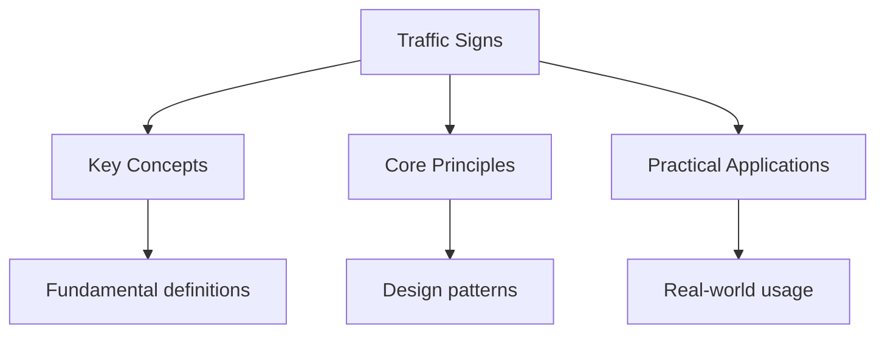

# US Traffic Signs

## Regulatory Signs

### Speed Limit Signs

- **Speed Limit**: Maximum speed allowed (white rectangle with black text)
- **Minimum Speed**: Minimum speed required (white rectangle with black text)
- **Speed Zone**: Speed limit zone ahead

### Prohibition Signs

- **No Entry**: Vehicles not permitted (red circle with white horizontal line)
- **No Right Turn**: Right turn prohibited (red circle with arrow)
- **No Left Turn**: Left turn prohibited (red circle with arrow)
- **No U-Turn**: U-turn prohibited (red circle with U-shaped arrow)
- **No Overtaking**: Overtaking prohibited (red circle with two cars)

### Mandatory Signs

- **Turn Left**: Must turn left (blue circle with arrow)
- **Turn Right**: Must turn right (blue circle with arrow)
- **Go Straight Only**: Must continue straight (blue circle with arrow)

## Warning Signs

### Road Layout

- **Sharp Bend**: Road curves sharply (yellow diamond with curved arrow)
- **Narrow Road**: Road becomes narrow (yellow diamond with road narrowing)
- **Traffic Lights**: Traffic signals ahead (yellow diamond with traffic light)
- **Pedestrian Crossing**: Crossing ahead (yellow diamond with pedestrian)

### Hazards

- **Slippery Road**: Road surface may be slippery (yellow diamond with car and wavy lines)
- **Road Works**: Construction ahead (yellow diamond with worker)
- **School Zone**: School zone ahead (yellow diamond with children)
- **Animal Crossing**: Animals may cross road (yellow diamond with deer)

## Information Signs

### Direction Signs

- **Interstate Signs**: Blue and red shields
- **US Highway Signs**: White shields
- **State Highway Signs**: Varies by state

### Service Signs

- **Hospital**: Blue square with H
- **Gas Station**: Blue square with gas pump
- **Food**: Blue square with fork and knife
- **Lodging**: Blue square with bed

## Common Exam Questions

1. What does a red octagon indicate?
   - Stop sign

2. What does a yellow diamond indicate?
   - Warning sign

3. What does a blue square indicate?
   - Information or service sign

4. What does a green rectangle indicate?
   - Direction or distance sign

## Practice Questions

### Question 1

What does this sign mean? (Speed Limit 55)

- Maximum speed of 55 mph
- Minimum speed of 55 mph
- Average speed of 55 mph
- End of speed limit

**Correct Answer:** Maximum speed of 55 mph

### Question 2

What does this sign mean? (Stop Sign)

- Slow down
- Stop completely
- Yield to traffic
- No entry

**Correct Answer:** Stop completely

## See Also

- [Written Test](./)
- [US Driving Test](..)

## Advanced Content

This section provides detailed coverage of advanced concepts, including full derivations, proofs, and extended examples.

### Derivations and Proofs

Complete mathematical derivations and proofs are provided where appropriate. Each step is explained to ensure understanding of the underlying reasoning.

### Extended Examples

Advanced examples demonstrate the application of concepts to complex problems. These examples go beyond standard exam questions to develop deeper understanding.

### Research Connections

This material connects to current research and advanced applications in the field. Understanding these connections provides context for the study material.

### Prerequisites

Ensure you have mastered the prerequisite material before attempting this advanced content.

## Advanced Content

This section provides detailed coverage of advanced concepts, including full derivations, proofs, and extended examples.

### Derivations and Proofs

Complete mathematical derivations and proofs are provided where appropriate. Each step is explained to ensure understanding of the underlying reasoning.

### Extended Examples

Advanced examples demonstrate the application of concepts to complex problems. These examples go beyond standard exam questions to develop deeper understanding.

### Research Connections

This material connects to current research and advanced applications in the field. Understanding these connections provides context for the study material.

### Prerequisites

Ensure you have mastered the prerequisite material before attempting this advanced content.

## Advanced Content

This section provides detailed coverage of advanced concepts, including full derivations, proofs, and extended examples.

### Derivations and Proofs

Complete mathematical derivations and proofs are provided where appropriate. Each step is explained to ensure understanding of the underlying reasoning.

### Extended Examples

Advanced examples demonstrate the application of concepts to complex problems. These examples go beyond standard exam questions to develop deeper understanding.

### Research Connections

This material connects to current research and advanced applications in the field. Understanding these connections provides context for the study material.

### Prerequisites

Ensure you have mastered the prerequisite material before attempting this advanced content.

## Advanced Content

This section provides detailed coverage of advanced concepts, including full derivations, proofs, and extended examples.

### Derivations and Proofs

Complete mathematical derivations and proofs are provided where appropriate. Each step is explained to ensure understanding of the underlying reasoning.

### Extended Examples

Advanced examples demonstrate the application of concepts to complex problems. These examples go beyond standard exam questions to develop deeper understanding.

### Research Connections

This material connects to current research and advanced applications in the field. Understanding these connections provides context for the study material.

### Prerequisites

Ensure you have mastered the prerequisite material before attempting this advanced content.

## Advanced Content

This section provides detailed coverage of advanced concepts, including full derivations, proofs, and extended examples.

### Derivations and Proofs

Complete mathematical derivations and proofs are provided where appropriate. Each step is explained to ensure understanding of the underlying reasoning.

### Extended Examples

Advanced examples demonstrate the application of concepts to complex problems. These examples go beyond standard exam questions to develop deeper understanding.

### Research Connections

This material connects to current research and advanced applications in the field. Understanding these connections provides context for the study material.

### Prerequisites

Ensure you have mastered the prerequisite material before attempting this advanced content.
