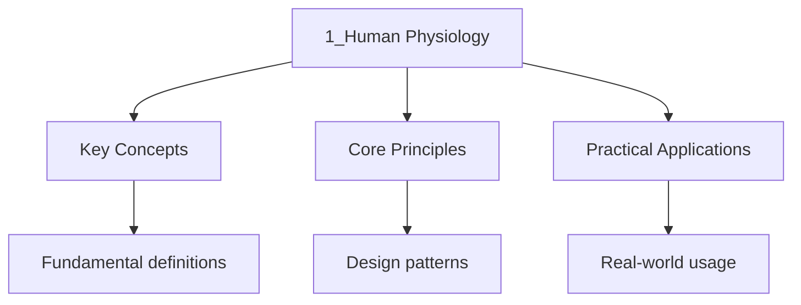

---

title: "Human Physiology | DSE - Wyatt's Notes"
description: "Study notes for Human Physiology with worked examples, practice problems, and key concepts for exam preparation."
date: 2026-04-08T00:00:00.000Z
tags: [DSE, Biology]
categories: [DSE, Biology]
---

<!-- Breadcrumb Schema for SEO -->

## Nutrition

### Balanced Diet

A balanced diet provides all essential nutrients in the correct proportions to maintain health. The
Seven classes of food are:

| Nutrient      | Function                                                                    | Sources                               |
| ------------- | --------------------------------------------------------------------------- | ------------------------------------- |
| Carbohydrates | Primary energy source; spare protein from being used as energy              | Rice, bread, pasta, potatoes          |
| Proteins      | Growth and repair of tissues; enzyme and hormone synthesis                  | Meat, fish, eggs, beans, milk         |
| Lipids        | Energy reserve; insulation; structural component of cell membranes          | Butter, oils, cheese, nuts            |
| Vitamins      | Regulate metabolic processes; prevent deficiency diseases                   | Fruits, vegetables, dairy             |
| Minerals      | Bone formation; nerve function; enzyme cofactors                            | Milk, spinach, meat, salt             |
| Water         | Solvent for biochemical reactions; transport medium; temperature regulation | Drinking water, food, metabolic water |
| Dietary fibre | Adds bulk to food; stimulates peristalsis; prevents constipation            | Whole grains, vegetables, fruits      |

### Energy Requirements

Basal Metabolic Rate (BMR) is the minimum energy required to maintain vital functions at rest. Total
Daily energy expenditure depends on:

$$\mathrm{Total Energy} = \mathrm{BMR} + \mathrm{Physical Activity} + \mathrm{SDA (Specific Dynamic Action)}$$

Average daily energy requirements:

| Group               | Energy (kJ/day) |
| ------------------- | --------------- |
| Sedentary adult     | 8000 - 10000    |
| Active adult male   | 12000 - 15000   |
| Active adult female | 10000 - 12000   |
| Growing teenager    | 10000 - 13000   |

### Worked Example: Energy Requirements

A 65 kg male office worker has a BMR of approximately 7000 kJ/day. His physical activity accounts
for 3000 kJ/day and SDA accounts for 1000 kJ/day.

(a) Calculate his total daily energy requirement.

(b) If he starts marathon training and his physical activity doubles, what is his new total energy
requirement?

(c) Explain why athletes often consume high-carbohydrate diets before competition.

Solution

(a)
$\mathrm{Total Energy} = \mathrm{BMR} + \mathrm{Physical Activity} + \mathrm{SDA} = 7000 + 3000 + 1000 = 11\,000 \mathrm{ kJ/day}$

(b) If physical activity doubles to 6000 kJ/day:
$\mathrm{Total Energy} = 7000 + 6000 + 1000 = 14\,000 \mathrm{ kJ/day}$. This is a 27% increase,
demonstrating that physical activity is a major component for active individuals.

(c) Carbohydrates are the primary energy source for exercise. A high-carbohydrate diet maximises
glycogen stores in muscles and the liver, providing readily available energy during prolonged
exercise. This spares protein from being broken down for energy, preserving muscle mass.
Carbohydrates also yield more energy per unit of oxygen consumed than fats, making them more
efficient during intense exercise.

### Malnutrition

**Undernutrition:** Insufficient intake of calories or specific nutrients.

| Deficiency            | Disease         | Symptoms                                |
| --------------------- | --------------- | --------------------------------------- |
| Protein-energy        | Kwashiorkor     | Swollen abdomen, oedema, poor growth    |
| Protein-energy        | Marasmus        | Severe weight loss, muscle wasting      |
| Vitamin A             | Night blindness | Inability to see in low light           |
| Vitamin C             | Scurvy          | Bleeding gums, poor wound healing       |
| Vitamin D             | Rickets         | Soft, deformed bones                    |
| Iron                  | Anaemia         | Fatigue, pale skin, shortness of breath |
| Iodine                | Goitre          | Enlarged thyroid gland                  |
| Calcium               | Osteoporosis    | Weak, brittle bones                     |
| Vitamin B1 (thiamine) | Beri-beri       | Nerve damage, muscle weakness           |

**Overnutrition:** Excessive intake leading to obesity, cardiovascular disease, Type 2 diabetes.

---

<!-- Breadcrumb Schema for SEO -->

## The Digestive System

### Overview of the Digestive Tract

The digestive system is a muscular tube running from mouth to anus, with accessory glands (salivary
Glands, liver, pancreas) secreting enzymes into the tract.

| Region          | Major Functions                                                       |
| --------------- | --------------------------------------------------------------------- |
| Mouth           | Mechanical digestion (chewing); chemical digestion (salivary amylase) |
| Oesophagus      | Peristalsis moves food to stomach                                     |
| Stomach         | Protein digestion (pepsin); churning; acid kills bacteria             |
| Small intestine | Complete digestion; absorption of nutrients into blood                |
| Large intestine | Water reabsorption; formation of faeces                               |
| Rectum          | Storage of faeces                                                     |
| Anus            | Expulsion of faeces                                                   |

### The Mouth

**Mechanical digestion:**

- Teeth cut, tear, and grind food into smaller pieces (increases surface area)
- Tongue manipulates food and mixes it with saliva

**Chemical digestion:**

- Salivary glands produce saliva containing:
- **Salivary amylase:** Breaks down starch into maltose (optimal pH ~6.8)
- **Mucus:** Lubricates food for swallowing
- **Water:** Dissolves food molecules for taste

$$\mathrm{Starch} \xrightarrow{\mathrm{salivary amylase}} \mathrm{Maltose}$$

### The Stomach

- **Gastric glands** in the stomach wall secrete gastric juice containing:
- **Hydrochloric acid (HCl):** pH ~2; denatures proteins; activates pepsinogen to pepsin; kills
  bacteria
- **Pepsinogen:** Inactive precursor; activated to **pepsin** by HCl; digests protein into
  polypeptides
- **Mucus:** Protects the stomach lining from acid and enzymes

$$\mathrm{Proteins} \xrightarrow{\mathrm{pepsin (pH 2)}} \mathrm{Polypeptides}$$

The stomach churns food with gastric juice to form **chyme**, a semi-liquid acidic mixture. The
Pyloric sphincter controls the release of chyme into the duodenum.

### The Small Intestine

The small intestine is the primary site of both digestion and absorption. It is divided into:

1. **Duodenum:** Where most digestion occurs; receives bile and pancreatic juice
2. **Jejunum and Ileum:** Where most absorption occurs

**Bile** (produced by the liver, stored in the gall bladder):

- Emulsifies fats -- breaks large fat droplets into smaller droplets (increases surface area for
  lipase)
- Contains no enzymes -- it is not a digestive enzyme
- Neutralises stomach acid (alkaline, pH ~8)
- Contains bile pigments (bilirubin from haemoglobin breakdown) excreted in faeces

**Pancreatic juice** (produced by the pancreas):

- **Pancreatic amylase:** Starch to maltose
- **Trypsin:** Proteins/polypeptides to smaller peptides
- **Lipase:** Fats to fatty acids and glycerol

**Intestinal enzymes** (produced by cells on the villi):

| Enzyme     | Substrate | Product(s)             |
| ---------- | --------- | ---------------------- |
| Maltase    | Maltose   | Glucose                |
| Sucrase    | Sucrose   | Glucose + Fructose     |
| Lactase    | Lactose   | Glucose + Galactose    |
| Peptidases | Peptides  | Amino acids            |
| Lipase     | Fats      | Fatty acids + Glycerol |

### Summary of Enzyme Digestion

| Enzyme             | Source          | Substrate | Product(s)             | Optimal pH |
| ------------------ | --------------- | --------- | ---------------------- | ---------- |
| Salivary amylase   | Salivary glands | Starch    | Maltose                | ~6.8       |
| Pepsin             | Stomach         | Protein   | Polypeptides           | ~2         |
| Pancreatic amylase | Pancreas        | Starch    | Maltose                | ~7-8       |
| Trypsin            | Pancreas        | Protein   | Peptides               | ~8         |
| Lipase             | Pancreas        | Lipids    | Fatty acids + Glycerol | ~8         |
| Maltase            | Small intestine | Maltose   | Glucose                | ~7-8       |
| Sucrase            | Small intestine | Sucrose   | Glucose + Fructose     | ~7-8       |
| Lactase            | Small intestine | Lactose   | Glucose + Galactose    | ~7-8       |

### Worked Example: Enzyme Digestion Pathway

A student eats a meal containing starch, protein, and fat. Trace the complete digestion of each
nutrient from the mouth to the small intestine, naming the enzyme(s), substrate(s), and product(s)
at each stage.

Solution

**Starch digestion:**

1. Mouth: Salivary amylase breaks down starch into maltose (pH ~6.8)
2. Stomach: No further starch digestion (acidic pH denatures salivary amylase)
3. Small intestine (duodenum): Pancreatic amylase breaks down remaining starch into maltose (pH
   ~7-8)
4. Small intestine (ileum): Maltase breaks down maltose into glucose

**Protein digestion:**

1. Mouth: No protein digestion
2. Stomach: Pepsin breaks down proteins into polypeptides (pH ~2; pepsinogen activated by HCl)
3. Small intestine (duodenum): Trypsin breaks down polypeptides into smaller peptides (pH ~8)
4. Small intestine (ileum): Peptidases break down peptides into amino acids

**Fat digestion:**

1. Mouth and stomach: No significant fat digestion
2. Small intestine (duodenum): Bile emulsifies fats into smaller droplets (physical, not enzymatic)
3. Small intestine (duodenum): Pancreatic lipase breaks down fats into fatty acids and glycerol

### Absorption

The small intestine is adapted for absorption through structural features:

**Villi:** Finger-like projections of the intestinal wall that increase surface area. Each villus
Contains:

- A dense network of blood capillaries (absorb glucose, amino acids -- carried to liver via hepatic
  portal vein)
- A lacteal (lymphatic capillary) that absorbs fatty acids and glycerol (re-formed into
  triglycerides, packaged into chylomicrons, transported via the lymphatic system)

**Microvilli:** Tiny projections on the epithelial cells of the villi, further increasing surface
Area.

**Features for efficient absorption:**

1. Large surface area (villi + microvilli)
2. Thin walls (single layer of epithelial cells)
3. Dense blood capillary network (maintains concentration gradient)
4. Lacteal for lipid absorption
5. Short diffusion distance

**Absorption mechanisms:**

- **Diffusion:** From high to low concentration (e.g., fatty acids, glycerol)
- **Facilitated diffusion:** Via carrier proteins (e.g., fructose)
- **Active transport:** Against concentration gradient, requires ATP (e.g., glucose, amino acids)
- **Co-transport:** Na$^+$ gradient drives glucose/amino acid uptake via SGLT1 transporter

### The Large Intestine

- **Colon:** Absorbs water and mineral ions from remaining indigestible material
- **Caecum/Appendix:** Vestigial in humans; contains gut bacteria that synthesise some vitamins
  (e.g., vitamin K, some B vitamins)
- **Rectum:** Stores faeces until defaecation

### Egestion

Faeces consist of undigested food (mainly dietary fibre), dead cells, bacteria, bile pigments, and
Water.

---

<!-- Breadcrumb Schema for SEO -->

## Gas Exchange

### Structure of the Human Respiratory System

| Structure           | Function                                                                            |
| ------------------- | ----------------------------------------------------------------------------------- |
| Nasal cavity        | Warms, moistens, and filters air; lined with mucus and ciliated epithelium          |
| Trachea             | Carries air to and from lungs; C-shaped cartilage rings keep it open                |
| Bronchi             | Branches of the trachea leading to each lung; also contain cartilage                |
| Bronchioles         | Smaller branches within the lungs; walls contain smooth muscle                      |
| Alveoli             | Tiny air sacs; site of gas exchange; surrounded by capillaries                      |
| Diaphragm           | Dome-shaped muscle; contracts and flattens during inhalation                        |
| Intercostal muscles | Muscles between ribs; external intercostals aid inhalation, internal aid exhalation |
| Ribcage             | Protects the lungs; moves up and out during inhalation                              |

### Ventilation Mechanism

**Inhalation (inspiration):**

1. External intercostal muscles contract
2. Ribs move up and out
3. Diaphragm contracts and flattens
4. Volume of thorax increases
5. Pressure in lungs decreases below atmospheric pressure
6. Air rushes in

$$P_{\mathrm{lung}} \lt P_{\mathrm{atm}} \implies \mathrm{air flows in}$$

**Exhalation (expiration) -- at rest (passive):**

1. External intercostal muscles relax
2. Ribs move down and in
3. Diaphragm relaxes and returns to dome shape
4. Volume of thorax decreases
5. Pressure in lungs increases above atmospheric pressure
6. Air is pushed out

$$P_{\mathrm{lung}} \gt P_{\mathrm{atm}} \implies \mathrm{air flows out}$$

**Forced exhalation:** Internal intercostal muscles and abdominal muscles contract actively.

### Gas Exchange in the Alveoli

**Features of alveoli adapted for efficient gas exchange:**

1. **Large surface area:** Millions of alveoli provide enormous total surface area (~70 m$^2$)
2. **Thin walls:** Alveolar epithelium is one cell thick
3. **Dense capillary network:** Each alveolus surrounded by capillaries; capillary walls are also
   one cell thick
4. **Short diffusion path:** Total distance between air and blood is ~1 micrometre
5. **Moist surface:** Gases dissolve before diffusing; moisture maintains the diffusion gradient
6. **Maintained concentration gradient:** Continuous blood flow and ventilation refresh the gradient

**Diffusion of gases:**

$$\mathrm{O}_2 \mathrm{ (alveolar air, } pO_2 \approx 13.3 \mathrm{ kPa)} \to \mathrm{O}_2 \mathrm{ (blood, } pO_2 \approx 5.3 \mathrm{ kPa)}$$

$$\mathrm{CO}_2 \mathrm{ (blood, } pCO_2 \approx 6.0 \mathrm{ kPa)} \to \mathrm{CO}_2 \mathrm{ (alveolar air, } pCO_2 \approx 5.3 \mathrm{ kPa)}$$

Oxygen diffuses from alveolar air into the blood; carbon dioxide diffuses from blood into alveolar
Air. Both movements are down their respective partial pressure gradients.

### Respiratory Diseases

**Asthma:**

- Inflammation and constriction of bronchioles
- Excess mucus production
- Symptoms: wheezing, shortness of breath, coughing
- Triggers: allergens, exercise, cold air, stress
- Treatment: bronchodilator inhalers (relax smooth muscle), steroid inhalers (reduce inflammation)

**Chronic Obstructive Pulmonary Disease (COPD):**

- Includes chronic bronchitis and emphysema
- Chronic bronchitis: inflammation and mucus hypersecretion in bronchi; "smoker"s cough"
- Emphysema: destruction of alveolar walls; reduced surface area for gas exchange; loss of
  elasticity
- Symptoms: persistent cough, breathlessness, fatigue
- Primary cause: smoking

**Tuberculosis (TB):**

- Caused by bacterium _Mycobacterium tuberculosis_
- Transmitted by droplet infection
- Infected lung tissue is destroyed by white blood cells, forming cavities
- Symptoms: persistent cough, blood-tinged sputum, weight loss, night sweats
- Treatment: long-term antibiotics (6-9 months)

**Lung cancer:**

- Uncontrolled cell division in lung tissue
- Strongly linked to smoking (carcinogens in tar)
- Symptoms: persistent cough, coughing up blood, chest pain, weight loss
- Treatment: surgery, chemotherapy, radiotherapy

### Effects of Smoking

| Substance       | Effect                                                                      |
| --------------- | --------------------------------------------------------------------------- |
| Nicotine        | Addictive; increases heart rate and blood pressure; narrows blood vessels   |
| Tar             | Contains carcinogens; paralyses cilia; coats alveoli, reducing gas exchange |
| Carbon monoxide | Binds to haemoglobin with 250x affinity of O$_2$; reduces O$_2$ transport   |
| Smoke particles | Irritate airways; damage ciliated epithelium; cause chronic inflammation    |

Carbon monoxide reduces the oxygen-carrying capacity of blood because it binds to haemoglobin
Forming carboxyhaemoglobin, which is stable and does not readily release the CO.

---

<!-- Breadcrumb Schema for SEO -->

## Transport in Humans

### The Circulatory System

Humans have a **closed, double circulatory system**:

1. **Pulmonary circulation:** Right ventricle to lungs to left atrium (deoxygenated blood to lungs
   for gas exchange, then oxygenated blood returns)
2. **Systemic circulation:** Left ventricle to body to right atrium (oxygenated blood to tissues,
   deoxygenated blood returns)

### Structure of the Heart

The heart is a four-chambered muscular pump.

**Chambers:**

- **Right atrium:** Receives deoxygenated blood from the body via the vena cava
- **Right ventricle:** Pumps deoxygenated blood to the lungs via the pulmonary artery
- **Left atrium:** Receives oxygenated blood from the lungs via the pulmonary vein
- **Left ventricle:** Pumps oxygenated blood to the body via the aorta

**Valves:**

| Valve                   | Location                           | Function                          |
| ----------------------- | ---------------------------------- | --------------------------------- |
| Tricuspid valve         | Between right atrium and ventricle | Prevents backflow                 |
| Bicuspid (mitral) valve | Between left atrium and ventricle  | Prevents backflow                 |
| Semilunar valves        | In the pulmonary artery and aorta  | Prevents backflow into ventricles |

Valves open and close due to pressure differences. They ensure one-way blood flow.

**Why the left ventricle has a thicker wall:**

The left ventricle pumps blood to the entire body (systemic circulation) against high resistance, so
It needs to generate much higher pressure than the right ventricle, which only pumps blood to the
Nearby lungs (pulmonary circulation).

### Cardiac Cycle

1. **Atrial systole:** Atria contract; blood is forced through AV valves into ventricles
2. **Ventricular systole:** Ventricles contract; AV valves close ("lub" sound); semilunar valves
   open; blood is ejected into arteries
3. **Diastole:** Heart muscle relaxes; semilunar valves close ("dub" sound); blood flows into atria
   from veins

### Blood Vessels

| Feature        | Arteries                            | Veins                              | Capillaries                |
| -------------- | ----------------------------------- | ---------------------------------- | -------------------------- |
| Wall thickness | Thick (muscle + elastic tissue)     | Thin                               | One cell thick             |
| Lumen          | Narrow (relatively)                 | Wide (relatively)                  | Very narrow                |
| Valves         | None (except semilunar in heart)    | Present (prevent backflow)         | None                       |
| Blood pressure | High                                | Low                                | Very low                   |
| Blood flow     | Pulsatile                           | Steady                             | Slow                       |
| Direction      | Away from heart                     | Towards heart                      | Between arteries and veins |
| Tissue layers  | Thick smooth muscle, elastic fibres | Thin smooth muscle, elastic fibres | Endothelium only           |

### Blood Composition

Blood consists of:

1. **Plasma (55%):** Liquid portion containing water, dissolved substances (glucose, amino acids,
   urea, hormones), plasma proteins (albumin, fibrinogen, globulins)
2. **Red blood cells (erythrocytes, ~44%):** Transport oxygen via haemoglobin
3. **White blood cells (leucocytes, ~1%):** Defence against pathogens
4. **Platelets (thrombocytes, ~0.5%):** Blood clotting

**Red blood cells:**

- Biconcave disc shape: increases surface area to volume ratio for gas exchange
- No nucleus: more space for haemoglobin
- Contain haemoglobin: iron-containing protein that binds oxygen
- Flexible: can squeeze through narrow capillaries
- Produced in red bone marrow; destroyed in the spleen and liver (lifespan ~120 days)

**White blood cells:**

- **Phagocytes (neutrophils, macrophages):** Engulf and digest pathogens by phagocytosis
- **Lymphocytes:** Produce antibodies; recognise specific antigens

**Platelets:**

- Cell fragments (no nucleus) produced in bone marrow
- Involved in blood clotting:

1. Platelets accumulate at the wound site
2. Thromboplastin is released
3. Thromboplastin converts prothrombin to thrombin (with calcium ions)
4. Thrombin converts soluble fibrinogen to insoluble fibrin
5. Fibrin forms a mesh that traps red blood cells, forming a clot

### Blood Groups

Blood groups are determined by **antigens** on the surface of red blood cells and **antibodies** in
The plasma.

| Blood Group | Antigen on RBC | Antibody in Plasma | Can Donate To | Can Receive From |
| ----------- | -------------- | ------------------ | ------------- | ---------------- |
| A           | A              | Anti-B             | A, AB         | A, O             |
| B           | B              | Anti-A             | B, AB         | B, O             |
| AB          | A and B        | None               | AB            | A, B, AB, O      |
| O           | None           | Anti-A and Anti-B  | A, B, AB, O   | O                |

**Universal donor:** O (no antigens on RBC surface)

**Universal recipient:** AB (no antibodies in plasma)

**Rhesus factor (RhD):** An additional antigen. Rh+ individuals have the D antigen; Rh- do not. An
Rh- mother carrying an Rh+ foetus may produce anti-D antibodies during a second pregnancy
(haemolytic disease of the newborn).

### Worked Example: Blood Transfusion Compatibility

A hospital has the following blood supplies: 5 units of type A, 3 units of type B, 2 units of type
AB, and 8 units of type O. Three patients arrive simultaneously:

- Patient 1: Blood group A, needs 2 units
- Patient 2: Blood group B, needs 1 unit
- Patient 3: Blood group AB, needs 2 units

(a) Which blood types can each patient safely receive?

(b) Can all three patients be treated with the available supply? Justify your answer.

Solution

(a) Using the blood group compatibility rules:

- Patient 1 (blood group A, has anti-B antibodies): Can receive A or O (no foreign antigens to
  trigger anti-B)
- Patient 2 (blood group B, has anti-A antibodies): Can receive B or O (no foreign antigens to
  trigger anti-A)
- Patient 3 (blood group AB, has no antibodies): Can receive A, B, AB, or O (universal recipient)

(b) Patient 1 needs 2 units: use 2 units of type A (3 remaining). Patient 2 needs 1 unit: use 1 unit
of type B (2 remaining). Patient 3 needs 2 units: use 2 units of type AB (0 remaining). All patients
can be treated. Remaining supply: 3 units A, 2 units B, 0 units AB, 8 units O. Alternatively,
Patient 3 could receive O blood to conserve the limited AB supply.

### Haemoglobin and Oxygen Transport

Each haemoglobin molecule can carry up to 4 oxygen molecules:

$$\mathrm{Hb} + 4\mathrm{O}_2 \rightleftharpoons \mathrm{HbO}_8$$

In the lungs (high $pO_2$), oxygen binds to haemoglobin (loading). In the tissues (low $pO_2$),
Oxygen dissociates from haemoglobin (unloading).

### The Oxygen Dissociation Curve

The oxygen dissociation curve is an S-shaped (sigmoid) curve showing the relationship between the
Partial pressure of oxygen ($pO_2$) and the percentage saturation of haemoglobin.

$$\mathrm{Percentage saturation of Hb vs } pO_2$$

Key points:

- At high $pO_2$ (lungs): haemoglobin is nearly fully saturated (~97%)
- At low $pO_2$ (tissues): haemoglobin releases oxygen
- The steep part of the curve means small changes in $pO_2$ cause large changes in oxygen unloading

**Factors shifting the curve:**

| Factor                     | Effect             | Physiological significance                                    |
| -------------------------- | ------------------ | ------------------------------------------------------------- |
| High $pCO_2$ (Bohr effect) | Curve shifts right | More O$_2$ released to actively respiring tissues             |
| Low pH / high [H$^+$]      | Curve shifts right | More O$_2$ released in acidic conditions                      |
| High temperature           | Curve shifts right | More O$_2$ released to warm, active tissues                   |
| High 2,3-BPG concentration | Curve shifts right | More O$_2$ unloading (adaptation to altitude)                 |
| Fetal haemoglobin (HbF)    | Curve shifts left  | Higher affinity for O$_2$; extracts O$_2$ from maternal blood |

A **right shift** = lower affinity for O$_2$ = more O$_2$ released to tissues.

A **left shift** = higher affinity for O$_2$ = less O$_2$ released to tissues.

---

<!-- Breadcrumb Schema for SEO -->

## Excretion

### Excretion vs Egestion

- **Excretion:** Removal of metabolic waste products (e.g., CO$_2$Urea, excess water) from the body.
  This is distinct from egestion.
- **Egestion:** Removal of undigested food (faeces) from the body. Faeces have never been part of
  metabolism, so egestion is NOT excretion.

### The Kidney

**Structure:**

- Outer region: **cortex** (contains Bowman"s capsules, convoluted tubules)
- Inner region: **medulla** (contains loops of Henle, collecting ducts)
- Central cavity: **renal pelvis** (collects urine)
- **Ureter:** Carries urine from kidney to bladder
- **Bladder:** Stores urine
- **Urethra:** Releases urine from the body

### The Nephron

The nephron is the functional unit of the kidney. Each kidney contains approximately one million
Nephrons.

**Components:**

1. **Renal (Bowman's) capsule:** Cup-shaped structure surrounding the glomerulus
2. **Glomerulus:** Knot of capillaries inside the Bowman's capsule
3. **Proximal convoluted tubule (PCT):** Highly coiled tube after the capsule
4. **Loop of Henle:** U-shaped tube extending into the medulla
5. **Distal convoluted tubule (DCT):** Coiled tube in the cortex
6. **Collecting duct:** Receives fluid from several nephrons; passes through the medulla

### Ultrafiltration

Ultrafiltration occurs at the **glomerulus** and **Bowman's capsule**.

**Mechanism:**

- Blood enters the glomerulus via the **afferent arteriole** (wider) and leaves via the **efferent
  arteriole** (narrower)
- The narrower efferent arteriole creates **high hydrostatic pressure** in the glomerulus
- This pressure forces small molecules (water, glucose, amino acids, urea, ions) through the
  capillary wall and the podocytes of the Bowman's capsule into the capsular space
- Large molecules (proteins, blood cells) remain in the blood

**What is filtered:** Water, glucose, amino acids, urea, salts, vitamins (all small solutes)

**What is NOT filtered:** Large proteins, red blood cells, white blood cells, platelets

The filtrate produced is called **glomerular filtrate**, which is similar in composition to blood
Plasma minus proteins.

### Selective Reabsorption

As the filtrate passes along the nephron, useful substances are reabsorbed back into the blood.

**Proximal Convoluted Tubule (PCT):**

- **All glucose** is reabsorbed (by active transport and co-transport)
- **All amino acids** are reabsorbed (by active transport)
- **Most water** (by osmosis, following the reabsorption of solutes)
- **Most salts/ions** (Na$^+$K$^+$Cl$^-$) by active transport
- The PCT reabsorbs approximately **85% of the filtrate**

**Loop of Henle:**

- **Descending limb:** Permeable to water but not to salts. Water moves out by osmosis into the
  increasingly concentrated medullary tissue fluid.
- **Ascending limb:** Impermeable to water but actively transports Na$^+$ and Cl$^-$ out into the
  medullary tissue fluid. This creates a **sodium gradient** in the medulla.
- The counter-current multiplier mechanism maintains a high solute concentration in the medulla,
  which is essential for water reabsorption from the collecting duct.

**Distal Convoluted Tubule (DCT):**

- Selective reabsorption of ions (Na$^+$K$^+$Ca$^{2+}$) regulated by hormones
- Water permeability controlled by ADH

**Collecting duct:**

- Water reabsorption controlled by **antidiuretic hormone (ADH)**
- In the presence of ADH, the collecting duct becomes more permeable to water, and water is
  reabsorbed into the concentrated medullary tissue fluid by osmosis
- Produces concentrated urine (small volume)

### Osmoregulation

Osmoregulation is the control of water balance in the body.

**Mechanism (negative feedback):**

1. Blood water potential decreases (blood becomes more concentrated, e.g., after sweating or not
   drinking)
2. Osmoreceptors in the hypothalamus detect the decrease in water potential
3. The hypothalamus stimulates the posterior pituitary gland to release **more ADH** into the blood
4. ADH increases the permeability of the collecting duct to water (by inserting aquaporin channels)
5. More water is reabsorbed from the collecting duct into the blood
6. Urine becomes more concentrated and lower in volume
7. Blood water potential returns to normal; osmoreceptors are no longer stimulated; ADH secretion
   decreases

| Condition          | Blood Water Potential | ADH Level | Urine Volume | Urine Concentration |
| ------------------ | --------------------- | --------- | ------------ | ------------------- |
| Dehydrated         | Low                   | High      | Low          | High                |
| Well hydrated      | Normal                | Normal    | Normal       | Normal              |
| Drunk excess water | High                  | Low       | High         | Low                 |

### Worked Example: Osmoregulation and ADH

A person drinks 2 litres of water within 30 minutes on a hot day after exercising. Describe the
sequence of physiological events that restores their blood water potential to normal.

Solution

1. Drinking 2 litres of water increases blood water potential (blood becomes more dilute)
2. Osmoreceptors in the hypothalamus detect the increase in blood water potential
3. The hypothalamus reduces its stimulation of the posterior pituitary gland
4. Less ADH is released into the blood; ADH level decreases
5. The collecting duct walls become less permeable to water (fewer aquaporin channels)
6. Less water is reabsorbed from the collecting duct into the blood
7. A large volume of dilute urine is produced (high volume, low concentration)
8. Excess water is excreted, and blood water potential gradually returns to normal
9. Once normal, osmoreceptors detect the restored water potential and ADH secretion returns to
   baseline

Note: On a hot day after exercise, the person would also have lost water through sweating. This
means the initial blood water potential may not have been as high as expected, and the
osmoregulatory response would be moderated. The kidneys cannot excrete water faster than
approximately 1 litre per hour, so drinking 2 litres in 30 minutes exceeds the maximum excretion
rate.

---

<!-- Breadcrumb Schema for SEO -->

## Nervous Coordination

### The Nervous System

The nervous system has two main divisions:

1. **Central Nervous System (CNS):** Brain and spinal cord -- processes information and coordinates
   responses
2. **Peripheral Nervous System (PNS):** All nerves outside the CNS -- transmits signals between the
   CNS and the rest of the body

The PNS is further divided into:

- **Somatic nervous system:** Controls voluntary actions (conscious)
- **Autonomic nervous system:** Controls involuntary actions (unconscious)
- **Sympathetic:** "Fight or flight" -- increases heart rate, dilates pupils, inhibits digestion
- **Parasympathetic:** "Rest and digest" -- decreases heart rate, constricts pupils, stimulates
  digestion

### Neurons

Neurons are specialised cells that transmit electrical impulses.

| Type           | Structure                       | Function                                  |
| -------------- | ------------------------------- | ----------------------------------------- |
| Sensory neuron | Long axon, cell body off-centre | Transmits impulses from receptors to CNS  |
| Relay neuron   | Short axon, many dendrites      | Connects sensory and motor neurons in CNS |
| Motor neuron   | Long axon, cell body in CNS     | Transmits impulses from CNS to effectors  |

**Structure of a motor neuron:**

- **Cell body:** Contains nucleus and organelles
- **Dendrites:** Receive impulses from other neurons
- **Axon:** Long fibre that carries impulses away from the cell body; insulated by **myelin sheath**
  (made by Schwann cells)
- **Myelin sheath:** Fatty layer that insulates the axon; allows saltatory conduction (impulses jump
  between Nodes of Ranvier), increasing the speed of transmission
- **Nodes of Ranvier:** Gaps in the myelin sheath where action potentials are regenerated
- **Motor end plates:** Connections to muscle fibres at the neuromuscular junction

### Nerve Impulses

**Resting potential:** The inside of the neuron is negatively charged relative to the outside (~-70
MV). This is maintained by the sodium-potassium pump (pumps 3 Na$^+$ out for every 2 K$^+$ in) and
The permeability of the membrane to K$^+$.

**Action potential:**

1. Stimulus causes voltage-gated Na$^+$ channels to open
2. Na$^+$ rushes in, depolarising the membrane (inside becomes positive, ~+40 mV)
3. Voltage-gated K$^+$ channels open
4. K$^+$ rushes out, repolarising the membrane
5. The Na$^+/K^+$ pump restores the resting potential (refractory period)

**Propagation:** The action potential travels along the axon. In myelinated neurons, it jumps
Between Nodes of Ranvier (saltatory conduction), which is faster than continuous conduction in
Unmyelinated neurons.

### Synapses

A synapse is the junction between two neurons or between a neuron and an effector.

**Structure:**

- **Pre-synaptic neuron:** Terminal knob containing synaptic vesicles filled with neurotransmitter
- **Synaptic cleft:** Gap (~20 nm) between the two neurons
- **Post-synaptic neuron:** Membrane contains receptor proteins specific to the neurotransmitter

**Transmission across a synapse:**

1. Action potential arrives at the pre-synaptic terminal
2. Voltage-gated Ca$^{2+}$ channels open; Ca$^{2+}$ enters the terminal
3. Ca$^{2+}$ causes synaptic vesicles to fuse with the pre-synaptic membrane and release
   neurotransmitter into the synaptic cleft (exocytosis)
4. Neurotransmitter diffuses across the synaptic cleft
5. Neurotransmitter binds to specific receptors on the post-synaptic membrane
6. This triggers ion channels to open, generating a new action potential in the post-synaptic neuron
7. The neurotransmitter is broken down by enzymes or reabsorbed (taken up by the pre-synaptic
   neuron)

**Key properties of synapses:**

- **Unidirectional:** Impulses travel in one direction only (pre- to post-synaptic)
- **Slow:** Transmission is slower than along an axon (diffusion takes time)
- **Summation:** Multiple impulses may be needed to trigger an action potential (spatial summation
  from multiple neurons; temporal summation from rapid firing of one neuron)
- **Inhibition:** Some neurotransmitters are inhibitory (e.g., GABA), making the post-synaptic
  neuron less likely to fire

### Reflex Arc

A reflex arc is the pathway taken by nerve impulses in an automatic, involuntary response (reflex).

**Components:**

1. **Receptor:** Detects the stimulus
2. **Sensory neuron:** Transmits impulse to the CNS
3. **Relay neuron:** In the spinal cord (or brain); connects sensory to motor neuron
4. **Motor neuron:** Transmits impulse from CNS to effector
5. **Effector:** Muscle or gland that produces the response

**Example: Withdrawal reflex**

- Touch a hot object
- Pain receptors in the skin detect heat
- Sensory neuron transmits impulse to the spinal cord
- Relay neuron passes impulse to motor neuron
- Motor neuron stimulates biceps to contract (withdraw hand) and triceps to relax
- The action is involuntary and rapid; the brain is informed afterwards

---

<!-- Breadcrumb Schema for SEO -->

## Sense Organs

### The Eye

**Structure:**

| Part                 | Function                                                                 |
| -------------------- | ------------------------------------------------------------------------ |
| Sclera               | Tough, white outer layer; protects the eye                               |
| Cornea               | Transparent front part; refracts light                                   |
| Iris                 | Coloured part; controls the size of the pupil                            |
| Pupil                | Hole in the iris; allows light to enter                                  |
| Lens                 | Focuses light onto the retina; changes shape for accommodation           |
| Retina               | Light-sensitive layer; contains rods and cones; photoreceptors           |
| Fovea                | Area of sharpest vision; highest concentration of cones                  |
| Optic nerve          | Transmits electrical impulses to the brain                               |
| Blind spot           | Where the optic nerve leaves the eye; no photoreceptors                  |
| Conjunctiva          | Thin membrane covering the front of the sclera; protects the eye         |
| Aqueous humour       | Watery fluid between cornea and lens; maintains pressure, refracts light |
| Vitreous humour      | Jelly-like fluid behind the lens; maintains the shape of the eye         |
| Ciliary body         | Contains ciliary muscles; attaches suspensory ligaments to the lens      |
| Suspensory ligaments | Hold the lens in position; connect lens to ciliary body                  |

### Accommodation

Accommodation is the process of changing the shape of the lens to focus on objects at different
Distances.

**Focusing on a distant object:**

1. Light rays from a distant object are nearly parallel
2. Ciliary muscles relax
3. Suspensory ligaments are pulled taut
4. Lens becomes thin (less curved)
5. Light is focused on the retina

**Focusing on a near object:**

1. Light rays from a near object are diverging
2. Ciliary muscles contract
3. Suspensory ligaments slacken
4. Lens becomes fat (more curved, more powerful refraction)
5. Light is focused on the retina

### Photoreceptors

| Feature       | Rods                                | Cones                               |
| ------------- | ----------------------------------- | ----------------------------------- |
| Sensitivity   | High (work in dim light)            | Low (work in bright light)          |
| Colour        | Cannot distinguish colour           | Distinguish red, green, blue        |
| Visual acuity | Low (many rods share one neuron)    | High (one cone per neuron in fovea) |
| Distribution  | Concentrated at periphery of retina | Concentrated at fovea               |
| Pigment       | Rhodopsin                           | Iodopsin (three types)              |

### The Ear

**Structure:**

| Part                       | Function                                                              |
| -------------------------- | --------------------------------------------------------------------- |
| Pinna (auricle)            | Collects and directs sound waves into the ear canal                   |
| Ear canal (auditory canal) | Directs sound waves to the eardrum                                    |
| Eardrum (tympanum)         | Thin membrane that vibrates when sound waves hit it                   |
| Ossicles                   | Three tiny bones (malleus, incus, stapes) that amplify vibrations     |
| Oval window                | Transmits vibrations from ossicles to the cochlea                     |
| Cochlea                    | Fluid-filled spiral structure containing hair cells (sound receptors) |
| Round window               | Releases pressure from the cochlear fluid                             |
| Auditory nerve             | Transmits impulses from cochlea to the brain                          |
| Semicircular canals        | Detect rotational movement (balance)                                  |
| Eustachian tube            | Connects middle ear to throat; equalises pressure                     |

### Hearing Mechanism

1. Sound waves are collected by the pinna and directed along the ear canal
2. Sound waves cause the eardrum to vibrate
3. Vibrations are transmitted and amplified by the ossicles (malleus, incus, stapes)
4. The stapes pushes against the oval window, creating pressure waves in the cochlear fluid
5. Pressure waves cause the basilar membrane in the cochlea to vibrate
6. Hair cells on the basilar membrane are bent, generating nerve impulses
7. Impulses travel along the auditory nerve to the brain, where sound is interpreted
8. The round window allows the cochlear fluid to dissipate the pressure waves

### Skin Receptors

The skin contains various sensory receptors:

| Receptor Type      | Detected Stimulus      |
| ------------------ | ---------------------- |
| Pain receptors     | Pain, tissue damage    |
| Thermoreceptors    | Temperature changes    |
| Pressure receptors | Pressure, touch        |
| Mechanoreceptors   | Mechanical deformation |

---

<!-- Breadcrumb Schema for SEO -->

## Hormonal Coordination

### The Endocrine System

The endocrine system consists of endocrine glands that secrete **hormones** directly into the
Bloodstream. Hormones are chemical messengers that travel in the blood to target organs.

### Comparison: Nervous vs Hormonal Coordination

| Feature      | Nervous System                      | Endocrine System                      |
| ------------ | ----------------------------------- | ------------------------------------- |
| Speed        | Very fast (milliseconds)            | Slower (seconds to hours to days)     |
| Duration     | Short-lived                         | Longer-lasting                        |
| Transmission | Electrical impulses along neurons   | Chemical (hormones in blood)          |
| Target       | Specific effectors (muscles/glands) | Target organs with specific receptors |
| Pathway      | Along neurones via synapses         | Via bloodstream                       |
| Example      | Reflex arc                          | Blood glucose regulation              |

### Major Endocrine Glands and Hormones

| Gland                           | Hormone(s)              | Function                                                 |
| ------------------------------- | ----------------------- | -------------------------------------------------------- |
| Hypothalamus                    | Releasing hormones, ADH | Controls pituitary gland; regulates water balance        |
| Pituitary (anterior)            | FSH, LH, TSH, ACTH, GH  | Controls other glands; growth; reproductive cycle        |
| Pituitary (posterior)           | ADH, oxytocin           | Water reabsorption; uterine contractions during labour   |
| Thyroid                         | Thyroxine               | Regulates basal metabolic rate; growth and development   |
| Adrenal cortex                  | Cortisol, aldosterone   | Stress response; regulates Na$^+$ and water balance      |
| Adrenal medulla                 | Adrenaline              | "Fight or flight" response; increases heart rate and BP  |
| Pancreas (islets of Langerhans) | Insulin, glucagon       | Blood glucose regulation                                 |
| Ovaries                         | Oestrogen, progesterone | Female secondary sexual characteristics; menstrual cycle |
| Testes                          | Testosterone            | Male secondary sexual characteristics; sperm production  |

### Blood Glucose Regulation

Blood glucose concentration is normally maintained at approximately **90 mg/100 cm$^3$**.

**If blood glucose rises (e.g., after a meal):**

1. Detected by beta ($\beta$) cells in the islets of Langerhans (pancreas)
2. $\beta$ cells secrete more **insulin**
3. Insulin stimulates:

- Liver and muscle cells to take up glucose
- Conversion of glucose to glycogen (glycogenesis) in liver and muscles
- Increased rate of glucose respiration in cells

1. Blood glucose level decreases back to normal

**If blood glucose falls (e.g., between meals or during exercise):**

1. Detected by alpha ($\alpha$) cells in the islets of Langerhans (pancreas)
2. $\alpha$ cells secrete more **glucagon**
3. Glucagon stimulates:

- Conversion of glycogen to glucose (glycogenolysis) in the liver
- Conversion of amino acids and fats to glucose (gluconeogenesis) in the liver

1. Blood glucose level increases back to normal

This is an example of **negative feedback**.

### Worked Example: Blood Glucose Regulation

After a 12-hour fast, a student's blood glucose concentration is 85 mg/100 cm$^3$. They then drink a
solution containing 50 g of glucose. Describe the hormonal response over the next 3 hours.

Solution

**Immediately after drinking (0-30 minutes):**

- Glucose is absorbed from the small intestine into the blood
- Blood glucose concentration rises rapidly, exceeding the normal range of ~90 mg/100 cm$^3$
- Beta cells in the islets of Langerhans detect the elevated blood glucose
- Beta cells secrete more insulin; alpha cells secrete less glucagon

**30 minutes to 2 hours:**

- Insulin stimulates liver cells to take up glucose and convert it to glycogen (glycogenesis)
- Insulin stimulates muscle cells to take up glucose and convert it to glycogen
- Insulin increases the rate of glucose respiration in cells
- Blood glucose concentration decreases back towards normal
- As blood glucose falls, insulin secretion decreases (negative feedback)

**2-3 hours:**

- Blood glucose returns to approximately 90 mg/100 cm$^3$
- If it drops below normal, alpha cells detect this and secrete glucagon
- Glucagon stimulates the liver to convert glycogen back to glucose (glycogenolysis)
- Blood glucose is maintained within the normal range by this negative feedback mechanism

### Diabetes

**Type 1 Diabetes (insulin-dependent):**

- Autoimmune destruction of $\beta$ cells in the pancreas
- No insulin is produced
- develops in childhood
- Treated with insulin injections

**Type 2 Diabetes (non-insulin-dependent):**

- Body cells become less responsive to insulin (insulin resistance)
- $\beta$ cells may produce less insulin over time
- develops in adults; linked to obesity and lifestyle
- Treated with dietary control, exercise, and oral medication; insulin may be needed later

**Symptoms of diabetes:**

- High blood glucose concentration (hyperglycaemia)
- Glucose in urine (kidneys cannot reabsorb all glucose above the renal threshold of ~180 mg/100
  cm$^3$)
- Frequent urination (excess water follows glucose osmotically)
- Excessive thirst (dehydration from frequent urination)
- Weight loss (body breaks down fat and protein for energy)
- Fatigue

---

<!-- Breadcrumb Schema for SEO -->

## Human Reproduction

### Male Reproductive System

| Structure        | Function                                                                                   |
| ---------------- | ------------------------------------------------------------------------------------------ |
| Testes           | Produce sperm (in seminiferous tubules) and testosterone                                   |
| Scrotum          | Holds testes outside the body (2-3 degrees C below core temperature for sperm development) |
| Epididymis       | Stores and matures sperm                                                                   |
| Vas deferens     | Carries sperm from epididymis to urethra during ejaculation                                |
| Seminal vesicles | Produce seminal fluid (fructose for energy, prostaglandins)                                |
| Prostate gland   | Produces alkaline fluid (neutralises vaginal acidity)                                      |
| Urethra          | Passageway for both semen and urine                                                        |
| Penis            | Inserts semen into the vagina during intercourse                                           |

**Sperm structure:**

- **Head:** Contains the haploid nucleus (23 chromosomes) and the acrosome (contains enzymes to
  penetrate the egg)
- **Middle piece:** Packed with mitochondria to provide ATP for tail movement
- **Tail (flagellum):** Whiplash movement propels the sperm

### Female Reproductive System

| Structure                | Function                                                       |
| ------------------------ | -------------------------------------------------------------- |
| Ovaries                  | Produce ova (eggs) and hormones (oestrogen, progesterone)      |
| Oviduct (fallopian tube) | Carries the ovum from ovary to uterus; site of fertilisation   |
| Uterus                   | Implantation of embryo; development of foetus                  |
| Endometrium              | Lining of the uterus; thickens and is shed during menstruation |
| Cervix                   | Ring of muscle at the entrance to the uterus                   |
| Vagina                   | Receives the penis during intercourse; birth canal             |

### The Menstrual Cycle

The menstrual cycle is approximately 28 days and is controlled by four hormones:

1. **FSH (Follicle-Stimulating Hormone):** Produced by the anterior pituitary gland; stimulates the
   development of a follicle in the ovary; stimulates the ovaries to produce oestrogen
2. **Oestrogen:** Produced by the developing follicle; causes the endometrium to thicken; inhibits
   FSH production (negative feedback); stimulates LH release (positive feedback when level is high
   enough)
3. **LH (Luteinising Hormone):** Produced by the anterior pituitary gland; triggers ovulation (day
   14); stimulates the remains of the follicle to develop into the corpus luteum
4. **Progesterone:** Produced by the corpus luteum; maintains the thickened endometrium; inhibits
   FSH and LH production

| Day(s) | Event                                                                             |
| ------ | --------------------------------------------------------------------------------- |
| 1-5    | Menstruation: endometrium is shed (if no implantation occurs)                     |
| 1-13   | Follicular phase: follicle develops; oestrogen rises; endometrium thickens        |
| ~14    | Ovulation: LH surge causes the follicle to rupture; ovum is released              |
| 15-28  | Luteal phase: corpus luteum forms; progesterone rises; endometrium maintained     |
| 25-28  | If no implantation: corpus luteum degenerates; progesterone drops; cycle restarts |

### Fertilisation and Implantation

1. Sperm are deposited in the vagina during intercourse
2. Sperm swim through the cervix and uterus into the oviduct
3. One sperm penetrates the zona pellucida of the ovum (acrosome reaction)
4. The sperm nucleus fuses with the ovum nucleus -- **fertilisation** produces a zygote
5. The zygote divides by mitosis as it travels along the oviduct (forms a ball of cells called a
   morula, then a blastocyst)
6. The blastocyst implants into the thickened endometrium (~7 days after fertilisation)
7. The placenta forms, providing nutrients and gas exchange between mother and foetus

### Contraception

| Method                             | Mechanism                                                                        |
| ---------------------------------- | -------------------------------------------------------------------------------- |
| Condom                             | Physical barrier; prevents sperm reaching the ovum                               |
| Diaphragm/cap                      | Physical barrier over the cervix                                                 |
| Oral contraceptive pill (combined) | Contains oestrogen and progesterone; inhibits ovulation; thickens cervical mucus |
| Mini-pill                          | Progesterone only; thickens cervical mucus                                       |
| Intrauterine device (IUD)          | Prevents implantation; may also affect sperm                                     |
| Sterilisation                      | Surgical cutting/tying of vas deferens (male) or oviducts (female)               |
| Rhythm method                      | Avoiding intercourse during the fertile window                                   |
| Injection/implant                  | Slow-release progesterone; prevents ovulation                                    |

### Sexually Transmitted Diseases (STDs)

| Disease                    | Pathogen                                  | Symptoms                                                                   |
| -------------------------- | ----------------------------------------- | -------------------------------------------------------------------------- |
| HIV/AIDS                   | Human Immunodeficiency Virus (retrovirus) | Destroys helper T cells; immune system collapses; opportunistic infections |
| Syphilis                   | _Treponema pallidum_ (bacterium)          | Painless sores, rash, organ damage if untreated                            |
| Gonorrhoea                 | _Neisseria gonorrhoeae_ (bacterium)       | Painful urination, discharge; may cause infertility                        |
| Chlamydia                  | _Chlamydia trachomatis_ (bacterium)       | Often asymptomatic; can cause infertility                                  |
| HPV (Human Papillomavirus) | Virus                                     | Genital warts; linked to cervical cancer                                   |

**Prevention:** Use of condoms; vaccination (HPV); monogamy; regular testing.

---

<!-- Breadcrumb Schema for SEO -->

## Intuition

**A complex machine:** The human body is like a city — the heart is the pump, lungs are air filters, kidneys are water treatment plants, and the brain is city hall. Each organ system keeps the body functioning.

**Why it matters:** Understanding physiology helps you make informed health decisions and explains how lifestyle choices affect your body.

**The key insight:** Homeostasis — the body's ability to maintain internal stability — is the foundation of health. When homeostasis fails, disease occurs.

## Common Pitfalls

1. **Confusing excretion and egestion:** Egestion (removal of faeces) is not excretion. Faeces never
   entered the body's metabolic processes. CO$_2$ from respiration and urea from deamination are
   excretory products.

2. **Stating bile digests fat:** Bile emulsifies fat (physical breakdown into droplets). It does NOT
   chemically digest fat. Lipase digests fat.

3. **Mixing up ventilation pressures:** During inhalation, lung pressure is LOWER than atmospheric
   pressure. During exhalation, lung pressure is HIGHER. The volume-pressure relationship is inverse
   (Boyle's law).

4. **Saying veins carry deoxygenated blood:** The pulmonary vein carries oxygenated blood from the
   lungs to the heart. Always specify pulmonary vs systemic.

5. **Confusing osmoregulation direction:** High ADH means concentrated urine (less water excreted),
   not dilute urine. ADH promotes water reabsorption.

6. **Confusing antagonistic hormones:** Insulin LOWERS blood glucose. Glucagon RAISES blood glucose.
   Students often swap them.

7. **Mixing up sympathetic and parasympathetic:** Sympathetic = fight or flight (pupil dilation,
   heart rate up). Parasympathetic = rest and digest (pupil constriction, heart rate down).

8. **Forgetting that sensory neurons carry impulses TO the CNS:** The direction of impulse travel
   matters. Sensory: receptor to CNS. Motor: CNS to effector.

9. **Writing that the loop of Henle reabsorbs water in both limbs:** Only the descending limb is
   permeable to water. The ascending limb actively transports Na$^+$ and Cl$^-$ and is impermeable
   to water.

10. **Confusing the roles of FSH and LH:** FSH stimulates follicle development. LH triggers
    ovulation and maintains the corpus luteum. Do not swap them.

---

<!-- Breadcrumb Schema for SEO -->

## Problem Set

**Problem 1:** A student sets up an experiment to investigate the effect of pH on the activity of
salivary amylase. Test tubes containing starch solution and amylase are incubated at different pH
values. After 10 minutes, the presence of starch is tested with iodine solution.

| pH  | Starch remaining after 10 min |
| --- | ----------------------------- |
| 3   | ++++                          |
| 5   | ++                            |
| 7   | -                             |
| 9   | +                             |
| 11  | ++++                          |

(a) At which pH is amylase most active? Explain.

(b) Explain why starch remains at pH 3.

(c) If the temperature were raised to 80 degrees C at pH 7, what would happen to the results? Why?

If you get this wrong, revise: Digestive System -- The Mouth; Enzymes

Solution

(a) pH 7, because no starch remains after 10 minutes, indicating that amylase has completely broken
down the starch into maltose. This is close to the optimum pH of salivary amylase (~6.8).

(b) At pH 3, the enzyme is in a highly acidic environment far from its optimum pH. The extreme pH
alters the tertiary structure of the enzyme, changing the shape of the active site. The substrate
can no longer bind to the active site, so the enzyme is denatured and cannot catalyse the reaction.

(c) At 80 degrees C, the enzyme would be denatured by the high temperature. The increased kinetic
energy would break the bonds maintaining the tertiary structure of the protein, permanently altering
the active site shape. Starch would remain in all tubes because the enzyme can no longer function.

**Problem 2:** Explain how the structure of an alveolus is adapted for efficient gas exchange. Refer
to at least three structural features in your answer.

If you get this wrong, revise: Gas Exchange -- Gas Exchange in the Alveoli

Solution

1. **Large surface area:** Millions of alveoli in each lung provide a total surface area of
   approximately 70 m$^2$Maximising the area available for diffusion of O$_2$ and CO$_2$.

2. **Thin walls:** The alveolar epithelium is only one cell thick, and each alveolus is surrounded
   by a capillary wall that is also one cell thick. The total diffusion distance is approximately 1
   micrometre, minimising the distance gases must travel.

3. **Dense capillary network:** Each alveolus is surrounded by many capillaries. Continuous blood
   flow maintains a steep concentration gradient by removing oxygenated blood and bringing
   deoxygenated blood to the alveoli.

4. **Moist inner surface:** The lining of the alveoli is moist, allowing gases to dissolve before
   diffusing across the membrane.

**Problem 3:** A person produces 180 dm$^3$ of glomerular filtrate per day but only excretes 1.5
dm$^3$ of urine per day.

(a) Calculate the percentage of filtrate that is reabsorbed.

(b) Which part of the nephron is primarily responsible for this reabsorption? Explain the mechanism.

If you get this wrong, revise: Excretion -- Ultrafiltration; Selective Reabsorption

Solution

(a) Percentage reabsorbed =
$\frac{180 - 1.5}{180} \times 100 = \frac{178.5}{180} \times 100 = 99.2\%$

(b) The **proximal convoluted tubule (PCT)** is the primary site of reabsorption. It reabsorbs
approximately 85% of the glomerular filtrate, including all glucose (by active transport and
co-transport), all amino acids (by active transport), most water (by osmosis following solute
reabsorption), and most mineral ions (Na$^+$K$^+$Cl$^-$ by active transport). The loop of Henle,
DCT, and collecting duct provide further fine-tuning, with the collecting duct regulated by ADH.

**Problem 4:** A patient with blood group B requires a blood transfusion. Explain why blood group O
can be used but blood group A cannot.

If you get this wrong, revise: Transport in Humans -- Blood Groups

Solution

Blood group O red blood cells have no antigens (A or B) on their surface. When transfused into a
blood group B recipient, there are no foreign antigens for the recipient's anti-A antibodies to
attack. Therefore, the donor red blood cells will not be destroyed.

Blood group A red blood cells carry A antigens on their surface. The blood group B recipient has
anti-A antibodies in their plasma. When blood group A blood is transfused, the anti-A antibodies
will bind to the A antigens on the donor red blood cells, causing **agglutination** (clumping) of
the red blood cells. This blocks blood vessels and can be fatal.

**Problem 5:** Describe the roles of FSH, oestrogen, LH, and progesterone in the menstrual cycle.

If you get this wrong, revise: Human Reproduction -- The Menstrual Cycle

Solution

**FSH** (Follicle-Stimulating Hormone): Produced by the anterior pituitary gland; stimulates the
development of a follicle in the ovary; stimulates the follicle to produce oestrogen.

**Oestrogen:** Produced by the developing follicle; causes the endometrium to thicken; inhibits FSH
production (negative feedback) at low levels; at high levels around day 12-13, stimulates LH release
(positive feedback), triggering the LH surge.

**LH** (Luteinising Hormone): Produced by the anterior pituitary gland; surges around day 14 due to
positive feedback from high oestrogen; triggers ovulation (follicle ruptures, releasing the ovum);
stimulates the follicle remnant to develop into the corpus luteum.

**Progesterone:** Produced by the corpus luteum from day 15 onwards; maintains the thickened
endometrium; inhibits both FSH and LH production (negative feedback); if no implantation occurs, the
corpus luteum degenerates around day 25-28, progesterone drops, and menstruation begins.

**Problem 6:** A myelinated neuron has nodes of Ranvier spaced 1.5 mm apart. The action potential
travels at 120 m/s in myelinated regions. An equivalent unmyelinated neuron conducts at 0.5 m/s.
Compare the time for an impulse to travel 30 mm in each neuron.

If you get this wrong, revise: Nervous Coordination -- Nerve Impulses

Solution

**Myelinated neuron:** The action potential jumps between nodes of Ranvier (saltatory conduction).
Number of internodes = $30 / 1.5 = 20$. Time per internode =
$1.5 \times 10^{-3} / 120 = 12.5 \times 10^{-6}$ s. Total internode time =
$20 \times 12.5 \times 10^{-6} = 2.5 \times 10^{-4}$ s = 0.25 ms. The myelinated neuron is much
faster because saltatory conduction skips the membrane between nodes.

**Unmyelinated neuron:** Time = distance / speed = $30 \times 10^{-3} / 0.5 = 0.06$ s = 60 ms.

The myelinated neuron transmits the impulse approximately 240 times faster than the unmyelinated
neuron over this distance (60 ms vs ~0.25 ms). This demonstrates why myelination is critical for
rapid neural communication.

**Problem 7:** Explain why the oxygen dissociation curve shifts to the right during exercise. What
is the significance of this shift?

If you get this wrong, revise: Transport in Humans -- The Oxygen Dissociation Curve

Solution

During exercise, respiration rate increases, producing more CO$_2$ as a waste product. Increased
CO$_2$ raises blood $pCO_2$Which lowers blood pH (more H$^+$ ions from carbonic acid:
$\mathrm{CO}_2 + H_2O \rightleftharpoons H_2CO_3 \rightleftharpoons H^+ + HCO_3^-$). Muscle
temperature also rises due to increased metabolic activity.

These factors (high $pCO_2$Low pH, high temperature) cause the oxygen dissociation curve to shift to
the right (the Bohr effect). A rightward shift means that at any given $pO_2$Haemoglobin has a lower
affinity for oxygen and releases more oxygen to the tissues. This ensures that more oxygen is
unloaded precisely where and when it is needed most -- the actively respiring muscles.

**Problem 8:** A person with Type 1 diabetes has a fasting blood glucose level of 280 mg/100 cm$^3$.
The renal threshold for glucose is approximately 180 mg/100 cm$^3$.

(a) Explain why glucose is present in the urine.

(b) Explain why this person feels thirsty and produces large volumes of urine.

(c) How does insulin injection help to correct this condition?

If you get this wrong, revise: Hormonal Coordination -- Blood Glucose Regulation; Diabetes

Solution

(a) The blood glucose concentration (280 mg/100 cm$^3$) exceeds the renal threshold (180 mg/100
cm$^3$). The proximal convoluted tubule normally reabsorbs all glucose from the filtrate via carrier
proteins. However, when the blood glucose level exceeds the renal threshold, the carrier proteins
become saturated and cannot reabsorb all the glucose. The excess glucose remains in the filtrate and
is excreted in the urine (glycosuria).

(b) The excess glucose in the filtrate lowers the water potential of the tubule fluid. Less water is
reabsorbed from the nephron by osmosis, producing a large volume of dilute urine (polyuria). The
loss of excess water reduces blood volume and increases blood osmolarity, which is detected by
osmoreceptors in the hypothalamus, triggering thirst (polydipsia).

(c) Insulin injections increase the amount of insulin in the blood. Insulin stimulates cells
(especially liver and muscle cells) to take up glucose and convert it to glycogen. This lowers the
blood glucose concentration. When blood glucose drops below the renal threshold, the kidneys can
once again fully reabsorb all glucose, eliminating glucose from the urine and restoring normal water
reabsorption.

**Problem 9:** Explain why the left ventricle has a thicker muscular wall than the right ventricle,
and explain the role of valves in the heart.

If you get this wrong, revise: Transport in Humans -- Structure of the Heart; Cardiac Cycle

Solution

The left ventricle pumps oxygenated blood to the entire body through the systemic circulation. The
systemic circulation has a much larger network of blood vessels and much higher resistance than the
pulmonary circulation. To overcome this resistance and generate sufficient pressure, the left
ventricle needs a thicker, more muscular wall. The right ventricle only pumps deoxygenated blood to
the lungs via the shorter, lower-resistance pulmonary circuit, so its wall is thinner.

Heart valves ensure one-way blood flow. They open when the pressure behind them is greater than the
pressure in front, and close when the pressure gradient reverses. **AV valves** (tricuspid and
bicuspid) prevent backflow from ventricles into atria during ventricular systole ("lub" sound).
**Semilunar valves** (in the aorta and pulmonary artery) prevent backflow from arteries into
ventricles during diastole ("dub" sound).

**Problem 10:** Explain how a nerve impulse is transmitted across a synapse. Why is transmission in
one direction only?

If you get this wrong, revise: Nervous Coordination -- Synapses

Solution

1. An action potential arrives at the pre-synaptic terminal knob.
2. Depolarisation causes voltage-gated Ca$^{2+}$ channels to open; Ca$^{2+}$ diffuses into the
   terminal.
3. Ca$^{2+}$ causes synaptic vesicles to fuse with the pre-synaptic membrane, releasing
   neurotransmitter into the synaptic cleft (exocytosis).
4. The neurotransmitter diffuses across the synaptic cleft (~20 nm).
5. The neurotransmitter binds to specific receptor proteins on the post-synaptic membrane.
6. This binding causes ion channels to open. If excitatory neurotransmitters (e.g., acetylcholine)
   are released, Na$^+$ flows in, depolarising the post-synaptic membrane and potentially triggering
   a new action potential.
7. The neurotransmitter is quickly removed -- either broken down by enzymes (e.g.,
   acetylcholinesterase) or taken back up by the pre-synaptic neuron (reuptake).

**Unidirectional transmission** occurs because only the pre-synaptic terminal contains synaptic
vesicles, only the post-synaptic membrane has the specific receptor proteins, and Ca$^{2+}$ channels
(which trigger release) are only present on the pre-synaptic side.

---

<!-- Breadcrumb Schema for SEO -->

## The Digestive System in Detail

### Large Intestine (Colon)

The large intestine is approximately 1.5 metres long. Its primary functions are water reabsorption
and faeces formation.

| Region           | Function                                                                                      |
| ---------------- | --------------------------------------------------------------------------------------------- |
| Caecum           | Small pouch at the start; contains the appendix (no significant digestive function in humans) |
| Ascending colon  | Water reabsorption; movement of contents upwards by peristalsis                               |
| Transverse colon | Water reabsorption; movement of contents across the abdomen                                   |
| Descending colon | Water reabsorption; movement of contents downwards                                            |
| Sigmoid colon    | Storage of faeces; connects to the rectum                                                     |
| Rectum           | Storage of faeces prior to defaecation                                                        |
| Anus             | Sphincter muscles (internal: involuntary; external: voluntary) control defaecation            |

**Key processes:**

1. **Water reabsorption:** Approximately 90% of remaining water is reabsorbed by osmosis
2. **Mineral absorption:** $\mathrm{Na}^+$ and $\mathrm{Cl}^-$ are actively absorbed
3. **Vitamin synthesis:** Commensal bacteria synthesise vitamins K and B, which are absorbed
4. **Mucus secretion:** Goblet cells secrete mucus to lubricate faeces
5. **Faeces composition:** Undigested fibre, bacteria, water, bile pigments (stercobilin)

### The Liver

| Liver Function           | Description                                                                              |
| ------------------------ | ---------------------------------------------------------------------------------------- |
| Bile production          | Hepatocytes produce bile (bile salts, bile pigments, cholesterol, phospholipids)         |
| Glycogen storage         | Stores glycogen; releases glucose when blood glucose drops                               |
| Deamination              | Converts excess amino acids to keto acids and ammonia; ammonia to urea (ornithine cycle) |
| Detoxification           | Converts harmful substances (alcohol, drugs) into less harmful forms                     |
| Plasma protein synthesis | Synthesises albumin, fibrinogen, and other plasma proteins                               |

**Bile is NOT an enzyme.** It emulsifies fats physically (increases surface area) but does NOT
chemically digest fats. Lipase chemically digests fats.

---

<!-- Breadcrumb Schema for SEO -->

## Gas Exchange in Detail

### Partial Pressures and Gas Exchange

| Location           | $p\mathrm{O}_2$ (kPa) | $p\mathrm{CO}_2$ (kPa) |
| ------------------ | --------------------- | ---------------------- |
| Inspired air       | 21.2                  | 0.04                   |
| Alveolar air       | 13.3                  | 5.3                    |
| Deoxygenated blood | 5.3                   | 6.1                    |
| Oxygenated blood   | 13.3                  | 5.3                    |
| Tissue capillaries | 2.0-5.3               | 6.0-7.3                |

### Factors Affecting the Oxygen Dissociation Curve

| Factor                     | Effect on Curve            | Explanation                                                                                              |
| -------------------------- | -------------------------- | -------------------------------------------------------------------------------------------------------- |
| Increased $p\mathrm{CO}_2$ | Shifts right (Bohr effect) | Carbonic acid lowers pH; H$^+$ reduces haemoglobin's affinity for $\mathrm{O}_2$                         |
| Decreased pH               | Shifts right               | H$^+$ ions bind to haemoglobin, reducing its affinity for $\mathrm{O}_2$                                 |
| Increased temperature      | Shifts right               | Higher temperature reduces haemoglobin's affinity for $\mathrm{O}_2$                                     |
| Fetal haemoglobin          | Shifts left                | Higher affinity for $\mathrm{O}_2$ than adult haemoglobin; allows efficient transfer across the placenta |

### Carbon Dioxide Transport

| Method                                  | Percentage | Description                                                                                                                          |
| --------------------------------------- | ---------- | ------------------------------------------------------------------------------------------------------------------------------------ |
| Dissolved in plasma                     | ~5%        | Small amount dissolves directly in blood plasma                                                                                      |
| Bound to haemoglobin                    | ~10-15%    | $\mathrm{CO}_2$ binds to globin chains (NOT the haem group)                                                                          |
| Hydrogen carbonate ($\mathrm{HCO}_3^-$) | ~70-80%    | Carbonic anhydrase converts $\mathrm{CO}_2$ to $\mathrm{H}_2\mathrm{CO}_3$Which dissociates to $\mathrm{H}^+$ and $\mathrm{HCO}_3^-$ |

---

<!-- Breadcrumb Schema for SEO -->

:::tip
questions within the DSE specification for this topic, each with a full worked solution.

**Unit tests** probe edge cases and common misconceptions. **Integration tests** combine Human
Physiology with other biology topics to test synthesis under exam conditions.

See for instructions on
self-marking and building a personal test matrix.

---

<!-- Breadcrumb Schema for SEO -->

## The Heart in Detail

### Cardiac Cycle

The cardiac cycle is the sequence of events in one complete heartbeat. It consists of three main
phases:

| Phase                    | Atria                                          | Ventricles                                    | AV Valves                           | Semilunar Valves                                           | Blood Movement                                                                                                                                                                    |
| ------------------------ | ---------------------------------------------- | --------------------------------------------- | ----------------------------------- | ---------------------------------------------------------- | --------------------------------------------------------------------------------------------------------------------------------------------------------------------------------- |
| **Atrial systole**       | Contract; push remaining blood into ventricles | Relax; passively fill from atria              | Open                                | Closed                                                     | ~25% of ventricular filling is from atrial contraction (the "atrial kick"); the remaining 75% occurred passively during ventricular diastole                                      |
| **Ventricular systole**  | Relax; fill from veins                         | Contract; pressure rises rapidly              | Close (first heart sound, S1 "lub") | Open (when ventricular pressure exceeds arterial pressure) | Blood is ejected into the aorta and pulmonary artery; not all blood is expelled -- approximately 60% is ejected (ejection fraction); the remaining 40% is the end-systolic volume |
| **Ventricular diastole** | Relax; fill from veins                         | Relax; pressure drops below arterial pressure | Closed                              | Close (second heart sound, S2 "dub")                       | Both atria and ventricles relax; blood flows from veins into atria and passively into ventricles; the heart is filling                                                            |

**Key pressure relationships:**

| Event                  | Pressure Condition                                                               | Result                               |
| ---------------------- | -------------------------------------------------------------------------------- | ------------------------------------ |
| AV valves open         | Atrial pressure > ventricular pressure                                           | Blood flows from atria to ventricles |
| AV valves close        | Ventricular pressure > atrricular pressure (at the start of ventricular systole) | Prevents backflow into atria         |
| Semilunar valves open  | Ventricular pressure > arterial pressure (aortic/pulmonary)                      | Blood is ejected into arteries       |
| Semilunar valves close | Ventricular pressure < arterial pressure (at the start of ventricular diastole)  | Prevents backflow into ventricles    |

### Cardiac Output

$$\text{Cardiac output} = \text{Heart rate} \times \text{Stroke volume}$$

| Component      | Normal Value (at rest) | During Exercise                                                                    |
| -------------- | ---------------------- | ---------------------------------------------------------------------------------- |
| Heart rate     | 60-80 bpm              | Increases to 150-200 bpm                                                           |
| Stroke volume  | ~70 mL                 | Increases to ~100-120 mL (due to increased venous return and stronger contraction) |
| Cardiac output | ~5 L/min               | Increases to ~15-25 L/min (up to 5x resting)                                       |

**Factors affecting cardiac output:**

| Factor                      | Effect on Cardiac Output                                                                                             | Mechanism                                                                                                                                                    |
| --------------------------- | -------------------------------------------------------------------------------------------------------------------- | ------------------------------------------------------------------------------------------------------------------------------------------------------------ |
| Exercise                    | Increases significantly                                                                                              | Sympathetic nervous system releases adrenaline; increases heart rate and stroke volume; increased venous return (muscle pump)                                |
| Increased venous return     | Increases (Frank-Starling law)                                                                                       | More blood entering the heart stretches the ventricular walls, causing a stronger contraction (Starling's law of the heart)                                  |
| Adrenaline                  | Increases                                                                                                            | Binds to beta-1 receptors in the heart; increases heart rate and force of contraction                                                                        |
| Acetylcholine (vagus nerve) | Decreases                                                                                                            | Binds to muscarinic receptors in the heart; decreases heart rate (parasympathetic effect)                                                                    |
| Body temperature            | Increases                                                                                                            | Higher temperature increases metabolic rate and heart rate; for every 1 degrees C increase in body temperature, heart rate increases by approximately 10 bpm |
| Age                         | Generally decreases with age                                                                                         | Reduced maximum heart rate and stroke volume capacity with aging                                                                                             |
| Fitness level               | Resting cardiac output is similar but stroke volume is higher and resting heart rate is lower (more efficient heart) | Athletic heart is larger and stronger; can pump more blood per beat, so it needs fewer beats at rest                                                         |

### Coronary Heart Disease (CHD)

**Atherosclerosis:** The build-up of fatty deposits (atheroma/plaque) in the walls of the coronary
arteries, narrowing the lumen and restricting blood flow to the heart muscle.

| Stage                 | Description                                                                                                            |
| --------------------- | ---------------------------------------------------------------------------------------------------------------------- |
| Endothelial damage    | Damage to the inner lining of the artery (caused by high blood pressure, smoking, high cholesterol)                    |
| Lipid deposition      | LDL cholesterol infiltrates the damaged endothelium and accumulates in the arterial wall                               |
| Inflammatory response | White blood cells (macrophages) migrate to the site, engulf the lipids, and become foam cells (forming a fatty streak) |
| Plaque formation      | Smooth muscle cells migrate to the area and form a fibrous cap over the lipid core, creating an atheroma (plaque)      |
| Plaque growth         | The plaque gradually enlarges, narrowing the lumen of the artery and restricting blood flow                            |
| Thrombosis            | If the fibrous cap ruptures, a blood clot (thrombus) forms at the site, potentially completely blocking the artery     |

**Risk factors for CHD:**

| Risk Factor             | Mechanism                                                                                                                                          |
| ----------------------- | -------------------------------------------------------------------------------------------------------------------------------------------------- |
| High LDL cholesterol    | LDL deposits cholesterol in arterial walls, promoting plaque formation                                                                             |
| High blood pressure     | Damages the endothelial lining of arteries, making it easier for cholesterol to infiltrate                                                         |
| Smoking                 | Carbon monoxide reduces oxygen-carrying capacity of blood; nicotine increases heart rate and blood pressure; chemicals in smoke damage endothelium |
| Diabetes                | High blood glucose damages blood vessels; diabetics often have abnormal lipid profiles                                                             |
| Obesity                 | Associated with high blood pressure, high cholesterol, and diabetes                                                                                |
| Sedentary lifestyle     | Lack of exercise is associated with higher blood pressure, higher cholesterol, and obesity                                                         |
| Family history          | Genetic predisposition to high cholesterol or other risk factors                                                                                   |
| High saturated fat diet | Increases LDL cholesterol levels                                                                                                                   |
| Stress                  | Chronic stress increases blood pressure and heart rate; may promote inflammation in arteries                                                       |

**Treatments for CHD:**

| Treatment                           | Description                                                                                                                                                  |
| ----------------------------------- | ------------------------------------------------------------------------------------------------------------------------------------------------------------ |
| Statins                             | Drugs that reduce cholesterol synthesis in the liver (inhibit HMG-CoA reductase); lower LDL cholesterol levels                                               |
| Antihypertensives                   | Drugs that lower blood pressure (ACE inhibitors, beta-blockers, calcium channel blockers)                                                                    |
| Anticoagulants                      | Drugs that prevent blood clot formation (aspirin, warfarin, heparin)                                                                                         |
| Angioplasty                         | A balloon catheter is inserted into the narrowed artery and inflated to compress the plaque and widen the lumen; a stent is inserted to keep the artery open |
| Coronary artery bypass graft (CABG) | A blood vessel ( from the leg or chest) is grafted to bypass the blocked section of the coronary artery                                                      |
| Lifestyle changes                   | Healthy diet (low saturated fat, high fibre), regular exercise, stopping smoking, reducing alcohol intake, weight management                                 |

---

<!-- Breadcrumb Schema for SEO -->

## Blood Pressure

### Measurement

Blood pressure is measured using a sphygmomanometer and is expressed as two values:

$$\text{Blood pressure} = \frac{\text{Systolic pressure}}{\text{Diastolic pressure}} \text{ mmHg}$$

| Component          | Description                                                                        | Normal Value |
| ------------------ | ---------------------------------------------------------------------------------- | ------------ |
| Systolic pressure  | Maximum pressure during ventricular systole (when blood is ejected into the aorta) | ~120 mmHg    |
| Diastolic pressure | Minimum pressure during ventricular diastole (when the heart is relaxing)          | ~80 mmHg     |

### Classification

| Category             | Systolic (mmHg) | Diastolic (mmHg) |
| -------------------- | --------------- | ---------------- |
| Normal               | Below 120       | Below 80         |
| Elevated             | 120-129         | Below 80         |
| Hypertension Stage 1 | 130-139         | 80-89            |
| Hypertension Stage 2 | 140 or above    | 90 or above      |
| Hypotension          | Below 90        | Below 60         |

### Factors Affecting Blood Pressure

| Factor                | Effect                                                        | Mechanism                                                                                                                        |
| --------------------- | ------------------------------------------------------------- | -------------------------------------------------------------------------------------------------------------------------------- |
| Cardiac output        | Increased CO increases blood pressure                         | More blood pumped into arteries per unit time increases pressure                                                                 |
| Peripheral resistance | Increased resistance increases blood pressure                 | Narrower arteries (vasoconstriction) or thicker blood increase resistance; higher resistance = higher pressure for the same flow |
| Blood volume          | Increased volume increases blood pressure                     | More fluid in the blood vessels increases pressure against the walls                                                             |
| Exercise              | Increases systolic, slightly increases or maintains diastolic | Increased cardiac output; vasodilation in exercising muscles offsets some of the pressure increase                               |
| Stress                | Increases blood pressure (short-term)                         | Sympathetic nervous system activation; adrenaline and noradrenaline cause vasoconstriction and increased heart rate              |
| Age                   | Generally increases with age (arteries become less elastic)   | Reduced elasticity means arteries cannot expand to accommodate the pulse of blood, increasing systolic pressure                  |
| Diet (salt)           | High salt intake increases blood pressure                     | Excess sodium causes water retention (osmosis), increasing blood volume                                                          |

---

<!-- Breadcrumb Schema for SEO -->

## Common Pitfalls

- **The left ventricle has a thicker muscular wall than the right ventricle** because it needs to
  generate a higher pressure to pump blood to the entire body (systemic circulation), whereas the
  right ventricle only needs to pump blood to the nearby lungs (pulmonary circulation)
- **Systolic pressure is the HIGHER number; diastolic is the LOWER number.** Students often confuse
  these. Remember: "systolic = squeeze" (ventricles contracting)
- **Cardiac output = heart rate $\times$ stroke volume, NOT heart rate $\times$ blood volume.**
  Stroke volume is the volume of blood ejected per beat, not the total blood volume
- **Veins have valves to prevent backflow; arteries do NOT have valves.** Arteries have thick,
  elastic walls that maintain blood pressure; veins rely on valves and the skeletal muscle pump to
  return blood to the heart

---

<!-- Breadcrumb Schema for SEO -->

## The Digestive System in Detail

### Structure of the Alimentary Canal

| Layer               | Description                                                                                                                             | Function                                                                                                                    |
| ------------------- | --------------------------------------------------------------------------------------------------------------------------------------- | --------------------------------------------------------------------------------------------------------------------------- |
| Mucosa (innermost)  | Epithelial tissue; may be simple columnar (stomach, intestines) or stratified squamous (oesophagus, mouth)                              | Secretion of mucus, enzymes, and digestive juices; absorption of nutrients; protection against self-digestion and pathogens |
| Submucosa           | Connective tissue containing blood vessels, lymphatic vessels, and nerves (submucosal plexus)                                           | Nourishment of the gut wall; transport of absorbed nutrients into blood and lymph                                           |
| Muscularis externa  | Two layers of smooth muscle: inner circular layer and outer longitudinal layer (except in the stomach, which has a third oblique layer) | Peristalsis (rhythmic wave of contraction) moves food along the canal; segmentation mixes food with digestive juices        |
| Serosa (adventitia) | Thin outer layer of connective tissue; covered by peritoneum (a serous membrane)                                                        | Protection; reduces friction between digestive organs and surrounding tissues                                               |

### Enzymes of Digestion

| Location                   | Enzyme               | Substrate              | Product(s)                   | Optimal pH          |
| -------------------------- | -------------------- | ---------------------- | ---------------------------- | ------------------- |
| Mouth                      | Salivary amylase     | Starch                 | Maltose                      | ~6.8 (neutral)      |
| Stomach                    | Pepsin               | Proteins               | Polypeptides                 | ~1.5-2.0 (acidic)   |
| Small intestine (duodenum) | Pancreatic amylase   | Starch                 | Maltose                      | ~7.5-8.5 (alkaline) |
| Small intestine (duodenum) | Pancreatic trypsin   | Proteins/polypeptides  | Shorter peptides/amino acids | ~7.5-8.5            |
| Small intestine (duodenum) | Pancreatic lipase    | Lipids (triglycerides) | Fatty acids and glycerol     | ~7.5-8.5            |
| Small intestine (ileum)    | Maltase              | Maltose                | Glucose                      | ~7.5-8.5            |
| Small intestine (ileum)    | Sucrase              | Sucrose                | Glucose and fructose         | ~7.5-8.5            |
| Small intestine (ileum)    | Lactase              | Lactose                | Glucose and galactose        | ~7.5-8.5            |
| Small intestine (ileum)    | Peptidases (erepsin) | Peptides               | Amino acids                  | ~7.5-8.5            |

### Absorption in the Small Intestine

The small intestine is the primary site of nutrient absorption. It is highly adapted for this
function:

| Adaptation                       | Description                                                                                                                        | Benefit                                                                                                  |
| -------------------------------- | ---------------------------------------------------------------------------------------------------------------------------------- | -------------------------------------------------------------------------------------------------------- |
| Villi                            | Finger-like projections of the mucosa (~5 mm long); greatly increase the surface area for absorption                               | More surface area = more efficient absorption                                                            |
| Microvilli                       | Microscopic hair-like projections on the epithelial cells of the villi (forming the "brush border"); further increase surface area | Surface area is increased by an additional ~600x                                                         |
| Single layer of epithelial cells | The villi are lined by a single layer of simple columnar epithelium, creating a short diffusion distance                           | Nutrients only need to diffuse across one cell layer to reach the blood                                  |
| Dense capillary network          | Each villus contains a network of blood capillaries                                                                                | Amino acids and glucose are absorbed into the blood and carried to the liver via the hepatic portal vein |
| Lacteal                          | Each villus contains a lacteal (a small lymphatic vessel)                                                                          | Fatty acids and glycerol are absorbed into the lacteal and transported via the lymphatic system          |
| Mitochondria                     | Epithelial cells have many mitochondria                                                                                            | Provide ATP for active transport of nutrients against concentration gradients                            |

**Mechanisms of absorption:**

| Mechanism             | Description                                                                                                                                         | Substances Absorbed                                                           |
| --------------------- | --------------------------------------------------------------------------------------------------------------------------------------------------- | ----------------------------------------------------------------------------- |
| Diffusion             | Movement from high to low concentration down a concentration gradient                                                                               | Small lipids (glycerol, short-chain fatty acids); some water-soluble vitamins |
| Facilitated diffusion | Movement through carrier proteins or channel proteins, down the concentration gradient                                                              | Fructose; some amino acids                                                    |
| Active transport      | Movement against the concentration gradient, using ATP and carrier proteins                                                                         | Glucose; amino acids; ions (Na$^+$K$^+$Ca$^{2+}$); vitamins                   |
| Co-transport          | Secondary active transport; Na$^+$ moves down its concentration gradient, dragging glucose or amino acids with it (SGLT1 and other co-transporters) | Glucose; galactose; amino acids                                               |
| Endocytosis           | The cell membrane engulfs the substance, forming a vesicle inside the cell                                                                          | Cholesterol; some vitamins; antibodies in newborns (from breast milk)         |

### Co-transport of Glucose

The mechanism by which glucose is absorbed from the small intestine (and reabsorbed in the kidney):

1. Na$^+$/K$^+$-ATPase pump on the basolateral membrane actively transports Na$^+$ OUT of the
   epithelial cell into the blood, maintaining a low Na$^+$ concentration inside the cell
2. This creates a concentration gradient for Na$^+$ from the intestinal lumen (high) into the cell
   (low)
3. The SGLT1 co-transporter on the apical membrane transports Na$^+$ down its concentration gradient
   into the cell, simultaneously transporting glucose AGAINST its concentration gradient (secondary
   active transport)
4. Glucose exits the cell through the basolateral membrane via facilitated diffusion (GLUT2
   transporter) into the blood
5. Both Na$^+$ and glucose are now in the blood and can be transported to the liver via the hepatic
   portal vein

---

<!-- Breadcrumb Schema for SEO -->

## The Liver

### Functions of the Liver

| Function                     | Description                                                                                                                                                                                         |
| ---------------------------- | --------------------------------------------------------------------------------------------------------------------------------------------------------------------------------------------------- |
| Metabolism of carbohydrates  | Stores glucose as glycogen (glycogenesis); breaks down glycogen to glucose when needed (glycogenolysis); converts amino acids/lactate to glucose (gluconeogenesis); maintains blood glucose levels  |
| Metabolism of proteins       | Deamination of excess amino acids (removal of the amino group, producing ammonia, which is converted to urea in the ornithine cycle); transamination (transfer of amino groups between amino acids) |
| Detoxification               | Converts harmful substances (alcohol, drugs, toxins) into less harmful, water-soluble compounds that can be excreted by the kidneys                                                                 |
| Production of bile           | Bile is produced by hepatocytes and stored in the gall bladder; contains bile salts (emulsify fats), bile pigments (bilirubin from haemoglobin breakdown), and cholesterol                          |
| Storage                      | Stores glycogen, vitamins (A, D, B12), iron (as ferritin), and minerals                                                                                                                             |
| Synthesis of plasma proteins | Produces albumin (maintains blood osmotic pressure), fibrinogen and prothrombin (blood clotting factors), and globulins (antibodies and transport proteins)                                         |
| Immune function              | Kupffer cells (specialised macrophages in the liver sinusoids) phagocytose bacteria and old/damaged red blood cells                                                                                 |
| Breakdown of hormones        | Inactivates and breaks down hormones such as insulin, glucagon, and steroid hormones                                                                                                                |

### Ornithine (Urea) Cycle

The liver converts toxic ammonia (produced by deamination) into less toxic urea, which is
transported to the kidneys for excretion:

1. Ammonia ($\mathrm{NH_3}$) combines with CO$_2$ and the amino acid ornithine to form citrulline
2. Citrulline combines with more ammonia to form arginine
3. Arginine is broken down by arginase to produce urea and regenerate ornithine (the cycle
   continues)

$$2\mathrm{NH_3} + \mathrm{CO_2} \rightarrow \mathrm{CO(NH_2)_2} + \mathrm{H_2O}$$

---

<!-- Breadcrumb Schema for SEO -->

## Common Pitfalls

- **Bile is NOT an enzyme.** It emulsifies fats (breaks large fat droplets into smaller droplets,
  increasing surface area for lipase action), but it does NOT chemically digest fats. Emulsification
  is a PHYSICAL process, not a chemical one
- **Trypsin is produced as trypsinogen (an inactive precursor) by the pancreas.** It is activated by
  enterokinase (an enzyme on the intestinal wall). This prevents the pancreas from digesting itself.
  Pepsin is similarly produced as pepsinogen and activated by the acidic environment of the stomach
- **The hepatic portal vein carries blood FROM the intestines TO the liver (not from the liver to
  the heart).** This allows the liver to process absorbed nutrients and detoxify harmful substances
  before they enter the general circulation
- **Glucose absorption in the small intestine is primarily by ACTIVE transport (co-transport with
  Na$^+$), NOT by diffusion.** This is why glucose can be absorbed even when its concentration in
  the blood is already higher than in the gut lumen\*\*
- **Deamination occurs in the LIVER, not in the kidneys.** The liver removes the amino group from
  excess amino acids and converts the resulting ammonia to urea. The kidneys excrete urea but do not
  produce it\*\* :::

## Summary

experimental evidence, and real-world applications.

> > > > > > > Stashed changes:docs/docs_dse/Biology/human-physiology.md

**Key concepts include:**

- the nervous system and synaptic transmission
- the endocrine system and hormones
- gas exchange and transport
- digestion and absorption
- the kidney and excretion

Success requires the ability to recall specific factual content, apply knowledge to novel scenarios,
and evaluate experimental evidence critically.

> > > > > > > Stashed changes:docs/docs_dse/Biology/human-physiology.md

## Worked Examples

Worked examples demonstrating the application of key concepts are covered in the detailed sub-pages
linked above.
:::

## Cross-References

- [Human Reproduction and Homeostasis](2_human-reproduction-and-homeostasis) -- Homeostasis extends the organ system physiology covered here to reproductive and endocrine regulation.
- [Plant Biology](../5-plant-biology/1_plant-biology) -- Comparing animal and plant transport systems highlights adaptations to different environments.
- [Genetics](../3-genetics/1_genetics) -- Enzyme and protein synthesis underlying physiological processes are encoded by genes.
- [Organic Chemistry](../../chemistry/7-organic-chemistry/1_organic-chemistry) -- Metabolism of carbohydrates, lipids, and proteins involves organic reaction mechanisms.
