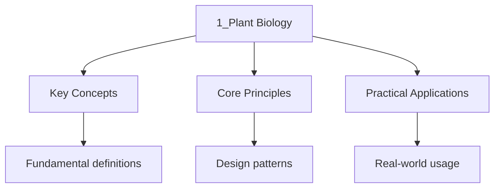

<!-- Breadcrumb Schema for SEO -->

## Plant Nutrition

### Photosynthesis Overview

Photosynthesis is the process by which photoautotrophs (plants, algae, cyanobacteria) convert light
Energy into chemical energy stored in organic molecules. It is the primary source of organic carbon
For nearly all life on Earth.

**Overall equation:**

$$6\mathrm{CO}_2 + 6\mathrm{H}_2\mathrm{O} \xrightarrow{\mathrm{light, chlorophyll}} \mathrm{C}_6\mathrm{H}_{12}\mathrm{O}_6 + 6\mathrm{O}_2$$

This is a redox process: $\mathrm{CO}_2$ is reduced to glucose (gain of electrons), and
$\mathrm{H}_2\mathrm{O}$ is oxidised to $\mathrm{O}_2$ (loss of electrons).

### Leaf Structure and Adaptations

The leaf is the primary photosynthetic organ. Its structure is optimised for maximising light
Absorption, $\mathrm{CO}_2$ uptake, and water exchange.

| Structure          | Adaptation for Photosynthesis                                                                          |
| ------------------ | ------------------------------------------------------------------------------------------------------ |
| Large surface area | Maximises light absorption                                                                             |
| Thin and flat      | Short diffusion distance for $\mathrm{CO}_2$ and light                                                 |
| Waxy cuticle       | Reduces water loss by evaporation                                                                      |
| Palisade mesophyll | Densely packed cells at the top of the leaf; rich in chloroplasts; main site of photosynthesis         |
| Spongy mesophyll   | Loosely packed with air spaces; facilitates gas exchange ($\mathrm{CO}_2$ diffusion to palisade cells) |
| Stomata            | Pores in the lower epidermis; allow $\mathrm{CO}_2$ to enter and $\mathrm{O}_2$ to exit                |
| Veins (xylem)      | Supply water to mesophyll cells                                                                        |
| Veins (phloem)     | Transport sugars (products of photosynthesis) away from the leaf                                       |
| Chloroplasts       | Contain chlorophyll and other pigments; site of the light-dependent and light-independent reactions    |

**Cross-section of a leaf (layers from top to bottom):**

1. Upper epidermis (covered by waxy cuticle; transparent to allow light through)
2. Palisade mesophyll (tall, columnar cells packed with chloroplasts)
3. Spongy mesophyll (irregular cells with large intercellular air spaces)
4. Lower epidermis (contains guard cells and stomata)
5. Veins (vascular bundles: xylem on top, phloem on bottom)

### Light-Dependent Reactions

**Location:** Thylakoid membranes of the chloroplast.

**Requirements:** Light energy, water ($\mathrm{H}_2\mathrm{O}$), $\mathrm{NADP}^+$ADP, inorganic
Phosphate ($\mathrm{P}_i$).

**Products:** ATP, NADPH, $\mathrm{O}_2$ (waste product).

**Process:**

1. **Photoexcitation of Photosystem II (PSII):** Light energy is absorbed by chlorophyll a (P680)
   and accessory pigments in the light-harvesting complex. The energy is transferred to the reaction
   centre chlorophyll, exciting an electron to a higher energy level.

2. **Photolysis of water:** The excited electron leaves P680, creating a positive charge. Water
   molecules are split by the enzyme water-splitting complex to replace the electron:

$$2\mathrm{H}_2\mathrm{O} \to 4\mathrm{H}^+ + 4e^- + \mathrm{O}_2$$

The $\mathrm{O}_2$ is released as a by-product. This is the source of atmospheric oxygen.

1. **Electron transport chain (ETC):** The high-energy electron passes through a series of electron
   carriers embedded in the thylakoid membrane (plastoquinone, cytochrome b6f complex,
   plastocyanin). As electrons move through the chain, energy is released and used to pump
   $\mathrm{H}^+$ ions from the stroma into the thylakoid lumen, creating a proton gradient.

2. **Chemiosmosis:** $\mathrm{H}^+$ ions accumulate in the thylakoid lumen, creating a proton
   gradient (electrochemical gradient). $\mathrm{H}^+$ ions flow back into the stroma through ATP
   synthase, driving the synthesis of ATP from ADP and $\mathrm{P}_i$. This is called
   **photophosphorylation**.

3. **Photoexcitation of Photosystem I (PSI):** Light energy excites another electron in PSI (P700).
   The electron from PSII replaces the electron lost by P700.

4. **NADP$^+$ reduction:** The excited electron from PSI, along with a proton from the stroma,
   reduces $\mathrm{NADP}^+$ to NADPH via the enzyme ferredoxin-NADP$^+$ reductase (FNR).

**Summary equation for light-dependent reactions:**

$$2\mathrm{H}_2\mathrm{O} + 2\mathrm{NADP}^+ + 3\mathrm{ADP} + 3\mathrm{P}_i \xrightarrow{\mathrm{light}} 2\mathrm{NADPH} + 3\mathrm{ATP} + \mathrm{O}_2$$

### Light-Independent Reactions (Calvin Cycle)

**Location:** Stroma of the chloroplast.

**Requirements:** $\mathrm{CO}_2$ATP, NADPH (produced by the light-dependent reactions).

**Products:** Triose phosphate (G3P, a 3-carbon sugar), which is used to make glucose and other
Organic compounds.

**Process:**

1. **Carbon fixation:** $\mathrm{CO}_2$ diffuses into the leaf through stomata and enters the
   chloroplast stroma. The enzyme **RuBisCO** (ribulose-1,5-bisphosphate carboxylase/oxygenase)
   catalyses the reaction between $\mathrm{CO}_2$ and ribulose-1,5-bisphosphate (RuBP, a 5-carbon
   compound):

$$\mathrm{CO}_2 + \mathrm{RuBP (5C)} \to \mathrm{Unstable 6C intermediate} \to 2 \times \mathrm{GP (glycerate-3-phosphate, 3C)}$$

1. **Reduction:** GP is reduced to triose phosphate (TP, also called G3P) using ATP and NADPH from
   the light-dependent reactions:

$$\mathrm{GP} + \mathrm{ATP} + \mathrm{NADPH} \to \mathrm{TP} + \mathrm{NADP}^+ + \mathrm{ADP} + \mathrm{P}_i$$

1. **Regeneration of RuBP:** For every 6 $\mathrm{CO}_2$ molecules fixed, 12 molecules of TP are
   produced. Of these, 10 molecules of TP (total 30 carbons) are used to regenerate 6 molecules of
   RuBP (total 30 carbons), consuming 6 ATP. The remaining 2 molecules of TP (total 6 carbons) are
   the net product and can be used to make one molecule of glucose (6C):

$$2 \times \mathrm{TP (3C each)} \to \mathrm{Glucose (6C)}$$

**Net equation for the Calvin cycle (per 3 turns):**

$$3\mathrm{CO}_2 + 9\mathrm{ATP} + 6\mathrm{NADPH} \to \mathrm{TP} + 9\mathrm{ADP} + 8\mathrm{P}_i + 6\mathrm{NADP}^+$$

**Per glucose (6 turns):**

$$6\mathrm{CO}_2 + 18\mathrm{ATP} + 12\mathrm{NADPH} \to \mathrm{C}_6\mathrm{H}_{12}\mathrm{O}_6 + 18\mathrm{ADP} + 18\mathrm{P}_i + 12\mathrm{NADP}^+$$

### Limiting Factors of Photosynthesis

A limiting factor is the factor that is closest to its minimum and therefore limits the rate of the
Process at any given time. The rate of photosynthesis is determined by the slowest of these factors.

| Factor                        | Effect on Rate                                                                                                  |
| ----------------------------- | --------------------------------------------------------------------------------------------------------------- |
| Light intensity               | Increases rate up to a plateau (light saturation point); beyond this, another factor is limiting                |
| $\mathrm{CO}_2$ concentration | Increases rate up to a plateau; low $\mathrm{CO}_2$ limits carbon fixation by RuBisCO                           |
| Temperature                   | Increases rate up to the optimum (approximately 25-30 degrees C for most plants); beyond this, enzymes denature |
| Water availability            | Severe water shortage closes stomata, reducing $\mathrm{CO}_2$ uptake; not limiting except in drought           |

**Interpreting limiting factor graphs:**

- On a graph of photosynthetic rate vs light intensity at two different $\mathrm{CO}_2$
  concentrations, the curve with higher $\mathrm{CO}_2$ plateaus at a higher rate. At low light
  intensity, both curves rise at the same rate (light is the limiting factor). At higher light
  intensity, the curves diverge ($\mathrm{CO}_2$ becomes limiting for the lower curve).
- On a graph of rate vs temperature, the rate increases to an optimum then drops sharply. The drop
  is due to denaturation of RuBisCO and other Calvin cycle enzymes.

:::note
Can bind $\mathrm{O}_2$ instead of $\mathrm{CO}_2$ (oxygenase activity), which does not produce
Glucose and wastes energy. This is more significant at high temperatures and low $\mathrm{CO}_2$
Concentrations. C4 and CAM plants have evolved mechanisms to minimise photorespiration.
:::
---

<!-- Breadcrumb Schema for SEO -->

## Gas Exchange in Plants

### Stomata

Stomata are microscopic pores found mainly on the lower surface of leaves (in most plants). Each
Stoma is surrounded by two guard cells that control the opening and closing of the pore.

**Structure of guard cells:**

- Kidney-shaped (in dicots) or dumbbell-shaped (in monocots like grasses)
- Contain chloroplasts (unlike most epidermal cells)
- Cellulose microfibrils are arranged radially around the cell, so when the guard cells swell, they
  bow outward, opening the stoma

### Mechanism of Stomatal Opening and Closing

Guard cells control stomatal aperture by changing their turgor (internal water pressure).

**Opening:**

1. Light stimulates guard cells to actively transport $\mathrm{K}^+$ ions into the cell
2. This lowers the water potential inside the guard cell
3. Water enters by osmosis from neighbouring epidermal cells
4. The guard cell becomes turgid and swells
5. The unevenly thickened cell wall causes the guard cells to bow apart, opening the stoma

**Closing:**

1. Abscisic acid (ABA) is produced in response to water stress
2. $\mathrm{K}^+$ ions leave the guard cell; water follows by osmosis
3. The guard cell becomes flaccid
4. The guard cells collapse together, closing the stoma

### Factors Affecting Stomatal Opening

| Factor          | Effect                                                                        |
| --------------- | ----------------------------------------------------------------------------- |
| Light           | Opens stomata (blue light is particularly effective via blue-light receptors) |
| $\mathrm{CO}_2$ | High $\mathrm{CO}_2$ closes stomata; low $\mathrm{CO}_2$ opens them           |
| Temperature     | Moderate warmth opens stomata; extreme heat may close them (water stress)     |
| Water supply    | Abundant water keeps stomata open; drought causes closure via ABA             |
| Time of day     | Most plants open stomata during the day and close at night (circadian rhythm) |
| Wind            | Strong wind may cause closure by increasing transpiration rate (water stress) |

### Gas Exchange Through Stomata

During the day, photosynthesis is occurring and $\mathrm{CO}_2$ is being consumed. The concentration
Of $\mathrm{CO}_2$ inside the leaf is lower than in the atmosphere, so $\mathrm{CO}_2$ diffuses in
Through the stomata. $\mathrm{O}_2$Produced as a by-product of photolysis, diffuses out through The
stomata.

$$\mathrm{CO}_2 \mathrm{ (atmosphere)} \to \mathrm{stomata} \to \mathrm{air spaces} \to \mathrm{mesophyll cells} \to \mathrm{chloroplasts}$$

$$\mathrm{O}_2 \mathrm{ (chloroplasts)} \to \mathrm{mesophyll cells} \to \mathrm{air spaces} \to \mathrm{stomata} \to \mathrm{atmosphere}$$

At night, when photosynthesis stops but respiration continues, the direction of gas exchange
Reverses: the plant takes in $\mathrm{O}_2$ and releases $\mathrm{CO}_2$.

---

<!-- Breadcrumb Schema for SEO -->

## Transport in Plants

### Overview of Plant Vascular System

Plants have two vascular tissues for transport:

| Tissue | Function                      | Direction of Transport           | Structure                                             |
| ------ | ----------------------------- | -------------------------------- | ----------------------------------------------------- |
| Xylem  | Transports water and minerals | Upwards (roots to leaves)        | Dead, hollow tubes; thick lignified walls             |
| Phloem | Transports organic solutes    | Both directions (source to sink) | Living cells; sieve tube elements and companion cells |

### Xylem Structure and Function

Xylem tissue consists of several cell types:

| Cell Type       | Description                                                                                        |
| --------------- | -------------------------------------------------------------------------------------------------- |
| Vessel elements | Short, wide cells with perforated end walls; arranged end-to-end forming continuous vessels        |
| Tracheids       | Long, narrow cells with tapered ends; water passes through pits (thin areas in the lignified wall) |
| Fibres          | Provide structural support                                                                         |
| Parenchyma      | Living cells for storage and lateral transport                                                     |

**Key features of xylem vessels:**

- Dead at maturity (no cytoplasm, no organelles)
- Lignified cell walls (provides strength and water.../1-number-and-algebra/3_proof-and-logicing)
- No cross-walls (end walls broken down) in vessel elements, forming continuous hollow tubes
- Narrow diameter in some vessels (adhesion of water to walls helps support the water column)

### Transpiration

**Definition:** Transpiration is the loss of water vapour from the aerial parts of a plant,
Primarily through the stomata of leaves.

### Worked Example: Transpiration Rate Calculation

A potometer was used to measure water uptake by a leafy shoot. The bubble moved 12 mm along the
capillary tube in 5 minutes. The capillary tube has a diameter of 0.8 mm.

(a) Calculate the volume of water taken up in 5 minutes.

(b) Calculate the rate of water uptake in mm cubed/hour.

(c) State two assumptions when using a potometer to estimate transpiration rate.

Solution

(a) Radius of capillary tube = $0.8 / 2 = 0.4$ mm = $0.4 \times 10^{-3}$ m

Cross-sectional area = $\pi r^2 = \pi \times (0.4)^2 = 0.503 \mathrm{ mm}^2$

Volume = area $\times$ distance = $0.503 \times 12 = 6.03 \mathrm{ mm}^3$

(b) Rate = $6.03 / 5 \times 60 = 72.4 \mathrm{ mm}^3\mathrm{/hour}$

(c) 1. All water taken up is lost through transpiration (some is used in photosynthesis and
growth). 2. The cutting of the shoot has not damaged xylem vessels. 3. Environmental conditions in
the lab are similar to natural conditions.

Transpiration is NOT "water loss." It is a consequence of gas exchange -- stomata must be Open for
$\mathrm{CO}_2$ uptake during photosynthesis, and water vapour inevitably diffuses out Through the
same open stomata.

**Factors affecting the rate of transpiration:**

| Factor                  | Effect on Rate                      | Explanation                                                                                  |
| ----------------------- | ----------------------------------- | -------------------------------------------------------------------------------------------- |
| Temperature             | Increases rate                      | Higher temperature increases kinetic energy of water molecules; increases evaporation rate   |
| Humidity                | Decreases rate with higher humidity | High humidity reduces the water potential gradient between leaf and atmosphere               |
| Wind speed              | Increases rate                      | Wind carries away water vapour from the leaf surface, maintaining a steep diffusion gradient |
| Light intensity         | Increases rate                      | Light causes stomata to open, increasing the area through which water vapour can escape      |
| Soil water availability | Decreases rate when water is scarce | Low soil water potential reduces water uptake by roots; triggers ABA and stomatal closure    |
| Surface area of leaves  | Larger surface area increases rate  | More stomata and larger area for evaporation                                                 |
| Cuticle thickness       | Thicker cuticle decreases rate      | Reduces cuticular transpiration                                                              |

**Measurement of transpiration:**

A **potometer** measures the rate of water uptake by a plant shoot. Since most water taken up is
Lost through transpiration (approximately 98%), the rate of water uptake approximates the rate of
Transpiration.

**Limitations of potometers:**

- Measures water uptake, not transpiration directly (some water is used in photosynthesis and
  growth)
- Cutting the shoot may damage xylem vessels
- Environmental conditions in the lab may not reflect field conditions

### The Transpiration Stream

The movement of water through a plant from roots to leaves:

**1. Water uptake by root hair cells:**

- Root hairs increase the surface area for absorption
- Water enters root hair cells by osmosis (the soil water potential is higher than the cell water
  potential due to the high solute concentration in root cells)
- Mineral ions are absorbed by active transport (against their concentration gradient)

**2. Movement across the root to the xylem:**

Three possible pathways:

| Pathway            | Description                                                                                  |
| ------------------ | -------------------------------------------------------------------------------------------- |
| Apoplastic pathway | Water moves through the cell walls and intercellular spaces (not crossing any membranes)     |
| Symplastic pathway | Water moves through the cytoplasm of cells via plasmodesmata (membrane-to-membrane crossing) |
| Vacuolar pathway   | Water moves from vacuole to vacuole through cells (crosses both membranes and tonoplast)     |

The **Casparian strip** (a band of suberin in the endodermis cell walls) blocks the apoplastic
Pathway at the endodermis, forcing water and minerals to enter the symplastic pathway. This gives
The plant control over what enters the xylem (selective filter).

**3. Movement up the xylem:**

Water moves up the xylem against gravity through three contributing mechanisms:

**a) Cohesion-Tension Theory (primary mechanism):**

- Transpiration from the leaves creates a negative pressure (tension) at the top of the xylem column
- Water molecules are cohesive (hydrogen bonds between them) and adhesive (hydrogen bonds with the
  xylem walls)
- The tension is transmitted down the entire water column, pulling water upward from the roots
- This is a passive process -- no energy input is required from the plant
- The water column can be maintained because of the combined effects of cohesion (between water
  molecules), adhesion (between water and xylem walls), and the narrow diameter of xylem vessels
  (capillarity)

**b) Root pressure:**

- Active transport of ions into the xylem by root cells lowers the xylem water potential
- Water follows by osmosis, creating a positive pressure (root pressure) that pushes water upward
- Root pressure is relatively weak (can only push water up a few metres)
- Contributes to guttation (droplets of water exuded from leaf margins under humid conditions when
  transpiration is low)

**c) Capillary action:**

- The narrow diameter of xylem vessels causes water to rise by capillarity
- This contributes minimally to water transport in tall plants but is significant in small plants

:::caution
Transport in tall trees. Root pressure alone can only push water a few metres. The cohesion-tension
Theory is the dominant mechanism in tall plants. Root pressure is supplementary and is only
Significant in small plants or under conditions of low transpiration.
:::
### Phloem Structure and Function

Phloem transports organic solutes (primarily sucrose) from source to sink.

**Source:** Any part of the plant that produces or releases sugars (e.g., photosynthesising leaves,
Storage organs during mobilisation).

**Sink:** Any part of the plant that uses or stores sugars (e.g., growing roots, developing fruits,
Meristems, storage organs during filling).

**Cell types in phloem:**

| Cell Type           | Description                                                                                                 |
| ------------------- | ----------------------------------------------------------------------------------------------------------- |
| Sieve tube elements | Living cells at maturity; no nucleus; perforated end walls (sieve plates) with pores for sap flow           |
| Companion cells     | Adjacent to sieve tube elements; have a nucleus and many mitochondria; metabolic support for sieve elements |
| Phloem fibres       | Provide structural support                                                                                  |
| Phloem parenchyma   | Storage cells                                                                                               |

### Translocation

**Definition:** Translocation is the transport of organic solutes (mainly sucrose) in the phloem
From source to sink.

**The mass flow (pressure flow) hypothesis:**

This is the most widely accepted model for phloem transport.

1. **Loading at the source:** Sucrose is actively loaded into sieve tube elements at the source
   (e.g., from photosynthesising mesophyll cells). This can occur via apoplastic loading (sucrose
   enters the cell wall space and is actively transported into the sieve element via a
   proton-sucrose co-transporter) or symplastic loading (via plasmodesmata).

2. **Increased solute concentration:** Active loading lowers the water potential inside the sieve
   tube elements.

3. **Water enters by osmosis:** Water moves from the xylem into the sieve tube elements, increasing
   turgor pressure at the source.

4. **Mass flow:** The pressure gradient between source (high pressure) and sink (low pressure)
   drives the bulk flow of sap through the sieve tubes toward the sink.

5. **Unloading at the sink:** Sucrose is unloaded from the sieve tube elements at the sink (by
   diffusion or active transport). This raises the water potential inside the sieve tubes.

6. **Water leaves by osmosis:** Water moves from the sieve tubes into the surrounding cells or
   xylem, reducing turgor pressure at the sink.

**Evidence for the mass flow hypothesis:**

- Sieve tube sap has a high sugar concentration (up to 30% sucrose)
- Aphids feeding on phloem exude sap with high sugar content
- There is a pressure gradient between source and sink
- Ringing (removing a ring of bark and phloem) causes sugar accumulation above the ring and
  starvation below

### Comparison of Xylem and Phloem

| Feature          | Xylem                                        | Phloem                                                        |
| ---------------- | -------------------------------------------- | ------------------------------------------------------------- |
| Direction        | Upwards (one-way)                            | Source to sink (bidirectional)                                |
| Substance        | Water and mineral ions                       | Organic solutes (mainly sucrose)                              |
| Cell status      | Dead at maturity                             | Living at maturity                                            |
| Cell walls       | Thick, lignified                             | Thin, not lignified                                           |
| Cross-walls      | No cross-walls (vessels) or pits (tracheids) | Sieve plates with pores (sieve tube elements)                 |
| Mechanism        | Transpiration pull (passive)                 | Mass flow / pressure flow (active loading, passive transport) |
| Supporting cells | Fibres, parenchyma                           | Companion cells (metabolic support)                           |
| Location in root | Central                                      | Outer region                                                  |
| Location in stem | Inner region of vascular bundle              | Outer region of vascular bundle                               |

---

<!-- Breadcrumb Schema for SEO -->

## Plant Reproduction

### Sexual Reproduction in Flowering Plants

#### Flower Structure

A typical flower consists of four whorls of modified leaves (floral organs), arranged on the
Receptacle:

| Whorl          | Organs     | Function                                                   |
| -------------- | ---------- | ---------------------------------------------------------- |
| Sepals         | Calyx      | Protect the flower bud                                     |
| Petals         | Corolla    | Attract pollinators (often brightly coloured, scented)     |
| Stamens        | Androecium | Male reproductive organs; produce pollen (microspores)     |
| Carpels/Pistil | Gynoecium  | Female reproductive organs; contain ovules (megasporangia) |

**Stamen structure:** Anther (produces pollen grains) + Filament (supports the anther).

**Carpel structure:** Stigma (receives pollen) + Style (connects stigma to ovary) + Ovary (contains
Ovules, each containing an egg cell and two polar nuclei).

#### Pollination

**Definition:** Pollination is the transfer of pollen grains from an anther to a stigma.

| Type              | Description                                                                           | Examples                                          |
| ----------------- | ------------------------------------------------------------------------------------- | ------------------------------------------------- |
| Self-pollination  | Pollen from the same flower (or another flower on the same plant) lands on the stigma | Peas, wheat, rice                                 |
| Cross-pollination | Pollen from one plant lands on the stigma of a different plant of the same species    | Most flowering plants; promotes genetic diversity |

**Agents of pollination:**

| Agent   | Adaptations                                                                                                    |
| ------- | -------------------------------------------------------------------------------------------------------------- |
| Wind    | Light, smooth pollen; small, dull flowers; feathery stigmas; large anthers; produces vast quantities of pollen |
| Insects | Brightly coloured petals; scent; nectar; sticky or spiny pollen; sticky stigma                                 |
| Birds   | Large, brightly coloured (often red) flowers; copious nectar                                                   |
| Bats    | Large, pale-coloured flowers that open at night; strong scent                                                  |
| Water   | Long, ribbon-like pollen that floats on water                                                                  |

#### Fertilisation

After a pollen grain lands on a compatible stigma, the following sequence occurs:

1. **Germination:** The pollen grain absorbs sugars and water from the stigma and germinates,
   producing a pollen tube.

2. **Pollen tube growth:** The pollen tube grows down through the style towards the ovary, guided by
   chemical signals from the ovule. The tube nucleus is at the tip.

3. **Double fertilisation (unique to flowering plants):**

**a) First fertilisation:** The pollen tube enters the ovule through the micropyle. One male gamete
fuses with the egg cell to form the diploid zygote (2n). This will develop into the embryo.

**b) Second fertilisation:** The second male gamete fuses with the two polar nuclei (each haploid)
to form the triploid endosperm (3n). The endosperm is a nutritive tissue that provides food for the
developing embryo.

$$\mathrm{Male gamete (n)} + \mathrm{Egg cell (n)} \to \mathrm{Zygote (2n)}$$

$$\mathrm{Male gamete (n)} + 2 \times \mathrm{Polar nuclei (n + n)} \to \mathrm{Endosperm (3n)}$$

#### Seed and Fruit Formation

After fertilisation:

| Part                  | Develops From              | Develops Into                |
| --------------------- | -------------------------- | ---------------------------- |
| Zygote                | Egg cell + male gamete     | Embryo                       |
| Endosperm             | Polar nuclei + male gamete | Endosperm (nutritive tissue) |
| Integuments           | Ovule wall                 | Seed coat (testa)            |
| Ovule                 | Entire structure           | Seed                         |
| Ovary wall            | Ovary                      | Fruit wall (pericarp)        |
| Ovary                 | Entire structure           | Fruit                        |
| Sepals/petals/stamens | Floral organs              | wither and fall off          |

**Structure of a seed (e.g., broad bean):**

- **Testa (seed coat):** Protective outer layer formed from the integuments of the ovule
- **Embryo:** Consists of the radicle (future root), plumule (future shoot), and one or two
  cotyledons (seed leaves)
- **Cotyledons:** Store nutrients (in non-endospermic seeds like beans) or absorb nutrients from the
  endosperm (in endospermic seeds like maize)
- **Micropyle:** A small pore in the testa where water enters during germination

**Seed dispersal mechanisms:**

| Mechanism         | Adaptation                                                                         | Example                    |
| ----------------- | ---------------------------------------------------------------------------------- | -------------------------- |
| Wind              | Winged structures, parachute-like tufts, light weight                              | Dandelion, sycamore, maple |
| Animal (external) | Hooks, barbs, sticky surfaces that cling to fur                                    | Burdock, goosegrass        |
| Animal (internal) | Fleshy, edible fruit; seeds pass through gut intact                                | Berries (eaten by birds)   |
| Water             | Air-filled cavities, water.../1-number-and-algebra/3_proof-and-logic coat, buoyant | Coconut                    |
| Self-dispersal    | Explosive mechanism when pod dries                                                 | Pea pods, touch-me-not     |

---

<!-- Breadcrumb Schema for SEO -->

## Asexual Reproduction in Plants

### Vegetative Propagation

Asexual reproduction in plants produces offspring that are genetically identical to the parent
(clones). No gametes or fertilisation are involved.

**Natural methods:**

| Method   | Description                                                                       | Example                |
| -------- | --------------------------------------------------------------------------------- | ---------------------- |
| Runners  | Horizontal stems growing above ground; new plants form at nodes                   | Strawberry             |
| Tubers   | Swollen underground stems storing food; "eyes" (buds) can sprout into new plants  | Potato                 |
| Bulbs    | Underground food storage organs with fleshy leaf bases; new bulbs form as offsets | Onion, tulip, daffodil |
| Corms    | Swollen underground stem bases (solid, unlike bulbs)                              | Crocus, gladiolus      |
| Rhizomes | Horizontal underground stems; buds sprout to form new shoots                      | Ginger, iris, mint     |
| Offset   | Short, thick horizontal branches at the base of the stem                          | Water hyacinth         |

**Advantages of vegetative propagation:**

- Rapid colonisation of an area (only one parent needed)
- Offspring are well-adapted to the current environment (clones of a successful parent)
- Food reserves allow rapid early growth

**Disadvantages:**

- No genetic variation, so the entire population is vulnerable to the same disease or environmental
  change
- Overcrowding and competition for resources (clones compete with parent)
- No dispersal mechanism

### Artificial Propagation

**1. Cuttings:**

A section of stem (or leaf, root) is cut from the parent plant and placed in moist soil or water.
Rooting hormones (auxins) may be applied to stimulate root development.

**2. Grafting:**

A shoot (scion) from one plant is attached to the root and lower stem (rootstock) of another plant.
The vascular cambium of both must be aligned so they fuse.

- Used for fruit trees (e.g., combining a high-quality fruit scion with a disease-resistant
  rootstock)
- The scion retains its characteristics; the rootstock provides the root system

**3. Tissue Culture (Micropropagation):**

A small piece of plant tissue (explant) is grown on a sterile nutrient medium containing growth
Hormones (auxins and cytokinins) to produce a mass of undifferentiated cells (callus). The callus is
Then stimulated to differentiate into plantlets.

Steps:

1. Selection of explant ( from a meristem, which is virus-free)
2. Sterilisation of the explant
3. Growth on nutrient agar with auxins and cytokinins to form callus
4. Transfer to medium stimulating shoot formation
5. Transfer to medium stimulating root formation
6. Acclimatisation and transfer to soil

Advantages: large numbers of identical plants in a small space; disease-free plants; conservation of
Rare species; year-round production.

---

<!-- Breadcrumb Schema for SEO -->

## Growth and Development in Plants

### Plant Hormones (Phytohormones)

Plant hormones are organic substances produced in small quantities in one part of the plant and
Transported to other parts, where they control growth, development, and responses to stimuli.

| Hormone             | Site of Production                         | Main Functions                                                                                    |
| ------------------- | ------------------------------------------ | ------------------------------------------------------------------------------------------------- |
| Auxins (IAA)        | Shoot tips (apical meristem), young leaves | Cell elongation; apical dominance; root initiation; fruit development; tropisms                   |
| Gibberellins        | Young leaves, roots, developing seeds      | Stem elongation; seed germination; bolting; fruit development                                     |
| Cytokinins          | Root tips                                  | Cell division; delay leaf senescence; work antagonistically with auxins in shoot/root development |
| Abscisic acid (ABA) | Leaves, stems, green fruits                | Stomatal closure (drought response); seed dormancy; inhibition of growth                          |
| Ethylene            | Ripening fruits, senescing tissues         | Fruit ripening; leaf abscission (leaf fall); senescence                                           |

### Auxins

**Indole-3-acetic acid (IAA)** is the most common natural auxin. Synthetic auxins include 2,4-D and
NAA (naphthaleneacetic acid).

**Effects of auxins:**

1. **Cell elongation:** Auxins stimulate cell elongation in shoots by:

- Activating proton pumps ($\mathrm{H}^+$-ATPases) in the cell membrane, pumping $\mathrm{H}^+$ into
  the cell wall
- Lowering pH in the cell wall activates enzymes (expansins) that break cross-links between
  cellulose microfibrils
- The cell wall becomes more flexible and stretches as water enters the cell by osmosis
- The cell elongates

1. **Apical dominance:** Auxin produced in the apical bud inhibits the growth of lateral buds.
   Removing the apical bud (decapitation) releases lateral buds from inhibition, causing the plant
   to become bushier. This is because:

- High auxin concentration in the main shoot promotes elongation
- Auxin is transported downwards and indirectly inhibits lateral bud growth (possibly by promoting
  cytokinin synthesis inhibition or by diverting nutrients away from lateral buds)

1. **Root initiation:** Auxins applied to cut stems promote the formation of adventitious roots.
   This is used commercially in rooting powders.

### Gibberellins

Gibberellins were first discovered in the fungus _Gibberella fujikuroi_, which causes "foolish
Seedling" disease in rice (excessive stem elongation).

**Effects of gibberellins:**

1. **Stem elongation:** Gibberellins stimulate cell division and elongation in the internodes
   (regions between nodes). They can reverse the effect of dwarfing genes. Dwarf pea plants treated
   with gibberellic acid (GA) grow to normal height.

2. **Seed germination:** In some seeds (e.g., barley), the embryo produces gibberellins upon
   imbibition (water absorption). The gibberellins stimulate the aleurone layer (a protein-rich
   tissue surrounding the endosperm) to produce amylase enzymes, which break down starch in the
   endosperm into sugars for the growing embryo.

3. **Bolting:** Gibberellins trigger the rapid elongation of the flowering stem in rosette plants
   (e.g., cabbage) when they are exposed to certain environmental cues.

### Tropisms

**Definition:** A tropism is a directional growth response of a plant to an external stimulus. The
Growth can be towards (positive tropism) or away from (negative tropism) the stimulus.

**Phototropism:** Growth response to light.

- Shoots are positively phototropic (grow towards light) to maximise light absorption for
  photosynthesis
- Roots are negatively phototropic (grow away from light, into the soil)

**Mechanism of phototropism (in shoots):**

1. Auxin (IAA) is produced in the shoot tip and is transported downwards
2. Light causes auxin to accumulate on the shaded side of the shoot (the auxin is transported
   laterally from the light side to the dark side)
3. The higher auxin concentration on the shaded side stimulates more cell elongation on that side
4. The shaded side elongates more than the illuminated side, causing the shoot to bend towards the
   light

**Geotropism (gravitropism):** Growth response to gravity.

- Roots are positively geotropic (grow downwards towards gravity)
- Shoots are negatively geotropic (grow upwards away from gravity)

**Mechanism of geotropism (in roots):**

1. Root caps contain statoliths (amyloplasts -- starch-containing organelles) that settle to the
   bottom of the cell under gravity
2. This triggers redistribution of auxin to the lower side of the root
3. In roots, high auxin concentration inhibits cell elongation (unlike shoots, where auxin promotes
   elongation)
4. The upper side (lower auxin) elongates more than the lower side (higher auxin), causing the root
   to bend downwards

:::caution
Shoots versus roots. In shoots, auxin promotes elongation (high concentration side grows more). In
Roots, auxin inhibits elongation (low concentration side grows more). This is why shoots bend
Towards light but roots bend away from it when auxin redistributes.
:::
### Auxin and Gibberellin Interactions

| Feature            | Auxin (IAA)                          | Gibberellin (GA)                                    |
| ------------------ | ------------------------------------ | --------------------------------------------------- |
| Primary effect     | Cell elongation, apical dominance    | Stem elongation, seed germination                   |
| Site of production | Shoot tip, young leaves              | Young leaves, roots, developing seeds               |
| Apical dominance   | Promotes apical dominance            | No direct role                                      |
| Seed germination   | Not directly involved                | Stimulates amylase production in aleurone layer     |
| Dwarf plants       | Cannot reverse dwarfism alone        | Reverses genetic dwarfism                           |
| Commercial use     | Rooting powders, weedkillers (2,4-D) | Spraying grapes to increase size; malting of barley |

---

<!-- Breadcrumb Schema for SEO -->

## Intuition

**Solar-powered factories:** Plants are like solar panels that make food — photosynthesis captures sunlight and converts it into chemical energy. Transpiration is the plant's cooling system.

**Why it matters:** From agriculture to climate change, plant biology underpins food security and environmental health. Understanding photosynthesis helps improve crop yields.

**The key insight:** Photosynthesis and respiration are complementary processes — plants make glucose using sunlight, then break it down for energy, just like animals.

## Common Pitfalls

1. **Confusing xylem and phloem transport:** Xylem carries water and minerals UPWARDS (one-way).
   Phloem carries organic solutes (sucrose) from source to sink (can be in either direction). Do not
   write "phloem carries food from leaves to roots" -- it carries food from source (any
   sugar-producing or sugar-storing organ) to sink (any sugar-using or sugar-storing organ).

2. **Stating that the xylem actively pumps water upwards:** Xylem transport is PASSIVE. Water is
   pulled up by transpiration pull (cohesion-tension) and pushed up by root pressure. No energy is
   directly expended on water movement through the xylem.

3. **Writing that transpiration is "wasteful":** Transpiration is a necessary consequence of gas
   exchange. Stomata must be open for $\mathrm{CO}_2$ uptake, and water vapour inevitably escapes.
   Transpiration also has benefits: it provides evaporative cooling, drives the transpiration stream
   (and thus mineral transport), and maintains turgor.

4. **Forgetting double fertilisation:** Flowering plants are unique in having double fertilisation.
   One male gamete fuses with the egg (zygote, 2n) and the other fuses with two polar nuclei
   (endosperm, 3n). Both events must be mentioned.

5. **Confusing pollination with fertilisation:** Pollination is the transfer of pollen to a stigma.
   Fertilisation is the fusion of gametes. They are distinct events. Pollination can occur without
   fertilisation (incompatible pollen), and fertilisation cannot occur without pollination (in
   nature).

6. **Writing that vegetative propagation produces "seeds":** Vegetative propagation is asexual. No
   seeds, gametes, or fertilisation are involved. Offspring are produced from somatic cells and are
   genetically identical clones.

7. **Forgetting that auxin inhibits root cell elongation:** Auxin promotes elongation in shoots but
   inhibits it in roots. This is essential for explaining geotropism correctly.

8. **Writing that gibberellins are produced in the shoot tip:** Gibberellins are produced in young
   leaves, roots, and developing seeds -- not primarily in the shoot tip (that is where auxin is
   produced).

9. **Confusing tropisms with taxes and nasties:** Tropisms are growth responses (directional,
   permanent). Taxes are movement responses (whole organism moves). Nastic movements are
   non-directional responses to stimuli (e.g., opening and closing of flowers in response to light
   and temperature).

10. **Stating that the mass flow hypothesis requires energy throughout:** Only the initial loading
    of sucrose into the phloem at the source requires active transport (energy). The actual movement
    of sap through the sieve tubes is driven by a pressure gradient and is a passive, bulk flow
    process.

### Worked Example: Translocation and Ringing

A scientist applies a ring of bark (including the phloem) around the trunk of a tree. After several
weeks, a swelling is observed above the ring and the leaves begin to wilt. Explain these
observations.

Solution

The bark ring removes the phloem but leaves the xylem intact. The xylem continues to transport water
and minerals from the roots to the leaves (so initially the leaves do not wilt from water shortage).

However, the phloem is the pathway for translocation of organic solutes (sucrose) from the leaves
(source) to the roots and lower parts (sink). With the phloem severed, sucrose produced by
photosynthesis cannot be transported downwards. The sucrose accumulates in the phloem above the
ring, causing the swelling (accumulated sugars create osmotic pressure, drawing in water).

Over time, the roots are deprived of sucrose (their energy source). Without adequate organic
nutrients, root cells cannot carry out active transport effectively. Water and mineral uptake
decreases, leading to reduced water transport in the xylem and wilting of the leaves.

### Worked Example: Phototropism Experiment

Design an experiment to demonstrate that auxin is responsible for phototropism in shoot tips.
Include a control and expected results.

Solution

Use several coleoptiles (oat seedling shoot tips) of similar age and size:

- **Group A (control):** Intact coleoptile, unilateral light. Expected: bends towards light.
- **Group B:** Tip removed, unilateral light. Expected: no bending (no auxin source).
- **Group C:** Tip removed, replaced with plain agar block, unilateral light. Expected: no bending
  (no auxin in agar).
- **Group D:** Tip removed, agar block with auxin (IAA) placed asymmetrically on one side, uniform
  light. Expected: bends away from the auxin side.
- **Group E:** Intact coleoptile with opaque cap over tip, unilateral light. Expected: no bending
  (light blocked from tip).

Conclusion: Bending requires both the shoot tip (auxin source) and light reaching the tip (causing
auxin redistribution). When auxin is applied asymmetrically, it causes bending even without a light
gradient, confirming auxin is responsible.

---

<!-- Breadcrumb Schema for SEO -->

## Problem Set

**Problem 1:** Describe how water moves from the soil into the xylem of a plant root. Explain the
role of the Casparian strip.

If you get this wrong, revise: Transport in Plants -- The Transpiration Stream

Solution

Water enters root hair cells by osmosis. The root hair cell has a lower water potential than the
soil solution (because the cytoplasm contains solutes). Water moves down the water potential
gradient from the soil into the root hair cell.

Water then moves across the root cortex via three pathways: apoplastic (through cell walls),
symplastic (through cytoplasm via plasmodesmata), and vacuolar (through vacuoles).

When water reaches the endodermis, the Casparian strip (a band of suberin in the radial cell walls)
blocks the apoplastic pathway. Water and dissolved minerals are forced to cross the cell membrane of
endodermal cells and enter the symplastic pathway. This allows the plant to selectively control
which substances enter the xylem -- only substances that can cross the selectively permeable
membrane are admitted.

**Problem 2:** A student investigates the effect of light intensity on the rate of photosynthesis at
two temperatures: 15 degrees C and 25 degrees C. At low light intensity, both curves have the same
slope, but the 25 degrees C curve plateaus at a higher rate. Explain these observations.

If you get this wrong, revise: Plant Nutrition -- Limiting Factors of Photosynthesis

Solution

At low light intensity, light is the limiting factor for both temperatures. The rate of the
light-dependent reactions is limited by available light energy, so the rate is the same regardless
of temperature. Temperature does not matter because the light reactions are not temperature-limited
at this point.

As light intensity increases, the rate plateaus as another factor becomes limiting. At 15 degrees C,
Calvin cycle enzymes have lower kinetic energy and fewer enzyme-substrate collisions occur, so the
rate plateaus at a lower level. At 25 degrees C, enzymes are closer to their optimum, so they can
keep up with the higher ATP and NADPH supply from the light-dependent reactions, allowing a higher
plateau. Temperature, not light, becomes the limiting factor at high light intensities.

**Problem 3:** Explain the mechanism of double fertilisation in flowering plants. Why is this
process unique to angiosperms?

If you get this wrong, revise: Plant Reproduction -- Fertilisation

Solution

After a pollen grain lands on a compatible stigma, it germinates and produces a pollen tube that
grows down the style to the ovule. The pollen tube carries two male gametes.

**First fertilisation:** One male gamete fuses with the egg cell to form the diploid zygote (2n),
which develops into the embryo.

**Second fertilisation:** The second male gamete fuses with the two polar nuclei (each haploid) to
form the triploid endosperm (3n), which is a nutritive tissue that provides food for the developing
embryo.

This is unique to flowering plants (angiosperms) because no other plant group has double
fertilisation. In gymnosperms (e.g., conifers), only one fertilisation event occurs, producing the
zygote. The endosperm in gymnosperms is haploid (1n), not triploid.

**Problem 4:** Explain how auxin controls phototropism in shoots. Why does the same hormone have the
opposite effect in roots?

If you get this wrong, revise: Growth and Development -- Tropisms (Phototropism; Geotropism)

Solution

In shoots, auxin (IAA) is produced in the shoot tip and transported downwards. Unilateral light
causes auxin to accumulate on the shaded side (lateral redistribution). The higher auxin
concentration on the shaded side stimulates more cell elongation, causing the shoot to bend towards
the light.

In roots, auxin also redistributes to the lower side in response to gravity (geotropism). However,
high auxin concentration **inhibits** cell elongation in roots (unlike shoots where it promotes
elongation). The upper side (lower auxin) elongates more than the lower side (higher auxin), causing
the root to bend downwards.

The opposite effect of auxin on shoots vs roots is due to different tissue sensitivities and
different threshold concentrations for the auxin response in each cell type.

**Problem 5:** Describe the mass flow (pressure flow) hypothesis of phloem translocation. What
evidence supports this model?

If you get this wrong, revise: Transport in Plants -- Translocation

Solution

1. **Loading at the source:** Sucrose is actively loaded into sieve tube elements, lowering their
   water potential.
2. **Water enters by osmosis** from the xylem, increasing turgor pressure at the source.
3. **Mass flow:** The pressure gradient between source (high pressure) and sink (low pressure)
   drives bulk flow of sap through sieve tubes.
4. **Unloading at the sink:** Sucrose is removed (by diffusion or active transport), raising water
   potential.
5. **Water leaves by osmosis** from sieve tubes into surrounding cells, reducing turgor pressure at
   the sink.

**Evidence:** Sieve tube sap has high sugar concentration (up to 30% sucrose); aphids feeding on
phloem exude sugary sap; ringing experiments cause swelling above the ring; there is a measurable
pressure gradient between source and sink.

**Problem 6:** Explain the roles of gibberellins in seed germination, using barley as an example.

If you get this wrong, revise: Growth and Development -- Gibberellins

Solution

In barley seeds, the embryo produces gibberellins upon imbibition (water absorption). The
gibberellins diffuse to the aleurone layer (a protein-rich tissue surrounding the endosperm).
Gibberellins stimulate the aleurone cells to produce **amylase** enzymes, which are secreted into
the endosperm. Amylase breaks down starch (a stored polysaccharide) into maltose (a disaccharide)
and then glucose (a monosaccharide). These sugars are absorbed by the embryo and used as an energy
source for growth until the seedling can carry out photosynthesis.

This mechanism explains why gibberellins can reverse genetic dwarfism: dwarf plants have a mutation
that reduces gibberellin production, and applying external gibberellin restores normal stem
elongation.

**Problem 7:** Compare the structure and function of xylem and phloem.

If you get this wrong, revise: Transport in Plants -- Xylem Structure and Function; Phloem Structure
and Function; Comparison of Xylem and Phloem

Solution

| Feature          | Xylem                                        | Phloem                                        |
| ---------------- | -------------------------------------------- | --------------------------------------------- |
| Direction        | Upwards (one-way)                            | Source to sink (bidirectional)                |
| Substance        | Water and minerals                           | Organic solutes (mainly sucrose)              |
| Cell status      | Dead at maturity                             | Living at maturity                            |
| Cell walls       | Thick, lignified                             | Thin, not lignified                           |
| Cross-walls      | No cross-walls (vessels) or pits (tracheids) | Sieve plates with pores                       |
| Mechanism        | Transpiration pull (passive) + root pressure | Mass flow (active loading, passive transport) |
| Supporting cells | Fibres, parenchyma                           | Companion cells (metabolic support)           |

**Problem 8:** Describe how stomata open and close. Name two environmental factors that affect
stomatal aperture.

If you get this wrong, revise: Gas Exchange in Plants -- Mechanism of Stomatal Opening and Closing;
Factors Affecting Stomatal Opening

Solution

**Opening:** Light stimulates guard cells to actively transport K$^+$ ions into the cell. This
lowers the water potential inside the guard cell. Water enters by osmosis from neighbouring
epidermal cells. The guard cell becomes turgid and swells. The unevenly thickened cell wall
(radially arranged cellulose microfibrils) causes the guard cells to bow apart, opening the stoma.

**Closing:** Abscisic acid (ABA) is produced in response to water stress. K$^+$ ions leave the guard
cell; water follows by osmosis. The guard cell becomes flaccid and collapses together, closing the
stoma.

Environmental factors: (1) Light -- opens stomata; (2) CO$_2$ concentration -- high CO$_2$ closes
them; (3) Temperature -- moderate warmth opens, extreme heat may close (water stress); (4) Water
availability -- drought causes closure via ABA.

**Problem 9:** Explain why sexual reproduction is advantageous for flowering plants compared to
asexual reproduction (vegetative propagation).

If you get this wrong, revise: Plant Reproduction -- Sexual Reproduction; Asexual Reproduction in
Plants

Solution

Sexual reproduction produces genetically diverse offspring through meiosis (crossing over,
independent assortment) and random fertilisation. Genetic diversity provides several advantages:

1. **Disease resistance:** Not all offspring are susceptible to the same pathogens, reducing the
   risk of the entire population being wiped out by a single disease.
2. **Adaptability:** Genetic variation allows some individuals to survive environmental changes
   (e.g., drought, temperature change), enabling the population to adapt over generations.
3. **Evolutionary potential:** New combinations of alleles can produce traits that are advantageous
   in changing environments, driving natural selection.

In contrast, vegetative propagation produces genetically identical clones. While this is fast and
requires only one parent, the entire population is vulnerable to the same disease or environmental
change.

**Problem 10:** Explain how the Calvin cycle depends on the light-dependent reactions. What would
happen to the Calvin cycle if light were suddenly switched off?

If you get this wrong, revise: Plant Nutrition -- Light-Dependent Reactions; Light-Independent
Reactions (Calvin Cycle)

Solution

The Calvin cycle depends on the light-dependent reactions for two products: **ATP** and **NADPH**.
ATP provides the energy for carbon fixation (RuBisCO combining CO$_2$ with RuBP) and for
regenerating RuBP. NADPH provides the reducing power (electrons and H$^+$) to reduce GP to TP
(glycerate-3-phosphate to triose phosphate).

If light were switched off:

1. No ATP would be produced (photophosphorylation stops)
2. No NADPH would be produced (NADP$^+$ cannot be reduced)
3. GP could not be reduced to TP -- GP would accumulate
4. RuBP could not be regenerated (requires ATP)
5. Carbon fixation would stop (no RuBP available)
6. No glucose or other organic compounds would be produced
7. Existing TP and RuBP would be used up quickly, and the Calvin cycle would cease.

---

<!-- Breadcrumb Schema for SEO -->

## Mineral Nutrition

### Essential Mineral Ions

Plants require a range of mineral ions for healthy growth. These are absorbed from the soil solution
by root hair cells, primarily through active transport (against the concentration gradient).

| Mineral Ion | Symbol                               | Function                                                                          | Deficiency Symptom                                            |
| ----------- | ------------------------------------ | --------------------------------------------------------------------------------- | ------------------------------------------------------------- |
| Nitrogen    | $\mathrm{NO}_3^-$, $\mathrm{NH}_4^+$ | Component of amino acids, proteins, nucleic acids, chlorophyll                    | Chlorosis (yellowing of older leaves); stunted growth         |
| Phosphorus  | $\mathrm{PO}_4^{3-}$                 | Component of ATP, nucleic acids (DNA, RNA), phospholipids                         | Poor root growth; dark green or purplish leaves               |
| Potassium   | $\mathrm{K}^+$                       | Osmoregulation; opening and closing of stomata; enzyme activation                 | Yellow leaves with dead tips; weak stems                      |
| Magnesium   | $\mathrm{Mg}^{2+}$                   | Central atom in the chlorophyll molecule; enzyme activator                        | Chlorosis of older leaves (chlorophyll cannot be synthesised) |
| Calcium     | $\mathrm{Ca}^{2+}$                   | Component of the middle lamella (calcium pectate); involved in cell division      | Stunted growth; meristems die                                 |
| Iron        | $\mathrm{Fe}^{2+}$/Fe$^{3+}$         | Required for chlorophyll synthesis (as a cofactor, not a component)               | Chlorosis of YOUNG leaves (iron is immobile in the plant)     |
| Sulphur     | $\mathrm{SO}_4^{2-}$                 | Component of some amino acids (cysteine, methionine); component of some coenzymes | Chlorosis of young leaves                                     |

### Nitrogen as a Limiting Nutrient

Nitrogen is most often the limiting nutrient for plant growth because:

- Plants require large amounts of nitrogen (for proteins, nucleic acids, chlorophyll)
- Atmospheric $\mathrm{N}_2$ is unavailable to plants (triple bond too strong)
- Nitrogen in the soil is leached by rain (nitrate is highly soluble and mobile)
- Plant uptake removes nitrogen from the soil faster than natural processes replace it

**Nitrogen deficiency** causes chlorosis (yellowing of leaves due to reduced chlorophyll synthesis)
because nitrogen is a component of chlorophyll. Older leaves are affected first because nitrogen is
mobile within the plant -- it is translocated from older leaves to younger, growing leaves.

### Active Transport of Mineral Ions

Mineral ions are absorbed against their concentration gradient by active transport in root hair
cells:

1. Root hair cells have many mitochondria (providing ATP for active transport)
2. Carrier proteins in the cell membrane bind specific mineral ions and transport them into the cell
3. Active transport maintains the concentration gradient needed for mineral uptake even when soil
   concentrations are very low

**Evidence for active transport:**

- Root hair cells continue to absorb ions even when the soil concentration is lower than inside the
  cell
- Absorption is inhibited by respiratory poisons (e.g., cyanide, which inhibits cytochrome oxidase
  and stops ATP production)
- Absorption is reduced at low oxygen concentrations (oxygen is needed for aerobic respiration to
  produce ATP)

---

<!-- Breadcrumb Schema for SEO -->

## Seed Germination

### Conditions for Germination

Germination is the process by which a dormant seed resumes growth and develops into a seedling.
Three external conditions are required:

| Condition            | Role                                                                                                                                            |
| -------------------- | ----------------------------------------------------------------------------------------------------------------------------------------------- |
| Water                | Rehydrates the seed; activates enzymes; makes food reserves soluble so they can be transported; causes the seed to swell, splitting the testa   |
| Oxygen               | Required for aerobic respiration, which provides ATP for the active processes of germination (cell division, enzyme activity, active transport) |
| Suitable temperature | Enzymes have an optimum temperature; at very low temperatures, enzyme activity is too slow; at very high temperatures, enzymes denature         |

**Note:** Light is NOT a universal requirement for germination. Some seeds require light (e.g.,
lettuce), others require darkness (e.g., onion), and many are indifferent. Seeds that require light
are called photoblastic.

### Metabolic Changes During Germination

When a seed absorbs water (imbibition), the following metabolic changes occur:

1. **Activation of enzymes:** Water activates enzymes (amylases, proteases, lipases) that were
   synthesised during seed maturation but were inactive in the dry seed
2. **Resumption of respiration:** Aerobic respiration resumes, producing ATP for energy-requiring
   processes
3. **Digestion of food reserves:** Enzymes break down stored food:

- Starch $\xrightarrow{\text{amylase}}$ maltose $\xrightarrow{\text{maltase}}$ glucose
- Proteins $\xrightarrow{\text{proteases}}$ amino acids
- Lipids $\xrightarrow{\text{lipases}}$ glycerol + fatty acids

1. **Transport to growing regions:** Soluble products are transported from the cotyledons (or
   endosperm) to the growing embryo (radicle and plumule)
2. **Cell division and elongation:** The radicle emerges first, growing downwards into the soil; the
   plumule grows upwards towards light
3. **Photosynthesis begins:** Once the plumule emerges above ground and develops leaves, the
   seedling transitions to autotrophic nutrition

### The Role of Gibberellins in Germination

In some seeds (e.g., barley), gibberellins play a critical role in initiating germination:

1. The embryo produces gibberellins upon imbibition
2. Gibberellins diffuse to the aleurone layer (protein-rich tissue surrounding the endosperm)
3. Gibberellins stimulate the aleurone cells to synthesise and secrete **amylase**
4. Amylase breaks down starch in the endosperm to maltose and then glucose
5. Glucose is absorbed by the embryo and used for respiration and growth

---

<!-- Breadcrumb Schema for SEO -->

## Photoperiodism

### What is Photoperiodism?

Photoperiodism is the response of a plant to the relative lengths of light and dark periods. Plants
use photoperiod to determine the appropriate time to flower.

| Plant Type         | Critical Photoperiod             | Flowering Response                                                                                                   |
| ------------------ | -------------------------------- | -------------------------------------------------------------------------------------------------------------------- | ------------------------------------------- |
| Long-day plants    | Short nights (< critical period) | Flower when the NIGHT length is below a critical value; require MORE than a certain number of hours of light per day | Spinach, lettuce, radish, wheat             |
| Short-day plants   | Long nights (> critical period)  | Flower when the NIGHT length exceeds a critical value; require LESS than a certain number of hours of light per day  | Chrysanthemum, poinsettia, strawberry, rice |
| Day-neutral plants | No critical photoperiod          | Flower regardless of day length; other factors (temperature, plant age) trigger flowering                            | Tomato, cucumber, maize, cotton             |

:::caution
rather than NIGHT length. The critical factor is actually the length of the DARK period. Long-day
plants are really "short-night plants," and short-day plants are really "long-night plants." This
was demonstrated by interrupting the dark period with a brief flash of light, which prevents
short-day plants from flowering but promotes flowering in long-day plants.
:::
### Phytochrome

Photoperiodism is controlled by a pigment called **phytochrome**, which exists in two
interconvertible forms:

- **$\mathrm{Pr}$ (P660):** Absorbs red light (660 nm); inactive form
- **$\mathrm{Pfr}$ (P730):** Absorbs far-red light (730 nm); biologically active form

**Conversion:**

$$\mathrm{Pr} \xrightarrow{\text{red light (660 nm)}} \mathrm{Pfr}$$

$$\mathrm{Pfr} \xrightarrow{\text{far-red light (730 nm) or darkness}} \mathrm{Pr}$$

During daylight, $\mathrm{Pr}$ is converted to $\mathrm{Pfr}$. In darkness, $\mathrm{Pfr}$ slowly
reverts to $\mathrm{Pr}$.

**Role in flowering:**

- In **long-day plants**, $\mathrm{Pfr}$ promotes flowering. Long days mean more $\mathrm{Pfr}$
  accumulates, triggering flowering when the $\mathrm{Pfr}$ level exceeds a threshold.
- In **short-day plants**, $\mathrm{Pfr}$ inhibits flowering. Long nights allow $\mathrm{Pfr}$ to
  revert to $\mathrm{Pr}$; flowering occurs only when the $\mathrm{Pfr}$ concentration drops below a
  threshold.

---

<!-- Breadcrumb Schema for SEO -->

## Plant Responses to Environmental Stress

### Responses to Water Stress

| Response                                     | Mechanism                                                                                                                 |
| -------------------------------------------- | ------------------------------------------------------------------------------------------------------------------------- |
| Stomatal closure                             | Abscisic acid (ABA) causes guard cells to lose $\mathrm{K}^+$; water follows by osmosis; guard cells become flaccid       |
| Leaf rolling                                 | Reduced surface area exposed to sunlight and wind, decreasing transpiration                                               |
| Increased root:shoot ratio                   | More resources allocated to root growth to access deeper water; less to shoot growth                                      |
| Leaf abscission (shedding)                   | Reduces overall surface area for transpiration                                                                            |
| Accumulation of solutes (osmotic adjustment) | Cells accumulate compatible solutes (proline, sugars) to lower water potential and maintain turgor at low water potential |

### Responses to High Light Intensity

- Increased production of carotenoid pigments (which protect chlorophyll from photo-oxidation by
  absorbing excess light energy and dissipating it as heat)
- Movement of chloroplasts within cells to the side walls (to minimise light absorption when light
  is excessive)

### Responses to Salinity

- Accumulation of compatible solutes to maintain osmotic balance
- Active transport of ions into vacuoles to sequester them away from enzymes in the cytoplasm
- Development of salt glands (in halophytes) that excrete excess salt
- Some halophytes can exclude salt at the root level

---

<!-- Breadcrumb Schema for SEO -->

## Additional Problem Set

**Problem 11:** A farmer notices that tomato plants growing in his field have leaves that are
yellowing between the veins, while the veins themselves remain green. The youngest leaves are most
severely affected. Identify the mineral ion that is deficient and explain the mechanism causing the
symptom.

If you get this wrong, revise: Mineral Nutrition -- Essential Mineral Ions

Solution

The symptom described is interveinal chlorosis of young leaves, which is characteristic of **iron
(Fe) deficiency**.

Iron is required as a cofactor for enzymes involved in chlorophyll synthesis. Without iron,
chlorophyll cannot be synthesised, causing the leaves to turn yellow (chlorosis). The veins remain
green because they contain chlorophyll that was synthesised before the deficiency became severe, and
because veins have different metabolic activity.

The fact that YOUNG leaves are most affected indicates that iron is **immobile** in the plant -- it
cannot be translocated from older leaves to younger growing leaves. (In contrast, nitrogen and
magnesium are mobile, so their deficiency symptoms appear first in OLDER leaves as nutrients are
redirected to growing tissue.)

To correct the deficiency, the farmer could apply iron chelate (a form of iron that is readily
absorbed by plant roots) to the soil or spray iron solution directly onto the leaves (foliar
feeding).

**Problem 12:** A student investigates the effect of gibberellin concentration on the germination
rate of barley seeds. Seeds are placed in Petri dishes with different concentrations of gibberellin
solution and incubated at 25 degrees C. The number of germinated seeds is recorded daily for 5 days.

(a) State the independent and dependent variables. (b) The control group has no gibberellin added.
Why is this control necessary? (c) Explain the role of gibberellin in barley seed germination,
naming the tissue and enzyme involved.

If you get this wrong, revise: Seed Germination -- The Role of Gibberellins in Germination

Solution

(a) Independent variable: concentration of gibberellin solution. Dependent variable: number (or
percentage) of seeds germinated per day (germination rate).

(b) The control (no gibberellin) establishes the baseline germination rate without the experimental
treatment. It allows comparison to determine whether any observed effect is actually caused by the
gibberellin treatment rather than by other factors (temperature, moisture, seed viability). Without
a control, it would be impossible to attribute any difference in germination to the gibberellin.

(c) In barley seeds, the embryo produces gibberellins upon imbibition (water absorption). The
gibberellins diffuse to the **aleurone layer** (a protein-rich tissue surrounding the starchy
endosperm). Gibberellins stimulate the aleurone cells to synthesise and secrete **amylase** enzyme.
Amylase diffuses into the endosperm and breaks down starch into maltose, which is further broken
down to glucose. The glucose is absorbed by the growing embryo and used as an energy source for
respiration and growth until the seedling can carry out photosynthesis.

**Problem 13:** Explain how phytochrome controls flowering in short-day plants. Why is the dark
period more important than the light period in determining the flowering response?

If you get this wrong, revise: Photoperiodism -- Phytochrome

Solution

In short-day plants, flowering is triggered when the NIGHT length exceeds a critical value. The
control mechanism involves phytochrome:

1. During daylight, red light converts inactive $\mathrm{Pr}$ to active $\mathrm{Pfr}$.
2. In darkness, $\mathrm{Pfr}$ slowly reverts to $\mathrm{Pr}$ (this is a time-dependent process).
3. In short-day plants, $\mathrm{Pfr}$ INHIBITS flowering. For flowering to occur, the
   $\mathrm{Pfr}$ concentration must drop below a threshold.
4. Long nights allow sufficient time for $\mathrm{Pfr}$ to revert to $\mathrm{Pr}$Dropping below the
   threshold and triggering flowering.
5. Short nights do not allow enough $\mathrm{Pfr}$ to revert; the $\mathrm{Pfr}$ level remains above
   the threshold, and flowering is inhibited.

The dark period is more important because the conversion of $\mathrm{Pfr}$ to $\mathrm{Pr}$ is a
time-dependent process that only occurs in darkness. A brief flash of red light during the dark
period converts $\mathrm{Pr}$ back to $\mathrm{Pfr}$Resetting the "clock" and preventing flowering
in short-day plants. This is why short-day plants are really "long-night plants" -- it is the
uninterrupted DARK period that matters.

---

<!-- Breadcrumb Schema for SEO -->

---

<!-- Breadcrumb Schema for SEO -->

## Translocation in Detail

### Phloem Loading Mechanisms

**Apoplastic loading (active loading):**

1. Sucrose is actively transported from the apoplast (cell wall space) into the sieve tube element
   companion cell by a proton-sucrose co-transporter
2. The co-transporter uses the $\mathrm{H}^+$ gradient established by an ATPase proton pump (primary
   active transport)
3. Sucrose moves from the companion cell to the sieve tube element via plasmodesmata (symplastic
   pathway)
4. This active loading concentrates sucrose in the phloem to approximately 10-30%, creating a high
   osmotic pressure

**Symplastic loading (passive loading):**

1. Sucrose moves entirely through the cytoplasm via plasmodesmata (from mesophyll cell to companion
   cell to sieve tube element)
2. No active transport step; movement is by diffusion
3. Less efficient at concentrating sucrose; found in some plant species

### Factors Affecting Translocation Rate

| Factor                        | Effect on Rate                             | Explanation                                                                                                                              |
| ----------------------------- | ------------------------------------------ | ---------------------------------------------------------------------------------------------------------------------------------------- |
| Temperature                   | Increases up to an optimum, then decreases | Enzymes and metabolic processes have an optimum temperature; very high temperatures denature proteins                                    |
| Light intensity               | Increases rate                             | Light increases photosynthesis, producing more sucrose for translocation                                                                 |
| $\mathrm{CO}_2$ concentration | Increases rate                             | More $\mathrm{CO}_2$ increases photosynthesis and sucrose production                                                                     |
| Oxygen concentration          | Decreases rate                             | Oxygen is needed for aerobic respiration to produce ATP for active loading; low oxygen (e.g., flooding) reduces translocation            |
| Metabolic inhibitor           | Decreases rate                             | Compounds that inhibit respiration (e.g., cyanide, which blocks the electron transport chain) reduce ATP availability for active loading |
| Sink strength                 | Increases rate                             | A strong sink (e.g., developing fruit or growing root) lowers the phloem pressure at the sink, increasing the pressure gradient          |

### Aphid Technique for Studying Phloem

Aphids (plant lice) feed by inserting their stylet (mouthpart) directly into the phloem sieve tube.
The phloem sap is under positive pressure and flows into the aphid"s gut. If the aphid's body is
removed (leaving the stylet embedded), phloem sap can be collected and analysed.

**What the aphid technique reveals:**

- Phloem sap contains high concentrations of sucrose (up to 30%)
- Phloem sap contains amino acids, hormones (auxins, gibberellins, cytokinins, ABA), mineral ions,
  and other organic compounds
- The rate of sap exudation indicates the rate of translocation
- The composition of the sap changes with the time of day and season

---

<!-- Breadcrumb Schema for SEO -->

## Crop Science and Agriculture

### Plant Growth Regulators in Agriculture

Synthetic plant hormones (PGRs -- plant growth regulators) are widely used in agriculture to improve
crop yield and quality.

| PGR               | Synthetic Example   | Agricultural Use                                                                                                      | Mechanism                                                                                                                                                                                                            |
| ----------------- | ------------------- | --------------------------------------------------------------------------------------------------------------------- | -------------------------------------------------------------------------------------------------------------------------------------------------------------------------------------------------------------------- |
| Auxin (synthetic) | 2,4-D; NAA; IBA     | Weedkiller (2,4-D selectively kills broad-leaved weeds in cereal crops); rooting powder (IBA)                         | 2,4-D is a synthetic auxin that causes uncontrolled growth in broad-leaved plants, disrupting their vascular tissue and killing them; grasses (monocots) are resistant because their growing points are below ground |
| Gibberellin       | GA$_3$              | Spraying grapes to increase berry size; malting barley to stimulate amylase; promoting stem elongation in dwarf crops | GA stimulates cell division and elongation in internodes; in barley, GA stimulates aleurone to produce amylase, converting starch to maltose (needed for brewing)                                                    |
| Ethylene          | Ethephon            | Accelerating fruit ripening in bananas and tomatoes; promoting fruit drop (abscission) in cotton and cherry           | Ethylene triggers the production of cell-wall-degrading enzymes (cellulase, pectinase) that soften fruit; also promotes conversion of starch to sugars                                                               |
| Cytokinin         | Benzyladenine (BAP) | Delaying leaf senescence in vegetables; extending shelf life of cut flowers                                           | Cytokinins delay the breakdown of chlorophyll and proteins, keeping leaves green and metabolically active for longer                                                                                                 |

### Improving Crop Yield

**Genetic approaches:**

1. **Selective breeding:** Choosing plants with desirable traits (high yield, disease resistance,
   drought tolerance) and breeding them over many generations to accumulate favourable alleles.
   Examples: Green Revolution varieties of wheat and rice with short stems (dwarfing genes,
   responsive to fertiliser) and high yield.

2. **Genetic modification (GM crops):** Introducing genes from other organisms to give crops
   desirable traits:

- **Bt crops:** _Bacillus thuringiensis_ gene inserted into cotton, maize, and soybeans; produces Bt
  toxin that kills specific insect pests (e.g., cotton bollworm); reduces pesticide use
- **Herbicide-resistant crops:** Gene for resistance to glyphosate (Roundup) herbicide inserted into
  soybeans and maize; allows farmers to spray herbicide without killing the crop, simplifying weed
  management
- **Golden Rice:** Rice engineered to produce beta-carotene (precursor of vitamin A); addresses
  vitamin A deficiency in developing countries
- **Virus-resistant papaya:** Papaya engineered with a viral coat protein gene; resistant to papaya
  ringspot virus

**Environmental approaches:**

1. **Crop rotation:** Growing different crops in succession on the same land to prevent soil
   nutrient depletion, break pest and disease cycles, and reduce reliance on chemical inputs
2. **Biological pest control:** Using natural predators (ladybirds for aphids), parasites, or
   pathogens (Bacillus thuringiensis) to control pest populations
3. **Integrated pest management (IPM):** Combining biological, chemical, and cultural methods to
   control pests while minimising environmental damage and pesticide resistance
4. **Greenhouse/glasshouse cultivation:** Controlling temperature, light, $\mathrm{CO}_2$Water, and
   nutrients to optimise growth; allows year-round production in any climate; reduces water use
   through drip irrigation
5. **Hydroponics:** Growing plants without soil in a nutrient solution; precise control over mineral
   nutrition; higher yields per unit area; reduced water usage

### Worked Example: Selective Breeding

A wheat farmer wants to breed a new variety that combines high yield (dominant allele Y) with
resistance to a fungal disease (dominant allele R). The farmer has two pure-breeding lines: one with
high yield but susceptible to disease (YYrr), and one with low yield but disease resistant (yyRR).

(a) Describe the breeding programme to produce a true-breeding variety with both traits (YYRR). (b)
Explain why this takes several generations rather than a single cross.

Solution

(a) **Step 1 (P generation):** Cross YYrr (high yield, susceptible) with yyRR (low yield,
resistant).

All F1 offspring are YyRr (heterozygous for both traits; high yield, disease resistant).

**Step 2:** Allow F1 plants to self-pollinate.

**Step 3 (F2 generation):** The F2 generation segregates with a phenotypic ratio of 9 high-yield
resistant : 3 high-yield susceptible : 3 low-yield resistant : 1 low-yield susceptible.

**Step 4:** Select the double dominant phenotype (high yield, disease resistant) plants. These
include YYRR, YyRR, YYRr, YyRr genotypes.

**Step 5:** Test-cross each selected plant with a double recessive (yyrr) to identify the genotype:

- If all offspring are high-yield resistant: the parent is YYRR (homozygous for both)
- If some offspring are low-yield or susceptible: the parent is heterozygous for one or both genes

**Step 6:** Keep only YYRR plants. Allow them to self-pollinate. Their offspring will all be YYRR
(true-breeding for both traits).

(b) This takes several generations because:

- The F1 generation is heterozygous (YyRr) and must be self-pollinated to produce homozygous
  combinations
- In the F2 generation, only 1/16 of plants are YYRR; the rest are either heterozygous or homozygous
  recessive for at least one trait
- Identifying YYRR plants from the phenotypically similar F2 population requires test crosses (which
  take a full generation to grow and evaluate)
- True-breeding is confirmed by observing that the selected plants produce offspring identical to
  themselves, which requires at least one more generation

:::tip
within the DSE specification for this topic, each with a full worked solution.

**Unit tests** probe edge cases and common misconceptions. **Integration tests** combine Plant
Biology with other biology topics to test synthesis under exam conditions.

See for instructions on
self-marking and building a personal test matrix.

---

<!-- Breadcrumb Schema for SEO -->

## Plant Hormones (Phytohormones)

### Auxins (IAA -- Indole-3-Acetic Acid)

| Feature            | Description                                                                                                                                                                                                                                                          |
| ------------------ | -------------------------------------------------------------------------------------------------------------------------------------------------------------------------------------------------------------------------------------------------------------------- |
| Site of production | Apical meristem (tip of the shoot); young leaves; developing seeds                                                                                                                                                                                                   |
| Mode of transport  | Polar transport (unidirectional, from shoot tip towards the base); active transport via auxin efflux carriers (PIN proteins) in cell membranes                                                                                                                       |
| Main functions     | Cell elongation (by stimulating proton pumps that loosen the cell wall); apical dominance; root initiation; fruit development; tropisms                                                                                                                              |
| Apical dominance   | Auxin produced by the apical bud inhibits the growth of lateral buds; removing the apical bud (decapitation) removes the source of auxin, allowing lateral buds to grow and the plant to become bushier                                                              |
| Commercial uses    | Rooting hormone powders (promote root growth on cuttings); weedkillers (synthetic auxins such as 2,4-D cause uncontrolled growth and kill broad-leaved weeds but not grasses); preventing fruit drop (spraying with auxin prevents premature fruit drop in orchards) |

### Gibberellins

| Feature            | Description                                                                                                                                                                                                                                                                                                                                 |
| ------------------ | ------------------------------------------------------------------------------------------------------------------------------------------------------------------------------------------------------------------------------------------------------------------------------------------------------------------------------------------- |
| Site of production | Young leaves; roots; developing seeds                                                                                                                                                                                                                                                                                                       |
| Main functions     | Stem elongation (by stimulating cell division AND cell elongation); seed germination (stimulates production of amylase in the aleurone layer of cereal seeds); flowering (in some long-day plants); fruit development                                                                                                                       |
| Seed germination   | When a seed absorbs water, the embryo produces gibberellin; gibberellin diffuses to the aleurone layer (outer layer of the endosperm in cereal seeds); it stimulates the aleurone cells to synthesise and secrete amylase; amylase breaks down starch in the endosperm into maltose, which is used by the embryo for respiration and growth |
| Commercial uses    | Spraying grapes with gibberellin to produce larger, seedless fruit; brewing industry (gibberellin stimulates amylase production in barley during malting)                                                                                                                                                                                   |

### Cytokinins

| Feature                | Description                                                                                                                                                                                                                                                   |
| ---------------------- | ------------------------------------------------------------------------------------------------------------------------------------------------------------------------------------------------------------------------------------------------------------- |
| Site of production     | Root tips (mainly); also produced in developing seeds                                                                                                                                                                                                         |
| Main functions         | Promote cell division (cytokinesis); delay leaf senescence (aging); work antagonistically with auxin in apical dominance (cytokinins promote lateral bud growth)                                                                                              |
| Interaction with auxin | The ratio of auxin to cytokinin determines the fate of plant cells in tissue culture: high auxin : low cytokinin $\rightarrow$ roots; low auxin : high cytokinin $\rightarrow$ shoots; equal auxin : cytokinin $\rightarrow$ callus (undifferentiated tissue) |
| Commercial uses        | Extending the shelf life of cut flowers and vegetables (delays senescence); promoting shoot formation in tissue culture                                                                                                                                       |

### Ethylene

| Feature            | Description                                                                                                                                                                                                      |
| ------------------ | ---------------------------------------------------------------------------------------------------------------------------------------------------------------------------------------------------------------- |
| Nature             | A gas (C$_2$H$_4$); the only plant hormone that is a gas                                                                                                                                                         |
| Site of production | Ripening fruits; damaged or stressed tissues; senescing leaves                                                                                                                                                   |
| Main functions     | Fruit ripening (softening, colour change, sweetness increase); leaf abscission (leaf fall); senescence (aging)                                                                                                   |
| Fruit ripening     | Ethylene triggers the conversion of starch to sugars (sweetening), the breakdown of chlorophyll (colour change from green to red/yellow), and the softening of cell walls (by enzymes such as polygalacturonase) |
| Positive feedback  | Ethylene stimulates its own production -- a small amount triggers more ethylene production, creating a cascade (this is why one ripe banana speeds up the ripening of others nearby)                             |
| Commercial uses    | Accelerating fruit ripening (fruits are picked green and shipped, then exposed to ethylene to ripen); delaying ripening (storing fruit in low-oxygen, low-temperature conditions to slow ethylene production)    |

### Abscisic Acid (ABA)

| Feature            | Description                                                                                                                                                                                                                 |
| ------------------ | --------------------------------------------------------------------------------------------------------------------------------------------------------------------------------------------------------------------------- |
| Site of production | Leaves; stems; green fruits                                                                                                                                                                                                 |
| Main functions     | Inhibits growth; promotes seed dormancy; closes stomata during water stress (causes guard cells to lose water and become flaccid)                                                                                           |
| Stomatal closure   | During water stress, ABA is produced and transported to the guard cells; it causes potassium ions to leave the guard cells; water follows by osmosis; guard cells become flaccid and the stomata close, reducing water loss |
| Seed dormancy      | High ABA levels in the seed maintain dormancy; when conditions are favourable (water, suitable temperature), ABA levels drop and gibberellin levels rise, breaking dormancy and promoting germination                       |

### Tropisms

| Tropism                         | Stimulus         | Auxin Distribution                                                          | Result                                                                                                               |
| ------------------------------- | ---------------- | --------------------------------------------------------------------------- | -------------------------------------------------------------------------------------------------------------------- |
| Phototropism (positive)         | Unilateral light | Auxin accumulates on the shaded side of the shoot (lateral auxin transport) | Cells on the shaded side elongate more; shoot bends towards the light                                                |
| Geotropism (positive) -- roots  | Gravity          | Auxin accumulates on the lower side of the root                             | Auxin INHIBITS root cell elongation; cells on the upper side elongate more; root bends downwards                     |
| Geotropism (negative) -- shoots | Gravity          | Auxin accumulates on the lower side of the shoot                            | Auxin promotes shoot cell elongation; cells on the lower side elongate more; shoot bends upwards (away from gravity) |

**Mechanism of auxin-mediated cell elongation:**

1. Auxin activates proton pumps ($\mathrm{H}^+$-ATPases) in the cell membrane
2. Protons are pumped into the cell wall, lowering the pH
3. The lower pH activates expansin enzymes that break cross-links between cellulose microfibrils in
   the cell wall
4. The cell wall becomes more flexible (loosens)
5. Turgor pressure causes the cell to expand (elongate)
6. Water enters the cell by osmosis to maintain turgor pressure as the cell expands

---

<!-- Breadcrumb Schema for SEO -->

## Plant Transport in Detail

### Xylem Structure and Water Transport

| Feature          | Description                                                                                                                                                                                                                                          |
| ---------------- | ---------------------------------------------------------------------------------------------------------------------------------------------------------------------------------------------------------------------------------------------------- |
| Vessel elements  | Short, wide cells with perforated end walls; arranged end-to-end to form continuous columns (vessels) for efficient water transport; lignified walls provide strength and water.../1-number-and-algebra/3_proof-and-logicing                         |
| Tracheids        | Long, narrow cells with tapered ends; water passes between tracheids through pits (thin areas in the lignified cell wall); found in all vascular plants                                                                                              |
| Lignin           | A complex polymer that impregnates the cell walls of xylem vessels and tracheids; provides mechanical strength (prevents collapse under negative pressure) and makes the walls water.../1-number-and-algebra/3_proof-and-logic (prevents water loss) |
| Dead at maturity | Xylem cells are dead when functional -- they have no cytoplasm, no nuclei, and no organelles; this creates an empty lumen for water transport                                                                                                        |

### Cohesion-Tension Theory

The cohesion-tension theory explains how water is transported upwards through the xylem against
gravity:

1. **Transpiration pull:** Water evaporates from the spongy mesophyll cells inside the leaf and
   diffuses out through the stomata (transpiration)
2. **Water potential gradient:** This creates a negative pressure (tension) in the xylem; water is
   pulled upwards from the roots to replace the water lost
3. **Cohesion:** Water molecules are attracted to each other by hydrogen bonds (cohesion); this
   means the water column in the xylem is continuous and can withstand the tension without breaking
4. **Adhesion:** Water molecules are also attracted to the walls of the xylem vessels (adhesion);
   this helps to counteract gravity and supports the water column
5. **Root pressure:** In addition to the transpiration pull, root pressure (generated by osmotic
   uptake of water into the root xylem) provides a small upward push, especially at night when
   transpiration is low

### Factors Affecting the Rate of Transpiration

| Factor                       | Effect on Transpiration Rate | Explanation                                                                                                                                                                          |
| ---------------------------- | ---------------------------- | ------------------------------------------------------------------------------------------------------------------------------------------------------------------------------------ |
| Temperature                  | Increases rate               | Higher temperature increases the kinetic energy of water molecules (faster evaporation) and may cause stomata to open more widely                                                    |
| Humidity                     | Decreases rate               | Higher humidity means a smaller water potential gradient between the inside of the leaf and the outside air; less evaporation                                                        |
| Wind speed                   | Increases rate               | Wind blows away the layer of water vapour that accumulates near the leaf surface (boundary layer), maintaining a steep water potential gradient                                      |
| Light intensity              | Increases rate (indirectly)  | Light causes stomata to open (in most plants), allowing more water vapour to escape; however, high light intensity also increases leaf temperature, further increasing transpiration |
| Water availability           | Decreases rate               | When soil water is scarce, the plant produces more ABA, causing stomata to close and reducing transpiration                                                                          |
| Carbon dioxide concentration | Decreases rate (at high CO2) | High CO2 causes guard cells to lose water (stomata close)                                                                                                                            |

---

<!-- Breadcrumb Schema for SEO -->

## Common Pitfalls

- **Auxin promotes shoot cell elongation but INHIBITS root cell elongation.** This is
  counterintuitive but important: the same hormone has opposite effects in shoots and roots
- **Xylem carries water and mineral ions UPWARDS (from roots to leaves); phloem carries organic
  substances (mainly sucrose) in BOTH directions (source to sink).** Xylem flow is one-way; phloem
  flow is two-way
- **Xylem cells are DEAD when functional; phloem cells are ALIVE when functional.** Xylem needs to
  be hollow for water transport; phloem sieve tube elements need to be alive for active transport
  (though they lack a nucleus and most organelles)\*\*
- **Gibberellins stimulate amylase production in the ALEURONE layer, not in the embryo directly.**
  The embryo produces gibberellin; the gibberellin diffuses to the aleurone; the aleurone produces
  amylase; the amylase breaks down starch in the endosperm\*\*
- **Ethylene is a GAS.** It is the only gaseous plant hormone. This is why it can diffuse between
  fruits and cause them to ripen simultaneously when stored together\*\*

---

<!-- Breadcrumb Schema for SEO -->

## Photosynthesis in Detail

### The Light-Dependent Reactions

| Feature  | Description                                                                        |
| -------- | ---------------------------------------------------------------------------------- |
| Location | Thylakoid membranes of the chloroplast                                             |
| Inputs   | Light energy; water ($\mathrm{H_2O}$); NADP$^+$; ADP + P$_i$ (inorganic phosphate) |
| Outputs  | Oxygen ($\mathrm{O_2}$); NADPH; ATP                                                |

**Process:**

1. **Photoexcitation of chlorophyll:** Light energy is absorbed by chlorophyll and other
   photosynthetic pigments in Photosystem II (PSII). The energy is transferred to the reaction
   centre chlorophyll (P680), which becomes excited and releases a high-energy electron
2. **Photolysis of water:** The electron lost by P680 is replaced by an electron from water. Water
   is split by an enzyme (water-splitting complex/oxygen-evolving complex):
   $$2\mathrm{H_2O} \rightarrow 4\mathrm{H^+} + 4e^- + \mathrm{O_2}$$ This is the source of the
   oxygen released during photosynthesis
3. **Electron transport chain (PSII $\rightarrow$ plastoquinone $\rightarrow$ cytochrome b6f complex
   $\rightarrow$ plastocyanin):** The excited electrons pass through a chain of electron carriers.
   As they pass, they release energy which is used to pump hydrogen ions (H$^+$) from the stroma
   into the thylakoid lumen. This creates a proton gradient across the thylakoid membrane
4. **Chemiosmosis:** H$^+$ ions flow back down their concentration gradient through ATP synthase (a
   transmembrane protein channel). The flow of H$^+$ drives the rotation of ATP synthase, which
   catalyses the synthesis of ATP from ADP and P$_i$. This is **photophosphorylation**
5. **Photosystem I (PSI):** Light energy excites another chlorophyll molecule (P700), which releases
   another electron. This electron replaces the electron that left PSI. The excited electron from
   PSI passes to ferredoxin, then to NADP$^+$ reductase
6. **NADPH production:** NADP$^+$ reductase transfers two electrons and one H$^+$ to
   NADP$^+$Reducing it to NADPH: $$\text{NADP}^+ + 2e^- + \mathrm{H^+} \rightarrow \text{NADPH}$$

### The Light-Independent Reactions (Calvin Cycle)

| Feature  | Description                                                                                       |
| -------- | ------------------------------------------------------------------------------------------------- |
| Location | Stroma of the chloroplast                                                                         |
| Inputs   | CO$_2$; NADPH; ATP (from light-dependent reactions)                                               |
| Outputs  | Triose phosphate (GP/GALP); NADP$^+$; ADP + P$_i$ (which return to the light-dependent reactions) |

**Three stages:**

| Stage                    | Description                                                                                                                                                                                                                                                                                                                 |
| ------------------------ | --------------------------------------------------------------------------------------------------------------------------------------------------------------------------------------------------------------------------------------------------------------------------------------------------------------------------- |
| **Carbon fixation**      | CO$_2$ diffuses into the leaf and combines with ribulose bisphosphate (RuBP, a 5-carbon compound) using the enzyme **ribulose bisphosphate carboxylase/oxygenase (Rubisco)**. This produces an unstable 6-carbon intermediate that immediately splits into two molecules of glycerate 3-phosphate (GP, a 3-carbon compound) |
| **Reduction**            | GP is reduced to triose phosphate (TP, also called GALP) using NADPH (which donates hydrogen) and ATP (which provides energy). For every 3 molecules of CO$_2$ fixed, 6 molecules of TP are produced                                                                                                                        |
| **Regeneration of RuBP** | 5 out of every 6 molecules of TP are used to regenerate 3 molecules of RuBP (using ATP), so the cycle can continue. The remaining 1 molecule of TP is the net product -- this can be used to make glucose, starch, cellulose, lipids, amino acids, or other organic molecules                                               |

**Overall equation for the Calvin cycle:**

$$3\text{CO}_2 + 6\text{NADPH} + 9\text{ATP} \rightarrow \text{triose phosphate (GALP)} + 6\text{NADP}^+ + 9\text{ADP} + 8\text{P}_i$$

To produce one molecule of glucose (6 carbons), the Calvin cycle must turn 6 times (fixing 6
CO$_2$).

### Factors Affecting the Rate of Photosynthesis

| Factor                    | Effect on Rate                                                                             | Explanation                                                                                                                                                               |
| ------------------------- | ------------------------------------------------------------------------------------------ | ------------------------------------------------------------------------------------------------------------------------------------------------------------------------- |
| Light intensity           | Increases rate (up to a plateau)                                                           | More light = more energy for the light-dependent reactions = more ATP and NADPH; rate plateaus when another factor becomes limiting (CO$_2$ concentration or temperature) |
| CO$_2$ concentration      | Increases rate (up to a plateau)                                                           | More CO$_2$ = more substrate for Rubisco = faster carbon fixation; rate plateaus when another factor becomes limiting (light or temperature)                              |
| Temperature               | Increases rate up to an optimum (~25-35 degrees C for most plants), then decreases sharply | Higher temperature increases enzyme activity (Rubisco); above the optimum, enzymes denature and the rate drops rapidly                                                    |
| Water availability        | Insufficient water reduces rate                                                            | Water is a substrate for photolysis; water stress also causes stomata to close, reducing CO$_2$ uptake                                                                    |
| Chlorophyll concentration | More chlorophyll = higher rate (up to a limit)                                             | More chlorophyll absorbs more light energy; however, other factors (light intensity, CO$_2$) will become limiting first                                                   |

### Limiting Factors and Graphs

**Key concept:** At any given moment, the rate of photosynthesis is limited by whichever factor is
in shortest supply (the **limiting factor**).

- At low light intensity: light is the limiting factor. Increasing CO$_2$ or temperature will NOT
  increase the rate
- At high light intensity with low CO$_2$: CO$_2$ is the limiting factor
- At high light intensity with adequate CO$_2$ but low temperature: temperature is the limiting
  factor
- At the compensation point: the rate of photosynthesis equals the rate of respiration; there is no
  net exchange of gases

---

<!-- Breadcrumb Schema for SEO -->

## Respiration in Plants

### Comparison of Photosynthesis and Respiration

| Feature       | Photosynthesis                                                                                                  | Respiration                                                                                                   |
| ------------- | --------------------------------------------------------------------------------------------------------------- | ------------------------------------------------------------------------------------------------------------- |
| Location      | Chloroplasts (mesophyll cells)                                                                                  | Mitochondria (all living cells)                                                                               |
| Time          | Only in the light                                                                                               | Continuously (day and night)                                                                                  |
| Raw materials | CO$_2$ and H$_2$O                                                                                               | Glucose and O$_2$                                                                                             |
| Products      | Glucose and O$_2$                                                                                               | CO$_2$ and H$_2$O; ATP                                                                                        |
| Energy change | Light energy $\rightarrow$ chemical energy (stored in glucose)                                                  | Chemical energy (in glucose) $\rightarrow$ ATP (usable energy)                                                |
| Equation      | $6\text{CO}_2 + 6\text{H}_2\text{O} \xrightarrow{\text{light}} \text{C}_6\text{H}_{12}\text{O}_6 + 6\text{O}_2$ | $\text{C}_6\text{H}_{12}\text{O}_6 + 6\text{O}_2 \rightarrow 6\text{CO}_2 + 6\text{H}_2\text{O} + \text{ATP}$ |
| Gas exchange  | Takes in CO$_2$; releases O$_2$                                                                                 | Takes in O$_2$; releases CO$_2$                                                                               |

**Net gas exchange:**

- In the light: photosynthesis rate > respiration rate $\rightarrow$ net uptake of CO$_2$ and net
  release of O$_2$
- In the dark: photosynthesis rate = 0 $\rightarrow$ only respiration occurs $\rightarrow$ net
  release of CO$_2$ and net uptake of O$_2$
- At the compensation point: photosynthesis rate = respiration rate $\rightarrow$ no net gas
  exchange

---

<!-- Breadcrumb Schema for SEO -->

## Plant Reproduction

### Sexual Reproduction in Flowering Plants

**Flower structure:**

| Structure                    | Description                                                                    | Function                                                                                                      |
| ---------------------------- | ------------------------------------------------------------------------------ | ------------------------------------------------------------------------------------------------------------- |
| Sepals                       | Green, leaf-like structures forming the outermost whorl of the flower          | Protect the flower bud before it opens                                                                        |
| Petals                       | Often brightly coloured; form the second whorl                                 | Attract pollinators (insects, birds)                                                                          |
| Stamens (male part)          | Consist of an anther (contains pollen sacs) on a filament                      | Produce pollen grains (male gametophytes)                                                                     |
| Carpel (pistil; female part) | Consists of stigma (sticky surface), style (tube), and ovary (contains ovules) | Receives pollen; pollen tube grows down the style to the ovary; ovules contain the egg cells (female gametes) |
| Receptacle                   | The part of the stem that supports the flower                                  | Attaches the flower to the stem                                                                               |
| Nectary                      | Gland that produces nectar (sugar-rich liquid)                                 | Rewards pollinators; attracts them to the flower                                                              |

### Pollination

| Type              | Description                                                                                                              | Examples                                         |
| ----------------- | ------------------------------------------------------------------------------------------------------------------------ | ------------------------------------------------ |
| Self-pollination  | Pollen from the anther of a flower is transferred to the stigma of the SAME flower or another flower on the SAME plant   | Peas, wheat, rice (many crop plants)             |
| Cross-pollination | Pollen from the anther of a flower is transferred to the stigma of a flower on a DIFFERENT plant of the same species     | Most flowering plants; apples, roses, sunflowers |
| Insect-pollinated | Flowers have bright petals, scent, nectar, sticky pollen, stigma inside the flower                                       | Roses, sunflowers, lavender                      |
| Wind-pollinated   | Flowers have small, dull petals (or none), large feathery stigmas, light pollen, long anthers hanging outside the flower | Grasses, wheat, maize, oak, birch                |

### Fertilisation

1. A pollen grain lands on the stigma and germinates (absorbs water and nutrients from the stigma)
2. A pollen tube grows down through the style towards the ovary, guided by chemical signals from the
   ovule
3. The pollen tube carries two male gamete nuclei (from the generative nucleus that divided by
   mitosis)
4. The pollen tube enters the ovule through the micropyle
5. **Double fertilisation** occurs:

- One male gamete fuses with the egg cell to form the diploid zygote (2n)
- The other male gamete fuses with two polar nuclei to form the triploid endosperm (3n), which
  provides nutrients for the developing embryo

1. The zygote develops into the embryo; the ovule develops into the seed; the ovary develops into
   the fruit

### Seed Structure

| Part              | Description                                                                                            | Function                                                                    |
| ----------------- | ------------------------------------------------------------------------------------------------------ | --------------------------------------------------------------------------- |
| Seed coat (testa) | Hard, protective outer covering                                                                        | Protects the embryo from physical damage, desiccation, and pathogens        |
| Embryo            | Consists of the radicle (future root), plumule (future shoot), and one or two cotyledons (seed leaves) | Develops into the new plant                                                 |
| Cotyledon(s)      | Seed leaves that store nutrients (in some species) or absorb nutrients from the endosperm              | Provide nutrients for the germinating seedling until it can photosynthesise |
| Endosperm         | Nutrient-rich tissue (in monocots and some dicots)                                                     | Stores starch, proteins, and lipids for the developing embryo               |
| Hilum             | Scar on the seed coat where the seed was attached to the ovary (via the funicle)                       | Point of attachment                                                         |

### Monocots vs Dicots

| Feature                  | Monocots                                     | Dicots                                            |
| ------------------------ | -------------------------------------------- | ------------------------------------------------- |
| Cotyledons               | One                                          | Two                                               |
| Leaf venation            | Parallel veins                               | Net (reticulate) veins                            |
| Flower parts             | In multiples of 3                            | In multiples of 4 or 5                            |
| Vascular bundles in stem | Scattered                                    | Arranged in a ring                                |
| Root system              | Fibrous root system                          | Tap root system                                   |
| Examples                 | Grasses, wheat, rice, maize, lilies, orchids | Beans, peas, sunflowers, roses, oak trees, apples |

## Summary

experimental evidence, and real-world applications.

> > > > > > > Stashed changes:docs/docs_dse/Biology/plant-biology.md

**Key concepts include:**

- photosynthesis (light-dependent and independent)
- transpiration and water transport
- plant hormones and tropisms
- reproduction in flowering plants
- plant responses to the environment

Success requires the ability to recall specific factual content, apply knowledge to novel scenarios,
and evaluate experimental evidence critically.

> > > > > > > Stashed changes:docs/docs_dse/Biology/plant-biology.md

## Worked Examples

Worked examples demonstrating the application of key concepts are covered in the detailed sub-pages
linked above.

## Cross-References

- [Human Physiology](../4-human-physiology/1_human-physiology) -- Photosynthesis provides the glucose and oxygen that sustain human respiration and metabolism.
- [Genetics](../3-genetics/1_genetics) -- Plant breeding and genetic modification of crops connect genetics to plant biology.
- [Organic Chemistry](../../chemistry/7-organic-chemistry/1_organic-chemistry) -- Carbon fixation in photosynthesis and the synthesis of organic molecules in plants.
- [Heat and Gases](../../physics/4-thermal-physics/1_heat-and-gases) -- Transpiration involves water evaporation and gas exchange, applying thermal physics concepts.
:::
