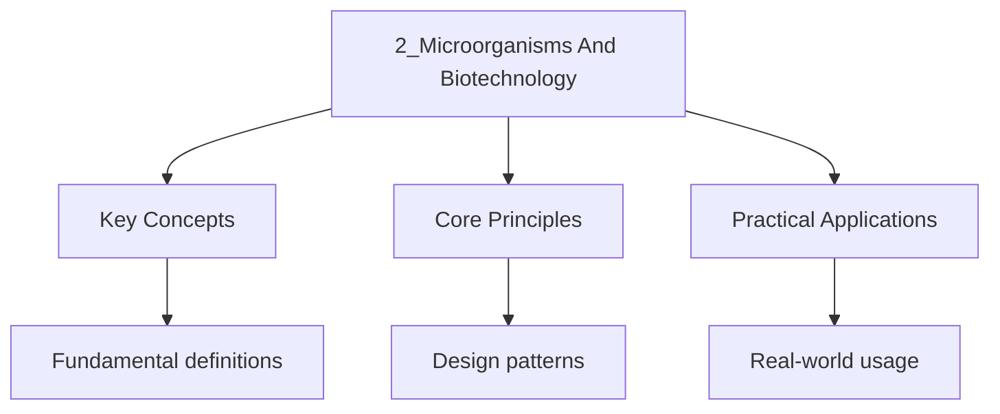

<!-- Breadcrumb Schema for SEO -->

## Classification of Microorganisms

Microorganisms are organisms that are too small to be seen with the naked eye. They are Found in all
three domains of life and include bacteria, fungi, and viruses (though viruses are not Considered
true living organisms).

### Bacteria (Prokaryotes)

**Structure:**

| Feature         | Description                                                                                |
| --------------- | ------------------------------------------------------------------------------------------ |
| Cell wall       | Made of peptidoglycan (murein); provides shape and protection                              |
| Cell membrane   | Phospholipid bilayer; controls movement of substances                                      |
| Cytoplasm       | Contains ribosomes (70S), plasmids (small circular DNA), and metabolic enzymes             |
| Nucleoid region | Contains a single, circular, naked DNA molecule (not enclosed by a nuclear envelope)       |
| Flagella        | Some bacteria have whip-like flagella for locomotion                                       |
| Pili (fimbriae) | Hair-like appendages for attachment to surfaces or conjugation                             |
| Capsule         | Some bacteria have a slimy outer layer for protection against desiccation and phagocytosis |
| Plasmids        | Small circular DNA molecules carrying additional genes (e.g., antibiotic resistance)       |

**Shapes of bacteria:**

| Shape    | Description  | Example              |
| -------- | ------------ | -------------------- |
| Cocci    | Spherical    | _Staphylococcus_     |
| Bacilli  | Rod-shaped   | _Escherichia coli_   |
| Spirilla | Spiral       | _Treponema pallidum_ |
| Vibrio   | Comma-shaped | _Vibrio cholerae_    |

**Reproduction:**

- **Binary fission (asexual):** The DNA replicates, and the cell divides into two identical daughter
  cells. This is the primary method of reproduction. Under optimal conditions (adequate nutrients,
  suitable temperature), bacteria can divide every 20 minutes.

$$1 \to 2 \to 4 \to 8 \to 16 \to \ldots \to 2^n$$

Where $n$ is the number of divisions.

**Growth curve of bacteria:**

| Phase                   | Description                                                           |
| ----------------------- | --------------------------------------------------------------------- |
| Lag phase               | Bacteria adapt to new environment; no significant growth              |
| Log (exponential) phase | Rapid cell division; population doubles at constant rate              |
| Stationary phase        | Growth rate equals death rate; nutrients become limiting              |
| Decline (death) phase   | Death rate exceeds growth rate; waste accumulates, nutrients depleted |

**Calculating bacterial population:**

If a bacterium divides every 20 minutes, after $n$ divisions:

$$\mathrm{Population} = 2^n$$

Number of divisions in time $t$ minutes:

$$n = \frac{t}{20}$$

### Fungi (Eukaryotes)

**Structure:**

- Fungi can be unicellular (yeasts) or multicellular (moulds, mushrooms)
- Multicellular fungi consist of **mycelium** -- a network of thread-like structures called
  **hyphae**
- Hyphae may be **septate** (divided by cross-walls) or **aseptate** (coenocytic -- no cross-walls)
- Cell walls are made of **chitin** (not cellulose)
- Fungi store carbohydrate as **glycogen**
- Fungi are **heterotrophic** -- they obtain nutrients by absorption (saprophytic or parasitic)

**Reproduction:**

**Asexual reproduction:**

- **Yeast:** Buds form on the parent cell; the bud grows and eventually separates
- **Moulds:** Spores are produced asexually by mitosis at the tips of specialised hyphae
  (sporangia). Spores are lightweight and dispersed by wind.

**Sexual reproduction:**

- Involves fusion of haploid nuclei from two parent hyphae
- Can involve the formation of specialised sexual structures
- Produces genetically varied spores by meiosis

### Viruses

Viruses are **not considered living organisms** because they do not carry out any life processes on
Their own. They are obligate intracellular parasites -- they can only reproduce inside a host cell.

**Structure:**

| Component             | Description                                                                        |
| --------------------- | ---------------------------------------------------------------------------------- |
| Genetic material      | Either DNA or RNA (never both); single-stranded or double-stranded                 |
| Protein coat (capsid) | Protective outer layer made of protein subunits (capsomeres)                       |
| Envelope              | Some viruses have an additional lipid envelope derived from the host cell membrane |
| Attachment proteins   | Proteins on the surface that bind to specific receptors on host cells              |

**No cellular structure:** Viruses have no cytoplasm, no ribosomes, no cell membrane, no organelles.

**Sizes:** Viruses are much smaller than bacteria, 20-400 nm (bacteria are 1-5 Micrometres).
Electron microscopy is required to visualise viruses.

**Reproduction (lytic cycle):**

1. **Attachment:** Virus attaches to specific receptor proteins on the host cell surface
2. **Injection:** Viral genetic material is injected into the host cell (or the entire virus enters)
3. **Replication:** The virus uses the host cell"s ribosomes, enzymes, and raw materials to
   replicate its genetic material and synthesise viral proteins
4. **Assembly:** New viral particles are assembled inside the host cell
5. **Release:** Host cell lyses (bursts), releasing new viruses that can infect other cells

**Lysogenic cycle (some viruses, called temperate phages):**

1. Viral DNA is inserted into the host cell's genome (becomes a **prophage**)
2. The viral DNA is replicated along with the host DNA during cell division
3. (stress), the prophage enters the lytic cycle

### Comparison of Microorganisms

| Feature      | Bacteria        | Fungi                      | Viruses                |
| ------------ | --------------- | -------------------------- | ---------------------- |
| Cell type    | Prokaryotic     | Eukaryotic                 | Acellular              |
| Nucleus      | No true nucleus | True nucleus               | None                   |
| DNA          | Circular, naked | Linear, in nucleus         | DNA or RNA             |
| Ribosomes    | 70S             | 80S                        | None                   |
| Cell wall    | Peptidoglycan   | Chitin                     | No cell wall           |
| Living?      | Yes             | Yes                        | No                     |
| Reproduction | Binary fission  | Spores, budding            | Inside host cell only  |
| Size         | 1-5 micrometres | 5-100 micrometres (hyphae) | 20-400 nm              |
| Metabolism   | Independent     | Independent                | Dependent on host cell |
| Antibiotics  | Effective       | Some effective             | Not effective          |

---

<!-- Breadcrumb Schema for SEO -->

## Useful Microorganisms

### Food Production

**Yoghurt:**

- **Microorganism:** _Lactobacillus bulgaricus_ and _Streptococcus thermophilus_
- **Process:**

1. Milk is pasteurised (heated to ~72 degrees C for 15 seconds) to kill harmful bacteria
2. Milk is cooled to ~40-45 degrees C (optimal for the bacteria)
3. Starter culture (Lactobacillus) is added
4. Bacteria ferment lactose (milk sugar) to lactic acid:
    $$\mathrm{C}_{12}\mathrm{H}_{22}\mathrm{O}_{11} \mathrm{ (lactose)} + \mathrm{H}_2\mathrm{O} \to 4\mathrm{C}_3\mathrm{H}_6\mathrm{O}_3 \mathrm{ (lactic acid)}$$
5. Lactic acid lowers the pH, causing milk proteins (casein) to coagulate, giving yoghurt its thick
    texture
6. Yoghurt is refrigerated to slow further fermentation

**Cheese:**

- **Microorganism:** _Lactobacillus_ species (for lactic acid) + rennet (enzyme from calf stomach or
  microbial source) + various moulds (e.g., _Penicillium roqueforti_ for blue cheese)
- **Process:**

1. Milk is pasteurised
2. Starter bacteria convert lactose to lactic acid
3. Rennet is added to coagulate casein (curds form)
4. Curds are cut, drained, and pressed to remove whey
5. Curds are ripened (aged) -- bacteria and moulds break down proteins and fats, developing flavour

**Bread:**

- **Microorganism:** _Saccharomyces cerevisiae_ (baker's yeast)
- **Process:**

1. Yeast is mixed with flour, water, and sugar
2. Yeast carries out **anaerobic respiration** (fermentation):
    $$\mathrm{C}_6\mathrm{H}_{12}\mathrm{O}_6 \xrightarrow{\mathrm{yeast}} 2\mathrm{C}_2\mathrm{H}_5\mathrm{OH} + 2\mathrm{CO}_2$$
3. CO$_2$ gas produced causes the dough to rise
4. The dough is baked -- alcohol evaporates, CO$_2$ expands further, setting the bread structure

**Alcohol (Beer and Wine):**

- **Microorganism:** _Saccharomyces cerevisiae_ (brewer's yeast)
- **Process:**

1. Sugars (from malted barley for beer, or grape juice for wine) are fermented by yeast
2. Yeast carries out anaerobic respiration:
    $$\mathrm{C}_6\mathrm{H}_{12}\mathrm{O}_6 \xrightarrow{\mathrm{yeast}} 2\mathrm{C}_2\mathrm{H}_5\mathrm{OH} + 2\mathrm{CO}_2$$
3. The ethanol produced is the alcohol in the beverage
4. Fermentation is carried out in anaerobic conditions (absence of oxygen)

**Biogas:**

- **Microorganism:** Methanogenic bacteria (_Methanobacterium_)
- **Process:**

1. Organic waste (manure, plant material) is placed in an anaerobic digester
2. Bacteria break down the organic matter in the absence of oxygen
3. Methane (CH$_4$) is produced as the main component of biogas
4. Biogas can be used as fuel for cooking, heating, or electricity generation
5. The remaining slurry can be used as fertiliser

### Antibiotics

**Definition:** Antibiotics are chemical substances produced by microorganisms ( fungi or Bacteria)
that kill or inhibit the growth of other microorganisms.

### Worked Example: Antibiotic Action

A student investigates the effect of two antibiotics (penicillin and streptomycin) on two species of
bacteria (_Staphylococcus aureus_ and _Escherichia coli_). The results are shown as zones of
inhibition (clear area around the antibiotic disc):

| Antibiotic   | Zone of inhibition for _S. Aureus_ (mm) | Zone of inhibition for _E. Coli_ (mm) |
| ------------ | --------------------------------------- | ------------------------------------- |
| Penicillin   | 25                                      | 0                                     |
| Streptomycin | 18                                      | 20                                    |

(a) Explain why penicillin is effective against _S. Aureus_ but not _E. Coli_.

(b) Explain why streptomycin is effective against both species.

(c) Why are antibiotics not effective against viruses?

Solution

(a) Penicillin inhibits cell wall synthesis by targeting peptidoglycan. _S. Aureus_ is a
Gram-positive bacterium with a thick peptidoglycan cell wall, making it susceptible. _E. Coli_ is a
Gram-negative bacterium with a thinner peptidoglycan layer protected by an outer membrane, which
limits penicillin's access to its target.

(b) Streptomycin inhibits protein synthesis by binding to the 30S ribosomal subunit. Both _S.
Aureus_ and _E. Coli_ have 70S ribosomes (with 30S subunits) that are the target of streptomycin.
Since all bacteria have similar ribosomes, streptomycin can affect both species.

(c) Viruses have no cell wall (so cell wall-targeting antibiotics like penicillin are irrelevant)
and no ribosomes (so protein synthesis-targeting antibiotics like streptomycin are irrelevant).
Viruses use the host cell's ribosomes and machinery to replicate. Antibiotics target
bacterial-specific structures and processes that viruses do not possess.

**Discovery:** Alexander Fleming discovered penicillin in 1928 from the mould _Penicillium notatum_.

| Antibiotic   | Source                     | Mechanism                                 |
| ------------ | -------------------------- | ----------------------------------------- |
| Penicillin   | _Penicillium_ (fungus)     | Inhibits cell wall synthesis in bacteria  |
| Streptomycin | _Streptomyces_ (bacterium) | Inhibits protein synthesis (30S ribosome) |
| Tetracycline | _Streptomyces_ (bacterium) | Inhibits protein synthesis (30S ribosome) |
| Erythromycin | _Streptomyces_ (bacterium) | Inhibits protein synthesis (50S ribosome) |

**Important notes:**

- Antibiotics are effective against **bacteria** but NOT against **viruses** (viruses have no cell
  wall and no ribosomes; they use host cell machinery)
- Misuse of antibiotics (not completing the full course, using them for viral infections)
  contributes to **antibiotic resistance**

---

<!-- Breadcrumb Schema for SEO -->

## Harmful Microorganisms

### Pathogens

A pathogen is any microorganism that causes disease. Pathogenic microorganisms include certain
Bacteria, fungi, and viruses.

### Transmission of Pathogens

| Route of Transmission | Description                                               | Example                            |
| --------------------- | --------------------------------------------------------- | ---------------------------------- |
| Direct contact        | Physical contact with an infected person                  | Skin infections, warts             |
| Droplet infection     | Coughing, sneezing releases droplets containing pathogens | Flu, TB, common cold               |
| Water-borne           | Ingestion of contaminated water                           | Cholera, typhoid                   |
| Food-borne            | Ingestion of contaminated food                            | Salmonella, E. Coli food poisoning |
| Vector-borne          | Transmitted by another organism (e.g., mosquito)          | Malaria (mosquito), Dengue         |
| Blood-borne           | Through contaminated blood or needles                     | HIV, Hepatitis B                   |
| Sexually transmitted  | Through sexual contact                                    | HIV, Syphilis, Gonorrhoea          |

### Diseases Caused by Pathogens

| Disease        | Pathogen Type | Pathogen                     | Transmission         | Prevention                                          |
| -------------- | ------------- | ---------------------------- | -------------------- | --------------------------------------------------- |
| Tuberculosis   | Bacterium     | _Mycobacterium tuberculosis_ | Droplet infection    | BCG vaccine; good ventilation                       |
| Cholera        | Bacterium     | _Vibrio cholerae_            | Water-borne          | Clean water; hygiene; oral rehydration              |
| Salmonellosis  | Bacterium     | _Salmonella_ spp.            | Food-borne           | Proper cooking; hygiene                             |
| Gonorrhoea     | Bacterium     | _Neisseria gonorrhoeae_      | Sexually transmitted | Condoms; avoid sharing needles                      |
| Influenza      | Virus         | Influenza virus              | Droplet infection    | Vaccination; hygiene                                |
| COVID-19       | Virus         | SARS-CoV-2                   | Droplet, airborne    | Vaccination; masks; hygiene                         |
| HIV/AIDS       | Virus         | Human Immunodeficiency Virus | Blood-borne, sexual  | Safe sex; avoid shared needles                      |
| Ringworm       | Fungus        | _Tinea_ species              | Direct contact       | Good hygiene; avoid sharing towels                  |
| Athlete's foot | Fungus        | _Tinea pedis_                | Direct contact       | Keep feet dry; avoid shared footwear                |
| Malaria        | Protozoan     | _Plasmodium_ (protozoan)     | Mosquito vector      | Mosquito nets; insect repellent; antimalarial drugs |

### How Pathogens Cause Disease

**Bacteria cause disease by:**

- Producing **toxins** that damage body tissues (e.g., _Vibrio cholerae_ produces an enterotoxin
  that causes water to be secreted into the intestines, leading to severe diarrhoea)
- Damaging body cells directly
- Multiplying inside the body and overwhelming the immune system

**Viruses cause disease by:**

- Invading host cells and using the cell's machinery to replicate
- Bursting host cells (lytic cycle) to release new viral particles, destroying tissues
- Triggering an immune response that itself causes damage (e.g., inflammation)

**Fungi cause disease by:**

- Producing spores that can be inhaled or contact the skin
- Growing on or in body tissues, causing damage and irritation
- Producing toxins

### Cholera as a Case Study

**Pathogen:** _Vibrio cholerae_ (bacterium)

**Transmission:** Ingestion of contaminated water or food (faecal-oral route)

**Mechanism of disease:**

1. _Vibrio cholerae_ is ingested with contaminated water
2. The bacteria survive the acidic stomach (some are killed, but not all)
3. In the small intestine, the bacteria attach to the intestinal wall and multiply
4. They produce a **cholera toxin** (enterotoxin)
5. The toxin causes chloride ion channels in the intestinal epithelial cells to remain open
6. Chloride ions (Cl$^-$) are secreted into the intestinal lumen
7. This lowers the water potential in the lumen, causing water to follow by osmosis from the blood
   and tissues into the intestine
8. Result: severe, watery diarrhoea; rapid dehydration; loss of ions (electrolytes)

**Treatment:**

- **Oral Rehydration Solution (ORS):** Contains water, glucose, and electrolytes (Na$^+$K$^+$
  Cl$^-$). The glucose is co-transported with Na$^+$ across the intestinal epithelium, and water
  follows by osmosis, rehydrating the patient.
- Intravenous drip in severe cases
- Antibiotics can reduce the duration of the illness

**Prevention:**

- Clean, treated water supply
- Proper sanitation and sewage disposal
- Good personal hygiene
- Vaccination (available but not universally used)

### Body's Defence Mechanisms

**First line of defence (non-specific):**

- **Skin:** Physical barrier; secretes sebum (antimicrobial); sweat contains lysozyme
- **Mucous membranes:** Trap pathogens; mucus in the respiratory tract traps dust and microbes
- **Cilia:** Hair-like structures in the trachea that sweep mucus upwards and outwards
- **Stomach acid:** HCl (pH ~2) kills most ingested pathogens
- **Tears:** Contain lysozyme (enzyme that breaks down bacterial cell walls)

**Second line of defence (non-specific):**

- **Phagocytosis:** Phagocytes (neutrophils, macrophages) engulf and digest pathogens

1. Phagocyte recognises the pathogen (non-self)
2. Phagocyte engulfs the pathogen by surrounding it with its membrane (forming a phagosome)
3. Lysosomes fuse with the phagosome, releasing digestive enzymes (lysozymes, proteases)
4. The pathogen is digested and destroyed

- **Inflammation:** Tissue damage triggers release of histamine, causing vasodilation and increased
  capillary permeability. More phagocytes and plasma proteins arrive at the site.

**Third line of defence (specific -- immune response):**

- **Cell-mediated immunity:** T lymphocytes destroy virus-infected cells and cancer cells
- **Humoral immunity:** B lymphocytes produce antibodies specific to the antigen

### Antibiotic Resistance

**How antibiotic resistance develops:**

1. In any bacterial population, there is genetic variation (some bacteria carry resistance genes,
   e.g., on plasmids)
2. When antibiotics are used, susceptible bacteria are killed
3. Resistant bacteria survive and reproduce
4. The resistance gene is passed on to offspring (vertical transmission) and to other bacteria via
   conjugation (horizontal transmission)
5. Over time, the resistant strain becomes dominant

**Mechanisms of resistance:**

- Production of enzymes that break down the antibiotic (e.g., beta-lactamase breaks down penicillin)
- Altering the target site of the antibiotic
- Pumping the antibiotic out of the cell (efflux pumps)
- Reducing membrane permeability to the antibiotic

**Superbugs:** Bacteria resistant to multiple antibiotics (e.g., MRSA -- Methicillin-Resistant
_Staphylococcus aureus_)

**Reducing antibiotic resistance:**

- Only use antibiotics when prescribed by a doctor
- Complete the full course of antibiotics (do not stop early even if symptoms improve)
- Do not use antibiotics for viral infections
- Develop new antibiotics
- Reduce antibiotic use in agriculture

---

<!-- Breadcrumb Schema for SEO -->

## Biotechnology

### Genetic Engineering

Genetic engineering (recombinant DNA technology) is the direct manipulation of an organism's genome
To produce desired characteristics.

**Basic process:**

1. **Isolation of the desired gene:** The gene of interest is identified and extracted from the
   donor organism's DNA using restriction enzymes (restriction endonucleases).

2. **Cutting DNA with restriction enzymes:** Restriction enzymes cut DNA at specific recognition
   sequences (palindromic sequences). For example, the enzyme EcoRI cuts at GAATTC, producing
   "sticky ends" (single-stranded overhangs).

3. **Preparing the vector:** A vector (carrier) is used to transfer the gene into the host organism.
   Common vectors include plasmids (from bacteria) and viruses. The same restriction enzyme is used
   to cut the vector, producing complementary sticky ends.

4. **Ligation:** The cut gene and cut vector are mixed. The complementary sticky ends pair up by
   hydrogen bonding. DNA ligase seals the sugar-phosphate backbone, forming a recombinant DNA
   molecule.

5. **Transformation:** The recombinant DNA is introduced into the host cell (e.g., bacterial cell).
   In bacteria, this can be done by:

- Heat shock (briefly heating cells in the presence of calcium chloride)
- Electroporation (electric pulse creates temporary pores in the cell membrane)

1. **Selection and culture:** Transformed cells are identified using marker genes (e.g., antibiotic
   resistance). Only cells that have taken up the plasmid survive on antibiotic-containing media.
   Successfully transformed cells are cultured to produce the desired product.

2. **Expression:** The host cell's machinery (ribosomes, enzymes) transcribes and translates the
   inserted gene, producing the desired protein.

### Example: Production of Human Insulin by Genetic Engineering

Before genetic engineering, insulin for diabetic patients was extracted from pig and cow pancreases.
This had issues: limited supply, allergic reactions in some patients, ethical concerns.

**Process:**

1. The human insulin gene is identified (on chromosome 11)
2. MRNA for insulin is extracted from human pancreatic cells
3. **Reverse transcriptase** enzyme is used to produce complementary DNA (cDNA) from the mRNA
4. The cDNA is cut with restriction enzymes to produce sticky ends
5. A bacterial plasmid is cut with the same restriction enzyme
6. The insulin cDNA is inserted into the plasmid using DNA ligase
7. The recombinant plasmid is introduced into _E. Coli_ bacteria by transformation
8. Transformed bacteria are selected and cultured in large fermenters
9. The bacteria produce human insulin as they grow and divide
10. Insulin is extracted, purified, and packaged for medical use

**Advantages:**

- Identical to human insulin (no immune rejection)
- Large-scale, continuous production
- Cheaper than extraction from animal sources
- No ethical issues with animal use

### Genetically Modified (GM) Crops

**What are GM crops?**

Crops that have had their genome modified by genetic engineering to introduce desirable traits.

**Examples:**

| GM Crop                      | Modification                           | Benefit                                                        |
| ---------------------------- | -------------------------------------- | -------------------------------------------------------------- |
| Bt cotton                    | Contains _Bacillus thuringiensis_ gene | Produces toxin that kills insect pests; reduces pesticide use  |
| Golden rice                  | Contains beta-carotene gene            | Produces vitamin A precursor; combats vitamin A deficiency     |
| Herbicide-resistant soybeans | Resistant to glyphosate herbicide      | Farmers can spray herbicide to kill weeds without harming crop |
| Virus-resistant papaya       | Resistant to papaya ringspot virus     | Crop is protected from viral disease                           |
| Delayed-ripening tomatoes    | Modified ripening gene                 | Longer shelf life; reduces food waste                          |

**Benefits of GM crops:**

- Increased crop yield
- Reduced pesticide use (Bt crops)
- Enhanced nutritional content (Golden rice)
- Tolerance to environmental stresses (drought, salinity)
- Disease resistance

**Concerns about GM crops:**

- Potential long-term health effects (not yet fully understood)
- Gene flow to wild relatives (creating "superweeds")
- Impact on biodiversity (monocultures; harm to non-target organisms)
- Ethical concerns about manipulating nature
- Corporate control of food supply (patents on seeds)
- Development of pest resistance (pests evolving resistance to Bt toxin)

### Cloning

**Definition:** Cloning is the production of genetically identical copies of an organism or cell.

**Types of cloning:**

**1. Natural cloning:**

- **Asexual reproduction** in bacteria (binary fission), plants (runners, tubers, bulbs), fungi
  (spores)
- **Identical twins** in humans (a single zygote splits into two)

**2. Artificial cloning in plants (tissue culture):**

1. A small piece of tissue (explant) is taken from the parent plant
2. The explant is placed on a nutrient medium containing growth hormones (auxins and cytokinins)
3. The explant develops into a mass of undifferentiated cells called a **callus**
4. The callus is transferred to a different medium that stimulates differentiation into shoots and
   roots
5. Plantlets are transferred to soil and grown into mature plants
6. All resulting plants are genetically identical to the parent (clones)

**Advantages:** Rapid propagation of desirable plants; disease-free plants; conservation of rare
Species; year-round production.

**3. Artificial cloning in animals:**

**Embryo splitting:**

- A fertilised egg (zygote) is allowed to divide into a few cells in vitro
- The cells are separated and each is implanted into a surrogate mother
- Each develops into a genetically identical offspring

**Somatic Cell Nuclear Transfer (SCNT) -- Dolly the sheep (1996):**

1. A body cell (somatic cell) is taken from the donor animal
2. The nucleus is extracted from this cell
3. An unfertilised egg cell (ovum) is taken from another animal and its nucleus is removed
   (enucleated)
4. The donor nucleus is inserted into the enucleated egg cell
5. The egg cell is stimulated (by electric shock) to divide
6. The developing embryo is implanted into a surrogate mother
7. The offspring is genetically identical to the donor of the nucleus (not the egg donor)

**Advantages of animal cloning:**

- Reproduction of animals with desirable traits (high milk yield, disease resistance)
- Conservation of endangered species
- Production of genetically identical animals for research

**Disadvantages/ethical issues:**

- Low success rate (Dolly was 1 success out of 277 attempts)
- Cloned animals may have health problems (premature aging, organ defects)
- Reduced genetic diversity
- Ethical concerns about playing God; welfare of cloned animals

### Polymerase Chain Reaction (PCR)

PCR is a laboratory technique used to amplify (make many copies of) a specific segment of DNA.

**Requirements:**

- DNA template (the DNA to be copied)
- **Taq polymerase:** A heat-stable DNA polymerase from _Thermus aquaticus_ (a bacterium from hot
  springs); synthesises new DNA strands
- **Primers:** Short, single-stranded DNA sequences that are complementary to the regions flanking
  the target DNA; they define where amplification begins
- **Free nucleotides** (dATP, dTTP, dCTP, dGTP): Building blocks for new DNA strands
- **Thermal cycler:** A machine that rapidly changes the temperature

**PCR Cycle (repeated 25-35 times):**

1. **Denaturation (94-96 degrees C):** The double-stranded DNA is heated, causing the hydrogen bonds
   between the two strands to break. The DNA separates into two single strands.

2. **Annealing (50-65 degrees C):** The temperature is lowered. Primers bind (anneal) to their
   complementary sequences on the single-stranded DNA by hydrogen bonding.

3. **Extension (72 degrees C):** Taq polymerase extends the primers by adding nucleotides in the 5'
   to 3' direction, synthesising new complementary DNA strands.

After each cycle, the amount of DNA doubles:

$$\mathrm{After } n \mathrm{ cycles: } \mathrm{Number of DNA molecules} = 2^n$$

Starting from 1 DNA molecule:

| Cycles ($n$) | DNA Molecules ($2^n$) |
| ------------ | --------------------- |
| 1            | 2                     |
| 5            | 32                    |
| 10           | 1,024                 |
| 20           | 1,048,576             |
| 30           | 1,073,741,824         |

**Applications of PCR:**

- Forensic science (amplifying DNA from tiny crime scene samples)
- Medical diagnosis (detecting pathogens, genetic disorders)
- Paternity testing
- Evolutionary biology (amplifying ancient DNA)
- Genetic fingerprinting

### Genetic Fingerprinting (DNA Profiling)

Genetic fingerprinting is a technique used to identify individuals based on their unique DNA
Pattern.

**Principle:** Non-coding regions of DNA contain repetitive sequences called **Variable Number
Tandem Repeats (VNTRs)** or **Short Tandem Repeats (STRs)**. The number of repeats at each locus
Varies between individuals.

**Process:**

1. DNA is extracted from a sample (blood, saliva, hair root)
2. PCR is used to amplify specific STR loci
3. The DNA fragments are separated by **gel electrophoresis** (smaller fragments travel further
   through the gel)
4. The resulting pattern of bands is compared between samples

**Applications:**

- Forensic identification (matching crime scene DNA to suspects)
- Paternity/maternity testing
- Identifying victims of disasters
- Establishing evolutionary relationships between species

### Ethical Issues in Biotechnology

| Issue                        | Arguments For                                  | Arguments Against                                     |
| ---------------------------- | ---------------------------------------------- | ----------------------------------------------------- |
| Genetic engineering          | Cures genetic diseases; improves crop yield    | Unforeseen consequences; playing God; designer babies |
| GM crops                     | Reduces pesticide use; solves malnutrition     | Superweeds; corporate control; unknown health risks   |
| Cloning                      | Preserves endangered species; medical research | Low success rate; animal welfare; loss of diversity   |
| Stem cell research           | Potential cures for degenerative diseases      | Destruction of embryos; alternative methods exist     |
| Genetic screening            | Early detection of diseases                    | Discrimination; psychological impact; privacy         |
| Gene therapy                 | Treats genetic disorders at source             | Somatic vs germline; off-target effects; cost         |
| Genetically modified animals | Better models for research; pharmaceuticals    | Animal welfare; environmental release concerns        |

### Worked Example: Genetic Engineering Process

A scientist wants to produce human insulin using genetically engineered _E. Coli_ bacteria.

(a) Explain why reverse transcriptase is used to obtain the insulin gene rather than cutting it
directly from human DNA.

(b) Explain the role of the plasmid in this process.

(c) How are transformed bacteria identified from non-transformed ones?

Solution

(a) Human genomic DNA contains introns (non-coding regions) that are transcribed into pre-mRNA but
are spliced out during mRNA processing. Bacteria (prokaryotes) lack the splicing machinery to remove
introns. Reverse transcriptase is used to make complementary DNA (cDNA) from mature mRNA, which
already has introns removed. The cDNA contains only exons (coding sequences) and can be directly
expressed in bacteria.

(b) The plasmid acts as a vector -- a carrier that transfers the insulin gene into the bacterial
cell. The same restriction enzyme cuts both the insulin cDNA and the plasmid, producing
complementary sticky ends. DNA ligase joins them, creating a recombinant plasmid. The plasmid also
contains a promoter sequence (so bacterial RNA polymerase can transcribe the gene) and a marker gene
(e.g., antibiotic resistance) for selection.

(c) The plasmid contains a marker gene for antibiotic resistance (e.g., ampicillin resistance).
After transformation, bacteria are grown on agar containing the antibiotic. Only bacteria that have
successfully taken up the plasmid (with the antibiotic resistance gene) survive. Non-transformed
bacteria (without the plasmid) die on the antibiotic-containing medium.

**Somatic gene therapy:** Modifying body cells to treat disease. Changes are NOT passed to
Offspring.

**Germline gene therapy:** Modifying gametes or early embryos. Changes ARE passed to offspring.
Currently not permitted in most countries due to ethical concerns.

---

<!-- Breadcrumb Schema for SEO -->

## Intuition

**Invisible allies:** Microorganisms are like tiny factories — bacteria make yogurt and antibiotics, yeasts bake bread and brew beer. Biotechnology harnesses these organisms for human benefit.

**Why it matters:** From genetic engineering to disease control, microorganisms are both tools and threats. Understanding them helps us harness their power while avoiding their dangers.

**The key insight:** Not all bacteria are harmful — most are harmless or beneficial, and our bodies contain more bacterial cells than human cells.

## Common Pitfalls

1. **Calling viruses living organisms:** Viruses are NOT alive. They do not respire, feed, excrete,
   grow, or reproduce independently. They are obligate intracellular parasites.

2. **Confusing bacteria and viruses in treatment:** Antibiotics work against bacteria, NOT viruses.
   Prescribing antibiotics for viral infections (e.g., common cold, flu) is ineffective and
   contributes to antibiotic resistance.

3. **Stating that all bacteria are harmful:** The vast majority of bacteria are harmless or
   beneficial. Fewer than 1% of bacterial species are pathogenic.

4. **Confusing fungal and bacterial cell walls:** Fungal cell walls are made of **chitin**.
   Bacterial cell walls are made of **peptidoglycan**. Plant cell walls are made of **cellulose**.
   Do not mix these up.

5. **Forgetting that viruses contain EITHER DNA OR RNA:** A virus contains one or the other, never
   both. Do not write that a virus contains "DNA and RNA."

6. **Confusing binary fission and mitosis:** Binary fission is asexual reproduction in prokaryotes.
   It is NOT the same as mitosis (which occurs in eukaryotes). Binary fission does not involve
   spindle formation or chromosomes in the same way.

7. **Stating that the insulin gene was cut directly from DNA:** In practice, the insulin gene is
   obtained from mRNA using reverse transcriptase to make cDNA. This is because eukaryotic genes
   contain introns that bacteria cannot splice out. CDNA has no introns.

8. **Confusing restriction enzymes and DNA ligase:** Restriction enzymes CUT DNA at specific
   sequences. DNA ligase JOINS DNA fragments together (seals the sugar-phosphate backbone). They
   have opposite functions.

9. **Saying PCR can amplify a whole genome:** PCR amplifies a specific segment of DNA (defined by
   the primers). It does not amplify the entire genome. Whole genome amplification uses different
   methods.

10. **Writing that Taq polymerase is from humans:** Taq polymerase is obtained from _Thermus
    aquaticus_, a thermophilic bacterium. It is used because it is heat-stable and does not denature
    at 94-96 degrees C, unlike human DNA polymerase.

---

<!-- Breadcrumb Schema for SEO -->

## Problem Set

**Problem 1:** A culture of bacteria divides by binary fission every 20 minutes. The initial
population is 500 bacteria.

(a) Calculate the population after 2 hours.

(b) Calculate the population after 3 hours.

(c) How long does it take for the population to reach 32,000?

If you get this wrong, revise: Classification of Microorganisms -- Bacteria (Reproduction; Growth
curve)

Solution

(a) Number of divisions in 2 hours (120 minutes): $n = 120 / 20 = 6$

Population = $500 \times 2^6 = 500 \times 64 = 32\,000$

(b) Number of divisions in 3 hours (180 minutes): $n = 180 / 20 = 9$

Population = $500 \times 2^9 = 500 \times 512 = 256\,000$

(c) We need $500 \times 2^n = 32\,000$

$2^n = 32\,000 / 500 = 64 = 2^6$

$n = 6$

Time = $6 \times 20 = 120$ minutes = 2 hours.

**Problem 2:** Explain how antibiotic resistance develops in a bacterial population. Use the
concepts of genetic variation, natural selection, and inheritance in your answer.

If you get this wrong, revise: Harmful Microorganisms -- Antibiotic Resistance

Solution

1. **Genetic variation:** Within any bacterial population, random mutations occur during DNA
   replication. Some bacteria may acquire a mutation that gives them resistance (e.g., a gene for
   beta-lactamase). Resistance genes can also be transferred via plasmids during conjugation.

2. **Selection pressure:** When an antibiotic is administered, it creates a selection pressure.
   Susceptible bacteria are killed or their growth is inhibited.

3. **Natural selection:** Bacteria carrying the resistance gene survive the antibiotic treatment.
   These resistant bacteria have a selective advantage and can continue to grow and reproduce.

4. **Inheritance:** Resistant bacteria reproduce by binary fission, passing the resistance gene to
   all offspring (vertical transmission). The gene can also be transferred to other bacteria via
   conjugation (horizontal transmission), spreading resistance through the population.

**Problem 3:** A scientist starts with 10 DNA molecules and runs 30 cycles of PCR.

(a) How many DNA molecules will be present after 30 cycles?

(b) If the DNA segment is 300 base pairs long, what is the total number of base pairs of amplified
DNA produced?

If you get this wrong, revise: Biotechnology -- Polymerase Chain Reaction (PCR)

Solution

(a) After 30 cycles: $N = 10 \times 2^{30} = 10 \times 1\,073\,741\,824 = 10\,737\,418\,240$ DNA
molecules

(b) Total base pairs = $10\,737\,418\,240 \times 300 = 3.221 \times 10^{12}$ base pairs

**Problem 4:** Describe the steps involved in producing human insulin using genetically engineered
bacteria. Explain why cDNA is used rather than genomic DNA.

If you get this wrong, revise: Biotechnology -- Genetic Engineering; Example: Production of Human
Insulin

Solution

1. MRNA is extracted from human pancreatic beta cells. Reverse transcriptase synthesises cDNA from
   the mRNA (removing introns).
2. The same restriction enzyme cuts both the insulin cDNA and a bacterial plasmid, producing
   complementary sticky ends.
3. DNA ligase seals the cDNA into the plasmid, creating a recombinant plasmid.
4. The recombinant plasmid is introduced into _E. Coli_ by transformation (heat shock or
   electroporation).
5. Transformed bacteria are selected using a marker gene (antibiotic resistance) on the plasmid.
6. Successfully transformed bacteria are cultured in large fermenters, producing human insulin.

CDNA is used because genomic DNA contains introns that bacteria cannot splice out. CDNA contains
only the coding sequence (exons) and can be directly expressed in bacteria.

**Problem 5:** Explain how _Vibrio cholerae_ causes severe diarrhoea and why oral rehydration
solution (ORS) is an effective treatment.

If you get this wrong, revise: Harmful Microorganisms -- Cholera as a Case Study; Body's Defence
Mechanisms

Solution

_Vibrio cholerae_ attaches to the intestinal epithelium and produces a cholera toxin. This toxin
causes chloride ion channels to remain open, leading to continuous secretion of Cl$^-$ into the
intestinal lumen. This lowers the water potential in the lumen, causing water to follow by osmosis
from the blood and tissues into the intestine. Result: severe watery diarrhoea and rapid
dehydration.

ORS is effective because it contains glucose and Na$^+$. The sodium-glucose co-transporter (SGLT1)
on intestinal epithelial cells actively co-transports Na$^+$ and glucose from the lumen into the
cell. Water follows by osmosis into the cells and then into the blood. This rehydrates the patient
even though the cholera toxin is still causing Cl$^-$ secretion.

**Problem 6:** For each of the following statements, identify whether it applies to bacteria, fungi,
or viruses: (a) Has a cell wall (b) Contains ribosomes (c) Can reproduce independently outside a
host (d) Stores genetic material as RNA (e) Has a true nucleus (f) Can be killed by antibiotics.

If you get this wrong, revise: Classification of Microorganisms -- Comparison of Microorganisms

Solution

(a) Bacteria (peptidoglycan) and fungi (chitin). Viruses have no cell wall. (b) Bacteria (70S) and
fungi (80S). Viruses have no ribosomes. (c) Bacteria and fungi. Viruses require a host cell. (d)
Viruses (some have RNA). Bacteria and fungi always have DNA. (e) Fungi only. Bacteria have a
nucleoid region; viruses have none. (f) Bacteria only. Fungi are treated with antifungals; viruses
are unaffected by antibiotics.

**Problem 7:** A country is considering allowing cultivation of Bt cotton. Discuss two benefits and
two risks.

If you get this wrong, revise: Biotechnology -- Genetically Modified (GM) Crops

Solution

**Benefits:**

1. Reduced pesticide use: Bt cotton produces its own Bt toxin, reducing chemical sprays. This lowers
   costs and reduces environmental harm to non-target organisms.
2. Increased yield: By reducing pest damage, crop yields are higher and more reliable, increasing
   farmer income.

**Risks:**

1. Development of resistance: Bollworm populations may evolve resistance to Bt toxin, rendering the
   crop ineffective (similar to antibiotic resistance).
2. Gene flow: The Bt gene could transfer to wild relatives through cross-pollination, potentially
   creating "superweeds" that harm non-target insects.

**Problem 8:** Compare natural cloning, plant tissue culture cloning, and animal cloning by nuclear
transfer. Give one advantage and one disadvantage of each.

If you get this wrong, revise: Biotechnology -- Cloning

Solution

**Natural cloning (asexual reproduction):** Advantage: Rapid population increase (no mate needed).
Disadvantage: No genetic variation, so the population is vulnerable to the same disease.

**Plant tissue culture:** Advantage: Large numbers of identical, disease-free plants can be produced
quickly. Disadvantage: All plants are genetically identical (same disease susceptibility); requires
sterile lab conditions.

**Animal cloning (SCNT):** Advantage: Can reproduce animals with desirable traits; could help
conserve endangered species. Disadvantage: Very low success rate; cloned animals often have health
problems; ethical concerns about animal welfare.

**Problem 9:** Explain the lytic cycle of a bacteriophage. Why are viruses not considered living
organisms?

If you get this wrong, revise: Classification of Microorganisms -- Viruses (Reproduction; Comparison
table)

Solution

**Lytic cycle:**

1. **Attachment:** The bacteriophage attaches to specific receptor proteins on the bacterial cell
   surface.
2. **Injection:** Viral DNA is injected into the host cell.
3. **Replication:** The virus uses the host cell's ribosomes, enzymes, and raw materials to
   replicate its DNA and synthesise viral proteins.
4. **Assembly:** New viral particles are assembled inside the host cell.
5. **Release:** The host cell lyses (bursts), releasing new phages that infect other cells.

**Viruses are not living** because they do not carry out any life processes independently: they do
not respire, feed, grow, excrete, or reproduce on their own. They are obligate intracellular
parasites that can only replicate inside a host cell, using the host's machinery.

**Problem 10:** Describe how yoghurt is produced, naming the microorganism involved and the chemical
change that occurs.

If you get this wrong, revise: Useful Microorganisms -- Food Production (Yoghurt)

Solution

Yoghurt is produced using _Lactobacillus bulgaricus_ and _Streptococcus thermophilus_. The process:

1. Milk is pasteurised (heated to ~72 degrees C for 15 seconds) to kill harmful bacteria.
2. Milk is cooled to ~40-45 degrees C (optimal for the bacteria).
3. Starter culture is added.
4. The bacteria ferment lactose (milk sugar) to lactic acid. The chemical equation: lactose + H$_2$O
   $\to$ 4 lactic acid.
5. Lactic acid lowers the pH, causing milk proteins (casein) to coagulate, giving yoghurt its thick
   texture.
6. Yoghurt is refrigerated to slow further fermentation.

---

<!-- Breadcrumb Schema for SEO -->

## Industrial Microbiology

### Industrial Production Using Microorganisms

Microorganisms are used in large-scale industrial processes to produce a wide range of products. The
key advantages of using microorganisms include: rapid growth, easy cultivation, ability to use cheap
raw materials, and the production of valuable metabolites.

### Fermentation Technology

**Batch fermentation:**

- All nutrients (substrate) are added at the beginning
- Microorganisms grow through lag phase, exponential phase, stationary phase, and death phase
- Products are harvested at the end of the process
- The fermenter is cleaned and sterilised before the next batch
- Advantages: simple; suitable for small-scale production; easy to control contamination
- Disadvantages: downtime between batches; lower productivity; conditions change over time (nutrient
  depletion, waste accumulation)

**Continuous fermentation:**

- Nutrients are continuously added, and products are continuously removed
- Microorganisms are maintained in the exponential (log) phase of growth, maximising productivity
- Advantages: higher productivity; no downtime; consistent product quality
- Disadvantages: risk of contamination over long periods; difficult to maintain optimal conditions;
  mutations can reduce product quality over time

**Primary vs Secondary Metabolites:**

| Type                  | Description                                                                                     | Production Phase      | Examples                                                   |
| --------------------- | ----------------------------------------------------------------------------------------------- | --------------------- | ---------------------------------------------------------- |
| Primary metabolites   | Substances produced during active growth (exponential phase); essential for growth and survival | Exponential/log phase | Amino acids, ethanol, organic acids (citric acid), enzymes |
| Secondary metabolites | Substances produced after the main growth phase (stationary phase); not essential for growth    | Stationary phase      | Antibiotics (penicillin), pigments, toxins                 |

### Antibiotic Production: Penicillin

Penicillin is produced by the fungus _Penicillium chrysogenum_ in a **fed-batch fermentation**
process.

**Process:**

1. _Penicillium chrysogenum_ is grown in a large fermenter (stainless steel vessel, 50,000-200,000
   dm$^3$) containing a sterile nutrient medium (sugar, nitrogen source, minerals)
2. The fermenter is continuously stirred and aerated to ensure even distribution of nutrients and
   oxygen
3. Temperature is maintained at approximately 25-27 degrees C (optimal for fungal growth and
   penicillin production)
4. PH is maintained at approximately 6.5-7.0 by adding acid or alkali
5. During the exponential growth phase, the fungus grows rapidly but produces little penicillin
   (primary metabolism)
6. After the growth phase, when nutrients begin to deplete, the fungus switches to secondary
   metabolism and begins producing penicillin
7. Glucose is fed in slowly (fed-batch): high glucose concentrations repress penicillin production,
   so glucose is added gradually to maintain a low but steady concentration
8. The fermentation runs for approximately 6-8 days
9. Penicillin is extracted from the filtrate using solvent extraction or ion-exchange chromatography

**Key points for DSE:**

- Penicillin is a **secondary metabolite** -- it is produced during the stationary phase, not during
  active growth
- High glucose concentration represses penicillin synthesis (catabolite repression), so glucose is
  added slowly (fed-batch)
- The process requires aseptic (sterile) conditions to prevent contamination by other microorganisms

### Enzyme Production Using Microorganisms

Microorganisms are the main source of industrial enzymes because they can be cultured in large
quantities and their enzyme production can be optimised through genetic modification and selection.

| Enzyme         | Source Microorganism                              | Industrial Application                                                                                                         |
| -------------- | ------------------------------------------------- | ------------------------------------------------------------------------------------------------------------------------------ |
| Proteases      | _Bacillus subtilis_, _Bacillus licheniformis_     | Biological detergents (break down protein stains); food processing (tenderising meat, cheese making)                           |
| Amylases       | _Bacillus amyloliquefaciens_, _Aspergillus niger_ | Starch processing (convert starch to sugars); brewing; baking (improve dough quality)                                          |
| Lipases        | _Candida rugosa_, _Thermomyces lanuginosus_       | Biological detergents (break down fat stains); food processing (flavour development in cheese)                                 |
| Pectinases     | _Aspergillus niger_                               | Fruit juice clarification (break down pectin, which causes cloudiness)                                                         |
| Lactase        | _Kluyveromyces lactis_                            | Production of lactose-free milk for lactose-intolerant individuals                                                             |
| Cellulases     | _Trichoderma reesei_                              | Biofuel production (break down cellulose in plant biomass to glucose for fermentation); textile industry (stone-washing denim) |
| Taq polymerase | _Thermus aquaticus_                               | PCR (polymerase chain reaction) -- heat-stable DNA polymerase that can withstand the high temperatures of PCR cycles           |

### Bioremediation

Bioremediation is the use of microorganisms to clean up contaminated environments (soil, water).

| Application           | Microorganism                       | Mechanism                                                                                                               |
| --------------------- | ----------------------------------- | ----------------------------------------------------------------------------------------------------------------------- |
| Oil spill cleanup     | _Pseudomonas putida_, _Alcanivorax_ | Break down hydrocarbons in crude oil into less harmful substances; can be enhanced by adding nutrients (biostimulation) |
| Heavy metal removal   | _Pseudomonas_, _Bacillus_           | Accumulate heavy metals (lead, cadmium, mercury) from contaminated soil and water                                       |
| Sewage treatment      | Mixed microbial communities         | Break down organic matter in wastewater through aerobic and anaerobic processes                                         |
| Pesticide degradation | _Pseudomonas_, _Bacillus_           | Produce enzymes that degrade organophosphate and carbamate pesticides                                                   |
| Plastic degradation   | _Ideonella sakaiensis_              | Produces PETase enzyme that breaks down PET plastic into monomers                                                       |

---

<!-- Breadcrumb Schema for SEO -->

## Antibiotic Resistance: Detailed Mechanisms

### How Bacteria Become Resistant

| Mechanism              | Molecular Basis                                                                                                           | Antibiotic Affected                                                      |
| ---------------------- | ------------------------------------------------------------------------------------------------------------------------- | ------------------------------------------------------------------------ |
| Enzymatic inactivation | Bacteria produce enzymes that chemically modify or destroy the antibiotic molecule                                        | Beta-lactamase breaks down penicillin                                    |
| Target modification    | Mutations alter the molecular target of the antibiotic (e.g., altered ribosomes, altered penicillin-binding proteins)     | MRSA (altered PBP2a); rifampicin resistance (altered RNA polymerase)     |
| Efflux pumps           | Membrane proteins actively pump the antibiotic out of the cell, reducing its intracellular concentration                  | Tetracycline resistance; multi-drug resistance in Gram-negative bacteria |
| Reduced permeability   | Mutations reduce the number or size of porins in the outer membrane, limiting antibiotic entry                            | Gram-negative resistance to beta-lactams and quinolones                  |
| Biofilm formation      | Bacteria embedded in a protective extracellular matrix; reduced penetration of antibiotics and reduced metabolic activity | Chronic infections; catheter-associated infections                       |

### Horizontal Gene Transfer of Resistance

Antibiotic resistance genes can spread between bacteria of different species through horizontal gene
transfer, much faster than vertical transmission (parent to offspring via binary fission).

| Method         | Description                                                                                                                  |
| -------------- | ---------------------------------------------------------------------------------------------------------------------------- |
| Conjugation    | Direct transfer of plasmids (circular DNA carrying resistance genes) between two bacteria connected by a pilus               |
| Transformation | Uptake of free DNA from the environment (released when bacteria die); the DNA may contain resistance genes                   |
| Transduction   | Bacteriophages (viruses) carry bacterial DNA from one cell to another during infection; the DNA may include resistance genes |

**Plasmids** are particularly important in the spread of antibiotic resistance because:

- They can carry multiple resistance genes at once (multi-drug resistance)
- They can be transferred between different species of bacteria via conjugation
- They replicate independently of the bacterial chromosome, so they are maintained even without
  selection pressure (though there is a metabolic cost)

---

<!-- Breadcrumb Schema for SEO -->

## Additional Problem Set

**Problem 11:** Describe the process of penicillin production by _Penicillium chrysogenum_ in a
fermenter. Explain why glucose is added slowly (fed-batch) rather than all at once.

If you get this wrong, revise: Industrial Microbiology -- Antibiotic Production

Solution

_Penicillium chrysogenum_ is cultured in a large stirred-tank fermenter with controlled conditions
(temperature 25-27 degrees C, pH 6.5-7.0, continuous aeration and stirring). During the exponential
growth phase, the fungus grows rapidly but produces little penicillin. Once growth slows and
nutrients deplete (stationary phase), the fungus switches to secondary metabolism and begins
producing penicillin.

Glucose is added slowly (fed-batch) because high glucose concentrations repress penicillin
biosynthesis through catabolite repression. When glucose is abundant, the fungus preferentially uses
it for growth and does not produce secondary metabolites. By adding glucose gradually, the glucose
concentration is maintained at a low level that supports fungal metabolism without repressing
penicillin synthesis. This maximises penicillin yield. The fed-batch approach also allows the
fermentation to be run for longer (6-8 days) compared to a simple batch process, further increasing
total production.

**Problem 12:** Explain how bacteria can become resistant to the antibiotic penicillin through (a)
the production of beta-lactamase and (b) alteration of penicillin-binding proteins. Describe how
resistance genes can spread between different species of bacteria.

If you get this wrong, revise: Antibiotic Resistance -- Detailed Mechanisms

Solution

(a) **Beta-lactamase production:** A mutation in the bacterial genome (or acquisition of a plasmid
carrying the bla gene) enables the bacterium to produce the enzyme beta-lactamase. This enzyme
hydrolyses the beta-lactam ring in penicillin, rendering the antibiotic inactive. The modified
penicillin molecule can no longer bind to its target and is excreted from the cell. The bacterium
survives despite the presence of the antibiotic.

(b) **Altered penicillin-binding proteins (PBPs):** Penicillin normally works by binding to PBPs on
the bacterial cell membrane, inhibiting the transpeptidase enzyme that cross-links peptidoglycan
during cell wall synthesis. A mutation in the gene encoding PBPs can alter the protein's shape,
reducing penicillin's ability to bind. The transpeptidase continues to function, allowing the
bacterium to synthesise its cell wall normally even in the presence of penicillin. This is the
mechanism of MRSA resistance.

**Horizontal gene transfer:** Resistance genes can spread between different bacterial species
through:

- **Conjugation:** A plasmid carrying resistance genes is transferred through a pilus from a donor
  bacterium to a recipient
- **Transformation:** Free DNA containing resistance genes (released from dead bacteria) is taken up
  by competent bacteria
- **Transduction:** A bacteriophage transfers bacterial DNA (including resistance genes) from one
  bacterium to another during infection

These mechanisms allow resistance to spread much more rapidly than vertical transmission alone
(binary fission), creating multi-drug-resistant strains that pose serious public health threats.

---

<!-- Breadcrumb Schema for SEO -->

---

<!-- Breadcrumb Schema for SEO -->

## Genetic Engineering: Detailed Techniques

### Restriction Enzymes

Restriction endonucleases are enzymes that cut DNA at specific recognition sequences ( 4-8 base
pairs long). They are essential tools in genetic engineering because they allow precise cutting of
DNA at known locations.

| Feature              | Description                                                                                                          |
| -------------------- | -------------------------------------------------------------------------------------------------------------------- |
| Recognition sequence | A specific palindromic DNA sequence (reads the same 5' to 3' on both strands)                                        |
| Cut type             | Most produce "sticky ends" (single-stranded overhangs); some produce "blunt ends" (cut straight across both strands) |
| EcoRI example        | Recognition sequence: GAATTC; cuts between G and A on both strands, producing sticky ends with 5' overhangs of AATT  |
| Specificity          | Each enzyme recognises only one specific sequence; over 3,000 different restriction enzymes have been identified     |

**Sticky ends vs blunt ends:**

- **Sticky ends:** The single-stranded overhangs are complementary between fragments cut with the
  same enzyme. This allows DNA fragments from different sources to be joined together because the
  complementary bases pair by hydrogen bonding. Sticky ends are preferred in genetic engineering
  because they allow directional insertion (the DNA can only be inserted in one orientation).
- **Blunt ends:** Both strands are cut at the same position. Blunt ends can be joined to any other
  blunt end (regardless of the enzyme used), but this is less efficient and allows insertion in
  either orientation.

### DNA Ligase

DNA ligase joins DNA fragments by catalysing the formation of phosphodiester bonds between adjacent
nucleotides. It is used to:

- Join the target gene into the plasmid vector after both have been cut with the same restriction
  enzyme
- Seal nicks in the sugar-phosphate backbone of DNA

### Polymerase Chain Reaction (PCR)

PCR is a technique for amplifying a specific segment of DNA exponentially, producing millions of
copies from a tiny starting sample.

**Requirements:**

- **Template DNA:** The DNA containing the target sequence to be amplified
- **Primers:** Two short single-stranded DNA sequences (15-30 bases each) that are complementary to
  the regions flanking the target sequence on opposite strands. Forward primer binds to the start of
  the target; reverse primer binds to the complementary strand at the end of the target
- **Taq polymerase:** A heat-stable DNA polymerase from _Thermus aquaticus_ (a bacterium living in
  hot springs). It can withstand the high temperatures (95 degrees C) used in PCR without denaturing
- **Free nucleotides:** dATP, dTTP, dCTP, dGTP (the building blocks for DNA synthesis)
- **Buffer:** Contains Mg$^{2+}$ ions (cofactor for Taq polymerase) and optimal pH

**PCR cycle (repeated 25-35 times):**

1. **Denaturation (95 degrees C, 30 seconds):** The double-stranded DNA template is heated to
   separate it into two single strands
2. **Annealing (55-65 degrees C, 30 seconds):** The temperature is lowered to allow primers to bind
   (anneal) to their complementary sequences on the single-stranded template by hydrogen bonding
3. **Extension (72 degrees C, 30-60 seconds):** Taq polymerase synthesises new DNA strands from the
   primers, using the template as a guide. The rate is approximately 1000 bases per minute

**After n cycles:** $2^n$ copies of the target sequence are produced (assuming 100% efficiency).

**Applications of PCR:**

| Application          | Description                                                                                                  |
| -------------------- | ------------------------------------------------------------------------------------------------------------ |
| Forensic science     | Amplifying DNA from tiny blood samples or hair follicles for DNA fingerprinting and criminal identification  |
| Medical diagnosis    | Detecting pathogen DNA in patient samples (e.g., HIV, tuberculosis, COVID-19)                                |
| Genetic testing      | Detecting genetic mutations associated with inherited diseases (e.g., cystic fibrosis, Huntington's disease) |
| Evolutionary biology | Amplifying ancient DNA from fossils; comparing DNA sequences between species                                 |
| Paternity testing    | Comparing DNA profiles between child, mother, and alleged father                                             |
| Gene cloning         | Amplifying a specific gene for insertion into a vector                                                       |

### Gel Electrophoresis

Gel electrophoresis separates DNA fragments by size. DNA is negatively charged (due to phosphate
groups) and moves towards the positive electrode.

**Process:**

1. DNA samples are cut with restriction enzymes, producing fragments of different lengths
2. DNA fragments are loaded into wells in an agarose gel
3. An electric current is applied across the gel
4. DNA fragments migrate through the gel towards the positive electrode
5. Smaller fragments move faster and further; larger fragments move slower and less far
6. The DNA is visualised by staining with a fluorescent dye (e.g., ethidium bromide) and viewing
   under UV light

**Applications:**

- **DNA fingerprinting:** Comparing the banding patterns of DNA fragments between individuals. Every
  individual (except identical twins) has a unique DNA profile due to variations in non-coding DNA
  (short tandem repeats, STRs)
- **PCR product verification:** Confirming that PCR amplified the correct size fragment
- **Analysing genetic disorders:** Identifying the presence or absence of specific alleles

### Worked Example: Genetic Engineering -- Producing Human Insulin in Bacteria

Describe the steps involved in producing human insulin using genetic engineering, explaining why
each step is necessary.

Solution

1. **Isolation of the insulin gene:** mRNA for human insulin is extracted from pancreatic beta
   cells. Reverse transcriptase is used to make complementary DNA (cDNA) from the mRNA. CDNA is used
   instead of genomic DNA because eukaryotic genes contain introns, and bacteria cannot remove
   introns (they lack spliceosomes). If genomic DNA were used, the protein produced would include
   intron-encoded amino acids and would be non-functional.

2. **Cutting the DNA:** The insulin cDNA and a plasmid vector are both cut with the same restriction
   enzyme (e.g., EcoRI). This produces complementary sticky ends on both the cDNA and the plasmid.

3. **Ligation:** DNA ligase joins the insulin cDNA into the plasmid by catalysing phosphodiester
   bonds between the sticky ends, creating a recombinant plasmid.

4. **Transformation:** The recombinant plasmid is introduced into _E. Coli_ bacteria by making the
   bacterial cells permeable (using heat shock or electroporation). Not all bacteria take up the
   plasmid.

5. **Selection:** Bacteria that took up the plasmid are selected using an antibiotic resistance
   marker gene on the plasmid. When grown on agar containing the antibiotic, only transformed
   bacteria (with the plasmid) survive.

6. **Culture and expression:** Transformed bacteria are grown in large fermenters. They transcribe
   and translate the insulin gene, producing human insulin (as proinsulin, which is later processed
   to active insulin).

7. **Purification:** Insulin is extracted from the bacterial culture and purified for medical use.

---

<!-- Breadcrumb Schema for SEO -->

## The Carbon Cycle and Microorganisms

### Role of Microorganisms in Carbon Cycling

| Process           | Microorganisms Involved                 | Description                                                                                                                                                                                                                    |
| ----------------- | --------------------------------------- | ------------------------------------------------------------------------------------------------------------------------------------------------------------------------------------------------------------------------------ |
| Decomposition     | Bacteria and fungi (saprotrophs)        | Break down dead organic matter (plants, animals, waste); release CO$_2$ through respiration; recycle carbon and nutrients back into the ecosystem                                                                              |
| Carbon fixation   | Cyanobacteria; chemosynthetic bacteria  | Convert inorganic carbon (CO$_2$ or bicarbonate) into organic compounds                                                                                                                                                        |
| Methanogenesis    | Methanogenic archaea (strict anaerobes) | Produce methane (CH$_4$) from organic matter in anaerobic environments (wetlands, rice paddies, landfill sites, guts of ruminants); methane is a potent greenhouse gas (25x more warming potential than CO$_2$ over 100 years) |
| Methane oxidation | Methanotrophic bacteria                 | Oxidise methane (CH$_4$) to CO$_2$ and water in aerobic environments (soil, water); help to mitigate methane emissions                                                                                                         |

### Decomposition in Detail

Decomposition is the breakdown of dead organic matter by decomposers (bacteria and fungi). The rate
of decomposition depends on:

| Factor                    | Faster Decomposition                                             | Slower Decomposition                                                                                                                          |
| ------------------------- | ---------------------------------------------------------------- | --------------------------------------------------------------------------------------------------------------------------------------------- |
| Temperature               | Warm (higher enzyme activity)                                    | Cold (lower enzyme activity)                                                                                                                  |
| Moisture                  | Damp (provides medium for enzyme activity and decomposer growth) | Dry (decomposers need water; desert conditions slow decomposition)                                                                            |
| Oxygen                    | Aerobic (aerobic decomposers are more efficient)                 | Anaerobic (slower; produces methane instead of CO$_2$)                                                                                        |
| C:N ratio of the material | Low (nitrogen-rich material, e.g., fresh grass)                  | High (carbon-rich material, e.g., wood, autumn leaves); the material is tough and low in nitrogen (a limiting nutrient for decomposer growth) |
| Surface area              | Large (e.g., cut or shredded material)                           | Small (e.g., whole logs)                                                                                                                      |

**Compost production:** A practical application of decomposition. Organic waste (food scraps, garden
waste) is piled in a compost heap; bacteria and fungi decompose the organic matter, producing a
nutrient-rich compost that can be used as fertiliser. Regular turning of the heap introduces oxygen
(promoting aerobic decomposition) and speeds up the process.

---

<!-- Breadcrumb Schema for SEO -->

## Antibiotics: Mechanisms and Resistance in Detail

### Mechanisms of Action

| Mechanism                   | Description                                                                                                                                      | Example                                                                                                                               |
| --------------------------- | ------------------------------------------------------------------------------------------------------------------------------------------------ | ------------------------------------------------------------------------------------------------------------------------------------- |
| Inhibit cell wall synthesis | Interfere with the synthesis of peptidoglycan; weaken the cell wall; the bacterium bursts due to osmotic pressure (only affect growing bacteria) | Penicillin (binds to and inhibits transpeptidase enzymes that cross-link peptidoglycan); vancomycin; cephalosporins                   |
| Inhibit protein synthesis   | Bind to bacterial 70S ribosomes (which differ from eukaryotic 80S ribosomes) and interfere with translation                                      | Tetracycline (binds to 30S subunit, prevents tRNA binding); erythromycin (binds to 50S subunit, prevents translocation); streptomycin |
| Inhibit DNA replication     | Interfere with DNA gyrase (topoisomerase II) which is needed for DNA supercoiling during replication                                             | Ciprofloxacin; nalidixic acid                                                                                                         |
| Disrupt cell membrane       | Insert into the bacterial cell membrane, forming pores that cause leakage of cellular contents                                                   | Polymyxin B (binds to lipopolysaccharide in Gram-negative outer membrane)                                                             |
| Inhibit metabolic pathways  | Act as antimetabolites (structural analogues of essential metabolites); competitively inhibit enzymes in metabolic pathways                      | Sulfonamides (competitive inhibitors of dihydropteroate synthase, blocking folate synthesis); trimethoprim                            |

### Antibiotic Spectrum

| Type            | Description                                                                                  | Example                                                                            |
| --------------- | -------------------------------------------------------------------------------------------- | ---------------------------------------------------------------------------------- |
| Narrow-spectrum | Effective against only a limited range of bacteria (specific Gram-positive or Gram-negative) | Penicillin V (Gram-positive); vancomycin (Gram-positive); isoniazid (mycobacteria) |
| Broad-spectrum  | Effective against a wide range of bacteria (both Gram-positive and Gram-negative)            | Tetracycline; ampicillin; ciprofloxacin; chloramphenicol                           |

### Why Antibiotics Do Not Affect Viruses

| Reason                        | Explanation                                                                                                                                                          |
| ----------------------------- | -------------------------------------------------------------------------------------------------------------------------------------------------------------------- |
| No cell wall                  | Many antibiotics target bacterial cell wall synthesis; viruses have no cell wall (they have a protein capsid, not peptidoglycan)                                     |
| No ribosomes                  | Many antibiotics target bacterial 70S ribosomes; viruses do not have ribosomes (they use the host cell's ribosomes to translate their mRNA)                          |
| No independent metabolism     | Many antibiotics target bacterial metabolic pathways; viruses have no metabolism of their own (they rely entirely on the host cell's metabolic machinery)            |
| Viruses are inside host cells | Viruses replicate inside host cells; an antibiotic that interferes with viral replication would also need to affect the host cell, causing unacceptable side effects |

---

<!-- Breadcrumb Schema for SEO -->

## Biotechnology in Agriculture

### Genetically Modified (GM) Crops

| Crop                             | Modification                                                                                                               | Benefit                                                                                       | Controversy                                                                                      |
| -------------------------------- | -------------------------------------------------------------------------------------------------------------------------- | --------------------------------------------------------------------------------------------- | ------------------------------------------------------------------------------------------------ |
| Bt maize / Bt cotton             | Gene from _Bacillus thuringiensis_ inserted; plant produces Bt toxin protein that kills insect pests (lepidopteran larvae) | Reduced need for chemical insecticides; higher yields                                         | Potential harm to non-target insects (e.g., butterflies); development of resistance in pests     |
| Golden Rice                      | Genes for beta-carotene synthesis inserted; rice grains produce beta-carotene (precursor of vitamin A)                     | Addresses vitamin A deficiency in developing countries (a major cause of childhood blindness) | Intellectual property concerns; acceptance by local communities; long-term environmental effects |
| Roundup Ready soybeans           | Gene for glyphosate resistance inserted (EPSPS enzyme); crop can be sprayed with glyphosate herbicide without being killed | Simplifies weed control; higher yields                                                        | Development of herbicide-resistant weeds ("superweeds"); dependence on single herbicide company  |
| Virus-resistant papaya           | Gene from papaya ringspot virus inserted; plant is resistant to the virus                                                  | Saved the Hawaiian papaya industry from ringspot virus                                        | Public concern about eating viral genes                                                          |
| Herbicide-resistant oilseed rape | Modified to be resistant to specific herbicides                                                                            | Easier weed management in crop fields                                                         | Gene flow to wild relatives; creation of "superweeds"                                            |

### Methods of Introducing Genes into Plants

| Method                                | Description                                                                                                                                                                                                                                                                                  |
| ------------------------------------- | -------------------------------------------------------------------------------------------------------------------------------------------------------------------------------------------------------------------------------------------------------------------------------------------- |
| Agrobacterium-mediated transformation | _Agrobacterium tumefaciens_ is a soil bacterium that transfers a segment of its Ti (tumour-inducing) plasmid (T-DNA) into plant cells, causing crown gall disease. Scientists replace the tumour-causing genes with the desired gene and use the bacterium as a natural gene delivery vector |
| Biolistics (gene gun)                 | Microscopic gold or tungsten particles coated with DNA are fired at high speed into plant cells using a gene gun; some particles penetrate the nucleus and the DNA is incorporated into the plant genome                                                                                     |
| Protoplast transformation             | The plant cell wall is removed (using cellulase enzyme) to create protoplasts; DNA is introduced using electroporation or PEG (polyethylene glycol); the cell wall is then regenerated                                                                                                       |

---

<!-- Breadcrumb Schema for SEO -->

## Common Pitfalls

- **Antibiotics are produced by MICROORGANISMS, not by pharmaceutical companies from scratch.** Most
  antibiotics are derived from fungi (e.g., penicillin from _Penicillium_) or bacteria (e.g.,
  streptomycin from _Streptomyces_). Pharmaceutical companies isolate, purify, and mass-produce them
- **Broad-spectrum antibiotics kill BOTH Gram-positive and Gram-negative bacteria, including
  beneficial bacteria in the gut.** This can cause diarrhoea and secondary infections (e.g.,
  _Clostridium difficile_ infection). Narrow-spectrum antibiotics target specific bacteria and cause
  less disruption to the normal microbiome
- **Antibiotic resistance is a NATURAL phenomenon accelerated by human activity.** Resistance genes
  exist in soil bacteria (they produce antibiotics to compete with other bacteria and need
  resistance genes to protect themselves). Overuse and misuse of antibiotics in medicine and
  agriculture SELECT for resistant bacteria, increasing the frequency of resistance genes in the
  population
- **Bt crops produce the Bt toxin protein, NOT live bacteria.** The plant cells synthesise the Bt
  protein from the inserted bacterial gene. When an insect eats the plant tissue, the toxin is
  activated in the insect's alkaline gut and kills the insect by forming pores in its gut lining**
  :::tip
<strong>Diagnostic Test</strong>
:::tip Tip Ready to test your understanding of **Microorganisms and Biotechnology\*\*? The contains the
  hardest questions within the DSE specification for this topic, each with a full worked solution.

**Unit tests** probe edge cases and common misconceptions. **Integration tests** combine
Microorganisms and Biotechnology with other biology topics to test synthesis under exam conditions.

See for instructions on
self-marking and building a personal test matrix.

---

<!-- Breadcrumb Schema for SEO -->

## Industrial Biotechnology Applications
:::

### Bioremediation

Bioremediation is the use of microorganisms (bacteria, fungi, algae) to break down or remove
environmental pollutants.

| Type                       | Description                                                                                  | Example                                                                                                     |
| -------------------------- | -------------------------------------------------------------------------------------------- | ----------------------------------------------------------------------------------------------------------- |
| **In situ** bioremediation | Treatment occurs at the site of contamination without excavating the polluted material       | Adding nutrients (bio-stimulation) or microorganisms (bio-augmentation) to contaminated soil or groundwater |
| **Ex situ** bioremediation | Contaminated material is excavated and treated elsewhere (e.g., in a bioreactor or landfill) | Contaminated soil is removed and treated in a controlled facility                                           |

| Pollutant             | Microorganism Used           | Mechanism                                                                                                          |
| --------------------- | ---------------------------- | ------------------------------------------------------------------------------------------------------------------ |
| Oil spills            | _Pseudomonas_, _Alcanivorax_ | Hydrocarbon-degrading bacteria break down oil components into less harmful substances                              |
| Heavy metals          | Certain bacteria, fungi      | Microorganisms can accumulate, transform, or immobilise heavy metals (e.g., reducing Cr(VI) to less toxic Cr(III)) |
| Pesticides            | Various soil bacteria        | Enzymes produced by bacteria break down pesticide molecules                                                        |
| Sewage and wastewater | Mixed microbial communities  | Aerobic and anaerobic bacteria break down organic matter in sewage treatment plants                                |
| Plastic degradation   | _Ideonella sakaiensis_       | Bacterium discovered in 2016 that can break down PET (polyethylene terephthalate) plastic using PETase enzymes     |

### Biofuels

| Biofuel          | Source Material               | Description                                                                                                                 | Advantages                                                          | Disadvantages                                                   |
| ---------------- | ----------------------------- | --------------------------------------------------------------------------------------------------------------------------- | ------------------------------------------------------------------- | --------------------------------------------------------------- |
| Bioethanol       | Sugarcane, maize, wheat       | Produced by yeast fermentation of sugars; can be blended with petrol or used pure (E85)                                     | Renewable; reduces CO2 emissions                                    | Competes with food production; lower energy density than petrol |
| Biodiesel        | Vegetable oils, animal fats   | Produced by transesterification of oils with methanol; can be used in diesel engines                                        | Renewable; biodegradable                                            | Competes with food production; higher NOx emissions             |
| Biogas (methane) | Organic waste, manure, sewage | Produced by anaerobic digestion of organic matter by methanogenic archaea; used for heating and electricity generation      | Uses waste materials; reduces landfill                              | Lower energy density; methane leaks are potent greenhouse gas   |
| Biobutanol       | Sugarcane, maize, cellulose   | Produced by bacterial fermentation (e.g., _Clostridium acetobutylicum_); can be used in petrol engines without modification | Higher energy density than ethanol; can use existing infrastructure | More expensive to produce; less efficient fermentation          |

### Biotechnology in Medicine

| Application           | Description                                                                                                                               | Example                                                                                       |
| --------------------- | ----------------------------------------------------------------------------------------------------------------------------------------- | --------------------------------------------------------------------------------------------- |
| Recombinant insulin   | Human insulin gene inserted into _E. Coli_ or yeast; bacteria/yeast produce human insulin for diabetics                                   | Humulin (recombinant human insulin)                                                           |
| Recombinant vaccines  | Pathogen antigens produced by genetically modified organisms; safer than live attenuated vaccines                                         | Hepatitis B vaccine (yeast-produced surface antigen); HPV vaccine                             |
| Monoclonal antibodies | Identical antibodies produced by a single clone of B cells (hybridoma technology); used in diagnosis, cancer therapy, autoimmune diseases | Trastuzumab (breast cancer); adalimumab (rheumatoid arthritis); rapid COVID-19 antigen tests  |
| Gene therapy          | Functional copies of a defective gene are delivered to a patient's cells using a viral vector                                             | Treatment of severe combined immunodeficiency (SCID); retinal dystrophy                       |
| Stem cell therapy     | Embryonic or adult stem cells are used to replace damaged or diseased cells and tissues                                                   | Bone marrow transplants for leukaemia; potential for treating Parkinson's, spinal cord injury |
| PCR in diagnosis      | Polymerase chain reaction used to amplify and detect pathogen DNA in patient samples                                                      | COVID-19 testing; HIV viral load testing; genetic disease screening                           |
| ELISA                 | Enzyme-linked immunosorbent assay; uses antibodies and enzymes to detect specific antigens or antibodies in blood samples                 | HIV testing; pregnancy testing (hCG detection); COVID-19 antibody testing                     |

### Monoclonal Antibody Production (Hybridoma Method)

1. **Immunisation:** A mouse is injected with the target antigen, stimulating B cells to produce
   antibodies against it
2. **B cell extraction:** B cells are removed from the mouse's spleen
3. **Cell fusion:** The B cells are fused with **myeloma cells** (cancerous B cells that divide
   indefinitely) using polyethylene glycol (PEG) or electrofusion
4. **Hybridoma cells:** The fused cells are called hybridomas; they combine the antibody-producing
   ability of B cells with the immortality of myeloma cells
5. **Selection:** Cells are grown in HAT medium -- only hybridoma cells survive (unfused B cells die
   ; unfused myeloma cells are killed by the HAT medium because they lack the enzyme HGPRT)
6. **Screening:** Individual hybridoma cells are cultured separately and tested to identify those
   producing the desired antibody
7. **Cloning:** The selected hybridoma is cloned to produce a large population of identical cells,
   all producing the same monoclonal antibody
8. **Large-scale production:** The hybridoma cells are grown in large bioreactors; antibodies are
   harvested from the culture medium

---

<!-- Breadcrumb Schema for SEO -->

## Microbiology Techniques

### Aseptic Technique

Aseptic technique is essential when working with microorganisms in the laboratory to prevent
contamination of cultures and protect the operator from potentially pathogenic organisms.

| Technique                      | Description                                                                                                                   | Purpose                                                                         |
| ------------------------------ | ----------------------------------------------------------------------------------------------------------------------------- | ------------------------------------------------------------------------------- |
| Flaming the loop               | The inoculating loop is heated until it glows red hot in a Bunsen burner flame                                                | Sterilises the loop before and after use                                        |
| Working near a Bunsen flame    | All procedures are carried out close to the upward current of hot air created by a Bunsen burner                              | Creates a sterile zone; airborne contaminants are drawn away from the work area |
| Sterilising equipment          | Petri dishes, pipettes, and culture media are sterilised by autoclaving (high-pressure steam at 121 degrees C for 15 minutes) | Kills all microorganisms including endospores                                   |
| Opening Petri dishes minimally | Petri dish lids are only partially lifted and never placed face-down on the bench                                             | Prevents airborne contamination of the agar surface                             |
| Disinfecting surfaces          | The bench surface is wiped with 70% ethanol before and after the procedure                                                    | Kills any microorganisms on the bench                                           |

### Growing Microorganisms in Culture

| Component             | Description                                                                                                                                 |
| --------------------- | ------------------------------------------------------------------------------------------------------------------------------------------- | ---------------------------------------------------------------------- |
| Culture medium        | Contains nutrients required for microbial growth (carbohydrates, nitrogen source, minerals, vitamins)                                       |
| Agar                  | A polysaccharide derived from seaweed; used as a solidifying agent in culture media; melts at ~85 degrees C and solidifies at ~42 degrees C |
| Nutrient broth        | Liquid culture medium; used for growing large numbers of bacteria in suspension                                                             |
| Nutrient agar         | Solid culture medium in Petri dishes; used for obtaining isolated colonies of bacteria                                                      |
| Selective media       | Contains substances that inhibit the growth of certain microorganisms while allowing others to grow                                         | MacConkey agar (inhibits Gram-positive bacteria; allows Gram-negative) |
| Differential media    | Contains indicators that allow different types of microorganisms to be distinguished by their appearance                                    | Blood agar (differentiates bacteria by haemolysis patterns)            |
| Incubation            | Cultures are incubated at 25-30 degrees C (for environmental bacteria) or 37 degrees C (for human pathogens) for 24-48 hours                |
| Inverted Petri dishes | Cultured plates are stored upside down to prevent condensation from dripping onto the agar surface                                          |

### Measuring Bacterial Growth

| Method                             | Description                                                                                                                                        | Advantages                                              | Disadvantages                                                                               |
| ---------------------------------- | -------------------------------------------------------------------------------------------------------------------------------------------------- | ------------------------------------------------------- | ------------------------------------------------------------------------------------------- |
| **Direct count** (microscopy)      | Counting bacteria in a known volume under a microscope using a haemocytometer (counting chamber)                                                   | Quick; does not require incubation                      | Cannot distinguish living from dead cells                                                   |
| **Viable count** (colony counting) | Diluting a sample, spreading it on agar plates, incubating, and counting the colonies that grow (each colony originates from a single living cell) | Only counts living (viable) cells; widely used          | Requires incubation time (24-48 hours); colonies may not be visible if very small           |
| **Turbidity** (optical density)    | Measuring the cloudiness (turbidity) of a liquid culture using a spectrophotometer -- more cells = more turbid                                     | Quick; non-destructive; can monitor growth continuously | Cannot distinguish living from dead cells; less accurate at very low or very high densities |
| **Dry mass**                       | Filtering a known volume of culture, drying the filter paper and cells, and weighing                                                               | Direct measurement of biomass                           | Destructive; time-consuming; cannot monitor same culture continuously                       |

### Bacterial Growth Curve

| Phase                       | Description                                                                                                                                      | Rate of Division | Rate of Death |
| --------------------------- | ------------------------------------------------------------------------------------------------------------------------------------------------ | ---------------- | ------------- |
| **Lag phase**               | Bacteria are adapting to the new environment; synthesising enzymes and other molecules needed for growth; no significant increase in cell number | Low/zero         | Low           |
| **Exponential (log) phase** | Bacteria are dividing at their maximum rate; population doubles at regular intervals (generation time)                                           | Maximum          | Low           |
| **Stationary phase**        | Growth rate equals death rate; nutrients are becoming depleted; toxic waste products are accumulating; population size stabilises                | Decreasing       | Increasing    |
| **Death (decline) phase**   | Death rate exceeds growth rate; nutrients exhausted; toxic waste products at high levels; population declines                                    | Near zero        | High          |

---

<!-- Breadcrumb Schema for SEO -->

## Common Pitfalls

- **Antibiotics are produced by microorganisms, NOT by the human body.** Penicillin is produced by
  the fungus _Penicocillium_; streptomycin by _Streptomyces_
- **Antibiotics target bacterial cells, NOT viruses.** Viruses have no cell walls, ribosomes, or
  metabolic processes that antibiotics can target. Taking antibiotics for a viral infection is
  ineffective and contributes to antibiotic resistance
- **Bacteriostatic antibiotics STOP bacterial growth (do not kill); bactericidal antibiotics KILL
  bacteria.** Knowing the difference is important for treating immunocompromised patients (who need
  bactericidal antibiotics since their immune system cannot finish the job)\*\*
- **In PCR, the enzyme used is Taq polymerase (from _Thermus aquaticus_), NOT DNA polymerase from
  human cells.** Taq polymerase is heat-stable and does not denature at the high temperatures (95
  degrees C) used in PCR\*\*
- **Restriction enzymes cut DNA at specific recognition sequences, producing either blunt ends or
  sticky ends.** Sticky ends (with single-stranded overhangs) are more useful in genetic engineering
  because they facilitate the joining of DNA fragments from different sources\*\*
- **In bioremediation, "in situ" means treating the pollution on-site, NOT in a laboratory or
  bioreactor.** "Ex situ" means removing the contaminated material for treatment elsewhere\*\* :::

## Summary

key concepts, experimental evidence, and real-world applications.

> > > > > > > Stashed changes:docs/docs_dse/Biology/microorganisms-and-biotechnology.md

**Key concepts include:**

- Mendelian inheritance
- gene expression and regulation
- mutations and genetic variation
- genetic engineering (PCR, gel electrophoresis)
- genome projects

Success requires the ability to recall specific factual content, apply knowledge to novel scenarios,
and evaluate experimental evidence critically.

> > > > > > > Stashed changes:docs/docs_dse/Biology/microorganisms-and-biotechnology.md

## Worked Examples

Worked examples demonstrating the application of key concepts are covered in the detailed sub-pages
linked above.
:::

## Cross-References

- **[Cell Biology](../cell-biology):** Cell biology is foundational
- **[Genetics](../../../../../../alevel/src/content/docs/biology/diagnostics/diag-genetics-dna):** Genetics studies heredity
- **[Ecology](../../../../../../alevel/src/content/docs/biology/ecology):** Ecology studies environments
