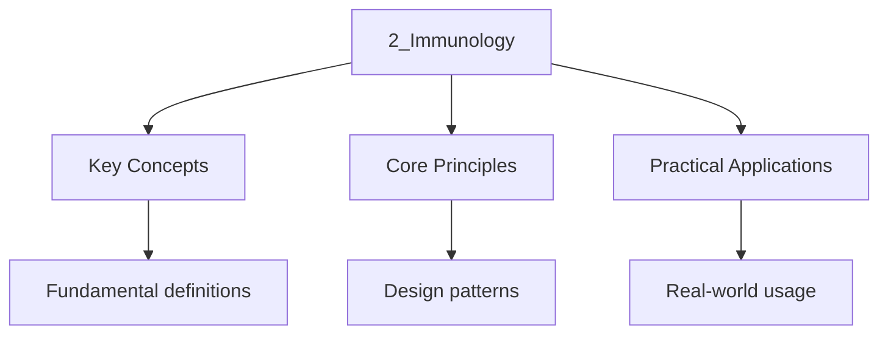

<!-- Breadcrumb Schema for SEO -->

## Pathogens

### Types of Pathogens

A pathogen is any organism or agent that can cause disease. The DSE specification requires knowledge
of four main types of pathogen.

| Pathogen Type | Structure                                                                                                                | Examples of Diseases                                       | Key Features                                                                                                                                 |
| ------------- | ------------------------------------------------------------------------------------------------------------------------ | ---------------------------------------------------------- | -------------------------------------------------------------------------------------------------------------------------------------------- |
| Bacteria      | Prokaryotic cells; no nucleus; cell wall (peptidoglycan); single circular chromosome; 70S ribosomes; plasmids            | Cholera, tuberculosis, gonorrhoea, tetanus, syphilis       | Reproduce by binary fission (rapid, every 20 min); produce toxins (endotoxins and exotoxins); most are free-living; treated with antibiotics |
| Viruses       | Non-cellular; protein coat (capsid) surrounding nucleic acid (DNA or RNA); no ribosomes; no metabolism; no cell membrane | Influenza, HIV/AIDS, COVID-19, measles, polio, HPV         | Obligate intracellular parasites; replicate inside host cells using host machinery; not affected by antibiotics                              |
| Fungi         | Eukaryotic; chitin cell wall; true nucleus; 80S ribosomes; can be unicellular (yeasts) or multicellular (moulds)         | Athlete"s foot, ringworm, thrush (Candida)                 | Reproduce by spores; saprotrophic nutrition; treated with antifungal drugs                                                                   |
| Protozoa      | Eukaryotic; unicellular; no cell wall; true nucleus; some have flagella or cilia                                         | Malaria (Plasmodium), amoebic dysentery, sleeping sickness | Often have complex life cycles involving multiple hosts; transmitted by vectors (e.g., mosquitoes for malaria)                               |

### How Pathogens Cause Disease

Pathogens cause disease through several mechanisms:

**1. Production of toxins:**

| Toxin Type | Description                                                                                                                          | Example                                                             |
| ---------- | ------------------------------------------------------------------------------------------------------------------------------------ | ------------------------------------------------------------------- |
| Exotoxins  | Secreted by living bacteria into the surrounding environment; highly potent; specific targets (nerves, cells, etc.)                  | Tetanus toxin (Clostridium tetani); cholera toxin (Vibrio cholerae) |
| Endotoxins | Components of the outer membrane of Gram-negative bacteria; released when bacteria die; less potent but cause fever and inflammation | Lipopolysaccharide (LPS) from Salmonella, E. Coli                   |

**2. Cell damage:**

- Viruses replicate inside host cells, causing cell lysis and tissue damage
- Some bacteria produce enzymes that damage host tissues (e.g., hyaluronidase, which breaks down
  connective tissue, facilitating spread)
- Protozoa such as _Plasmodium_ destroy red blood cells during their life cycle

**3. Host immune response:**

- The symptoms of many diseases (fever, inflammation, tissue damage) are caused by the body's own
  immune response, not directly by the pathogen
- For example, the severe lung damage in severe influenza is largely caused by an overactive immune
  response (cytokine storm)

### Transmission of Pathogens

| Transmission Route  | Description                                                                 | Example                                                          |
| ------------------- | --------------------------------------------------------------------------- | ---------------------------------------------------------------- |
| Direct contact      | Physical contact with an infected person (skin, bodily fluids)              | Herpes simplex, HIV, HPV                                         |
| Droplet infection   | Coughing, sneezing, talking expels droplets containing pathogens            | Influenza, common cold, COVID-19, tuberculosis                   |
| Water-borne         | Ingestion of contaminated water                                             | Cholera, typhoid, amoebic dysentery                              |
| Food-borne          | Ingestion of contaminated food (undercooked meat, unwashed vegetables)      | Salmonella, E. Coli O157, botulism                               |
| Vector-borne        | Transmission by an insect or other animal vector                            | Malaria (mosquito), dengue fever (mosquito), Lyme disease (tick) |
| Fomite transmission | Transfer via contaminated objects (door handles, towels, medical equipment) | Common cold viruses, MRSA                                        |
| Blood-borne         | Transfer through blood or blood products                                    | HIV, Hepatitis B and C                                           |

---

<!-- Breadcrumb Schema for SEO -->

## Innate (Non-Specific) Immunity

### First Line of Defence: Physical and Chemical Barriers

The body's first line of defence prevents pathogens from entering the body.

| Barrier                   | Mechanism                                                                                                                                                                 |
| ------------------------- | ------------------------------------------------------------------------------------------------------------------------------------------------------------------------- |
| Skin                      | Physical barrier; keratinised outer layer (epidermis) is tough and water.../1-number-and-algebra/3_proof-and-logic; sebaceous glands secrete sebum (antimicrobial lipids) |
| Mucous membranes          | Line respiratory, digestive, and reproductive tracts; trap pathogens in sticky mucus                                                                                      |
| Cilia                     | Microscopic hair-like structures in the respiratory tract; move mucus (with trapped pathogens) upwards and out of the airways                                             |
| Stomach acid              | Hydrochloric acid (HCl) in the stomach (pH ~2) denatures proteins in pathogens and destroys most ingested bacteria                                                        |
| Tears and saliva          | Contain **lysozyme**, an enzyme that breaks down peptidoglycan in bacterial cell walls, causing lysis                                                                     |
| Ear wax (cerumen)         | Traps pathogens and insects; contains antimicrobial properties                                                                                                            |
| Vaginal secretions        | Slightly acidic (pH ~4) due to lactic acid production by _Lactobacillus_; inhibits growth of many pathogens                                                               |
| Normal flora (microbiome) | Commensal bacteria on the skin and in the gut compete with pathogens for nutrients and space; some produce antimicrobial substances                                       |

### Second Line of Defence: Internal Defences

If pathogens breach the first line of defence, the second line provides a rapid, non-specific
response.

**1. Phagocytosis:**

Phagocytes (neutrophils and macrophages) are white blood cells that engulf and destroy pathogens.

| Phagocyte Type | Source                           | Location                                    | Characteristics                                                                                                                      |
| -------------- | -------------------------------- | ------------------------------------------- | ------------------------------------------------------------------------------------------------------------------------------------ |
| Neutrophils    | Bone marrow; short-lived (hours) | Blood; recruited to infection sites         | Most abundant phagocyte; first to arrive at infection; multi-lobed nucleus; granules contain digestive enzymes                       |
| Macrophages    | Derived from monocytes           | Tissues (liver, lungs, lymph nodes, spleen) | Larger and longer-lived than neutrophils; can present antigens to T cells (antigen-presenting cells); important in adaptive immunity |

**Stages of phagocytosis:**

1. **Chemotaxis:** Phagocytes are attracted to the site of infection by chemical signals released by
   pathogens and damaged cells (e.g., cytokines, bacterial products)
2. **Recognition:** Phagocyte receptors bind to molecules on the pathogen surface. Non-self
   molecules that trigger an immune response are called **antigens**. Phagocytes can also bind to
   pathogens that have been opsonised (coated with antibodies or complement proteins)
3. **Engulfment:** The phagocyte extends pseudopodia around the pathogen, enclosing it in a
   membrane-bound vesicle called a **phagosome**
4. **Digestion:** The phagosome fuses with a lysosome (containing digestive enzymes: lysozyme,
   proteases, lipases) to form a **phagolysosome**. Enzymes break down the pathogen
5. **Exocytosis:** Indigestible material is expelled from the cell by exocytosis

**2. Inflammation:**

Inflammation is a localised response to tissue damage or infection. Its purpose is to isolate and
destroy pathogens, remove damaged tissue, and initiate tissue repair.

**The four cardinal signs of inflammation:**

| Sign     | Mechanism                                                                                                       |
| -------- | --------------------------------------------------------------------------------------------------------------- |
| Redness  | Vasodilation increases blood flow to the area                                                                   |
| Heat     | Increased blood flow brings warm blood from the body core to the surface                                        |
| Swelling | Increased permeability of capillary walls allows plasma proteins and fluid to leak into the tissue (oedema)     |
| Pain     | Swelling compresses nerve endings; inflammatory chemicals (prostaglandins, bradykinin) stimulate pain receptors |

**Sequence of events:**

1. Tissue damage releases chemical mediators (histamine from mast cells, prostaglandins, cytokines)
2. Histamine causes vasodilation and increased capillary permeability
3. More blood flows to the area, bringing phagocytes (neutrophils first, then macrophages)
4. Fluid and proteins leak into the tissue, causing swelling and helping to dilute toxins
5. Phagocytes engulf and destroy pathogens
6. Fibrin forms a clot around the area, walling off the infection

**3. Fever (pyrexia):**

- Macrophages release cytokines called **pyrogens** that travel to the hypothalamus
- Pyrogens raise the hypothalamic set point, causing body temperature to increase
- Higher temperature inhibits pathogen growth (many pathogens grow best at 37 degrees C)
- Higher temperature increases metabolic rate, speeding up immune responses and tissue repair
- Extremely high fever (above 41 degrees C) is dangerous because it denatures human enzymes

**4. Interferons:**

- Proteins produced by virus-infected cells
- They diffuse to neighbouring cells and stimulate them to produce antiviral proteins
- These antiviral proteins inhibit viral replication by degrading viral mRNA and blocking
  translation
- Interferons are NOT virus-specific -- they provide broad-spectrum antiviral defence

---

<!-- Breadcrumb Schema for SEO -->

## Adaptive (Specific) Immunity

### Overview

Adaptive immunity is a specific response to a particular pathogen. It is slower than innate immunity
(takes several days to develop) but provides long-lasting protection through **immunological
memory**.

Two types of adaptive immunity:

| Type                   | Cells Involved          | Target                                                            | Mechanism                                                                                           |
| ---------------------- | ----------------------- | ----------------------------------------------------------------- | --------------------------------------------------------------------------------------------------- |
| Cell-mediated immunity | T lymphocytes (T cells) | Body's own cells that are infected, cancerous, or transplanted    | Cytotoxic T cells directly destroy abnormal cells; T helper cells coordinate the immune response    |
| Humoral immunity       | B lymphocytes (B cells) | Extracellular pathogens (bacteria, viruses outside cells, toxins) | B cells differentiate into plasma cells that secrete antibodies specific to the pathogen's antigens |

### Antigens

An **antigen** is any molecule that can trigger an immune response. Most antigens are proteins or
glycoproteins on the surface of pathogens.

- **Self-antigens:** Molecules on the surface of the body's own cells that are recognised as "self."
  These do NOT normally trigger an immune response.
- **Non-self antigens:** Molecules on the surface of pathogens or foreign cells that are recognised
  as "non-self." These DO trigger an immune response.
- **Allergens:** Harmless antigens (e.g., pollen, dust mite faeces, peanut proteins) that trigger an
  exaggerated immune response in sensitised individuals.

### T Lymphocytes (T Cells)

T cells originate in the bone marrow but mature in the **thymus gland**.

| T Cell Type                          | Function                                                                                                                                          | Surface Marker |
| ------------------------------------ | ------------------------------------------------------------------------------------------------------------------------------------------------- | -------------- |
| T helper cells ($\mathrm{CD4}^+$)    | Release cytokines that stimulate B cells to differentiate into plasma cells and memory cells; activate cytotoxic T cells and macrophages          | CD4            |
| Cytotoxic T cells ($\mathrm{CD8}^+$) | Directly destroy virus-infected cells and cancer cells by inducing apoptosis (programmed cell death); recognise antigens presented on MHC class I | CD8            |
| Memory T cells                       | Long-lived; provide rapid secondary response upon re-exposure to the same antigen                                                                 | --             |
| Regulatory T cells (Tregs)           | Suppress immune responses; prevent autoimmune reactions; maintain tolerance to self-antigens                                                      | CD4, CD25      |

**T cell activation:**

1. **Antigen presentation:** Antigen-presenting cells (macrophages, dendritic cells, B cells) engulf
   pathogens, process their antigens, and display the antigens on their cell surface using **MHC
   class II** molecules
2. **Recognition:** A T helper cell with the specific receptor for that antigen binds to the
   antigen-MHC complex
3. **Co-stimulation:** A second signal (from co-stimulatory molecules on the APC) is required to
   fully activate the T helper cell
4. **Clonal expansion:** The activated T helper cell divides by mitosis, producing many identical
   copies (clones) with the same antigen-specific receptor
5. **Effector function:** The cloned T helper cells release cytokines that activate B cells and
   cytotoxic T cells

**Cytotoxic T cell action against virus-infected cells:**

1. Virus-infected cells display viral antigens on their surface using **MHC class I** molecules
2. A cytotoxic T cell with the matching receptor binds to the antigen-MHC I complex
3. The cytotoxic T cell releases **perforin**, which forms pores in the target cell membrane
4. **Granzymes** (enzymes) enter through the pores and activate **caspases**, which trigger
   apoptosis (programmed cell death)
5. The virus inside the cell is destroyed along with the cell

### B Lymphocytes (B Cells)

B cells originate and mature in the **bone marrow**.

**B cell activation and antibody production:**

1. **Antigen recognition:** A B cell with the specific surface receptor (membrane-bound antibody)
   binds to a free antigen
2. **Antigen internalisation:** The B cell internalises the antigen and displays it on its surface
   using MHC class II
3. **T helper cell interaction:** An activated T helper cell with the matching receptor binds to the
   B cell's antigen-MHC complex and releases cytokines
4. **Clonal expansion:** The B cell divides by mitosis, producing many identical clones
5. **Differentiation:** Most clones differentiate into **plasma cells** (short-lived, secrete large
   quantities of antibodies); some differentiate into **memory B cells** (long-lived, provide
   immunological memory)

### Antibodies (Immunoglobulins)

**Structure of an antibody:**

An antibody is a Y-shaped protein (immunoglobulin) composed of:

- **Two identical heavy chains** (longer polypeptide chains)
- **Two identical light chains** (shorter polypeptide chains)
- **Variable regions** (at the tips of the Y): unique to each antibody type; determine which antigen
  the antibody can bind to (complementary shape)
- **Constant regions** (stem and base of the Y): the same for all antibodies of the same class;
  determine the antibody's effector function
- **Hinge region:** allows flexibility, enabling the antibody to bind to antigens at different
  distances

**How antibodies work:**

| Mechanism             | Description                                                                                                                                                                                                 |
| --------------------- | ----------------------------------------------------------------------------------------------------------------------------------------------------------------------------------------------------------- |
| Neutralisation        | Antibodies bind to the surface antigens of pathogens or toxins, blocking their ability to bind to host cells or enter tissues                                                                               |
| Agglutination         | Antibodies bind to multiple pathogens, clumping them together. This prevents them from spreading and makes it easier for phagocytes to engulf multiple pathogens at once                                    |
| Opsonisation          | Antibodies coat the surface of pathogens, marking them for phagocytosis. Phagocytes have receptors for the constant region of antibodies                                                                    |
| Complement activation | Antibodies bound to pathogens trigger the complement system -- a cascade of proteins that: (a) form membrane attack complexes (MAC) that lyse pathogens, (b) enhance inflammation, (c) promote opsonisation |
| Precipitation         | Antibodies bind to soluble antigens (toxins), forming insoluble complexes that precipitate out of solution and are cleared by phagocytes                                                                    |

### Primary and Secondary Immune Responses

| Feature        | Primary Response                                               | Secondary Response                              |
| -------------- | -------------------------------------------------------------- | ----------------------------------------------- |
| Trigger        | First exposure to an antigen                                   | Subsequent exposure to the SAME antigen         |
| Speed          | Slow: 5-10 days before antibody production peaks               | Fast: 1-3 days before antibody production peaks |
| Antibody level | Lower peak                                                     | Much higher peak (10-100 times primary)         |
| Antibody class | Mainly IgM initially, then IgG                                 | Mainly IgG (rapid, large-scale production)      |
| Duration       | Short-lived (weeks)                                            | Long-lived (months to years)                    |
| Cells involved | Naive B cells and T cells                                      | Memory B cells and memory T cells               |
| Result         | Symptoms of disease may develop before immunity is established | no symptoms; pathogen destroyed rapidly         |

**Immunological memory:** After the primary response, memory B cells and memory T cells persist in
the body for years or even a lifetime. Upon re-exposure to the same antigen, memory cells rapidly
divide and differentiate into effector cells, producing a faster, stronger, and longer-lasting
secondary response.

---

<!-- Breadcrumb Schema for SEO -->

## Vaccination

### Principles of Vaccination

Vaccination exploits the immune system's ability to develop immunological memory. By exposing the
body to a harmless form of a pathogen (or its antigens), vaccination stimulates a primary immune
response, producing memory cells without causing the disease.

**Types of vaccine:**

| Vaccine Type          | Description                                                                                                 | Examples                                          |
| --------------------- | ----------------------------------------------------------------------------------------------------------- | ------------------------------------------------- |
| Live attenuated       | Weakened (attenuated) form of the pathogen; can replicate but does not cause disease in healthy individuals | MMR (measles, mumps, rubella); BCG (tuberculosis) |
| Inactivated (killed)  | Dead pathogen; cannot replicate; generally requires booster doses                                           | Influenza; polio (Salk vaccine); rabies           |
| Toxoid                | Inactivated toxin; stimulates antibody production against the toxin                                         | Tetanus; diphtheria                               |
| Subunit (recombinant) | Specific antigenic proteins from the pathogen                                                               | HPV vaccine; Hepatitis B; COVID-19 (subunit)      |
| mRNA                  | Messenger RNA that instructs cells to produce the pathogen's antigen                                        | COVID-19 (Pfizer-BioNTech, Moderna)               |
| Viral vector          | Harmless virus engineered to carry genes for the pathogen's antigen                                         | COVID-19 (Oxford-AstraZeneca, Janssen)            |

### Herd Immunity

If a large proportion of a population is immune to a disease (through vaccination or previous
infection), the spread of the pathogen is significantly reduced because there are fewer susceptible
hosts. This provides indirect protection to individuals who are not immune (e.g., newborns,
immunocompromised individuals).

**Herd immunity threshold:**

$$\text{Threshold} = \left(1 - \frac{1}{R_0}\right) \times 100\%$$

Where $R_0$ is the basic reproduction number (average number of secondary infections produced by one
infected individual in a fully susceptible population).

| Disease            | $R_0$ | Herd Immunity Threshold |
| ------------------ | ----- | ----------------------- |
| Measles            | 12-18 | 92-94%                  |
| Polio              | 5-7   | 80-86%                  |
| COVID-19 (Omicron) | 8-12  | 87-92%                  |
| Seasonal flu       | 1.5-3 | 33-67%                  |

### Advantages and Risks of Vaccination

| Advantages                                      | Risks and Limitations                                                                                |
| ----------------------------------------------- | ---------------------------------------------------------------------------------------------------- |
| Provides individual immunity                    | Rare adverse reactions (allergic reactions, fever)                                                   |
| Protects vulnerable individuals (herd immunity) | Some vaccines require multiple doses (boosters)                                                      |
| Eliminates or eradicates diseases               | Not 100% effective in all individuals                                                                |
| Cost-effective compared to treating disease     | Vaccine hesitancy and misinformation can reduce uptake                                               |
| Reduces antibiotic resistance                   | Antigenic variation (mutations) in pathogens may require updated vaccines (e.g., annual flu vaccine) |

---

<!-- Breadcrumb Schema for SEO -->

## Immune System Disorders

### Autoimmune Diseases

In autoimmune diseases, the immune system mistakenly attacks the body's own tissues (self-antigens),
failing to distinguish between self and non-self.

| Disease                 | Target Tissue/Cells                                | Symptoms                                                                            |
| ----------------------- | -------------------------------------------------- | ----------------------------------------------------------------------------------- |
| Type 1 diabetes         | $\beta$ cells of the islets of Langerhans          | Destruction of $\beta$ cells; no insulin production; hyperglycaemia                 |
| Rheumatoid arthritis    | Synovial membranes of joints                       | Joint inflammation, pain, swelling, cartilage destruction, deformity                |
| Multiple sclerosis (MS) | Myelin sheath of neurons in the CNS                | Demyelination; impaired nerve conduction; muscle weakness, vision problems          |
| Lupus (SLE)             | Connective tissue, skin, kidneys, joints           | Butterfly rash, joint pain, kidney damage, fatigue                                  |
| Myasthenia gravis       | Acetylcholine receptors at neuromuscular junctions | Muscle weakness that worsens with activity; drooping eyelids, difficulty swallowing |
| Coeliac disease         | Villi of the small intestine (triggered by gluten) | Damage to intestinal villi; malabsorption; diarrhoea, weight loss                   |

**Possible causes of autoimmune disease:**

- Genetic predisposition (certain HLA genes are associated with autoimmune conditions)
- Environmental triggers (infections, stress, hormones)
- Molecular mimicry: some pathogens have antigens similar to self-antigens; antibodies produced
  against the pathogen cross-react with the body's own tissues

### Allergies (Hypersensitivity)

An allergy is an exaggerated immune response to a harmless antigen (allergen). The most common type
is **Type I hypersensitivity** (IgE-mediated).

**Mechanism of an allergic response:**

1. **Sensitisation (first exposure):** The allergen enters the body for the first time. B cells
   produce IgE antibodies against the allergen. IgE binds to the surface of **mast cells** (in
   connective tissue) and **basophils** (in blood).
2. **Re-exposure:** Upon subsequent exposure, the allergen binds to the IgE antibodies on mast
   cells, cross-linking them.
3. **Degranulation:** The mast cells release histamine and other inflammatory mediators
   (degranulation).
4. **Symptoms:** Histamine causes vasodilation, increased capillary permeability (swelling), mucus
   production, and smooth muscle contraction (bronchoconstriction).

| Allergic Condition            | Symptoms                                                                                 |
| ----------------------------- | ---------------------------------------------------------------------------------------- |
| Hay fever (allergic rhinitis) | Sneezing, runny nose, itchy eyes, nasal congestion (pollen allergen)                     |
| Asthma                        | Wheezing, difficulty breathing, bronchoconstriction (dust mites, pollen, pet dander)     |
| Anaphylaxis                   | Life-threatening: airway constriction, drop in blood pressure, swelling of tongue/throat |
| Eczema (atopic dermatitis)    | Red, itchy, inflamed skin                                                                |
| Food allergy                  | Hives, swelling, gastrointestinal symptoms, anaphylaxis (peanuts, shellfish, eggs)       |

**Treatment of allergies:**

- **Antihistamines:** Block histamine receptors, reducing symptoms
- **Adrenaline (epinephrine):** Used for anaphylaxis -- constricts blood vessels, opens airways,
  increases heart rate
- **Corticosteroids:** Reduce inflammation
- **Desensitisation (immunotherapy):** Gradual exposure to increasing doses of the allergen to
  induce tolerance (shifts immune response from IgE to IgG)

### HIV/AIDS

**Human Immunodeficiency Virus (HIV):**

| Feature            | Description                                                                                                               |
| ------------------ | ------------------------------------------------------------------------------------------------------------------------- |
| Pathogen type      | Retrovirus (RNA virus) that carries reverse transcriptase                                                                 |
| Target cells       | T helper cells ($\mathrm{CD4}^+$ T cells) -- the cells that coordinate the immune response                                |
| Transmission       | Unprotected sexual contact; contaminated blood products; sharing needles; mother-to-child (during birth or breastfeeding) |
| Not transmitted by | Casual contact, hugging, sharing utensils, mosquito bites                                                                 |

**HIV lifecycle:**

1. HIV binds to CD4 receptors and co-receptors (CCR5 or CXCR4) on T helper cells
2. The viral envelope fuses with the host cell membrane
3. Viral RNA and reverse transcriptase enter the cell
4. Reverse transcriptase converts viral RNA into viral DNA
5. Viral DNA is integrated into the host cell's genome by **integrase**
6. The host cell uses its own machinery to transcribe and translate the viral genes, producing new
   viral proteins
7. New viral particles are assembled and bud from the cell membrane, acquiring an envelope
8. The new viruses infect other T helper cells

**Stages of HIV infection:**

| Stage            | Description                                                                                                                                                                             |
| ---------------- | --------------------------------------------------------------------------------------------------------------------------------------------------------------------------------------- |
| Acute infection  | 2-4 weeks after exposure; flu-like symptoms; high viral load; T helper cell count drops briefly then partially recovers                                                                 |
| Clinical latency | May last 8-10 years; no symptoms; virus replicates slowly; T helper cell count gradually declines                                                                                       |
| AIDS             | T helper cell count drops below 200 cells/mm$^3$; immune system severely compromised; opportunistic infections (infections that a healthy immune system would normally control) develop |

**Opportunistic infections in AIDS:**

- _Pneumocystis jirovecii_ pneumonia (fungal lung infection)
- _Mycobacterium tuberculosis_ (tuberculosis)
- Kaposi's sarcoma (cancer caused by human herpesvirus 8)
- Candidiasis (thrush)
- Cytomegalovirus (CMV) infections

**Treatment and prevention:**

- **Antiretroviral therapy (ART):** Combination of drugs targeting different stages of the HIV
  lifecycle: reverse transcriptase inhibitors, protease inhibitors, integrase inhibitors, fusion
  inhibitors. ART does not cure HIV but can reduce viral load to undetectable levels, preventing
  AIDS and transmission.
- **Prevention:** Safe sex (condoms); needle exchange programmes; pre-exposure prophylaxis (PrEP);
  screening of blood products; avoiding sharing needles; mother-to-child transmission prevention
  (ART during pregnancy and delivery)

### Monoclonal Antibodies

**Monoclonal antibodies** are identical antibodies produced by a single clone of B cells (plasma
cells). They are all specific to the same antigen.

**Production (using hybridoma technology):**

1. A mouse is injected with the target antigen, stimulating B cells to produce antibodies
2. B cells are extracted from the mouse's spleen
3. B cells are fused with **myeloma cells** (cancerous B cells that divide indefinitely) using
   polyethylene glycol
4. The resulting **hybridoma cells** have the antibody-producing ability of B cells and the
   immortality of cancer cells
5. Hybridoma cells are cultured; each clone produces one specific antibody
6. The desired clone is selected and grown in large-scale culture
7. Antibodies are extracted and purified

**Applications:**

| Application        | Description                                                                                                                |
| ------------------ | -------------------------------------------------------------------------------------------------------------------------- |
| Medical diagnosis  | Pregnancy tests (detect hCG); detection of specific pathogens or disease markers in blood samples                          |
| Cancer treatment   | Monoclonal antibodies designed to bind to specific cancer cell antigens, marking them for destruction by the immune system |
| Autoimmune disease | Infliximab (binds to and neutralises TNF-alpha, reducing inflammation in rheumatoid arthritis and Crohn's disease)         |
| COVID-19 treatment | Monoclonal antibody cocktails that bind to the SARS-CoV-2 spike protein, neutralising the virus                            |

---

<!-- Breadcrumb Schema for SEO -->

## ELISA and Diagnostic Immunology

### Enzyme-Linked Immunosorbent Assay (ELISA)

ELISA is a widely used biochemical technique that uses antibodies and colour change to detect and
quantify specific antigens (or antibodies) in a sample.

**Direct ELISA (detecting antigen):**

1. The specific antibody is attached to the bottom of a well in a microtitre plate
2. The patient's sample (potentially containing the target antigen) is added to the well
3. If the antigen is present, it binds to the antibody on the plate
4. The well is washed to remove unbound material
5. A second antibody, linked to an enzyme, is added. This antibody binds to a different epitope on
   the antigen (forming a "sandwich")
6. The well is washed again
7. A substrate is added that the enzyme converts to a coloured product
8. The intensity of the colour is measured with a spectrophotometer and is proportional to the
   amount of antigen in the sample

**Indirect ELISA (detecting antibodies -- used in HIV testing):**

1. The specific antigen is attached to the bottom of a well
2. The patient's blood serum (potentially containing antibodies against the antigen) is added
3. If the target antibody is present, it binds to the antigen
4. The well is washed to remove unbound antibodies
5. A secondary antibody (anti-human immunoglobulin) linked to an enzyme is added; it binds to the
   patient's antibody
6. The well is washed again
7. Substrate is added; enzyme converts it to a coloured product
8. Colour intensity indicates the amount of antibody in the sample

### Applications of ELISA

| Application              | Target                                                             | Description                                                                                        |
| ------------------------ | ------------------------------------------------------------------ | -------------------------------------------------------------------------------------------------- |
| Disease diagnosis        | HIV antibodies; hepatitis B surface antigen; SARS-CoV-2 antibodies | Detects exposure to specific pathogens                                                             |
| Pregnancy testing        | hCG (human chorionic gonadotropin)                                 | Detects the hormone produced during early pregnancy in urine or blood                              |
| Allergy testing          | IgE antibodies specific to allergens                               | Measures the level of allergen-specific IgE in blood                                               |
| Drug testing             | Specific drug molecules                                            | Detects drugs or their metabolites in blood or urine                                               |
| Food safety              | Food allergens, pathogens                                          | Detects traces of allergens (peanut protein) or bacteria (_Salmonella_, _E. Coli_) in food samples |
| Environmental monitoring | Toxins, pollutants                                                 | Measures levels of environmental contaminants in water or soil samples                             |

---

<!-- Breadcrumb Schema for SEO -->

## Types of Immunity

### Classification of Immunity

| Category | Type       | Description                                                                                                      | Example                                                            |
| -------- | ---------- | ---------------------------------------------------------------------------------------------------------------- | ------------------------------------------------------------------ |
| Active   | Natural    | The body produces its own antibodies after natural exposure to a pathogen                                        | Recovering from chickenpox provides immunity to future infection   |
| Active   | Artificial | The body produces its own antibodies after vaccination                                                           | MMR vaccine provides immunity to measles, mumps, and rubella       |
| Passive  | Natural    | Pre-formed antibodies are transferred from mother to baby across the placenta (IgG) or in breast milk (IgA/sIgA) | Newborn immunity to diseases the mother has had                    |
| Passive  | Artificial | Pre-formed antibodies are injected into the body (from an immune animal or human donor)                          | Antivenom for snake bite; rabies immunoglobulin; tetanus antitoxin |

| Feature         | Active Immunity                    | Passive Immunity                          |
| --------------- | ---------------------------------- | ----------------------------------------- |
| Antibody source | Body's own plasma cells            | Pre-formed antibodies from another source |
| Memory cells    | Produced (long-lasting protection) | NOT produced (short-lived protection)     |
| Onset           | Slow (days to weeks)               | Immediate (instant protection)            |
| Duration        | Long-lasting (years to lifetime)   | Short-lived (weeks to months)             |
| Boosters        | Booster doses extend immunity      | Cannot be boosted (no memory cells)       |

:::caution
and between natural and artificial immunity. Remember: "active" means the body MAKES its own
antibodies; "passive" means the body RECEIVES pre-made antibodies. "Natural" means the exposure
occurred (infection or maternal transfer); "artificial" means the exposure was deliberate
(vaccination or antibody injection).

1. **Confusing antigens and antibodies:** Antigens are molecules on the surface of pathogens (or
   other foreign substances) that trigger an immune response. Antibodies are proteins produced by
   plasma cells that bind to specific antigens. Antigens are the "target"; antibodies are the
   "weapon."

2. **Writing that phagocytes are specific:** Phagocytosis is a NON-SPECIFIC (innate) response.
   Phagocytes engulf any foreign material, not just a specific pathogen. Specificity is the feature
   of adaptive immunity (B cells and T cells).

3. **Confusing T cells and B cells:** T cells mature in the THYMUS; B cells mature in the BONE
   MARROW. T cells are involved in cell-mediated immunity (directly killing infected cells); B cells
   are involved in humoral immunity (producing antibodies). T helper cells HELP B cells; they do not
   produce antibodies themselves.

4. **Writing that antibodies directly kill pathogens:** Antibodies do NOT kill pathogens directly.
   They work by neutralising, agglutinating, opsonising (marking for phagocytosis), activating
   complement, or precipitating. The actual killing is done by phagocytes, complement proteins, or
   cytotoxic T cells.

5. **Confusing memory cells with plasma cells:** Plasma cells are short-lived (days to weeks) and
   secrete large quantities of antibodies during the primary response. Memory cells are long-lived
   (years) and do NOT secrete antibodies until re-exposure triggers a secondary response.

6. **Writing that antibiotics treat viral infections:** Antibiotics target bacterial structures
   (cell wall, ribosomes) that viruses do not have. Antibiotics are ineffective against viruses.
   Antiviral drugs (e.g., reverse transcriptase inhibitors for HIV) are used to treat viral
   infections.

7. **Confusing IgM and IgG:** IgM is the FIRST antibody produced in the primary response; it is a
   large pentamer (5 antibody units) that is effective at agglutination. IgG is the MAIN antibody in
   the secondary response; it is smaller (monomer), crosses the placenta, and provides long-term
   immunity.

8. **Writing that HIV directly kills the host:** HIV does not directly cause death. It destroys T
   helper cells, which are essential for coordinating the immune response. Without T helper cells,
   the immune system collapses, and the person becomes susceptible to opportunistic infections that
   ultimately cause death.

9. **Confusing the roles of perforin and antibodies:** Perforin is released by CYTOTOXIC T CELLS and
   forms pores in the membrane of infected cells. Antibodies are produced by PLASMA CELLS and bind
   to free pathogens. They are different components of the immune response.

10. **Writing that vaccination provides passive immunity:** Vaccination provides ACTIVE artificial
    immunity (the person's own immune system produces antibodies and memory cells). Passive immunity
    involves receiving pre-formed antibodies from another source (e.g., maternal antibodies crossing
    the placenta, antivenom injections).

---

<!-- Breadcrumb Schema for SEO -->

## Problem Set

**Problem 1:** Describe the stages of phagocytosis. Explain how the innate immune system and the
adaptive immune system work together to eliminate a bacterial infection.

If you get this wrong, revise: Innate Immunity -- Phagocytosis; Adaptive Immunity -- T Cells and B
Cells

Solution

**Stages of phagocytosis:**

1. **Chemotaxis:** Phagocytes are attracted to chemical signals (cytokines, bacterial products)
   released at the infection site.
2. **Recognition:** Phagocyte receptors bind to antigens on the bacterial surface (or to
   antibodies/complement coating the bacteria -- opsonisation).
3. **Engulfment:** Pseudopodia extend around the bacterium, enclosing it in a phagosome.
4. **Digestion:** The phagosome fuses with a lysosome to form a phagolysosome. Enzymes (lysozyme,
   proteases) break down the bacterium.
5. **Exocytosis:** Indigestible material is expelled from the cell.

**Cooperation between innate and adaptive immunity:**

Macrophages (innate) phagocytose bacteria and become antigen-presenting cells. They display
bacterial antigens on their surface using MHC class II molecules. A T helper cell (adaptive) with
the matching receptor recognises the antigen-MHC complex and is activated. The activated T helper
cell releases cytokines that stimulate B cells to produce antibodies specific to the bacteria. These
antibodies (adaptive) then opsonise more bacteria, making them easier for phagocytes (innate) to
engulf. This cooperation enhances the overall effectiveness of the immune response.

**Problem 2:** Explain the difference between the primary and secondary immune responses. Why does
the secondary response provide better protection against disease?

If you get this wrong, revise: Adaptive Immunity -- Primary and Secondary Immune Responses

Solution

The **primary response** occurs on first exposure to an antigen. It is slow (5-10 days to peak
antibody production), produces a lower peak of antibodies (mainly IgM initially), and the person may
experience symptoms of disease before immunity is established. Clonal expansion of naive B and T
cells takes time.

The **secondary response** occurs on subsequent exposure to the SAME antigen. It is fast (1-3 days
to peak), produces a much higher peak of antibodies (mainly IgG, 10-100 times more than primary),
and provides rapid protection before symptoms develop. This is because **memory B cells and memory T
cells** produced during the primary response persist in the body. Upon re-exposure, memory cells
rapidly divide and differentiate into effector cells (plasma cells and cytotoxic T cells) without
needing to go through the slow initial activation process. The pathogen is destroyed before it can
multiply enough to cause disease.

**Problem 3:** A person is bitten by a snake and requires antivenom. Explain why the antivenom
provides only temporary protection and does not provide long-term immunity. Contrast this with the
protection provided by a tetanus vaccine.

If you get this wrong, revise: Antibodies -- Types of Immunity; Vaccination

Solution

Antivenom contains pre-formed antibodies against the snake venom. This is **passive artificial
immunity** -- the person receives antibodies produced by another organism ( a horse or sheep that
has been injected with snake venom). These antibodies circulate in the blood, neutralising the
venom. However, the antibodies are NOT produced by the person's own immune system, so no memory B
cells are generated. The antibodies are gradually broken down by the body (within weeks), and the
person is not protected against future snake bites. If bitten again, they would need another dose of
antivenom.

In contrast, a **tetanus vaccine** contains a toxoid (inactivated tetanus toxin). This stimulates
the person's own immune system to produce a primary response, generating memory B cells and memory T
cells. If the person is later exposed to tetanus toxin (from a wound contaminated with _Clostridium
tetani_), memory cells mount a rapid secondary response, producing large quantities of antibodies
that neutralise the toxin before it causes symptoms. This is **active artificial immunity** and
provides long-lasting protection (booster doses every 10 years).

---

<!-- Breadcrumb Schema for SEO -->

---

<!-- Breadcrumb Schema for SEO -->

## HIV/AIDS in Detail

### Structure and Lifecycle of HIV

**Human Immunodeficiency Virus (HIV) is a retrovirus** -- an RNA virus that carries reverse
transcriptase, enabling it to convert its RNA genome into DNA, which integrates into the host cell's
chromosomes.

| Feature            | Description                                                                                                                       |
| ------------------ | --------------------------------------------------------------------------------------------------------------------------------- |
| Pathogen type      | Retrovirus (RNA virus with reverse transcriptase)                                                                                 |
| Target cells       | T helper cells ($\mathrm{CD4}^+$ T cells), macrophages, dendritic cells                                                           |
| Genetic material   | Two copies of single-stranded RNA; nine genes (gag, pol, env, tat, rev, nef, vif, vpr, vpu)                                       |
| Viral envelope     | Stolen from host cell membrane during budding; contains viral glycoproteins gp120 (binds CD4 receptor) and gp41 (mediates fusion) |
| Transmission       | Unprotected sexual contact; contaminated blood products; sharing needles; mother-to-child (during birth or breastfeeding)         |
| Not transmitted by | Casual contact, hugging, sharing utensils, mosquito bites, swimming pools                                                         |

**HIV lifecycle:**

1. **Attachment:** gp120 on the viral envelope binds to CD4 receptors and a co-receptor (CCR5 or
   CXCR4) on the target cell surface
2. **Fusion:** gp41 mediates fusion of the viral envelope with the host cell membrane, and the viral
   capsid enters the cell
3. **Reverse transcription:** Reverse transcriptase converts the viral RNA genome into
   double-stranded viral DNA
4. **Integration:** Viral integrase inserts the viral DNA into the host cell's chromosomes at a
   random location (provirus)
5. **Latency:** The proviral DNA may remain dormant (latent) for years, producing no new viral
   particles. During latency, the person is HIV-positive but may show no symptoms
6. **Activation:** When the T cell is activated, transcription of the proviral DNA begins, producing
   viral mRNA and genomic RNA
7. **Translation:** Host ribosomes translate viral mRNA into viral proteins (gag, pol, env)
8. **Assembly:** New viral particles assemble at the cell membrane
9. **Budding:** New viruses bud from the host cell membrane, acquiring an envelope, and go on to
   infect other cells

### Stages of HIV Infection

| Stage            | Description                                                                                                  | CD4 count (/mm$^3$)           |
| ---------------- | ------------------------------------------------------------------------------------------------------------ | ----------------------------- |
| Acute infection  | Flu-like symptoms 2-4 weeks after exposure; high viral load; CD4 count drops briefly then partially recovers | 500-1000 (may drop below 200) |
| Clinical latency | May last 8-10 years; no symptoms; virus replicates slowly; CD4 gradually declines                            | 200-500                       |
| AIDS             | CD4 falls below 200; immune system severely compromised; opportunistic infections develop                    | Below 200                     |

**Opportunistic infections in AIDS:**

| Infection                          | Pathogen Type                | Description                                                          |
| ---------------------------------- | ---------------------------- | -------------------------------------------------------------------- |
| _Pneumocystis jirovecii_ pneumonia | Fungus                       | Fatal without treatment; causes coughing, fever, shortness of breath |
| Tuberculosis                       | _Mycobacterium tuberculosis_ | Reactivation of latent TB is common in HIV/AIDS patients             |
| Kaposi's sarcoma                   | Human herpesvirus 8 (HHV-8)  | Cancer of blood vessel cells; causes purple skin lesions             |
| Candidiasis (thrush)               | _Candida albicans_           | Fungal infection of mouth, oesophagus, vagina                        |
| Cytomegalovirus (CMV)              | Cytomegalovirus (HHV-5)      | Can cause retinitis (blindness), colitis, pneumonia                  |

### Treatment and Prevention

**Antiretroviral therapy (ART):**

| Drug class           | Example               | Mechanism                                                                                     |
| -------------------- | --------------------- | --------------------------------------------------------------------------------------------- |
| NRTIs                | AZT, lamivudine (3TC) | Competitive inhibitors of reverse transcriptase; cause chain termination during DNA synthesis |
| NNRTIs               | Efavirenz, nevirapine | Bind to and inhibit reverse transcriptase at an allosteric site                               |
| PIs                  | Ritonavir, indinavir  | Inhibit HIV protease; prevent processing of viral polyproteins into functional proteins       |
| Integrase inhibitors | Raltegravir           | Block integrase; prevent integration of viral DNA into host chromosomes                       |
| Entry inhibitors     | Maraviroc             | Block CCR5 co-receptor; prevent HIV from entering T cells                                     |

ART does not cure HIV but can reduce viral load to undetectable levels, preventing AIDS and allowing
near-normal life expectancy. Combination therapy (3 or more drugs from at least 2 classes) is
standard practice to prevent resistance.

**Prevention:** Condoms; needle exchange programmes; pre-exposure prophylaxis (PrEP); screening
blood products; avoiding sharing needles; mother-to-child transmission prevention with ART during
pregnancy and delivery.

---

<!-- Breadcrumb Schema for SEO -->

## Autoimmune Diseases

### Mechanism of Autoimmunity

In autoimmune diseases, the immune system fails to distinguish between self-antigens and non-self
antigens, attacking the body's own tissues.

**Possible causes:**

1. **Molecular mimicry:** Pathogens have antigens similar to self-antigens; antibodies produced
   against the pathogen cross-react with self-tissues
2. **Genetic predisposition:** Certain HLA genes are associated with autoimmune conditions
3. **Environmental triggers:** Infections, stress, hormones may trigger onset in genetically
   susceptible individuals
4. **Epigenetic factors:** Environmental exposures may alter gene expression in immune cells

### Major Autoimmune Diseases

| Disease                            | Target Tissue/Cells                                | Symptoms                                                                            |
| ---------------------------------- | -------------------------------------------------- | ----------------------------------------------------------------------------------- |
| Type 1 diabetes                    | $\beta$ cells of islets of Langerhans              | Destruction of $\beta$ cells; no insulin production; hyperglycaemia                 |
| Rheumatoid arthritis               | Synovial membranes of joints                       | Joint inflammation, pain, swelling, cartilage destruction, deformity                |
| Multiple sclerosis (MS)            | Myelin sheath of neurons in the CNS                | Demyelination; impaired nerve conduction; muscle weakness, vision problems          |
| Systemic lupus erythematosus (SLE) | Connective tissue, skin, kidneys, joints           | Butterfly rash, joint pain, kidney damage, fatigue                                  |
| Myasthenia gravis                  | Acetylcholine receptors at neuromuscular junctions | Muscle weakness that worsens with activity; drooping eyelids, difficulty swallowing |
| Coeliac disease                    | Villi of the small intestine (triggered by gluten) | Damage to intestinal villi; malabsorption; diarrhoea, weight loss                   |
| Hashimoto's thyroiditis            | Thyroid gland                                      | Hypothyroidism; weight gain, fatigue, cold intolerance, goitre                      |

### Treatment Approaches for Autoimmune Diseases

| Approach                | Description                                                                                             |
| ----------------------- | ------------------------------------------------------------------------------------------------------- |
| Immunosuppressants      | Drugs that suppress immune system activity (e.g., corticosteroids, methotrexate, cyclosporine)          |
| Anti-inflammatory drugs | NSAIDs (e.g., ibuprofen) for pain and inflammation                                                      |
| Replacement therapy     | Insulin for Type 1 diabetes; thyroxine for Hashimoto's thyroiditis                                      |
| Monoclonal antibodies   | Targeted antibodies that block specific immune pathways (e.g., anti-TNF-alpha for rheumatoid arthritis) |
| Plasmapheresis          | Filtering blood to remove autoantibodies and immune complexes                                           |
:::
:::tip
which covers immune system topics within the DSE specification.

See for instructions on
self-marking and building a personal test matrix.

---

<!-- Breadcrumb Schema for SEO -->

## Hypersensitivity (Allergic Reactions)

### Mechanism of Type I Hypersensitivity

Type I hypersensitivity (immediate hypersensitivity) is the mechanism underlying allergic reactions:

1. **Sensitisation:** On first exposure to an allergen (e.g., pollen, dust mite faeces, peanut
   protein), the allergen is taken up by antigen-presenting cells (APCs) and presented to T helper
   cells
2. **Th2 response:** T helper cells differentiate into Th2 cells, which release cytokines (IL-4,
   IL-5, IL-13) that stimulate B cells to produce **IgE antibodies** specific to the allergen
3. **IgE binding:** The IgE antibodies bind to Fc receptors on the surface of **mast cells** (in
   connective tissue) and **basophils** (in blood). The person is now "sensitised" -- no symptoms
   occur on this first exposure
4. **Re-exposure:** On subsequent exposure to the same allergen, the allergen cross-links the IgE
   antibodies on mast cells/basophils
5. **Degranulation:** Cross-linking triggers mast cells to degranulate -- releasing pre-formed
   mediators stored in granules:

- **Histamine:** Causes vasodilation, increased capillary permeability (leading to swelling,
  redness, heat), mucus secretion, smooth muscle contraction (bronchoconstriction in the airways),
  itching
- **Heparin:** Prevents blood clotting at the site of inflammation
- **Serotonin (5-HT):** Contributes to inflammation and smooth muscle contraction

1. **Late-phase response:** Hours later, newly synthesised mediators are released (leukotrienes,
   prostaglandins, cytokines), causing sustained inflammation

### Allergic Symptoms and Treatments

| Symptom                       | Cause                                                                                                                       | Treatment                                                                               |
| ----------------------------- | --------------------------------------------------------------------------------------------------------------------------- | --------------------------------------------------------------------------------------- |
| Hay fever (allergic rhinitis) | Histamine causes vasodilation and mucus secretion in nasal passages                                                         | Antihistamines; corticosteroid nasal sprays                                             |
| Asthma                        | Histamine and leukotrienes cause bronchoconstriction and mucus secretion in airways                                         | Bronchodilators (salbutamol); inhaled corticosteroids; leukotriene receptor antagonists |
| Eczema (atopic dermatitis)    | Inflammatory response in the skin; dry, itchy, red patches                                                                  | Moisturisers; topical corticosteroids; antihistamines                                   |
| Anaphylaxis                   | Systemic release of histamine; massive vasodilation causing drop in blood pressure; airway constriction; swelling of throat | Adrenaline (epinephrine) auto-injector (EpiPen); call emergency services                |

### Antihistamines

- Competitive antagonists of histamine at H1 receptors
- They bind to H1 receptors on target cells (blood vessels, smooth muscle, nerve endings) without
  activating them
- This prevents histamine from binding and exerting its effects
- **First-generation antihistamines** (e.g., diphenhydramine): cross the blood-brain barrier, cause
  drowsiness
- **Second-generation antihistamines** (e.g., cetirizine, loratadine): do not readily cross the
  blood-brain barrier, minimal sedation

---

<!-- Breadcrumb Schema for SEO -->

## Blood Groups and Transfusion

### ABO Blood Group System

| Blood Group | Antigens on RBC Surface | Antibodies in Plasma | Can Donate To                 | Can Receive From                  |
| ----------- | ----------------------- | -------------------- | ----------------------------- | --------------------------------- |
| A           | A                       | Anti-B               | A, AB                         | A, O                              |
| B           | B                       | Anti-A               | B, AB                         | B, O                              |
| AB          | A and B                 | Neither              | AB                            | A, B, AB, O (universal recipient) |
| O           | Neither                 | Anti-A and Anti-B    | A, B, AB, O (universal donor) | O                                 |

**Agglutination:** If incompatible blood is transfused, antibodies in the recipient's plasma bind to
antigens on the donor's red blood cells, causing them to clump (agglutinate). This blocks blood
vessels and triggers complement-mediated lysis of the RBCs, which can be fatal.

### Rhesus (Rh) Factor

- The RhD antigen is another antigen on the surface of red blood cells
- Individuals who have the RhD antigen are **Rh-positive (Rh+)**; those who do not are **Rh-negative
  (Rh-)**
- Rh-negative individuals can produce anti-Rh antibodies if exposed to Rh-positive blood (e.g.,
  during pregnancy or transfusion)

**Haemolytic disease of the newborn (HDN):**

1. An Rh-negative mother carries an Rh-positive foetus (inherited from the father)
2. During the first pregnancy, foetal Rh-positive red blood cells may cross into the maternal
   circulation ( during delivery)
3. The mother's immune system produces anti-Rh antibodies
4. In a subsequent pregnancy with another Rh-positive foetus, maternal anti-Rh antibodies (IgG) can
   cross the placenta
5. These antibodies bind to foetal Rh-positive RBCs, causing agglutination and complement-mediated
   lysis (haemolysis)
6. This leads to **haemolytic disease of the newborn (erythroblastosis fetalis):** anaemia,
   jaundice, brain damage, or death of the foetus
7. **Prevention:** Administration of anti-RhD immunoglobulin (RhoGAM) to the Rh-negative mother
   within 72 hours of delivery. This antibody binds to and destroys any foetal Rh-positive RBCs in
   the maternal circulation before the mother's immune system can produce its own antibodies

### Tissue Transplantation

For a tissue or organ transplant to be successful, the donor and recipient must be as genetically
similar as possible to minimise immune rejection.

| Type of Match | Description                                                                           | Rejection Risk |
| ------------- | ------------------------------------------------------------------------------------- | -------------- |
| Autograft     | Tissue transplanted from one part of a person's body to another                       | None           |
| Isograft      | Tissue transplanted between genetically identical individuals (identical twins)       | None           |
| Allograft     | Tissue transplanted between genetically non-identical individuals of the same species | High           |
| Xenograft     | Tissue transplanted from a different species                                          | Very high      |

**Types of rejection:**

| Type                 | Timing           | Mechanism                                                                                                          |
| -------------------- | ---------------- | ------------------------------------------------------------------------------------------------------------------ |
| Hyperacute rejection | Minutes to hours | Pre-existing antibodies in the recipient immediately attack the donor tissue; caused by ABO or HLA incompatibility |
| Acute rejection      | Days to weeks    | T cells recognise foreign HLA antigens on donor cells and mount a cell-mediated immune response                    |
| Chronic rejection    | Months to years  | Gradual T cell and antibody-mediated damage; fibrosis and scarring of the transplanted tissue                      |

**Immunosuppressive drugs** (e.g., ciclosporin, tacrolimus, corticosteroids) are given to transplant
recipients to suppress the immune response and prevent rejection. However, these drugs also increase
susceptibility to infections.

---

<!-- Breadcrumb Schema for SEO -->

## Lymphatic System

### Structure and Function

The lymphatic system is a network of vessels, tissues, and organs that:

1. Returns excess interstitial fluid to the blood (prevents tissue swelling/oedema)
2. Transports dietary lipids from the small intestine to the blood (via lacteals in villi)
3. Provides a pathway for immune cells (lymphocytes, macrophages) to travel throughout the body
4. Filters lymph at lymph nodes, trapping pathogens, dead cells, and cellular debris

### Lymphatic Vessels

| Feature           | Description                                                                                                                                   |
| ----------------- | --------------------------------------------------------------------------------------------------------------------------------------------- |
| Structure         | Thin-walled vessels with valves (similar to veins); carry lymph (a clear fluid similar to blood plasma but without RBCs and platelets)        |
| Flow direction    | One-way: from tissues towards the heart; lymph drains into the subclavian veins via the thoracic duct (left) and right lymphatic duct         |
| Pumping mechanism | Lymph is moved by contraction of surrounding skeletal muscles, breathing movements, and valves that prevent backflow                          |
| Capillaries       | Lymphatic capillaries are blind-ended and more permeable than blood capillaries; they allow larger molecules (proteins, cell debris) to enter |

### Lymph Nodes

- Small, bean-shaped structures distributed along lymphatic vessels
- Filter lymph as it passes through
- Contain lymphocytes (B cells and T cells) and macrophages
- During an infection, lymph nodes become swollen and tender (e.g., swollen glands in the neck
  during a throat infection)
- Major lymph node groups: cervical (neck), axillary (armpits), inguinal (groin), mesenteric
  (abdomen)

### Other Lymphatic Organs

| Organ           | Location                     | Function                                                                                                                                            |
| --------------- | ---------------------------- | --------------------------------------------------------------------------------------------------------------------------------------------------- |
| Spleen          | Upper left abdomen           | Filters blood; removes old/damaged RBCs; stores platelets; contains lymphocytes; responds to blood-borne pathogens                                  |
| Thymus          | Upper chest (behind sternum) | Site of T cell maturation; T cells migrate from bone marrow to thymus where they undergo selection (positive and negative); atrophies after puberty |
| Tonsils         | Throat (pharynx)             | Trap pathogens entering through the mouth and nose; contain lymphocytes; often removed if chronically infected                                      |
| Peyer's patches | Small intestine              | Aggregates of lymphoid tissue in the intestinal wall; monitor intestinal bacteria and pathogens; part of GALT (gut-associated lymphoid tissue)      |

---

<!-- Breadcrumb Schema for SEO -->

## Vaccination in Detail

### Types of Vaccines

| Vaccine Type          | Description                                                                                                                                 | Examples                                                         | Advantages                                                       | Disadvantages                                                                    |
| --------------------- | ------------------------------------------------------------------------------------------------------------------------------------------- | ---------------------------------------------------------------- | ---------------------------------------------------------------- | -------------------------------------------------------------------------------- |
| Live attenuated       | Weakened form of the pathogen; can replicate but cannot cause disease in healthy individuals                                                | MMR (measles, mumps, rubella); BCG (tuberculosis); oral polio    | Strong immune response; often lifelong immunity with 1-2 doses   | Cannot be given to immunocompromised individuals; risk of reversion to virulence |
| Inactivated (killed)  | Pathogen is killed by heat or chemicals; cannot replicate                                                                                   | Influenza (injectable); hepatitis A; cholera                     | Safer than live vaccines; no risk of reversion                   | Weaker immune response; requires booster doses; often requires adjuvant          |
| Toxoid                | Inactivated toxin produced by the pathogen; immune response targets the toxin, not the pathogen                                             | Tetanus; diphtheria                                              | Effective against toxin-mediated diseases                        | Requires booster doses (every 10 years for tetanus)                              |
| Subunit (recombinant) | Purified antigenic components of the pathogen (specific proteins)                                                                           | Hepatitis B; HPV; acellular pertussis                            | Very safe; well-defined composition                              | Weaker immune response; more expensive to produce                                |
| Conjugate             | Polysaccharide antigens linked to a carrier protein; improves immune response in young children                                             | Hib (Haemophilus influenzae type b); pneumococcal; meningococcal | Effective in infants and young children                          | More complex to manufacture                                                      |
| mRNA                  | Synthetic mRNA encoding a pathogen antigen; host cells translate the mRNA to produce the antigen, triggering an immune response             | COVID-19 (Pfizer, Moderna)                                       | Rapid development; strong immune response; no live pathogen used | Requires cold storage; relatively new technology                                 |
| Viral vector          | Harmless virus engineered to carry genes encoding a pathogen antigen; the vector delivers the gene to host cells, which produce the antigen | COVID-19 (AstraZeneca, Janssen); Ebola                           | Strong immune response; no live pathogen                         | Pre-existing immunity to the vector may reduce effectiveness                     |

### Herd Immunity

- When a sufficiently high proportion of a population is immune to a disease (through vaccination or
  previous infection), the spread of the disease is significantly reduced, providing indirect
  protection to those who are not immune
- The **herd immunity threshold** depends on the basic reproduction number ($R_0$) of the disease:

$$\text{Herd immunity threshold} = 1 - \frac{1}{R_0}$$

| Disease            | $R_0$ | Herd Immunity Threshold |
| ------------------ | ----- | ----------------------- |
| Measles            | 12-18 | 92-94%                  |
| Polio              | 5-7   | 80-86%                  |
| COVID-19 (Omicron) | 8-10  | 87-90%                  |
| Influenza          | 1.5-3 | 33-67%                  |
| Diphtheria         | 4-6   | 75-83%                  |

### Common Pitfalls

- **IgE is involved in allergic reactions, NOT IgG or IgM.** IgE binds to mast cells and basophils;
  cross-linking triggers degranulation
- **Histamine causes vasodilation and increased permeability, NOT vasoconstriction.** The result is
  swelling, redness, and heat
- **Rh-negative mothers are given anti-RhD immunoglobulin AFTER delivery, not before.** This
  prevents sensitisation to Rh-positive foetal RBCs that entered maternal circulation during
  delivery
- **Universal donor = O negative (not just O).** The donor must be negative for both ABO and Rh
  antigens
- **Vaccines contain antigens, NOT antibodies.** Vaccines stimulate the body to produce its own
  antibodies and memory cells

---

<!-- Breadcrumb Schema for SEO -->

## Comparison of Immune Responses

### Innate vs Adaptive Immunity

| Feature                     | Innate Immunity                                                                                                                                         | Adaptive (Acquired) Immunity                                                                                            |
| --------------------------- | ------------------------------------------------------------------------------------------------------------------------------------------------------- | ----------------------------------------------------------------------------------------------------------------------- |
| Speed of response           | Immediate (minutes to hours)                                                                                                                            | Slower (days to weeks); requires clonal selection and expansion                                                         |
| Specificity                 | Non-specific; responds to a broad range of pathogens in the same way                                                                                    | Highly specific; produces antibodies and T cells targeted to specific antigens                                          |
| Memory                      | No immunological memory; responds identically on each exposure                                                                                          | Immunological memory; second exposure produces a faster, stronger response                                              |
| Components                  | Physical barriers (skin, mucous membranes); phagocytes (neutrophils, macrophages); complement system; natural killer cells; inflammation                | B lymphocytes (antibodies); T lymphocytes (helper T cells, cytotoxic T cells, memory cells)                             |
| Types of molecules involved | Pattern recognition receptors (PRRs) that recognise pathogen-associated molecular patterns (PAMPs) -- broad molecular patterns shared by many pathogens | B cell receptors (BCRs) and T cell receptors (TCRs) that recognise specific antigen epitopes -- unique molecular shapes |
| Effectiveness               | Effective against a wide range of pathogens but can be overwhelmed; does not improve with repeated exposure                                             | Highly effective; improves with each exposure (affinity maturation, memory cells)                                       |

### Primary vs Secondary Immune Response

| Feature                | Primary Response                                                                                      | Secondary Response                                                                                                                 |
| ---------------------- | ----------------------------------------------------------------------------------------------------- | ---------------------------------------------------------------------------------------------------------------------------------- |
| Trigger                | First exposure to a specific antigen                                                                  | Subsequent exposure to the SAME antigen                                                                                            |
| Lag phase              | Longer (5-10 days); time needed for clonal selection, expansion, and differentiation of B and T cells | Shorter (1-3 days); memory cells already exist and respond quickly                                                                 |
| Antibody concentration | Lower peak; IgM produced first, then IgG                                                              | Higher peak; mainly IgG (due to class switching); peak antibody level is much higher (10-100x primary response)                    |
| Antibody affinity      | Lower affinity (antibodies bind less tightly to the antigen)                                          | Higher affinity (antibodies bind more tightly; affinity maturation has occurred during primary response via somatic hypermutation) |
| Duration               | Shorter; antibody levels decline relatively quickly after the peak                                    | Longer; antibody levels remain elevated for weeks to months                                                                        |
| Memory cells           | Memory B and T cells are produced during the primary response                                         | Memory cells from the primary response are immediately activated; no need for clonal selection                                     |
| Clinical significance  | The person may experience symptoms of the disease while the immune system is mounting its response    | The person is protected from the disease; may have mild or no symptoms (immunity)                                                  |

---

<!-- Breadcrumb Schema for SEO -->

## Infectious Diseases

### Malaria

| Feature       | Description                                                                                                                                                                                                                                                                                                                                                                                                                                                                                                                                                                                                                                                                      |
| ------------- | -------------------------------------------------------------------------------------------------------------------------------------------------------------------------------------------------------------------------------------------------------------------------------------------------------------------------------------------------------------------------------------------------------------------------------------------------------------------------------------------------------------------------------------------------------------------------------------------------------------------------------------------------------------------------------- |
| Pathogen      | _Plasmodium falciparum_ (most severe), _P. Vivax_, _P. Ovale_, _P. Malariae_ (protozoan parasite)                                                                                                                                                                                                                                                                                                                                                                                                                                                                                                                                                                                |
| Vector        | Female _Anopheles_ mosquito (transmits the parasite when it takes a blood meal)                                                                                                                                                                                                                                                                                                                                                                                                                                                                                                                                                                                                  |
| Lifecycle     | (1) Infected mosquito injects _Plasmodium_ sporozoites into the human bloodstream $\rightarrow$ (2) Sporozoites travel to the liver and infect liver cells $\rightarrow$ (3) They multiply in the liver (asexual reproduction), then burst out and infect red blood cells $\rightarrow$ (4) Inside RBCs, they multiply again (asexual), causing RBCs to burst (causing the characteristic fever cycles) $\rightarrow$ (5) Some parasites develop into gametocytes in the blood $\rightarrow$ (6) Another mosquito bites and ingests the gametocytes $\rightarrow$ (7) Sexual reproduction occurs in the mosquito $\rightarrow$ (8) New sporozoites develop and the cycle repeats |
| Symptoms      | Recurring fever (every 48-72 hours, corresponding to RBC bursting cycles), chills, sweating, headache, nausea, anaemia, splenomegaly (enlarged spleen)                                                                                                                                                                                                                                                                                                                                                                                                                                                                                                                           |
| Prevention    | Mosquito nets (insecticide-treated); antimalarial drugs (prophylaxis); mosquito control (draining breeding sites, insecticide spraying); vaccine (RTS,S -- partially effective)                                                                                                                                                                                                                                                                                                                                                                                                                                                                                                  |
| Treatment     | Artemisinin-based combination therapies (ACTs); quinine (for severe cases)                                                                                                                                                                                                                                                                                                                                                                                                                                                                                                                                                                                                       |
| Global impact | ~240 million cases per year; ~600,000 deaths per year (mostly children under 5 in sub-Saharan Africa)                                                                                                                                                                                                                                                                                                                                                                                                                                                                                                                                                                            |

### Tuberculosis (TB)

| Feature           | Description                                                                                                                                                                                                                                |
| ----------------- | ------------------------------------------------------------------------------------------------------------------------------------------------------------------------------------------------------------------------------------------ |
| Pathogen          | _Mycobacterium tuberculosis_ (bacterium)                                                                                                                                                                                                   |
| Transmission      | Airborne droplets (coughing, sneezing); close and prolonged contact with an infected person                                                                                                                                                |
| Primary infection | Bacteria are inhaled and engulfed by macrophages in the alveoli; the bacteria can survive and multiply INSIDE the macrophages (they resist destruction by inhibiting phagosome-lysosome fusion)                                            |
| Latent TB         | In most healthy individuals, the immune system walls off the infection in a granuloma (a collection of immune cells surrounding the bacteria); the person has no symptoms and is not infectious; the bacteria can remain dormant for years |
| Active TB         | If the immune system weakens, the bacteria reactivate and multiply; symptoms include persistent cough (sometimes blood-tinged sputum), weight loss, night sweats, fever, fatigue                                                           |
| Treatment         | Combination antibiotic therapy (isoniazid, rifampicin, pyrazinamide, ethambutol) for at least 6 months; drug resistance is a growing problem (MDR-TB, XDR-TB)                                                                              |
| Prevention        | BCG vaccine (provides partial protection, especially against severe TB in children); improved living conditions; infection control                                                                                                         |
| DOTS programme    | Directly Observed Treatment, Short-course -- WHO strategy to ensure patients complete their full course of treatment                                                                                                                       |

### Cholera

| Feature      | Description                                                                                                                                                                                                                                                                                                                               |
| ------------ | ----------------------------------------------------------------------------------------------------------------------------------------------------------------------------------------------------------------------------------------------------------------------------------------------------------------------------------------- |
| Pathogen     | _Vibrio cholerae_ (bacterium; curved, rod-shaped, flagellated)                                                                                                                                                                                                                                                                            |
| Transmission | Faecal-oral route; contaminated water and food (especially in areas with poor sanitation)                                                                                                                                                                                                                                                 |
| Mechanism    | _V. Cholerae_ attaches to the intestinal wall and produces cholera toxin; the toxin causes chloride ion channels in the intestinal epithelial cells to remain open; chloride ions are secreted into the intestinal lumen; sodium ions and water follow by osmosis; massive volumes of watery diarrhoea result (up to 20 litres per day)   |
| Symptoms     | Profuse, painless, watery diarrhoea ("rice-water stools"); vomiting; rapid dehydration; electrolyte imbalance; can be fatal within hours if untreated                                                                                                                                                                                     |
| Treatment    | Oral rehydration therapy (ORT): a solution of clean water, glucose, sodium chloride, and potassium chloride is given orally; the glucose facilitates the co-transport of sodium ions back into the epithelial cells (using SGLT1 transporters), and water follows by osmosis; antibiotics (tetracycline) reduce the duration and severity |
| Prevention   | Clean water supply; proper sanitation; hand hygiene; vaccination (oral cholera vaccine)                                                                                                                                                                                                                                                   |

### HIV/AIDS (Extended Detail)

| Feature                 | Description                                                                                                                                                                                                                                                                                                                                                                                                                                                                                                                                                                                                                                                                                                                                                                          |
| ----------------------- | ------------------------------------------------------------------------------------------------------------------------------------------------------------------------------------------------------------------------------------------------------------------------------------------------------------------------------------------------------------------------------------------------------------------------------------------------------------------------------------------------------------------------------------------------------------------------------------------------------------------------------------------------------------------------------------------------------------------------------------------------------------------------------------ |
| Why HIV is hard to cure | (1) High mutation rate: reverse transcriptase has no .../1-number-and-algebra/3_proof-and-logicreading function, so many mutations occur; this creates viral variants that can evade the immune system and develop drug resistance. (2) Latency: HIV integrates into the host genome as a provirus and can remain dormant for years, invisible to the immune system and unaffected by antiretroviral drugs that target active viral replication. (3) Reservoirs: HIV persists in reservoirs such as lymph nodes, the brain, and the gut-associated lymphoid tissue (GALT), where drugs may not reach effective concentrations. (4) Destruction of CD4+ T cells: HIV specifically targets and destroys the immune cells needed to fight it, progressively weakening the immune system |
| "Berlin Patient"        | Timothy Ray Brown, the first person cured of HIV (2011). He received a bone marrow transplant from a donor with a CCR5-delta32 mutation (a natural genetic mutation that makes cells resistant to HIV because the CCR5 co-receptor is non-functional). This demonstrated that a cure is theoretically possible, but bone marrow transplantation is too risky and expensive for widespread use                                                                                                                                                                                                                                                                                                                                                                                        |
| "London Patient"        | Adam Castillejo, the second person cured of HIV (2019). Similar approach: bone marrow transplant from a CCR5-delta32 donor for Hodgkin's lymphoma treatment                                                                                                                                                                                                                                                                                                                                                                                                                                                                                                                                                                                                                          |

---

<!-- Breadcrumb Schema for SEO -->

## Practical Techniques

### Using Aseptic Technique to Investigate Antibiotic Effectiveness

1. Prepare a bacterial lawn on an agar plate (spread a known volume of bacterial culture evenly
   across the surface)
2. Using sterile forceps, place antibiotic discs (or discs soaked in different concentrations of an
   antibiotic) onto the agar surface
3. Incubate the plate at an appropriate temperature (e.g., 30 degrees C for environmental bacteria,
   37 degrees C for human pathogens) for 24-48 hours
4. Measure the **zone of inhibition** (the clear area around each disc where bacteria have been
   killed or their growth has been inhibited)
5. A larger zone of inhibition indicates greater effectiveness of the antibiotic against that
   bacterium
6. Compare zones of inhibition between different antibiotics to determine which is most effective

**Controls:**

- Positive control: an antibiotic disc with a known effective antibiotic (confirms the bacteria are
  susceptible to some antibiotics)
- Negative control: a disc with no antibiotic (confirms that the bacteria can grow on the agar and
  that the clear zone is caused by the antibiotic, not by the disc itself) :::

## Intuition

**An army within:** The immune system is like a defense force — white blood cells are soldiers, antibodies are targeted weapons, and memory cells are intelligence officers who remember past invaders.

**Why it matters:** From vaccines to autoimmune diseases, immunology explains how the body fights disease and sometimes mistakenly attacks itself.

**The key insight:** Immunity has two branches — innate (fast, general) and adaptive (slow, specific) — working together provides comprehensive protection.

## Common Pitfalls

1. Using anecdotal evidence or small sample sizes as though they constitute robust scientific data.

   > > > > > > > Stashed changes:docs/docs_dse/Biology/immunology.md

2. Misinterpreting graphs by confusing the independent and dependent variables or reading scales
   incorrectly.

which process is being described.

1. Stating that 'enzymes are denatured by heat' without specifying that high temperatures cause the
   change in tertiary structure.
   > > > > > > > Stashed changes:docs/docs_dse/Biology/immunology.md

## Summary

The key principles covered in this topic are linked in the sub-pages above. Focus on understanding
the definitions, applying the formulas or frameworks, and evaluating strengths and limitations of
each approach.

## Worked Examples

Worked examples demonstrating the application of key concepts are covered in the detailed sub-pages
linked above.
:::

## Cross-References

- **[Cell Biology](../cell-biology):** Cell biology is foundational
- **[Genetics](../../../../../../alevel/src/content/docs/biology/diagnostics/diag-genetics-dna):** Genetics studies heredity
- **[Ecology](../../../../../../alevel/src/content/docs/biology/ecology):** Ecology studies environments
