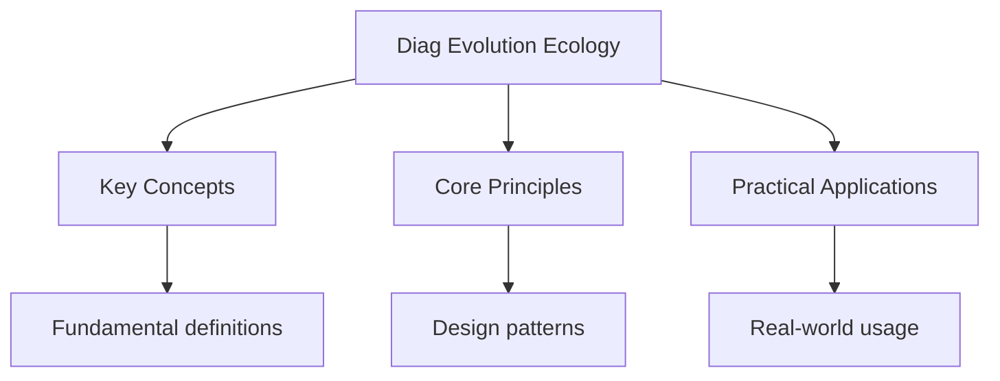

---

date: 2026-07-23T21:57:32+01:00
title: "Evolution and Ecology -- Diagnostic Tests"
description: "DSE Biology Evolution and Ecology -- Diagnostic Tests notes covering key definitions, core concepts, worked examples, and practice questions for clear revision."
tableOfContents: false
---

<!-- Breadcrumb Schema for SEO -->

## DSE Biology Diagnostic: Evolution and Ecology

## Unit Test 1: Natural Selection and Evidence for Evolution

**Question**

(a) Describe the process of **natural selection** as proposed by Darwin, using the development of
antibiotic resistance in bacteria as an example. [5 marks]

(b) Fossil evidence provides one line of evidence for evolution. Describe **two** other types of
evidence that support the theory of evolution. [4 marks]

(c) A student claims that evolution is "just a theory" and therefore not well-supported. Evaluate
this claim by distinguishing between the everyday use of "theory" and the scientific use of
"theory." [2 marks]

---

<!-- Breadcrumb Schema for SEO -->

**Worked Solution**

(a) **Natural selection** (using antibiotic resistance as an example):

1. **Variation**: Within a population of bacteria, there is **genetic variation** due to random
   mutations. Some bacteria possess alleles that make them **resistant** to a particular antibiotic,
   while others do not.

2. **Selection pressure**: When an antibiotic is applied to treat a bacterial infection, it creates
   a strong **selection pressure**. Bacteria that are susceptible to the antibiotic are **killed**,
   while resistant bacteria **survive**.

3. **Reproduction**: The surviving resistant bacteria reproduce (by binary fission), passing on
   their resistant alleles to their offspring.

4. **Increase in frequency of advantageous allele**: Over generations, the proportion of resistant
   bacteria in the population **increases** while the proportion of susceptible bacteria decreases.

5. **Evolution**: The population evolves -- the frequency of the antibiotic resistance allele in the
   gene pool has increased over time. This is natural selection in action: organisms with
   advantageous traits are more likely to survive and reproduce.

(b) Two other types of evidence for evolution:

1. **Comparative anatomy (homologous structures)**: Structures in different species that share a
   similar underlying anatomy (same basic bone arrangement) despite different functions are called
   **homologous structures**. For example, the pentadactyl limb (five-digit limb) is found in the
   human arm, the wing of a bat, the flipper of a whale, and the leg of a horse. These suggest these
   species share a **common ancestor**; the structures have been modified by natural selection for
   different functions.

2. **Molecular evidence (DNA/protein comparison)**: Comparing the DNA sequences or protein sequences
   (e.g. Cytochrome c) of different species shows that more closely related species have **more
   similar DNA/protein sequences**. The degree of similarity reflects evolutionary relatedness and
   can be used to construct phylogenetic trees.

(Alternative: embryological evidence -- early embryos of vertebrates are very similar;
biogeographical evidence -- species on oceanic islands are more similar to nearby mainland species
than to species on distant islands with similar environments.)

(c) In **everyday language**, "theory" means a guess or speculation (e.g. "I have a theory about who
stole the cookies").

In **science**, a "theory" is a well-substantiated, comprehensive explanation supported by a large
body of evidence, observations, and experiments. The **theory of evolution by natural selection** is
one of the most well-supported scientific theories, with evidence from fossils, genetics,
comparative anatomy, molecular biology, and direct observation (e.g. Antibiotic resistance). It is
not a guess or speculation.

---

<!-- Breadcrumb Schema for SEO -->

## Unit Test 2: Ecological Pyramids and Energy Flow

**Question**

(a) Explain why there is a loss of energy at each trophic level in an ecosystem. State the
approximate percentage of energy that is transferred from one trophic level to the next. [3 marks]

(b) A pyramid of numbers for a forest ecosystem may appear **inverted** (wider at the top), whereas
a pyramid of biomass for the same ecosystem is always a normal pyramid (wider at the base). Explain
this difference. [4 marks]

(c) Explain why a pyramid of **energy** is never inverted. [2 marks]

---

<!-- Breadcrumb Schema for SEO -->

**Worked Solution**

(a) Energy is lost at each trophic level because:

1. Not all biomass at one level is consumed by the next level (some organisms die and are
   decomposed).
2. Some energy is lost as **heat** through respiration (used for metabolic processes such as
   movement, maintaining body temperature).
3. Some energy is lost in **undigested material** (faeces/egestion) and **excretory products**
   (urea).
4. Some energy is used for **growth and reproduction** that is not passed on when consumed.

Approximately **10%** of the energy at one trophic level is transferred to the next (the 10% rule).
The remaining approximately 90% is lost as described above.

(b) **Pyramid of numbers in a forest**: A single tree (producer) supports thousands of insects
(primary consumers), which may support fewer birds (secondary consumers). If you count **individual
organisms**, there may be very few trees but many insects, giving an inverted pyramid. This happens
because the pyramid of numbers does not account for the **size** of organisms.

**Pyramid of biomass**: Biomass measures the **total mass of living material** at each trophic
level. The total biomass of the trees (producers) is much greater than the total biomass of the
insects (primary consumers), even though there are fewer individual trees. Biomass accounts for the
size difference, so the pyramid is a normal pyramid (larger at the base).

(c) A pyramid of **energy** is never inverted because energy always flows in **one direction**
through an ecosystem (from the Sun to producers, then to consumers). Energy cannot be created; it
can only be transferred and transformed. At each level, energy is lost (mainly as heat through
respiration), so the total energy available at each successive level is **always less** than at the
previous level. There is no situation in which a higher trophic level has more energy than the level
below it.

---

<!-- Breadcrumb Schema for SEO -->

## Unit Test 3: The Carbon Cycle and Nitrogen Cycle

**Question**

(a) Describe the role of **photosynthesis** and **respiration** in the carbon cycle. [3 marks]

(b) Describe the role of **decomposers** in the carbon cycle. [2 marks]

(c) In the nitrogen cycle, describe the roles of (i) **nitrogen-fixing bacteria**, (ii) **nitrifying
bacteria**, and (iii) **denitrifying bacteria**. [6 marks]

---

<!-- Breadcrumb Schema for SEO -->

**Worked Solution**

(a) **Photosynthesis**: Green plants and algae absorb carbon dioxide ($CO_{2}$) from the atmosphere
(or dissolved $CO_{2}$ from water) and incorporate it into organic molecules (glucose, then other
organic compounds) through the process of photosynthesis. This converts inorganic carbon into
organic carbon, moving carbon from the atmosphere/biosphere into living organisms.

**Respiration**: All living organisms carry out respiration, breaking down organic molecules (e.g.
Glucose) to release energy (ATP). As a by-product, $CO_{2}$ is released back into the atmosphere (or
into water). This converts organic carbon back into inorganic carbon, returning carbon to the
atmosphere.

(b) **Decomposers** (bacteria and fungi) break down dead organic matter (dead plants, animals, and
waste products) through extracellular digestion. They secrete enzymes onto dead material, digesting
it and absorbing the soluble products. In doing so, they release $CO_{2}$ back into the atmosphere
through their own respiration. Decomposers are essential for **recycling carbon** (and other
elements) from dead organisms back into the ecosystem.

(c) Roles in the nitrogen cycle:

(i) **Nitrogen-fixing bacteria**: These bacteria convert **atmospheric nitrogen gas** ($N_{2}$),
which is inert and unavailable to most organisms, into **ammonium ions** ($NH_{4}^{+}$) or other
nitrogen-containing compounds. This is called **nitrogen fixation**. Some nitrogen-fixing bacteria
live freely in the soil (e.g. Azotobacter), while others live in **root nodules** of leguminous
plants (e.g. Rhizobium), forming a mutualistic relationship.

(ii) **Nitrifying bacteria**: These bacteria convert **ammonium ions** ($NH_{4}^{+}$) (from
decomposition and nitrogen fixation) first into **nitrite ions** ($NO_{2}^{-}$) and then into
**nitrate ions** ($NO_{3}^{-}$). This two-step process is called **nitrification**. Nitrates are the
form of nitrogen most readily absorbed by plant roots. Examples: Nitrosomonas (ammonia to nitrite)
and Nitrobacter (nitrite to nitrate).

(iii) **Denitrifying bacteria**: These bacteria convert **nitrate ions** ($NO_{3}^{-}$) in the soil
back into **nitrogen gas** ($N_{2}$), which is released into the atmosphere. This process is called
**denitrification** and occurs in **waterlogged, anaerobic (oxygen-poor) soil conditions**.
Denitrifying bacteria reduce the amount of nitrogen available to plants.

---

<!-- Breadcrumb Schema for SEO -->

## Intuition

**Life's grand narrative:** Evolution is like a branching tree — species diverge from common ancestors, adapting to their environments through natural selection. Ecology studies how these species interact.

**Why it matters:** From antibiotic resistance to climate change adaptation, evolution and ecology explain how life responds to environmental pressures.

**The key insight:** Natural selection doesn't create perfect organisms — it favors those good enough to survive and reproduce in their current environment.

## Integration Test 1: Eutrophication

**Question**

A farmer applies excess nitrate fertiliser to a field adjacent to a lake. Over several weeks, the
following changes are observed in the lake:

1. Algal population increases dramatically.
2. Submerged aquatic plants die.
3. Fish population decreases.
4. Water becomes turbid and foul-smelling.

(a) Explain the sequence of events from the application of excess fertiliser to the death of
submerged aquatic plants, using the term **eutrophication**. [5 marks]

(b) Explain why the fish population decreases. [3 marks]

(c) Suggest **two** farming practices that could reduce the risk of eutrophication, and explain how
each practice helps. [4 marks]

---

<!-- Breadcrumb Schema for SEO -->

**Worked Solution**

(a) Sequence of events (eutrophication):

1. **Leaching**: Excess nitrate fertiliser that is not absorbed by crops is **leached** (washed)
   from the soil by rainwater into nearby water bodies (the lake), increasing the nitrate
   concentration in the water.

2. **Algal bloom**: The increased nitrate concentration acts as a nutrient (limiting factor),
   causing a rapid increase in the growth of **algae** -- an algal bloom. Algae grow and reproduce
   rapidly on the surface of the lake.

3. **Light blockage**: The dense layer of algae on the surface blocks **sunlight** from reaching the
   deeper parts of the lake. Submerged aquatic plants can no longer carry out sufficient
   photosynthesis due to lack of light.

4. **Death of aquatic plants**: Unable to photosynthesise, the submerged plants die. They are broken
   down by decomposers.

5. **Increased decomposer activity**: The dead algae (when they die) and dead plants provide a large
   amount of organic material for **decomposers** (bacteria and fungi). Decomposer populations
   increase dramatically.

6. **Oxygen depletion**: The large population of decomposers carries out **aerobic respiration**,
   consuming large amounts of **dissolved oxygen** from the water. The dissolved oxygen
   concentration drops to very low levels (hypoxia).

(b) The fish population decreases because:

The low dissolved oxygen concentration caused by decomposer respiration means that fish and other
aquatic organisms **cannot respire adequately**. Many fish species require a minimum dissolved
oxygen level to survive. As oxygen levels drop:

- Fish may suffocate and die.
- Sensitive species die first; more tolerant species may survive temporarily.
- Dead fish are decomposed, further increasing decomposer activity and oxygen consumption, creating
  a **positive feedback loop** that accelerates oxygen depletion.

(c) Two farming practices:

1. **Controlled application of fertiliser**: Apply fertiliser at the correct rate, time, and method
   to ensure crops absorb most of it. Use soil testing to determine the exact amount needed,
   avoiding excess. This reduces the amount of nitrate available for leaching.

2. **Creating buffer zones**: Plant strips of vegetation (trees, grass) between the field and the
   water body. Buffer zones absorb and filter runoff water before it reaches the lake, trapping
   nitrates and preventing them from entering the water body.

(Alternative: using slow-release fertilisers; applying fertiliser when rain is not expected; crop
rotation with legumes to fix nitrogen, reducing the need for artificial fertiliser.)

---

<!-- Breadcrumb Schema for SEO -->

## Integration Test 2: Speciation and Population Dynamics

**Question**

(a) Describe the process of **allopatric speciation**, explaining the role of geographical isolation
and natural selection. [5 marks]

(b) A population of beetles on an island has an initial size of 500. The birth rate is 0.4 per
individual per year and the death rate is 0.2 per individual per year. Calculate the population size
after one year, assuming no immigration or emigration. [2 marks]

(c) The carrying capacity of the island for these beetles is 2000. Explain what is meant by carrying
capacity and describe what would happen to the population growth rate as the population approaches
the carrying capacity. [3 marks]

---

<!-- Breadcrumb Schema for SEO -->

**Worked Solution**

(a) **Allopatric speciation**:

1. **Geographical isolation**: A physical barrier (e.g. A mountain range, a river, an ocean)
   separates a population of a species into **two or more geographically isolated populations**.
   This prevents interbreeding between the populations (no gene flow).

2. **Different selection pressures**: The two isolated populations experience **different
   environmental conditions** (e.g. Different climate, food sources, predators). Different selection
   pressures act on each population.

3. **Natural selection**: In each population, natural selection favours different alleles and traits
   that are advantageous in their respective environments. Over many generations, the **allele
   frequencies** in each population change in different directions.

4. **Accumulation of differences**: Over a long period, the two populations accumulate so many
   genetic differences that even if they were brought back together, they could no longer
   **interbreed** to produce fertile offspring. They have become **reproductively isolated**.

5. **New species**: The two populations are now classified as **separate species**. This process is
   called allopatric speciation (speciation that occurs due to geographical separation).

(b) **Population change**: Birth rate = 0.4 per individual per year; Death rate = 0.2 per individual
per year.

Net growth rate = birth rate - death rate = $0.4 - 0.2 = 0.2$ per individual per year.

Population increase in one year = $500 \times 0.2 = 100$ individuals.

Population after one year = $500 + 100 = 600$ beetles.

(c) **Carrying capacity** is the **maximum population size** of a species that an environment can
sustain indefinitely, given the available resources (food, water, shelter, etc.) without degrading
the environment.

As the population approaches the carrying capacity:

- **Resources become limiting**: Food, space, and other resources become scarcer as more individuals
  compete for them.
- **Growth rate decreases**: The population growth rate **slows down** and eventually stabilises at
  approximately zero when the population reaches the carrying capacity. The population fluctuates
  around the carrying capacity rather than continuing to grow exponentially.
- This pattern produces a **sigmoidal (S-shaped) population growth curve**: rapid growth initially
  (exponential phase), followed by a slowing of growth (deceleration phase), and finally a stable
  phase where births approximately equal deaths.

## See Also

- [Diagnostics](./)
- [Biodiversity and Conservation -- Diagnostic Tests](./diag-biodiversity-conservation)
- [Genetics -- Diagnostic Tests](./diag-genetics)
