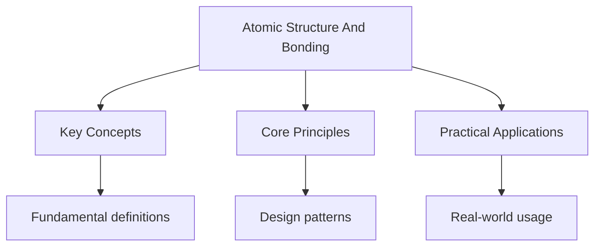

---

title: Chemistry - Atomic Structure and Bonding
description: "| Particle | Symbol | Relative Mass | Relative Charge | Location | | -------- | ------------ | ---------------- | --------------- | --------------- | |"
tags: [DSE, Chemistry]
categories: [DSE, Chemistry]
date: 2026-05-31T00:00:00.000Z
---

<!-- Breadcrumb Schema for SEO -->

## 1. Atomic Structure

### Subatomic Particles

| Particle | Symbol       | Relative Mass    | Relative Charge | Location        |
| -------- | ------------ | ---------------- | --------------- | --------------- |
| Proton   | $p$ or $p^+$ | 1                | +1              | Nucleus         |
| Neutron  | $n$          | 1                | 0               | Nucleus         |
| Electron | $e^-$        | $\frac{1}{1836}$ | $-1$            | Electron shells |

- **Atomic number ($Z$):** number of protons; defines the element
- **Mass number ($A$):** protons + neutrons
- **Isotopes:** same $Z$, different $A$ (same element, different neutron count)

### Electron Configuration

Electrons occupy shells. The maximum number of electrons in each shell follows the **$2n^2$ rule**:

| Shell ($n$) | Max electrons ($2n^2$) | Sub-shell arrangement |
| ----------- | ---------------------- | --------------------- |
| 1           | 2                      | 1s                    |
| 2           | 8                      | 2s, 2p                |
| 3           | 18                     | 3s, 3p, 3d            |
| 4           | 32                     | 4s, 4p, 4d, 4f        |

Electrons fill in order of increasing energy: 1s → 2s → 2p → 3s → 3p → 4s → 3d → 4p...

**Examples:**

- Sodium ($Z=11$): $1s^2\,2s^2\,2p^6\,3s^1$ or $[\mathrm{Ne}]\,3s^1$
- Iron ($Z=26$): $[\mathrm{Ar}]\,3d^6\,4s^2$
- Chromium ($Z=24$): $[\mathrm{Ar}]\,3d^5\,4s^1$ (exception for half-filled stability)

---

<!-- Breadcrumb Schema for SEO -->

## 2. Periodic Trends

### Across a Period (left to right)

| Property           | Trend               | Reason                                           |
| ------------------ | ------------------- | ------------------------------------------------ |
| Atomic radius      | Decreases           | Increasing nuclear charge pulls electrons closer |
| Ionisation energy  | Generally increases | Greater nuclear charge, same shielding           |
| Electronegativity  | Increases           | Stronger pull on bonding electrons               |
| Metallic character | Decreases           | Atoms hold electrons more tightly                |

### Down a Group

| Property           | Trend     | Reason                                                |
| ------------------ | --------- | ----------------------------------------------------- |
| Atomic radius      | Increases | Additional electron shells                            |
| Ionisation energy  | Decreases | Increased shielding outweighs nuclear charge increase |
| Metallic character | Increases | Outer electrons further from nucleus                  |

### Group Properties

- **Group I (Alkali metals):** $+1$ charge; highly reactive; react with water to form hydroxides and
  hydrogen
- **Group VII (Halogens):** $-1$ charge; reactivity decreases down group; displacement reactions
- **Group 0 (Noble gases):** full outer shell; chemically inert; boiling point increases down group

---

<!-- Breadcrumb Schema for SEO -->

## 3. Ionic Bonding

### Formation

Transfer of electrons from a **metal** atom (to form a cation) to a **non-metal** atom (to form an
anion). The resulting electrostatic attraction between oppositely charged ions is the ionic bond.

Example: $\mathrm{Na} \to \mathrm{Na}^+ + e^-$ and $\mathrm{Cl} + e^- \to \mathrm{Cl}^-$

### Dot-Cross Diagrams

Show the transfer of electrons evidently:

- Metal: dot and cross in outer shell → becomes ion with empty outer shell
- Non-metal: gains electron(s) to fill outer shell

### Properties of Ionic Compounds

| Property                    | Explanation                                                   |
| --------------------------- | ------------------------------------------------------------- |
| High melting/boiling point  | Strong electrostatic forces in giant ionic lattice            |
| Hard and brittle            | Layers of ions; displacement of like charges causes repulsion |
| Conduct when molten/aqueous | Ions are free to move and carry charge                        |
| Soluble in water            | Polar water molecules attract and separate ions               |

---

<!-- Breadcrumb Schema for SEO -->

## 4. Covalent Bonding

### Formation

Sharing of electron pairs between **non-metal** atoms. Each shared pair constitutes one covalent
bond ($\sigma$ bond).

### Dot-Cross Diagrams for Covalent Molecules

Show shared pairs (one dot from each atom, overlapping) and lone pairs:

- $\mathrm{H_2}$: single bond (1 shared pair)
- $\mathrm{O_2}$: double bond (2 shared pairs)
- $\mathrm{N_2}$: triple bond (3 shared pairs)
- $\mathrm{H_2O}$: bent molecule, 2 bonds, 2 lone pairs on O

### Coordinate (Dative) Bonds

A covalent bond where **both electrons come from the same atom**.

Example: $\mathrm{NH_4^+}$ — the fourth N–H bond is dative (N donates both electrons to
$\mathrm{H}^+$).

### Simple vs Giant Covalent Structures

| Type   | Structure            | Examples                                          | Properties                                  |
| ------ | -------------------- | ------------------------------------------------- | ------------------------------------------- |
| Simple | Individual molecules | $\mathrm{H_2O}$, $\mathrm{CO_2}$, $\mathrm{CH_4}$ | Low m.p./b.p.; weak intermolecular forces   |
| Giant  | Continuous network   | Diamond, graphite, $\mathrm{SiO_2}$               | Very high m.p.; very hard (except graphite) |

**Diamond:** tetrahedral; each C bonded to 4 others; insulator **Graphite:** layered; each C bonded
to 3 others; delocalised electrons → conducts electricity; lubricant (weak intermolecular forces
between layers)

---

<!-- Breadcrumb Schema for SEO -->

## 5. Metallic Bonding

### Formation

Positive metal ions in a lattice surrounded by a **sea of delocalised electrons**. The attraction
between ions and the delocalised electrons is the metallic bond.

### Properties of Metals

| Property                  | Explanation                                                     |
| ------------------------- | --------------------------------------------------------------- |
| High melting point        | Strong metallic bonding (more delocalised electrons → stronger) |
| Electrical conductivity   | Delocalised electrons carry charge                              |
| Malleable and ductile     | Layers of ions can slide; delocalised electrons re-attract      |
| Good thermal conductivity | Delocalised electrons transfer kinetic energy                   |
| Shiny appearance          | Delocalised electrons absorb and re-emit light                  |

**Alloys** (e.g. steel, brass) are mixtures of metals with other elements. Different-sized atoms
disrupt the regular lattice, making alloys **harder** than pure metals.

---

<!-- Breadcrumb Schema for SEO -->

## 6. Intermolecular Forces

### London (Van der Waals) Forces

- Present between **all** molecules
- Caused by instantaneous (temporary) dipoles due to electron movement
- **Strength increases with:** number of electrons (larger $A_r$), molecular size, surface area
- Explains trends in boiling points within homologous series (e.g. alkanes: $C_nH_{2n+2}$)

### Dipole-Dipole Forces

- Between polar molecules (those with permanent dipoles)
- Stronger than London forces but weaker than hydrogen bonds
- Example: $\mathrm{HCl}$, $\mathrm{SO_2}$

### Hydrogen Bonding

- Strongest intermolecular force
- Occurs when H is bonded to N, O, or F (highly electronegative atoms)
- Requires a lone pair on N, O, or F of a neighbouring molecule
- Examples: $\mathrm{H_2O}$, $\mathrm{NH_3}$, $\mathrm{HF}$, alcohols, carboxylic acids

**Effects of hydrogen bonding:**

- Unusually high boiling points (e.g. $\mathrm{H_2O}$ boils at 100 °C vs $\mathrm{H_2S}$ at $-60$
  °C)
- Ice is less dense than water (open H-bonded lattice)
- Solubility of polar molecules in water

---

<!-- Breadcrumb Schema for SEO -->

## 7. Physical Properties Linked to Structure

| Substance       | Bonding/Structure           | Melting Point | Conductivity | Solubility     |
| --------------- | --------------------------- | ------------- | ------------ | -------------- |
| $\mathrm{NaCl}$ | Ionic lattice               | High          | Molten/aq    | Polar solvents |
| Diamond         | Giant covalent              | Very high     | No           | Insoluble      |
| Graphite        | Giant covalent (layered)    | Very high     | Yes          | Insoluble      |
| $\mathrm{Cu}$   | Metallic                    | High          | Yes          | Insoluble      |
| $\mathrm{H_2O}$ | Simple covalent + H-bonding | Low           | No           | Miscible       |
| $\mathrm{I_2}$  | Simple covalent + London    | Low           | No           | Non-polar      |

**Key principle:** The type of bonding determines the physical properties. Metallic and ionic
bonding → high m.p. Giant covalent → very high m.p. Simple covalent → low m.p. (stronger
intermolecular forces = higher m.p. within this group).

### Predicting Properties

To predict the physical properties of a substance:

1. Identify the **type of bonding** present
2. Consider the **strength of bonding/forces**
3. Predict: melting/boiling point, electrical conductivity, solubility
4. Explain in terms of the bonding model

## Worked Examples

### Example 1: Predicting Physical Properties

**Problem:** Predict the melting point, electrical conductivity (solid and molten), and solubility
in water for silicon dioxide ($\mathrm{SiO_2}$). **Solution:** $\mathrm{SiO_2}$ has a giant covalent
structure. Each Si atom is bonded to 4 O atoms in a continuous network. Therefore: very high melting
point (strong covalent bonds throughout), does not conduct electricity (no free electrons or ions),
and is insoluble in water (giant covalent structures are not attracted by water molecules).

### Example 2: Identifying Bond Type from Properties

**Problem:** A substance melts at 801 °C, conducts electricity when molten but not when solid, and
dissolves in water. Identify the type of bonding present. **Solution:** High melting point rules out
simple covalent. Conducts when molten but not solid is characteristic of ionic compounds (ions free
to move in liquid state but locked in lattice when solid). Solubility in water confirms ionic
bonding (polar water molecules attract and separate the ions).

## Intuition

**Building blocks with rules:** Atoms are like LEGO sets — protons determine the element, electrons determine the chemistry. The periodic table organizes elements by their electron configurations, revealing patterns in reactivity.

**Why it matters:** From semiconductors to pharmaceuticals, understanding atomic structure explains why elements behave the way they do and how to combine them.

**The key insight:** Ionisation energy increases across a period because nuclear charge increases while shielding stays roughly constant — electrons are held more tightly.

## Common Pitfalls

- **Confusing ionic and metallic conductivity:** Ionic compounds conduct only when molten or aqueous
  (mobile ions). Metals conduct in all states (delocalised electrons).
- **Stating graphite is an insulator:** Graphite has delocalised electrons between its layers and
  does conduct electricity, unlike diamond.
- **Ignoring exceptions in electron configuration:** Chromium ($[\mathrm{Ar}]\,3d^5\,4s^1$) and
  copper ($[\mathrm{Ar}]\,3d^{10}\,4s^1$) are exceptions to the standard filling order due to the
  stability of half-filled and fully filled d-subshells.

## Summary

Atomic structure and bonding covers subatomic particles, electron configuration, periodic trends,
and the four main types of bonding: ionic (electron transfer, giant lattice), covalent (electron
sharing, simple and giant structures), metallic (delocalised electron sea), and intermolecular
forces (London, dipole-dipole, hydrogen bonding). The type of bonding determines physical properties
including melting point, conductivity, and solubility.

## Cross-References

- **[Atomic Structure](../chemistry/atomic-structure-and-bonding):** Atomic structure determines bonding
- **[Equilibrium](../../../../../alevel/src/content/docs/chemistry/equilibrium):** Equilibrium is a core topic
- **[Organic Chemistry](../../../../../alevel/src/content/docs/chemistry/organic-chemistry):** Organic chemistry covers carbon compounds
