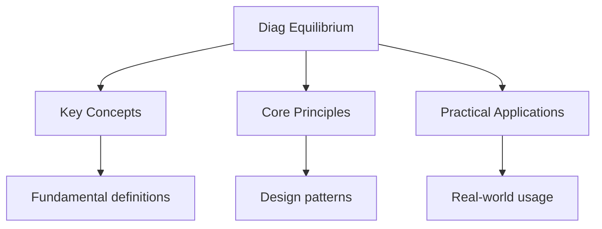

---

date: 2026-07-23T21:57:32+01:00
title: "Chemical Equilibrium -- Diagnostic Tests"
description: "DSE Chemistry Chemical Equilibrium -- Diagnostic Tests notes covering key definitions, core concepts, worked examples, and practice questions for revision."
tableOfContents: false
---

<!-- Breadcrumb Schema for SEO -->

## DSE Chemistry Diagnostic: Chemical Equilibrium

## Unit Test 1: Kc Calculation

**Question**

Nitrogen and hydrogen react to form ammonia:

$$N_{2}(g) + 3H_{2}(g) \rightleftharpoons 2NH_{3}(g)$$

1.00 mol of $N_{2}$ and 3.00 mol of $H_{2}$ were mixed in a sealed container of volume 2.0 dm$^{3}$
and allowed to reach equilibrium at a certain temperature. At equilibrium, 0.40 mol of $NH_{3}$ was
present.

(a) Calculate the equilibrium concentrations of $N_{2}$, $H_{2}$ And $NH_{3}$. [2 marks]

(b) Calculate the equilibrium constant $K_{c}$ for this reaction at this temperature. [3 marks]

(c) If the volume of the container is halved (by compressing the gas mixture) at constant
temperature, what happens to the value of $K_{c}$? Explain. [2 marks]

---

<!-- Breadcrumb Schema for SEO -->

**Worked Solution**

(a) ICE table:

| Species  | Initial (mol) | Change (mol) | Equilibrium (mol) |
| -------- | ------------- | ------------ | ----------------- |
| $N_{2}$  | 1.00          | $-0.20$      | 0.80              |
| $H_{2}$  | 3.00          | $-0.60$      | 2.40              |
| $NH_{3}$ | 0             | $+0.40$      | 0.40              |

Change in $NH_{3}$ = $+0.40$ mol, so change in $N_{2}$ = $-0.40/2 = -0.20$ mol, change in $H_{2}$ =
$-3 \times 0.20 = -0.60$ mol.

Equilibrium concentrations (dividing by volume 2.0 dm$^{3}$):

$$[N_{2}] = \frac{0.80}{2.0} = 0.40 \text{ mol/dm}^{3}$$

$$[H_{2}] = \frac{2.40}{2.0} = 1.20 \text{ mol/dm}^{3}$$

$$[NH_{3}] = \frac{0.40}{2.0} = 0.20 \text{ mol/dm}^{3}$$

(b)
$$K_{c} = \frac{[NH_{3}]^{2}}{[N_{2}][H_{2}]^{3}} = \frac{(0.20)^{2}}{(0.40)(1.20)^{3}} = \frac{0.040}{0.40 \times 1.728} = \frac{0.040}{0.6912} = 0.0579$$

$K_{c}$ has units:
$\frac{(\text{mol dm}^{-3})^{2}}{(\text{mol dm}^{-3})(\text{mol dm}^{-3})^{3}} = \text{mol}^{-2} \text{dm}^{6}$

$$K_{c} = 0.0579 \text{ mol}^{-2} \text{dm}^{6}$$

(c) The value of $K_{c}$ **remains unchanged**. $K_{c}$ is a constant at a given temperature and is
not affected by changes in concentration or pressure. Changing the volume changes the equilibrium
**position** (it shifts to the side with fewer gas moles, which is the product side), but the ratio
$[NH_{3}]^{2}/([N_{2}][H_{2}]^{3})$ at the new equilibrium remains the same.

---

<!-- Breadcrumb Schema for SEO -->

## Unit Test 2: Le Chatelier + Equilibrium Constant

**Question**

For the exothermic reaction:

$$2SO_{2}(g) + O_{2}(g) \rightleftharpoons 2SO_{3}(g) \quad \Delta H = -197 \text{ kJ/mol}$$

(a) State the effect of increasing temperature on: (i) the equilibrium position, and (ii) the value
of $K_{c}$. [3 marks]

(b) A student says: "Increasing the pressure by adding an inert gas at constant volume will shift
the equilibrium to the right." Evaluate this statement. [2 marks]

(c) At 700 K, $K_{c} = 300$ (in appropriate units). At 900 K, $K_{c} = 5.0$. Is the forward reaction
exothermic or endothermic? Explain. [2 marks]

---

<!-- Breadcrumb Schema for SEO -->

**Worked Solution**

(a) (i) **Equilibrium position**: Increasing temperature shifts the equilibrium to the **left**
(towards the reactants), because the forward reaction is exothermic. The system opposes the change
by absorbing the added heat (endothermic reverse reaction).

(ii) **$K_{c}$ value**: Since the equilibrium shifts left, the concentration of products decreases
and reactants increase. Therefore $K_{c}$ **decreases**.

(b) The statement is **incorrect**. Adding an inert gas at **constant volume** increases the total
pressure but does **not change the partial pressures** or concentrations of the reacting gases.
Since the equilibrium depends on partial pressures (or concentrations), and these are unchanged, the
equilibrium position **does not shift**.

(Note: Adding an inert gas at **constant pressure** by increasing volume WOULD shift the
equilibrium, because it would decrease the partial pressures of all gases, favouring the side with
more gas moles.)

(c) As temperature increases from 700 K to 900 K, $K_{c}$ decreases from 300 to 5.0. Since $K_{c}$
decreases with increasing temperature, the equilibrium shifts towards the reactants as temperature
rises. This means the **forward reaction is exothermic** (the system absorbs heat by favouring the
reverse, endothermic reaction when temperature is increased).

---

<!-- Breadcrumb Schema for SEO -->

## Unit Test 3: Inert Gas Effects

**Question**

For the equilibrium:

$$PCl_{5}(g) \rightleftharpoons PCl_{3}(g) + Cl_{2}(g)$$

(a) Explain the effect on the equilibrium position when an inert gas (e.g., argon) is added at
**constant volume**. [2 marks]

(b) Explain the effect on the equilibrium position when an inert gas is added at **constant
pressure**. [3 marks]

(c) In which case (a) or (b) does the value of $K_{p}$ change? Explain. [1 mark]

---

<!-- Breadcrumb Schema for SEO -->

**Worked Solution**

(a) At **constant volume**, adding an inert gas increases the **total pressure** but does **not**
change the partial pressures of $PCl_{5}$, $PCl_{3}$Or $Cl_{2}$. Since the equilibrium depends on
partial pressures (or concentrations), the **equilibrium position does not shift**.

Reason: $P_{\text{total}}$ increases, but the mole fractions and hence partial pressures of the
reacting gases remain unchanged.

(b) At **constant pressure**, adding an inert gas increases the **total number of moles** in the
container, which requires the **volume to increase** (to maintain constant total pressure). The
increase in volume decreases the partial pressures of all reacting gases equally.

Since there are **more gas moles on the right** (2 moles) than on the left (1 mole), the system
responds by shifting towards the side with more gas moles to increase the pressure. Therefore, the
equilibrium shifts to the **right**, producing more $PCl_{3}$ and $Cl_{2}$.

(c) $K_{p}$ does **not change** in either case. $K_{p}$ depends only on **temperature**. Changes in
pressure, volume, or addition of inert gas do not affect the value of the equilibrium constant.

---

<!-- Breadcrumb Schema for SEO -->

## Intuition

**A tug-of-war that never ends:** Chemical equilibrium is like two teams pulling on a rope — both forward and reverse reactions happen at the same rate, so concentrations don't change, but reactions haven't stopped.

**Why it matters:** From industrial ammonia production to blood oxygen transport, equilibrium determines how much product you get. Le Chatelier's principle predicts how systems respond to disturbances.

**The key insight:** Changing concentration or pressure shifts equilibrium, but changing temperature changes the equilibrium constant itself — this distinction is crucial.

## Integration Test 1: Kc + Kp Conversion

**Question**

For the equilibrium:

$$N_{2}O_{4}(g) \rightleftharpoons 2NO_{2}(g)$$

At 350 K, the total equilibrium pressure is 1.00 atm and the degree of dissociation of $N_{2}O_{4}$
is 0.50 (50%).

(a) Calculate the mole fractions of $N_{2}O_{4}$ and $NO_{2}$ at equilibrium. [2 marks]

(b) Calculate the partial pressures of $N_{2}O_{4}$ and $NO_{2}$ at equilibrium. [2 marks]

(c) Calculate $K_{p}$ for this equilibrium at 350 K. [2 marks]

(d) If the total pressure is increased to 2.00 atm at the same temperature, calculate the new degree
of dissociation. [4 marks]

---

<!-- Breadcrumb Schema for SEO -->

**Worked Solution**

(a) Start with 1 mol $N_{2}O_{4}$. Let $\alpha = 0.50$.

At equilibrium:

- $n(N_{2}O_{4}) = 1 - 0.50 = 0.50$ mol
- $n(NO_{2}) = 2 \times 0.50 = 1.00$ mol
- Total moles = $0.50 + 1.00 = 1.50$ mol

Mole fraction of $N_{2}O_{4}$: $x(N_{2}O_{4}) = \frac{0.50}{1.50} = \frac{1}{3}$

Mole fraction of $NO_{2}$: $x(NO_{2}) = \frac{1.00}{1.50} = \frac{2}{3}$

(b) $P(N_{2}O_{4}) = x(N_{2}O_{4}) \times P_{\text{total}} = \frac{1}{3} \times 1.00 = 0.333$ atm

$P(NO_{2}) = x(NO_{2}) \times P_{\text{total}} = \frac{2}{3} \times 1.00 = 0.667$ atm

(c)
$$K_{p} = \frac{(P_{NO_{2}})^{2}}{P_{N_{2}O_{4}}} = \frac{(0.667)^{2}}{0.333} = \frac{0.445}{0.333} = 1.335 \text{ atm}$$

(d) Let $\alpha$ be the new degree of dissociation at $P = 2.00$ atm.

$n(N_{2}O_{4}) = 1 - \alpha$, $n(NO_{2}) = 2\alpha$Total $= 1 + \alpha$

$$P(N_{2}O_{4}) = \frac{1 - \alpha}{1 + \alpha} \times 2.00$$

$$P(NO_{2}) = \frac{2\alpha}{1 + \alpha} \times 2.00 = \frac{4\alpha}{1 + \alpha}$$

$$K_{p} = \frac{\left(\frac{4\alpha}{1+\alpha}\right)^{2}}{\frac{2(1-\alpha)}{1+\alpha}} = \frac{\frac{16\alpha^{2}}{(1+\alpha)^{2}}}{\frac{2(1-\alpha)}{1+\alpha}} = \frac{16\alpha^{2}}{2(1-\alpha)(1+\alpha)} = \frac{8\alpha^{2}}{1-\alpha^{2}}$$

Set $K_{p} = 1.335$:

$$\frac{8\alpha^{2}}{1-\alpha^{2}} = 1.335$$

$$8\alpha^{2} = 1.335(1-\alpha^{2})$$

$$8\alpha^{2} = 1.335 - 1.335\alpha^{2}$$

$$9.335\alpha^{2} = 1.335$$

$$\alpha^{2} = \frac{1.335}{9.335} = 0.1430$$

$$\alpha = 0.378$$

The new degree of dissociation is **0.378** (37.8%), which is less than 0.50, consistent with Le
Chatelier"s principle (increasing pressure favours the side with fewer gas moles).

---

<!-- Breadcrumb Schema for SEO -->

## Integration Test 2: Industrial Process Optimisation

**Question**

The Haber process for ammonia synthesis:

$$N_{2}(g) + 3H_{2}(g) \rightleftharpoons 2NH_{3}(g) \quad \Delta H = -92 \text{ kJ/mol}$$

(a) Explain why industrial conditions use a temperature of approximately 450$^{\circ}$C rather than
a lower temperature, even though a lower temperature would give a higher equilibrium yield. [3
marks]

(b) Explain why industrial conditions use a high pressure (200 atm) rather than atmospheric
pressure. [2 marks]

(c) At 450$^{\circ}$C and 200 atm, the equilibrium yield of ammonia is approximately 15\%. An
engineer suggests using 500 atm to increase the yield. Calculate the approximate equilibrium yield
at 500 atm, assuming ideal gas behaviour and that only pressure changes. [3 marks]

---

<!-- Breadcrumb Schema for SEO -->

**Worked Solution**

(a) Although a lower temperature would shift the equilibrium to the right (exothermic forward
reaction) and increase the equilibrium yield, it would also **decrease the rate of reaction**
significantly. At very low temperatures, the reaction would be too slow to be economically viable. A
compromise temperature of 450$^{\circ}$C provides a reasonable rate (via the iron catalyst) while
still achieving an acceptable equilibrium yield. Additionally, at 450$^{\circ}$C the iron catalyst
is most effective.

(b) High pressure shifts the equilibrium to the **right** (towards fewer gas moles: 4 mol of gas on
the left vs 2 mol on the right), increasing the equilibrium yield of ammonia. This is in accordance
with Le Chatelier's principle.

(c) Assuming ideal gas behaviour, the mole fraction of $NH_{3}$ at equilibrium scales approximately
with pressure for this reaction. For the Haber process at a given temperature, increasing pressure
by a factor of $500/200 = 2.5$ increases the yield. However, the relationship is not linear.

A reasonable estimate: if the yield is 15% at 200 atm, at 500 atm it would be approximately 25--30%.
The exact calculation requires solving the equilibrium expression, but qualitatively, increasing
pressure favours ammonia production.

For a rough estimate using the simplified relationship: yield $\propto P^{0.5}$ (approximately),
yield at 500 atm $\approx 15\% \times \sqrt{500/200} = 15\% \times 1.58 = 23.7\%$.

A more accurate estimate would give approximately **25%**.

---

<!-- Breadcrumb Schema for SEO -->

## Integration Test 3: Equilibrium Position + Quantitative Prediction

**Question**

For the equilibrium:

$$H_{2}(g) + I_{2}(g) \rightleftharpoons 2HI(g)$$

$K_{c} = 49.0$ at a certain temperature. 2.00 mol of $HI$ is placed in a 1.0 dm$^{3}$ container and
allowed to reach equilibrium.

(a) Calculate the equilibrium concentrations of $H_{2}$, $I_{2}$ And $HI$. [5 marks]

(b) At equilibrium, an additional 1.00 mol of $I_{2}$ is added to the container. Calculate the new
equilibrium concentrations after the system re-equilibrates. [4 marks]

(c) After re-equilibration, is the value of $K_{c}$ the same as before? Explain. [1 mark]

---

<!-- Breadcrumb Schema for SEO -->

**Worked Solution**

(a) Initial: $[HI] = 2.00$ mol/dm$^{3}$, $[H_{2}] = [I_{2}] = 0$.

Let $x$ mol/dm$^{3}$ of $HI$ dissociate.

At equilibrium: $[HI] = 2.00 - 2x$$[H_{2}] = x$$[I_{2}] = x$.

$$K_{c} = \frac{[HI]^{2}}{[H_{2}][I_{2}]} = \frac{(2.00 - 2x)^{2}}{x^{2}} = 49.0$$

$$\frac{2.00 - 2x}{x} = 7.00$$

$$2.00 - 2x = 7x$$

$$2.00 = 9x$$

$$x = 0.222 \text{ mol/dm}^{3}$$

At equilibrium:

- $[H_{2}] = [I_{2}] = 0.222$ mol/dm$^{3}$
- $[HI] = 2.00 - 2(0.222) = 1.556$ mol/dm$^{3}$

(b) After adding 1.00 mol $I_{2}$ to 1.0 dm$^{3}$:
$[I_{2}]_{\text{new initial}} = 0.222 + 1.00 = 1.222$ mol/dm$^{3}$.

The equilibrium shifts left to partially consume the added $I_{2}$. Let $y$ mol/dm$^{3}$ of $H_{2}$
react with $I_{2}$.

New equilibrium: $[H_{2}] = 0.222 - y$$[I_{2}] = 1.222 - y$$[HI] = 1.556 + 2y$.

$$K_{c} = \frac{(1.556 + 2y)^{2}}{(0.222 - y)(1.222 - y)} = 49.0$$

$$1.556 + 2y = 7.00\sqrt{(0.222 - y)(1.222 - y)}$$

Expanding: $(1.556 + 2y)^{2} = 49.0(0.222 - y)(1.222 - y)$

$$2.421 + 6.224y + 4y^{2} = 49.0(0.2713 - 1.444y + y^{2})$$

$$2.421 + 6.224y + 4y^{2} = 13.29 - 70.76y + 49.0y^{2}$$

$$0 = 10.87 - 76.98y + 45y^{2}$$

Using the quadratic formula:
$y = \frac{76.98 \pm \sqrt{76.98^{2} - 4 \times 45 \times 10.87}}{2 \times 45}$

$= \frac{76.98 \pm \sqrt{5926 - 1957}}{90} = \frac{76.98 \pm \sqrt{3969}}{90} = \frac{76.98 \pm 63.0}{90}$

$y = \frac{76.98 - 63.0}{90} = \frac{13.98}{90} = 0.155$ (taking the smaller root, since
$y \lt 0.222$)

New equilibrium concentrations:

- $[H_{2}] = 0.222 - 0.155 = 0.067$ mol/dm$^{3}$
- $[I_{2}] = 1.222 - 0.155 = 1.067$ mol/dm$^{3}$
- $[HI] = 1.556 + 2(0.155) = 1.866$ mol/dm$^{3}$

(c) **Yes**, $K_{c}$ remains the same ($49.0$). $K_{c}$ depends only on temperature, and the
temperature has not changed. The equilibrium position shifts, but the ratio of product
concentrations to reactant concentrations at equilibrium remains constant.

## Common Mistakes

**Thinking Kc changes with concentration or pressure changes:** Kc only changes with temperature. Adding reactants, changing volume, or adding inert gas shifts the equilibrium position but doesn't change Kc.

**Confusing inert gas effects at constant volume vs constant pressure:** Adding inert gas at constant volume has no effect on equilibrium (partial pressures unchanged). Adding inert gas at constant pressure increases volume, decreasing partial pressures and shifting equilibrium toward more gas moles.

**Forgetting to use equilibrium concentrations (not initial) in Kc expressions:** Set up an ICE table to track changes. The Kc expression uses equilibrium concentrations, not the initial amounts you started with.

## Cross-References

- **[Atomic Structure](../atomic-structure-and-bonding):** Atomic structure is foundational
- **[Equilibrium](../../../../../../alevel/src/content/docs/chemistry/equilibrium):** Equilibrium connects topics
- **[Organic Chemistry](../../../../../../alevel/src/content/docs/chemistry/organic-chemistry):** Organic chemistry is a major area
