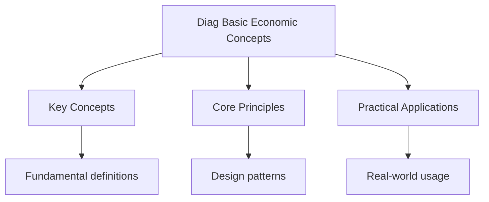

<!-- Breadcrumb Schema for SEO -->

## Basic Economic Concepts — Diagnostic Tests

## Unit Tests

### UT-1: Opportunity Cost and the PPC

**Question:** A country can produce either 200 units of consumer goods or 100 units of capital goods
Using all its resources. Draw the PPC and calculate the opportunity cost of producing 1 additional
Unit of capital goods. If the country is currently producing 120 consumer goods and 40 capital
Goods, and wishes to increase capital goods production to 70, what is the opportunity cost? Explain
Why the PPC is concave (bowed outward).

**Solution:**

The PPC has intercepts at (200, 0) on the consumer goods axis and (0, 100) on the capital goods
Axis.

Opportunity cost of 1 unit of capital goods $= 200 / 100 = 2$ units of consumer goods (constant
Opportunity cost in this linear case).

Moving from 40 to 70 capital goods (an increase of 30): On a linear PPC, the opportunity cost
$= 30 \times 2 = 60$ consumer goods. New consumer goods output $= 120 - 60 = 60$.

However, in reality the PPC is concave because resources are not perfectly adaptable. As the economy
Shifts from producing consumer goods to capital goods, it must reassign resources that are
Increasingly less suited to capital goods production. For example, farmland that is excellent for
Growing food may be poor for building factories. This means the opportunity cost increases as more
Capital goods are produced -- the law of increasing opportunity cost. Each additional unit of
Capital goods requires giving up an increasingly larger amount of consumer goods.

### UT-2: Economic Systems Comparison

**Question:** Compare the allocation of resources under a free market economy, a planned economy,
And a mixed economy. For each system, explain: (a) who answers the three fundamental economic
Questions (what, how, for whom), (b) the role of prices, and (c) one key advantage and one key
Disadvantage. Use Hong Kong as an example of a mixed economy.

**Solution:**

**Free Market Economy:** (a) What, how, and for whom are determined by the price mechanism through
The interaction of demand and supply. Consumers signal preferences through willingness to pay;
Producers respond to profit incentives. (b) Prices are the primary signal -- they coordinate
Decisions of millions of buyers and sellers without central direction. (c) Advantage: Efficient
Allocation of resources through the invisible hand; incentive for innovation and entrepreneurship.
Disadvantage: Market failure -- public goods are underprovided, negative externalities are
Overproduced, and income inequality can be severe.

**Planned (Command) Economy:** (a) A central authority (government) determines what to produce, how
To produce, and for whom goods are distributed, through a national plan. (b) Prices are Set
administratively by the government rather than by market forces; they may not reflect scarcity. (c)
Advantage: Can achieve rapid industrialisation and ensure basic needs are met; can direct Resources
to priority areas (e.g., defence, infrastructure). Disadvantage: Inefficient due to Information
problems (planners cannot know all consumer preferences); lack of incentive for Innovation and
quality improvement; chronic shortages and surpluses.

**Mixed Economy:** (a) Both the market and the government play roles. The market handles most
Allocation decisions, while the government intervenes to correct market failures, redistribute
Income, and provide public goods. (b) Prices are primarily determined by supply and demand, but the
Government may set price controls, taxes, and subsidies. (c) Advantage: Combines market efficiency
With government correction of failures; can achieve both growth and equity. Disadvantage: Government
Intervention may itself cause inefficiency (e.g., regulatory capture, crowding out).

Hong Kong is a mixed economy with a strong free-market tradition. The government follows a "positive
Non-interventionist" policy -- most prices are market-determined, and there is no sales tax or
Capital gains tax. However, the government provides public housing (housing nearly half the
Population), public healthcare, and subsidised education. The government also regulates monopolies
(e.g., through the Competition Ordinance) and provides infrastructure.

### UT-3: Division of Labour and Specialisation

**Question:** A factory produces 1000 units of a product per day when workers perform all stages of
Production themselves. After introducing division of labour, the factory produces 3000 units per day
With the same number of workers. (a) Calculate the percentage increase in output. (b) Explain three
Reasons why division of labour increases productivity. (c) Identify two limitations of division of
Labour.

**Solution:**

(a) Percentage increase $= \frac{3000 - 1000}{1000} \times 100\% = 200\%$.

(b) Three reasons division of labour increases productivity:

1. **Increased dexterity**: Workers who repeat the same task become more skilled and faster at it
   over time (learning by doing).
2. **Time saving**: Workers do not waste time switching between different tasks and tools.
3. **Specialisation of machinery**: When tasks are broken down into simple operations, it becomes
   possible to design and use specialised machinery for each task, which is far more efficient than
   general-purpose tools.

(c) Two limitations:

1. **Worker boredom and demotivation**: Repetitive tasks lead to lower job satisfaction, higher
   absenteeism, and reduced morale, which can offset productivity gains.
2. **Interdependence**: If one stage of production breaks down (e.g., a strike or machine failure),
   the entire production line stops. This makes the firm vulnerable to disruption.

---

<!-- Breadcrumb Schema for SEO -->

## Integration Tests

### IT-1: PPC and Opportunity Cost (with Demand and Supply)

**Question:** An economy produces two goods: rice ($R$) and textiles ($T$). Its PPC is given by
$R = 100 - 0.5T^2$ for $0 \le T \le \sqrt{200}$. The domestic demand for rice is $P_R = 50 - 0.1Q_R$
And for textiles is $P_T = 80 - 0.2Q_T$. If the economy is producing at a point where $T = 10$: (a)
Calculate the maximum rice output at this point, (b) calculate the marginal rate of transformation
(MRT) of textiles into rice, (c) explain what the MRT represents in terms of opportunity cost.

**Solution:**

(a) At $T = 10$: $R = 100 - 0.5(10)^2 = 100 - 50 = 50$. So the economy can produce 50 units of rice
And 10 units of textiles.

(b) The MRT is the absolute value of the slope of the PPC:
$MRT = \left|\frac{\text{dR}}{    ext{dT}}\right| = |-T| = T$. At $T = 10$: $MRT = 10$. This means 1
Additional unit of textiles costs 10 units of rice in opportunity cost.

(c) The MRT represents the opportunity cost of producing one more unit of textiles in terms of rice
Forgone. It is equal to the ratio of marginal costs: $MRT = \frac{\text{MC_T}}{    ext{MC_R}}$. As more
Textiles are produced, the MRT increases (increasing opportunity cost), reflecting the concave shape
Of the PPC. For allocative efficiency, the MRT should equal the ratio of marginal benefits (prices):
$MRT = \frac{\text{P_T}}{    ext{P_R}}$. If MRT $\gt$ price ratio, the economy should produce more rice;
If MRT $\lt$ price ratio, it should produce more textiles.

### IT-2: Economic Systems and Market Failure (with Government Intervention)

**Question:** Country A has a purely free market for healthcare. Healthcare demand is given by
$Q_d = 500 - 2P$ and supply by $Q_s = 100 + 3P$ (where $P$ is in thousands of dollars). (a)
Calculate the market equilibrium price and quantity. (b) The government estimates that the socially
Optimal quantity of healthcare is 300 units (due to positive externalities of a healthy population).
What type of government intervention could achieve this? Calculate the required per-unit subsidy.
(c) Explain why the free market underprovides goods with positive externalities, relating your
Answer to the economic concept of scarcity and resource allocation.

**Solution:**

(a) Equilibrium: $500 - 2P = 100 + 3P$ So $400 = 5P$, $P^* = 80$ ($\$80,000$),
$Q^* = 500 - 2(80) = 340$.

(b) Since healthcare has **positive externalities**, the social benefit exceeds the private benefit,
so The socially optimal quantity should be **greater** than the market quantity of 340. The given
optimal Quantity of 300 is inconsistent with positive externalities. A corrected interpretation sets
the Social optimum at $Q_o = 400$.

To achieve $Q_o = 400$: The subsidy shifts the effective demand curve. New demand:
$Q_d = 500 - 2(P - s) = 500 - 2P + 2s$ (where $s$ is the per-unit subsidy). Set equal to supply:
$500 - 2P + 2s = 100 + 3P$ So $400 + 2s = 5P$$P = (400 + 2s)/5$.

Quantity: $Q = 100 + 3P = 100 + 3(400 + 2s)/5 = (1700 + 6s)/5$.

Set $Q = 400$: $(1700 + 6s)/5 = 400$$1700 + 6s = 2000$$6s = 300$$s = 50$.

A per-unit subsidy of $\$50,000$ would shift the effective demand curve, achieving $Q = 400$.

(c) In a free market, consumers only consider their private benefit (individual health improvement)
And private cost (medical bills). They do not account for the positive externalities their
Consumption creates for others (e.g., reduced disease transmission, a more productive workforce,
Lower public health spending). Because the private benefit is less than the social benefit,
Consumers demand less than is socially optimal. Given the fundamental problem of scarcity, this
Means resources are underallocated to healthcare -- society could be made better off by shifting
Resources from other uses to healthcare. Government intervention (subsidies, public provision)
Corrects this by internalising the externality.

### IT-3: Specialisation and Trade (with International Trade)

**Question:** Country X can produce 100 tonnes of wheat or 50 tonnes of cloth per day. Country Y can
Produce 40 tonnes of wheat or 80 tonnes of cloth per day. (a) Calculate the opportunity cost of 1
Tonne of wheat in each country. (b) Which country has a comparative advantage in wheat? In cloth?
(c) If they specialise and trade at an exchange rate of 1 wheat $=$ 1 cloth, show that both
Countries can consume beyond their PPCs. (d) Explain how this relates to the concept of opportunity
Cost from basic economic concepts.

**Solution:**

(a) Opportunity cost of 1 tonne of wheat:

- Country X: $\frac{50}{100} = 0.5$ tonnes of cloth.
- Country Y: $\frac{80}{40} = 2$ tonnes of cloth.

(b) Country X has a **comparative advantage in wheat** (lower opportunity cost: 0.5 cloth vs 2
Cloth). Country Y has a **comparative advantage in cloth** (opportunity cost of 1 cloth is
$\frac{100}{50} = 2$ wheat for X, but $\frac{40}{80} = 0.5$ wheat for Y).

(c) If X specialises fully in wheat (100 wheat, 0 cloth) and Y specialises fully in cloth (0 wheat,
80 cloth), total world output $= 100$ wheat $+ 80$ cloth.

Without trade, if each country spent half its resources on each good:

- X: 50 wheat, 25 cloth. Total: 50 wheat $+ 25$ cloth.
- Y: 20 wheat, 40 cloth. Total: 20 wheat $+ 40$ cloth.
- World: 70 wheat $+ 65$ cloth.

With specialisation: world output is 100 wheat $+ 80$ cloth -- a gain of 30 wheat and 15 cloth.

If X exports 30 wheat to Y at 1:1, X gets 30 cloth in return. X consumes $100 - 30 = 70$ wheat and
30 cloth (compared to 50 wheat, 25 cloth without trade -- gains 20 wheat and 5 cloth). Y gets 30
Wheat and consumes $80 - 30 = 50$ cloth (compared to 20 wheat, 40 cloth without trade -- gains 10
Wheat and 10 cloth). Both are better off.

(d) Comparative advantage is fundamentally about opportunity cost -- the value of the next best
Alternative forgone. A country should specialise in the good for which it has the lower opportunity
Cost (the smaller sacrifice of the other good). This is a direct application of the concept of
Opportunity cost from basic economic concepts: resources are scarce, so choosing to produce one good
Means giving up the opportunity to produce another. By specialising according to comparative
Advantage and trading, countries can escape the constraint of their own PPCs, achieving consumption
Possibilities that were previously unattainable.

## Additional DSE Exam-Style Questions

### EQ-1: PPC Shifts and Economic Growth

**Question:** An economy"s PPC for capital goods ($K$) and consumer goods ($C$) is given by
$K = 200 - 2\sqrt{C}$ for $0 \le C \le 10\,000$. Currently, the economy produces at
$C = 2500$, $K = 100$. (a) Verify that this point is on the PPC. (b) Calculate the opportunity cost of
increasing consumer goods from 2500 to 3600. (c) If the economy invests in new technology, shifting
the PPC to $K = 240 - 2\sqrt{C}$Can the economy now produce $C = 3600$ and $K = 120$ simultaneously?
Show your working. (d) Explain the difference between a movement along the PPC and a shift of the
PPC.

**Solution:**

(a) At $C = 2500$: $K = 200 - 2\sqrt{2500} = 200 - 2(50) = 200 - 100 = 100$. The point $(2500, 100)$
is on the PPC. Verified.

(b) At $C = 3600$: $K = 200 - 2\sqrt{3600} = 200 - 2(60) = 200 - 120 = 80$.

Moving from $C = 2500$ to $C = 3600$: $\Delta C = 1100$, $\Delta K = 80 - 100 = -20$.

Opportunity cost $= \frac{|\Delta K|}{\Delta C} = \frac{20}{1100} = 0.0182$ units of $K$ per unit of
$C$.

Alternatively, the opportunity cost of the 1100 additional units of consumer goods is 20 units of
capital goods forgone.

(c) New PPC at $C = 3600$: $K = 240 - 2\sqrt{3600} = 240 - 120 = 120$.

Yes, the economy can produce $C = 3600$ and $K = 120$ simultaneously on the new PPC. The
technological advancement has shifted the PPC outward, allowing the economy to produce more of both
goods than before.

(d) A **movement along the PPC** represents a reallocation of existing resources between the two
goods (a choice about what to produce given current capacity). This involves an opportunity cost
because producing more of one good requires producing less of the other. A **shift of the PPC**
represents a change in the economy's productive capacity due to: (i) changes in the quantity or
quality of resources (labour force growth, education), (ii) technological progress, or (iii)
institutional improvements. An outward shift means the economy can produce more of both goods --
economic growth. An inward shift (due to war, natural disaster, or resource depletion) means the
economy's capacity has contracted.

### EQ-2: Production Possibilities with Two PPCs

**Question:** Country A can produce either 500 cars or 1000 tonnes of wheat per year (linear PPC).
Country B can produce either 800 cars or 400 tonnes of wheat per year (linear PPC). (a) Draw both
PPCs and calculate the opportunity cost of 1 car in each country. (b) Which country has a
comparative advantage in cars? In wheat? (c) If they specialise completely and trade at a rate of 1
car $= 1.5$ tonnes of wheat, show that both countries gain. (d) If Country A discovers a new farming
technology that doubles its wheat production capacity (can now produce 2000 tonnes of wheat or 500
cars), recalculate the opportunity costs and determine whether the pattern of comparative advantage
changes.

**Solution:**

(a) Opportunity cost of 1 car:

- Country A: $\frac{1000}{500} = 2$ tonnes of wheat.
- Country B: $\frac{400}{800} = 0.5$ tonnes of wheat.

(b) Country A has a **comparative advantage in wheat** (opportunity cost of 1 wheat $= 0.5$ cars vs
2 cars for B). Country B has a **comparative advantage in cars** (opportunity cost of 1 car $= 0.5$
wheat vs 2 wheat for A).

(c) **Without trade** (assume each country splits resources equally):

- Country A: 250 cars, 500 wheat. Country B: 400 cars, 200 wheat. World: 650 cars, 700 wheat.

**With specialisation:**

- Country A produces only wheat: 0 cars, 1000 wheat.
- Country B produces only cars: 800 cars, 0 wheat.
- World total: 800 cars, 1000 wheat. Gains: 150 cars, 300 wheat.

At 1 car $= 1.5$ wheat:

- If A exports 300 wheat to B in exchange for 200 cars: A has 200 cars and 700 wheat (gains: 200
  cars, 200 wheat vs autarky). B has 600 cars and 300 wheat (gains: 200 cars, 100 wheat vs autarky).
  Both are better off.

(d) New opportunity costs for Country A: can produce 500 cars or 2000 wheat.

Opportunity cost of 1 car in A $= \frac{2000}{500} = 4$ tonnes of wheat (was 2). Opportunity cost of
1 wheat in A $= \frac{500}{2000} = 0.25$ cars (was 0.5).

Country B unchanged: 1 car $= 0.5$ wheat.

The pattern of comparative advantage is **unchanged**: Country A still has a comparative advantage
in wheat (lower opportunity cost of wheat: 0.25 cars vs 2 cars), and Country B still has a
comparative advantage in cars (0.5 wheat vs 4 wheat). However, the gains from trade are now larger
because the difference in opportunity costs has increased. The technological improvement in Country
A's wheat sector makes specialisation and trade even more beneficial.

### EQ-3: Economic Systems and the Role of Government in Hong Kong

**Question:** Hong Kong is often described as the "freest economy in the world" based on indices
such as the Heritage Foundation's Index of Economic Freedom. However, the Hong Kong government plays
a significant role in certain sectors. (a) Identify three areas where the Hong Kong government
intervenes significantly in the economy, and for each, explain the market failure or equity
rationale for intervention. (b) Calculate the government expenditure as a percentage of GDP if
government spending is HK$600 billion and GDP is HK$2,900 billion. Compare this with the OECD
average of approximately 40%. (c) Explain why a low government expenditure ratio does not
necessarily mean minimal government intervention. (d) Evaluate whether Hong Kong's "positive
non-interventionist" policy is still appropriate in the 21st century.

**Solution:**

(a) Three areas of significant government intervention:

1. **Housing:** The government provides public rental housing to approximately 30% of the population
   and subsidised Home Ownership Scheme flats. **Rationale:** Housing is a basic necessity with
   positive externalities (stable housing improves health, education, and productivity). The private
   market underprovides affordable housing because: (i) land is in limited supply and subject to
   speculation, (ii) the price mechanism allocates housing to the highest bidder rather than those
   with the greatest need, (iii) positive externalities of adequate housing are not captured in
   market prices.

2. **Healthcare:** The Hospital Authority provides heavily subsidised healthcare (approximately 95%
   subsidised for inpatient care). **Rationale:** Healthcare has significant positive externalities
   (infectious disease control, a healthy workforce). Information asymmetry between patients and
   doctors creates a principal-agent problem. Without subsidy, low-income individuals would forgo
   preventive care, increasing long-term costs and reducing productivity.

3. **Education:** The government provides 12 years of free education and subsidises kindergarten and
   tertiary education. **Rationale:** Education generates positive externalities (a more educated
   workforce benefits all firms, civic participation, lower crime). It also addresses
   intergenerational inequality by providing equal opportunity regardless of family background.

(b) Government expenditure ratio $= \frac{600}{2900} \times 100\% = 20.7\%$.

This is approximately half the OECD average (40%). Hong Kong has one of the lowest government
spending ratios among developed economies.

(c) A low expenditure ratio does not mean minimal intervention because:

1. **Regulation:** The government intervenes through regulation (Competition Ordinance, securities
   regulation, environmental standards, building codes) without direct spending. Regulation changes
   behaviour but does not appear on the expenditure side of the budget.
2. **Tax expenditure:** Hong Kong has no sales tax (GST/VAT), which is equivalent to a significant
   subsidy to consumers. The foregone revenue from not having a GST is a form of government
   intervention (keeping prices lower than they would be under a neutral tax system).
3. **Land policy:** The government controls all land supply in Hong Kong (except St. John's
   Cathedral). By restricting or releasing land, the government profoundly influences the property
   market and economic activity without it appearing as expenditure.
4. **Implicit guarantees:** The government's guarantee of bank deposits (up to HK$500,000), the
   Exchange Fund's backing of the monetary base, and the implicit guarantee of MTR safety all
   represent government intervention not captured in the expenditure ratio.

(d) **Evaluation of "positive non-interventionism":**

_Arguments for maintaining the policy:_

- Hong Kong's economic success was built on free-market principles: low taxes, minimal regulation,
  free trade, and the rule of law.
- Government intervention can create inefficiency (bureaucracy, regulatory capture, crowding out).
- Hong Kong's role as an international financial centre depends on light-touch regulation that
  attracts global capital.
- The Currency Board system already constrains monetary policy; fiscal discipline is needed to
  maintain the peg.

_Arguments for reform:_

- Rising inequality (Gini coefficient 0.54) suggests the market alone does not distribute income
  equitably. The social safety net may need strengthening.
- The housing affordability crisis is partly a result of government land policy. A more proactive
  approach to land release could address this without abandoning free-market principles.
- Environmental challenges (climate change, air quality, waste management) require government action
  because pollution is a market failure.
- Competition policy (the Competition Ordinance was only enacted in 2015) needs strengthening to
  prevent abuse of market power, particularly in the property and retail sectors dominated by a few
  conglomerates.

### EQ-4: Specialisation, Division of Labour, and Hong Kong's Economy

**Question:** Hong Kong's economy has undergone significant structural transformation over the past
50 years. In the 1970s, manufacturing accounted for approximately 30% of GDP and employed 45% of the
workforce. By 2020, manufacturing accounted for less than 1% of GDP, while services accounted for
over 93%. (a) Explain this transformation using the concept of comparative advantage and factor
endowments. (b) If Hong Kong's wage rate is HK$60 per hour and mainland China's is HK$20 per hour,
and productivity in manufacturing is 10 units per hour in Hong Kong and 4 units per hour in China,
calculate the unit labour cost for each. (c) Using the unit labour cost data, explain why
manufacturing relocated to the mainland. (d) Identify three service industries where Hong Kong has a
comparative advantage and explain the sources of that advantage.

**Solution:**

(a) **Structural transformation explained by comparative advantage:**

In the 1970s, Hong Kong had abundant low-cost labour and limited capital. Its comparative advantage
lay in labour-intensive manufacturing (textiles, garments, plastics, electronics assembly). As Hong
Kong's economy grew, wages rose (reflecting increased human capital and productivity), making
labour-intensive manufacturing less competitive. Simultaneously, the opening of mainland China under
Deng Xiaoping's reforms (1978) provided an enormous pool of low-cost labour just across the border.
Hong Kong firms relocated manufacturing to Guangdong province while retaining management, finance,
logistics, and marketing functions in Hong Kong. This division of labour maximised efficiency: China
specialised in production (abundant low-cost labour), while Hong Kong specialised in services
(finance, trade, logistics, professional services) where it had a growing comparative advantage due
to its human capital, legal system, infrastructure, and geographical location.

(b) Unit labour cost (ULC) $= \frac{\text{Wage rate}}{\text{Labour productivity}}$.

- Hong Kong: $ULC = \frac{60}{10} = \text{HK}\$6$ per unit.
- China: $ULC = \frac{20}{4} = \text{HK}\$5$ per unit.

(c) China's unit labour cost (HK$5) is lower than Hong Kong's (HK$6), giving China a cost advantage
in manufacturing. Even though Hong Kong workers are more productive (10 units per hour vs 4), their
higher wages more than offset this productivity advantage. For firms, the decision to relocate is
based on cost minimisation. The lower unit labour cost in China means that producing the same good
costs less there, even accounting for transport and coordination costs.

(d) Three service industries with Hong Kong's comparative advantage:

1. **Financial services:** Hong Kong is one of the world's top three financial centres (alongside
   New York and London). Sources of advantage: the rule of law (independent judiciary based on
   English common law), free capital flows, the Linked Exchange Rate providing currency stability,
   low taxation, and a deep pool of financial professionals. Hong Kong is the premier offshore
   Renminbi centre and the gateway for international capital entering and exiting China.

2. **Logistics and shipping:** Hong Kong has one of the world's busiest container ports and
   airports. Sources of advantage: strategic location at the mouth of the Pearl River Delta,
   world-class infrastructure (Kai Tak cruise terminal, Hong Kong International Airport with three
   runways), efficient customs procedures, and the free port status (no tariffs on imports).

3. **Professional services (legal, accounting, consulting):** Hong Kong has a concentration of
   internationally qualified professionals. Sources of advantage: the legal system is based on
   English common law (recognised internationally for dispute resolution), a large number of
   internationally qualified accountants (CPA, ACCA), and proximity to mainland Chinese firms
   seeking international expertise.

## Intuition

**A seesaw of choices:** Economics is about trade-offs — the PPC shows that producing more of one thing means less of another. Opportunity cost is what you give up, not what you spend.

**Why it matters:** Every decision — personal, business, or government — involves scarcity. Understanding opportunity cost and the PPC helps you see the true cost of choices.

**The key insight:** There's no such thing as a free lunch — every choice has an opportunity cost, and the PPC visualizes the trade-offs a society faces.

## Common Pitfalls

1. **Confusing absolute and comparative advantage:** A country with an absolute advantage in all
   goods (more productive in everything) still gains from trade. What matters for trade is
   comparative advantage (lower opportunity cost), not absolute advantage. A common DSE error is to
   say "Country A should not trade because it is more efficient at producing everything."

2. **Drawing a convex PPC instead of a concave one:** The PPC is concave (bowed outward from the
   origin) due to the law of increasing opportunity cost. Resources are not equally suited to
   producing all goods, so shifting resources from one good to another becomes increasingly costly.
   A convex PPC would imply _decreasing_ opportunity cost, which is not the typical case.

3. **Assuming that the PPC shows what a country should produce:** The PPC shows the production
   _possibility set_ (what is feasible), not what is optimal. The optimal production point depends
   on demand (prices, preferences). A point on the PPC is productively efficient but may not be
   allocatively efficient if it does not match society's preferences.

4. **Treating opportunity cost as a sunk cost:** Opportunity cost is the value of the _next best
   alternative_ at the time of the decision, not the historical cost of resources already committed.
   For example, the opportunity cost of a university student's time is the wage they could earn in
   their best alternative job, not the tuition fees already paid (which are sunk).

5. **Equating economic growth with development:** GDP growth measures an increase in the quantity of
   goods and services produced, but development encompasses broader improvements in living standards
   (health, education, political freedom, environmental quality). A country can grow rapidly (high
   GDP growth) while making little progress on development if growth is unevenly distributed or
   environmentally destructive.

## See Also

- [Diagnostics](./)
- [Demand, Supply, and Markets -- Diagnostic Tests](./diag-demand-supply-markets)
- [Fiscal and Monetary Policy -- Diagnostic Tests](./diag-fiscal-monetary-policy)
