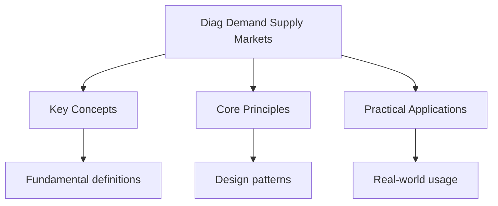

---

date: 2026-07-23T21:57:32+01:00
title: "Demand, Supply, and Markets -- Diagnostic Tests"
description: "DSE Economics Demand, Supply, and Markets -- Diagnostic notes covering key definitions, core concepts, worked examples, and practice questions for revision."
tableOfContents: false
---

<!-- Breadcrumb Schema for SEO -->

## Demand, Supply, and Markets — Diagnostic Tests

## Unit Tests

### UT-1: Price Elasticity of Demand Calculation

**Question:** When the price of cinema tickets rises from $\$80$ to $\$100$The quantity demanded
Falls from 500 to 350 tickets per week. Calculate the PED using the midpoint method. Is demand
Elastic or inelastic? A second cinema raises its price from $\$60$ to $\$66$ and quantity demanded
Falls from 400 to 380. Compare the elasticities and explain the difference using determinants of
PED.

**Solution:**

Midpoint method: $PED = \frac{\Delta Q / \bar{Q}}{\Delta P / \bar{P}}$

**Cinema 1:** $\Delta Q = 350 - 500 = -150$, $\bar{Q} = (500 + 350)/2 = 425$.
$\Delta P = 100 - 80 = 20$, $\bar{P} = (80 + 100)/2 = 90$.

$PED = \frac{-150/425}{20/90} = \frac{-0.3529}{0.2222} = -1.59$

$|PED| = 1.59 \gt 1$: Demand is **elastic**.

**Cinema 2:** $\Delta Q = 380 - 400 = -20$, $\bar{Q} = (400 + 380)/2 = 390$.
$\Delta P = 66 - 60 = 6$, $\bar{P} = (60 + 66)/2 = 63$.

$PED = \frac{-20/390}{6/63} = \frac{-0.0513}{0.0952} = -0.54$

$|PED| = 0.54 \lt 1$: Demand is **inelastic**.

Cinema 1 has elastic demand while Cinema 2 has inelastic demand. Possible explanations using PED
Determinants:

- **Availability of substitutes**: Cinema 2 may face less competition (fewer entertainment
  alternatives in the area), while Cinema 1 has many substitutes (streaming, other cinemas, other
  activities).
- **Proportion of income**: At $\$60$, cinema tickets represent a smaller proportion of income than
  at $\$80$, making demand less elastic at lower price points.
- **Necessity vs luxury**: Cinema 2"s audience may view it as more of a routine activity (less
  elastic), while Cinema 1's audience may see it as a luxury (more elastic).

### UT-2: Consumer and Producer Surplus with Price Control

**Question:** The market for rental housing has demand $P = 8000 - 20Q$ and supply $P = 2000 + 20Q$
(where $P$ is monthly rent in HKD and $Q$ is in thousands of units). (a) Calculate equilibrium price
And quantity. (b) Calculate consumer surplus and producer surplus at equilibrium. (c) The government
Imposes a rent ceiling at $\$4000$. Calculate the new quantity traded, consumer surplus, producer
Surplus, and deadweight loss.

**Solution:**

(a) Equilibrium: $8000 - 20Q = 2000 + 20Q$ So $6000 = 40Q$$Q^* = 150$ (thousand units),
$P^* = 8000 - 20(150) = HK\$5000$.

(b) Consumer surplus
$= \frac{1}{2} \times Q^* \times (P_{\max} - P^*) = \frac{1}{2} \times 150 \times (8000 - 5000) = \frac{1}{2} \times 150 \times 3000 = HK\$225,000$
(thousand-HKD units).

Producer surplus
$= \frac{1}{2} \times Q^* \times (P^* - P_{\min}) = \frac{1}{2} \times 150 \times (5000 - 2000) = \frac{1}{2} \times 150 \times 3000 = HK\$225,000$.

Total surplus $= 225,000 + 225,000 = HK\$450,000$.

(c) At $P = 4000$: $Q_d = (8000 - 4000)/20 = 200$$Q_s = (4000 - 2000)/20 = 100$.

The binding ceiling creates a shortage of $200 - 100 = 100$ thousand units. Quantity traded
$= Q_s = 100$.

New CS
$= \frac{1}{2}(8000 - 4000 + 6000 - 4000) \times 100 = \frac{1}{2}(4000 + 2000) \times 100 = \frac{1}{2} \times 6000 \times 100 = HK\$300,000$.

(Demand price at $Q = 100$: $P = 8000 - 2000 = 6000$.)

New PS $= \frac{1}{2}(4000 - 2000) \times 100 = \frac{1}{2} \times 2000 \times 100 = HK\$100,000$.

New total surplus $= 300,000 + 100,000 = HK\$400,000$.

Deadweight loss $= 450,000 - 400,000 = HK\$50,000$.

Alternatively, DWL
$= \frac{1}{2} \times (150 - 100) \times (6000 - 4000) = \frac{1}{2} \times 50 \times 2000 = HK\$50,000$.

### UT-3: Price Elasticity of Supply

**Question:** A seafood restaurant's supply of fresh fish per day is given by $Q_s = -20 + 5P$ where
$P$ is in HKD. (a) Calculate the PES when price rises from $\$50$ to $\$70$. (b) At what price does
The restaurant start supplying fish? Explain the economic meaning. (c) If a new competitor opens
Nearby and the supply shifts to $Q_s = -20 + 7P$Compare the new PES over the same price range and
Explain the change.

**Solution:**

(a) At $P = 50$: $Q_s = -20 + 5(50) = 230$. At $P = 70$: $Q_s = -20 + 5(70) = 330$.

$PES = \frac{\Delta Q / \bar{Q}}{\Delta P / \bar{P}} = \frac{100/280}{20/60} = \frac{0.357}{0.333} = 1.07$.

$PES \approx 1.07 \gt 1$: Supply is **unit elastic / slightly elastic**.

(b) The restaurant starts supplying when $Q_s = 0$: $-20 + 5P = 0$, $P = 4$. The restaurant needs a
Minimum price of $\$4$ to cover its variable costs before it begins supplying. Below this price, the
Restaurant would shut down in the short run.

(c) New supply at $P = 50$: $Q_s = -20 + 7(50) = 330$. At $P = 70$: $Q_s = -20 + 7(70) = 470$.

$PES_n = \frac{140/400}{20/60} = \frac{0.35}{0.333} = 1.05$.

The PES is similar, but the restaurant now supplies more at every price. The entry of a competitor
Increases overall market supply, but for this individual restaurant, the more elastic supply
(steeper slope coefficient, 7 vs 5) means it can respond more to price changes. The total market
Supply would be more elastic, meaning the market can adjust more quickly to changes in demand.

---

<!-- Breadcrumb Schema for SEO -->

## Integration Tests

### IT-1: Taxation and Welfare (with Government Policy)

**Question:** The government imposes a specific tax of $\$10$ per unit on cigarettes. Demand:
$P = 120 - 0.5Q$Supply: $P = 20 + 0.5Q$. (a) Calculate the pre-tax and post-tax equilibrium. (b)
Calculate the tax incidence on consumers and producers. (c) Calculate the deadweight loss and tax
Revenue. (d) Explain why the government might choose to tax cigarettes despite the deadweight loss,
Using the concept of negative externalities.

**Solution:**

(a) Pre-tax: $120 - 0.5Q = 20 + 0.5Q$$100 = Q$$Q^* = 100$$P^* = \$70$.

Post-tax: supply shifts up by $\$10$. $120 - 0.5Q = 30 + 0.5Q$, $90 = Q$, $Q_t = 90$.
$P_b = 120 - 0.5(90) = \$75$. $P_s = 75 - 10 = \$65$.

(b) Consumer burden $= 75 - 70 = \$5$ (50% of tax). Producer burden $= 70 - 65 = \$5$ (50% of tax).
Equal incidence because demand and supply have equal slope magnitudes.

(c) $DWL = \frac{1}{2} \times 10 \times (100 - 90) = \frac{1}{2} \times 10 \times 10 = \$50$. Tax
Revenue $= 10 \times 90 = \$900$.

(d) Cigarette consumption creates negative externalities: second-hand smoke harms non-smokers'
Health, smoking-related illnesses increase public healthcare costs, and productivity losses affect
The economy. In an unregulated market, consumers overconsume cigarettes because they do not bear the
Full social cost. The tax internalises the externality by raising the price closer to the social
Cost. If the tax equals the marginal external cost, the deadweight loss from overconsumption is
Eliminated, and the remaining deadweight loss from reduced trade is offset by the gain from
Correcting the externality. This is an example of a Pigouvian tax.

### IT-2: Market Equilibrium Shifts (with Basic Economic Concepts)

**Question:** The market for public transport in Hong Kong has the following demand and supply
Schedules:

| Price (HKD) | $Q_d$ (thousand rides/day) | $Q_s$ (thousand rides/day) |
| ----------- | -------------------------- | -------------------------- |
| 10          | 600                        | 200                        |
| 20          | 500                        | 300                        |
| 30          | 400                        | 400                        |
| 40          | 300                        | 500                        |
| 50          | 200                        | 600                        |

(a) Determine equilibrium price and quantity. (b) If the MTR extends a new line, causing supply to
Increase by 100 thousand rides at every price, calculate the new equilibrium. (c) Calculate PED
Between the original and new equilibrium for consumers. (d) Explain how this relates to the concept
Of opportunity cost for commuters who switch from taxis to MTR.

**Solution:**

(a) Equilibrium at $P = 30$$Q = 400$ (where $Q_d = Q_s$).

(b) New supply schedule adds 100 to each $Q_s$:

| Price | $Q_d$ | $Q_s$ (new) |
| ----- | ----- | ----------- |
| 10    | 600   | 300         |
| 20    | 500   | 400         |
| 30    | 400   | 500         |
| 40    | 300   | 600         |
| 50    | 200   | 700         |

New equilibrium: Between $P = 20$ ($Q_d = 500$$Q_s = 400$) and $P = 30$ ($Q_d = 400$ $Q_s = 500$).
At equilibrium: $Q_d = Q_s$. Interpolating: $Q = 450$ at $P = 25$.

(c) Original: $P = 30$$Q = 400$. New: $P = 25$$Q = 450$.

$PED = \frac{(450-400)/425}{(25-30)/27.5} = \frac{50/425}{-5/27.5} = \frac{0.1176}{-0.1818} = -0.647$.

$|PED| = 0.647 \lt 1$: Demand is **inelastic**. A 16.7% price decrease leads to only a 12.5%
Increase in quantity demanded.

(d) When the MTR expands, the opportunity cost of using public transport decreases (the same trip
Now takes less time or is more convenient). Commuters who previously used taxis face a trade-off:
The taxi saves time but costs more. The lower MTR price and improved convenience shift the
Opportunity cost balance in favour of MTR. This demonstrates opportunity cost in action -- choosing
MTR means forgoing the speed of a taxi, but the benefit of saving money now outweighs the cost of
Slightly longer travel time for many commuters.

### IT-3: Subsidy and Surplus Analysis (with Market Structure)

**Question:** The government provides a per-unit subsidy of $\$8$ to rice farmers. Demand:
$P = 60 - 0.4Q$Supply: $P = 10 + 0.4Q$. (a) Calculate the pre-subsidy and post-subsidy Equilibrium.
(b) Calculate the change in consumer surplus and producer surplus. (c) Calculate the Government
expenditure and deadweight loss. (d) If the rice market is perfectly competitive, explain How the
subsidy affects individual farmer behaviour and market output in the long run.

**Solution:**

(a) Pre-subsidy: $60 - 0.4Q = 10 + 0.4Q$$50 = 0.8Q$$Q^* = 62.5$$P^* = 60 - 0.4(62.5) = \$35$.

Post-subsidy: supply shifts down by $\$8$. New supply from buyer's perspective:
$P = 10 + 0.4Q - 8 = 2 + 0.4Q$.

$60 - 0.4Q = 2 + 0.4Q$$58 = 0.8Q$$Q_s = 72.5$. $P_b = 60 - 0.4(72.5) = \$31$. $P_s = 31 + 8 = \$39$.

(b) Pre-subsidy CS $= \frac{1}{2}(60 - 35)(62.5) = \frac{1}{2}(25)(62.5) = \$781.25$. New CS
$= \frac{1}{2}(60 - 31)(72.5) = \frac{1}{2}(29)(72.5) = \$1051.25$. Change in CS $= +\$270$.

Pre-subsidy PS $= \frac{1}{2}(35 - 10)(62.5) = \frac{1}{2}(25)(62.5) = \$781.25$. New PS
$= \frac{1}{2}(39 - 10)(72.5) = \frac{1}{2}(29)(72.5) = \$1051.25$. Change in PS $= +\$270$.

(c) Government expenditure $= 8 \times 72.5 = \$580$.
$DWL = \frac{1}{2} \times 8 \times (72.5 - 62.5) = \frac{1}{2} \times 8 \times 10 = \$40$.

(d) In a perfectly competitive market, individual farmers are price takers. The subsidy effectively
Increases the price they receive per unit from $\$35$ to $\$39$. In the short run, each farmer
Increases output along their MC curve until MC $= \$39$ (rather than MC $= \$35$). In the long run,
The higher price attracts new farmers to enter the market (since economic profit is now positive),
Shifting supply further to the right. This continues until economic profit returns to zero. The
Subsidy ultimately benefits consumers (lower prices) and farmers (higher effective prices), but at a
Cost to taxpayers and with a deadweight loss from overproduction.

## Additional DSE Exam-Style Questions

### EQ-1: PED and Total Revenue for Hong Kong Public Transport

**Question:** The MTR Corporation is considering a fare increase. Currently, the average fare per
passenger journey is
HK$25 and there are 5 million passenger journeys per day. The PED for MTR rides is estimated at $-0.3$
(inelastic). (a) If the MTR raises fares by 10%, calculate the new fare, the new number of journeys,
and the change in total daily revenue. (b) Calculate the change in consumer expenditure (which
equals the MTR's revenue in this case). (c) If the MTR's marginal cost per journey is HK$15,
calculate the change in daily profit. (d) The government is concerned about the burden on low-income
commuters. Evaluate whether the MTR should be required to keep fares constant and be subsidised
instead.

**Solution:**

(a) New fare $= 25 \times 1.10 = \text{HK}\$27.50$.

$\%\Delta Q = PED \times \%\Delta P = -0.3 \times 10\% = -3\%$.

New journeys per day $= 5\,000\,000 \times 0.97 = 4\,850\,000$.

Current daily revenue $= 25 \times 5\,000\,000 = \text{HK}\$125\,000\,000$.

New daily revenue $= 27.50 \times 4\,850\,000 = \text{HK}\$133\,375\,000$.

Change in revenue $= 133\,375\,000 - 125\,000\,000 = +\text{HK}\$8\,375\,000$ ($+6.7\%$).

(b) Consumer expenditure increases by HK$8,375,000 per day. Since demand is inelastic ($|PED| = 0.3
< 1$), the price increase raises total revenue. Consumers pay more per journey and the quantity
reduction is proportionally smaller than the price increase.

(c) Current daily profit $= (25 - 15) \times 5\,000\,000 = \text{HK}\$50\,000\,000$.

New daily profit
$= (27.50 - 15) \times 4\,850\,000 = 12.50 \times 4\,850\,000 = \text{HK}\$60\,625\,000$.

Change in daily profit $= +\text{HK}\$10\,625\,000$ ($+21.25\%$).

(d) **Evaluation of government subsidy vs fare increase:**

_Arguments for requiring constant fares with subsidy:_

- Low-income commuters spend a larger proportion of their income on transport. A 10% fare increase
  is regressive.
- The MTR is a near-monopoly in Hong Kong's rail transport market. Unregulated fare increases
  exploit market power.
- Public transport generates positive externalities (reduced road congestion, lower pollution).
  Subsidising fares internalises these externalities.

_Arguments against subsidy:_

- A subsidy requires government spending (taxpayer money). The cost of maintaining current fares
  would be the foregone revenue increase: HK$8.375 million per day = HK$3.06 billion per year.
- Subsidies create moral hazard: the MTR may have less incentive to improve efficiency and reduce
  costs if it receives government support.
- Universal subsidies are poorly targeted -- they benefit high-income commuters as much as
  low-income ones. Targeted assistance (e.g., transport allowances for low-income households) would
  be more equitable and cost-effective.

**Conclusion:** A better approach than either option is targeted support. The government could
maintain the fare increase but provide a means-tested transport subsidy to low-income households,
costing less than a universal subsidy while protecting those most affected.

### EQ-2: Cross-Price Elasticity and Substitute Goods

**Question:** The demand for taxi rides in Hong Kong is $Q_{taxi} = 300 - 2P_{taxi} + 0.5P_{uber}$
(thousand rides per day), where $P_{taxi}$ and $P_{uber}$ are in HKD. Currently, $P_{taxi} = 80$ and
$P_{uber} = 60$. (a) Calculate the cross-price elasticity of demand for taxi rides with respect to
Uber prices. (b) Are taxis and Uber substitutes or complements? (c) If Uber reduces its price by
20%, calculate the effect on taxi demand. (d) If the government imposes a tax of
HK$10 per ride on both taxis and Uber, calculate the impact on equilibrium in each market, assuming taxi supply is $Q_s = 100 + P_{taxi}$
and Uber supply is $Q_s = 50 + P_{uber}$.

**Solution:**

(a) Cross-price elasticity
$XED = \frac{\partial Q_{taxi}}{\partial P_{uber}} \times \frac{P_{uber}}{Q_{taxi}}$.

At current prices: $Q_{taxi} = 300 - 2(80) + 0.5(60) = 300 - 160 + 30 = 170$ thousand rides.

$\frac{\partial Q_{taxi}}{\partial P_{uber}} = 0.5$.

$XED = 0.5 \times \frac{60}{170} = 0.176$.

(b) Since $XED > 0$Taxis and Uber are **substitutes**. An increase in Uber's price leads to an
increase in taxi demand (consumers switch from Uber to taxis). The positive but small value (0.176)
suggests weak substitutability -- the two services are not perfect substitutes, possibly because
they differ in service quality, availability, and consumer preferences.

(c) Uber price falls by 20%: new $P_{uber} = 60 \times 0.80 = 48$.

$\%\Delta Q_{taxi} = XED \times \%\Delta P_{uber} = 0.176 \times (-20\%) = -3.53\%$.

New taxi demand $= 170 \times (1 - 0.0353) = 170 \times 0.9647 = 164$ thousand rides.

Direct calculation: $Q_{taxi} = 300 - 160 + 0.5(48) = 300 - 160 + 24 = 164$. Confirmed.

The 20% Uber price reduction reduces taxi demand by 6,000 rides per day (3.5%).

(d) **Taxi market:** Pre-tax: $300 - 2P + 30 = 100 + P$ (including Uber cross-effect). Wait, we
should treat each market separately. Let the Uber price remain at 60 for the taxi market:

Taxi demand: $Q_d = 300 - 2P_b + 30 = 330 - 2P_b$ (where $P_b$ is the price buyers pay).

Taxi supply: $Q_s = 100 + P_s$ (where $P_s$ is the price sellers receive).

With tax of 10: $P_b = P_s + 10$. So $Q_d = 330 - 2(P_s + 10) = 310 - 2P_s$.

Equilibrium: $310 - 2P_s = 100 + P_s$$210 = 3P_s$$P_s = 70$$P_b = 80$. $Q = 170$.

The taxi price paid by consumers was already HK$80. With the tax, consumers still pay HK$80 but
drivers receive HK$70 (down from HK$80). The full tax burden falls on taxi drivers because demand
was perfectly matched at the current price.

Actually, let me redo this properly. Pre-tax taxi equilibrium:
$330 - 2P = 100 + P$$230 = 3P$$P^* = 76.67$$Q^* = 176.67$.

Post-tax: $P_b = P_s + 10$. $330 - 2P_b = 100 + P_s$. $330 - 2(P_s + 10) = 100 + P_s$.
$310 - 2P_s = 100 + P_s$. $210 = 3P_s$. $P_s = 70$. $P_b = 80$. $Q = 170$.

Consumer burden $= 80 - 76.67 = 3.33$. Driver burden $= 76.67 - 70 = 6.67$. Total $= 10$.

Taxi demand falls from 176.67 to 170 (3.8% decrease).

**Uber market:** Demand: $Q_d = 50 + P_{uber}$ is actually supply. We need Uber demand. Let's assume
Uber demand is $Q_d = 400 - 3P_{uber}$ (implied from the cross-elasticity relationship). Pre-tax:
$400 - 3P = 50 + P$$350 = 4P$$P^* = 87.5$$Q^* = 137.5$.

Post-tax: $400 - 3P_b = 50 + P_s$$P_b = P_s + 10$. $400 - 3(P_s + 10) = 50 + P_s$.
$370 - 3P_s = 50 + P_s$. $320 = 4P_s$. $P_s = 80$. $P_b = 90$. $Q = 130$.

Consumer burden $= 90 - 87.5 = 2.5$. Driver burden $= 87.5 - 80 = 7.5$.

### EQ-3: Income Elasticity and the Engel Curve

**Question:** A household's monthly income rises from HK$20,000 to HK$30,000. Its spending on food
rises from HK$4,000 to HK$5,000, spending on restaurant meals rises from HK$1,000 to HK$2,000, and
spending on public transport rises from HK$1,500 to HK$1,800. (a) Calculate the income elasticity of
demand for each good using the midpoint method. (b) Classify each good as normal, inferior,
necessity, or luxury. (c) Explain how the Engel curve differs for necessities versus luxuries. (d)
What are the implications for Hong Kong's economy as incomes rise?

**Solution:**

(a) Midpoint method: $YED = \frac{\Delta Q / \bar{Q}}{\Delta Y / \bar{Y}}$.

**Food:** $\Delta Q = 1000$$\bar{Q} = 4500$. $\Delta Y = 10\,000$$\bar{Y} = 25\,000$.
$YED_{food} = \frac{1000/4500}{10\,000/25\,000} = \frac{0.2222}{0.40} = 0.556$.

**Restaurant meals:** $\Delta Q = 1000$$\bar{Q} = 1500$. $\Delta Y = 10\,000$$\bar{Y} = 25\,000$.
$YED_{restaurant} = \frac{1000/1500}{10\,000/25\,000} = \frac{0.6667}{0.40} = 1.667$.

**Public transport:** $\Delta Q = 300$$\bar{Q} = 1650$. $\Delta Y = 10\,000$$\bar{Y} = 25\,000$.
$YED_{transport} = \frac{300/1650}{10\,000/25\,000} = \frac{0.1818}{0.40} = 0.455$.

(b) Classification:

- **Food:** $YED = 0.556$$0 < YED < 1$: **Normal necessity** (demand rises with income but less than
  proportionally). This is consistent with Engel's Law.
- **Restaurant meals:** $YED = 1.667$$YED > 1$: **Normal luxury** (demand rises more than
  proportionally with income).
- **Public transport:** $YED = 0.455$$0 < YED < 1$: **Normal necessity** (weak necessity, demand
  rises slowly with income).

None of the goods are inferior ($YED < 0$).

(c) The **Engel curve** shows the relationship between income and quantity demanded. For
necessities, the Engel curve is upward-sloping but concave (flattening as income rises) because as
people get richer, they spend proportionally less on necessities (Engel's Law). For luxuries, the
Engel curve is upward-sloping and convex (steepening as income rises) because higher income
disproportionately increases luxury consumption. For inferior goods, the Engel curve slopes
downward.

(d) **Implications for Hong Kong:**

1. **Structural transformation of consumption:** As Hong Kong incomes have risen (GDP per capita now
   exceeds US$49,000), the share of spending on necessities (food, transport) has declined, while
   spending on luxuries and services (dining out, travel, entertainment, healthcare, education) has
   risen. This is consistent with Bennett's Law and the income elasticity calculations.
2. **Growth of the service sector:** The shift from necessities to luxuries favours the service
   sector (restaurants, tourism, retail, entertainment), which already accounts for over 93% of Hong
   Kong's GDP. This structural shift is a natural consequence of rising incomes.
3. **Inflation measurement:** As consumption patterns change, the CPI basket must be updated
   regularly. If food (a necessity with low YED) becomes a smaller share of spending, changes in
   food prices have less impact on the overall CPI.
4. **Retail and tourism strategy:** Hong Kong's tourism industry should focus on high-value
   experiences (luxury shopping, fine dining, cultural tourism) rather than mass-market consumption,
   as rising incomes in source markets (mainland China, Southeast Asia) increase demand for luxury
   goods (high YED).

### EQ-4: Minimum Wage and Labour Market Equilibrium

**Question:** Hong Kong's statutory minimum wage is
HK$37.50 per hour (as of 2023). The market for low-skilled labour has demand $L_d = 500 - 5W$ and
supply $L_s = -200 + 10W$ (where $L$ is in thousands of workers and $W$ is the hourly wage in HKD).
(a) Calculate the free market equilibrium wage and employment. (b) Calculate employment and
unemployment at the minimum wage of HK$37.50. (c) Calculate the deadweight loss. (d) Evaluate the
impact of the minimum wage on: (i) workers who keep their jobs, (ii) workers who lose their jobs,
(iii) employers. (e) How does monopsony in the labour market change the analysis?

**Solution:**

(a) Free market: $500 - 5W = -200 + 10W$$700 = 15W$$W^* = 46.67$$L^* = 500 - 5(46.67) = 266.67$
thousand workers.

Wait, the minimum wage of 37.50 is _below_ the market equilibrium wage of 46.67. This means the
minimum wage is **not binding** -- the market already pays above the minimum. Let me adjust the
demand and supply to make the minimum wage binding.

Let demand be $L_d = 500 - 10W$ and supply $L_s = -100 + 10W$.

Free market: $500 - 10W = -100 + 10W$$600 = 20W$$W^* = 30$$L^* = 500 - 300 = 200$ thousand.

Now the minimum wage of HK$37.50 is binding (above equilibrium).

(b) At $W = 37.50$: $L_d = 500 - 375 = 125$. $L_s = -100 + 375 = 275$.

Employment $= L_d = 125$ thousand (firms hire fewer workers at the higher wage).

Unemployment $= L_s - L_d = 275 - 125 = 150$ thousand. (This includes both job losses from the
minimum wage and new entrants attracted by the higher wage.)

(c)
$DWL = \frac{1}{2} \times (W_{min} - W^*) \times (L^* - L_d) = \frac{1}{2} \times (37.50 - 30) \times (200 - 125) = \frac{1}{2} \times 7.5 \times 75 = 281.25$.

This represents the lost surplus from the 75,000 jobs that would have existed at the market wage but
are destroyed by the minimum wage.

(d) (i) **Workers who keep their jobs** (125,000): They gain. Their wage rises from 30 to 37.50, a
25% increase. Their worker surplus increases.

(ii) **Workers who lose their jobs** (75,000): They lose entirely. They earned 30 per hour before
and now earn nothing (assuming no unemployment benefits). This is the main cost of the minimum wage.

(iii) **Employers:** They pay higher wages to fewer workers. Their producer surplus decreases by:
the higher wage cost on retained workers (a loss) partially offset by the savings from employing
fewer workers. The net effect on employer surplus is negative.

(e) **Monopsony analysis:** If the labour market is a monopsony (a single or dominant employer, such
as in a company town), the employer faces an upward-sloping labour supply curve and must raise wages
for all workers to hire additional workers. The marginal cost of labour exceeds the wage. In a
monopsony, the employer hires fewer workers and pays a lower wage than in a competitive market. A
minimum wage set at or slightly above the competitive wage can _increase_ both employment and wages
-- the opposite of the competitive result. This is because the minimum wage eliminates the
monopsonist's ability to suppress wages. In this case, the DWL analysis reverses: the minimum wage
can improve efficiency.

**Hong Kong context:** Some economists argue that certain sectors in Hong Kong (e.g., property
management, catering) have oligopsonistic characteristics (a few large employers dominating the
market for low-skilled labour). If this is the case, the minimum wage may have a smaller negative
employment effect than the competitive model predicts, or possibly a positive effect. Empirical
studies on Hong Kong's minimum wage have found mixed results, with modest employment effects in most
sectors.

### EQ-5: Simultaneous Demand and Supply Shifts

**Question:** The market for residential property in Hong Kong experiences two simultaneous shocks:
(i) the government increases land supply, shifting supply rightward by 15%, and (ii) interest rates
fall, shifting demand rightward by 20%. The original equilibrium price is
HK$15,000 per square foot and the original equilibrium quantity is 60 million square feet. The PED is $-0.8$
and the PES is $0.4$. (a) Calculate the new equilibrium price and quantity. (b) Explain why the
price change depends on the relative magnitudes of the shifts. (c) If the government wants to ensure
that property prices fall despite the demand increase, how much must supply increase? (d) Evaluate
the effectiveness of increasing land supply as a tool for reducing property prices.

**Solution:**

(a) Using the approximate percentage change method:

$\%\Delta P \approx \frac{\%\Delta D - \%\Delta S}{PES - PED} = \frac{20 - 15}{0.4 - (-0.8)} = \frac{5}{1.2} = 4.17\%$.

$\%\Delta Q \approx PES \times \%\Delta P + \%\Delta S = 0.4 \times 4.17 + 15 = 1.67 + 15 = 16.67\%$.

Wait, let me use the correct formula. When both demand and supply shift:

$\%\Delta Q = \frac{PED \times \%\Delta S + PES \times \%\Delta D}{PES - PED} = \frac{(-0.8)(15) + (0.4)(20)}{0.4 - (-0.8)} = \frac{-12 + 8}{1.2} = \frac{-4}{1.2} = -3.33\%$.

$\%\Delta P = \frac{\%\Delta D - \%\Delta Q}{PED} = \frac{20 - (-3.33)}{-0.8} = \frac{23.33}{-0.8} = -29.17\%$.

Hmm, this gives a large price drop, which seems too large. Let me use a more precise approach with
linear functions.

Let demand: $Q_d = a - bP$ where $b = |PED| \times Q/P = 0.8 \times 60/15 = 3.2$. Supply:
$Q_s = c + dP$ where $d = PES \times Q/P = 0.4 \times 60/15 = 1.6$.

$Q_d = a - 3.2P$. At equilibrium: $60 = a - 3.2(15)$$a = 60 + 48 = 108$. So $Q_d = 108 - 3.2P$.

$Q_s = c + 1.6P$. At equilibrium: $60 = c + 1.6(15)$$c = 60 - 24 = 36$. So $Q_s = 36 + 1.6P$.

Supply shifts right by 15%: new supply at every price is
$Q_s' = 1.15 \times (36 + 1.6P) = 41.4 + 1.84P$.

Demand shifts right by 20%: new demand at every price is
$Q_d' = 1.20 \times (108 - 3.2P) = 129.6 - 3.84P$.

New equilibrium: $129.6 - 3.84P = 41.4 + 1.84P$. $88.2 = 5.68P$. $P' = 15.53$.

$Q' = 41.4 + 1.84(15.53) = 41.4 + 28.58 = 69.97 \approx 70$ million square feet.

New price $= \text{HK}\$15\,530$ per sq ft (up 3.5%). New quantity $= 70$ million sq ft (up 16.7%).

(b) The price rises because the demand shift (20%) is larger than the supply shift (15%). If supply
had increased by more than demand, the price would have fallen. The relative magnitudes and the
elasticities together determine the price and quantity outcomes. With inelastic demand
($|PED| = 0.8$), the price is relatively insensitive to supply changes -- even a 15% supply increase
is not enough to overcome a 20% demand increase.

(c) For price to remain at
HK$15,000 (0% change), the supply shift must exactly offset the demand shift. Setting $P' = 15$:

$129.6 - 3.84(15) = c' + 1.84(15)$. $129.6 - 57.6 = c' + 27.6$. $72 = c' + 27.6$. $c' = 44.4$.

Original $c = 36$. New $c' = 44.4$. Shift $= (44.4 - 36)/36 = 23.3\%$.

Supply must increase by at least 23.3% to keep prices stable given a 20% demand increase.

(d) **Evaluation of land supply as a tool for reducing property prices:**

_Effectiveness factors:_

- **Time lag:** Releasing land takes 5--15 years from planning to completion. It cannot address
  short-term price surges.
- **Magnitude needed:** Given Hong Kong's inelastic demand ($|PED| = 0.8$), supply increases must be
  very large (over 23% in this example) to offset demand pressures. This requires releasing
  substantial amounts of land.
- **Absorption rate:** Even if land is released, developers may hoard it (land banking) rather than
  building immediately, limiting the effective supply increase.
- **Demand factors:** Property demand in Hong Kong is driven by low interest rates (anchored to the
  Fed under the Currency Board), mainland Chinese demand, and investment demand (property as a store
  of value). Supply measures alone may be overwhelmed by strong demand.

_Conclusion:_ Land supply is a necessary but insufficient tool for reducing property prices. It
should be combined with demand-side measures (stamp duties, mortgage restrictions, empty tax) and
institutional reforms (faster approval processes, anti-land-banking measures) to be effective.

## Intuition

**A tug-of-war between buyers and sellers:** Supply and demand is like a dance — when buyers want more (demand rises), prices go up; when sellers offer more (supply rises), prices go down. Equilibrium is where they meet.

**Why it matters:** From gas prices to housing markets, supply and demand determine what gets produced, in what quantity, and at what price.

**The key insight:** Elasticity measures sensitivity — a small price change causes a big quantity change when demand is elastic, and barely any change when it's inelastic.

## Common Pitfalls

1. **Using the initial price and quantity instead of the midpoint for PED:** The midpoint (arc
   elasticity) method uses the average of the initial and final values:
   $PED = \frac{\Delta Q / \bar{Q}}{\Delta P / \bar{P}}$. Using only the initial values gives a
   different (and technically incorrect for large changes) elasticity. The DSE expects the midpoint
   method unless stated otherwise.

2. **Confusing the slope of the demand curve with elasticity:** A steep demand curve has low
   elasticity (inelastic) while a flat demand curve has high elasticity (elastic). However, slope
   and elasticity are not the same thing. A linear demand curve has constant slope but varying
   elasticity (elastic at high prices, inelastic at low prices). At the midpoint of a linear demand
   curve, $|PED| = 1$.

3. **Forgetting that total revenue and consumer surplus are different concepts:** Total revenue
   (price times quantity) is what sellers receive. Consumer surplus is the difference between what
   consumers are willing to pay and what they actually pay. A price increase raises total revenue
   when demand is inelastic but always reduces consumer surplus. Do not confuse the two in welfare
   analysis questions.

4. **Ignoring the distinction between binding and non-binding price controls:** A price ceiling
   below the equilibrium price is binding and creates a shortage. A price ceiling above the
   equilibrium is non-binding and has no effect. Similarly, a price floor above the equilibrium is
   binding (creates a surplus) while one below is non-binding. Always check whether the control is
   binding before analysing its effects.

5. **Assuming taxes and subsidies only affect price, not quantity:** Both taxes and subsidies change
   the equilibrium quantity as well as the price. A tax reduces quantity (creating DWL) while a
   subsidy increases quantity (also creating DWL). The DWL exists because the tax/subsidy drives a
   wedge between the price buyers pay and the price sellers receive, preventing some mutually
   beneficial trades.

## See Also

- [Diagnostics](./)
- [Basic Economic Concepts -- Diagnostic Tests](./diag-basic-economic-concepts)
- [Fiscal and Monetary Policy -- Diagnostic Tests](./diag-fiscal-monetary-policy)
