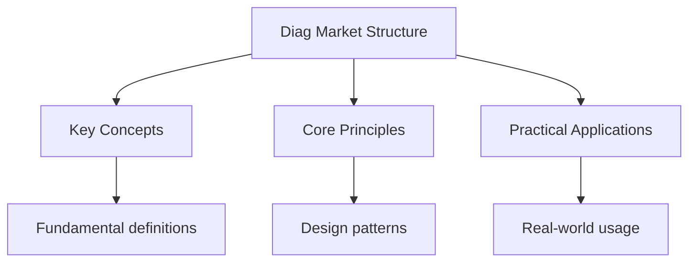

---

date: 2026-07-23T21:57:32+01:00
title: "Market Structure and Theory of the Firm -- Diagnostic Tests"
description: "DSE Economics Market Structure and Theory of the Firm -- notes covering key definitions, core concepts, worked examples, and practice questions for revision."
tableOfContents: false
---

<!-- Breadcrumb Schema for SEO -->

## Market Structure and Theory of the Firm — Diagnostic Tests

## Unit Tests

### UT-1: Perfect Competition Profit Maximisation

**Question:** A perfectly competitive firm has total cost $TC = 200 + 10Q + 0.5Q^2$ and faces a
Market price of $\$50$. (a) Calculate the profit-maximising output. (b) Calculate the profit at this
Output. (c) Determine whether the firm is in the short run or long run equilibrium. (d) Calculate
The shutdown price.

**Solution:**

(a) Profit maximisation: $MC = MR = P$. $MC = \frac{\text{dTC}}{    ext{dQ}} = 10 + Q$. Set
$10 + Q = 50$ So $Q^* = 40$.

(b) Profit
$= TR - TC = 50(40) - [200 + 10(40) + 0.5(40)^2] = 2000 - [200 + 400 + 800] = 2000 - 1400 = \$600$.

(c) Since profit $\gt 0$The firm is **not** in long-run equilibrium. In long-run equilibrium under
Perfect competition, economic profit $= 0$ (firms enter until price $=$ minimum ATC).

(d) Shutdown price $= $ minimum AVC. $VC = 10Q + 0.5Q^2$ So $AVC = 10 + 0.5Q$. Minimum AVC occurs
Where $\frac{\text{dAVC}}{    ext{dQ}} = 0.5 = 0$Which is at $Q = 0$. At $Q = 0$: $AVC = 10$. So the
Shutdown price is $\$10$. If price falls below $\$10$The firm shuts down because it cannot even
Cover its variable costs.

### UT-2: Monopoly Pricing and Deadweight Loss

**Question:** A monopolist faces demand $P = 100 - 2Q$ and has total cost $TC = 50 + 10Q + Q^2$. (a)
Calculate the profit-maximising price and quantity. (b) Calculate the monopolist"s profit. (c) What
Would the price and quantity be under perfect competition? (d) Calculate the deadweight loss of
Monopoly.

**Solution:**

(a) $MR = 100 - 4Q$. $MC = 10 + 2Q$. Set $MR = MC$: $100 - 4Q = 10 + 2Q$$90 = 6Q$$Q_m = 15$.
$P_m = 100 - 2(15) = \$70$.

(b) Profit
$= TR - TC = 70(15) - [50 + 10(15) + 15^2] = 1050 - [50 + 150 + 225] = 1050 - 425 = \$625$.

(c) Under perfect competition, $P = MC$: $100 - 2Q = 10 + 2Q$$90 = 4Q$$Q_c = 22.5$.
$P_c = 100 - 2(22.5) = \$55$.

(d)
$DWL = \frac{1}{2} \times (P_m - P_c) \times (Q_c - Q_m) = \frac{1}{2} \times (70 - 55) \times (22.5 - 15) = \frac{1}{2} \times 15 \times 7.5 = \$56.25$.

The deadweight loss represents the loss of total surplus due to the monopolist restricting output
And raising price above the competitive level.

### UT-3: Monopolistic Competition in the Long Run

**Question:** A monopolistically competitive firm faces demand $P = 80 - Q$ and has total cost
$TC = 100 + 20Q + 0.5Q^2$. (a) Calculate the short-run profit-maximising output, price, and profit.
(b) In the long run, new firms enter. What condition defines long-run equilibrium? (c) If in
Long-run equilibrium the demand shifts to $P = a - Q$ and costs remain the same, calculate the value
Of $a$ where economic profit is zero.

**Solution:**

(a) $MR = 80 - 2Q$. $MC = 20 + Q$. Set $MR = MC$: $80 - 2Q = 20 + Q$$60 = 3Q$$Q = 20$.
$P = 80 - 20 = \$60$.

Profit $= 60(20) - [100 + 20(20) + 0.5(20)^2] = 1200 - [100 + 400 + 200] = 1200 - 700 = \$500$.

(b) In long-run equilibrium, two conditions hold: (1) $MR = MC$ (profit maximisation), and (2)
$P = ATC$ (zero economic profit due to free entry and exit). The demand curve is tangent to the ATC
Curve at the profit-maximising quantity.

(c) Set $P = ATC$ at the profit-maximising quantity. $MR = a - 2Q$$MC = 20 + Q$. Set $MR = MC$:
$a - 2Q = 20 + Q$$a - 20 = 3Q$$Q = (a - 20)/3$.

$ATC = \frac{100 + 20Q + 0.5Q^2}{Q} = \frac{100}{Q} + 20 + 0.5Q$.

Set $P = ATC$: $a - Q = \frac{100}{Q} + 20 + 0.5Q$.

Substituting $Q = (a - 20)/3$:

$a - \frac{a - 20}{3} = \frac{300}{a - 20} + 20 + 0.5 \times \frac{a - 20}{3}$.

$\frac{3a - a + 20}{3} = \frac{300}{a - 20} + 20 + \frac{a - 20}{6}$.

$\frac{2a + 20}{3} = \frac{300}{a - 20} + \frac{120 + a - 20}{6} = \frac{300}{a - 20} + \frac{a + 100}{6}$.

$\frac{2a + 20}{3} - \frac{a + 100}{6} = \frac{300}{a - 20}$.

$\frac{4a + 40 - a - 100}{6} = \frac{300}{a - 20}$.

$\frac{3a - 60}{6} = \frac{300}{a - 20}$.

$\frac{a - 20}{2} = \frac{300}{a - 20}$.

$(a - 20)^2 = 600$.

$a - 20 = \sqrt{600} \approx 24.49$.

$a \approx 44.49$.

---

<!-- Breadcrumb Schema for SEO -->

## Integration Tests

### IT-1: Monopoly and Price Discrimination (with Government Intervention)

**Question:** A cinema is the only one in a small town and operates as a monopolist. Demand for
Adult tickets is $P_A = 40 - 0.5Q_A$ and for student tickets is $P_S = 20 - 0.5Q_S$. The cinema's
Marginal cost is constant at $\$4$ per ticket with no fixed costs. (a) If the cinema cannot price
Discriminate, calculate the profit-maximising price and quantity (combined demand). (b) If the
Cinema practises third-degree price discrimination, calculate the price and quantity for each group.
(c) Calculate the deadweight loss under each scenario. (d) The government considers regulating the
Cinema. Which form of regulation would maximise social welfare?

**Solution:**

(a) Combined demand (horizontal summation at each price): For $P \gt 20$: only adults buy,
$Q = Q_A = 80 - 2P$. For $P \le 20$: both groups buy,
$Q = Q_A + Q_S = (80 - 2P) + (40 - 2P) = 120 - 4P$.

Inverse demand for $P \le 20$: $P = 30 - 0.25Q$.

$MR = 30 - 0.5Q$. Set $MR = MC = 4$: $30 - 0.5Q = 4$$0.5Q = 26$$Q = 52$. $P = 30 - 0.25(52) = \$17$.

Since $P = 17 \le 20$Both groups are served. Profit $= 17(52) - 4(52) = 13(52) = \$676$.

(b) Third-degree price discrimination:

- Adults: $MR_A = 40 - Q_A = 4$$Q_A = 36$$P_A = 40 - 0.5(36) = \$22$.
- Students: $MR_S = 20 - Q_S = 4$$Q_S = 16$$P_S = 20 - 0.5(16) = \$12$.
- Total $Q = 52$Profit $= 22(36) + 12(16) - 4(52) = 792 + 192 - 208 = \$776$.

(c) Under no discrimination ($P = 17$$Q = 52$): competitive output would be where $P = MC = 4$.
$Q_c = 120 - 4(4) = 104$. $DWL = \frac{1}{2}(17 - 4)(104 - 52) = \frac{1}{2}(13)(52) = \$338$.

Under price discrimination ($Q = 52$ total): total DWL
$= \frac{1}{2}(22 - 4)(80 - 36) + \frac{1}{2}(12 - 4)(40 - 16) = \frac{1}{2}(18)(44) + \frac{1}{2}(8)(24) = 396 + 96 = \$492$.

**Note:** Price discrimination produces the same total quantity (52) but a different allocation
across Groups. The DWL calculation requires the competitive benchmark per group. Competitive output
($P = 4$): $Q_A = 80 - 8 = 72$$Q_S = 40 - 8 = 32$. Total competitive output $Q_c = 104$.

$DWL_{\text{no disc}} = \frac{1}{2}(17 - 4)(104 - 52) = \$338$.
$DWL_d = \frac{1}{2}(22 - 4)(72 - 36) + \frac{1}{2}(12 - 4)(32 - 16) = \frac{1}{2}(18)(36) + \frac{1}{2}(8)(16) = 324 + 64 = \$388$.

(d) To maximise social welfare, the government could regulate the cinema to charge $P = MC = \$4$
(marginal cost pricing). This would eliminate deadweight loss entirely but leave the cinema unable
To cover any fixed costs (which are zero in this case, so it is feasible). With positive fixed
Costs, the government might use average cost pricing instead.

### IT-2: Oligopoly and Game Theory (with Demand and Supply)

**Question:** Two firms, A and B, are duopolists in the market for bottled water. Each can choose a
High price ($P_H = \$10$) or a low price ($P_L = \$6$). The payoff matrix (monthly profit in
Thousands of HKD) is:

|             | B: High       | B: Low        |
| ----------- | ------------- | ------------- |
| **A: High** | A: 80, B: 80  | A: 30, B: 100 |
| **A: Low**  | A: 100, B: 30 | A: 50, B: 50  |

(a) Identify the Nash equilibrium. (b) Is this a prisoner's dilemma? Explain. (c) If the firms
Collude and split the market equally, what happens to their profits? Why might collusion be
Unstable? (d) The market demand is $P = 20 - 0.2Q$ and each firm has $MC = 4$. Calculate the Cournot
Equilibrium and compare with the collusive outcome.

**Solution:**

(a) For firm A: if B chooses High, A prefers Low (100 $\gt$ 80). If B chooses Low, A prefers Low (50
$\gt$ 30). Low is a dominant strategy for A. By symmetry, Low is also dominant for B. **Nash
Equilibrium: (Low, Low)** with profits (50, 50).

(b) Yes, this is a prisoner's dilemma. Both firms would be better off at (High, High) with profits
(80, 80) each, but the dominant strategy of Low leads to (Low, Low) with only (50, 50) each. The
Individual incentive to deviate from cooperation leads to a worse outcome for both.

(c) If they collude at (High, High), each earns 80 -- more than the Nash equilibrium of 50. However,
Collusion is unstable because each firm has an incentive to secretly cut price to Low, earning 100
While the other still charges High. Once one firm cheats, the other retaliates, and both end up at
(Low, Low). This is why cartels tend to break down without enforcement mechanisms.

(d) Cournot: each firm chooses $q_i$ taking the other's output as given. $Q = q_A + q_B$.
$P = 20 - 0.2(q_A + q_B)$.

Firm A: $\pi_A = P \cdot q_A - 4q_A = (20 - 0.2q_A - 0.2q_B - 4)q_A = (16 - 0.2q_A - 0.2q_B)q_A$.

FOC: $\frac{\partial \pi_A}{\partial q_A} = 16 - 0.4q_A - 0.2q_B = 0$ So $q_A = 40 - 0.5q_B$.

By symmetry: $q_B = 40 - 0.5q_A$. Solving:
$q_A = 40 - 0.5(40 - 0.5q_A) = 40 - 20 + 0.25q_A = 20 + 0.25q_A$. $0.75q_A = 20$
$q_A = q_B = 26.67$.

$Q_c = 53.33$$P_c = 20 - 0.2(53.33) = \$9.33$. Each firm earns $(9.33 - 4)(26.67) = \$142.2$.

Collusive (joint profit maximisation): $MR = 20 - 0.4Q = MC = 4$$Q_m = 40$$P_m = \$12$. Each Firm
produces 20, earning $(12 - 4)(20) = \$160$.

The Cournot output (53.33) is between perfect competition ($P = 4$$Q = 80$) and monopoly ($Q = 40$).
Collusion gives higher profit per firm (160 vs 142.2) but each has incentive to produce More than
their quota.

### IT-3: Market Structure Comparison (with Efficiency)

**Question:** Compare a perfectly competitive market and a monopoly market with the same cost
Structure: $TC = 100 + 2Q + 0.1Q^2$. The competitive market price is $\$12$. (a) Calculate the
Competitive market output and the monopoly output. (b) Calculate consumer surplus, producer surplus,
And total surplus under each market structure. (c) Calculate the deadweight loss of monopoly. (d)
Explain why a monopoly is allocatively inefficient, relating to the concept of marginal benefit
Equals marginal cost.

**Solution:**

(a) Competitive: $P = MC = 2 + 0.2Q = 12$ So $0.2Q = 10$$Q_c = 50$.

Monopoly: $MC = 2 + 0.2Q$. Need demand: at $P = 12$$Q = 50$. Assume linear demand through this Point
with choke price. $P = a - bQ$. From $MC$ curve: at $Q = 0$$MC = 2$. Let demand pass through
$(50, 12)$ with intercept at $P = 22$ (so $b = 10/50 = 0.2$). Demand: $P = 22 - 0.2Q$.

$MR = 22 - 0.4Q = MC = 2 + 0.2Q$. $20 = 0.6Q$$Q_m = 33.33$. $P_m = 22 - 0.2(33.33) = \$15.33$.

(b) **Perfect competition:**

- CS $= \frac{1}{2}(22 - 12)(50) = \frac{1}{2}(10)(50) = \$250$.
- PS $= TR - TC = 12(50) - [100 + 2(50) + 0.1(2500)] = 600 - [100 + 100 + 250] = 600 - 450 = \$150$.
- Total surplus $= 250 + 150 = \$400$.

**Monopoly:**

- CS $= \frac{1}{2}(22 - 15.33)(33.33) = \frac{1}{2}(6.67)(33.33) = \$111.1$.
- Profit
  $= 15.33(33.33) - [100 + 2(33.33) + 0.1(33.33)^2] = 511 - [100 + 66.67 + 111.1] = 511 - 277.8 = \$233.3$.
- Total surplus $= 111.1 + 233.3 = \$344.4$.

(c) DWL $= 400 - 344.4 = \$55.6$. Verifying directly: at $Q_m = 33.33$, $P_m = 15.33$ and
$MC = 2 + 0.2(33.33) = 8.67$. At $Q_c = 50$: $P_c = MC = 12$.

$DWL = \frac{1}{2}(P_m - MC_m)(Q_c - Q_m) = \frac{1}{2}(15.33 - 8.67)(50 - 33.33) = \frac{1}{2}(6.67)(16.67) = \$55.6$.

(d) Allocative efficiency requires $P = MC$Meaning marginal benefit (reflected in willingness to
Pay) equals marginal cost. In perfect competition, firms produce where $P = MC$Maximising total
Surplus. The monopoly restricts output to $Q_m \lt Q_c$ So for the units between $Q_m$ and $Q_c$
Consumers' marginal benefit exceeds the marginal cost of production. These mutually beneficial
Trades do not occur, creating a deadweight loss. The monopoly maximises its own profit rather than
Total social surplus, leading to an underallocation of resources to this good.

## Intuition

**A spectrum of competition:** Market structures range from perfect competition (many small firms, identical products) to monopoly (one firm controls everything). Each structure determines how firms set prices and earn profits.

**Why it matters:** From Uber to local restaurants, market structure determines pricing power, innovation, and consumer welfare. Antitrust laws exist to prevent harmful monopolies.

**The key insight:** In the long run, perfectly competitive firms earn zero economic profit — entry of new firms drives prices down to average cost.

## Additional DSE Exam-Style Questions

### EQ-1: Natural Monopoly and Regulation in Hong Kong

**Question:** The Hong Kong Electric Company (HEC) is a natural monopoly supplying electricity to
Hong Kong Island and Lamma Island. Its total cost function is $TC = 500 + 20Q$ (in millions of HKD,
where $Q$ is in GWh). The demand for electricity is $P = 100 - 0.5Q$ (in HKD/MWh). (a) Calculate the
profit-maximising price, quantity, and profit. (b) Calculate the outcome under marginal cost
pricing. (c) Calculate the outcome under average cost pricing. (d) Which regulatory approach would
you recommend for Hong Kong's electricity market, and why?

**Solution:**

(a) Monopoly: $MR = 100 - Q$. $MC = 20$. Set $MR = MC$: $100 - Q = 20$$Q_m = 80$ GWh.
$P_m = 100 - 0.5(80) = \text{HK}\$60$/MWh$.

Profit $= TR - TC = 60(80) - [500 + 20(80)] = 4800 - [500 + 1600] = 4800 - 2100 = 2700$ (million HKD
$=$ HK$2.7 billion).

(b) Marginal cost pricing: $P = MC = 20$. $100 - 0.5Q = 20$$0.5Q = 80$$Q = 160$ GWh.

Profit $= 20(160) - [500 + 20(160)] = 3200 - [500 + 3200] = 3200 - 3700 = -500$ (million HKD).

The firm makes a loss of HK$500 million equal to its fixed costs. This is unsustainable without
subsidy.

(c) Average cost pricing: $P = AC = \frac{500 + 20Q}{Q} = \frac{500}{Q} + 20$.

$100 - 0.5Q = \frac{500}{Q} + 20$. Multiply by $Q$: $100Q - 0.5Q^2 = 500 + 20Q$.
$0.5Q^2 - 80Q + 500 = 0$. $Q^2 - 160Q + 1000 = 0$.

$Q = \frac{160 \pm \sqrt{25600 - 4000}}{2} = \frac{160 \pm \sqrt{21600}}{2} = \frac{160 \pm 147.0}{2}$.

$Q = 153.5$ GWh (taking the larger root). $P = 100 - 0.5(153.5) = \text{HK}\$23.25$/MWh$.

Profit $\approx 0$ (the firm breaks even by construction of average cost pricing).

(d) **Recommendation:** For Hong Kong's electricity market, a **modified average cost pricing**
approach (known as the Scheme of Control Agreement) is appropriate.

_Rationale:_

- Marginal cost pricing (HK$20/MWh) is economically efficient (zero DWL) but requires a permanent
  government subsidy of HK$500 million, creating a fiscal burden and moral hazard.
- Profit-maximising monopoly (HK$60/MWh) creates large DWL and is politically unacceptable (high
  electricity prices burden households and businesses).
- Average cost pricing (HK$23.25/MWh) is a compromise: the firm breaks even (no subsidy needed),
  prices are much lower than monopoly levels, and the DWL is small (the quantity is 153.5 vs the
  efficient 160 -- only a 4% shortfall).

Hong Kong's actual regulatory framework (the Scheme of Control Agreement) uses a permitted rate of
return on capital, which is similar to average cost pricing. The government sets a maximum rate of
return (currently 8%), and if the company earns more, it must refund the excess to consumers through
lower tariffs. This provides an incentive for efficiency (the company keeps cost savings up to the
permitted return) while protecting consumers from excessive prices.

### EQ-2: Perfect Competition in the Long Run with Entry and Exit

**Question:** The market for a homogeneous good is perfectly competitive. Each firm has cost
function $TC = 100 + 2Q + 0.5Q^2$. Market demand is $P = 50 - 0.1Q$ (where $Q$ is total market
output in thousands). (a) Calculate the long-run equilibrium price, output per firm, and number of
firms. (b) If demand increases to $P = 60 - 0.1Q$Calculate the new long-run equilibrium. (c)
Calculate the short-run response (before new firms enter) and explain the adjustment process. (d)
Explain why firms earn zero economic profit in long-run perfect competition.

**Solution:**

(a) In long-run equilibrium: $P = MC = \min AC$.

$MC = 2 + Q$. $AC = 100/Q + 2 + 0.5Q$.

Minimum AC: $\frac{dAC}{dQ} = -100/Q^2 + 0.5 = 0$. $Q^2 = 200$. $Q = \sqrt{200} = 14.14$.

$\min AC = 100/14.14 + 2 + 0.5(14.14) = 7.07 + 2 + 7.07 = 16.14$.

Long-run price $P^* = 16.14$. Output per firm $= 14.14$.

Market demand: $Q_{market} = (50 - 16.14)/0.1 = 338.6$ (thousand units).

Number of firms $= 338.6 / 14.14 = 23.9 \approx 24$ firms.

(b) New demand: $P = 60 - 0.1Q$. The long-run price remains at 16.14 (since costs are unchanged and
firms enter/exit until profit $= 0$).

New market output $= (60 - 16.14)/0.1 = 438.6$ (thousand units).

Number of firms $= 438.6 / 14.14 = 31.0 \approx 31$ firms.

The increase in demand leads to 7 new firms entering the market, while the price and output per firm
remain unchanged.

(c) **Short-run response:** In the short run, the number of firms is fixed at 24. Each firm's supply
is its MC curve above minimum AVC (which is at $Q = 0$, $AVC = 2$ So minimum AVC $= 2$). Total market
supply $= 24 \times (2 + Q_i) = 48 + 24Q_i$ where $Q_i$ is per-firm output.

Setting $P = MC$ for each firm: $2 + Q_i = P$ So $Q_i = P - 2$. Total supply $= 24(P - 2)$.

Market equilibrium: $24(P - 2) = (60 - P)/0.1 = 600 - 10P$. $24P - 48 = 600 - 10P$. $34P = 648$.
$P = 19.06$.

Each firm produces $Q_i = 19.06 - 2 = 17.06$.

Profit per firm
$= 19.06(17.06) - [100 + 2(17.06) + 0.5(17.06)^2] = 325.3 - [100 + 34.12 + 145.5] = 325.3 - 279.6 = 45.7$
(positive economic profit).

**Adjustment process:** The positive economic profit attracts new firms. As firms enter, market
supply increases, pushing the price down. This continues until price returns to the minimum AC
(16.14), at which point economic profit is zero and entry stops.

(d) Zero economic profit in long-run perfect competition occurs because of **free entry and exit**.
If existing firms earn positive economic profit, new firms are attracted by the profit opportunity
and enter the market. This increases supply, lowers the market price, and reduces each firm's profit
until it reaches zero. If firms incur losses, some exit, reducing supply and raising the price until
remaining firms break even. Note that "zero economic profit" means firms earn a **normal profit**
(covering all opportunity costs including the owner's time and capital). Firms are willing to stay
in the market because they are earning exactly what they could earn in their next best alternative.

### EQ-3: Oligopoly -- Kinked Demand Curve Model

**Question:** An oligopolistic firm faces a kinked demand curve. At the current price of $\$50$, the
firm sells 100 units. For price increases, demand is elastic with $PED = -3$. For price decreases,
demand is inelastic with $PED = -0.5$. The firm's marginal cost is $\$30$ at current output. (a)
Calculate the price and quantity ranges over which the demand curve is elastic and inelastic. (b)
Calculate the marginal revenue for the elastic and inelastic segments at the current price. (c)
Explain why the kinked demand curve model predicts price rigidity. (d) Calculate the range of
marginal cost over which the firm would not change its price.

**Solution:**

(a) **Elastic segment (price increase):** Demand is $Q = a - bP$ where $|PED| = 3$ at
$(Q, P) = (100, 50)$.

$|PED| = \frac{dQ}{dP} \times \frac{P}{Q} = b \times \frac{50}{100} = 3$. So $b = 6$.

$Q = a - 6P$. At $(100, 50)$: $100 = a - 300$, $a = 400$. Elastic demand: $Q = 400 - 6P$.

**Inelastic segment (price decrease):** $|PED| = 0.5$ at $(100, 50)$.

$|PED| = b' \times \frac{50}{100} = 0.5$. $b' = 1$. $Q = a' - P$. At $(100, 50)$:
$100 = a' - 50$, $a' = 150$. Inelastic demand: $Q = 150 - P$.

(b) **Elastic MR:** $MR_1 = \frac{400}{6} - \frac{2Q}{6} = 66.67 - 0.333Q$. At $Q = 100$:
$MR_1 = 66.67 - 33.33 = 33.33$.

Alternatively, from $P = \frac{400 - Q}{6}$: $MR_1 = \frac{400}{6} - \frac{2Q}{6} = 66.67 - 0.333Q$.
At $Q = 100$: $MR_1 = 33.33$.

**Inelastic MR:** From $P = 150 - Q$: $MR_2 = 150 - 2Q$. At $Q = 100$: $MR_2 = 150 - 200 = -50$.

(c) The kinked demand curve model predicts price rigidity because there is a **gap in the marginal
revenue curve** at the kink point. The MR jumps discontinuously from $MR_1 = 33.33$ (just above the
kink) to $MR_2 = -50$ (just below the kink). As long as marginal cost falls within this gap
($-50 < MC < 33.33$), the profit-maximising output and price remain unchanged. This explains why
oligopolistic prices tend to be rigid even when costs change moderately.

(d) The price will not change as long as MC is in the range $MR_2 < MC < MR_1$I.e.,
$-50 < MC < 33.33$.

Since MC cannot be negative, the practical range is $0 < MC < 33.33$. The firm's current MC is
$\$30$, which falls within this range, confirming that the current price of $\$50$ is optimal and
will not change unless MC rises above $\$33.33$ or falls below $\$0$.

### EQ-4: Monopolistic Competition and Excess Capacity

**Question:** A monopolistically competitive firm has demand $P = 120 - 2Q$ and total cost
$TC = 200 + 20Q + Q^2$. (a) Calculate the short-run profit-maximising output, price, and profit. (b)
In the long run, calculate the output, price, and the degree of excess capacity. (c) Calculate the
welfare loss (excess capacity cost). (d) Explain why monopolistic competition is often criticised
for inefficiency but also praised for product variety.

**Solution:**

(a) $MR = 120 - 4Q$. $MC = 20 + 2Q$. Set $MR = MC$: $120 - 4Q = 20 + 2Q$. $6Q = 100$. $Q = 16.67$.
$P = 120 - 2(16.67) = 86.67$.

Profit
$= 86.67(16.67) - [200 + 20(16.67) + (16.67)^2] = 1444.7 - [200 + 333.3 + 277.8] = 1444.7 - 811.1 = 633.6$.

(b) Long-run: $P = ATC$ and $MR = MC$.

$MR = MC$: $120 - 4Q = 20 + 2Q$. $6Q = 100$. $Q^* = 16.67$.

Wait, this is the same as the short run because demand hasn't shifted yet. In the long run, demand
shifts inward as new firms enter. Let me denote the long-run demand as $P = a - 2Q$.

$MR = a - 4Q = MC = 20 + 2Q$. $a - 4Q = 20 + 2Q$. $6Q = a - 20$. $Q = (a - 20)/6$.

$P = ATC$: $a - 2Q = \frac{200 + 20Q + Q^2}{Q} = \frac{200}{Q} + 20 + Q$.

Substituting $Q = (a - 20)/6$:

$a - \frac{2(a - 20)}{6} = \frac{1200}{a - 20} + 20 + \frac{a - 20}{6}$.

$\frac{6a - 2a + 40}{6} = \frac{1200}{a - 20} + \frac{120 + a - 20}{6}$.

$\frac{4a + 40}{6} = \frac{1200}{a - 20} + \frac{a + 100}{6}$.

$\frac{4a + 40 - a - 100}{6} = \frac{1200}{a - 20}$.

$\frac{3a - 60}{6} = \frac{1200}{a - 20}$.

$\frac{a - 20}{2} = \frac{1200}{a - 20}$.

$(a - 20)^2 = 2400$. $a - 20 = \sqrt{2400} = 48.99$. $a = 68.99$.

Long-run: $Q_{LR} = (68.99 - 20)/6 = 8.17$. $P_{LR} = 68.99 - 2(8.17) = 52.65$.

Efficient scale (minimum ATC): $\frac{dATC}{dQ} = -200/Q^2 + 1 = 0$. $Q = \sqrt{200} = 14.14$.
$\min ATC = 200/14.14 + 20 + 14.14 = 48.28$.

Excess capacity $= 14.14 - 8.17 = 5.97$ units (the firm produces 5.97 units less than the efficient
scale).

(c) Welfare loss from excess capacity: the difference between ATC at actual output and minimum ATC,
multiplied by actual output.

$ATC_{LR} = \frac{200 + 20(8.17) + 8.17^2}{8.17} = \frac{200 + 163.4 + 66.7}{8.17} = \frac{430.1}{8.17} = 52.65$
(which equals $P_{LR}$Confirming zero profit).

Welfare loss per unit $= 52.65 - 48.28 = 4.37$. Total welfare loss $= 4.37 \times 8.17 = 35.7$.

(d) **Inefficiency criticism:** Monopolistically competitive firms produce at a point where $P > MC$
(allocative inefficiency) and $Q < Q_{min ATC}$ (productive inefficiency due to excess capacity).
The welfare loss of 35.7 represents resources wasted because each firm operates below efficient
scale, and there are too many firms each producing too little.

**Product variety defence:** The inefficiency is the "price" society pays for product diversity.
Consumers value variety -- the ability to choose between different brands, styles, and qualities. If
the market were forced to the efficient point (fewer firms, each producing at minimum ATC), product
variety would be drastically reduced. The welfare loss from excess capacity may be smaller than the
welfare gain from increased consumer choice. This is particularly relevant in Hong Kong's restaurant
and retail sectors, where a wide variety of options is a key feature of the consumer experience.

### EQ-5: Contestable Market Theory

**Question:** An airline operates as the sole carrier on a route between Hong Kong and a secondary
city. It has fixed costs of HK$10 million per flight and variable costs of HK$2 million per flight.
It charges HK$8 million per flight and operates 10 flights per week. A potential entrant has the
same cost structure. Entry and exit are costless (no sunk costs). (a) Calculate the incumbent's
weekly profit. (b) If the incumbent charges the monopoly price, explain why it may be vulnerable to
entry under contestable market theory. (c) What price should the incumbent charge to deter entry?
(d) Evaluate whether the airline market in Hong Kong fits the contestable market model.

**Solution:**

(a) Revenue per flight $= \text{HK}\$8$ million. Cost per flight $= 10 + 2 = \text{HK}\$12$ million.
Profit per flight $= 8 - 12 = -\text{HK}\$4$ million.

Wait, this gives a loss. Let me reinterpret: fixed costs of HK$10 million per _week_ (not per
flight) and variable costs of HK$2 million per flight.

Profit per week $= 8 \times 10 - (10 + 2 \times 10) = 80 - 30 = \text{HK}\$50$ million.

(b) Under contestable market theory, even a monopoly may behave like a competitive firm if there is
a threat of "hit-and-run" entry. If the incumbent charges a monopoly price (above average cost), a
potential entrant can enter, undercut the incumbent's price slightly, earn a profit, and exit before
the incumbent can respond. Because entry and exit are costless (no sunk costs), this threat is
credible.

The incumbent's average cost per flight $= (10 + 2 \times 10) / 10 = 3$ million. If the incumbent
charges HK$8 million per flight, a potential entrant can profitably enter at any price above HK$3
million. The incumbent's price of HK$8 million is far above average cost, inviting entry.

(c) To deter entry, the incumbent should charge a price equal to average cost (the "limit price" in
contestable markets): $P = AC = 3$ million per flight.

At this price, an entrant cannot earn any profit (price equals cost), so entry is deterred. The
incumbent earns zero economic profit but maintains the market to itself.

However, this assumes the entrant has the same cost structure. If the entrant has higher costs (less
efficient), the incumbent can charge slightly above AC and still deter entry.

(d) **Evaluation for Hong Kong's airline market:**

_Arguments for contestability:_

- Hong Kong International Airport has spare capacity (three runways), so new entrants can obtain
  landing slots.
- Aircraft can be leased rather than purchased, reducing sunk costs.
- The Open Skies policy allows foreign airlines to operate routes to/from Hong Kong.

_Arguments against contestability:_

- Significant sunk costs: establishing a brand, reservation systems, ground handling, and marketing
  require substantial upfront investment.
- Airport slot constraints at peak times limit the ability of new entrants to operate competitive
  schedules.
- Incumbent airlines (Cathay Pacific) have loyalty programmes and corporate contracts that create
  switching costs for passengers.
- Network effects: hub-and-spoke systems give incumbents advantages in connecting traffic.

**Conclusion:** Hong Kong's airline market has some contestable features but does not fully satisfy
the conditions of a perfectly contestable market. The presence of some sunk costs and incumbent
advantages means that contestable market theory provides an incomplete explanation. Regulatory
oversight (through the Air Transport Licensing Authority) is still needed to prevent abuse of market
power.

## Common Pitfalls

1. **Confusing the demand curve with the marginal revenue curve:** In monopoly, the MR curve is
   always below the demand curve (for a linear demand, MR has twice the slope). The
   profit-maximising output is where $MR = MC$Not where $D = MC$. Setting $P = MC$ gives the
   allocatively efficient output (used for regulation), not the profit-maximising output.

2. **Forgetting that monopolistic competition leads to zero long-run profit but not allocative
   efficiency:** In long-run monopolistic competition, $P = ATC$ (zero economic profit) but $P > MC$
   (allocative inefficiency). In long-run perfect competition, both $P = ATC$ and $P = MC$ hold. The
   key difference is the downward-sloping demand curve in monopolistic competition versus the
   horizontal demand curve in perfect competition.

3. **Misidentifying the Nash equilibrium in game theory:** The Nash equilibrium is a strategy
   profile where no player can improve their payoff by unilaterally changing their strategy. To find
   it, check each cell: for each player, ask "given the other player's strategy, is this my best
   response?" A common error is to identify the cooperative outcome (which maximises joint payoff)
   rather than the Nash equilibrium (which may be non-cooperative).

4. **Assuming that barriers to entry are the same across market structures:** Barriers to entry
   explain why monopoly exists but also vary in degree across oligopoly and monopolistic
   competition. In DSE questions, always identify the specific barriers (legal, natural, strategic)
   and explain how they sustain the market structure.

5. **Confusing productive efficiency with allocative efficiency:** Productive efficiency means
   producing at minimum average cost ($P = \min AC$). Allocative efficiency means producing where
   price equals marginal cost ($P = MC$). Only perfect competition achieves both in the long run.
   Monopoly achieves neither. Monopolistic competition achieves neither (but is close to productive
   efficiency). Natural monopoly with average cost pricing achieves productive efficiency but not
   allocative efficiency.

## See Also

- [Diagnostics](./)
- [Market Failure and Government Intervention -- Diagnostic Tests](./diag-market-failure)
- [International Trade and Finance -- Diagnostic Tests](./diag-international-trade)
