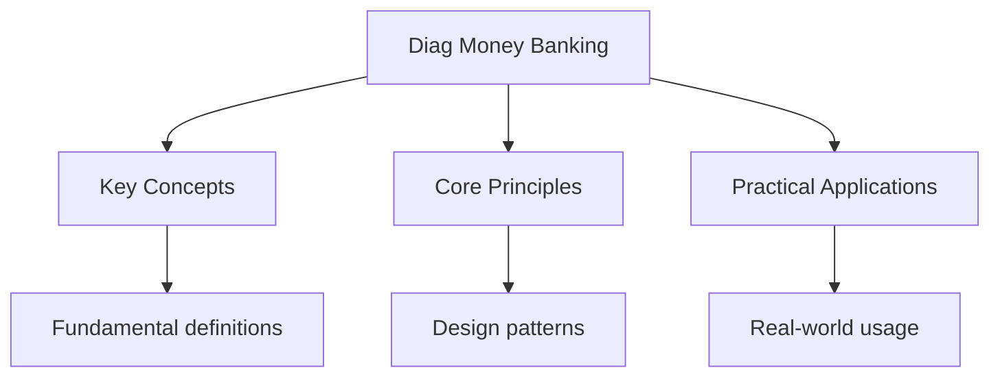

<!-- Breadcrumb Schema for SEO -->

## Money and Banking — Diagnostic Tests

## Unit Tests

### UT-1: Money Creation and the Money Multiplier

**Question:** A banking system has a required reserve ratio of 10%. A customer deposits $\$1000$ of
cash into Bank A. (a) Calculate the maximum possible expansion of the money supply. (b) Show the
first three rounds of the money creation process in a table. (c) What is the money multiplier? (d)
Explain two leakages that would reduce the actual money creation below the theoretical maximum.

**Solution:**

(a) Maximum expansion $= \frac{\$1000}{0.10} = \$10,000$ (including the initial deposit).

| (b) | Round    | Deposit | Required Reserves | Loans |
| --- | -------- | ------- | ----------------- | ----- |
| 1   | $\$1000$ | $\$100$ | $\$900$           |
| 2   | $\$900$  | $\$90$  | $\$810$           |
| 3   | $\$810$  | $\$81$  | $\$729$           |

Total after 3 rounds: Deposits $= 1000 + 900 + 810 = \$2710$. Loans $= 900 + 810 + 729 = \$2439$.

(c) Money multiplier $= \frac{1}{rrr} = \frac{1}{0.10} = 10$.

(d) Two leakages:

1. **Excess reserves**: Banks may choose to hold more reserves than required (precautionary motive),
   especially during economic uncertainty. These reserves are not lent out, reducing the multiplier.
2. **Cash leakages**: When borrowers receive loans, they may withdraw some as cash rather than
   redepositing it. Cash held outside the banking system cannot be multiplied through lending.

### UT-2: Functions of Money and Inflation

**Question:** (a) Identify and explain the three functions of money with a specific example for
each. (b) If the money supply grows at 15% per year while real GDP grows at 3% per year, use the
quantity theory of money to predict the inflation rate. (c) Explain why hyperinflation (e.g., prices
doubling every month) causes money to lose its functions.

**Solution:**

(a) Three functions of money:

1. **Medium of exchange**: Money eliminates the need for double coincidence of wants inherent in
   barter. Example: A baker buys flour from a miller using money, without needing to find a miller
   who wants bread.
2. **Unit of account**: Money provides a standard measure of value, allowing prices to be expressed
   in a common unit. Example: A smartphone costs $\$5000$ and a meal costs $\$100$Making it easy to
   compare values.
3. **Store of value**: Money allows purchasing power to be saved and used in the future. Example: A
   worker saves $\$2000$ per month in a bank account to buy a car next year.

(b) Quantity theory: $MV = PY$. If velocity $V$ is constant: growth rate of $M$ $=$ growth rate of
$P$ $+$ growth rate of $Y$. $\hat{M} = \hat{P} + \hat{Y}$. $15\% = \hat{P} + 3\%$So
$\hat{P} = 12\%$.

Predicted inflation rate: **12%**.

(c) During hyperinflation:

- **Medium of exchange**: People refuse to accept money because it loses value between the time of
  transaction agreement and actual payment. They switch to barter or foreign currency.
- **Unit of account**: Prices change so rapidly that accounting in the domestic currency becomes
  meaningless. Firms may price in stable foreign currencies.
- **Store of value**: Money"s purchasing power evaporates. Holding cash means guaranteed losses.
  People spend money immediately or convert to real assets.

### UT-3: Interest Rate Determination

**Question:** The demand for money (liquidity preference) is $L = 500 - 20i + 0.5Y$Where $i$ is the
interest rate (in %) and $Y$ is real income. The money supply is fixed at $\$600$ billion. (a)
Calculate the equilibrium interest rate when $Y = 1000$. (b) If the central bank increases the money
supply to $\$700$B, calculate the new equilibrium interest rate. (c) If real income rises to
$Y = 1200$ with the original money supply, what happens to the interest rate? Explain the mechanism.

**Solution:**

(a) Equilibrium: $L = M_s$. $500 - 20i + 0.5(1000) = 600$. $500 - 20i + 500 = 600$.
$1000 - 20i = 600$. $20i = 400$. $i = 20\%$.

(b) $500 - 20i + 500 = 700$. $1000 - 20i = 700$. $20i = 300$. $i = 15\%$.

The interest rate falls from 20% to 15% as the increased money supply creates an excess supply of
money, causing people to buy bonds, driving bond prices up and yields (interest rates) down.

(c) $500 - 20i + 0.5(1200) = 600$. $500 - 20i + 600 = 600$. $1100 - 20i = 600$. $20i = 500$.
$i = 25\%$.

Higher income increases the transactions demand for money (people need more cash for day-to-day
transactions). With a fixed money supply, this excess demand for money causes people to sell bonds,
driving bond prices down and interest rates up (from 20% to 25%).

---

<!-- Breadcrumb Schema for SEO -->

## Integration Tests

### IT-1: Banking System and Monetary Policy (with Fiscal Policy)

**Question:** The central bank wants to stimulate the economy but the government is simultaneously
running a large budget deficit. The required reserve ratio is 12.5%, and banks hold $\$200$B in
required reserves with no excess reserves. (a) Calculate the current money supply. (b) The central
bank buys $\$10$B of government bonds. Calculate the maximum change in the money supply. (c) Explain
how the government's bond issuance to finance its deficit might counteract the central bank's
expansionary policy (crowding out through the banking system). (d) If the government finances its
deficit by borrowing from the central bank, what is this called and what is the risk?

**Solution:**

(a) Money supply $= \frac{\text{Reserves}}{    ext{rrr}} = \frac{200}{0.125} = \$1600$B.

(b) $\$10$B open market purchase increases reserves by $\$10$B. Maximum change
$= \frac{10}{0.125} = \$80$B. New money supply $= 1600 + 80 = \$1680$B.

(c) When the government issues bonds to finance its deficit, it competes with the private sector for
loanable funds. Banks that buy government bonds have fewer funds available for private lending. This
absorbs bank reserves that could otherwise support money creation through the multiplier process.
The government's borrowing may push up interest rates, partially offsetting the central bank's
attempt to lower them. This is a form of financial crowding out.

(d) When the government borrows directly from the central bank (the central bank creates new money
to buy government bonds), this is called **monetising the debt** or **quantitative easing** (when
done on a large scale). The risk is inflation: the money supply increases without a corresponding
increase in output, leading to excess demand and rising prices. If done excessively, it can lead to
hyperinflation. This is why many central banks have operational independence from the government.

### IT-2: Inflation and Interest Rates (with National Income)

**Question:** An economy has: nominal GDP $= \$2000$B, real GDP $= \$1600$B, money supply
$= \$800$B. (a) Calculate the GDP deflator, inflation rate (base year deflator was 100), and
velocity of money. (b) If the central bank targets 2% inflation and real GDP is expected to grow at
4%, calculate the required money supply growth rate. (c) A bank offers a nominal interest rate of 8%
on deposits. Calculate the real interest rate. (d) If inflation unexpectedly rises to 10%, who
benefits and who loses from this loan contract?

**Solution:**

(a) GDP deflator $= \frac{2000}{1600} \times 100 = 125$. Inflation $= \frac{125 - 100}{100} = 25\%$.
Velocity $= \frac{\text{PY}}{    ext{M}} = \frac{2000}{800} = 2.5$.

(b) $\hat{M} = \hat{P} + \hat{Y}$ (assuming constant velocity). $\hat{M} = 2\% + 4\% = 6\%$. The
money supply should grow at 6%.

(c) Real interest rate $= nominal rate - expected inflation = 8\% - 25\% = -17\%$. Depositors are
effectively losing 17% of their purchasing power.

(d) With actual inflation at 10%: real interest rate $= 8\% - 10\% = -2\%$. **Borrowers benefit**
(they repay loans in dollars worth less than when they borrowed) and **lenders/depositors lose**
(they receive repayments with reduced purchasing power). This redistribution from lenders to
borrowers is a key consequence of unexpected inflation and explains why lenders demand inflation
premiums and why inflation uncertainty is harmful to financial markets.

### IT-3: Financial Intermediation and Market Failure (with Market Failure)

**Question:** Banks perform financial intermediation, transforming short-term deposits into
long-term loans. (a) Explain the problem of asymmetric information in banking, identifying both
adverse selection and moral hazard. (b) A bank has deposits of $\$500$B, reserves of $\$50$B, and
loans of $\$450$B. The required reserve ratio is 8%. Calculate: actual reserve ratio, excess
reserves, and the maximum additional lending. (c) Explain how a bank run can occur and why deposit
insurance addresses a market failure. (d) How does this relate to the concept of confidence in the
monetary system?

**Solution:**

(a) **Adverse selection** occurs before a loan is made: borrowers with the riskiest projects are the
most eager to seek loans because they have the most to gain if the project succeeds and limited
liability if it fails. Banks cannot perfectly distinguish risky from safe borrowers. This leads to a
higher average risk of loan applicants than the population as a whole.

**Moral hazard** occurs after a loan is made: once borrowers receive funds, they may engage in
riskier behaviour than the bank agreed to (e.g., investing in speculative projects), because the
bank bears part of the loss if the project fails while the borrower captures the upside.

(b) Actual reserve ratio $= 50/500 = 10\%$. Required reserves $= 0.08 \times 500 = \$40$B. Excess
reserves $= 50 - 40 = \$10$B. Maximum additional lending $= \$10$B (these excess reserves can be
lent out directly, subject to the multiplier process).

(c) A bank run occurs when depositors lose confidence in a bank's ability to repay their deposits.
Since banks lend out most deposits (fractional reserve banking), they cannot repay all depositors
simultaneously. When some depositors withdraw, others fear the bank will run out of reserves,
creating a self-fulfilling panic. This is a market failure because individual rational behaviour
(withdrawing deposits) leads to collectively irrational outcomes (bank failure, loss of value for
all).

Deposit insurance (e.g., the Deposit Protection Scheme in Hong Kong, covering up to HK\$500,000)
eliminates the incentive to run: even if the bank fails, insured depositors will be repaid. This
prevents self-fulfilling panics and protects the stability of the financial system.

(d) Confidence is fundamental to the monetary system. Money has value only because people believe
others will accept it. Similarly, banks function only because depositors trust them to safeguard
deposits. When confidence collapses (as in a bank run), the system breaks down rapidly. Deposit
insurance, central bank lending as lender of last resort, and regulatory oversight all serve to
maintain this confidence -- they are public goods that the private market would underprovide without
government intervention.

## Intuition

**Money multiplies like rabbits:** Banks create money by lending out deposits — each loan becomes someone else's deposit, which gets lent again, creating a chain reaction. The money multiplier amplifies the initial deposit.

**Why it matters:** Money creation affects inflation, interest rates, and economic growth. Understanding how banks create money explains why central banks control the money supply.

**The key insight:** Banks don't just store money — they create it through lending, which is why a small reserve requirement can support a much larger money supply.

## Additional DSE Exam-Style Questions

### EQ-1: Money Multiplier with Multiple Leakages

**Question:** A banking system has a required reserve ratio of 8%. Banks also hold excess reserves
equal to 2% of deposits, and the public holds cash equal to 15% of deposits. (a) Calculate the
effective money multiplier. (b) If the central bank injects $\$50$ billion of new reserves through
open market operations, calculate the maximum change in: (i) the monetary base, (ii) bank deposits,
(iii) the broad money supply ($M2$). (c) If the public's currency ratio rises to 20% due to loss of
confidence, recalculate the multiplier and explain the effect on the money supply.

**Solution:**

(a) The money multiplier accounting for excess reserves ($er$) and the currency-deposit ratio
($cr$):

$$m = \frac{1 + cr}{rrr + er + cr} = \frac{1 + 0.15}{0.08 + 0.02 + 0.15} = \frac{1.15}{0.25} = 4.6$$

(b) (i) Monetary base change $= \$50$ billion (the OMO directly changes reserves, part of the
monetary base).

(ii) Deposits increase by
$\frac{1}{rrr + er + cr} \times \Delta R = \frac{1}{0.25} \times 50 = \$200$ billion.

(iii) Broad money supply change $= m \times \Delta B = 4.6 \times 50 = \$230$ billion.

(c) With $cr = 0.20$:

$$m = \frac{1 + 0.20}{0.08 + 0.02 + 0.20} = \frac{1.20}{0.30} = 4.0$$

The multiplier falls from 4.6 to 4.0. The increase in the currency ratio means more money is held as
cash outside the banking system, where it cannot be multiplied through lending. This is a leakage
that reduces the effectiveness of monetary policy. If the central bank injected $\$50$B, the broad
money supply would now increase by only $4.0 \times 50 = \$200$ billion instead of $\$230$ billion
-- a reduction of $\$30$ billion. This illustrates why confidence shocks can be self-reinforcing:
higher cash withdrawals reduce the multiplier, contracting the money supply further.

### EQ-2: Hong Kong's Currency Board System

**Question:** Hong Kong operates a Currency Board system pegging the HKD at 7.8 per USD. The HKMA's
Exchange Fund holds US$180 billion in reserves. The monetary base is HK$1,500 billion. (a) Calculate
the backing ratio and assess its adequacy. (b) If there is a capital outflow of US$5 billion,
explain the automatic adjustment mechanism and calculate the change in the monetary base. (c)
Suppose the HKMA decides to sell HK$20 billion of Exchange Fund Bills. Calculate the effect on the
monetary base and explain why this is contractionary. (d) Evaluate whether Hong Kong should switch
to a free-floating exchange rate.

**Solution:**

(a) The monetary base of HK$1,500 billion requires backing of $1500 / 7.8 = \text{US}\$192.3$
billion at the 7.8 peg. The actual reserves are US$180 billion.

Backing ratio $= 180 / 192.3 = 93.6\%$.

The backing ratio is below 100%, which may appear concerning. However, Hong Kong's full backing
requirement applies to the Certificates of Indebtedness (which back banknotes), not the entire
monetary base. The HKMA also earns investment returns on its reserves, and the Convertibility Zone
(7.75--7.85) provides a buffer. The system remains credible as long as the market believes the HKMA
can defend the peg.

(b) When US$5 billion flows out: investors sell HKD for USD. The HKMA buys HKD and sells USD from
reserves to maintain the peg.

Change in monetary base $= -5 \times 7.8 = -\text{HK}\$39$ billion.

New monetary base $= 1500 - 39 = \text{HK}\$1,461$ billion.

The automatic contraction of the monetary base raises Hong Kong interest rates, which attracts
capital back, stabilising the exchange rate. This is the self-correcting mechanism of the Currency
Board.

(c) Selling HK$20 billion of Exchange Fund Bills absorbs HK$20 billion of liquidity from the banking
system. The monetary base falls by HK$20 billion.

New monetary base $= 1500 - 20 = \text{HK}\$1,480$ billion.

This is contractionary because it reduces bank reserves, limiting banks' ability to lend and pushing
up interbank interest rates (HIBOR).

(d) **Arguments for keeping the peg:**

- Provides exchange rate stability for trade (Hong Kong's trade-to-GDP ratio exceeds 300%), reducing
  transaction costs and uncertainty for importers and exporters.
- Anchors inflation expectations by tying monetary policy to the Federal Reserve, which has a strong
  inflation-fighting record.
- Maintains investor confidence; switching to a float could trigger capital flight and a sharp
  depreciation.

**Arguments for switching to a float:**

- Monetary policy would become independent, allowing the HKMA to set interest rates appropriate for
  Hong Kong's economic cycle rather than the US cycle.
- The US and Hong Kong economies are increasingly decoupled; US rate hikes designed to cool the US
  economy may unnecessarily contract Hong Kong's economy.
- Reserves could be used for domestic purposes rather than defending the peg.

**Evaluation:** For Hong Kong, the benefits of stability outweigh the costs of lost monetary
independence. Hong Kong's role as an international financial centre depends on exchange rate
certainty. The Currency Board has survived multiple crises (1997 Asian Financial Crisis, 2008 GFC,
2019 social unrest, COVID-19) and remains credible. A sudden switch would be highly disruptive.

### EQ-3: Monetary Policy and the Transmission Mechanism in Hong Kong

**Question:** The US Federal Reserve raises the federal funds rate by 0.5 percentage points. (a)
Trace the full transmission mechanism to Hong Kong, explaining each step from the Fed's decision to
the effect on a Hong Kong small business seeking a bank loan. (b) If the Hong Kong economy is in
recession while the US economy is overheating, explain the policy dilemma for Hong Kong. (c)
Calculate the effect on a HK$2 million mortgage if the HIBOR rises by 0.5 percentage points,
assuming the mortgage is at HIBOR + 1.5% and the original HIBOR is 2%. (d) Suggest non-monetary
policy measures the Hong Kong government could use to stimulate the economy under these conditions.

**Solution:**

(a) Transmission mechanism:

1. Fed raises the federal funds rate by 0.5 percentage points.
2. Higher US rates attract capital out of Hong Kong (investors seek higher US returns).
3. Capital outflow puts downward pressure on the HKD exchange rate.
4. The HKMA must defend the peg by selling USD and buying HKD, reducing Hong Kong's monetary base.
5. The reduced monetary base pushes HIBOR (Hong Kong Interbank Offered Rate) up by approximately 0.5
   percentage points to maintain the peg.
6. Banks raise their best lending rate (BLR) and prime rate, increasing borrowing costs.
7. The small business finds that bank loan interest rates have risen, increasing the cost of
   financing investment. The business may delay or cancel expansion plans.

(b) This is the fundamental dilemma of the Currency Board: Hong Kong's interest rates must follow US
rates regardless of domestic conditions. When the US raises rates to fight inflation, Hong Kong must
raise rates even if its economy is in recession. This deepens the Hong Kong recession by increasing
borrowing costs precisely when stimulus is needed. The government cannot use monetary policy to
address the downturn.

(c) Original mortgage rate $= \text{HIBOR} + 1.5\% = 2\% + 1.5\% = 3.5\%$. Monthly payment (assuming
25-year mortgage):

$$M = P \times \frac{r(1+r)^n}{(1+r)^n - 1}$$

Where $P = 2,000,000$$r = 0.035/12 = 0.002917$$n = 300$.

$M = 2\,000\,000 \times \frac{0.002917(1.002917)^{300}}{(1.002917)^{300} - 1} = 2\,000\,000 \times \frac{0.002917 \times 2.4066}{2.4066 - 1} = 2\,000\,000 \times \frac{0.00702}{1.4066} = \text{HK}\$9\,983$

After rate rise: new rate $= 2.5\% + 1.5\% = 4.0\%$, $r = 0.04/12 = 0.003333$.

$M' = 2\,000\,000 \times \frac{0.003333(1.003333)^{300}}{(1.003333)^{300} - 1} = 2\,000\,000 \times \frac{0.003333 \times 2.7137}{2.7137 - 1} = 2\,000\,000 \times \frac{0.009046}{1.7137} = \text{HK}\$10\,558$

Increase in monthly payment $= 10\,558 - 9\,983 = \text{HK}\$575$ per month ($+5.8\%$).

(d) Non-monetary fiscal and supply-side measures:

1. **Consumption vouchers:** Direct cash transfers to residents (as used during COVID-19) to boost
   aggregate demand.
2. **Infrastructure spending:** Accelerate public works projects (e.g., Lantau development, Northern
   Metropolis) to create jobs and stimulate construction.
3. **Tax rebates:** Reduce salaries tax and profits tax temporarily to increase disposable income.
4. **Land supply measures:** Release more land for development to reduce housing costs, increasing
   real disposable income.
5. **Tourism promotion:** Attract mainland and international tourists to boost the services sector.
6. **Innovation and technology investment:** Government grants for tech startups and R&D to improve
   long-term productivity.

### EQ-4: Interest Rate Parity and Exchange Rate Determination

**Question:** The interest rate in Country A is 2% and in Country B is 5%. The current spot exchange
rate is 1 unit of A's currency $= 5$ units of B's currency. (a) Using uncovered interest rate parity
(UIP), calculate the expected depreciation rate of A's currency. (b) Calculate the expected spot
exchange rate in one year. (c) If covered interest rate parity holds and the one-year forward rate
is 4.9, determine whether there is an arbitrage opportunity. (d) Explain why interest rate parity
might fail to hold in practice.

**Solution:**

(a) Uncovered interest rate parity: $i_A = i_B + \frac{E^e - E}{E}$.

Rearranging: expected depreciation of A's currency $= i_A - i_B = 2\% - 5\% = -3\%$.

A negative value means A's currency is expected to **appreciate** by 3% (since A's interest rate is
lower, the currency must appreciate to equalise returns).

(b) Expected spot rate in one year: $E^e = E \times (1 - 0.03) = 5 \times 0.97 = 4.85$.

A's currency appreciates: it now costs only 4.85 units of B's currency to buy 1 unit of A's
currency.

(c) Covered interest rate parity:
$F = E \times \frac{1 + i_A}{1 + i_B} = 5 \times \frac{1.02}{1.05} = 5 \times 0.9714 = 4.857$.

The theoretical forward rate is 4.857, but the actual forward rate is 4.9. Since
$F_{actual} (4.9) > F_{theoretical} (4.857)$There is an arbitrage opportunity:

1. Borrow in A's currency at 2%.
2. Convert to B's currency at the spot rate (5.0).
3. Invest in B's currency at 5%.
4. Sell the proceeds forward at 4.9.

Return from investing in B: borrow 1 unit of A, get 5 units of B, invest at 5% to get
$5 \times 1.05 = 5.25$ units of B. Convert forward at 4.9: $5.25 / 4.9 = 1.0714$ units of A. Repay
the loan: $1 \times 1.02 = 1.02$ units of A. Profit $= 1.0714 - 1.02 = 0.0514$ units of A (5.14%
risk-free return).

(d) Interest rate parity may fail to hold because:

1. **Transaction costs:** Bid-ask spreads in foreign exchange and capital markets reduce arbitrage
   profits.
2. **Capital controls:** Government restrictions on cross-border capital flows prevent arbitrage.
3. **Risk premium:** Investors may demand a premium for holding assets in certain currencies (e.g.,
   emerging market risk), causing a deviation from UIP.
4. **Expectations errors:** UIP depends on rational expectations of future exchange rates, but
   markets may systematically mispredict.
5. **Liquidity differences:** Some currencies are more liquid than others, affecting the ease of
   arbitrage.

### EQ-5: Banking Regulation and Capital Adequacy

**Question:** A bank has the following balance sheet (in billions of HKD):

| Assets            | Liabilities + Equity          |
| ----------------- | ----------------------------- |
| Reserves: 50      | Deposits: 400                 |
| Loans: 300        | Other liabilities: 50         |
| Securities: 80    | Equity (Tier 1 + Tier 2): 100 |
| Other assets: 120 |                               |
| Total: 550        | Total: 550                    |

(a) Calculate the reserve ratio and the leverage ratio. (b) If the required reserve ratio is 10%,
calculate excess reserves. (c) If the bank's risk-weighted assets are HK$350 billion, calculate the
Basel III minimum capital ratios: (i) Common Equity Tier 1 (CET1) minimum 4.5%, (ii) Tier 1 minimum
6%, (iii) Total capital minimum 8%. (d) If the bank suffers HK$30 billion in bad loan losses,
recalculate the leverage ratio and assess whether the bank remains solvent.

**Solution:**

(a) Reserve ratio $= \frac{\text{Reserves}}{\text{Deposits}} = \frac{50}{400} = 12.5\%$.

Leverage ratio $= \frac{\text{Equity}}{\text{Total Assets}} = \frac{100}{550} = 18.2\%$. (Basel III
minimum leverage ratio is 3%, so this bank is well above the minimum.)

(b) Required reserves $= 0.10 \times 400 = 40$. Excess reserves $= 50 - 40 = \text{HK}\$10$ billion.

(c) Risk-weighted assets (RWA) $=$ HK$350$ billion.

- CET1 minimum: $4.5\% \times 350 = \text{HK}\$15.75$ billion.
- Tier 1 minimum: $6\% \times 350 = \text{HK}\$21$ billion.
- Total capital minimum: $8\% \times 350 = \text{HK}\$28$ billion.

Assuming all equity is CET1 capital (HK$100$ billion), the bank far exceeds all minimum ratios: CET1
ratio $= 100/350 = 28.6\%$Tier 1 ratio $= 28.6\%$Total capital ratio $= 28.6\%$. These all exceed
the Basel III minima comfortably, plus the capital conservation buffer (2.5%) and countercyclical
buffer (0--2.5%).

(d) After HK$30$B losses: Equity falls to $100 - 30 = \text{HK}\$70$ billion. Total assets fall to
$550 - 30 = \text{HK}\$520$ billion.

New leverage ratio $= 70 / 520 = 13.5\%$ (still above 3%, so the bank remains solvent).

However, if the bank had less equity, losses could wipe it out. If losses exceeded HK$100$ billion
(the equity buffer), the bank would become insolvent. This illustrates why capital adequacy
requirements matter: they ensure banks have enough loss-absorbing capacity to survive adverse
events.

### EQ-6: Quantity Theory of Money and Hyperinflation

**Question:** Country Z has the following data: money supply $M = \$500$ billion, velocity of money
$V = 4$, price level $P = 125$, real output $Y = 16$ billion units. (a) Verify that the quantity
equation $MV = PY$ holds. (b) If the central bank increases the money supply by 25% while velocity
and real output remain constant, calculate the new price level and inflation rate. (c) Suppose
velocity increases to 5 (due to loss of confidence) and real output falls by 10% simultaneously.
Calculate the new price level and inflation rate. (d) Using real-world examples (Zimbabwe 2008,
Venezuela 2018, or Weimar Germany 1923), explain the mechanism of hyperinflation and why it is so
difficult to stop once it begins.

**Solution:**

(a) $MV = 500 \times 4 = 2000$. $PY = 125 \times 16 = 2000$. The quantity equation holds: $MV = PY$.

(b) New $M = 500 \times 1.25 = 625$. $MV = 625 \times 4 = 2500$. Since $V$ and $Y$ are constant:
$PY = 2500$. New $P = 2500 / 16 = 156.25$.

Inflation rate $= \frac{156.25 - 125}{125} \times 100\% = 25\%$.

When $V$ and $Y$ are constant, the inflation rate equals the money supply growth rate (the
"neutrality of money" result).

(c) New $V = 5$New $Y = 16 \times 0.90 = 14.4$. $M = 625$ (from part b). $MV = 625 \times 5 = 3125$.
$P = 3125 / 14.4 = 217.0$.

Inflation rate from original: $\frac{217.0 - 125}{125} \times 100\% = 73.6\%$.

The combination of money growth (25%), velocity increase (25%), and output decline (10%) creates
inflation of 73.6% -- far exceeding the money supply growth alone. This demonstrates how velocity
and output changes can amplify or dampen the inflationary effect of money supply changes.

(d) **Hyperinflation mechanism:**

1. **Initial trigger:** The government runs a large fiscal deficit and finances it by printing money
   (monetising the debt). The money supply grows rapidly.

2. **Price rises:** $MV = PY$ means prices rise proportionally if velocity and output are stable.

3. **Velocity accelerates:** As people expect further inflation, they spend money immediately
   (reducing the holding period), which increases velocity. This causes prices to rise faster than
   the money supply.

4. **Wage-price spiral:** Workers demand higher wages to keep up with rising prices. Firms pass
   higher labour costs into prices. The government prints more money to meet its higher nominal
   spending obligations.

5. **Fiscal dominance:** The real value of tax revenue falls (the Tanzi effect -- there is a lag
   between when income is earned and when tax is collected, during which inflation erodes the real
   value). The deficit widens, requiring even more money creation.

6. **Currency abandonment:** People switch to foreign currency or barter. The domestic currency
   loses all three functions of money.

**Why hyperinflation is hard to stop:** Once velocity is rising and expectations are unanchored,
stopping money creation may not suffice. Stopping money printing requires eliminating the fiscal
deficit, which is politically difficult (cutting spending or raising taxes during an economic
crisis). The social costs (unemployment, poverty) of the necessary fiscal adjustment are severe.
Additionally, the loss of confidence in the currency can persist even after money growth stops,
keeping velocity elevated. Stabilisation requires: (1) a credible fiscal consolidation plan, (2) a
new currency or dollarisation, (3) central bank independence, and (4) international support (IMF
programmes).

**Real-world example -- Zimbabwe 2008:** The government printed money to finance land redistribution
and military spending. Inflation reached an estimated 79.6 billion percent month-on-month in
November 2008. The government abandoned the Zimbabwe dollar in 2009 in favour of the US dollar and
South African rand, which immediately stabilised prices.

## Common Pitfalls

1. **Confusing the money multiplier with the deposit multiplier:** The simple deposit multiplier
   $\frac{1}{rrr}$ assumes no cash leakages and no excess reserves. The actual money multiplier
   $\frac{1 + cr}{rrr + er + cr}$ is always smaller because cash held outside banks and excess
   reserves held by banks both reduce the multiplier effect. Always use the full formula when the
   question mentions cash holdings or excess reserves.

2. **Treating the monetary base and broad money supply as the same thing:** The monetary base (M0)
   includes only currency in circulation and bank reserves. Broad money (M1, M2, M3) includes bank
   deposits created through the lending process. The money supply is the monetary base multiplied by
   the money multiplier. A change in reserves affects the monetary base directly but the broad money
   supply through the multiplier.

3. **Misunderstanding the direction of causation in the quantity theory:** $MV = PY$ is an identity
   (always true by definition). The quantity _theory_ of money makes the causal claim that changes
   in $M$ cause changes in $P$ (assuming $V$ and $Y$ are stable in the short run). During
   hyperinflation, however, changes in $V$ (loss of confidence) can be the primary driver of
   inflation, with money supply growth following passively.

4. **Forgetting that Hong Kong has no independent monetary policy:** Under the Currency Board
   system, the HKMA does not set interest rates -- they follow the Fed. A common DSE error is to
   prescribe interest rate changes for Hong Kong. The only monetary tools available to the HKMA are:
   (i) adjusting the Convertibility Zone, (ii) changing the discount window rate (within narrow
   bounds), and (iii) foreign exchange interventions to maintain the peg.

5. **Assuming that higher interest rates always reduce investment:** While higher rates generally
   discourage borrowing, the effect depends on expectations. If a rate hike signals that the central
   bank is committed to controlling inflation, it may actually _increase_ investment by improving
   business confidence and reducing uncertainty about future inflation. This is the "expectations
   channel" of monetary policy.

## Cross-References

- **[Market Failure](diag-market-failure):** Market failure analysis is key
- **[Fiscal Policy](diag-fiscal-monetary-policy):** Policy addresses economic issues
- **[Macroeconomics](../flashcards-macroeconomics):** Macroeconomics covers indicators
