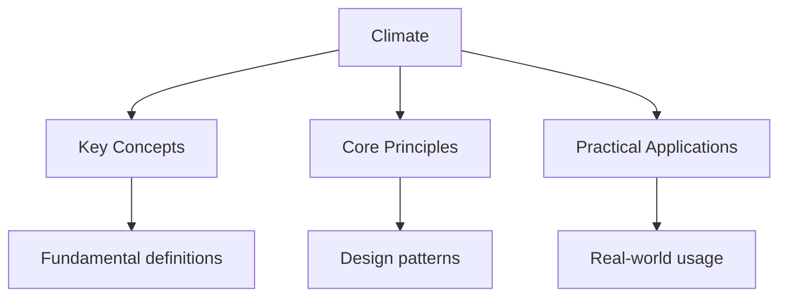

---

date: 2026-07-23T21:57:32+01:00
title: "Weather and Climate | DSE - Wyatt's Notes"
description: "Global atmospheric circulation, monsoon systems, tropical cyclone formation, climate change impacts on South China, and IPCC projections for DSE Geography."
sidebar_position: 2
tags: [DSE, Geography, Climate, Weather]
categories: [DSE, Geography]
tableOfContents: false
---

<!-- Breadcrumb Schema for SEO -->

## Weather and Climate

## Key Terms

- **Atmospheric circulation:** The large-scale movement of air across the globe, driven by unequal
  solar heating and the Coriolis effect, creating a pattern of pressure belts and wind systems.
- **Monsoon:** A seasonal reversal of wind direction caused by differential heating of land and
  ocean, bringing distinct wet and dry seasons to South and East Asia.
- **Tropical cyclone:** A rotating, organised system of clouds and thunderstorms that originates
  over tropical oceans and has a closed low-level circulation. In the western North Pacific, these
  are called typhoons.
- **El Nino-Southern Oscillation (ENSO):** A coupled ocean-atmosphere phenomenon involving
  fluctuations in sea surface temperatures across the equatorial Pacific, affecting global weather
  patterns.
- **IPCC:** Intergovernmental Panel on Climate Change, the United Nations body responsible for
  assessing scientific information about climate change.

## Global Atmospheric Circulation

The Earth's atmosphere circulates heat from equatorial regions toward the poles through a system of
three circulation cells in each hemisphere:

### Hadley Cell (0 to 30 degrees latitude)

At the equator, intense solar heating causes air to rise, creating a zone of low pressure known as
the **Intertropical Convergence Zone (ITCZ)**. The rising air produces heavy convective rainfall.
At approximately 15 km altitude, the air diverges poleward. As it descends at around 30 degrees
latitude, it creates a zone of high pressure known as the **subtropical ridge**. Surface winds
return toward the equator as the **trade winds**, deflected by the Coriolis effect to become
northeasterly in the Northern Hemisphere and southeasterly in the Southern Hemisphere.

### Ferrel Cell (30 to 60 degrees latitude)

A secondary circulation cell driven by the Hadley and Polar cells. Surface winds blow poleward as
the **prevailing westerlies**. At approximately 60 degrees latitude, warm westerly air meets cold
polar air at the **polar front**, producing mid-latitude cyclones and frontal rainfall.

### Polar Cell (60 to 90 degrees latitude)

Cold, dense air descends at the poles, creating high pressure. Surface winds blow equatorward as
the **polar easterlies**. Where this cold air meets the warmer Ferrel Cell air at the polar front,
ascending air produces frequent cloudiness and precipitation.

The global wind and pressure belt system explains the distribution of climate zones: equatorial
regions experience hot, wet conditions; subtropical zones are dominated by high pressure and aridity;
and mid-latitudes receive variable weather from passing cyclones and anticyclones.

## Monsoon Systems

### South China Monsoon

Hong Kong's climate is governed by the East Asian monsoon system, which produces distinct seasonal
patterns:

**Winter (October to March):** The Siberian High (a semi-permanent high-pressure system over
central Asia) generates cold, dry northerly to northeasterly winds. These winds cross the South
China Sea, picking up moisture, so Hong Kong's winter is relatively cool and dry but with periods
of cloudiness and drizzle, particularly in March and April.

**Summer (April to September):** Intense heating of the Asian landmass creates the South Asian Low,
drawing in warm, moist southwesterly to southeasterly winds from the South China Sea and western
Pacific Ocean. This produces Hong Kong's hot, humid summer with frequent convective rainfall and
thunderstorms.

The monsoon transition periods (April-May and October-November) are characterised by variable
conditions and occasional heavy rainfall.

### Monsoon Rainfall

The onset of the summer monsoon occurs in mid-May over the South China coast, bringing a
marked increase in rainfall. The monsoon trough, a zone of low pressure along the southern flank of
the subtropical ridge, is a key generator of rainfall over southern China. Persistent monsoon
depression events can produce widespread, sustained rainfall, particularly in June and July.

## Tropical Cyclone Formation and Tracks

### Formation Conditions

Tropical cyclones require several conditions for formation:

1. **Sea surface temperature (SST):** Minimum of approximately $26.5\,^{\circ}\mathrm{C}$ to a
   depth of at least 50 metres, providing the energy source through evaporation and latent heat
   release.
2. **Coriolis effect:** Sufficient planetary vorticity to initiate rotation, generally requiring
   formation at latitudes greater than about 5 degrees from the equator.
3. **Low vertical wind shear:** Minimal variation of wind speed and direction with height, allowing
   the storm's warm core to remain vertically aligned.
4. **Atmospheric instability:** Conditionally unstable atmosphere permitting sustained deep
   convection.
5. **Pre-existing disturbance:** An initial disturbance (e.g., easterly wave, monsoon depression)
   to serve as a focus for cyclogenesis.

### Stages of Development

Tropical cyclones are classified by sustained wind speed (Hong Kong Observatory scale):

- Tropical depression: winds less than $63\ \mathrm{km/h}$
- Tropical storm: winds $63$ to $117\ \mathrm{km/h}$
- Severe tropical storm: winds $118$ to $153\ \mathrm{km/h}$
- Typhoon: winds $154$ to $180\ \mathrm{km/h}$
- Super typhoon: winds exceeding $180\ \mathrm{km/h}$

### Storm Surge

Storm surge is the abnormal rise in sea level caused by a tropical cyclone's low pressure and
strong onshore winds. The surge height can be calculated approximately as:

$$\Delta h \approx \frac{\Delta P}{\rho g}$$

where $\Delta P$ is the central pressure deficit, $\rho$ is seawater density, and $g$ is
gravitational acceleration. Storm surge is the greatest killer associated with tropical cyclones,
particularly in low-lying coastal areas.

### Tracks Affecting Hong Kong

Tropical cyclones affecting Hong Kong follow one of several tracks:

1. **West-northwest track:** Forming near the Marshall Islands, curving northwest through the
   Philippines toward southern China or Hainan Island. Example: Typhoon Hato (2017).
2. **recurved track:** Forming in the western Pacific, moving northwest then curving northeast
   before reaching the South China coast. These often pass east or southeast of Hong Kong.
3. **South China Sea formation:** Cyclones forming within the South China Sea tend to be smaller but
   can intensify rapidly if conditions are favourable.

Hong Kong is most vulnerable to tropical cyclones from June to October, with a peak in July to
September.

## Climate Change Impacts on South China

### Observed Changes

Scientific evidence indicates that climate change is already affecting South China:

- **Temperature increase:** Average temperatures in Hong Kong have risen by approximately
  $0.12\,^{\circ}\mathrm{C}$ per decade since 1947, with a total increase of roughly
  $1.6\,^{\circ}\mathrm{C}$.
- **Sea level rise:** Tide gauge records and satellite data indicate a rise in sea level of
  approximately $3$ to $4\ \mathrm{mm}$ per year around the South China coast, slightly above the
  global average.
- **Changing rainfall patterns:** While total annual rainfall has not shown a clear trend, there is
  evidence of increased intensity of extreme rainfall events and a shift in seasonal distribution.
- **Tropical cyclone intensity:** While the frequency of tropical cyclones may not increase,
  there is evidence that the proportion of intense storms (Category 4-5) is rising, consistent
  with warmer sea surface temperatures.

### IPCC Projections

The IPCC Sixth Assessment Report projects the following for East and Southeast Asia under moderate
emissions scenarios:

- Continued warming of $1.5$ to $2.5\,^{\circ}\mathrm{C}$ by 2100 depending on emissions pathway.
- Sea level rise of $0.3$ to $0.6$ metres by 2100 under moderate scenarios, with higher estimates
  under high-emissions pathways.
- Increased frequency and intensity of heatwaves, heavy precipitation events, and coastal flooding.
- Changes in monsoon patterns, potentially including delayed onset, increased variability, and
  more frequent drought-flood alternation.

### Adaptation Strategies

Hong Kong has adopted several climate adaptation measures:

- **Coastal defence:** Construction and enhancement of sea walls, flood barriers, and drainage
  infrastructure. The Tseung Kwan O-Lam Tin Tunnel and associated drainage improvements address
  flooding vulnerability.
- **Urban heat island mitigation:** Expansion of urban greening, cool roof programmes, and
  improved urban ventilation through building design guidelines.
- **Water resource management:** Diversification of water supply sources, including the
  Dongjiang water supply scheme, desalination research, and expansion of rainwater harvesting.
- **Health system preparedness:** Surveillance systems for heat-related illness, dengue fever
  (which may expand its range), and waterborne diseases.
- **Building standards:** Revision of design standards for structures to account for increased wind
  loads and rainfall intensity.

## Intuition

Climate is the personality of a place — it determines what grows, what people wear, and how they build their homes. South China's climate is shaped by the monsoon, which is like a seasonal heartbeat — the land breathes in moisture from the ocean in summer and exhales dry air in winter. Tropical cyclones are nature's heat engines, converting warm ocean water into spinning winds. Climate change is like turning up the thermostat on the entire planet — small changes in average temperature produce big changes in extreme weather. For South China, this means more intense typhoons, rising sea levels, and shifting agricultural zones.

## Exam Tips

1. **Link circulation to local climate:** Explain how the Hadley Cell creates Hong Kong's subtropical
   high-pressure influence in winter and how the monsoon disrupts this pattern in summer.

2. **Use diagrams:** Draw cross-sections of the three circulation cells, showing wind directions and
   pressure zones. Sketch the seasonal monsoon reversal with arrows indicating wind direction
   changes.

3. **Be specific about tropical cyclones:** Reference the Hong Kong Observatory warning signals
   (Signal 1 through Signal 10) and explain what each means. Mention specific cyclones as case
   studies (e.g., Typhoon Mangkhut 2018, Super Typhoon Hato 2017).

4. **Evaluate adaptation critically:** When discussing adaptation strategies, assess their
   effectiveness, cost, and limitations. Coastal defences cannot protect against all storm surge
   scenarios; urban greening has limited effect on the urban heat island compared to structural
   changes.

5. **Distinguish observation from projection:** Be clear about what is observed versus what is
   projected. Observed changes are based on measured data; projections involve uncertainty and
   depend on emissions scenarios.

6. **Connect to other topics:** Climate change links to agriculture (shifting growing zones), water
   resources (altered precipitation), and population (climate migration and coastal vulnerability).

## Common Mistakes

**Confusing weather with climate:** Weather is short-term (days to weeks), climate is long-term average (30+ years). Don't describe a single cold day as evidence against climate change.

**Assuming tropical cyclones form at the equator:** They need the Coriolis effect to rotate, which is zero at the equator. Most form between 5° and 20° latitude where there's sufficient Coriolis force.

**Mixing up Hadley, Ferrel, and Polar cells:** Hadley cells are at the equator (0-30°), Ferrel cells at mid-latitudes (30-60°), Polar cells at high latitudes (60-90°). Each produces different wind patterns and pressure zones.

## See Also

- [Geography](./)
- [Agricultural Systems and Food Security](./agriculture)
- [Industrial Location and Economic Development](./economic-development)
