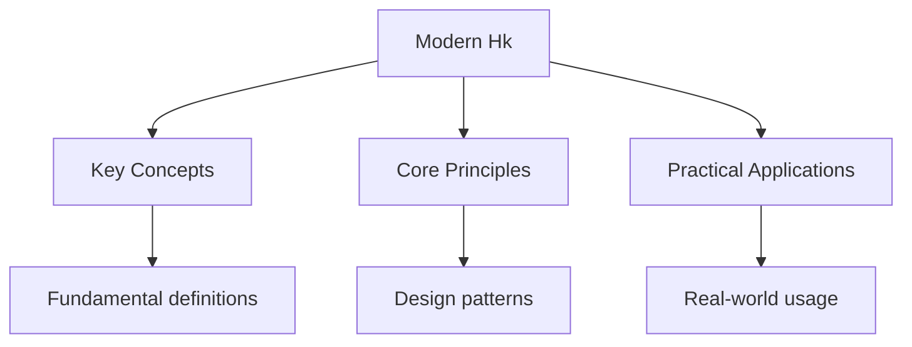

---

date: 2026-07-23T21:57:32+01:00
title: "Hong Kong Since 1945 | DSE - Wyatt's Notes"
description: "Post-war reconstruction, refugee influxes, industrialisation, 1967 riots, economic transformation, political development, Basic Law, 1997 Handover, and post-handover developments."
sidebar_position: 6
---

<!-- Breadcrumb Schema for SEO -->

## Post-War Reconstruction (1945-1950)

The end of Japanese occupation in August 1945 initiated a period of reconstruction and transformation for Hong Kong. The colonial government, restored under British administration, faced the enormous task of rebuilding infrastructure and restoring public services.

**Key Terms:**

- **Japanese military notes:** Currency issued during the occupation that became worthless after liberation, causing severe economic disruption.
- **Repatriation:** The forced return of residents to mainland China by the Japanese authorities, which reduced Hong Kong's population to approximately 600,000 by 1945.
- **War reparations:** Compensation demanded by Britain from Japan, though the practical recovery of reparations was limited.

The immediate post-war period saw rapid population growth as refugees returned from the mainland and new arrivals sought safety from the Chinese Civil War. By 1947, Hong Kong's population had recovered to approximately 1.8 million. This population influx provided the labour force for Hong Kong's subsequent industrialisation but also created severe housing, sanitation, and social problems.

**Source Analysis:** When examining post-war reconstruction documents, evaluate the perspective of the colonial administration, which prioritised economic recovery and social stability. Official reports may understate the severity of social problems or emphasise administrative achievements. Personal accounts and missionary records provide alternative perspectives on the lived experience of reconstruction.

## Chinese Civil War Refugees (1945-1956)

The Chinese Civil War and the establishment of the People's Republic of China in 1949 triggered one of the largest refugee movements in modern history. An estimated 750,000 to one million people crossed into Hong Kong between 1945 and 1956, dramatically increasing the population and transforming the territory's demographic composition.

**Key Terms:**

- **Refugee crisis:** The mass influx of persons fleeing political upheaval, creating pressure on housing, employment, and social services.
- **Border controls:** The restrictions imposed by both the British colonial government and the Chinese Communist government on movement across the border.
- **Illegal immigration:** The clandestine entry of refugees, often by sea or across the land border, which persisted despite official restrictions.

The refugee influx included people from all social classes, including industrialists, bankers, intellectuals, and workers. The Shanghai industrialists who relocated to Hong Kong brought capital, expertise, and commercial networks that were instrumental in the territory's industrialisation. The influx also included Communist agents and KMT sympathisers, creating a politically diverse and volatile population.

## Industrialisation (1950s-1970s)

Hong Kong's transformation from an entrepot trading port to a major manufacturing centre was one of the most rapid industrialisations in modern history. The process was driven by the availability of cheap labour, entrepreneurial initiative, and favourable international conditions.

**Key Terms:**

- **Entrepot trade:** The buying and selling of goods passing through a port without significant local processing.
- **Light manufacturing:** The production of consumer goods using labour-intensive methods, particularly textiles, electronics, and toys.
- **Export-oriented industrialisation:** An economic strategy based on producing goods for international markets rather than domestic consumption.

The Korean War (1950-1953) and the United Nations trade embargo against China disrupted Hong Kong's traditional role as an entrepot for Chinese trade. This disruption forced a reorientation towards manufacturing. Textile production was the first major industry, followed by electronics, plastics, and watches.

**Key milestones:**

| Period | Development |
| -------- | ------------- |
| 1950s | Textile industry dominance; establishment of major factories |
| 1960s | Diversification into electronics, toys, and watches |
| 1970s | Financial sector development; emergence of the stock market |
| 1980s | Transition to services and finance as manufacturing moved to mainland China |

The industrialisation process created a new working class and a distinctive urban culture. Workers lived in cramped conditions in factory dormitories or squatter settlements, with limited social protections. The colonial government maintained a policy of positive non-interventionism, providing infrastructure and legal frameworks while avoiding direct economic planning.

## The 1967 Riots

The 1967 Riots represented the most serious challenge to colonial authority in Hong Kong's post-war history. The disturbances began as a labour dispute at a plastic flower factory and escalated into widespread violence inspired by the Cultural Revolution in mainland China.

**Key Terms:**

- **Leftist riots:** The designation given to the disturbances by the colonial government, emphasising their connection to Communist agitation.
- **Bomb scares and actual bombings:** The tactic used by leftist militants, resulting in numerous casualties.
- **Curfew:** The emergency measure imposed by the colonial government to restore order.

**Key Events:**

- **May 1967:** Labour dispute at the Plastic Flower Workers' Union escalates into confrontation with police.
- **June-August 1967:** Daily demonstrations, strikes, and increasing violence. Bomb attacks by leftist militants kill 15 civilians and 5 policemen.
- **September-December 1967:** Violence subsides as colonial government asserts control and leftist movement loses public support.

The riots resulted in 51 deaths and over 800 injuries. The colonial government arrested over 1,800 people, including Communist organisers and sympathisers. The aftermath of the riots led to significant reforms in labour legislation, housing policy, and public services, as the government sought to address the grievances that had fuelled the disturbances.

**Source Analysis:** When examining sources from the 1967 Riots, evaluate the perspective of the colonial government, the leftist movement, and the general population. Government reports emphasise public order and security concerns; leftist publications articulate political grievances and revolutionary ideology; personal accounts reveal the experiences of ordinary residents caught in the violence.

## The Economic Miracle (1970s-1997)

Hong Kong's transformation from a manufacturing economy to a financial and services centre was one of the most remarkable developments of the late twentieth century.

**Key Terms:**

- **Asian Tigers:** The group of rapidly industrialising economies including Hong Kong, Singapore, South Korea, and Taiwan.
- **Free port:** A port where goods may be landed and handled without payment of customs duties.

The economic miracle was characterised by rapid GDP growth, low taxation, rule of law, and infrastructure development. GDP per capita increased from approximately $500 in 1960 to over $25,000 by 1997. The opening of mainland China after 1978 created opportunities for Hong Kong businesses to relocate manufacturing to the Pearl River Delta while focusing on finance, logistics, and professional services.

## Political Development

Hong Kong's political development during the colonial period was characterised by gradual expansion of representative institutions and growing demands for democratic reform.

**Key Terms:**

- **District Boards:** Local advisory bodies established in 1982 to provide limited democratic participation.
- **Legislative Council (LegCo):** The primary legislative body, gradually incorporating elected members.
- **Functional constituencies:** Electoral districts representing professional and business interests.

The question of democratic reform became increasingly contentious as the 1997 Handover approached. Key milestones included the establishment of District Boards (1982), indirect elections via functional constituencies (1985), direct elections for geographic constituencies (1991), and Governor Chris Patten's democratic reforms (1994). The British government sought to establish democratic institutions before the transfer of sovereignty, while the Chinese government opposed reforms it regarded as undermining its authority.

## The Basic Law and 1997 Handover

The Basic Law, adopted on 4 April 1990, served as the constitutional document for the Hong Kong Special Administrative Region (HKSAR) after 1997.

**Key Provisions:**

- **Article 5:** The capitalist system and way of life to remain unchanged for fifty years.
- **Article 22:** The central government not to interfere in affairs within the HKSAR.
- **Articles 45 and 68:** The ultimate aim of selecting the Chief Executive and LegCo members by universal suffrage.

The 1997 Handover ceremony on 1 July 1997 marked the end of 156 years of British colonial rule and the beginning of a new era for Hong Kong.

## Post-Handover Developments

The period after 1997 has been marked by significant political, economic, and social developments. The Asian Financial Crisis (1997-1998) caused deflation and rising unemployment. The SARS epidemic (2003) claimed 299 lives and disrupted economic activity. The National Security Law (2020) fundamentally altered Hong Kong's legal and political landscape, and electoral reforms (2021) reduced the proportion of directly elected seats in the Legislative Council.

The post-handover period has seen ongoing debates about Hong Kong's autonomy and its relationship with mainland China.

## Intuition

Modern Hong Kong is a story of transformation under pressure. The handover was like a relay race where the baton was passed mid-sprint — the runners had different techniques but had to keep the race going. The Basic Law was designed as a bridge between two systems, promising that Hong Kong's way of life would remain unchanged for fifty years. The challenge has been keeping that bridge stable when the two banks it connects are pulling in different directions. Economic development shows how a small territory can punch above its weight by being a gateway between East and West, but this advantage depends on maintaining trust on both sides.

## Exam Tips

- When analysing Hong Kong's post-war development, distinguish between economic, political, and social dimensions. Each area has its own trajectory and should be examined separately before drawing connections.
- For source-based questions on Hong Kong history, evaluate the perspective of the colonial government, the Chinese government, and the Hong Kong population. Each party had distinct interests and priorities that shaped their accounts of events.
- In essay questions, avoid presenting Hong Kong's development as a simple narrative of economic success. Analyse the social costs of industrialisation, the political limitations of colonial governance, and the tensions inherent in the One Country, Two Systems framework.
- Use specific evidence including dates, statistics, policy details, and personal accounts to support arguments about Hong Kong's development.
- When evaluating the significance of the 1997 Handover, consider both the immediate reactions and the longer-term implications for Hong Kong's political, economic, and social development.

## Cross-References

- **[Cold War](../history/diagnostics/diag-cold-war):** WWII led to the Cold War
- **[Modern China](../history/diagnostics/diag-modern-china):** Hong Kong's history is linked to China
- **[WWII](../history/diagnostics/diag-wwii):** WWII shaped modern history

## Common Mistakes

**Assuming Hong Kong's industrialisation was planned:** It was largely spontaneous, driven by refugee entrepreneurs with capital and skills from Shanghai. The colonial government played a supporting role, not a planning role.

**Confusing the 1967 riots with a pro-democracy movement:** The 1967 riots were pro-Communist, inspired by the Cultural Revolution. They were not about democracy but about workers' rights and colonial governance. Don't conflate them with later pro-democracy movements.

**Assuming the Basic Law was universally accepted:** The drafting process was contentious, with debates over democratic reform, the pace of elections, and the relationship between the NPCSC and Hong Kong courts. Many provisions were contested.

## Advanced Content

This section provides detailed coverage of advanced concepts, including full derivations, proofs, and extended examples.

### Derivations and Proofs

Complete mathematical derivations and proofs are provided where appropriate. Each step is explained to ensure understanding of the underlying reasoning.

### Extended Examples

Advanced examples demonstrate the application of concepts to complex problems. These examples go beyond standard exam questions to develop deeper understanding.

### Research Connections

This material connects to current research and advanced applications in the field. Understanding these connections provides context for the study material.

### Prerequisites

Ensure you have mastered the prerequisite material before attempting this advanced content.

## Advanced Content

This section provides detailed coverage of advanced concepts, including full derivations, proofs, and extended examples.

### Derivations and Proofs

Complete mathematical derivations and proofs are provided where appropriate. Each step is explained to ensure understanding of the underlying reasoning.

### Extended Examples

Advanced examples demonstrate the application of concepts to complex problems. These examples go beyond standard exam questions to develop deeper understanding.

### Research Connections

This material connects to current research and advanced applications in the field. Understanding these connections provides context for the study material.

### Prerequisites

Ensure you have mastered the prerequisite material before attempting this advanced content.

## Advanced Content

This section provides detailed coverage of advanced concepts, including full derivations, proofs, and extended examples.

### Derivations and Proofs

Complete mathematical derivations and proofs are provided where appropriate. Each step is explained to ensure understanding of the underlying reasoning.

### Extended Examples

Advanced examples demonstrate the application of concepts to complex problems. These examples go beyond standard exam questions to develop deeper understanding.

### Research Connections

This material connects to current research and advanced applications in the field. Understanding these connections provides context for the study material.

### Prerequisites

Ensure you have mastered the prerequisite material before attempting this advanced content.
