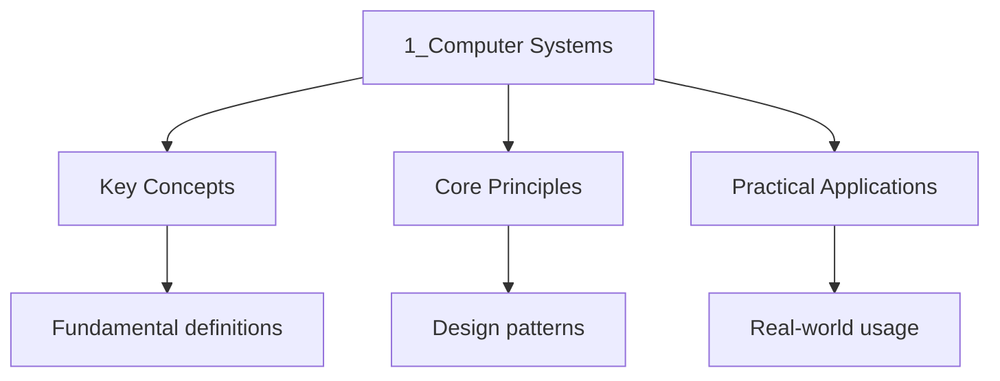

<!-- Breadcrumb Schema for SEO -->
<script type="application/ld+json">
{
  "@context": "https://schema.org",
  "@type": "BreadcrumbList",
  "itemListElement": [{"name": "Home", "url": "https://wyattau.com"}, {"name": "dse", "url": "https://dse.wyattau.com"}, {"name": "Ict", "url": "https://dse.wyattau.com/ict"}, {"name": "2 Computer Systems", "url": "https://dse.wyattau.com/ict/2-computer-systems"}, {"name": "1_computer Systems", "url": "https://dse.wyattau.com/ict/2-computer-systems/1_computer-systems"}]
}
</script>

## Hardware Components

### Central Processing Unit (CPU)

The CPU is the primary component that executes instructions. It consists of three main
Sub-components:

| Component                       | Function                                                                                                |
| ------------------------------- | ------------------------------------------------------------------------------------------------------- |
| **Arithmetic Logic Unit (ALU)** | Performs arithmetic (add, subtract, multiply, divide) and logical (AND, OR, NOT, XOR) operations        |
| **Control Unit (CU)**           | Coordinates all activities: fetches instructions, decodes them, and signals other components to execute |
| **Registers**                   | Small, extremely fast storage locations inside the CPU used for temporary data during processing        |

### Registers

| Register                          | Purpose                                                                  |
| --------------------------------- | ------------------------------------------------------------------------ |
| **Program Counter (PC)**          | Holds the memory address of the next instruction to be fetched           |
| **Memory Address Register (MAR)** | Holds the address in memory to be read from or written to                |
| **Memory Data Register (MDR)**    | Holds data that has been read from or is about to be written to memory   |
| **Accumulator (ACC)**             | Stores the results of ALU operations                                     |
| **Instruction Register (IR)**     | Holds the current instruction being decoded and executed                 |
| **Status Register (Flags)**       | Stores flags such as Zero, Carry, Negative, Overflow from ALU operations |

:::note
A typical CPU has a small number of general-purpose registers (8--32 in most architectures).
:::
### Memory Types

| Type    | Full Name            | Volatile? | Read/Write | Speed           | Typical Use                                |
| ------- | -------------------- | --------- | ---------- | --------------- | ------------------------------------------ |
| **RAM** | Random Access Memory | Yes       | Both       | Fast            | Main memory, running programs              |
| **ROM** | Read Only Memory     | No        | Read only  | Slower than RAM | Boot-up instructions (BIOS/UEFI), firmware |

**RAM types:**

- **SRAM (Static RAM):** Uses flip-flop circuits. Faster, more expensive. Used for CPU cache (L1,
  L2, L3).
- **DRAM (Dynamic RAM):** Uses capacitors. Slower, cheaper, needs refreshing. Used as main memory.

**ROM types:**

- **PROM:** Programmable once by the user.
- **EPROM:** Erasable using UV light, reprogrammable.
- **EEPROM:** Electrically erasable and reprogrammable.

### Secondary Storage

| Storage Type     | Technology                                        | Speed                     | Capacity        | Cost        | Volatility   |
| ---------------- | ------------------------------------------------- | ------------------------- | --------------- | ----------- | ------------ |
| **HDD**          | Magnetic platters spinning at 5400/7200/10000 RPM | 80--160 MB/s              | 500 GB -- 20 TB | Low         | Non-volatile |
| **SSD**          | NAND flash memory via SATA/NVMe                   | 500 MB/s -- 7 GB/s (NVMe) | 256 GB -- 4 TB  | Medium-High | Non-volatile |
| **Flash Memory** | NAND flash (USB drives, SD cards)                 | 10--300 MB/s              | 1 GB -- 1 TB    | Medium      | Non-volatile |

:::caution
<strong>Exam Tip When comparing storage, consider all five criteria: speed, capacity, cost per</strong>
GB, volatility, and durability. HDDs are cheaper per GB but slower and more fragile (moving parts).
SSDs are faster with no moving parts but more expensive per GB.
:::
---

<!-- Breadcrumb Schema for SEO -->
<script type="application/ld+json">
{
  "@context": "https://schema.org",
  "@type": "BreadcrumbList",
  "itemListElement": [{"name": "Home", "url": "https://wyattau.com"}, {"name": "dse", "url": "https://dse.wyattau.com"}, {"name": "Ict", "url": "https://dse.wyattau.com/ict"}, {"name": "2 Computer Systems", "url": "https://dse.wyattau.com/ict/2-computer-systems"}, {"name": "1_computer Systems", "url": "https://dse.wyattau.com/ict/2-computer-systems/1_computer-systems"}]
}
</script>

## Input Devices

| Device              | Input Type               | Common Use Case                                        |
| ------------------- | ------------------------ | ------------------------------------------------------ |
| **Keyboard**        | Text, commands           | Typing documents, entering data                        |
| **Mouse**           | Pointing, clicking       | GUI navigation, selecting objects                      |
| **Scanner**         | Image, document capture  | Digitising photos, OCR (Optical Character Recognition) |
| **Microphone**      | Audio/sound input        | Voice recording, voice commands                        |
| **Camera / Webcam** | Image, video capture     | Video conferencing, photography                        |
| **Touchscreen**     | Touch gestures           | Mobile devices, kiosks, POS systems                    |
| **Barcode Reader**  | Light reflection pattern | Retail checkout, inventory management                  |
| **RFID Reader**     | Radio frequency signal   | Access control, toll collection, tracking              |

**Barcode Reader vs RFID:**

| Feature                | Barcode Reader            | RFID Reader          |
| ---------------------- | ------------------------- | -------------------- |
| Line of sight required | Yes                       | No                   |
| Read range             | Short (contact to ~30 cm) | Up to several metres |
| Data capacity          | Limited ( a number)       | Can store more data  |
| Cost                   | Lower                     | Higher               |
| Read multiple at once  | No                        | Yes                  |

---

<!-- Breadcrumb Schema for SEO -->
<script type="application/ld+json">
{
  "@context": "https://schema.org",
  "@type": "BreadcrumbList",
  "itemListElement": [{"name": "Home", "url": "https://wyattau.com"}, {"name": "dse", "url": "https://dse.wyattau.com"}, {"name": "Ict", "url": "https://dse.wyattau.com/ict"}, {"name": "2 Computer Systems", "url": "https://dse.wyattau.com/ict/2-computer-systems"}, {"name": "1_computer Systems", "url": "https://dse.wyattau.com/ict/2-computer-systems/1_computer-systems"}]
}
</script>

## Output Devices

| Device        | Output Type          | Common Use Case                                   |
| ------------- | -------------------- | ------------------------------------------------- |
| **Monitor**   | Visual display       | Primary output for desktops/laptops               |
| **Printer**   | Hard copy (paper)    | Inkjet (photo quality), Laser (high volume, fast) |
| **Speaker**   | Audio output         | Music, alerts, multimedia                         |
| **Projector** | Large visual display | Presentations, classrooms, cinemas                |

**Inkjet vs Laser Printer:**

| Feature                | Inkjet            | Laser                   |
| ---------------------- | ----------------- | ----------------------- |
| Speed                  | Slower            | Faster                  |
| Print quality (text)   | Good              | Excellent               |
| Print quality (photos) | Better            | Good                    |
| Cost per page          | Higher            | Lower                   |
| Initial cost           | Lower             | Higher                  |
| Mechanism              | Sprays liquid ink | Uses toner powder, heat |

---

<!-- Breadcrumb Schema for SEO -->
<script type="application/ld+json">
{
  "@context": "https://schema.org",
  "@type": "BreadcrumbList",
  "itemListElement": [{"name": "Home", "url": "https://wyattau.com"}, {"name": "dse", "url": "https://dse.wyattau.com"}, {"name": "Ict", "url": "https://dse.wyattau.com/ict"}, {"name": "2 Computer Systems", "url": "https://dse.wyattau.com/ict/2-computer-systems"}, {"name": "1_computer Systems", "url": "https://dse.wyattau.com/ict/2-computer-systems/1_computer-systems"}]
}
</script>

## Von Neumann Architecture

The Von Neumann architecture defines a computer system with:

1. **Single shared memory** for both instructions and data (stored-program concept).
2. **CPU** consisting of ALU, CU, and registers.
3. **System bus** connecting CPU, memory, and I/O devices.

```python
          +---------+
          |   CPU   |
          | +-----+ |
          | | CU  | |
          | +-----+ |
          | | ALU | |
          | +-----+ |
          | |Regs | |
          | +-----+ |
          +----+----+
               |
         System Bus
               |
          +----+----+
          | Memory  |
          | (RAM +  |
          |  ROM)   |
          +---------+
               |
         System Bus
               |
          +----+----+
          |   I/O   |
          | Devices |
          +---------+
```

**Key principles:**

- Instructions and data are stored in the same memory.
- Memory is addressed linearly.
- Instructions are executed sequentially unless a branch/jump instruction changes the flow.

### Harvard Architecture (Comparison)

| Feature          | Von Neumann               | Harvard                                     |
| ---------------- | ------------------------- | ------------------------------------------- |
| Memory bus       | Single shared bus         | Separate instruction and data buses         |
| Memory           | One memory for both       | Separate memories for instructions and data |
| Speed bottleneck | Yes (bus contention)      | No (parallel fetch)                         |
| Complexity       | Simpler                   | More complex                                |
| Modern usage     | Most general-purpose CPUs | DSPs, microcontrollers, CPU caches          |

The Von Neumann **bottleneck** arises because the CPU and memory share a single bus. The CPU is
Often much faster than memory, so it spends time waiting for instructions and data to be fetched.
This is why modern CPUs use cache memory (L1, L2, L3) to reduce the impact of the bottleneck.

**Cache memory** is a small, fast memory between the CPU registers and main memory (RAM):

| Cache Level | Location                            | Size           | Speed                  |
| ----------- | ----------------------------------- | -------------- | ---------------------- |
| L1          | Inside CPU core                     | 32--128 KB     | Fastest (~1 cycle)     |
| L2          | Inside CPU (per core or shared)     | 256 KB -- 1 MB | Fast (~10 cycles)      |
| L3          | Inside CPU (shared among all cores) | 2--64 MB       | Moderate (~40 cycles)  |
| RAM         | Outside CPU on motherboard          | 4--128 GB      | Slowest (~100+ cycles) |

When the CPU needs data, it checks L1 first, then L2, then L3, then RAM. If the data is found in
Cache, it is a **cache hit**; otherwise it is a **cache miss** and the CPU must wait for the slower
Memory.

:::caution
<strong>Exam Tip The DSE syllabus focuses on Von Neumann. Know why it has a bottleneck (CPU</strong>
Waits for memory) and how Harvard architecture addresses this. Most modern CPUs use a modified
Harvard architecture internally (separate L1 caches for instructions and data) while presenting a
Von Neumann model externally.
:::
---

<!-- Breadcrumb Schema for SEO -->
<script type="application/ld+json">
{
  "@context": "https://schema.org",
  "@type": "BreadcrumbList",
  "itemListElement": [{"name": "Home", "url": "https://wyattau.com"}, {"name": "dse", "url": "https://dse.wyattau.com"}, {"name": "Ict", "url": "https://dse.wyattau.com/ict"}, {"name": "2 Computer Systems", "url": "https://dse.wyattau.com/ict/2-computer-systems"}, {"name": "1_computer Systems", "url": "https://dse.wyattau.com/ict/2-computer-systems/1_computer-systems"}]
}
</script>

## The Fetch-Decode-Execute Cycle

This is the fundamental cycle by which the CPU processes every instruction.

### Step-by-step

1. **Fetch:**

- PC holds the address of the next instruction.
- Address is copied from PC to MAR.
- Instruction is fetched from memory address in MAR into MDR.
- PC is incremented to point to the next instruction.
- Instruction in MDR is copied to IR.

1. **Decode:**

- CU decodes the instruction in IR.
- The CU determines which operation to perform and which operands are needed.

1. **Execute:**

- The instruction is executed (ALU performs calculations, data is moved, etc.).
- Results are stored in the accumulator or written back to memory.
- Status flags are updated as needed.
- Cycle repeats from step 1.

### Example Trace

Given memory starting at address 100:

| Address | Instruction |
| ------- | ----------- |
| 100     | LOAD 5      |
| 101     | ADD 3       |
| 102     | STORE 6     |

**Execution trace:**

| Step    | Action                                               | PC  | MAR | MDR     | IR      | ACC       |
| ------- | ---------------------------------------------------- | --- | --- | ------- | ------- | --------- |
| Fetch   | PC(100) -> MAR; Mem[MAR] -> MDR; PC = 101; MDR -> IR | 101 | 100 | LOAD 5  | LOAD 5  | ?         |
| Decode  | CU decodes LOAD 5                                    | 101 | 100 | LOAD 5  | LOAD 5  | ?         |
| Execute | Mem[5] -> ACC                                        | 101 | 100 | LOAD 5  | LOAD 5  | M[5]      |
| Fetch   | PC(101) -> MAR; Mem[MAR] -> MDR; PC = 102; MDR -> IR | 102 | 101 | ADD 3   | ADD 3   | M[5]      |
| Decode  | CU decodes ADD 3                                     | 102 | 101 | ADD 3   | ADD 3   | M[5]      |
| Execute | ACC = ACC + Mem[3]                                   | 102 | 101 | ADD 3   | ADD 3   | M[5]+M[3] |
| Fetch   | PC(102) -> MAR; Mem[MAR] -> MDR; PC = 103; MDR -> IR | 103 | 102 | STORE 6 | STORE 6 | M[5]+M[3] |
| Decode  | CU decodes STORE 6                                   | 103 | 102 | STORE 6 | STORE 6 | M[5]+M[3] |
| Execute | ACC -> Mem[6]                                        | 103 | 102 | STORE 6 | STORE 6 | M[5]+M[3] |

---

<!-- Breadcrumb Schema for SEO -->
<script type="application/ld+json">
{
  "@context": "https://schema.org",
  "@type": "BreadcrumbList",
  "itemListElement": [{"name": "Home", "url": "https://wyattau.com"}, {"name": "dse", "url": "https://dse.wyattau.com"}, {"name": "Ict", "url": "https://dse.wyattau.com/ict"}, {"name": "2 Computer Systems", "url": "https://dse.wyattau.com/ict/2-computer-systems"}, {"name": "1_computer Systems", "url": "https://dse.wyattau.com/ict/2-computer-systems/1_computer-systems"}]
}
</script>

## Software Types

### System Software

Software that manages and controls hardware and provides a platform for application software.

| Type                      | Description                                 | Examples                                                |
| ------------------------- | ------------------------------------------- | ------------------------------------------------------- |
| **Operating System (OS)** | Manages all hardware and software resources | Windows, macOS, Linux, Android, iOS                     |
| **Utility Programs**      | Perform specific maintenance tasks          | Disk defragmenter, antivirus, file manager, backup tool |

### Application Software

Software designed for end-users to perform specific tasks.

| Type                | Description                         | Examples                                    |
| ------------------- | ----------------------------------- | ------------------------------------------- |
| **General-purpose** | Widely used across many domains     | Word processors, spreadsheets, web browsers |
| **Special-purpose** | Designed for a specific field       | Accounting software, CAD, medical imaging   |
| **Custom/bespoke**  | Written for a specific organisation | A company"s payroll system                  |

### Operating System Functions

| Function               | Description                                                                                                                     |
| ---------------------- | ------------------------------------------------------------------------------------------------------------------------------- |
| **Memory Management**  | Allocates and deallocates memory space, uses virtual memory (swap space on disk to extend RAM), manages paging and segmentation |
| **Process Management** | Schedules CPU time among processes, handles multitasking (time-sharing), manages process creation and termination               |
| **File Management**    | Organises files in directories/folders, handles file naming, access control, and storage allocation                             |
| **User Interface**     | Provides CLI (Command Line Interface) or GUI (Graphical User Interface) for user interaction                                    |
| **Device Management**  | Uses device drivers to communicate with hardware, manages I/O operations                                                        |
| **Security**           | User authentication, access control, firewall integration                                                                       |

### Types of User Interfaces

**Command Line Interface (CLI):**

- User types commands using a keyboard.
- Requires memorisation of commands and syntax.
- Efficient for experienced users; supports scripting and automation.
- Examples: Windows Command Prompt, Linux bash, macOS Terminal.

**Graphical User Interface (GUI):**

- Users interact with visual elements (windows, icons, menus, buttons).
- Intuitive and easy to learn; does not require memorising commands.
- Uses pointing devices (mouse, touchscreen).
- Consumes more system resources than CLI.
- Examples: Windows Explorer, macOS Finder, Android/iOS home screens.

**Menu-Driven Interface:**

- User selects options from a predefined list of menus.
- Common in ATMs, self-service kiosks, and embedded systems.
- Limited flexibility but very easy to use for specific tasks.

### Virtual Memory

Virtual memory is a memory management technique that uses secondary storage (hard disk/SSD) as an
Extension of RAM. When physical RAM is full, the operating system moves less frequently used pages
(data blocks, 4 KB) from RAM to a designated area on disk called the **swap space** or **page
file**. When those pages are needed again, they are swapped back into RAM.

| Aspect         | Advantage                                                   | Disadvantage                                                    |
| -------------- | ----------------------------------------------------------- | --------------------------------------------------------------- |
| Capacity       | Allows running more/larger programs than physical RAM alone | Disk access is much slower than RAM (thousands of times slower) |
| Cost           | Effectively increases memory without buying more RAM        | Excessive swapping (thrashing) severely degrades performance    |
| Implementation | Transparent to the user and applications                    | Requires disk space to be reserved                              |

**Thrashing** occurs when the system spends more time swapping pages in and out of memory than
Executing actual instructions. This happens when the system is overloaded with too many processes
Competing for insufficient RAM.

---

<!-- Breadcrumb Schema for SEO -->
<script type="application/ld+json">
{
  "@context": "https://schema.org",
  "@type": "BreadcrumbList",
  "itemListElement": [{"name": "Home", "url": "https://wyattau.com"}, {"name": "dse", "url": "https://dse.wyattau.com"}, {"name": "Ict", "url": "https://dse.wyattau.com/ict"}, {"name": "2 Computer Systems", "url": "https://dse.wyattau.com/ict/2-computer-systems"}, {"name": "1_computer Systems", "url": "https://dse.wyattau.com/ict/2-computer-systems/1_computer-systems"}]
}
</script>

## Number Systems

### Binary (Base 2)

Digits: 0, 1. Each digit is a **bit**. 8 bits = 1 **byte**.

| Decimal | Binary    |
| ------- | --------- |
| 0       | 0000 0000 |
| 1       | 0000 0001 |
| 2       | 0000 0010 |
| 5       | 0000 0101 |
| 10      | 0000 1010 |
| 255     | 1111 1111 |

### Hexadecimal (Base 16)

Digits: 0--9, A(10), B(11), C(12), D(13), E(14), F(15). Each hex digit represents exactly 4 bits.

| Hex | Binary         | Decimal |
| --- | -------------- | ------- |
| 0   | 0000           | 0       |
| 1   | 0001           | 1       |
| 9   | 1001           | 9       |
| A   | 1010           | 10      |
| F   | 1111           | 15      |
| 10  | 0001 0000      | 16      |
| FF  | 1111 1111      | 255     |
| 100 | 0001 0000 0000 | 256     |

### Binary-Coded Decimal (BCD)

Each decimal digit (0--9) is represented by its 4-bit binary equivalent.

| Decimal | BCD            |
| ------- | -------------- |
| 0       | 0000           |
| 9       | 1001           |
| 15      | 0001 0101      |
| 127     | 0001 0010 0111 |

:::caution
<strong>Exam Tip BCD is different from pure binary. The decimal number 15 in pure binary is</strong>
`1111`But in BCD it is `0001 0101` (each decimal digit encoded separately). BCD wastes some bit
Patterns (1010--1111 are invalid) but is useful for displays and financial calculations where each
Decimal digit must be preserved exactly.
:::
### Conversions

**Decimal to Binary:** Repeatedly divide by 2, record remainders from bottom to top.

**Decimal to Hexadecimal:** Repeatedly divide by 16, record remainders.

**Binary to Hexadecimal:** Group bits in groups of 4 from the right, convert each group.

**Hexadecimal to Binary:** Replace each hex digit with its 4-bit binary equivalent.

**Decimal to BCD:** Replace each decimal digit with its 4-bit binary equivalent.

<details>
<summary>Worked Example: Decimal 185 to Binary, Hex, and BCD</summary>

**To binary:**

$185 \div 2 = 92$ R $1$ $92 \div 2 = 46$ R $0$ $46 \div 2 = 23$ R $0$ $23 \div 2 = 11$ R $1$
$11 \div 2 = 5$ R $1$ $5 \div 2 = 2$ R $1$ $2 \div 2 = 1$ R $0$ $1 \div 2 = 0$ R $1$

Reading remainders from bottom to top: $185_{10} = 10111001_2$

**To hexadecimal:**

$185 \div 16 = 11$ R $9$. $11 = B$. So $185_{10} = B9_{16}$

**To BCD:**

$185 \to 1 \to 8 \to 5 \to 0001\ 1000\ 0101$

$185_{10} = 000110000101_{BCD}$

</details>

---

<!-- Breadcrumb Schema for SEO -->
<script type="application/ld+json">
{
  "@context": "https://schema.org",
  "@type": "BreadcrumbList",
  "itemListElement": [{"name": "Home", "url": "https://wyattau.com"}, {"name": "dse", "url": "https://dse.wyattau.com"}, {"name": "Ict", "url": "https://dse.wyattau.com/ict"}, {"name": "2 Computer Systems", "url": "https://dse.wyattau.com/ict/2-computer-systems"}, {"name": "1_computer Systems", "url": "https://dse.wyattau.com/ict/2-computer-systems/1_computer-systems"}]
}
</script>

## Data Representation

### Text Representation

#### ASCII (American Standard Code for Information Interchange)

- 7-bit code, extended to 8-bit (Extended ASCII).
- Represents 128 characters (0--127): uppercase letters (65--90), lowercase letters (97--122),
  digits (48--57), control characters (0--31), symbols.
- Each character stored as 1 byte (8 bits) with the MSB unused or used for parity.

| Character | ASCII (decimal) | ASCII (binary) |
| --------- | --------------- | -------------- |
| 'A'       | 65              | 0100 0001      |
| 'Z'       | 90              | 0101 1010      |
| 'a'       | 97              | 0110 0001      |
| '0'       | 48              | 0011 0000      |
| Space     | 32              | 0010 0000      |

#### Unicode

- Supports characters from all languages, symbols, and emoji.
- UTF-8 encoding: variable-length (1--4 bytes). Backward-compatible with ASCII (first 128 characters
  identical).
- UTF-16: 2 or 4 bytes per character.
- UTF-32: fixed 4 bytes per character.

:::note
Unicode covers all writing systems but uses more storage. UTF-8 is the most widely used encoding on
The internet.

### Image Representation

A bitmap image is a grid of **pixels** (picture elements). Each pixel is assigned a colour value.

**Image resolution:** Width $\times$ Height in pixels (e.g., $1920 \times 1080$).

**Colour depth:** Number of bits used to represent each pixel's colour.

| Colour Depth | Number of Colours        | Calculation |
| ------------ | ------------------------ | ----------- |
| 1 bit        | 2 (black and white)      | $2^1$       |
| 8 bits       | 256                      | $2^8$       |
| 16 bits      | 65 536 (High Colour)     | $2^{16}$    |
| 24 bits      | 16 777 216 (True Colour) | $2^{24}$    |

**Image file size (uncompressed):**

$$
\mathrm{File Size (bits)} = \mathrm{Width} \times \mathrm{Height} \times \mathrm{Colour Depth}
$$

**In bytes:**

$$
\mathrm{File Size (bytes)} = \frac{\mathrm{Width} \times \mathrm{Height} \times \mathrm{Colour Depth}}{8}
$$

<details>
<summary>Worked Example: Image File Size Calculation</summary>

A $1024 \times 768$ image with 24-bit colour depth.

$$
\mathrm{Size (bits)} = 1024 \times 768 \times 24 = 18874368 \mathrm{ bits}
$$

$$
\mathrm{Size (bytes)} = \frac{18874368}{8} = 2359296 \mathrm{ bytes}
$$

$$
\mathrm{Size (KB)} = \frac{2359296}{1024} = 2304 \mathrm{ KB}
$$

$$
\mathrm{Size (MB)} = \frac{2304}{1024} = 2.25 \mathrm{ MB}
$$

</details>

**Bitmap vs Vector Graphics:**

| Feature                        | Bitmap                      | Vector                              |
| ------------------------------ | --------------------------- | ----------------------------------- |
| Storage method                 | Grid of pixels              | Mathematical descriptions of shapes |
| Scalability                    | Loses quality when enlarged | Scales without quality loss         |
| File size for diagrams         | Larger                      | Smaller                             |
| Suitability for photos         | Excellent                   | Not suitable                        |
| Suitability for logos/diagrams | Depends on resolution       | Ideal                               |
| Examples                       | JPEG, PNG, BMP              | SVG, EPS                            |
| Editing                        | Pixel-level editing         | Shape and path editing              |

**Image compression:**

| Type     | Method                                                  | Quality Loss       | Example       |
| -------- | ------------------------------------------------------- | ------------------ | ------------- |
| Lossless | Reduces redundancy without discarding data              | None               | PNG, GIF, BMP |
| Lossy    | Discards data that is less perceptible to the human eye | Yes (irreversible) | JPEG, WebP    |

JPEG compression works by dividing the image into $8 \times 8$ pixel blocks, applying a Discrete
Cosine Transform (DCT), and then quantising (rounding) the frequency coefficients. Higher
Compression ratios discard more high-frequency detail, resulting in smaller files with visible
Artefacts (blockiness, blurring).

### Sound Representation

Sound is an analogue wave that must be converted to digital form via **sampling**.

**Steps in sound digitisation:**

1. **Sampling:** Measure the amplitude of the sound wave at regular intervals (sampling rate).
2. **Quantisation:** Map each sampled amplitude to the nearest value in a set of discrete levels.
3. **Encoding:** Convert each quantised value to binary.

**Sampling rate:** Number of samples per second, measured in Hz. CD quality = 44 100 Hz (44.1 kHz).

**Bit depth:** Number of bits per sample. CD quality = 16 bits per sample. Higher bit depth = more
Accurate representation of the analogue signal. Common values: 8-bit (telephone quality), 16-bit
(CD), 24-bit (studio recording).

**Nyquist theorem:** To accurately capture a sound with maximum frequency $f_{\max}$The sampling
Rate must be at least $2f_{\max}$. Since human hearing ranges up to approximately $20\mathrm{ kHz}$
The CD sampling rate of $44\,100\mathrm{ Hz}$ is sufficient (Nyquist frequency =
$22\,050\mathrm{ Hz}$).

**File size calculation:**

$$
\mathrm{File Size (bits)} = \mathrm{Sampling Rate} \times \mathrm{Bit Depth} \times \mathrm{Duration (s)} \times \mathrm{Channels}
$$

- Mono: 1 channel. Stereo: 2 channels.

<details>
<summary>Worked Example: Sound File Size Calculation</summary>

A 3-minute stereo recording at CD quality (44 100 Hz, 16-bit).

$$
\mathrm{Duration} = 3 \times 60 = 180 \mathrm{ seconds}
$$

$$
\mathrm{Size (bits)} = 44100 \times 16 \times 180 \times 2 = 254016000 \mathrm{ bits}
$$

$$
\mathrm{Size (bytes)} = \frac{254016000}{8} = 31752000 \mathrm{ bytes}
$$

$$
\mathrm{Size (MB)} = \frac{31752000}{1024 \times 1024} \approx 30.28 \mathrm{ MB}
$$

</details>

---

<!-- Breadcrumb Schema for SEO -->
<script type="application/ld+json">
{
  "@context": "https://schema.org",
  "@type": "BreadcrumbList",
  "itemListElement": [{"name": "Home", "url": "https://wyattau.com"}, {"name": "dse", "url": "https://dse.wyattau.com"}, {"name": "Ict", "url": "https://dse.wyattau.com/ict"}, {"name": "2 Computer Systems", "url": "https://dse.wyattau.com/ict/2-computer-systems"}, {"name": "1_computer Systems", "url": "https://dse.wyattau.com/ict/2-computer-systems/1_computer-systems"}]
}
</script>

## Common Pitfalls

1. **Confusing RAM and ROM:** RAM is volatile (loses data on power off) and read-write. ROM is
   non-volatile and read-only (or mostly read-only).

2. **Fetch-decode-execute order:** The PC is incremented during the fetch phase, not after
   execution. The order matters for exam questions.

3. **Binary vs BCD:** 15 in binary is `1111`; 15 in BCD is `0001 0101`. They are different
   representations.

4. **Colour depth and number of colours:** 24-bit colour gives $2^{24} = 16\ 777\ 216$ colours, not
   24 colours.

5. **Image file size formula:** Do not forget to divide by 8 to convert bits to bytes, and by 1024
   for KB/MB.

6. **Sound file size:** Remember to multiply by the number of channels (2 for stereo). Forgetting
   this halves the file size.

7. **ASCII range:** Uppercase 'A' is 65, lowercase 'a' is 97. The difference is 32. Digits '0'--'9'
   are 48--57. These values are frequently tested.

8. **Volatility:** "Volatile" means data is lost when power is removed. RAM is volatile; ROM, HDD,
   SSD, and flash memory are non-volatile.

9. **SSD vs Flash:** An SSD is a type of flash memory device. All SSDs use flash memory, but not all
   flash memory devices are SSDs (e.g., USB drives, SD cards).

10. **ALU vs CU:** The ALU performs calculations; the CU coordinates and controls operations. Do not
    mix them up.

---

<!-- Breadcrumb Schema for SEO -->
<script type="application/ld+json">
{
  "@context": "https://schema.org",
  "@type": "BreadcrumbList",
  "itemListElement": [{"name": "Home", "url": "https://wyattau.com"}, {"name": "dse", "url": "https://dse.wyattau.com"}, {"name": "Ict", "url": "https://dse.wyattau.com/ict"}, {"name": "2 Computer Systems", "url": "https://dse.wyattau.com/ict/2-computer-systems"}, {"name": "1_computer Systems", "url": "https://dse.wyattau.com/ict/2-computer-systems/1_computer-systems"}]
}
</script>

## Practice Problems

<details>
<summary>Question 1: Storage Comparison</summary>

A school needs to store 500 GB of student records. They are considering an HDD vs SSD solution.

(a) Calculate how many 1 TB HDDs would be needed to store 500 GB of data.

(b) Give two advantages and two disadvantages of using SSDs instead of HDDs for this purpose.

Answer:

(a) $500 \mathrm{ GB} = 0.5 \mathrm{ TB}$. One 1 TB HDD is sufficient.

(b) **Advantages of SSD:** Faster read/write speeds, no moving parts (more durable, less prone to
Mechanical failure), quieter operation, lower power consumption.

**Disadvantages of SSD:** Higher cost per GB, limited write cycles (though modern SSDs mitigate this
With wear levelling).

</details>

<details>
<summary>Question 2: Fetch-Decode-Execute Trace</summary>

Given the following program in memory:

| Address | Instruction |
| ------- | ----------- |
| 200     | LOAD 10     |
| 201     | ADD 11      |
| 202     | SUB 12      |
| 203     | STORE 13    |

Memory values: M[10] = 25, M[11] = 17, M[12] = 8, M[13] = 0.

Trace the fetch-decode-execute cycle for the first two instructions, showing the state of PC, MAR,
MDR, IR, and ACC after each phase.

Answer:

**Instruction 1: LOAD 10**

| Phase   | PC  | MAR | MDR     | IR      | ACC |
| ------- | --- | --- | ------- | ------- | --- |
| Fetch   | 201 | 200 | LOAD 10 | LOAD 10 | ?   |
| Decode  | 201 | 200 | LOAD 10 | LOAD 10 | ?   |
| Execute | 201 | 200 | LOAD 10 | LOAD 10 | 25  |

**Instruction 2: ADD 11**

| Phase   | PC  | MAR | MDR    | IR     | ACC |
| ------- | --- | --- | ------ | ------ | --- |
| Fetch   | 202 | 201 | ADD 11 | ADD 11 | 25  |
| Decode  | 202 | 201 | ADD 11 | ADD 11 | 25  |
| Execute | 202 | 201 | ADD 11 | ADD 11 | 42  |

ACC = 25 + 17 = 42.

</details>

<details>
<summary>Question 3: Number Conversions</summary>

(a) Convert $11010110_2$ to decimal.

(b) Convert $234_{10}$ to binary and hexadecimal.

(c) Convert the decimal number 593 to BCD.

Answer:

(a)
$1 \times 128 + 1 \times 64 + 0 \times 32 + 1 \times 16 + 0 \times 8 + 1 \times 4 + 1 \times 2 + 0 \times 1 = 128 + 64 + 16 + 4 + 2 = 214_{10}$

(b) **To binary:** $234 \div 2 = 117$ R $0$ $117 \div 2 = 58$ R $1$ $58 \div 2 = 29$ R $0$
$29 \div 2 = 14$ R $1$ $14 \div 2 = 7$ R $0$ $7 \div 2 = 3$ R $1$ $3 \div 2 = 1$ R $1$
$1 \div 2 = 0$ R $1$

$234_{10} = 11101010_2$

**To hexadecimal:** $234 \div 16 = 14$ R $10$. $14 = E$, $10 = A$. So $234_{10} = EA_{16}$

(c) $593 \to 5 \to 9 \to 3 \to 0101\ 1001\ 0011_{BCD}$

</details>

<details>
<summary>Question 4: Image Representation</summary>

A digital camera produces images of $4000 \times 3000$ pixels with 32-bit colour depth.

(a) Calculate the uncompressed file size of one image in MB.

(b) If the camera has a 16 GB storage card, how many such images can it store?

Answer:

(a)

$$
\mathrm{Size (bits)} = 4000 \times 3000 \times 32 = 384000000 \mathrm{ bits}
$$

$$
\mathrm{Size (bytes)} = \frac{384000000}{8} = 48000000 \mathrm{ bytes}
$$

$$
\mathrm{Size (MB)} = \frac{48000000}{1024 \times 1024} \approx 45.77 \mathrm{ MB}
$$

(b)

$$
16 \mathrm{ GB} = 16 \times 1024 \mathrm{ MB} = 16384 \mathrm{ MB}
$$

$$
\mathrm{Number of images} = \left\lfloor \frac{16384}{45.77} \right\rfloor = 358 \mathrm{ images}
$$

</details>

<details>
<summary>Question 5: Sound Representation</summary>

A 2-minute mono audio recording is digitised at a sampling rate of 22 050 Hz with 8-bit resolution.

(a) Calculate the file size in MB.

(b) Explain the effect on file size and sound quality if the sampling rate is doubled to 44 100 Hz.

Answer:

(a)

$$
\mathrm{Duration} = 2 \times 60 = 120 \mathrm{ seconds}
$$

$$
\mathrm{Size (bits)} = 22050 \times 8 \times 120 \times 1 = 21168000 \mathrm{ bits}
$$

$$
\mathrm{Size (bytes)} = \frac{21168000}{8} = 2646000 \mathrm{ bytes}
$$

$$
\mathrm{Size (MB)} = \frac{2646000}{1024 \times 1024} \approx 2.52 \mathrm{ MB}
$$

(b) Doubling the sampling rate doubles the file size to approximately 5.05 MB. Sound quality
Improves because more samples per second capture the original waveform more accurately, reducing
Aliasing and better reproducing higher frequencies (the Nyquist frequency doubles from ~11 kHz to
~22 kHz).

</details>

<details>
<summary>Question 6: ASCII and Character Encoding</summary>

(a) The ASCII code for 'H' is 72. What is the ASCII code for 'h'?

(b) A text file contains 1000 characters, all ASCII. What is the file size in KB?

(c) Explain why Unicode is preferred over ASCII for international applications.

Answer:

(a) 'h' = 72 + 32 = 104. (Lowercase letters are 32 positions after their uppercase counterparts.)

(b) Each ASCII character is 1 byte. $1000 \mathrm{ bytes} / 1024 = 0.98 \mathrm{ KB}$.

(c) ASCII only supports 128 characters (English alphabet, digits, basic symbols). Unicode supports
Over 149 000 characters covering all major writing systems, symbols, and emoji. This makes Unicode
Essential for applications serving users who speak different languages or need special characters.

</details>

<details>
<summary>Question 7: Operating System Functions</summary>

(a) Explain the difference between memory management and process management in an operating system.

(b) Describe what virtual memory is and why it is used.

(c) Give an example of a utility program and explain its purpose.

Answer:

(a) **Memory management** allocates and deallocates RAM among running programs, ensuring each
Process has sufficient memory and that processes do not interfere with each other's memory space.
**Process management** schedules CPU time among processes, handles creation/termination of
Processes, and enables multitasking.

(b) Virtual memory uses a portion of the hard disk as an extension of RAM. When RAM is full, the OS
Moves less frequently used data (pages) from RAM to disk (swapping/paging). This allows the system
To run more programs than would fit in physical RAM, at the cost of slower access to swapped data.

(c) **Disk defragmenter:** Rearranges fragmented file data on an HDD so that related data blocks are
Stored contiguously. This improves read/write performance by reducing disk head movement. (Note:
Defragmentation is not needed for SSDs.)

</details>

<details>
<summary>Question 8: Software Types</summary>

Classify each of the following as system software or application software, and explain your
Reasoning:

(a) Microsoft Word (b) Windows Defender (c) Linux (d) Adobe Photoshop

Answer:

(a) **Application software** -- it is a general-purpose word processor designed for end-user tasks.

(b) **System software (utility program)** -- it is an antivirus utility that protects the system by
Detecting and removing malware. It performs a maintenance/security task for the system.

(c) **System software (operating system)** -- it manages all hardware resources, provides
Memory/process/file management, and serves as a platform for other software.

(d) **Application software** -- it is a special-purpose image editing program designed for
End-users.

</details>

<details>
<summary>Question 9: Data Representation -- Extended</summary>

(a) Convert $3F_{16}$ to decimal.

(b) Convert $11001100_2$ to hexadecimal.

(c) A bitmap image has dimensions $800 \times 600$ and uses 16-bit colour. Calculate the file size
In KB. If the image is compressed using a lossless technique with a 3:2 compression ratio, what is
The compressed file size?

Answer:

(a) $3 \times 16 + 15 = 48 + 15 = 63_{10}$

(b) Group into nibbles: $1100\ 1100$. $C$ and $C$. So $11001100_2 = CC_{16}$

(c)

$$
\mathrm{Uncompressed (bits)} = 800 \times 600 \times 16 = 7680000 \mathrm{ bits}
$$

$$
\mathrm{Uncompressed (bytes)} = \frac{7680000}{8} = 960000 \mathrm{ bytes}
$$

$$
\mathrm{Uncompressed (KB)} = \frac{960000}{1024} = 937.5 \mathrm{ KB}
$$

$$
\mathrm{Compressed (KB)} = \frac{937.5}{3} \times 2 = 625 \mathrm{ KB}
$$

</details>

<details>
<summary>Question 10: Input/Output Devices -- Scenario</summary>

A library wants to automate its book checkout system. For each scenario, recommend the most
Appropriate input or output device and justify your choice.

(a) Identifying a book when it is checked out. (b) Identifying a library member. (c) Printing a
Receipt for the member. (d) Displaying the library catalogue to members on a self-service kiosk.

Answer:

(a) **Barcode reader:** Each book has a barcode on the cover containing a unique identifier.
Scanning is fast and accurate.

(b) **RFID reader / barcode reader:** Library cards often have barcodes or RFID chips. RFID allows
Contactless scanning without removing the card from a wallet.

(c) **Laser printer:** Fast, low cost per page, suitable for printing simple text receipts in high
Volume.

(d) **Touchscreen monitor:** Allows members to interact directly with the catalogue. Combines input
(touch) and output (display) in one device, ideal for self-service kiosks.

</details>

<details>
<summary>Question 11: Comparing CPU Components</summary>

(a) Describe the role of the Control Unit (CU) in the fetch-decode-execute cycle.

(b) Describe the role of the Arithmetic Logic Unit (ALU).

(c) Explain why registers are necessary in a CPU. Why can the CPU not operate using only RAM?

Answer:

(a) The CU coordinates and controls all operations during the fetch-decode-execute cycle. During the
Fetch phase, it sends control signals to copy the PC value to the MAR and trigger a memory read.
During decode, it interprets the instruction in the IR and determines which operation to perform.
During execute, it sends the appropriate control signals to the ALU, registers, or memory to carry
Out the instruction.

(b) The ALU performs all arithmetic calculations (addition, subtraction, multiplication, division)
And logical operations (AND, OR, NOT, XOR, comparisons). It receives operands from registers,
Performs the operation as directed by the CU, and stores the result in the accumulator or a
Specified register.

(c) Registers are necessary because they provide the fastest possible storage access (1 clock
Cycle), whereas RAM access takes many clock cycles (100+ cycles for L3 cache, even more for RAM). If
The CPU had to fetch every operand from RAM for every instruction, processing would be impractically
Slow. Registers allow the CPU to keep frequently used data (current instruction, memory addresses,
Intermediate results) immediately accessible, maximising throughput.

</details>

<details>
<summary>Question 12: System Performance Factors</summary>

A student claims that a computer with a faster CPU clock speed will always perform better than one
With a slower clock speed. Evaluate this claim by considering at least three other factors that
Affect system performance.

Answer:

The claim is **not always correct**. While CPU clock speed is one factor affecting performance, the
Following factors are also critical:

1. **Number of CPU cores:** A 2.0 GHz quad-core processor can outperform a 3.0 GHz dual-core
   processor for multitasking and parallel workloads, since it can execute more instructions
   simultaneously.

2. **Cache size:** Larger caches reduce the frequency of cache misses, meaning the CPU spends less
   time waiting for data from RAM. A CPU with a large L3 cache may outperform a faster CPU with a
   small cache.

3. **RAM capacity and speed:** Insufficient RAM causes the system to rely heavily on virtual memory
   (swapping to disk), which is extremely slow. A system with adequate fast RAM will outperform one
   with insufficient RAM regardless of CPU speed.

4. **Storage type:** An SSD is orders of magnitude faster than an HDD for boot times, application
   loading, and file operations. A system with an SSD but slower CPU may feel more responsive than
   one with a fast CPU and HDD.

5. **Bus speed and width:** The speed of the system bus (front-side bus) affects how quickly data
   can transfer between the CPU, RAM, and other components.

</details>




## Summary

systems, including key principles and practical applications.

> > > > > > > Stashed changes:docs/docs_dse/ICT/computer-systems.md

**Key concepts include:**

- core concepts and definitions
- key principles and frameworks
- practical applications
- common techniques and methods
- evaluation and critical analysis

A thorough understanding of these concepts, combined with regular practice and review, is essential
for mastery of this topic.

> > > > > > > Stashed changes:docs/docs_dse/ICT/computer-systems.md

## Intuition

A computer system is a hierarchy of layers, each one providing services to the layer above it. The hardware is the foundation, the operating system manages resources, and applications provide the user interface. Think of it as a restaurant: the kitchen (hardware) does the actual cooking, the manager (OS) coordinates staff and supplies, and the waiter (application) takes your order and delivers the food. Understanding these layers helps you diagnose problems by identifying which layer is failing.

## Worked Examples

Worked examples demonstrating the application of key concepts are covered in the detailed sub-pages
linked above.
:::

## See Also

- [Computer Systems](./)
- [DSE ICT](..)
- [Computer Systems -- Diagnostic Tests](../diagnostics/diag-computer-systems)
