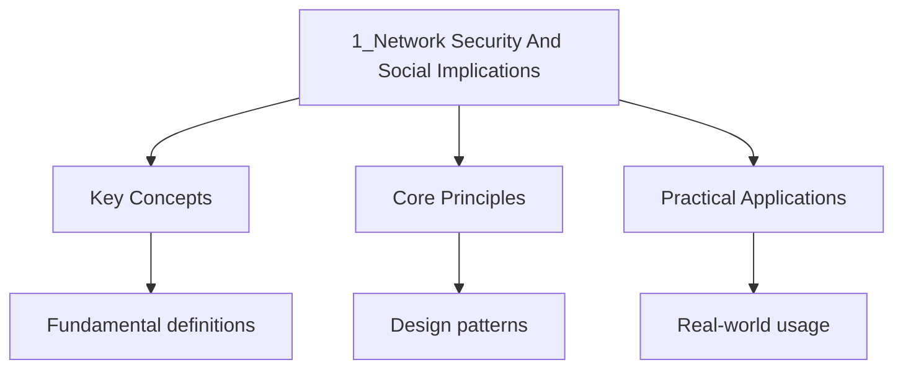

<!-- Breadcrumb Schema for SEO -->

## Intuition

Network security is the practice of protecting systems and data from unauthorised access, damage, or theft. Malware taxonomy classifies threats by their behaviour: viruses need host files and user action, while worms spread autonomously across networks. Phishing exploits human trust rather than technical vulnerabilities, using social engineering to trick users into revealing credentials. Defence requires layered security measures combining technical controls like firewalls and encryption with human awareness training and organisational policies.

This document extends the network security and social implications topics covered in
[../4-networking-and-internet/1_internet-and-data-communications](../4-networking-and-internet/1_internet-and-data-communications)
with deeper analysis of Threats, security measures, legal frameworks, and professional
considerations.

---

<!-- Breadcrumb Schema for SEO -->

## Network Security Threats

### Malware Taxonomy

Malware (malicious software) is software designed to damage, disrupt, or gain unauthorised access to
A computer system.

| Type           | Self-replicating | Requires Host | Primary Purpose                                          |
| -------------- | ---------------- | ------------- | -------------------------------------------------------- |
| Virus          | Yes              | Yes           | Corrupt or modify files, spread to other files           |
| Worm           | Yes              | No            | Spread across networks, consume bandwidth                |
| Trojan         | No               | Yes           | Disguised as legitimate software, create backdoor        |
| Ransomware     | No               | Yes           | Encrypt files, demand payment for decryption key         |
| Spyware        | No               | Yes           | Monitor user activity, collect data covertly             |
| Adware         | No               | Yes           | Display unwanted advertisements                          |
| Rootkit        | No               | Yes           | Hide malicious processes, maintain persistent access     |
| Keylogger      | No               | Yes           | Record keystrokes to capture passwords and personal data |
| Botnet malware | No               | Yes           | Enrol the device in a botnet for DDoS or spam            |

**Virus vs Worm -- the critical distinction:**

A virus attaches itself to a legitimate file and requires user action (opening a file, running a
Program, booting from an infected disk) to execute and spread. A worm is a standalone program that
Self-replicates over network connections without requiring any user action or host file.

| Aspect      | Virus                 | Worm                     |
| ----------- | --------------------- | ------------------------ |
| Host file   | Required              | Not required             |
| Spreads via | Infected files, media | Network, email           |
| User action | Needed to activate    | Not needed               |
| Speed       | Slower                | Can spread rapidly       |
| Detection   | File integrity checks | Network traffic analysis |

### Phishing and Social Engineering

**Phishing** is a type of social engineering attack that uses fraudulent communications ( Email) to
trick victims into revealing sensitive information or installing malware.

| Phishing Type  | Description                                           | Target          |
| -------------- | ----------------------------------------------------- | --------------- |
| Bulk phishing  | Mass emails sent to many recipients                   | General public  |
| Spear phishing | Targeted at a specific individual or organisation     | Specific person |
| Whaling        | Spear phishing targeting senior executives (CEO, CFO) | C-level execs   |
| Smishing       | Phishing via SMS/text messages                        | Mobile users    |
| Vishing        | Phishing via voice calls (often using VoIP)           | Phone users     |

**Common social engineering techniques:**

1. **Pretexting:** Creating a fabricated scenario (a pretext) to obtain information. Example:
   impersonating an IT support technician who needs the victim"s login credentials to "fix a
   problem."
2. **Baiting:** Offering something enticing (free software, USB drive left in a car park) that
   contains malware.
3. **Tailgating:** Physically following an authorised person through a secured door to gain access
   to a building or restricted area.
4. **Urgency/scarcity:** Creating a false sense of urgency ("Your account will be locked in 24
   hours") to pressure the victim into acting without thinking.
5. **Authority impersonation:** Posing as a person of authority (bank manager, police officer, IT
   admin) to exploit trust.

### Denial of Service (DoS) and Distributed DoS (DDoS)

A DoS attack overwhelms a target system with traffic or requests, making it unavailable to
Legitimate users.

| Attack Type       | Description                                                         |
| ----------------- | ------------------------------------------------------------------- |
| **DoS**           | Single source floods the target with traffic                        |
| **DDoS**          | Multiple compromised devices (botnet) attack simultaneously         |
| **SYN flood**     | Exploits TCP handshake: sends many SYN requests, never completes    |
| **UDP flood**     | Sends massive UDP packets to random ports, consuming resources      |
| **Amplification** | Uses third-party servers to amplify attack traffic (e.g., DNS, NTP) |

### Other Attack Vectors

| Attack                         | Description                                                                    |
| ------------------------------ | ------------------------------------------------------------------------------ |
| **Man-in-the-middle**          | Attacker intercepts communication between two parties, possibly altering it    |
| **SQL injection**              | Inserts malicious SQL into input fields to manipulate or extract database data |
| **Cross-site scripting (XSS)** | Injects malicious scripts into web pages viewed by other users                 |
| **Brute force**                | Systematically tries all possible passwords until one works                    |
| **Dictionary attack**          | Tries passwords from a precompiled list of common passwords                    |

---

<!-- Breadcrumb Schema for SEO -->

## Security Measures

### Firewalls -- Detailed Types

Basic firewall concepts are in
[../4-networking-and-internet/1_internet-and-data-communications](../4-networking-and-internet/1_internet-and-data-communications).

| Type                          | OSI Layer  | Method                                                           | Speed    | Thoroughness |
| ----------------------------- | ---------- | ---------------------------------------------------------------- | -------- | ------------ |
| **Packet filtering**          | Layer 3    | Examines source/dest IP, port, protocol                          | Fast     | Low          |
| **Stateful inspection**       | Layer 3/4  | Tracks connection state, context                                 | Medium   | Medium       |
| **Application-level (proxy)** | Layer 7    | Inspects actual application data                                 | Slow     | High         |
| **Next-generation (NGFW)**    | Layer 3--7 | Combines all above + IPS, deep packet inspection, TLS decryption | Variable | Very High    |

### Encryption -- Algorithms and Applications

**Symmetric encryption algorithms:**

| Algorithm | Key Length               | Speed     | Notes                                 |
| --------- | ------------------------ | --------- | ------------------------------------- |
| DES       | 56 bits                  | Fast      | Obsolete (broken by brute force)      |
| 3DES      | 168 bits (effective 112) | Medium    | Still used in legacy systems          |
| AES       | 128/192/256 bits         | Very fast | Current standard; used by governments |
| Blowfish  | 32--448 bits             | Fast      | Used in some older applications       |

**Asymmetric encryption algorithms:**

| Algorithm | Key Length | Speed  | Notes                                          |
| --------- | ---------- | ------ | ---------------------------------------------- |
| RSA       | 2048+ bits | Slow   | Most widely used; based on prime factorisation |
| ECC       | 256+ bits  | Faster | Smaller keys for equivalent security           |
| DSA       | 2048+ bits | Slow   | Used for digital signatures                    |

**Key exchange problem:** Symmetric encryption is fast but requires secure key distribution.
Asymmetric encryption solves distribution but is slow. The practical solution is **hybrid
Encryption**: use asymmetric encryption to securely exchange a symmetric session key, then use the
Symmetric key for bulk data encryption.

### Digital Signatures

A digital signature provides authentication, integrity, and non-repudiation for digital messages or
Documents.

**Process:**

1. The sender creates a hash of the message using a cryptographic hash function (e.g., SHA-256).
2. The sender encrypts the hash with their **private key**. This encrypted hash is the digital
   signature.
3. The message and digital signature are sent to the receiver.
4. The receiver decrypts the signature with the sender's **public key** to obtain the hash.
5. The receiver independently hashes the received message and compares the two hashes.
6. If they match, the message is authentic and has not been tampered with.

| Property        | How Digital Signatures Provide It                                     |
| --------------- | --------------------------------------------------------------------- |
| Authentication  | Only the holder of the private key can create the signature           |
| Integrity       | Any change to the message changes the hash, breaking verification     |
| Non-repudiation | The sender cannot deny having signed (only they have the private key) |

### Two-Factor Authentication (2FA)

2FA requires two independent forms of identification before granting access.

| Factor Type        | Examples                                   | Description       |
| ------------------ | ------------------------------------------ | ----------------- |
| Something you know | Password, PIN, security question           | Knowledge factor  |
| Something you have | Phone, hardware token, smart card          | Possession factor |
| Something you are  | Fingerprint, facial recognition, iris scan | Biometric factor  |

2FA mitigates password compromise: even if an attacker obtains the password, they still need the
Second factor (e.g., a time-based one-time password from a phone app) to gain access.

### Intrusion Detection Systems (IDS)

| Type                | Description                                                         |
| ------------------- | ------------------------------------------------------------------- |
| **NIDS**            | Network-based IDS; monitors network traffic for suspicious patterns |
| **HIDS**            | Host-based IDS; monitors activity on a single device                |
| **Signature-based** | Matches traffic against a database of known attack patterns         |
| **Anomaly-based**   | Establishes a baseline of normal behaviour and flags deviations     |

### Security Best Practices Summary

| Measure                      | Purpose                                      |
| ---------------------------- | -------------------------------------------- |
| Strong passwords             | Resist brute force and dictionary attacks    |
| 2FA                          | Add a second authentication factor           |
| Regular updates/patches      | Fix known vulnerabilities                    |
| Antivirus/anti-malware       | Detect and remove malicious software         |
| Firewall                     | Filter network traffic                       |
| Encryption                   | Protect data confidentiality                 |
| Backups                      | Enable recovery from ransomware or data loss |
| User education               | Reduce human-factor vulnerabilities          |
| Principle of least privilege | Users have minimum necessary permissions     |

---

<!-- Breadcrumb Schema for SEO -->

## Data Protection and Privacy Laws

### Hong Kong: Personal Data Privacy Ordinance (PDPO)

The PDPO (Cap. 486) is Hong Kong's primary data protection legislation. It is enforced by the
Privacy Commissioner for Personal Data.

**Six Data Protection Principles (DPPs):**

| DPP | Principle              | Requirement                                                                                                |
| --- | ---------------------- | ---------------------------------------------------------------------------------------------------------- |
| 1   | Purpose and collection | Personal data must be collected for a lawful purpose; data subject should be informed of the purpose       |
| 2   | Accuracy and retention | Data must be accurate and kept no longer than necessary for the purpose                                    |
| 3   | Use                    | Data must only be used for the purpose stated at collection (or a directly related purpose)                |
| 4   | Security               | Appropriate security measures must be taken to protect against unauthorised access, processing, or erasure |
| 5   | Information openness   | Data users must be open about their data handling practices                                                |
| 6   | Access                 | Data subjects have the right to request access to their personal data and request correction               |

**Key provisions:**

- Data users must appoint a Data Protection Officer (DPO) .
- Direct marketing use of personal data requires the data subject's **opt-in consent**.
- Data users must notify the Privacy Commissioner of any data breach involving 500 or more data
  subjects.
- Penalties for non-compliance include fines up to HKD 1,000,000 and imprisonment.

### General Data Protection Regulation (GDPR) -- EU

GDPR applies to any organisation processing personal data of EU residents, regardless of where the
Organisation is located.

| Feature          | PDPO (Hong Kong)             | GDPR (EU)                           |
| ---------------- | ---------------------------- | ----------------------------------- |
| Jurisdiction     | Hong Kong only               | Global (for EU residents' data)     |
| Consent model    | Opt-out for direct marketing | Opt-in required (explicit consent)  |
| Data breach      | Notify PCPD (500+ affected)  | Notify authority within 72 hours    |
| Right to erasure | Not explicitly stated        | Yes ("right to be forgotten")       |
| Data portability | Not explicitly stated        | Yes                                 |
| Fines            | Up to HKD 1M + imprisonment  | Up to EUR 20M or 4% global turnover |
| DPO requirement  | Case-by-case                 | Mandatory for certain organisations |

### Data Protection Principles -- Comparison

Regardless of jurisdiction, all modern data protection laws share these core principles:

1. **Lawfulness, fairness, and transparency:** Data must be processed legally and the data subject
   must be informed.
2. **Purpose limitation:** Data collected for one purpose should not be used for unrelated purposes.
3. **Data minimisation:** Collect only the minimum data necessary.
4. **Accuracy:** Data must be kept accurate and up to date.
5. **Storage limitation:** Data should not be kept longer than necessary.
6. **Security:** Appropriate technical and organisational measures must protect data.
7. **Accountability:** Organisations must demonstrate compliance.

---

<!-- Breadcrumb Schema for SEO -->

## Intellectual Property

### Types of Intellectual Property

| Type             | Protects                                                    | Duration                      | Registration                         |
| ---------------- | ----------------------------------------------------------- | ----------------------------- | ------------------------------------ |
| **Copyright**    | Original creative works (text, software, music, art, film)  | Creator's life + 50--70 years | Automatic (no registration required) |
| **Patent**       | Inventions (new, useful, non-obvious processes or products) | 20 years from filing          | Required (examination)               |
| **Trademark**    | Brand identifiers (names, logos, slogans, sounds)           | Indefinite (if renewed)       | Required                             |
| **Trade secret** | Confidential business information (formulas, algorithms)    | As long as kept secret        | No registration                      |

### Software Licensing

| License Type    | Description                                                | Source Code | Redistribution | Examples                       |
| --------------- | ---------------------------------------------------------- | ----------- | -------------- | ------------------------------ |
| **Proprietary** | All rights reserved by the owner; licence governs use      | Closed      | Prohibited     | Windows, MS Office, Adobe      |
| **Freeware**    | Free to use but may not be modified or redistributed       | Closed      | Prohibited     | Skype (original), Adobe Reader |
| **Shareware**   | Free trial with limited features or time; payment required | Closed      | Prohibited     | WinZIP (trial)                 |
| **Open source** | Source code is available; specific licence terms apply     | Open        | Varies         | Linux, Apache, Python          |

### Open Source Licenses

| License                   | Copyleft | Commercial use | Modification                | Distribution     | Patent grant  |
| ------------------------- | -------- | -------------- | --------------------------- | ---------------- | ------------- |
| **GPL v3**                | Strong   | Yes            | Yes, must release under GPL | Yes, same terms  | Yes           |
| **LGPL**                  | Weak     | Yes            | Yes                         | Yes              | Yes           |
| **MIT**                   | None     | Yes            | Yes                         | Yes, with notice | No explicit   |
| **Apache 2.0**            | None     | Yes            | Yes                         | Yes, with notice | Yes, explicit |
| **BSD**                   | Minimal  | Yes            | Yes                         | Yes, with notice | No explicit   |
| **Creative Commons (CC)** | Varies   | Varies         | Varies                      | Varies           | No            |

**Copyleft (viral licensing):** GPL requires that any derivative work must also be licensed under
GPL. This means if you modify GPL software and distribute it, you must release your modifications
Under the same GPL terms. MIT and Apache are permissive licenses with no such requirement.

### Creative Commons Licenses

Creative Commons (CC) licenses allow creators to specify how their work may be used by others.

| License     | Commercial Use | Modification | Requirement                              |
| ----------- | -------------- | ------------ | ---------------------------------------- |
| CC BY       | Yes            | Yes          | Credit the author                        |
| CC BY-SA    | Yes            | Yes          | Credit + share under same license        |
| CC BY-NC    | No             | Yes          | Credit + non-commercial only             |
| CC BY-ND    | Yes            | No           | Credit + no derivatives                  |
| CC BY-NC-SA | No             | Yes          | Credit + non-commercial + share alike    |
| CC BY-NC-ND | No             | No           | Credit + non-commercial + no derivatives |
| CC0         | Yes            | Yes          | Public domain (no restrictions)          |

---

<!-- Breadcrumb Schema for SEO -->

## Health and Safety Issues

### Repetitive Strain Injury (RSI)

RSI is an umbrella term for conditions caused by repetitive movements, forceful exertions, and
Sustained or awkward postures.

| Condition                  | Cause                                          | Symptoms                                |
| -------------------------- | ---------------------------------------------- | --------------------------------------- |
| **Carpal Tunnel Syndrome** | Pressure on median nerve in wrist              | Numbness, tingling in fingers, weakness |
| **Tendonitis**             | Inflammation of tendons from repetitive motion | Pain, swelling, restricted movement     |
| **Tenosynovitis**          | Inflammation of tendon sheath                  | Pain during movement, swelling          |
| **De Quervain's**          | Repetitive thumb movement                      | Pain at base of thumb                   |

**Prevention strategies:**

- Take regular breaks (at least 5 minutes per hour of typing).
- Maintain a neutral wrist position (not bent up, down, or sideways).
- Use an ergonomic keyboard and mouse.
- Perform wrist and hand stretching exercises.
- Ensure proper desk and chair height.

### Eye Strain (Computer Vision Syndrome)

Extended screen use causes eye strain, characterised by dry eyes, blurred vision, headaches, and
Difficulty focusing.

**The 20-20-20 rule:** Every 20 minutes, look at something 20 feet (approximately 6 metres) away for
20 seconds. This allows the eye muscles to relax.

**Additional measures:**

- Position the monitor 50--70 cm from the eyes, slightly below eye level.
- Ensure adequate room lighting; avoid glare on the screen.
- Use an anti-glare screen filter.
- Blink regularly to prevent dry eyes.
- Adjust text size and display brightness to comfortable levels.
- Consider blue light filters for extended evening use.

### Ergonomics

Ergonomics is the science of designing the workplace to fit the worker, reducing physical strain and
Improving productivity.

| Component    | Recommended Setup                                               |
| ------------ | --------------------------------------------------------------- |
| **Chair**    | Adjustable height, lumbar support, feet flat on floor           |
| **Desk**     | Elbow height when seated; keyboard at elbow level               |
| **Monitor**  | Top of screen at or slightly below eye level, arm's length away |
| **Keyboard** | At elbow height, wrists neutral, elbows at 90 degrees           |
| **Mouse**    | Same level as keyboard, close enough to avoid reaching          |
| **Lighting** | Even ambient lighting, no direct glare on screen                |
| **Posture**  | Back supported, shoulders relaxed, no slouching                 |

### Other Health Concerns

| Concern            | Description                                                | Mitigation                                                    |
| ------------------ | ---------------------------------------------------------- | ------------------------------------------------------------- |
| **Back/neck pain** | Poor posture, unsuitable furniture, prolonged sitting      | Ergonomic chair, standing desk, breaks                        |
| **Radiation**      | Concerns about EMF from screens and Wi-Fi devices          | Evidence shows no significant harm at typical exposure levels |
| **Stress**         | Work overload, constant connectivity, information overload | Time management, digital detox, exercise                      |
| **Obesity**        | Sedentary lifestyle associated with heavy computer use     | Regular physical activity, movement breaks                    |

---

<!-- Breadcrumb Schema for SEO -->

## Environmental Impact of ICT

### E-Waste

Electronic waste (e-waste) is discarded electrical or electronic equipment. It is the
Fastest-growing waste stream globally.

**Composition of e-waste:**

| Component           | Examples                   | Environmental Hazard                             |
| ------------------- | -------------------------- | ------------------------------------------------ |
| **Heavy metals**    | Lead, mercury, cadmium     | Toxic to nervous systems, carcinogenic           |
| **Precious metals** | Gold, silver, palladium    | Mining impact, but recoverable through recycling |
| **Plastics**        | PVC, ABS, flame retardants | Non-biodegradable, release toxins when burned    |
| **Glass**           | CRT monitors, LCD panels   | Lead in CRT glass; difficult to recycle          |
| **Batteries**       | Lithium-ion, NiCd          | Fire risk, heavy metal contamination             |

**Global e-waste .../4-statistics-and-probability/2_statistics (approximate):**

- Over 50 million metric tonnes generated annually worldwide.
- Less than 20% is formally recycled.
- A significant portion is shipped to developing countries for informal recycling, where workers
  (including children) are exposed to toxic substances.

### Energy Consumption

ICT infrastructure consumes significant energy:

| Component                  | Energy Consumption                      |
| -------------------------- | --------------------------------------- |
| **Data centres**           | 1--2% of global electricity consumption |
| **Network infrastructure** | Growing with internet traffic growth    |
| **Personal devices**       | Increasing with more powerful devices   |
| **Bitcoin mining**         | Comparable to some small countries      |

### Green Computing Strategies

| Strategy                 | Description                                                    | Impact                                    |
| ------------------------ | -------------------------------------------------------------- | ----------------------------------------- |
| **Energy Star devices**  | Hardware meeting energy efficiency standards                   | 20--50% energy reduction per device       |
| **Power management**     | Sleep mode, auto-shutdown, screen dimming                      | Reduces idle power consumption            |
| **Virtualisation**       | Running multiple virtual machines on fewer physical servers    | Reduces hardware needs and energy use     |
| **Cloud computing**      | Shared resources, economies of scale in data centres           | More efficient than local servers         |
| **Proper recycling**     | Certified e-waste recyclers, manufacturer take-back programmes | Recovers precious metals, prevents toxins |
| **Extend device life**   | Upgrade components instead of replacing entire systems         | Reduces manufacturing and disposal impact |
| **Renewable energy**     | Powering data centres with solar, wind, or hydroelectric       | Reduces carbon footprint                  |
| **Responsible disposal** | Follow WEEE directive or local e-waste regulations             | Prevents environmental contamination      |

---

<!-- Breadcrumb Schema for SEO -->

## Professional Codes of Conduct

Professional bodies establish codes of conduct to ensure their members act ethically and
Responsibly.

### Key Professional Bodies

| Body                                                         | Jurisdiction       | Focus                   |
| ------------------------------------------------------------ | ------------------ | ----------------------- |
| **ACM** (Association for Computing Machinery)                | International      | Computing professionals |
| **BCS** (British Computer Society)                           | UK / International | IT professionals        |
| **HKCS** (Hong Kong Computer Society)                        | Hong Kong          | IT professionals in HK  |
| **IEEE** (Institute of Electrical and Electronics Engineers) | International      | Engineering ethics      |

### Core Principles (ACM Code of Ethics)

1. **Contribute to society and to human well-being:** Computing should benefit society.
   Professionals should consider the social impact of their work.
2. **Avoid harm:** Avoid causing injury to others, including harm resulting from poor system design,
   security failures, or data breaches.
3. **Be honest and trustworthy:** Do not misrepresent qualifications, claim credit for others' work,
   or provide misleading information.
4. **Be fair and act to avoid discrimination:** Treat all people fairly regardless of race, gender,
   disability, religion, or other characteristics.
5. **Respect the work required to produce new ideas, inventions, creative works, and computing
   artifacts:** Respect intellectual property rights; do not plagiarise or use others' work without
   attribution.
6. **Respect privacy:** Protect personal data; collect only what is necessary; obtain informed
   consent.
7. **Maintain confidentiality:** Respect the confidentiality of information entrusted to you.
8. **Competence:** Only undertake work within your competence; maintain and develop professional
   skills.

### Professional Responsibility in Practice

A computing professional confronted with an ethical dilemma should:

1. Identify the stakeholders affected.
2. Consider the applicable code of conduct and legal requirements.
3. Evaluate the consequences of each possible action.
4. Consult with colleagues or a professional body if uncertain.
5. Document the decision and the reasoning behind it.

---

<!-- Breadcrumb Schema for SEO -->

## Censorship and Freedom of Information

### Arguments for Internet Censorship

| Argument                 | Reasoning                                                     |
| ------------------------ | ------------------------------------------------------------- |
| **Protect children**     | Block access to inappropriate, violent, or harmful content    |
| **National security**    | Prevent the spread of classified or sensitive information     |
| **Prevent crime**        | Disrupt illegal activities (terrorism, drug trafficking)      |
| **Copyright protection** | Enforce intellectual property rights by blocking piracy sites |
| **Public morality**      | Maintain community standards and social harmony               |
| **Public health**        | Combat misinformation (e.g., false medical claims)            |

### Arguments against Internet Censorship

| Argument                  | Reasoning                                                           |
| ------------------------- | ------------------------------------------------------------------- |
| **Freedom of expression** | Censorship violates the fundamental right to free speech            |
| **Right to information**  | Citizens have the right to access information freely                |
| **Government abuse**      | Censorship powers can be misused to suppress dissent and opposition |
| **Over-blocking**         | Filtering technologies often block legitimate content               |
| **Circumvention**         | Technical measures (VPNs, proxies) make censorship ineffective      |
| **Economic impact**       | Censorship can hinder innovation and economic growth                |

### Methods of Internet Censorship

| Method                           | Description                                                      |
| -------------------------------- | ---------------------------------------------------------------- |
| **DNS filtering**                | Block DNS queries for specific domain names                      |
| **IP blocking**                  | Block traffic to/from specific IP addresses                      |
| **URL filtering**                | Block access to specific URLs based on keyword or category       |
| **Deep packet inspection (DPI)** | Examine packet contents to identify and block prohibited content |
| **Throttling**                   | Reduce bandwidth for specific services or protocols              |
| **Firewall rules**               | Block specific ports, protocols, or network ranges               |

---

<!-- Breadcrumb Schema for SEO -->

## Common Pitfalls

1. **Virus vs Worm:** A virus requires a host file and user action to spread. A worm is standalone
   and spreads automatically over networks. Do not confuse the two.

2. **Phishing is not hacking:** Phishing tricks the user into voluntarily revealing information. It
   exploits human psychology, not technical vulnerabilities. Hacking involves unauthorised access
   through technical means.

3. **Symmetric vs Asymmetric encryption:** Symmetric uses one shared key (fast); asymmetric uses a
   key pair (slow but solves key distribution). Most practical systems use both (hybrid encryption).

4. **Digital signature vs Encryption:** A digital signature uses the sender's private key to sign
   (proving authenticity). Encryption uses the receiver's public key to protect confidentiality.
   These serve different purposes and use different keys.

5. **Copyright is automatic:** Unlike patents and trademarks, copyright does not require
   registration. Original work is automatically protected from the moment of creation. However,
   registration can strengthen legal claims.

6. **Open source does not mean public domain:** Open source software has a license that specifies
   terms of use. Public domain works have no restrictions. GPL software, for example, has strict
   copyleft requirements.

7. **PDPO vs GDPR scope:** PDPO applies only within Hong Kong. GDPR applies globally to any
   organisation processing EU residents' data. GDPR is generally stricter and imposes higher
   penalties.

8. **Ergonomics is about prevention, not cure:** RSI, eye strain, and back pain are cumulative
   conditions that develop over time. Prevention (proper posture, breaks, equipment) is far more
   effective than treatment after symptoms appear.

9. **E-waste contains valuable resources:** Discarded electronics contain significant quantities of
   gold, silver, copper, and rare earth elements. Proper recycling recovers these materials and
   reduces the need for mining.

10. **Professional codes are not laws:** Codes of conduct provide ethical guidelines, not legal
    requirements (though some principles may be enshrined in law). Violating a code of conduct may
    result in professional sanctions (loss of membership) but not necessarily legal penalties.

---

<!-- Breadcrumb Schema for SEO -->

## Practice Problems

Question 1: Malware Identification

For each scenario, identify the type of malware most likely involved and explain your reasoning.

(a) A user opens an email attachment disguised as an invoice. Their files become encrypted, and a
Message demands payment in cryptocurrency.

(b) A program replicates itself across a corporate network, consuming increasing bandwidth until the
Network becomes unusable.

(c) A user downloads free software from an unofficial website. Unwanted advertisements appear
Frequently in their web browser.

(d) A company discovers that an employee's login credentials have been recorded over several weeks,
Giving an attacker access to the company database.

Answer:

(a) **Ransomware.** The files are encrypted and a ransom is demanded, which is the defining
Characteristic of ransomware. The email attachment is the delivery vector (a trojan containing the
Ransomware payload).

(b) **Worm.** The program self-replicates across the network without requiring user action or a host
File, which is the defining characteristic of a worm. The bandwidth consumption is a common effect
Of worm propagation.

(c) **Adware.** The primary symptom is unwanted advertisements. The free software from an unofficial
Website is likely bundled with adware, a common distribution method.

(d) **Keylogger (spyware).** The systematic recording of keystrokes to capture login credentials is
Characteristic of a keylogger. Keyloggers are a type of spyware designed to covertly collect
Sensitive information such as passwords, credit card numbers, and personal messages.

Question 2: Encryption and Digital Signatures

(a) Explain the difference between how a digital signature provides authentication and how
Encryption provides confidentiality. Which keys are used in each case?

(b) Alice wants to send a confidential, authenticated message to Bob. Describe the steps involved,
Specifying which keys are used at each stage.

(c) Why is hybrid encryption (combining symmetric and asymmetric encryption) used in practice?

Answer:

(a) **Digital signature for authentication:** Alice hashes her message and encrypts the hash with
Her **private key**. Bob decrypts the hash with Alice's **public key** and verifies it matches his
Own hash of the received message. This proves the message came from Alice (authentication) and was
Not modified (integrity).

**Encryption for confidentiality:** Alice encrypts the message with Bob's **public key**. Only Bob
Can decrypt it using his **private key**. This ensures only the intended recipient can read the
Message.

(b) Steps for a confidential, authenticated message:

1. Alice generates a random symmetric session key.
2. Alice encrypts the message with the session key (symmetric encryption -- fast).
3. Alice encrypts the session key with Bob's public key (asymmetric encryption).
4. Alice hashes the message and encrypts the hash with her private key (digital signature).
5. Alice sends: encrypted message + encrypted session key + digital signature.
6. Bob decrypts the session key with his private key.
7. Bob decrypts the message with the session key.
8. Bob decrypts the signature with Alice's public key and verifies the hash.

(c) Hybrid encryption combines the strengths of both approaches. Asymmetric encryption solves the
Key distribution problem (public keys can be freely shared) but is computationally slow. Symmetric
Encryption is fast but requires secure key exchange. By using asymmetric encryption only to exchange
A short session key, and then using that session key for symmetric encryption of the bulk data, the
System achieves both security and performance.

Question 3: Data Protection Law

(a) A Hong Kong online retailer collects customer email addresses during account registration. The
Retailer later uses these addresses to send promotional emails without obtaining consent. Under the
PDPO, has the retailer violated any data protection principle? Explain.

(b) A social media company headquartered in Hong Kong processes data from users in both Hong Kong
And the EU. Which data protection legislation applies, and why?

(c) Describe two measures a school should implement to comply with the PDPO when collecting student
Personal data.

Answer:

(a) Yes, the retailer has likely violated DPP 3 (Use limitation). Personal data was collected for
The purpose of account registration, but then used for direct marketing (promotional emails) without
Obtaining the data subject's opt-in consent. Under the PDPO, using personal data for direct
Marketing requires the data subject's explicit consent (opt-in), and the data subject must be given
The opportunity to opt out.

(b) Both the PDPO and GDPR apply. The PDPO applies because the company is headquartered in Hong Kong
And processes data of Hong Kong residents. The GDPR applies because the company processes personal
Data of EU residents, regardless of where the company is located (extraterritorial scope of GDPR).
The company must comply with both frameworks for the respective data subjects.

(c) Two measures:

1. **Purpose notification:** When collecting student data, the school must inform students (and
   their parents/guardians for minors) of the specific purpose for which the data is being
   collected, who will have access, and how long it will be retained (DPP 1).

2. **Data security:** The school must implement appropriate technical and organisational measures to
   protect student data from unauthorised access, loss, or disclosure. This includes access controls
   (only authorised staff can view student records), encryption of sensitive data, secure storage,
   and staff training on data protection obligations (DPP 4).

3. **Access and correction:** The school must establish procedures for students (or parents) to
   request access to their personal data and to request corrections if the data is inaccurate (DPP
   6).

Question 4: Software Licensing

(a) A student downloads a copy of proprietary software from a file-sharing website without paying
For it. Explain two legal and two ethical issues with this action.

(b) A company modifies an open-source program licensed under GPL v3 and distributes it as part of a
Commercial product. What are their obligations under the GPL?

(c) Explain the difference between copyleft (GPL) and permissive (MIT) open source licenses.

Answer:

(a) **Legal issues:** (1) Copyright infringement -- the software is protected by copyright law, and
Unauthorised copying and distribution is illegal. (2) Software piracy carries potential civil
Penalties (fines, damages) and, in some jurisdictions, criminal penalties.

**Ethical issues:** (1) The developer invested time and resources in creating the software and
Deserves fair compensation. Using it without paying deprives the developer of rightful income. (2)
Software piracy undermines the viability of the software industry, potentially reducing the
Incentive to develop new products.

(b) Under GPL v3, the company must: (1) make the complete source code of the modified program
Available to all recipients, including their modifications. (2) License the entire combined work
Under GPL v3. (3) Include a copy of the GPL v3 license and copyright notices. (4) Indicate what
Changes were made to the original code.

(c) **Copyleft (GPL):** Any derivative work must be distributed under the same copyleft license.
This creates a "viral" effect where the freedom to use, modify, and redistribute is preserved in all
Derivatives. Commercial use is allowed, but modifications must remain open source.

**Permissive (MIT):** The author grants broad permission to use, copy, modify, and distribute the
Software, with minimal restrictions (primarily, retaining the copyright notice). Derivative works
Can be relicensed under any terms, including proprietary/closed source. There is no copyleft
Requirement.

Question 5: Scenario Analysis -- Security and Ethics

A hospital implements an electronic health record (EHR) system that stores patient medical records
Digitally.

(a) Identify three security threats to the EHR system and for each, describe a security measure to
Mitigate it.

(b) Under the PDPO, explain how the hospital should handle a patient's request to access their own
Medical records.

(c) A doctor accesses the medical records of a celebrity patient out of curiosity, without any
Medical reason. Discuss the ethical and legal implications.

Answer:

(a) Three threats and mitigations:

1. **Ransomware:** Malware could encrypt patient records and demand payment. Mitigation: regular
   offline backups (3-2-1 rule), endpoint protection, network segmentation, staff training on
   phishing.

2. **Unauthorised access:** An employee could access records they are not authorised to view.
   Mitigation: role-based access control (RBAC) -- doctors can only access records of their own
   patients; administrative staff have limited access to scheduling data only. Audit logging of all
   access.

3. **Phishing:** An attacker could trick hospital staff into revealing login credentials via
   phishing emails. Mitigation: 2FA for all accounts, email filtering, regular security awareness
   training, simulated phishing exercises.

(b) Under DPP 6 (Access), the patient has the right to request access to their personal data held by
The hospital. The hospital must comply with the request within 40 days. The hospital may charge a
Reasonable fee. If the hospital refuses the request, it must provide written reasons. The hospital
Should verify the identity of the requester before releasing the records.

(c) **Ethical implications:** This violates the ACM principle of "Respect privacy" -- accessing
Patient data without a legitimate medical need is a breach of patient confidentiality. It also
Violates the principle of "Avoid harm" by potentially causing emotional distress to the patient.

**Legal implications:** Under the PDPO, accessing personal data without authorisation and for a
Purpose unrelated to the data collection purpose constitutes a data access offence. This is a
Criminal offence under Section 18 of the PDPO, carrying penalties including a fine and imprisonment.
The doctor could also face disciplinary action from the medical regulatory body.

## Summary

underlying theory, practical implementation, and key applications.

> > > > > > > Stashed changes:docs/docs_dse/ICT/network-security-and-social-implications.md

**Key concepts include:**

- Big O notation and complexity analysis
- searching algorithms (binary, linear)
- sorting algorithms (bubble, merge, quick)
- graph algorithms (Dijkstra, BFS, DFS)
- dynamic programming

Understanding these concepts thoroughly is essential for both examinations and practical
programming, and requires both theoretical knowledge and hands-on practice.

> > > > > > > Stashed changes:docs/docs_dse/ICT/network-security-and-social-implications.md

## Worked Examples

Worked examples demonstrating the application of key concepts are covered in the detailed sub-pages
linked above.

---

<!-- Breadcrumb Schema for SEO -->

## Cross-References

- [Internet and Data Communications](../4-networking-and-internet/1_internet-and-data-communications) covers the network infrastructure that security measures are designed to protect.
- [Web Development and Multimedia](../7-web-and-multimedia/1_web-development-and-multimedia) addresses the web technologies where security vulnerabilities are most commonly exploited.
- [System Lifecycle](../6-system-lifecycle/1_system-lifecycle) incorporates security requirements into each phase of system development.
