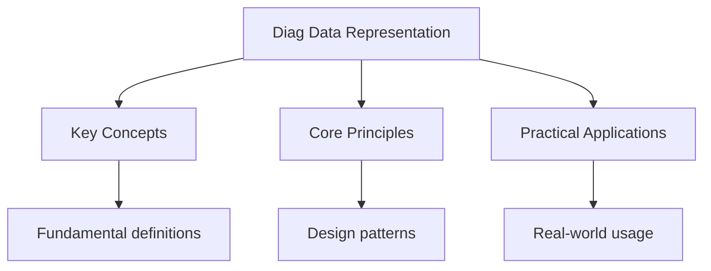

<!-- Breadcrumb Schema for SEO -->
<script type="application/ld+json">
{
  "@context": "https://schema.org",
  "@type": "BreadcrumbList",
  "itemListElement": [{"name": "Home", "url": "https://wyattau.com"}, {"name": "dse", "url": "https://dse.wyattau.com"}, {"name": "Ict", "url": "https://dse.wyattau.com/ict"}, {"name": "Diagnostics", "url": "https://dse.wyattau.com/ict/diagnostics"}, {"name": "Diag Data Representation", "url": "https://dse.wyattau.com/ict/diagnostics/diag-data-representation"}]
}
</script>

## Data Representation — Diagnostic Tests

## Unit Tests

### UT-1: Number Systems Conversion

**Question:** (a) Convert $(\text{FA3})_{16}$ to binary and decimal. (b) Convert $(-42)_{10}$ to
8-bit two"s complement binary. (c) Perform binary subtraction $11010110 - 01101011$ using two's
complement. (d) Explain why two's complement is preferred over sign-and-magnitude for representing
negative numbers.

**Solution:**

(a) $(\text{FA3})_{16}$: F $= 15 = 1111_2$A $= 10 = 1010_2$3 $= 0011_2$. Binary: $111110100011_2$.

Decimal: $15 \times 256 + 10 \times 16 + 3 = 3840 + 160 + 3 = 4003$.

(b) $42_{10} = 00101010_2$. Invert: $11010101_2$. Add 1: $11010110_2$.

So $(-42)_{10}$ in 8-bit two's complement $= 11010110_2$.

(c) Subtracting: $11010110 - 01101011$.

Two's complement of $01101011$: invert $= 10010100$Add 1 $= 10010101$.

$11010110 + 10010101 = 101101011_2$. The 9th bit (carry) is discarded in 8-bit arithmetic. Result
$= 01101011_2 = 107_{10}$.

Verification: $214 - 107 = 107$. Correct.

(d) Two's complement advantages: (1) Only one representation of zero (sign-and-magnitude has +0 and
-0). (2) Addition and subtraction use the same hardware circuit -- no special logic for negative
numbers. (3) The most significant bit indicates the sign (0 $=$ positive, 1 $=$ negative). (4) The
range of positive and negative numbers is symmetric (e.g., $-128$ to $+127$ in 8-bit), making
efficient use of all bit patterns.

### UT-2: Character Encoding

**Question:** (a) Explain the difference between ASCII and Unicode. (b) The string "Hi!" is stored
in UTF-8 encoding. Calculate the number of bytes required. (c) A file contains 500 characters of
English text. Calculate the file size in bytes if stored in: ASCII, UTF-8, and UTF-16. (d) Explain
why UTF-8 is the dominant encoding on the web.

**Solution:**

(a) **ASCII:** Uses 7 bits (extended to 8 bits) per character, encoding 128 (or 256) characters --
sufficient for English and basic symbols. Cannot represent Chinese, Japanese, Korean, Arabic, or
emoji.

**Unicode:** A universal character set that assigns a unique code point to every character in every
language (over 149,000 characters). Unicode is the standard; UTF-8, UTF-16, and UTF-32 are encoding
schemes that implement Unicode.

(b) "Hi!":

- H: code point 72 (U+0048), fits in 1 byte UTF-8: 01001000.
- i: code point 105 (U+0069), fits in 1 byte UTF-8: 01101001.
- !: code point 33 (U+0021), fits in 1 byte UTF-8: 00100001.

Total: **3 bytes** (all characters are in the ASCII range, so UTF-8 uses 1 byte each).

(c) ASCII: $500 \times 1 = 500$ bytes. UTF-8: $500 \times 1 = 500$ bytes (English characters use 1
byte). UTF-16: $500 \times 2 = 1000$ bytes (UTF-16 uses 2 bytes per character for the Basic
Multilingual Plane).

(d) UTF-8 is dominant because: (1) It is backward compatible with ASCII -- any valid ASCII file is
also valid UTF-8. (2) It is variable-length: common ASCII characters use 1 byte (efficient for
English), while less common characters use 2--4 bytes. (3) It handles the full Unicode character
set. (4) It is self-synchronising: any byte can identify whether it is a single-byte character, the
start of a multi-byte character, or a continuation byte, enabling robust error recovery.

### UT-3: Image and Audio Representation

**Question:** (a) A 24-bit colour image has a resolution of $1920 \times 1080$ pixels. Calculate the
file size in MB (before compression). (b) The image is compressed using JPEG with a compression
ratio of 10:1. Calculate the compressed file size. (c) Explain why JPEG uses lossy compression and
when this is acceptable. (d) Calculate the file size of a 3-minute stereo audio recording at a
sample rate of 44.1 kHz with 16-bit depth (uncompressed).

**Solution:**

(a) File size
$= 1920 \times 1080 \times 24 \text{ bits} = 1920 \times 1080 \times 3 \text{ bytes} = 6,220,800 \text{ bytes} \approx 5.93$
MB.

(b) Compressed size $= 5.93 / 10 \approx 0.593$ MB $\approx 593$ KB.

(c) JPEG uses lossy compression because: (1) Images contain more colour information than the human
eye can perceive. JPEG exploits this by discarding high-frequency detail that is less perceptible.
(2) The compression ratios achievable (10:1 to 20:1) are far greater than lossless methods ( 2:1).
(3) For photographs and natural images, the quality loss is barely noticeable at moderate
compression levels.

Lossy compression is acceptable for: photographs, web images, social media. It is NOT acceptable
for: medical imaging, technical drawings, screenshots with text, or any situation where exact pixel
reproduction is required.

(d) File size
$= \text{sample rate} \times \text{bit depth} \times \text{channels} \times \text{duration}$.

$= 44,100 \times 16 \times 2 \times (3 \times 60) = 44,100 \times 16 \times 2 \times 180 = 254,016,000 \text{ bits}$.

$= 254,016,000 / 8 = 31,752,000 \text{ bytes} \approx 30.27$ MB.

---

<!-- Breadcrumb Schema for SEO -->
<script type="application/ld+json">
{
  "@context": "https://schema.org",
  "@type": "BreadcrumbList",
  "itemListElement": [{"name": "Home", "url": "https://wyattau.com"}, {"name": "dse", "url": "https://dse.wyattau.com"}, {"name": "Ict", "url": "https://dse.wyattau.com/ict"}, {"name": "Diagnostics", "url": "https://dse.wyattau.com/ict/diagnostics"}, {"name": "Diag Data Representation", "url": "https://dse.wyattau.com/ict/diagnostics/diag-data-representation"}]
}
</script>




## Intuition

**A universal translator:** Data representation is like translating between languages — the same number 42 can be written as 101010 in binary, 52 in octal, or 2A in hexadecimal. Two's complement lets computers do subtraction by adding.

**Why it matters:** Every piece of data — text, images, sound — must be encoded as bits. Understanding encoding explains file sizes, compression limits, and why some characters need special handling.

**The key insight:** Binary is just another way to count — the same arithmetic you use daily works in base 2, base 16, or any base.

## Integration Tests

### IT-1: Binary Arithmetic and Logic (with Computer Systems)

**Question:** (a) Perform the binary addition $10110011 + 01101101$ and identify if overflow occurs
(assuming 8-bit two's complement). (b) Explain how the CPU's ALU performs this addition using logic
gates (half adder / full adder). (c) A CPU uses 32-bit addresses. Calculate the maximum addressable
memory. If the system has 8 GB of RAM installed, explain why not all addresses may be usable.

**Solution:**

(a) $10110011 + 01101101$:

```
  10110011
+ 01101101
----------
 100100000
```

Result in 8 bits: $00100000 = 32_{10}$.

Carry out of the MSB $= 1$ (indicates overflow in unsigned). For signed:
$10110011 = -77$, $01101101 = 109$. Sum $= 32$. No signed overflow because a negative plus positive
cannot exceed the range.

(b) The ALU uses full adders chained together. Each full adder takes three inputs (two bits to add
and a carry-in) and produces a sum bit and carry-out. For an 8-bit addition, 8 full adders are
connected: the carry-out of each stage feeds into the carry-in of the next. Each full adder can be
built from two half adders and an OR gate, and each half adder uses an XOR gate (for sum) and AND
gate (for carry).

(c) Maximum addressable memory $= 2^{32} = 4,294,967,296$ bytes $= 4$ GB.

If 8 GB is installed, the system uses physical address extension (PAE) or operates in 64-bit mode to
access beyond 4 GB. In a 32-bit system without PAE, only 4 GB is addressable. Additionally, some
address space is reserved for memory-mapped I/O (GPU VRAM, BIOS, peripheral controllers), so usable
RAM is less than 4 GB even if 4 GB is installed.

### IT-2: Data Compression and Networking (with Internet and Data Communications)

**Question:** A video file is 500 MB uncompressed. (a) If compressed to 50 MB using H.264, what is
the compression ratio? (b) The compressed video is streamed over a network with bandwidth of 10
Mbps. Calculate the streaming time. (c) Explain why video compression is lossy and how inter-frame
compression (P-frames and B-frames) achieves higher ratios than intra-frame compression. (d) How
does packet loss during streaming affect the video quality differently than file download?

**Solution:**

(a) Compression ratio $= 500 / 50 = 10:1$.

(b) Streaming time $= \frac{50 \times 8}{10} = 40$ seconds (assuming the entire file must be
transferred; in practice, streaming begins before the full download completes).

(c) Video compression is lossy because video contains massive amounts of redundant data that the
human eye cannot perceive. **Inter-frame compression** exploits temporal redundancy: most frames are
very similar to the previous one (background stays still, only moving objects change). P-frames
(predicted) store only the _differences_ from the previous frame. B-frames (bi-directional)
reference both previous and future frames. This is far more efficient than intra-frame compression
(like JPEG on each frame), which only exploits spatial redundancy within a single frame.

(d) **Streaming:** Packet loss causes immediate visible artifacts (frozen frames, pixelation,
stuttering) because frames must be displayed in real-time. Missing data cannot be retransmitted in
time. The decoder may skip damaged frames or display the previous frame until data resumes.

**File download:** Lost packets are automatically retransmitted by TCP. The download takes slightly
longer but the final file is bit-perfect. No quality degradation occurs.

### IT-3: Data Representation and Security (with Network Security)

**Question:** (a) Explain how hashing is used for data integrity verification. (b) A file has the
SHA-256 hash value `e3b0c44298fc1c149afbf4c8996fb92427ae41e4649b934ca495991b7852b855`. If a single
bit of the file is changed, what happens to the hash? (c) Explain why hashing is used for password
storage instead of encryption. (d) Calculate how many possible hash values exist in SHA-256 and
explain the concept of a hash collision.

**Solution:**

(a) A hash function takes input data of any size and produces a fixed-length output (the hash or
digest). For integrity verification: the sender computes the hash of a file and sends both the file
and hash. The receiver re-computes the hash on the received file and compares it to the sent hash.
If they match, the file was not altered during transmission. Even a 1-bit change produces a
completely different hash (avalanche effect).

(b) Changing a single bit produces a completely different hash value. This is the **avalanche
effect**: a small change in input causes a large, unpredictable change in output. The new hash would
share no resemblance to the original.

(c) Hashing is preferred for passwords because: (1) Hashing is one-way -- given a hash, you cannot
reverse it to find the original password (unlike encryption, which is reversible with a key). (2)
Even if the password database is compromised, attackers only see hashes, not plaintext passwords.
(3) Salting (adding random data before hashing) prevents rainbow table attacks. (4) The system does
not need to know the actual password -- it only needs to verify that the hash of the entered
password matches the stored hash.

(d) SHA-256 produces a 256-bit hash. Number of possible values
$= 2^{256} \approx 1.16 \times 10^{77}$.

A **hash collision** occurs when two different inputs produce the same hash value. By the pigeonhole
principle, collisions must exist (infinite possible inputs mapped to $2^{256}$ outputs). However,
finding a collision is computationally infeasible -- the birthday attack would require approximately
$2^{128}$ attempts, which is practically impossible with current computing power. SHA-256 is
designed to be collision-resistant.

## Common Mistakes

**Confusing two's complement with sign-and-magnitude:** Two's complement inverts bits and adds 1 for negatives. Sign-and-magnitude uses the MSB as a sign bit. Two's complement is preferred because it simplifies arithmetic operations.

**Forgetting to check bit limits in number conversions:** When converting between number systems, always verify the result fits within the specified bit width. Overflow occurs when results exceed the available bits.

**Mixing up lossy and lossless compression:** Lossy compression (JPEG, MP3) permanently discards data. Lossless compression (ZIP, PNG) preserves all original data. Lossy is irreversible; lossless is reversible.

## Cross-References

- **[Data Representation](../1-data-representation/1_data-representation):** Data is fundamental to ICT
- **[Computer Systems](diag-computer-systems):** Systems process data
- **[Programming](diag-programming-databases):** Programming manipulates data
