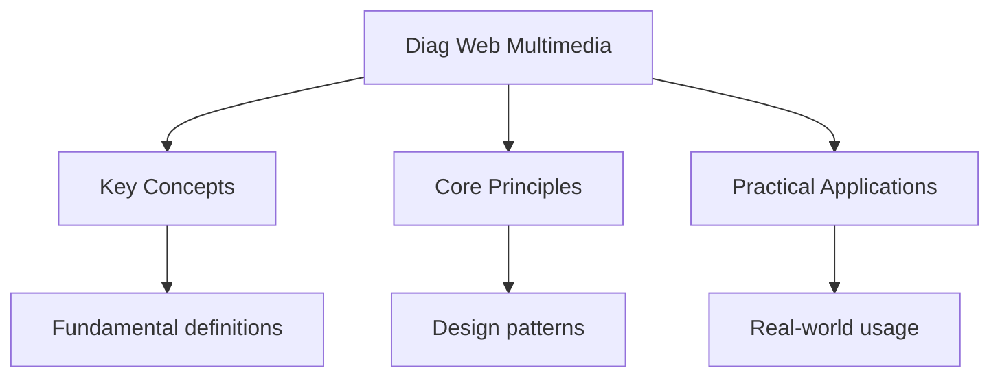

---

date: 2026-07-23T21:57:32+01:00
title: "Web Development and Multimedia -- Diagnostic Tests"
description: "DSE Ict Web Development and Multimedia -- Diagnostic Tests notes covering key definitions, core concepts, worked examples, and practice questions for revision."
tableOfContents: false
---

<!-- Breadcrumb Schema for SEO -->
<script type="application/ld+json">
{
  "@context": "https://schema.org",
  "@type": "BreadcrumbList",
  "itemListElement": [{"name": "Home", "url": "https://wyattau.com"}, {"name": "dse", "url": "https://dse.wyattau.com"}, {"name": "Ict", "url": "https://dse.wyattau.com/ict"}, {"name": "Diagnostics", "url": "https://dse.wyattau.com/ict/diagnostics"}, {"name": "Diag Web Multimedia", "url": "https://dse.wyattau.com/ict/diagnostics/diag-web-multimedia"}]
}
</script>

## Web Development and Multimedia — Diagnostic Tests

## Unit Tests

### UT-1: HTML and CSS Fundamentals

**Question:** (a) Write HTML code for a simple webpage with a heading "Student Portal", a navigation
bar with three links (Home, Grades, Schedule), and a paragraph of text. (b) Write CSS to: centre the
heading, make the navigation bar horizontal with a dark background and white text, and set the
paragraph font to 16px Arial. (c) Explain the CSS box model and the difference between margin and
padding. (d) Explain the difference between block-level and inline elements, giving two examples of
each.

**Solution:**

(a)

```html
<!DOCTYPE html>
<html>
  <head>
    <title>Student Portal</title>
    <link rel="stylesheet" href="style.css" />
  </head>
  <body>
    <h1>Student Portal</h1>
    <nav>
      <ul>
        <li><a href="https://example.com/home.html">Home</a></li>
        <li><a href="https://example.com/grades.html">Grades</a></li>
        <li><a href="https://example.com/schedule.html">Schedule</a></li>
      </ul>
    </nav>
    <p>Welcome to the online student portal. Check your grades and schedule here.</p>
  </body>
</html>
```

(b)

```css
h1 {
  text-align: center;
}
nav ul {
  list-style: none;
  background-color: #333;
  padding: 0;
  margin: 0;
  overflow: hidden;
}
nav ul li {
  display: inline-block;
}
nav ul li a {
  display: block;
  color: white;
  text-decoration: none;
  padding: 14px 20px;
}
p {
  font-family: Arial, sans-serif;
  font-size: 16px;
}
```

(c) The **CSS box model** describes the rectangular boxes generated for elements. Each box has four
areas from inside out: **content** (text, images), **padding** (space between content and border),
**border** (around the padding), and **margin** (space between the border and adjacent elements).

**Padding** is inside the border -- it creates space between the element"s content and its border.
**Margin** is outside the border -- it creates space between the element's border and neighbouring
elements. Increasing padding makes the element larger; increasing margin pushes other elements away.

(d) **Block-level elements** occupy the full width available and start on a new line. Examples:
`<p>``<div>``<h1>`--`<h6>``<ul>``<section>`.

**Inline elements** only occupy as much width as necessary and do not start a new line. Examples:
`<span>``<a>``<strong>``<em>```.

### UT-2: Multimedia File Formats

**Question:** (a) Compare JPEG, PNG, and GIF in terms of: compression type, colour support,
transparency, and typical use cases. (b) A website needs a company logo. Which format is most
appropriate and why? (c) Explain the difference between lossy and lossless compression with
examples. (d) Calculate the approximate file size of a 10-second audio clip at CD quality (44.1 kHz,
16-bit, stereo) before and after MP3 compression at 128 kbps.

**Solution:**

| (a)          | Feature               | JPEG                                   | PNG                                    | GIF |
| ------------ | --------------------- | -------------------------------------- | -------------------------------------- | --- |
| Compression  | Lossy                 | Lossless                               | Lossless (limited)                     |
| Colour depth | 16.7 million (24-bit) | Up to 16.7 million (24-bit) or 48-bit  | 256 colours (8-bit)                    |
| Transparency | No                    | Yes (alpha channel)                    | Yes (1-bit, on/off)                    |
| Animation    | No                    | No                                     | Yes (simple frame animation)           |
| Best for     | Photographs           | Graphics with text, logos, screenshots | Simple animations, low-colour graphics |

(b) **PNG** is most appropriate because: (1) Logos have flat areas of colour and sharp edges -- PNG
handles these perfectly with lossless compression. (2) Logos often need transparency (to be placed
on different backgrounds) -- PNG supports full alpha channel transparency. (3) JPEG would introduce
compression artefacts around text and sharp edges. (4) GIF is limited to 256 colours, which may be
insufficient for complex logos.

(c) **Lossy compression** permanently discards data to achieve smaller file sizes. The original
cannot be perfectly reconstructed. Example: JPEG, MP3, H.264 video.

**Lossless compression** reduces file size without losing any data. The original is perfectly
reconstructed. Example: PNG, FLAC audio, ZIP files.

(d) Uncompressed: $44,100 \times 16 \times 2 \times 10 = 14,112,000$ bits $= 1,764,000$ bytes
$\approx 1.68$ MB.

MP3 at 128 kbps: $128,000 \times 10 / 8 = 160,000$ bytes $\approx 156$ KB.

Compression ratio $\approx 1.68 \text{ MB} / 0.156 \text{ MB} \approx 10.8:1$.

### UT-3: Web Design Principles

**Question:** (a) Describe four principles of good web design. (b) Explain the difference between
responsive web design and adaptive web design. (c) Explain the purpose of wireframes and prototypes
in the web development process. (d) Describe three ways to improve website accessibility.

**Solution:**

(a) Four principles:

1. **Consistency:** Use the same colours, fonts, button styles, and layout patterns throughout the
   site. This reduces cognitive load and builds trust.
2. **Visual hierarchy:** Use size, colour, contrast, and positioning to guide the user's eye to the
   most important content first (e.g., large headings, prominent call-to-action buttons).
3. **Simplicity:** Avoid clutter, excessive animations, or unnecessary elements. Every element
   should serve a purpose. White space improves readability.
4. **Navigation:** Provide clear, intuitive navigation. Users should always know where they are and
   how to get to where they want to go. Use standard conventions (logo links to homepage).

(b) **Responsive design:** Uses CSS media queries and flexible grids/images to automatically adjust
the layout based on the screen size. The same HTML is delivered to all devices, and CSS handles the
adaptation. The layout "flows" and reorganises fluidly.

**Adaptive design:** Detects the device type and loads a specific layout designed for that device.
Multiple fixed layouts are created (e.g., one for mobile, one for tablet, one for desktop), and the
server delivers the appropriate one.

(c) **Wireframes:** Low-fidelity visual guides that show the layout structure (placement of
navigation, content areas, images, buttons) without detailed design. Used early in the design
process to plan the user experience and get stakeholder agreement before investing in visual design.

**Prototypes:** Higher-fidelity, interactive mockups that simulate user interaction (clicking
buttons, navigating pages). Used to test usability with real users before development begins,
catching UX problems early when they are cheap to fix.

(d) Three accessibility improvements: (1) **Alt text for images:** Provide descriptive alternative
text for all images so screen readers can describe them to visually impaired users. (2) **Keyboard
navigation:** Ensure all interactive elements (links, buttons, forms) are accessible via keyboard
(Tab, Enter, Escape) without requiring a mouse. (3) **Colour contrast:** Ensure text has sufficient
contrast against backgrounds (WCAG recommends 4.5:1 for normal text) so colour-blind and visually
impaired users can read content.

---

<!-- Breadcrumb Schema for SEO -->
<script type="application/ld+json">
{
  "@context": "https://schema.org",
  "@type": "BreadcrumbList",
  "itemListElement": [{"name": "Home", "url": "https://wyattau.com"}, {"name": "dse", "url": "https://dse.wyattau.com"}, {"name": "Ict", "url": "https://dse.wyattau.com/ict"}, {"name": "Diagnostics", "url": "https://dse.wyattau.com/ict/diagnostics"}, {"name": "Diag Web Multimedia", "url": "https://dse.wyattau.com/ict/diagnostics/diag-web-multimedia"}]
}
</script>




## Intuition

**A digital canvas:** Web development is like building with digital LEGO — HTML provides the structure, CSS adds the style, and JavaScript brings it to life. The box model is the invisible frame around every element.

**Why it matters:** The web is the world's most accessible platform. Understanding HTML/CSS lets you create content anyone can view, and multimedia makes it engaging.

**The key insight:** Block elements stack vertically and inline elements flow horizontally — knowing which is which prevents layout headaches.

## Integration Tests

### IT-1: Full-Stack Web Application (with Computer Systems)

**Question:** A school wants to build an online assignment submission system. (a) Describe the
client-server architecture for this system, identifying the technologies at each tier. (b) Explain
how the system handles file upload: what happens at the client side, during transmission, and at the
server side. (c) The system stores submitted files on the server. Calculate the storage needed if
1000 students each submit 5 assignments averaging 2 MB per file, and the server retains files for 3
academic years. (d) Explain how the system ensures file integrity during upload.

**Solution:**

(a) **Three-tier architecture:**

- **Presentation tier (client):** HTML/CSS/JavaScript running in the browser. The user interface for
  selecting files, viewing submissions, and receiving feedback.
- **Application tier (server):** Server-side language (e.g., PHP, Python/Flask, Node.js) processes
  requests, handles authentication, validates submissions, manages the database.
- **Data tier:** Database (e.g., MySQL) stores metadata (student ID, assignment ID, timestamp, file
  path, grade). File system stores the actual submitted files.

(b) **Client side:** The browser's HTML file input allows the user to select a file. JavaScript may
validate the file type and size before uploading. The file is encoded using `multipart/form-data`
and sent via HTTP POST.

**During transmission:** The file is transmitted over HTTPS (TLS encryption) to protect against
eavesdropping. TCP ensures reliable delivery (retransmission of lost packets).

**Server side:** The web server receives the file, the application validates it (file type, size,
virus scan), generates a unique filename (to prevent overwrites), saves it to the file system, and
records the metadata in the database.

(c) Files per year: $1000 \times 5 = 5000$ files. Size per year:
$5000 \times 2 \text{ MB} = 10,000 \text{ MB} \approx 10$ GB. For 3 years: $30$ GB. With overhead
(metadata, file system overhead): approximately **35--40 GB** of storage needed.

(d) **File integrity during upload:**

1. **HTTPS/TLS:** Encrypts data in transit, preventing tampering.
2. **TCP checksums:** The transport layer verifies each packet's integrity. Corrupted packets are
   retransmitted.
3. **File hash:** After upload, the server computes a hash (e.g., SHA-256) of the received file and
   can compare it with a hash sent by the client to verify the file was not corrupted during
   transmission.
4. **Content validation:** The server checks that the file header matches the expected format (e.g.,
   PDF magic bytes), preventing corrupted or disguised files.

### IT-2: Multimedia Integration (with Data Representation)

**Question:** A school website needs to include: a welcome video (2 minutes, 720p), a campus photo
gallery (50 photos, 4000 $\times$ 3000 pixels each), and background music on the homepage. (a)
Calculate the total uncompressed size of all media assets. (b) Recommend appropriate compressed
formats and estimate the compressed sizes. (c) Explain how lazy loading improves page load
performance for the photo gallery. (d) Describe how adaptive bitrate streaming (e.g., HLS) works for
the video.

**Solution:**

(a) **Video (720p, 30fps, 24-bit colour, uncompressed):**
$1280 \times 720 \times 3 \times 30 \times 120 = 9,953,280,000$ bytes $\approx 9.27$ GB.

**Photos:** $50 \times 4000 \times 3000 \times 3 = 1,800,000,000$ bytes $\approx 1.68$ GB.

**Audio (44.1 kHz, 16-bit, stereo, 30 seconds for background):**
$44,100 \times 16 \times 2 \times 30 = 42,336,000$ bytes $\approx 40.4$ MB.

Total uncompressed: $\approx 9.27 + 1.68 + 0.04 = 10.99$ GB.

(b) **Video:** H.264 at 5 Mbps: $5 \times 10^6 \times 120 / 8 = 75$ MB. Or H.265 at lower bitrate:
$\approx 40$ MB.

**Photos:** JPEG at 10:1 compression: $1.68 \text{ GB} / 10 \approx 168$ MB. Displayed at web
resolution (800 $\times$ 600), each thumbnail $\approx 50$ KB, full view $\approx 200$ KB. Total
web-optimised: $50 \times 200 \text{ KB} = 10$ MB.

**Audio:** MP3 at 128 kbps for 30 seconds: $128,000 \times 30 / 8 = 480$ KB. Or as a short
background loop, even smaller.

Total compressed: $\approx 75 + 10 + 0.5 = 85.5$ MB (vs 11 GB uncompressed -- a 128:1 reduction).

(c) **Lazy loading:** Images are not loaded until they are about to enter the viewport (the visible
area of the browser). As the user scrolls down the gallery, each image is fetched just before it
becomes visible. This reduces the initial page load time dramatically -- instead of loading all 50
images (10 MB), only the first 5--10 visible images load initially. Implementation:
`` or JavaScript Intersection
Observer API.

(d) **Adaptive bitrate streaming (HLS):** The video is encoded at multiple quality levels (e.g.,
360p, 480p, 720p, 1080p) and divided into small segments (2--10 seconds each). The player monitors
the user's network bandwidth and device capabilities. If bandwidth is high, it requests high-quality
segments. If bandwidth drops (e.g., user moves to a weaker Wi-Fi area), it automatically switches to
lower-quality segments without interrupting playback. This ensures smooth playback across varying
network conditions.

### IT-3: Web Security (with Network Security)

**Question:** A student builds a login page for a school project. (a) Describe three common web
vulnerabilities (XSS, SQL injection, CSRF) and how to prevent each. (b) Explain the purpose of HTTPS
and how SSL/TLS certificates work. (c) The login form sends passwords as plaintext over HTTP.
Explain the security risk and describe how hashing on the client side (before transmission) could
help (and its limitations). (d) Explain how Content Security Policy (CSP) headers improve web
security.

**Solution:**

(a) **XSS (Cross-Site Scripting):** Attackers inject malicious JavaScript into web pages viewed by
other users. Prevention: (1) Sanitise and escape all user input before rendering. (2) Use
`textContent` instead of `innerHTML` in JavaScript. (3) Set HTTP-only cookies so JavaScript cannot
access session tokens.

**SQL Injection:** Attackers inject SQL commands through input fields to manipulate or extract
database data. Prevention: (1) Use parameterised queries (prepared statements) instead of string
concatenation. (2) Validate and sanitise all input. (3) Apply the principle of least privilege to
database accounts.

**CSRF (Cross-Site Request Forgery):** Attackers trick authenticated users into submitting requests
to a web application where they are already logged in. Prevention: (1) Use anti-CSRF tokens (unique,
unpredictable tokens embedded in forms). (2) Check the `Origin` and `Referer` headers. (3) Require
re-authentication for sensitive actions.

(b) **HTTPS** encrypts all communication between the browser and server using TLS (Transport Layer
Security), preventing eavesdropping and tampering.

**SSL/TLS certificates:** A trusted Certificate Authority (CA) verifies the server's identity and
issues a digital certificate binding the domain name to the server's public key. When a browser
connects: (1) The server presents its certificate. (2) The browser verifies the certificate against
trusted CAs. (3) The browser and server negotiate encryption parameters and establish a secure
session using asymmetric encryption (to exchange a symmetric session key) followed by symmetric
encryption (for data transfer).

(c) **Risk:** Plaintext passwords over HTTP can be intercepted by anyone on the same network (packet
sniffing), Wi-Fi eavesdroppers, or compromised routers.

**Client-side hashing:** Hashing the password with JavaScript before sending means the server
receives (and stores) only the hash, not the plaintext. If intercepted, the attacker gets the hash
but not the password. However, the hash itself becomes the password -- an attacker who captures the
hash can replay it to log in (pass-the-hash attack). This is why HTTPS is essential: it prevents
interception entirely rather than just obscuring the password.

(d) **Content Security Policy (CSP):** HTTP headers that tell the browser which sources of content
are allowed to be loaded. For example,
`Content-Security-Policy: default-src 'self'; script-src 'self' https://trusted-cdn.com` prevents:
(1) Execution of inline scripts (blocking XSS attacks). (2) Loading scripts from unauthorised
external domains. (3) Loading resources (images, styles, fonts) from untrusted sources. CSP provides
 defence in depth against XSS even if input sanitisation fails.

## Common Mistakes

**Confusing HTML structure with CSS presentation:** HTML defines content structure (headings, paragraphs). CSS defines appearance (colours, layout). Don't use HTML tags for styling when CSS exists.

**Forgetting that responsive design requires viewport meta tag:** Without `<meta name="viewport" content="width=device-width, initial-scale=1">`, mobile devices render pages at desktop width and zoom out.

**Mixing up lossy and lossless image formats:** JPEG is lossy (compression degrades quality). PNG is lossless (preserves all data). Use JPEG for photos, PNG for graphics requiring transparency or sharp edges.

## See Also

- [Diagnostics](./)
- [Computer Systems -- Diagnostic Tests](./diag-computer-systems)
- [Data Representation -- Diagnostic Tests](./diag-data-representation)
