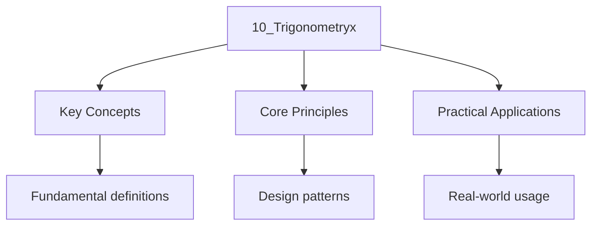

---

title: "Trigonometry | DSE - Wyatt's Notes"
description: "Trigonometry is the study of relationships involving lengths and angles of triangles. It is a Central topic in the DSE Mathematics compulsory syllabus,"
date: 2025-06-03T16:22:00.000Z
tags:
  - Maths
  - DSE
categories:
  - Maths

---

import DesmosGraph from "@components/DesmosGraph";

Trigonometry is the study of relationships involving lengths and angles of triangles. It is a
Central topic in the DSE Mathematics compulsory syllabus, connecting
[coordinate geometry](8_geometries)) with algebraic techniques and serving as a foundation for Many
applied problems in two and three dimensions.

## Angles and Arcs

### Degrees and Radians

Angles can be measured in degrees or radians. A full revolution is $360^\circ$ or $2\pi$ radians,
Giving the fundamental conversion:

$$
\begin\{aligned\}
 180^\circ = \pi \mathrm\{ rad\}
\end\{aligned\}
$$

To convert between the two units:

$$
\begin\{aligned\}
 \theta_\{\mathrm\{rad\}\} &= \theta_\{\mathrm\{deg\}\} \times \frac\{\pi\}\{180\} \\[4pt]
 \theta_\{\mathrm\{deg\}\} &= \theta_\{\mathrm\{rad\}\} \times \frac\{180\}\{\pi\}
\end\{aligned\}
$$

The radian measure of a positive angle is the ratio of the arc length to the radius. Radians are a
Dimensionless quantity and are the default unit in calculus and many advanced applications.

Common angle equivalences:

| Degrees | $0^\circ$ | $30^\circ$      | $45^\circ$      | $60^\circ$      | $90^\circ$      | $120^\circ$      | $180^\circ$ | $270^\circ$      | $360^\circ$ |
| ------- | --------- | --------------- | --------------- | --------------- | --------------- | ---------------- | ----------- | ---------------- | ----------- |
| Radians | $0$       | $\frac{\pi}{6}$ | $\frac{\pi}{4}$ | $\frac{\pi}{3}$ | $\frac{\pi}{2}$ | $\frac{2\pi}{3}$ | $\pi$       | $\frac{3\pi}{2}$ | $2\pi$      |

Examples

- Convert $150^\circ$ to radians: $150 \times \frac{\pi}{180} = \frac{5\pi}{6}$ rad
- Convert $\frac{7\pi}{4}$ rad to degrees: $\frac{7\pi}{4} \times \frac{180}{\pi} = 315^\circ$
- Convert $1.2$ rad to degrees: $1.2 \times \frac{180}{\pi} \approx 68.75^\circ$

### Arc Length

For an arc subtending an angle $\theta$ (in radians) at the centre of a circle of radius $r$:

$$
\begin\{aligned\}
 l = r\theta
\end\{aligned\}
$$

This formula only applies when $\theta$ is in radians. If the angle is given in degrees, convert to
Radians first. This formula is also covered in the context of
[circles and sectors](8_geometries.md#arcs-and-sectors).

### Area of a Sector

For a sector of a circle of radius $r$ with central angle $\theta$ (in radians):

$$
\begin\{aligned\}
 A = \frac\{1\}\{2\}r^2\theta
\end\{aligned\}
$$

The area of a segment (the region between a chord and its arc) is:

$$
\begin\{aligned\}
 \mathrm\{Area of segment\} = \frac\{1\}\{2\}r^2(\theta - \sin\theta)
\end\{aligned\}
$$

Examples

- A circle of radius $5$ cm has a sector with angle $\frac{3\pi}{4}$. Arc length $= 5 \times \frac{3\pi}{4} = \frac{15\pi}{4} \approx 11.78$ cm. Area $= \frac{1}{2}(25)\left(\frac{3\pi}{4}\right) = \frac{75\pi}{8} \approx 29.45$ cm$^2$.
- Find the radius of a circle given that a sector of angle $2.5$ rad has area $20$ cm$^2$: $\frac{1}{2}r^2(2.5) = 20 \implies r^2 = 16 \implies r = 4$ cm.
- A chord of length $6$ cm subtends an angle of $\frac{\pi}{3}$ at the centre. Find the area of the segment: $r = \frac{3}{\sin(\pi/6)} = 6$ cm. Area $= \frac{1}{2}(36)\left(\frac{\pi}{3} - \sin\frac{\pi}{3}\right) = 18\left(\frac{\pi}{3} - \frac{\sqrt{3}}{2}\right) = 6\pi - 9\sqrt{3} \approx 3.26$ cm$^2$.

## Trigonometric Ratios

### Definitions in Right-Angled Triangles

For a right-angled triangle with an acute angle $\theta$Label the sides relative to $\theta$:

- **Opposite** (O): the side opposite to angle $\theta$
- **Adjacent** (A): the side adjacent to $\theta$ (other than the hypotenuse)
- **Hypotenuse** (H): the longest side, opposite the right angle

The three primary trigonometric ratios are:

$$
\begin\{aligned\}
 \sin\theta &= \frac\{\mathrm\{Opposite\}\}\{\mathrm\{Hypotenuse\}\} = \frac\{O\}\{H\} \\[4pt]
 \cos\theta &= \frac\{\mathrm\{Adjacent\}\}\{\mathrm\{Hypotenuse\}\} = \frac\{A\}\{H\} \\[4pt]
 \tan\theta &= \frac\{\mathrm\{Opposite\}\}\{\mathrm\{Adjacent\}\} = \frac\{O\}\{A\}
\end\{aligned\}
$$

The mnemonic **SOH CAH TOA** helps recall these definitions.

### Reciprocal Ratios

The three reciprocal trigonometric ratios are:

$$
\begin\{aligned\}
 \csc\theta &= \frac\{1\}\{\sin\theta\} = \frac\{H\}\{O\} \\[4pt]
 \sec\theta &= \frac\{1\}\{\cos\theta\} = \frac\{H\}\{A\} \\[4pt]
 \cot\theta &= \frac\{1\}\{\tan\theta\} = \frac\{A\}\{O\}
\end\{aligned\}
$$

Examples

- In a right-angled triangle, if the hypotenuse is $13$ and one leg is $5$ Then $\sin\theta = \frac{5}{13}$$\cos\theta = \frac{12}{13}$$\tan\theta = \frac{5}{12}$.
- Given $\tan\theta = 3$ and $\theta$ is acute: construct a triangle with opposite $= 3$Adjacent $= 1$Hypotenuse $= \sqrt{10}$. Then $\sin\theta = \frac{3}{\sqrt{10}}$ and $\cos\theta = \frac{1}{\sqrt{10}}$.
- If $\sec\theta = \frac{5}{3}$ and $\theta$ is in the first quadrant, then $\cos\theta = \frac{3}{5}$$\sin\theta = \frac{4}{5}$ And $\tan\theta = \frac{4}{3}$.

## Trigonometric Identities

### Pythagorean Identity

For any angle $\theta$:

$$
\begin\{aligned\}
 \sin^2\theta + \cos^2\theta = 1
\end\{aligned\}
$$

This follows directly from the [Pythagorean identity](#pythagorean-identity) applied to a
Right-angled triangle with hypotenuse $1$. Two useful corollaries are obtained by dividing through
By $\cos^2\theta$ or $\sin^2\theta$:

$$
\begin\{aligned\}
 1 + \tan^2\theta &= \sec^2\theta \\[4pt]
 1 + \cot^2\theta &= \csc^2\theta
\end\{aligned\}
$$

### Quotient Identity

$$
\begin\{aligned\}
 \tan\theta = \frac\{\sin\theta\}\{\cos\theta\}, \qquad \cot\theta = \frac\{\cos\theta\}\{\sin\theta\}
\end\{aligned\}
$$

These hold whenever the denominators are non-zero.

### Related Identities

Additional identities useful for simplification and solving equations:

**Double angle formulas** (extension for stronger students):

$$
\begin\{aligned\}
 \sin 2\theta &= 2\sin\theta\cos\theta \\[4pt]
 \cos 2\theta &= \cos^2\theta - \sin^2\theta = 2\cos^2\theta - 1 = 1 - 2\sin^2\theta
\end\{aligned\}
$$

**Angle sum and difference** (extension):

$$
\begin\{aligned\}
 \sin(\alpha \pm \beta) &= \sin\alpha\cos\beta \pm \cos\alpha\sin\beta \\[4pt]
 \cos(\alpha \pm \beta) &= \cos\alpha\cos\beta \mp \sin\alpha\sin\beta
\end\{aligned\}
$$

Examples

- Simplify $\frac{\sin\theta}{\tan\theta}$: Since $\tan\theta = \frac{\sin\theta}{\cos\theta}$We have $\frac{\sin\theta}{\sin\theta / \cos\theta} = \cos\theta$.
- Given $\sin\theta = \frac{3}{5}$ and $\theta$ is in the second quadrant, find $\cos\theta$ and $\tan\theta$: $\cos\theta = -\sqrt{1 - \frac{9}{25}} = -\frac{4}{5}$$\tan\theta = \frac{3/5}{-4/5} = -\frac{3}{4}$.
- Prove $\frac{1}{1 + \sin\theta} + \frac{1}{1 - \sin\theta} = 2\sec^2\theta$: LHS $= \frac{(1 - \sin\theta) + (1 + \sin\theta)}{(1 + \sin\theta)(1 - \sin\theta)} = \frac{2}{\cos^2\theta} = 2\sec^2\theta$.

## Exact Values

The exact trigonometric values for the standard angles must be memorised for the DSE examination:

| $\theta$     | $0^\circ$ ($0$) | $30^\circ$ $\left(\frac{\pi}{6}\right)$ | $45^\circ$ $\left(\frac{\pi}{4}\right)$ | $60^\circ$ $\left(\frac{\pi}{3}\right)$ | $90^\circ$ $\left(\frac{\pi}{2}\right)$ |
| ------------ | --------------- | --------------------------------------- | --------------------------------------- | --------------------------------------- | --------------------------------------- |
| $\sin\theta$ | $0$             | $\frac{1}{2}$                           | $\frac{\sqrt{2}}{2}$                    | $\frac{\sqrt{3}}{2}$                    | $1$                                     |
| $\cos\theta$ | $1$             | $\frac{\sqrt{3}}{2}$                    | $\frac{\sqrt{2}}{2}$                    | $\frac{1}{2}$                           | $0$                                     |
| $\tan\theta$ | $0$             | $\frac{1}{\sqrt{3}}$                    | $1$                                     | $\sqrt{3}$                              | undefined                               |

These values can be derived from the equilateral triangle ($30^\circ$-$60^\circ$-$90^\circ$) and the
Isosceles right-angled triangle ($45^\circ$-$45^\circ$-$90^\circ$).

Examples

- Evaluate $2\sin 30^\circ \cos 60^\circ = 2 \cdot \frac{1}{2} \cdot \frac{1}{2} = \frac{1}{2}$
- Evaluate $\sin^2 45^\circ + \cos^2 45^\circ = \frac{1}{2} + \frac{1}{2} = 1$ (confirms the Pythagorean identity)
- Evaluate $\frac{\tan 60^\circ}{\sin 30^\circ} = \frac{\sqrt{3}}{1/2} = 2\sqrt{3}$
- Simplify $\sin\frac{\pi}{3}\cos\frac{\pi}{6} + \cos\frac{\pi}{3}\sin\frac{\pi}{6} = \frac{\sqrt{3}}{2} \cdot \frac{\sqrt{3}}{2} + \frac{1}{2} \cdot \frac{1}{2} = \frac{3}{4} + \frac{1}{4} = 1$

## Graphs of Trigonometric Functions

\{/*prettier-ignore*/\}
<DesmosGraph client:only="solid-js" title="Trigonometric Functions: y = A sin(Bx + C) + D" expressions={["A\sin(Bx+C)+D", "cos(x)", "tan(x)"]} width={800} height={500}  />

Use the sliders to adjust amplitude, period, and phase shift, and observe how each parameter affects
The graph.

### $y = \sin x$

| Property       | Value                                |
| -------------- | ------------------------------------ |
| Domain         | All real $\mathbb{R}$                |
| Range          | $[-1, 1]$                            |
| Period         | $2\pi$ (or $360^\circ$)              |
| Amplitude      | $1$                                  |
| $x$-intercepts | $n\pi$$n \in \mathbb{Z}$             |
| Maximum        | $1$ at $x = \frac{\pi}{2} + 2n\pi$   |
| Minimum        | $-1$ at $x = \frac{3\pi}{2} + 2n\pi$ |

The graph is an odd function ($\sin(-x) = -\sin x$), symmetric about the origin.

### $y = \cos x$

| Property       | Value                                    |
| -------------- | ---------------------------------------- |
| Domain         | All real $\mathbb{R}$                    |
| Range          | $[-1, 1]$                                |
| Period         | $2\pi$ (or $360^\circ$)                  |
| Amplitude      | $1$                                      |
| $x$-intercepts | $\frac{\pi}{2} + n\pi$$n \in \mathbb{Z}$ |
| Maximum        | $1$ at $x = 2n\pi$                       |
| Minimum        | $-1$ at $x = \pi + 2n\pi$                |

The graph is an even function ($\cos(-x) = \cos x$), symmetric about the $y$-axis.

### $y = \tan x$

| Property       | Value                         |
| -------------- | ----------------------------- |
| Domain         | $x \neq \frac{\pi}{2} + n\pi$ |
| Range          | All real $\mathbb{R}$         |
| Period         | $\pi$ (or $180^\circ$)        |
| Amplitude      | Not defined (unbounded)       |
| $x$-intercepts | $n\pi$$n \in \mathbb{Z}$      |
| Asymptotes     | $x = \frac{\pi}{2} + n\pi$    |

The graph is an odd function ($\tan(-x) = -\tan x$). The tangent function has vertical asymptotes
Where $\cos x = 0$.

### General Transformations

For transformed trigonometric functions of the form:

$$
\begin\{aligned\}
 y &= a\sin(bx + c) + d \\
 y &= a\cos(bx + c) + d
\end\{aligned\}
$$

| Parameter            | Effect                                  |
| -------------------- | --------------------------------------- |
| $\|a\|$              |
| $\frac{2\pi}{\|b\|}$ |
| $-\frac{c}{b}$       | Phase shift (horizontal translation)    |
| $d$                  | Vertical shift (centre line at $y = d$) |

Examples

- For $y = 3\sin(2x)$: amplitude $= 3$Period $= \frac{2\pi}{2} = \pi$Range $= [-3, 3]$.
- For $y = -2\cos\left(x - \frac{\pi}{3}\right) + 1$: amplitude $= 2$Period $= 2\pi$Phase shift $= \frac{\pi}{3}$ to the right, vertical shift $= 1$ up, range $= [-1, 3]$.
- For $y = \tan\left(\frac{x}{2}\right)$: period $= \frac{\pi}{1/2} = 2\pi$Asymptotes at $x = \pi + 2n\pi$.
- State the maximum and minimum of $y = 4\sin x - 1$: maximum $= 4(1) - 1 = 3$Minimum $= 4(-1) - 1 = -5$.

## Solving Trigonometric Equations

### General Solutions

When solving $\sin\theta = k$$\cos\theta = k$Or $\tan\theta = k$The solutions repeat Periodically.
The general solutions (in degrees) are:

**For $\sin\theta = k$** (where $-1 \leq k \leq 1$), let $\alpha = \arcsin k$ be the principal value
In $[-90^\circ, 90^\circ]$:

$$
\begin\{aligned\}
 \theta = 360^\circ n + \alpha \quad \mathrm\{or\} \quad \theta = 360^\circ n + (180^\circ - \alpha), \quad n \in \mathbb\{Z\}
\end\{aligned\}
$$

**For $\cos\theta = k$** (where $-1 \leq k \leq 1$), let $\alpha = \arccos k$ be the principal value
In $[0^\circ, 180^\circ]$:

$$
\begin\{aligned\}
 \theta = 360^\circ n \pm \alpha, \quad n \in \mathbb\{Z\}
\end\{aligned\}
$$

**For $\tan\theta = k$** (for all real $k$), let $\alpha = \arctan k$ be the principal value in
$(-90^\circ, 90^\circ)$:

$$
\begin\{aligned\}
 \theta = 180^\circ n + \alpha, \quad n \in \mathbb\{Z\}
\end\{aligned\}
$$

In radians, replace $360^\circ$ with $2\pi$ and $180^\circ$ with $\pi$.

### Solving Within a Given Interval

To find all solutions within a specified interval (e.g., $0^\circ \leq \theta < 360^\circ$ or
$0 \leq \theta < 2\pi$):

1. Find the principal value $\alpha$ using the inverse trigonometric function.
2. Use the general solution formula to list all solutions in the required interval.
3. Check each candidate to ensure it falls within the given range.

### Using Identities to Simplify Equations

Many trigonometric equations require algebraic manipulation before they can be solved:

- **Factorisation**: Extract common factors, e.g.,
  $2\sin\theta\cos\theta - \sin\theta = 0 \implies \sin\theta(2\cos\theta - 1) = 0$.
- **Pythagorean substitution**: Replace $\sin^2\theta$ with $1 - \cos^2\theta$ (or vice versa) to
  obtain an equation in a single function.
- **Quotient substitution**: Replace $\tan\theta$ with $\frac{\sin\theta}{\cos\theta}$ and clear
  denominators.

Examples

- Solve $\sin\theta = \frac{1}{2}$ for $0^\circ \leq \theta < 360^\circ$: $\alpha = 30^\circ$. Solutions: $\theta = 30^\circ$ or $\theta = 180^\circ - 30^\circ = 150^\circ$.
- Solve $2\cos^2\theta - \cos\theta - 1 = 0$ for $0 \leq \theta < 2\pi$: Let $u = \cos\theta$. Then $2u^2 - u - 1 = 0 \implies (2u + 1)(u - 1) = 0$. So $\cos\theta = -\frac{1}{2}$ or $\cos\theta = 1$. Solutions: $\theta = \frac{2\pi}{3}$$\theta = \frac{4\pi}{3}$$\theta = 0$.
- Solve $\sin 2\theta = \cos\theta$ for $0^\circ \leq \theta < 360^\circ$: $2\sin\theta\cos\theta = \cos\theta \implies \cos\theta(2\sin\theta - 1) = 0$. Either $\cos\theta = 0 \implies \theta = 90^\circ, 270^\circ$Or $\sin\theta = \frac{1}{2} \implies \theta = 30^\circ, 150^\circ$. Solutions: $30^\circ, 90^\circ, 150^\circ, 270^\circ$.
- Solve $\tan^2\theta = 3$ for $0 \leq \theta < 2\pi$: $\tan\theta = \pm\sqrt{3}$. $\tan\theta = \sqrt{3} \implies \theta = \frac{\pi}{3}, \frac{4\pi}{3}$. $\tan\theta = -\sqrt{3} \implies \theta = \frac{2\pi}{3}, \frac{5\pi}{3}$.

## Applications

### Sine Rule

For any triangle $ABC$ with sides $a$$b$$c$ opposite the respective angles:

$$
\begin\{aligned\}
 \frac\{a\}\{\sin A\} = \frac\{b\}\{\sin B\} = \frac\{c\}\{\sin C\}
\end\{aligned\}
$$

The sine rule is most useful when one side-side-angle (SSA) or angle-angle-side (AAS) configuration
Is known. In the ambiguous SSA case, two distinct triangles may satisfy the given conditions (the
"ambiguous case").

### Cosine Rule

For any triangle $ABC$ with sides $a$$b$$c$ opposite the respective angles:

$$
\begin\{aligned\}
 a^2 &= b^2 + c^2 - 2bc\cos A \\[4pt]
 \cos A &= \frac\{b^2 + c^2 - a^2\}\{2bc\}
\end\{aligned\}
$$

The cosine rule generalises the Pythagorean theorem and is most useful for side-side-side (SSS) or
Side-angle-side (SAS) configurations.

### Area of a Triangle Using Trigonometry

$$
\begin\{aligned\}
 \mathrm\{Area\} = \frac\{1\}\{2\}ab\sin C = \frac\{1\}\{2\}bc\sin A = \frac\{1\}\{2\}ca\sin B
\end\{aligned\}
$$

This is derived from the standard formula
$\mathrm{Area} = \frac{1}{2} \times \mathrm{base} \times \mathrm{height}$Where the height is
Expressed using a trigonometric ratio.

### Bearings

A bearing is the angle measured clockwise from north. Key conventions:

- Bearings are always given as three-digit numbers from $000^\circ$ to $360^\circ$.
- The bearing of $B$ from $A$ is generally different from the bearing of $A$ from $B$ (they differ
  by $180^\circ$ unless the points are collinear with north).

### Angles of Elevation and Depression

- **Angle of elevation**: the angle above the horizontal from the observer to the object.
- **Angle of depression**: the angle below the horizontal from the observer to the object.

When the observer and the object are at different heights, these two angles are equal if measured
From corresponding horizontal lines (alternate angles).

### 3D Problems

Three-dimensional trigonometry problems often involve finding the angle between a line and a plane.
The standard approach:

1. Identify the relevant right-angled triangle in the 3D figure.
2. Drop a perpendicular from a point to the plane to create a right angle.
3. The angle between the line and the plane is the angle between the line and its projection onto
   the plane. If $\alpha$ is the angle between the line and the normal to the plane, then the angle
   $\phi$ between the line and the plane satisfies $\phi = 90^\circ - \alpha$.

This connects to the vector formulation described in the
[3D geometry](8_geometries.md#angles-between-lines-and-planes) section.

Examples

- In $\triangle ABC$$a = 8$$b = 6$$C = 60^\circ$. Find $c$: $c^2 = 64 + 36 - 2(6)(8)\cos 60^\circ = 100 - 48 = 52$ So $c = 2\sqrt{13}$.
- In $\triangle ABC$$a = 7$$A = 45^\circ$$B = 60^\circ$. Find $b$: $\frac{b}{\sin 60^\circ} = \frac{7}{\sin 45^\circ} \implies b = \frac{7 \cdot \frac{\sqrt{3}}{2}}{\frac{\sqrt{2}}{2}} = \frac{7\sqrt{3}}{\sqrt{2}} = \frac{7\sqrt{6}}{2}$.
- A ship sails $10$ km on a bearing of $030^\circ$ Then $8$ km on a bearing of $120^\circ$. Find the distance from the starting point: The angle between the two legs is $120^\circ - 30^\circ = 90^\circ$. Distance $= \sqrt{10^2 + 8^2} = 2\sqrt{41} \approx 12.8$ km.
- From the top of a $50$ m cliff, the angle of depression of a boat is $30^\circ$. Find the horizontal distance from the boat to the base of the cliff: $\tan 30^\circ = \frac{50}{d} \implies d = \frac{50}{\tan 30^\circ} = 50\sqrt{3} \approx 86.6$ m.
- A vertical pole $PQ$ stands on horizontal ground. Point $A$ is on the ground, $20$ m from the base $Q$. The angle of elevation of $P$ from $A$ is $35^\circ$. Find the height of the pole: $PQ = 20\tan 35^\circ \approx 14.0$ m.
- In a cuboid $ABCDEFGH$ with $AB = 4$$BC = 3$$CG = 5$Find the angle between the diagonal $AG$ and the base $ABCD$: $AG = \sqrt{16 + 9 + 25} = \sqrt{50} = 5\sqrt{2}$. The projection of $AG$ onto the base is $AC = \sqrt{16 + 9} = 5$. The angle between $AG$ and the base $= \arccos\frac{AC}{AG} = \arccos\frac{5}{5\sqrt{2}} = \arccos\frac{1}{\sqrt{2}} = 45^\circ$.

---

Wrap-up Questions

1. **Question:** Convert $210^\circ$ to radians and find the exact values of $\sin 210^\circ$
 $\cos 210^\circ$ And $\tan 210^\circ$.
### Details

Answer

- $210^\circ = 210 \times \frac{\pi}{180} = \frac{7\pi}{6}$ rad.
- Reference angle: $210^\circ - 180^\circ = 30^\circ$. Since $210^\circ$ is in the third quadrant, both sine and cosine are negative.
- $\sin 210^\circ = -\sin 30^\circ = -\frac{1}{2}$
- $\cos 210^\circ = -\cos 30^\circ = -\frac{\sqrt{3}}{2}$
- $\tan 210^\circ = \frac{\sin 210^\circ}{\cos 210^\circ} = \frac{-1/2}{-\sqrt{3}/2} = \frac{1}{\sqrt{3}} = \frac{\sqrt{3}}{3}$

1. **Question:** A sector of a circle of radius $8$ cm has an area of $32\pi$ cm$^2$. Find the arc
Length and the perimeter of the sector.

Answer

- Area $= \frac{1}{2}r^2\theta$:
  $\frac{1}{2}(64)\theta = 32\pi \implies 32\theta = 32\pi \implies \theta = \pi$ rad.
- Arc length $= r\theta = 8\pi$ cm.
- Perimeter of sector $= 2r + l = 16 + 8\pi \approx 41.1$ cm.

1. **Question:** Solve $3\sin^2\theta - 2\sin\theta - 1 = 0$ for $0^\circ \leq \theta < 360^\circ$.

Answer

- Let $u = \sin\theta$: $3u^2 - 2u - 1 = 0$.
- $(3u + 1)(u - 1) = 0 \implies u = -\frac{1}{3}$ or $u = 1$.
- Case 1: $\sin\theta = 1 \implies \theta = 90^\circ$.
- Case 2: $\sin\theta = -\frac{1}{3}$. Principal value
  $\alpha = \arcsin(-\frac{1}{3}) \approx -19.47^\circ$.
- $\theta = 360^\circ + (-19.47^\circ) = 340.53^\circ$ or
  $\theta = 180^\circ - (-19.47^\circ) = 199.47^\circ$.
- Solutions: $\theta \approx 90^\circ, 199.5^\circ, 340.5^\circ$.

1. **Question:** In $\triangle ABC$$a = 10$$b = 7$$c = 8$. Find the largest angle of the Triangle.

Answer

- The largest angle is opposite the longest side, so find $\angle A$ (opposite $a = 10$).
- By the cosine rule:
  $\cos A = \frac{b^2 + c^2 - a^2}{2bc} = \frac{49 + 64 - 100}{2(7)(8)} = \frac{13}{112}$.
- $A = \arccos\left(\frac{13}{112}\right) \approx 83.3^\circ$.

1. **Question:** From a point $A$ on the ground, the angle of elevation of the top $T$ of a vertical
Tower is $40^\circ$. From a point $B$$30$ m closer to the base of the tower, the angle of Elevation
is $55^\circ$. Find the height of the tower.

Answer

- Let the height be $h$ and let $B$ be $x$ m from the base. Then $A$ is $(x + 30)$ m from the base.
- $\tan 55^\circ = \frac{h}{x} \implies h = x\tan 55^\circ$.
- $\tan 40^\circ = \frac{h}{x + 30} \implies h = (x + 30)\tan 40^\circ$.
- Equating: $x\tan 55^\circ = (x + 30)\tan 40^\circ$.
- $x(\tan 55^\circ - \tan 40^\circ) = 30\tan 40^\circ$.
- $x = \frac{30\tan 40^\circ}{\tan 55^\circ - \tan 40^\circ} = \frac{30(0.8391)}{1.4281 - 0.8391} = \frac{25.17}{0.589} \approx 42.74$
  m.
- $h = 42.74 \times \tan 55^\circ \approx 42.74 \times 1.4281 \approx 61.1$ m.

1. **Question:** A ship $S$ is observed from two lighthouses $A$ and $B$ which are $5$ km apart. The
Bearing of $B$ from $A$ is $090^\circ$ (due east), the bearing of $S$ from $A$ is $050^\circ$ And The
bearing of $S$ from $B$ is $320^\circ$. Find the distance of $S$ from $A$.

Answer

- The bearing of $B$ from $A$ is $090^\circ$ So $B$ lies due east of $A$. Place $A$ at the origin
  with north pointing up; then $B$ is at $(5, 0)$.
- The bearing of $S$ from $A$ is $050^\circ$ So the ray $AS$ makes $50^\circ$ with north (measured
  clockwise), i.e., $40^\circ$ with the positive $x$-axis. The bearing of $S$ from $B$ is
  $320^\circ$ So the ray $BS$ makes $360^\circ - 320^\circ = 40^\circ$ west of north, i.e.,
  $130^\circ$ with the positive $x$-axis.
- The interior angle at $S$: the ray $SA$ points at bearing $230^\circ$ (back-bearing) and the ray
  $SB$ points at bearing $140^\circ$ (back-bearing). The angle
  $\angle ASB = 230^\circ - 140^\circ = 90^\circ$.
- In $\triangle ABS$: $\angle BAS = 90^\circ - 50^\circ = 40^\circ$ (angle between the east
  direction and the ray $AS$).
- $\angle ABS = 180^\circ - 40^\circ - 90^\circ = 50^\circ$.
- Using the sine rule: $\frac{AS}{\sin 50^\circ} = \frac{5}{\sin 90^\circ} = 5$.
- $AS = 5\sin 50^\circ \approx 3.83$ km.

1. **Question:** Prove the identity
$\frac{\sin\theta}{1 - \cos\theta} = \frac{1 + \cos\theta}{\sin\theta}$ for $\sin\theta \neq 0$.

Answer

Starting from the LHS, multiply numerator and denominator by $(1 + \cos\theta)$:

$\frac{\sin\theta}{1 - \cos\theta} \cdot \frac{1 + \cos\theta}{1 + \cos\theta} = \frac{\sin\theta(1 + \cos\theta)}{1 - \cos^2\theta}$.

Since $1 - \cos^2\theta = \sin^2\theta$ (Pythagorean identity):

$= \frac{\sin\theta(1 + \cos\theta)}{\sin^2\theta} = \frac{1 + \cos\theta}{\sin\theta}$.

This equals the RHS, completing the ./1-number-and-algebra/3_proof-and-logic.

1. **Question:** A pyramid has a square base $ABCD$ of side $6$ cm and vertex $V$. The slant edges
$VA = VB = VC = VD = 5\sqrt{2}$ cm. Find (a) the height of the pyramid, and (b) the angle between
The slant edge $VA$ and the base.

Answer

(a) The centre $O$ of the square base is the foot of the perpendicular from $V$. The diagonal
$AC = 6\sqrt{2}$ So $AO = 3\sqrt{2}$. In $\triangle VOA$:
$VO^2 = VA^2 - AO^2 = (5\sqrt{2})^2 - (3\sqrt{2})^2 = 50 - 18 = 32$. Height
$VO = \sqrt{32} = 4\sqrt{2}$ cm.

(b) The angle between $VA$ and the base is $\angle VAO$.
$\cos\angle VAO = \frac{AO}{VA} = \frac{3\sqrt{2}}{5\sqrt{2}} = \frac{3}{5}$.
$\angle VAO = \arccos\frac{3}{5} \approx 53.1^\circ$.

1. **Question:** Sketch the graph of $y = 2\sin\left(x - \frac{\pi}{4}\right) + 1$ for
$0 \leq x \leq 2\pi$. State the maximum value, minimum value, and the coordinates of all
$x$-intercepts in this interval.

Answer

- Amplitude $= 2$Period $= 2\pi$Phase shift $= \frac{\pi}{4}$ to the right, vertical shift $= 1$.
- Maximum $= 2(1) + 1 = 3$Minimum $= 2(-1) + 1 = -1$.
- For $x$-intercepts:
  $2\sin\left(x - \frac{\pi}{4}\right) + 1 = 0 \implies \sin\left(x - \frac{\pi}{4}\right) = -\frac{1}{2}$.
- Let $u = x - \frac{\pi}{4}$. Since $x \in [0, 2\pi]$We have
  $u \in \left[-\frac{\pi}{4}, \frac{7\pi}{4}\right]$.
- General solutions for $\sin u = -\frac{1}{2}$: $u = \frac{7\pi}{6} + 2k\pi$ or
  $u = \frac{11\pi}{6} + 2k\pi$.
- Also $u = -\frac{\pi}{6}$ (which equals $\frac{11\pi}{6} - 2\pi$) lies in
  $\left[-\frac{\pi}{4}, \frac{7\pi}{4}\right]$.
- $u = \frac{7\pi}{6}$ lies in the interval.
- $u = \frac{11\pi}{6}$ lies in the interval.
- $x = u + \frac{\pi}{4}$ So $x = -\frac{\pi}{6} + \frac{\pi}{4} = \frac{\pi}{12}$
  $x = \frac{7\pi}{6} + \frac{\pi}{4} = \frac{17\pi}{12}$
  $x = \frac{11\pi}{6} + \frac{\pi}{4} = \frac{25\pi}{12}$. Since $\frac{25\pi}{12} \gt 2\pi$Only
  two $x$-intercepts lie in $[0, 2\pi]$.
- $x$-intercepts: $\left(\frac{\pi}{12}, 0\right)$ and $\left(\frac{17\pi}{12}, 0\right)$.

1. **Question:** Two observers $A$ and $B$ are on opposite sides of a vertical tower. $A$ and $B$
Are $100$ m apart on level ground. The angle of elevation of the top of the tower from $A$ is
$30^\circ$ and from $B$ is $45^\circ$. Find the height of the tower.

Answer

- Let the tower be $PQ$ of height $h$With base $Q$ between $A$ and $B$.
- Let $AQ = x$ m, then $BQ = (100 - x)$ m.
- $\tan 30^\circ = \frac{h}{x} \implies x = \frac{h}{\tan 30^\circ} = h\sqrt{3}$.
- $\tan 45^\circ = \frac{h}{100 - x} \implies 100 - x = h$.
- Substituting: $100 - h\sqrt{3} = h \implies 100 = h(1 + \sqrt{3})$.
- $h = \frac{100}{1 + \sqrt{3}} = \frac{100(1 - \sqrt{3})}{(1 + \sqrt{3})(1 - \sqrt{3})} = \frac{100(1 - \sqrt{3})}{-2} = 50(\sqrt{3} - 1) \approx 36.6$
  M.

1. **Question:** Solve $\cos 2\theta = \sin\theta$ for $0 \leq \theta < 2\pi$.

Answer

- Using $\cos 2\theta = 1 - 2\sin^2\theta$: $1 - 2\sin^2\theta = \sin\theta$.
- $2\sin^2\theta + \sin\theta - 1 = 0$.
- Let $u = \sin\theta$: $2u^2 + u - 1 = 0 \implies (2u - 1)(u + 1) = 0$.
- $\sin\theta = \frac{1}{2}$ or $\sin\theta = -1$.
- $\sin\theta = \frac{1}{2} \implies \theta = \frac{\pi}{6}, \frac{5\pi}{6}$.
- $\sin\theta = -1 \implies \theta = \frac{3\pi}{2}$.
- Solutions: $\theta = \frac{\pi}{6}, \frac{3\pi}{2}, \frac{5\pi}{6}$.

1. **Question:** In $\triangle ABC$$a = 5$$b = 7$$A = 40^\circ$. Determine whether two Distinct
triangles exist, and find all possible values of $B$.

Answer

- By the sine rule: $\frac{\sin B}{7} = \frac{\sin 40^\circ}{5}$.
- $\sin B = \frac{7\sin 40^\circ}{5} = \frac{7(0.6428)}{5} = 0.8999$.
- Since $\sin B < 1$ and $b > a$ (i.e., $7 > 5$), there is exactly one solution (no ambiguous case
  when the longer side is given opposite the known angle).
- $B = \arcsin(0.8999) \approx 64.2^\circ$.
- $C = 180^\circ - 40^\circ - 64.2^\circ = 75.8^\circ$.
- $c = \frac{5\sin 75.8^\circ}{\sin 40^\circ} \approx \frac{5(0.9692)}{0.6428} \approx 7.54$.
- There is only one triangle, with $B \approx 64.2^\circ$$C \approx 75.8^\circ$$c \approx 7.54$.

For the A-Level treatment of this topic, see
[Trigonometry](https://alevel.wyattau.com/docs/maths/pure-mathematics/trigonometry).

---

## DSE Exam Technique

### Showing Working

For trigonometry problems in DSE Paper 1:

1. When solving equations, always find the **principal value** first, then use the general solution
   formula.
2. State the domain restriction and verify each solution falls within the given interval.
3. For ./1-number-and-algebra/3_proof-and-logic questions, work from one side to the other, showing
   each identity used.
4. For 3D problems, draw a clear diagram and label all right-angled triangles used.

### Significant Figures

Angle answers should be given to 3 significant figures unless exact values are possible (e.g.,
$30^\circ$$45^\circ$$60^\circ$). Length answers to 3 significant figures.

### Common DSE Question Types

1. **Solving trigonometric equations** within a specified interval.
2. **Proving identities** using Pythagorean, quotient, and double angle formulas.
3. **2D problems** using sine rule, cosine rule, and area formula.
4. **3D problems** involving angles between lines and planes.
5. **Bearing problems** requiring careful diagram construction.

---

## Additional Worked Examples

**Worked Example 13: Proving an identity**

Prove that $\dfrac{1 - \cos 2\theta}{1 + \cos 2\theta} = \tan^2 \theta$.

Solution

Starting from the LHS, using $\cos 2\theta = 1 - 2\sin^2\theta = 2\cos^2\theta - 1$:

$$\frac{1 - (1 - 2\sin^2\theta)}{1 + (2\cos^2\theta - 1)} = \frac{2\sin^2\theta}{2\cos^2\theta} = \frac{\sin^2\theta}{\cos^2\theta} = \tan^2\theta$$

This equals the RHS. $\qed$

**Worked Example 14: 3D angle between line and plane**

In the cuboid $ABCDEFGH$ where $AB = 6$$BC = 8$$CG = 4$Find the angle between the diagonal $BH$ and
the face $ABCD$.

Solution

$BH = \sqrt{6^2 + 8^2 + 4^2} = \sqrt{36 + 64 + 16} = \sqrt{116} = 2\sqrt{29}$.

The projection of $BH$ onto the base $ABCD$ is the diagonal $BD = \sqrt{6^2 + 8^2} = 10$.

The angle between $BH$ and the base is $\phi$ where
$\cos\phi = \dfrac{BD}{BH} = \dfrac{10}{2\sqrt{29}} = \dfrac{5}{\sqrt{29}}$.

$$\phi = \arccos\!\left(\frac{5}{\sqrt{29}}\right) \approx 21.8^\circ$$

**Worked Example 15: Equation with double angle**

Solve $\cos 2\theta + 3\cos\theta + 2 = 0$ for $0 \leq \theta < 2\pi$.

Solution

Using $\cos 2\theta = 2\cos^2\theta - 1$:

$$2\cos^2\theta - 1 + 3\cos\theta + 2 = 0$$

$$2\cos^2\theta + 3\cos\theta + 1 = 0$$

Let $u = \cos\theta$: $2u^2 + 3u + 1 = 0 \implies (2u + 1)(u + 1) = 0$.

$u = -\dfrac{1}{2}$ or $u = -1$.

$\cos\theta = -\dfrac{1}{2} \implies \theta = \dfrac{2\pi}{3}, \dfrac{4\pi}{3}$.

$\cos\theta = -1 \implies \theta = \pi$.

Solutions: $\theta = \dfrac{2\pi}{3},\; \pi,\; \dfrac{4\pi}{3}$.

**Worked Example 16: Ambiguous case of sine rule**

In $\triangle ABC$$a = 8$$b = 10$$A = 40^\circ$. Find all possible values of $B$.

Solution

By the sine rule: $\dfrac{\sin B}{10} = \dfrac{\sin 40^\circ}{8}$.

$$\sin B = \frac{10\sin 40^\circ}{8} = \frac{10(0.6428)}{8} = 0.8035$$

Since $\sin B < 1$ and $b > a$ (i.e., $10 > 8$), there is exactly one solution:

$$B = \arcsin(0.8035) \approx 53.5^\circ$$

(Note: the ambiguous case does not arise here because $b > a$ means $\angle B > \angle A$ So $B$ must
be acute.)

$C = 180^\circ - 40^\circ - 53.5^\circ = 86.5^\circ$.

$c = \dfrac{8\sin 86.5^\circ}{\sin 40^\circ} \approx \dfrac{8(0.9981)}{0.6428} \approx 12.4$.

**Worked Example 17: Area of triangle with sine rule**

In $\triangle ABC$, $a = 7$, $b = 5$, $C = 60^\circ$. Find the area and the length of $c$.

Solution

$$\mathrm{Area} = \frac{1}{2}ab\sin C = \frac{1}{2}(7)(5)\sin 60^\circ = \frac{35\sqrt{3}}{4} \approx 15.16$$

By the cosine rule:

$$c^2 = 7^2 + 5^2 - 2(7)(5)\cos 60^\circ = 49 + 25 - 35 = 39$$

$$c = \sqrt{39} \approx 6.24$$

**Worked Example 18: Equation combining sin and cos**

Solve $3\sin\theta + 4\cos\theta = 5$ for $0^\circ \leq \theta < 360^\circ$.

Solution

Express $3\sin\theta + 4\cos\theta$ in the form $R\sin(\theta + \alpha)$.

$$R = \sqrt{3^2 + 4^2} = 5, \quad \alpha = \arctan\!\left(\frac{4}{3}\right) \approx 53.13^\circ$$

$$5\sin(\theta + 53.13^\circ) = 5 \implies \sin(\theta + 53.13^\circ) = 1$$

$$\theta + 53.13^\circ = 90^\circ + 360^\circ n$$

$$\theta = 36.87^\circ + 360^\circ n$$

In $ contains the hardest questions
within the DSE specification for this topic, each with a full worked solution.

**Unit tests** probe edge cases and common misconceptions. **Integration tests** combine
Trigonometry with other DSE mathematics topics to test synthesis under exam conditions.

See for instructions on
self-marking and building a personal test matrix.

## Common Pitfalls

- **Mixing up radians and degrees.** Always check which unit is required; DSE uses radians in
  Paper 2.

- **Wrong sign in CAST diagram.** Each quadrant has specific signs: All, Sine, Tangent, Cosine.

- **Incorrect trigonometric identities.** $\sin 2\theta \neq 2\sin\theta$; the correct identity is
  $\sin 2\theta = 2\sin\theta\cos\theta$.

- Exact values: $\sin 30° = \frac{1}{2}$, $\cos 30° = \frac{\sqrt{3}}{2}$,
  $\tan 30° = \frac{1}{\sqrt{3}}$; $\sin 45° = \cos 45° = \frac{\sqrt{2}}{2}$;
  $\sin 60° = \frac{\sqrt{3}}{2}$, $\cos 60° = \frac{1}{2}$.

- Double angle: $\sin 2\theta = 2\sin\theta\cos\theta$;
  $\cos 2\theta = \cos^2\theta - \sin^2\theta = 2\cos^2\theta - 1 = 1 - 2\sin^2\theta$.

- CAST diagram determines the sign of trig functions in each quadrant.

- $\pi$ radians $= 180°$; arc length $s = r\theta$; sector area $A = \frac{1}{2}r^2\theta$ (with
  $\theta$ in radians).

- Confusing $\sin(2x)$ with $2\sin(x)$ — double-angle formulas are not the same as scalar
  multiplication.

## Worked Examples

### Example 1: Solving a trigonometric equation

**Problem.** Solve $2\cos^2 \theta - \cos\theta - 1 = 0$ for $0° \leq \theta < 360°$.

**Solution.** Let $u = \cos\theta$: $2u^2 - u - 1 = 0 \implies (2u + 1)(u - 1) = 0$.

$u = -\frac{1}{2}$ or $u = 1$.

$\cos\theta = -\frac{1}{2} \implies \theta = 120°$ or $240°$ (2nd and 3rd quadrants).

$\cos\theta = 1 \implies \theta = 0°$.

Solutions: $\theta = 0°,\; 120°,\; 240°$.

$\blacksquare$

### Example 2: Using double angle formula

**Problem.** Given $\sin\theta = \frac{3}{5}$ and $\theta$ is acute, find $\sin 2\theta$ and
$\cos 2\theta$.

**Solution.** $\cos\theta = \sqrt{1 - \frac{9}{25}} = \frac{4}{5}$.

$$\sin 2\theta = 2\sin\theta\cos\theta = 2 \cdot \frac{3}{5} \cdot \frac{4}{5} = \frac{24}{25}$$

$$\cos 2\theta = \cos^2\theta - \sin^2\theta = \frac{16}{25} - \frac{9}{25} = \frac{7}{25}$$

$\blacksquare$

## Cross-References

| Topic          | Site    | Link                                                                                                |
| -------------- | ------- | --------------------------------------------------------------------------------------------------- |
| [Trigonometry] | A-Level | [View](https://alevel-maths-physics.wyattau.com/docs/alevel/maths/pure-mathematics/08-trigonometry) |
| [Trigonometry] | IB      | [View](https://ib.wyattau.com/docs/ib/maths/3-geometry-and-trigonometry/1_trigonometry)             |
| [Trigonometry] | DSE     | [View](https://dse.wyattau.com/docs/dse/maths/compulsory/10_trigonometry)                           |

======= 3. Incorrectly applying integration by parts by choosing $u$ and $\frac{dv}{dx}$ the wrong
way around.

1. Dropping negative signs during algebraic manipulation. Substitute back to verify your answer.
   > > > > > > > Stashed changes:docs/docs_dse/Maths/compulsory/trigonometry.md

## Summary

The key principles covered in this topic are linked in the sub-pages above. Focus on understanding
the definitions, applying the formulas or frameworks, and evaluating strengths and limitations of
each approach.

## Intuition

Mathematics provides the language for describing patterns, relationships, and change. Functions transform inputs to outputs like machines, calculus measures how things change and accumulate, and probability quantifies uncertainty. The power of mathematics lies in its ability to model real-world situations abstractly, allowing us to solve problems and make predictions across science, engineering, and everyday life.
