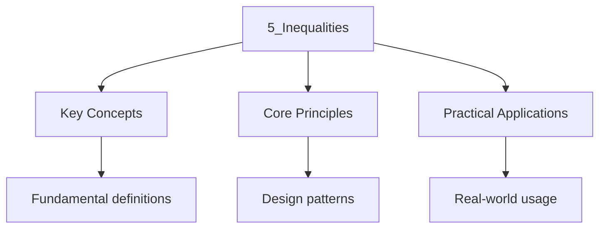

<!-- Breadcrumb Schema for SEO -->

An inequality states that one expression is greater than or less than another. Inequalities arise
when finding the [domain](1_functions.mdx#definition-of-a-function) and
[range](1_functions.mdx#definition-of-a-function) of functions, and are closely related to
[quadratic functions](1_functions.mdx#quadratic-functions) through their graphical interpretation.

## Inequality Rules

### Basic Properties

Let $a$, $b$ And $c$ be real numbers. The following properties hold for inequalities:

**Addition property:**

$$
A > b \implies a + c > b + c
$$

Adding the same quantity to both sides preserves the inequality.

**Multiplication by a positive number:**

$$
A > b,\; c > 0 \implies ac > bc
$$

**Multiplication by a negative number (reversal):**

$$
A > b,\; c < 0 \implies ac < bc
$$

This is the most important rule to remember: multiplying or dividing both sides by a **negative**
Number **reverses** the inequality sign.

### Transitivity

$$
A > b \mathrm{ and } b > c \implies a > c
$$

### Other Properties

- If $a > b > 0$ Then $a^2 > b^2$ and $\dfrac{1}{a} < \dfrac{1}{b}$.
- If $a > b$ and $c > d$ Then $a + c > b + d$.
- If $a > b > 0$ and $c > d > 0$ Then $ac > bd$.

Examples

- $3 > 1 \implies 3 + 5 > 1 + 5$I.e., $8 > 6$.
- $4 > 2$ and $3 > 0 \implies 4 \times 3 > 2 \times 3$I.e., $12 > 6$.
- $5 > 2$ and $-3 < 0 \implies 5 \times (-3) < 2 \times (-3)$I.e., $-15 < -6$.
- $7 > 5 > 2 \implies 7 > 2$ (transitivity).
- $3 > 2 > 0 \implies 9 > 4$ and $\dfrac{1}{3} < \dfrac{1}{2}$.

## Linear Inequalities

### Solving Linear Inequalities

A linear inequality has the form $ax + b > c$ or $ax + b < c$Where $a \neq 0$. The solution
Procedure mirrors that of linear equations, with one critical exception: when multiplying or
Dividing by a negative number, the inequality sign must be reversed.

**General method:**

1. Collect like terms on each side.
2. Isolate the variable by performing the same operation on both sides.
3. Reverse the inequality sign if multiplying or dividing by a negative number.

### Number Line Representation

The solution of a linear inequality in one variable is an interval, which can be represented on a
Number line:

- An **open circle** ($\circ$) indicates a strict inequality ($<$ or $>$).
- A **closed circle** ($\bullet$) indicates an inclusive inequality ($\leq$ or $\geq$).

Examples

- Solve $3x - 7 > 5$:

$$
3x > 12 \implies x > 4
$$

The solution set is $(4, \infty)$.

- Solve $2x + 3 \leq x - 4$:

$$
2x - x \leq -4 - 3 \implies x \leq -7
$$

The solution set is $(-\infty, -7]$.

- Solve $-2x + 6 < 10$:

$$
-2x < 4 \implies x > -2
$$

Note the reversal of the inequality sign when dividing by $-2$. The solution set is $(-2, \infty)$.

- Solve $5(x - 2) \geq 3x + 4$:

$$
5x - 10 \geq 3x + 4 \implies 2x \geq 14 \implies x \geq 7
$$

The solution set is $[7, \infty)$.

## Quadratic Inequalities

A quadratic inequality has the form $ax^2 + bx + c > 0$, $ax^2 + bx + c < 0$Or their non-strict
Variants, where $a \neq 0$. Solving quadratic inequalities relies on understanding the graph of the
Corresponding [quadratic function](1_functions.mdx#quadratic-functions) $f(x) = ax^2 + bx + c$.

### Graphical Interpretation

The graph of $f(x) = ax^2 + bx + c$ is a parabola. The solution of $f(x) > 0$ corresponds to the
$x$-values where the parabola lies **above** the $x$-axis, and $f(x) < 0$ corresponds to where the
Parabola lies **below** the $x$-axis.

The [discriminant](1_functions.mdx#discriminant) $\Delta = b^2 - 4ac$ determines the number of
Intersections with the $x$-axis:

| Condition    | Parabola and $x$-axis                             | $ax^2 + bx + c > 0$ (for $a > 0$)              |
| ------------ | ------------------------------------------------- | ---------------------------------------------- |
| $\Delta > 0$ | Two distinct intersections at $x = \alpha, \beta$ | $x < \alpha$ or $x > \beta$                    |
| $\Delta = 0$ | One intersection at $x = \alpha$                  | $x \neq \alpha$ (all real $x$ except $\alpha$) |
| $\Delta < 0$ | No intersection                                   | All real $x$ (always true)                     |

### Solving Method

**Using factorization:**

1. Bring all terms to one side so the inequality is in the form $ax^2 + bx + c \gtrless 0$.
2. Factorize (or use the quadratic formula) to find the roots.
3. Draw a sign diagram to determine the sign of the expression in each interval.

**Sign diagram method:**

1. Find the roots of $ax^2 + bx + c = 0$.
2. Mark the roots on a number line, dividing the real line into intervals.
3. Test the sign of the expression in each interval.
4. Select the intervals satisfying the inequality.

Examples

- Solve $x^2 - 5x + 6 > 0$:

Factorize: $(x-2)(x-3) > 0$.

Roots are $x = 2$ and $x = 3$. Since $a = 1 > 0$The parabola opens upward.

Sign diagram:

$$
\begin{array}{c|ccc}
X & (-\infty, 2) & (2, 3) & (3, \infty) \\
\hline
(x-2) & - & + & + \\
(x-3) & - & - & + \\
\hline
(x-2)(x-3) & + & - & +
\end{array}
$$

Solution: $x < 2$ or $x > 3$I.e., $(-\infty, 2) \cup (3, \infty)$.

- Solve $-x^2 + 4x - 3 \geq 0$:

Multiply both sides by $-1$ (reverse inequality): $x^2 - 4x + 3 \leq 0$.

Factorize: $(x-1)(x-3) \leq 0$.

Since $a = 1 > 0$The parabola opens upward. The expression is non-positive between the roots.

Solution: $1 \leq x \leq 3$I.e., $[1, 3]$.

- Solve $x^2 + 2x + 5 < 0$:

Discriminant: $\Delta = 4 - 20 = -16 < 0$.

Since $a = 1 > 0$ and $\Delta < 0$The parabola is always above the $x$-axis.

Solution: $\varnothing$ (no solution).

- Solve $2x^2 - 3x - 2 > 0$:

Factorize: $(2x + 1)(x - 2) > 0$.

Roots: $x = -\dfrac{1}{2}$ and $x = 2$.

Sign diagram:

$$
\begin{array}{c|ccc}
X & \left(-\infty, -\tfrac{1}{2}\right) & \left(-\tfrac{1}{2}, 2\right) & (2, \infty) \\
\hline
(2x+1) & - & + & + \\
(x-2) & - & - & + \\
\hline
(2x+1)(x-2) & + & - & +
\end{array}
$$

Solution: $x < -\dfrac{1}{2}$ or $x > 2$I.e.,
$\left(-\infty, -\dfrac{1}{2}\right) \cup (2, \infty)$.

## Absolute Value Inequalities

The absolute value of a real number $x$Denoted $|x|$Represents its distance from zero on the Number
line. This geometric interpretation is the key to solving absolute value inequalities.

### Fundamental Forms

**$|x| < a$** (where $a > 0$):

Geometrically, $x$ is within distance $a$ from zero.

$$
|x| < a \iff -a < x < a
$$

**$|x| > a$** (where $a > 0$):

Geometrically, $x$ is more than distance $a$ from zero.

$$
|x| > a \iff x < -a \;\mathrm{ or }\; x > a
$$

### General Forms

**$|ax + b| < c$** (where $c > 0$):

$$
|ax + b| < c \iff -c < ax + b < c
$$

This is equivalent to a system of two linear inequalities, which can be solved simultaneously.

**$|ax + b| > c$** (where $c > 0$):

$$
|ax + b| > c \iff ax + b < -c \;\mathrm{ or }\; ax + b > c
$$

This gives two separate linear inequalities, each solved independently.

### Special Cases

- If $c \leq 0$ Then $|x| < c$ has no solution ($\varnothing$).
- If $c < 0$ Then $|x| > c$ is true for all real $x$ ($\mathbb{R}$).
- $|x| \geq a$ and $|x| \leq a$ follow the same patterns with non-strict inequality signs.

Examples

- Solve $|x - 3| < 5$:

$$
-5 < x - 3 < 5 \implies -2 < x < 8
$$

Solution: $(-2, 8)$.

- Solve $|2x + 1| \geq 7$:

$$
2x + 1 \leq -7 \;\mathrm{ or }\; 2x + 1 \geq 7
$$

$$
2x \leq -8 \;\mathrm{ or }\; 2x \geq 6
$$

$$
X \leq -4 \;\mathrm{ or }\; x \geq 3
$$

Solution: $(-\infty, -4] \cup [3, \infty)$.

- Solve $|3x - 6| > 0$:

$$
3x - 6 \neq 0 \implies x \neq 2
$$

Solution: $\mathbb{R} \setminus \{2\}$.

- Solve $|x^2 - 4| < 5$:

$$
-5 < x^2 - 4 < 5 \implies -1 < x^2 < 9
$$

Since $x^2 \geq 0$ for all real $x$The left inequality $-1 < x^2$ is always satisfied.

From $x^2 < 9$: $-3 < x < 3$.

Solution: $(-3, 3)$.

- Solve $|x + 2| \leq -1$:

Since $|x + 2| \geq 0$ for all real $x$It can never be $\leq -1$.

Solution: $\varnothing$.

## Systems of Inequalities

A system of inequalities requires finding the set of values that satisfy **all** inequalities
Simultaneously. The solution set of the system is the **intersection** of the solution sets of the
Individual inequalities.

### Method for Systems of Linear Inequalities

1. Solve each inequality separately.
2. Find the intersection of all solution sets.
3. Represent the combined solution on a number line or using interval notation.

### Systems Involving Quadratic and Absolute Value Inequalities

The same principle applies: solve each inequality independently, then take the intersection of all
Solution sets.

Examples

- Find all $x$ satisfying $x^2 - 4x + 3 < 0$ and $2x - 1 > 3$:

From $x^2 - 4x + 3 < 0$: $(x-1)(x-3) < 0 \implies 1 < x < 3$.

From $2x - 1 > 3$: $2x > 4 \implies x > 2$.

Intersection: $2 < x < 3$I.e., $(2, 3)$.

- Find all $x$ satisfying $|x - 1| \leq 3$ and $x^2 - 9 \leq 0$:

From $|x - 1| \leq 3$: $-3 \leq x - 1 \leq 3 \implies -2 \leq x \leq 4$.

From $x^2 - 9 \leq 0$: $(x-3)(x+3) \leq 0 \implies -3 \leq x \leq 3$.

Intersection: $-2 \leq x \leq 3$I.e., $[-2, 3]$.

- Find all $x$ satisfying $x^2 - 2x - 8 > 0$ and $|x + 1| < 6$:

From $x^2 - 2x - 8 > 0$: $(x-4)(x+2) > 0 \implies x < -2$ or $x > 4$.

From $|x + 1| < 6$: $-6 < x + 1 < 6 \implies -7 < x < 5$.

Intersection: $-7 < x < -2$I.e., $(-7, -2)$.

(Note: the second branch $x > 4$ from the quadratic has no overlap with $x < 5$ beyond $(4, 5)$ But
$x > 4$ and $x < 5$ gives $4 < x < 5$. The full intersection is $(-7, -2) \cup (4, 5)$.)

- Find all $x$ satisfying $x^2 + 1 > 0$ and $x - 3 < 0$:

From $x^2 + 1 > 0$: always true (discriminant $\Delta = -4 < 0$ And $a = 1 > 0$).

From $x - 3 < 0$: $x < 3$.

Intersection: $(-\infty, 3)$.

---

<!-- Breadcrumb Schema for SEO -->

Wrap-up Questions

1. **Question:** Solve the inequality $\dfrac{2x - 1}{3} \leq \dfrac{x + 2}{4} + 1$.
### Details

Answer

Multiply through by $12$ (the LCM of $3$ and $4$Which is positive so the inequality sign is preserved):

$$
4(2x - 1) \leq 3(x + 2) + 12
$$

$$
8x - 4 \leq 3x + 6 + 12
$$

$$
5x \leq 22 \implies x \leq \frac{22}{5}
$$

Solution: $\left(-\infty, \dfrac{22}{5}\right]$.

1. **Question:** Solve $x^2 - 6x + 9 \geq 0$.

Answer

Factorize: $(x - 3)^2 \geq 0$.

Since $(x - 3)^2 \geq 0$ for all real $x$ (a square is always non-negative), the solution is all
Real numbers.

Solution: $\mathbb{R}$.

1. **Question:** Find the range of $x$ for which $x^2 - 3x - 10 < 0$ and $2x + 1 > 0$ both hold.

Answer

From $x^2 - 3x - 10 < 0$: $(x - 5)(x + 2) < 0 \implies -2 < x < 5$.

From $2x + 1 > 0$: $x > -\dfrac{1}{2}$.

Intersection: $-\dfrac{1}{2} < x < 5$I.e., $\left(-\dfrac{1}{2}, 5\right)$.

1. **Question:** Solve $|3x - 5| < 7$.

Answer

$$
-7 < 3x - 5 < 7
$$

$$
-2 < 3x < 12
$$

$$
-\frac{2}{3} < x < 4
$$

Solution: $\left(-\dfrac{2}{3}, 4\right)$.

1. **Question:** Solve $|2x + 3| \geq x^2 + 2$.

Answer

This inequality combines absolute value and quadratic expressions. Consider two cases.

**Case 1:** $2x + 3 \geq 0$ (i.e., $x \geq -\dfrac{3}{2}$), so $|2x + 3| = 2x + 3$:

$$
2x + 3 \geq x^2 + 2 \implies x^2 - 2x - 1 \leq 0
$$

Roots: $x = \dfrac{2 \pm \sqrt{4 + 4}}{2} = 1 \pm \sqrt{2}$.

So $1 - \sqrt{2} \leq x \leq 1 + \sqrt{2}$.

Combined with $x \geq -\dfrac{3}{2}$:
$\max\!\left(1 - \sqrt{2},\; -\dfrac{3}{2}\right) \leq x \leq 1 + \sqrt{2}$.

Since $1 - \sqrt{2} \approx -0.414 > -\dfrac{3}{2} = -1.5$The constraint is
$1 - \sqrt{2} \leq x \leq 1 + \sqrt{2}$.

**Case 2:** $2x + 3 < 0$ (i.e., $x < -\dfrac{3}{2}$), so $|2x + 3| = -(2x + 3)$:

$$
-2x - 3 \geq x^2 + 2 \implies x^2 + 2x + 5 \leq 0
$$

Discriminant: $\Delta = 4 - 20 = -16 < 0$. Since $a = 1 > 0$The expression is always positive. No
Solution in this case.

Solution: $[1 - \sqrt{2},\; 1 + \sqrt{2}]$.

1. **Question:** For what values of $k$ does the quadratic equation $x^2 + 2kx + k + 6 = 0$ have two
Distinct real roots?

Answer

For two distinct real roots, the [discriminant](1_functions.mdx#discriminant) must satisfy $\Delta > 0$:

$$
\Delta = (2k)^2 - 4(1)(k + 6) = 4k^2 - 4k - 24 > 0
$$

$$
K^2 - k - 6 > 0
$$

Factorize: $(k - 3)(k + 2) > 0$.

Since $a = 1 > 0$The parabola opens upward. The expression is positive outside the roots.

Solution: $k < -2$ or $k > 3$I.e., $(-\infty, -2) \cup (3, \infty)$.

1. **Question:** Solve the system of inequalities $x^2 - 5x + 4 \leq 0$, $|x - 2| \leq 3$ And
$x > 0$.

Answer

From $x^2 - 5x + 4 \leq 0$: $(x-1)(x-4) \leq 0 \implies 1 \leq x \leq 4$.

From $|x - 2| \leq 3$: $-3 \leq x - 2 \leq 3 \implies -1 \leq x \leq 5$.

From $x > 0$: $x \in (0, \infty)$.

Intersection of all three:

- From the first: $[1, 4]$.
- From the second: $[-1, 5]$.
- From the third: $(0, \infty)$.

Combined: $[1, 4]$.

Solution: $[1, 4]$.

1. **Question:** A ball is thrown upward from a height of $2$ m with an initial velocity of $20$
M/s. The height $h$ (in metres) after $t$ seconds is given by $h(t) = -5t^2 + 20t + 2$. During what
Time interval is the ball at a height greater than $17$ m?

Answer

We need $h(t) > 17$:

$$
-5t^2 + 20t + 2 > 17
$$

$$
-5t^2 + 20t - 15 > 0
$$

Divide by $-5$ (reverse inequality):

$$
T^2 - 4t + 3 < 0
$$

Factorize: $(t - 1)(t - 3) < 0 \implies 1 < t < 3$.

The ball is above $17$ m during the interval $(1, 3)$ seconds.

1. **Question:** Solve $\dfrac{x^2 - 4}{x - 1} \geq 0$.

Answer

First note that $x \neq 1$ (the denominator cannot be zero).

Factorize the numerator: $\dfrac{(x-2)(x+2)}{x-1} \geq 0$.

Critical points: $x = -2$, $x = 1$, $x = 2$.

Sign diagram:

$$
\begin{array}{c|cccc}
X & (-\infty, -2) & (-2, 1) & (1, 2) & (2, \infty) \\
\hline
(x-2) & - & - & - & + \\
(x+2) & - & + & + & + \\
(x-1) & - & - & + & + \\
\hline
\dfrac{(x-2)(x+2)}{x-1} & - & + & - & +
\end{array}
$$

The expression is $\geq 0$ when $-2 \leq x < 1$ or $x \geq 2$.

(Note: $x = -2$ is included because the numerator is zero there; $x = 1$ is excluded; $x = 2$ is
Included.)

Solution: $ contains the hardest questions
within the DSE specification for this topic, each with a full worked solution.

**Unit tests** probe edge cases and common misconceptions. **Integration tests** combine
Inequalities with other DSE mathematics topics to test synthesis under exam conditions.

See for instructions on
self-marking and building a personal test matrix.

---

<!-- Breadcrumb Schema for SEO -->

## Rational Inequalities

### Method

To solve $\dfrac{f(x)}{g(x)} > 0$ (or $\geq, <, \leq$):

1. Find the zeros of $f(x)$ and $g(x)$ (the critical points).
2. Note that $g(x) \neq 0$ -- these points are always excluded.
3. Construct a sign diagram across all intervals defined by the critical points.
4. Select intervals satisfying the inequality.
5. Include critical points from the numerator (where $f(x) = 0$) only for $\geq$ or $\leq$.

### Worked Example

Solve $\dfrac{x^2 - 3x + 2}{x + 1} \leq 0$.

Solution

Factor: $\dfrac{(x - 1)(x + 2)}{x + 1} \leq 0$.

Critical points: $x = -2$$x = -1$$x = 1$. Note $x \neq -1$.

| Interval | $(-\infty, -2)$ | $(-2, -1)$ | $(-1, 1)$ | $(1, \infty)$ |
| -------- | --------------- | ---------- | --------- | ------------- |
| Sign     | $-$             | $+$        | $-$       | $+$           |

The expression is $\leq 0$ when $x \leq -2$ or $-1 < x \leq 1$.

Solution: $(-\infty, -2] \cup (-1, 1]$.

---

<!-- Breadcrumb Schema for SEO -->

## DSE Exam Technique

### Showing Working

For inequality problems in DSE Paper 1:

1. When solving quadratic inequalities, always find the roots and sketch the parabola or draw a sign
   chart.
2. When multiplying or dividing by a negative, explicitly state that the inequality sign reverses.
3. For rational inequalities, identify points where the denominator is zero and exclude them.
4. For system of inequalities, draw each solution on a number line and identify the intersection.

### Significant Figures

Exact answers are preferred. If an approximate numerical answer is required, use 3 significant
figures.

### Common DSE Question Types

1. **Quadratic inequalities with parameters** (find the range of a parameter).
2. **Absolute value inequalities** (split into cases).
3. **Rational inequalities** (sign diagram method).
4. **Systems of inequalities** (intersection of solution sets).
5. **Inequalities involving the discriminant** (condition for real roots).

---

<!-- Breadcrumb Schema for SEO -->

## Additional Worked Examples

**Worked Example: Inequality with quadratic and absolute value**

Solve $|x^2 - 4x + 3| < 3x - 5$.

Solution

The RHS must be positive: $3x - 5 > 0 \implies x > \dfrac{5}{3}$.

Case 1: $x^2 - 4x + 3 \geq 0$I.e., $(x-1)(x-3) \geq 0 \implies x \leq 1$ or $x \geq 3$.

Combined with $x > \dfrac{5}{3}$: $x \geq 3$.

The inequality becomes $x^2 - 4x + 3 < 3x - 5 \implies x^2 - 7x + 8 < 0$.

Roots: $x = \dfrac{7 \pm \sqrt{49 - 32}}{2} = \dfrac{7 \pm \sqrt{17}}{2}$.

$\dfrac{7 - \sqrt{17}}{2} \approx 1.44$ and $\dfrac{7 + \sqrt{17}}{2} \approx 5.56$.

Intersection with $x \geq 3$: $3 \leq x < \dfrac{7 + \sqrt{17}}{2}$.

Case 2: $x^2 - 4x + 3 < 0$I.e., $1 < x < 3$.

Combined with $x > \dfrac{5}{3}$: $\dfrac{5}{3} < x < 3$.

The inequality becomes
$-(x^2 - 4x + 3) < 3x - 5 \implies -x^2 + 4x - 3 < 3x - 5 \implies -x^2 + x + 2 < 0 \implies x^2 - x - 2 > 0$.

$(x - 2)(x + 1) > 0 \implies x < -1$ or $x > 2$.

Intersection with $\dfrac{5}{3} < x < 3$: $2 < x < 3$.

Combined solution: $2 < x < \dfrac{7 + \sqrt{17}}{2}$.

**Worked Example: Quadratic inequality with parameter**

Find the range of $m$ such that $mx^2 + (m - 1)x + m > 0$ for all real $x$.

Solution

Case 1: $m = 0$. The inequality becomes $-x > 0 \implies x < 0$Which is not true for all real $x$.
Reject.

Case 2: $m \neq 0$. For $mx^2 + (m-1)x + m > 0$ for all real $x$We need $m > 0$ and $\Delta < 0$:

$$\Delta = (m - 1)^2 - 4m^2 = m^2 - 2m + 1 - 4m^2 = -3m^2 - 2m + 1 < 0$$

$$3m^2 + 2m - 1 > 0 \implies (3m - 1)(m + 1) > 0 \implies m < -1 \;\text{or}\; m > \dfrac{1}{3}$$

Combined with $m > 0$: $m > \dfrac{1}{3}$.

**Worked Example: System with three inequalities**

Solve the system: $x^2 - 2x - 15 \leq 0$$|x - 1| \leq 4$$x > 0$.

Solution

From $x^2 - 2x - 15 \leq 0$: $(x - 5)(x + 3) \leq 0 \implies -3 \leq x \leq 5$.

From $|x - 1| \leq 4$: $-4 \leq x - 1 \leq 4 \implies -3 \leq x \leq 5$.

From $x > 0$: $x \in (0, \infty)$.

Intersection: $(0, 5]$.

---

<!-- Breadcrumb Schema for SEO -->

## DSE Exam-Style Questions

**DSE Practice 1.** Solve $\dfrac{2x - 1}{x + 3} \geq 1$.

Solution

$$\frac{2x - 1}{x + 3} - 1 \geq 0 \implies \frac{2x - 1 - x - 3}{x + 3} \geq 0 \implies \frac{x - 4}{x + 3} \geq 0$$

Critical points: $x = -3$ (excluded) and $x = 4$ (included).

| Interval | $(-\infty, -3)$ | $(-3, 4)$ | $(4, \infty)$ |
| -------- | --------------- | --------- | ------------- |
| Sign     | $+$             | $-$       | $+$           |

Solution: $(-\infty, -3) \cup [4, \infty)$.

**DSE Practice 2.** Find the range of $k$ for which $kx^2 - 2kx + 3 > 0$ for all real $x$.

Solution

Case $k = 0$: $3 > 0$ for all real $x$. So $k = 0$ works.

Case $k \neq 0$: Need $k > 0$ and $\Delta < 0$:

$$\Delta = 4k^2 - 12k = 4k(k - 3) < 0 \implies 0 < k < 3$$

Combined with $k = 0$: the answer is $0 \leq k < 3$.

**DSE Practice 3.** Solve $|2x - 3| > |x + 1|$.

Solution

Square both sides (both sides non-negative):

$$(2x - 3)^2 > (x + 1)^2 \implies 4x^2 - 12x + 9 > x^2 + 2x + 1$$

$$3x^2 - 14x + 8 > 0 \implies (3x - 2)(x - 4) > 0$$

Solution: $x < \dfrac{2}{3}$ or $x > 4$.

**DSE Practice 4.** Find all real values of $x$ satisfying $x^2 - 2|x| - 8 < 0$.

Solution

Let $t = |x| \geq 0$: $t^2 - 2t - 8 < 0 \implies (t - 4)(t + 2) < 0 \implies -2 < t < 4$.

Since $t \geq 0$: $0 \leq t < 4$I.e., $|x| < 4 \implies -4 < x < 4$.

**DSE Practice 5.** Given that $x^2 + 2(k + 1)x + 9 > 0$ for all real $x$Find the range of $k$.

Solution

$\Delta < 0$:
$4(k + 1)^2 - 36 < 0 \implies (k + 1)^2 < 9 \implies -3 < k + 1 < 3 \implies -4 < k < 2$.

**DSE Practice 6.** Solve the inequality $\dfrac{x^2 - x - 6}{x^2 - 4} \leq 0$.

Solution

$$\frac{x^2 - x - 6}{x^2 - 4} = \frac{(x - 3)(x + 2)}{(x - 2)(x + 2)} = \frac{x - 3}{x - 2}$$

For $x \neq -2$.

$\dfrac{x - 3}{x - 2} \leq 0$: $2 < x \leq 3$.

But $x \neq -2$Which is not in $[2, 3]$ anyway.

Solution: $(2, 3]$.

## Common Pitfalls

- **Forgetting to flip the inequality when multiplying/dividing by a negative.** This is the single
  most common error.

- **Including excluded values from the domain.** For $\frac{f(x)}{g(x)} \geq 0$, values where
  $g(x) = 0$ are excluded even though the inequality is non-strict.

- **Wrong quadratic inequality solution.** For $ax^2 + bx + c > 0$ with $a > 0$ and $\Delta < 0$,
  the solution is all real numbers, not "no solution."

- Always identify the domain before solving inequalities involving fractions or square roots.

- Use sign charts for rational and polynomial inequalities — plot critical values and test
  intervals.

- When multiplying by a variable, split into cases based on sign, or use the fact that
  $\frac{f}{g} > 0$ is equivalent to $fg > 0$ (with $g \neq 0$).

- A quadratic $ax^2 + bx + c$ is always positive iff $a > 0$ and $\Delta < 0$.

## Worked Examples

### Example 1: Quadratic inequality with parameter

**Problem.** Find all values of $k$ for which $x^2 + 2kx + k + 8 > 0$ for all real $x$.

**Solution.** For the quadratic to be always positive with leading coefficient $1 > 0$:
$\Delta < 0$. $$(2k)^2 - 4(1)(k+8) < 0 \implies 4k^2 - 4k - 32 < 0 \implies k^2 - k - 8 < 0$$

Roots: $k = \frac{1 \pm \sqrt{1 + 32}}{2} = \frac{1 \pm \sqrt{33}}{2}$

Solution: $\frac{1 - \sqrt{33}}{2} < k < \frac{1 + \sqrt{33}}{2}$.

$\blacksquare$

### Example 2: Rational inequality

**Problem.** Solve $\dfrac{x - 1}{x^2 - 4} \leq 0$.

**Solution.** Domain: $x \neq \pm 2$.

Critical values: $x = -2,\; 1,\; 2$.

Sign chart:

| Interval     | $(-\infty, -2)$ | $(-2, 1)$ | $(1, 2)$ | $(2, \infty)$ |
| ------------ | :-------------: | :-------: | :------: | :-----------: |
| $x - 1$      |       $-$       |    $-$    |   $+$    |      $+$      |
| $(x-2)(x+2)$ |       $+$       |    $-$    |   $-$    |      $+$      |
| Quotient     |       $-$       |    $+$    |   $-$    |      $+$      |

The quotient $\leq 0$ on $(-\infty, -2) \cup [1, 2)$. Note $x = 1$ is included (numerator $= 0$),
but $x = \pm 2$ are excluded.

$\blacksquare$

## Cross-References

| Topic                        | Site    | Link                                                                                                              |
| ---------------------------- | ------- | ----------------------------------------------------------------------------------------------------------------- |
| [Equations and Inequalities] | A-Level | [View](https://alevel-maths-physics.wyattau.com/docs/alevel/maths/pure-mathematics/03-equations-and-inequalities) |
| [Equations and Inequalities] | DSE     | [View](https://dse.wyattau.com/docs/dse/maths/compulsory/5_inequalities)                                          |

======= 3. Misreading the question, particularly with "hence' vs 'hence or otherwise' — the former
requires using previous work.

1. Forgetting to check that solutions satisfy the original equation (especially with squaring both
   sides or dividing by variables).
   > > > > > > > Stashed changes:docs/docs_dse/Maths/compulsory/inequalities.md

## Summary

The key principles covered in this topic are linked in the sub-pages above. Focus on understanding
the definitions, applying the formulas or frameworks, and evaluating strengths and limitations of
each approach.

$$

$$

## Intuition

Behind every scientific discovery and technological innovation lies mathematics. Functions model relationships between variables, statistics reveals patterns in data, and logic ensures rigorous reasoning. Mathematics teaches us to think precisely, solve systematically, and communicate evidently - skills that are valuable far beyond the classroom.
